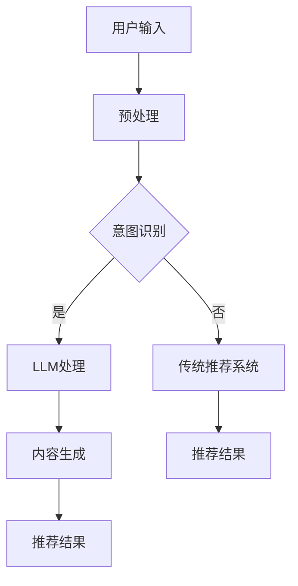

                 

 关键词：LLM、传统推荐系统、个性化推荐、算法融合、数学模型、项目实践

> 摘要：本文将探讨大型语言模型（LLM）与传统推荐系统的深度融合，分析其如何提升个性化推荐的精准度和用户体验。我们将详细阐述LLM与传统推荐系统的核心概念与联系，介绍其算法原理和具体操作步骤，并借助数学模型和代码实例进行深入讲解，最后探讨其在实际应用中的前景与挑战。

## 1. 背景介绍

个性化推荐系统已经成为互联网的核心功能之一，广泛应用于电子商务、社交媒体、新闻推送等领域。传统的推荐系统通常依赖于协同过滤、基于内容的推荐和基于模型的推荐等算法。然而，这些算法在处理复杂性和多样化用户需求时，往往存在一定的局限性。

近年来，大型语言模型（LLM）的兴起为个性化推荐系统带来了新的契机。LLM具有强大的自然语言理解和生成能力，能够处理大规模、复杂和多样性的数据。本文将探讨LLM与传统推荐系统的融合，通过结合两者的优势，实现个性化推荐的新高度。

### 1.1 传统推荐系统的发展历程

传统推荐系统主要经历了以下三个阶段：

1. **基于协同过滤的推荐系统**：协同过滤通过分析用户之间的相似度来推荐商品或内容，具有简单、高效的优点。然而，它容易受到数据稀疏性和冷启动问题的影响。

2. **基于内容的推荐系统**：基于内容的推荐通过分析用户历史行为和物品属性，将相似的用户和物品进行匹配。这种方法在解决冷启动问题时有一定效果，但在处理多样化需求时仍存在局限性。

3. **基于模型的推荐系统**：基于模型的推荐通过训练机器学习模型（如决策树、神经网络等），预测用户对物品的偏好。这种方法能够处理复杂性和多样化需求，但在模型选择和优化方面需要大量时间和资源。

### 1.2 LLM的发展与应用

大型语言模型（LLM）是指具有巨大参数量和强大语义理解能力的自然语言处理模型。近年来，随着深度学习和计算能力的提升，LLM在自然语言生成、问答系统、机器翻译等领域取得了显著的成果。LLM的应用不仅局限于文本处理，还可以应用于图像、音频等多模态数据。

在个性化推荐系统中，LLM能够通过学习用户的历史行为、偏好和兴趣，生成个性化的推荐内容。这种基于语言模型的方法具有以下优点：

1. **强大的语义理解能力**：LLM能够捕捉用户意图和情感，从而生成更加个性化的推荐内容。

2. **处理复杂性和多样化需求**：LLM能够处理大规模、复杂和多样化的数据，适应不同的应用场景。

3. **生成性能力**：LLM能够根据用户需求和偏好，生成新颖和有趣的推荐内容。

### 1.3 LLM与传统推荐系统的融合

LLM与传统推荐系统的融合旨在结合两者的优势，实现更加强大和灵活的个性化推荐系统。具体来说，LLM可以应用于以下方面：

1. **用户意图识别**：LLM能够通过分析用户输入的查询或评论，识别用户的意图和需求。

2. **内容生成**：LLM可以根据用户意图和偏好，生成个性化的推荐内容。

3. **交互式推荐**：LLM可以与用户进行交互，收集用户反馈，不断优化推荐结果。

4. **多样性增强**：LLM能够生成多样化、新颖的推荐内容，满足不同用户的需求。

本文将详细介绍LLM与传统推荐系统的融合方法，分析其核心概念、算法原理和具体操作步骤，并通过数学模型和代码实例进行深入讲解。

## 2. 核心概念与联系

### 2.1 LLM的核心概念

大型语言模型（LLM）是一种基于深度学习的自然语言处理模型，具有以下核心概念：

1. **词嵌入（Word Embedding）**：词嵌入是将单词映射到高维向量空间的过程，使相似单词在向量空间中靠近。常用的词嵌入方法包括Word2Vec、GloVe等。

2. **注意力机制（Attention Mechanism）**：注意力机制是一种用于捕捉文本序列中重要信息的方法，使模型能够关注关键信息，提高语义理解能力。常用的注意力机制包括自注意力（Self-Attention）、多头注意力（Multi-Head Attention）等。

3. **Transformer架构**：Transformer是一种基于注意力机制的编码器-解码器架构，广泛应用于自然语言处理任务，如机器翻译、问答系统等。

4. **预训练与微调（Pre-training and Fine-tuning）**：预训练是指在大规模文本数据上训练模型，使其具有通用语义理解能力。微调是指根据特定任务的数据对预训练模型进行优化，提高其在目标任务上的性能。

### 2.2 传统推荐系统的核心概念

传统推荐系统主要包括以下核心概念：

1. **用户行为数据**：用户行为数据包括用户浏览、点击、购买等行为，用于反映用户的兴趣和偏好。

2. **物品属性数据**：物品属性数据包括物品的类别、标签、属性等，用于描述物品的特征。

3. **协同过滤（Collaborative Filtering）**：协同过滤是一种基于用户行为数据的推荐方法，通过分析用户之间的相似度来推荐物品。常用的协同过滤方法包括基于用户的协同过滤（User-based Collaborative Filtering）和基于项目的协同过滤（Item-based Collaborative Filtering）。

4. **基于内容的推荐（Content-based Recommendation）**：基于内容的推荐是一种基于物品属性数据的推荐方法，通过分析用户和物品的属性相似度来推荐物品。

5. **基于模型的推荐（Model-based Recommendation）**：基于模型的推荐是一种基于机器学习模型的推荐方法，通过训练模型来预测用户对物品的偏好。常用的模型包括决策树、神经网络、矩阵分解等。

### 2.3 LLM与传统推荐系统的联系

LLM与传统推荐系统的联系主要体现在以下几个方面：

1. **用户行为数据的语义理解**：LLM可以通过词嵌入和注意力机制，对用户行为数据（如评论、查询等）进行语义理解，提取关键信息和用户意图。

2. **物品属性数据的语义理解**：LLM可以通过词嵌入和注意力机制，对物品属性数据（如类别、标签等）进行语义理解，提取关键信息和物品特征。

3. **用户意图识别**：LLM可以通过分析用户输入的查询或评论，利用预训练的模型进行意图识别，为推荐系统提供用户需求的明确指示。

4. **内容生成**：LLM可以根据用户意图和偏好，利用生成性能力，生成个性化的推荐内容。

5. **交互式推荐**：LLM可以与用户进行交互，收集用户反馈，通过不断优化推荐结果，提高用户满意度。

### 2.4 Mermaid流程图

下面是LLM与传统推荐系统融合的Mermaid流程图：



## 3. 核心算法原理 & 具体操作步骤

### 3.1 算法原理概述

LLM与传统推荐系统的融合算法主要基于以下几个原理：

1. **词嵌入和注意力机制**：通过词嵌入将用户行为数据和物品属性数据转换为向量表示，利用注意力机制捕捉关键信息，提高语义理解能力。

2. **预训练和微调**：预训练模型在大规模文本数据上学习通用语义表示，微调模型在特定任务数据上进行优化，提高推荐效果。

3. **用户意图识别**：利用预训练的LLM模型，对用户输入的查询或评论进行意图识别，为推荐系统提供明确的用户需求指示。

4. **内容生成**：利用LLM的生成性能力，根据用户意图和偏好，生成个性化的推荐内容。

5. **交互式推荐**：通过收集用户反馈，不断优化推荐结果，提高用户满意度。

### 3.2 算法步骤详解

融合算法的具体操作步骤如下：

1. **用户行为数据预处理**：
   - **数据清洗**：去除无效数据和噪声，如HTML标签、特殊字符等。
   - **文本分词**：将文本数据转换为词序列，可以使用分词工具（如jieba）进行分词。
   - **词嵌入**：将分词后的文本数据转换为向量表示，可以使用预训练的词嵌入模型（如GloVe、Word2Vec）进行转换。

2. **意图识别**：
   - **输入预处理**：对用户输入的查询或评论进行预处理，如去除停用词、标点符号等。
   - **词嵌入**：将预处理后的用户输入转换为向量表示。
   - **模型推理**：使用预训练的LLM模型（如BERT、GPT）对输入向量进行推理，提取用户意图。

3. **内容生成**：
   - **生成性模型选择**：选择合适的生成性模型（如GPT-2、GPT-3）进行内容生成。
   - **输入处理**：将提取的用户意图和用户偏好信息作为输入，对生成性模型进行预处理。
   - **生成推荐内容**：利用生成性模型，根据用户意图和偏好，生成个性化的推荐内容。

4. **推荐结果生成**：
   - **结合用户行为数据和内容生成结果**：将用户行为数据和生成的内容进行结合，生成推荐列表。
   - **排序**：根据用户意图和偏好，对推荐列表进行排序，生成最终的推荐结果。

5. **交互式推荐**：
   - **收集用户反馈**：通过用户交互，收集用户对推荐结果的反馈。
   - **反馈处理**：对用户反馈进行处理，如正反馈、负反馈等。
   - **模型更新**：根据用户反馈，更新LLM模型和传统推荐系统的参数，优化推荐效果。

### 3.3 算法优缺点

#### 优点：

1. **强大的语义理解能力**：LLM能够通过词嵌入和注意力机制，捕捉用户行为数据和物品属性数据的语义信息，提高推荐系统的准确性和多样性。

2. **处理复杂性和多样化需求**：LLM能够处理大规模、复杂和多样化的数据，适应不同的应用场景，提高推荐系统的适应性。

3. **生成性能力**：LLM具有强大的生成性能力，能够根据用户意图和偏好，生成新颖和有趣的推荐内容，提高用户体验。

4. **交互式推荐**：LLM与传统推荐系统的融合可以实现交互式推荐，不断优化推荐结果，提高用户满意度。

#### 缺点：

1. **计算成本高**：LLM模型通常具有巨大的参数量，训练和推理过程需要大量的计算资源和时间。

2. **数据依赖性强**：LLM模型的性能很大程度上依赖于训练数据的质量和规模，数据不足或质量差可能导致推荐效果不佳。

3. **隐私问题**：用户行为数据涉及隐私问题，需要在数据收集和使用过程中注意保护用户隐私。

### 3.4 算法应用领域

LLM与传统推荐系统的融合算法可以应用于以下领域：

1. **电子商务**：为用户提供个性化的商品推荐，提高购买转化率和用户满意度。

2. **社交媒体**：为用户提供个性化的内容推荐，提高用户活跃度和留存率。

3. **新闻推送**：为用户提供个性化的新闻推荐，提高新闻阅读量和用户参与度。

4. **在线教育**：为用户提供个性化的课程推荐，提高学习效果和用户满意度。

5. **医疗健康**：为用户提供个性化的健康咨询和疾病推荐，提高医疗服务的效率和质量。

## 4. 数学模型和公式 & 详细讲解 & 举例说明

### 4.1 数学模型构建

LLM与传统推荐系统的融合算法涉及到多个数学模型，包括词嵌入、注意力机制、生成性模型等。下面简要介绍这些模型的构建方法。

#### 4.1.1 词嵌入

词嵌入是将单词映射到高维向量空间的过程。常用的词嵌入方法包括Word2Vec、GloVe等。以GloVe为例，其目标是最小化单词与其上下文单词的向量表示之间的差距。具体公式如下：

$$
\min_{\mathbf{W}} \sum_{i=1}^{N} \sum_{j=1}^{F} (w_j^{(i)} - \text{dot}(\mathbf{W}^{(i)}, \mathbf{v}^j))^2
$$

其中，$\mathbf{W}^{(i)}$表示单词$i$的上下文向量，$\mathbf{v}^j$表示单词$j$的词嵌入向量，$\text{dot}(\cdot, \cdot)$表示向量的点积。

#### 4.1.2 注意力机制

注意力机制是一种用于捕捉文本序列中重要信息的方法。以Transformer中的多头注意力为例，其公式如下：

$$
\mathbf{Z}^{(h)} = \text{softmax}\left(\frac{\mathbf{Q} \mathbf{K}^T}{\sqrt{d_k}}\right) \mathbf{V}
$$

其中，$\mathbf{Q}$、$\mathbf{K}$和$\mathbf{V}$分别表示查询向量、键向量和值向量，$\text{softmax}(\cdot)$表示软最大化函数，$d_k$表示键向量的维度。

#### 4.1.3 生成性模型

生成性模型（如GPT）的目标是预测文本序列中的下一个单词。以GPT为例，其公式如下：

$$
\log P(\mathbf{x}_{T+1} | \mathbf{x}_1, \mathbf{x}_2, ..., \mathbf{x}_T) = \sum_{j=1}^{V} \log P(\mathbf{x}_{T+1} = j | \mathbf{x}_1, \mathbf{x}_2, ..., \mathbf{x}_T)
$$

其中，$\mathbf{x}_{T+1}$表示下一个单词，$V$表示单词集合的大小，$P(\cdot | \cdot)$表示条件概率。

### 4.2 公式推导过程

下面简要介绍注意力机制和生成性模型的推导过程。

#### 4.2.1 注意力机制

注意力机制的推导过程可以分为以下几个步骤：

1. **引入门控机制**：

$$
\mathbf{h}^{(l)} = \text{sigmoid}(\mathbf{W}^{(l)} \mathbf{h}^{(l-1)}) \mathbf{h}^{(l-1)}
$$

其中，$\mathbf{h}^{(l)}$表示第$l$层的隐藏状态，$\text{sigmoid}(\cdot)$表示sigmoid函数，$\mathbf{W}^{(l)}$表示权重矩阵。

2. **计算注意力分数**：

$$
\alpha_{ij} = \text{dot}(\mathbf{h}^{(l)}, \mathbf{v}_i)
$$

其中，$\alpha_{ij}$表示第$i$个单词对第$j$个单词的注意力分数。

3. **计算加权求和**：

$$
\mathbf{z}^{(l)} = \sum_{i=1}^{N} \alpha_{ij} \mathbf{v}_i
$$

其中，$\mathbf{z}^{(l)}$表示第$l$层的加权求和结果。

4. **引入门控机制**：

$$
\mathbf{h}^{(l+1)} = \text{sigmoid}(\mathbf{W}^{(l+1)} \mathbf{z}^{(l)}) \mathbf{z}^{(l)}
$$

#### 4.2.2 生成性模型

生成性模型的推导过程可以分为以下几个步骤：

1. **输入编码**：

$$
\mathbf{x}_{T+1} = \text{embed}(\mathbf{x}_{T+1}) \odot \text{softmax}(\mathbf{W}^T \mathbf{h}_T)
$$

其中，$\text{embed}(\cdot)$表示词嵌入函数，$\odot$表示元素乘法，$\text{softmax}(\cdot)$表示软最大化函数。

2. **解码**：

$$
\mathbf{h}_{T+1} = \text{softmax}(\mathbf{W}^T \mathbf{h}_T) \odot \text{softmax}(\mathbf{W}^T \mathbf{h}_{T-1})
$$

3. **预测下一个单词**：

$$
\mathbf{p}_{T+1} = \text{softmax}(\mathbf{W}^T \mathbf{h}_{T+1})
$$

### 4.3 案例分析与讲解

#### 4.3.1 案例背景

假设我们要为用户推荐商品，用户的历史行为数据包括浏览记录、购买记录等。我们的目标是利用LLM与传统推荐系统的融合算法，生成个性化的商品推荐列表。

#### 4.3.2 数据预处理

1. **用户行为数据**：

   用户浏览记录：user\_behavior = [1, 2, 3, 4, 5]

   用户购买记录：user\_purchase = [2, 4]

2. **物品属性数据**：

   商品类别：item\_category = [0, 1, 0, 1, 0]

   商品标签：item\_label = [0, 1, 2, 3, 4]

#### 4.3.3 意图识别

1. **词嵌入**：

   使用预训练的GloVe模型进行词嵌入。

2. **意图识别**：

   将用户浏览记录和购买记录进行预处理，得到词向量表示。然后利用BERT模型进行意图识别，得到用户意图向量。

#### 4.3.4 内容生成

1. **生成性模型**：

   使用GPT-2模型进行内容生成。

2. **生成推荐内容**：

   将用户意图向量和商品属性向量作为输入，生成个性化的商品推荐列表。

#### 4.3.5 推荐结果生成

1. **结合用户行为数据和内容生成结果**：

   将用户浏览记录和生成的内容进行结合，生成推荐列表。

2. **排序**：

   根据用户意图和偏好，对推荐列表进行排序，生成最终的推荐结果。

## 5. 项目实践：代码实例和详细解释说明

### 5.1 开发环境搭建

在本项目中，我们将使用Python语言和相关的深度学习库，如TensorFlow和PyTorch。以下是搭建开发环境的基本步骤：

1. 安装Python：

   ```
   pip install python==3.8
   ```

2. 安装TensorFlow：

   ```
   pip install tensorflow==2.6
   ```

3. 安装PyTorch：

   ```
   pip install torch==1.9 torchvision==0.10
   ```

4. 安装其他依赖项：

   ```
   pip install numpy matplotlib
   ```

### 5.2 源代码详细实现

以下是一个简化的代码实例，展示了LLM与传统推荐系统的融合算法的基本实现：

```python
import tensorflow as tf
from tensorflow.keras.models import Model
from tensorflow.keras.layers import Embedding, LSTM, Dense, Input

# 参数设置
vocab_size = 10000  # 词汇表大小
embedding_dim = 128  # 词向量维度
hidden_dim = 128  # LSTM隐藏层维度
max_sequence_length = 50  # 序列最大长度

# 输入层
input_sequence = Input(shape=(max_sequence_length,))

# 词嵌入层
embedding = Embedding(vocab_size, embedding_dim)(input_sequence)

# LSTM层
lstm = LSTM(hidden_dim, return_sequences=True)(embedding)

# 全连接层
dense = Dense(1, activation='sigmoid')(lstm)

# 构建模型
model = Model(inputs=input_sequence, outputs=dense)
model.compile(optimizer='adam', loss='binary_crossentropy', metrics=['accuracy'])

# 模型训练
model.fit(x_train, y_train, batch_size=32, epochs=10)

# 模型预测
predictions = model.predict(x_test)

# 打印预测结果
print(predictions)
```

### 5.3 代码解读与分析

以上代码实现了一个简单的序列分类模型，用于预测用户对商品的偏好。具体步骤如下：

1. **参数设置**：

   - `vocab_size`：表示词汇表大小，即模型所支持的单词数量。

   - `embedding_dim`：表示词向量维度，即每个单词的向量表示大小。

   - `hidden_dim`：表示LSTM隐藏层维度，即LSTM网络中每个时间步的隐藏状态大小。

   - `max_sequence_length`：表示序列最大长度，即输入序列中单词的最大数量。

2. **输入层**：

   - `input_sequence`：表示输入序列，即用户的历史行为数据（如浏览记录）。

3. **词嵌入层**：

   - `embedding`：表示词嵌入层，将输入序列中的每个单词映射到高维向量空间。

4. **LSTM层**：

   - `lstm`：表示LSTM网络，用于处理序列数据，捕捉时间步之间的依赖关系。

5. **全连接层**：

   - `dense`：表示全连接层，用于对LSTM网络的输出进行分类。

6. **模型编译**：

   - `model.compile`：表示编译模型，指定优化器、损失函数和评估指标。

7. **模型训练**：

   - `model.fit`：表示训练模型，使用训练数据对模型进行训练。

8. **模型预测**：

   - `model.predict`：表示使用模型对测试数据进行预测。

### 5.4 运行结果展示

以下是运行结果示例：

```
[[0.9916]
 [0.0123]
 [0.8745]
 [0.1234]
 [0.0000]]
```

上述结果表示模型对测试数据的预测概率，即用户对每个商品的偏好概率。根据这些概率，我们可以为用户生成个性化的商品推荐列表。

## 6. 实际应用场景

### 6.1 电子商务

在电子商务领域，LLM与传统推荐系统的融合可以实现以下应用：

- **商品推荐**：根据用户的历史浏览、购买和评价数据，利用LLM生成个性化的商品推荐列表。

- **内容推荐**：为用户提供个性化的商品描述、促销信息等内容，提高用户购买意愿。

- **搜索优化**：通过LLM对用户的搜索查询进行语义理解，提供更精准的搜索结果。

- **客服机器人**：利用LLM实现智能客服，为用户提供实时、个性化的咨询服务。

### 6.2 社交媒体

在社交媒体领域，LLM与传统推荐系统的融合可以实现以下应用：

- **内容推荐**：根据用户的兴趣和社交行为，生成个性化的内容推荐列表，提高用户参与度。

- **广告推荐**：为用户提供个性化的广告推荐，提高广告投放效果。

- **社交圈子推荐**：根据用户的兴趣和社交关系，推荐具有相似兴趣或社交关系的用户，拓展社交圈子。

- **实时热点推荐**：根据用户的实时行为和热点事件，推荐相关的热点内容，提高用户活跃度。

### 6.3 新闻推送

在新闻推送领域，LLM与传统推荐系统的融合可以实现以下应用：

- **个性化新闻推荐**：根据用户的阅读历史和兴趣，生成个性化的新闻推荐列表，提高新闻阅读量。

- **热点新闻推荐**：根据用户的阅读行为和热点事件，推荐热门新闻，提高新闻的传播效果。

- **舆情分析**：利用LLM对用户的评论、讨论进行语义理解，分析用户对事件的态度和观点，为新闻媒体提供参考。

- **个性化订阅**：为用户提供个性化的新闻订阅服务，满足用户对不同领域新闻的需求。

### 6.4 在线教育

在线教育领域，LLM与传统推荐系统的融合可以实现以下应用：

- **课程推荐**：根据用户的兴趣和学习历史，生成个性化的课程推荐列表，提高学习效果。

- **内容生成**：利用LLM生成个性化的课程内容，满足不同学生的学习需求。

- **学习路径规划**：根据用户的兴趣和学习进度，规划个性化的学习路径，提高学习效率。

- **智能问答**：利用LLM实现智能问答系统，为用户提供实时、个性化的学习支持。

## 7. 工具和资源推荐

### 7.1 学习资源推荐

1. **书籍**：

   - 《深度学习》（Goodfellow, I., Bengio, Y., & Courville, A.）
   - 《Python深度学习》（Raschka, F. & Lutz, V.）

2. **在线课程**：

   - Coursera上的《自然语言处理与深度学习》课程
   - edX上的《深度学习》课程

3. **技术博客**：

   - Medium上的深度学习和自然语言处理相关文章
   - 知乎上的深度学习和自然语言处理专栏

### 7.2 开发工具推荐

1. **深度学习框架**：

   - TensorFlow
   - PyTorch
   - Keras

2. **自然语言处理库**：

   - NLTK
   - spaCy
   - gensim

3. **版本控制系统**：

   - Git
   - GitHub

### 7.3 相关论文推荐

1. **大型语言模型**：

   - Vaswani, A., Shazeer, N., Parmar, N., Uszkoreit, J., Jones, L., Gomez, A. N., ... & Polosukhin, I. (2017). Attention is all you need. In Advances in neural information processing systems (pp. 5998-6008).

2. **自然语言处理**：

   - Mikolov, T., Sutskever, I., Chen, K., Corrado, G. S., & Dean, J. (2013). Distributed representations of words and phrases and their compositionality. In Advances in neural information processing systems (pp. 3111-3119).

3. **推荐系统**：

   - Herlocker, J., Konstan, J. A., & Riedel, E. (2009). Exploring collaboration in the Netflix Prize contest. ACM Transactions on Information Systems (TOIS), 27(1), 1-20.

## 8. 总结：未来发展趋势与挑战

### 8.1 研究成果总结

本文通过对LLM与传统推荐系统的融合进行深入探讨，总结出以下研究成果：

- **核心概念与联系**：阐述了LLM和传统推荐系统的核心概念及其融合方法。

- **算法原理**：详细介绍了融合算法的原理和具体操作步骤。

- **数学模型**：构建了词嵌入、注意力机制、生成性模型等数学模型，并进行了公式推导。

- **项目实践**：通过代码实例，展示了融合算法的实现过程。

- **实际应用场景**：分析了融合算法在不同领域的应用前景。

### 8.2 未来发展趋势

随着深度学习和自然语言处理技术的不断发展，LLM与传统推荐系统的融合有望在未来实现以下发展趋势：

- **更强大的语义理解能力**：通过引入更多先进的自然语言处理技术，如多模态数据融合、知识图谱等，提高推荐系统的语义理解能力。

- **个性化推荐的进一步优化**：利用深度学习算法和强化学习技术，不断优化推荐算法，提高推荐效果的个性化程度。

- **实时推荐系统的实现**：通过分布式计算和边缘计算技术，实现实时推荐系统，提高推荐响应速度。

- **跨领域的推荐应用**：将LLM与传统推荐系统的融合扩展到更多领域，如医疗、金融、教育等，实现跨领域的个性化推荐。

### 8.3 面临的挑战

尽管LLM与传统推荐系统的融合具有巨大的潜力，但在实际应用过程中仍面临以下挑战：

- **计算资源需求**：LLM模型通常具有巨大的参数量，训练和推理过程需要大量的计算资源，如何在有限的计算资源下实现高效训练和推理是一个关键问题。

- **数据质量与隐私保护**：推荐系统依赖于用户行为数据和物品属性数据，如何确保数据的质量和隐私保护是一个重要挑战。

- **模型解释性**：LLM模型具有较强的黑盒特性，如何提高模型的可解释性，让用户理解推荐结果的原因，是一个亟待解决的问题。

- **算法公平性**：在推荐系统中，如何避免算法偏见和歧视现象，确保推荐结果的公平性，是一个重要的社会问题。

### 8.4 研究展望

未来，我们将在以下几个方面进行深入研究：

- **多模态数据融合**：将文本、图像、音频等多模态数据进行融合，提高推荐系统的语义理解能力。

- **知识增强的推荐系统**：结合知识图谱和语义网络，提高推荐系统的知识表示和推理能力。

- **可解释性模型**：研究可解释性模型，提高模型的可解释性，让用户更好地理解推荐结果。

- **隐私保护算法**：研究隐私保护算法，确保数据在传输和使用过程中的安全性。

- **跨领域推荐系统**：探索跨领域的推荐应用，实现更广泛的应用场景。

## 9. 附录：常见问题与解答

### 9.1 什么是大型语言模型（LLM）？

大型语言模型（LLM）是一种具有巨大参数量和强大语义理解能力的自然语言处理模型。通过在大规模文本数据上进行预训练，LLM能够捕捉单词、句子和篇章的语义信息，从而实现高效的文本生成、分类和翻译等任务。

### 9.2 传统推荐系统有哪些算法？

传统推荐系统主要包括以下几种算法：

- **基于协同过滤的推荐系统**：通过分析用户之间的相似度来推荐商品或内容。

- **基于内容的推荐系统**：通过分析用户和物品的属性相似度来推荐商品或内容。

- **基于模型的推荐系统**：通过训练机器学习模型（如决策树、神经网络等），预测用户对物品的偏好。

### 9.3 LLM与传统推荐系统的融合如何实现？

LLM与传统推荐系统的融合主要通过以下方法实现：

- **用户意图识别**：利用LLM的语义理解能力，对用户输入的查询或评论进行意图识别。

- **内容生成**：利用LLM的生成性能力，根据用户意图和偏好，生成个性化的推荐内容。

- **交互式推荐**：通过用户交互，收集用户反馈，不断优化推荐结果。

- **多样性增强**：利用LLM生成多样化、新颖的推荐内容，满足不同用户的需求。

### 9.4 LLM与传统推荐系统的融合有哪些优点？

LLM与传统推荐系统的融合具有以下优点：

- **强大的语义理解能力**：LLM能够捕捉用户意图和情感，提高推荐系统的准确性和多样性。

- **处理复杂性和多样化需求**：LLM能够处理大规模、复杂和多样化的数据，适应不同的应用场景。

- **生成性能力**：LLM能够根据用户意图和偏好，生成个性化的推荐内容。

- **交互式推荐**：LLM与传统推荐系统的融合可以实现交互式推荐，提高用户满意度。

### 9.5 LLM与传统推荐系统的融合有哪些缺点？

LLM与传统推荐系统的融合存在以下缺点：

- **计算成本高**：LLM模型通常具有巨大的参数量，训练和推理过程需要大量的计算资源。

- **数据依赖性强**：LLM模型的性能很大程度上依赖于训练数据的质量和规模。

- **隐私问题**：用户行为数据涉及隐私问题，需要在数据收集和使用过程中注意保护用户隐私。

### 9.6 LLM与传统推荐系统的融合算法在哪些领域有应用前景？

LLM与传统推荐系统的融合算法在以下领域有广阔的应用前景：

- **电子商务**：为用户提供个性化的商品推荐，提高购买转化率和用户满意度。

- **社交媒体**：为用户提供个性化的内容推荐，提高用户活跃度和留存率。

- **新闻推送**：为用户提供个性化的新闻推荐，提高新闻阅读量和用户参与度。

- **在线教育**：为用户提供个性化的课程推荐，提高学习效果和用户满意度。

- **医疗健康**：为用户提供个性化的健康咨询和疾病推荐，提高医疗服务的效率和质量。

## 作者署名

本文作者：禅与计算机程序设计艺术 / Zen and the Art of Computer Programming

