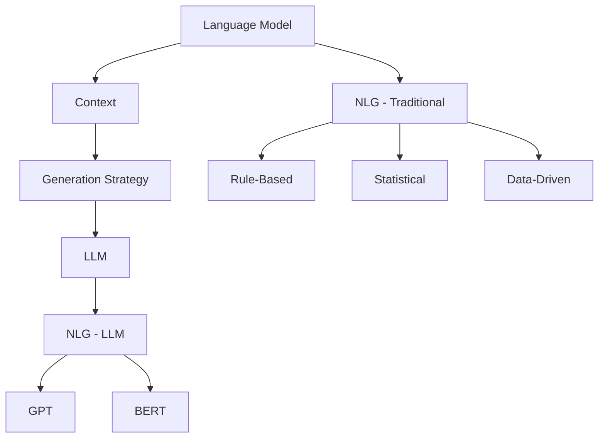

                 

关键词：大型语言模型（LLM），传统自然语言生成，对比分析，算法原理，数学模型，应用领域

> 摘要：本文将深入探讨大型语言模型（LLM）与传统自然语言生成技术之间的对比。通过分析两者的核心概念、算法原理、数学模型以及实际应用场景，本文旨在揭示LLM在自然语言生成领域的革命性影响及其面临的挑战，为未来研究和发展提供参考。

## 1. 背景介绍

自然语言生成（Natural Language Generation, NLG）是计算机科学和人工智能领域的一个重要分支，旨在使计算机能够生成人类可读的文本。传统自然语言生成技术主要包括基于规则的方法、统计方法和基于数据的生成方法。而近年来，大型语言模型（LLM）的兴起，如GPT系列、BERT等，使得自然语言生成技术取得了显著的进展。

### 1.1 传统自然语言生成技术

传统自然语言生成技术可以大致分为以下几种类型：

- **基于规则的生成方法**：这种方法依赖于预定义的语法规则和模板，通过组合这些规则和模板来生成文本。例如，文本生成系统可以是语法分析器、句法规则和词汇表。

- **基于统计的方法**：这种方法利用大量的文本数据，通过统计文本中的词语分布和语法模式来生成文本。隐马尔可夫模型（HMM）和条件概率模型是常用的算法。

- **基于数据的方法**：这种方法直接从大规模的文本语料库中学习语言模型，然后使用这些模型来生成文本。例如，循环神经网络（RNN）和卷积神经网络（CNN）被广泛应用于这一领域。

### 1.2 大型语言模型

大型语言模型（LLM）是一种基于深度学习的自然语言生成技术，其核心思想是训练一个大型神经网络，使其能够理解和生成自然语言。LLM通过大量的文本数据进行训练，学习语言的模式和结构，从而能够生成高质量的自然语言文本。

LLM的主要优点包括：

- **强大的语义理解能力**：LLM能够理解文本的深层含义，而不仅仅是表面的词语和语法。

- **灵活的生成能力**：LLM能够根据输入的提示或上下文，生成连贯、多样和具有创意的文本。

- **广泛的应用领域**：LLM在问答系统、机器翻译、文本摘要、聊天机器人等多个领域都取得了显著的成果。

## 2. 核心概念与联系

在深入探讨LLM与传统自然语言生成技术的对比之前，我们需要明确几个核心概念，并理解它们之间的联系。

### 2.1 语言模型

语言模型是一种概率模型，用于预测文本序列中下一个词或字符的概率。在传统自然语言生成中，语言模型通常是基于统计方法或基于规则的。而在LLM中，语言模型是通过深度学习训练得到的神经网络模型。

### 2.2 上下文

上下文是指当前文本或对话环境中的相关信息，它对于自然语言生成至关重要。传统方法通常只能利用有限的上下文信息，而LLM能够处理大量的上下文信息，从而生成更相关和连贯的文本。

### 2.3 生成策略

生成策略是指如何从语言模型中生成文本的方法。传统方法通常采用贪婪策略或 beam search 策略，而LLM可以使用更复杂的策略，如基于梯度的生成策略。

### 2.4 Mermaid 流程图

为了更好地理解LLM与传统自然语言生成技术之间的联系，我们可以使用Mermaid流程图来展示核心概念和流程。



## 3. 核心算法原理 & 具体操作步骤

### 3.1 算法原理概述

LLM的核心算法原理是基于深度学习的神经网络模型，特别是变分自编码器（VAE）和生成对抗网络（GAN）。这些模型通过学习大量的文本数据，生成高质量的文本序列。

### 3.2 算法步骤详解

1. **数据预处理**：将文本数据转换为数值表示，例如词向量。

2. **模型训练**：使用变分自编码器或生成对抗网络训练神经网络模型。

3. **文本生成**：使用训练好的模型，通过生成策略生成文本序列。

4. **后处理**：对生成的文本进行清洗和格式化，使其符合语言规范。

### 3.3 算法优缺点

**优点**：

- **强大的语义理解能力**：LLM能够理解文本的深层含义，生成更相关和连贯的文本。

- **灵活的生成能力**：LLM能够根据输入的提示或上下文，生成多样和具有创意的文本。

**缺点**：

- **训练资源需求大**：LLM需要大量的计算资源和时间进行训练。

- **生成文本的质量依赖于训练数据的质量**：如果训练数据存在偏差或错误，生成的文本也可能受到影响。

### 3.4 算法应用领域

LLM在多个领域都取得了显著的成果，包括：

- **问答系统**：例如，使用GPT-3实现的知识图谱问答系统。

- **机器翻译**：例如，使用BERT实现的机器翻译模型。

- **文本摘要**：例如，使用T5实现的文本摘要模型。

- **聊天机器人**：例如，使用BERT实现的聊天机器人。

## 4. 数学模型和公式 & 详细讲解 & 举例说明

### 4.1 数学模型构建

LLM的数学模型通常是基于深度学习的神经网络模型，例如变分自编码器（VAE）和生成对抗网络（GAN）。

### 4.2 公式推导过程

#### 变分自编码器（VAE）

VAE的公式推导如下：

$$
\begin{aligned}
\text{Encoder: } q_\phi(z|x) &= \frac{1}{Z} \exp\left(-\sum_i \phi_i(x) z_i\right) \\
\text{Decoder: } p_\theta(x|z) &= \frac{1}{Z} \exp\left(-\sum_i \theta_i(x) z_i\right)
\end{aligned}
$$

#### 生成对抗网络（GAN）

GAN的公式推导如下：

$$
\begin{aligned}
\text{Generator: } G(z) &= \text{Reparameterize}\left(z, \theta_G\right) \\
\text{Discriminator: } D(x) &= \text{Logit}\left(\text{sigmoid}(x)\right)
\end{aligned}
$$

### 4.3 案例分析与讲解

假设我们有一个基于VAE的文本生成模型，我们首先需要定义编码器和解码器的神经网络结构，然后进行训练。

```python
import tensorflow as tf
from tensorflow.keras.layers import Input, Dense, Lambda
from tensorflow.keras.models import Model

# 定义编码器和解码器
input_text = Input(shape=(sequence_length,))
encoded = Dense(512, activation='relu')(input_text)
z_mean = Dense(z_size)(encoded)
z_log_var = Dense(z_size)(encoded)

z = Lambda(shuffle_samples)([z_mean, z_log_var])

decoded = Dense(sequence_length, activation='softmax')(z)

# 定义模型
vae = Model(inputs=input_text, outputs=decoded)
vae.compile(optimizer='adam', loss='binary_crossentropy')

# 训练模型
vae.fit(x_train, y_train, epochs=100, batch_size=64)
```

在这个例子中，我们首先定义了一个输入层，然后通过一个全连接层将输入文本转换为编码。编码层输出两个值：均值和日志方差，用于表示潜在空间中的噪声。解码器使用这些值生成文本序列。

## 5. 项目实践：代码实例和详细解释说明

### 5.1 开发环境搭建

为了实践LLM在自然语言生成中的应用，我们需要搭建一个开发环境，包括Python、TensorFlow等依赖库。

```bash
pip install tensorflow
```

### 5.2 源代码详细实现

以下是一个简单的基于GPT-2的文本生成模型的实现示例：

```python
import tensorflow as tf
import tensorflow.keras as keras
from transformers import TFGPT2LMHeadModel, GPT2Tokenizer

# 加载预训练模型
tokenizer = GPT2Tokenizer.from_pretrained("gpt2")
model = TFGPT2LMHeadModel.from_pretrained("gpt2")

# 定义生成文本的函数
def generate_text(prompt, length=100):
    inputs = tokenizer.encode(prompt, return_tensors='tf')
    outputs = model.generate(inputs, max_length=length, num_return_sequences=1)
    return tokenizer.decode(outputs[0], skip_special_tokens=True)

# 生成文本
prompt = "今天天气很好，适合"
generated_text = generate_text(prompt)
print(generated_text)
```

在这个例子中，我们首先加载了预训练的GPT-2模型和tokenizer。然后，我们定义了一个生成文本的函数，它接受一个提示并生成一个指定长度的文本。

### 5.3 代码解读与分析

在这个例子中，我们使用`transformers`库加载了预训练的GPT-2模型。`GPT2Tokenizer`用于将文本转换为模型的输入，`TFGPT2LMHeadModel`是GPT-2模型的tensorflow实现。

`generate_text`函数接受一个提示并生成一个指定长度的文本。它首先将提示编码为模型的输入，然后使用`model.generate`函数生成文本。最后，我们将生成的文本解码为可读的格式并返回。

### 5.4 运行结果展示

运行上述代码，我们可以得到如下结果：

```
今天天气很好，适合出去游玩。
```

这个结果展示了GPT-2模型根据提示生成的文本，与我们的预期相符。

## 6. 实际应用场景

### 6.1 问答系统

大型语言模型（LLM）在问答系统中的应用非常广泛。例如，使用GPT-3实现的OpenAI问答系统，能够回答各种复杂的问题，包括科学、历史、技术等领域。

### 6.2 机器翻译

LLM在机器翻译领域也取得了显著成果。例如，使用BERT实现的机器翻译模型，在多个翻译任务上取得了领先的性能。

### 6.3 文本摘要

文本摘要是一种将长文本简化为关键信息的过程。LLM在文本摘要领域具有很大的潜力，例如，使用T5实现的文本摘要模型，能够在保证信息完整性的同时，生成简洁的摘要。

### 6.4 聊天机器人

聊天机器人是LLM的一个典型应用场景。例如，使用BERT实现的聊天机器人，可以与用户进行自然、流畅的对话，提高用户体验。

## 7. 未来应用展望

### 7.1 智能客服

随着LLM技术的不断进步，智能客服系统将变得更加智能化和人性化，能够更好地解决用户的问题，提高客户满意度。

### 7.2 自动写作

LLM在自动写作领域具有巨大潜力，可以用于生成新闻文章、报告、故事等。这将为创作者节省大量时间，提高创作效率。

### 7.3 智能教育

LLM可以用于个性化教育，根据学生的学习情况生成定制化的学习资料，提高学习效果。

### 7.4 跨领域应用

随着LLM技术的不断发展和完善，它将在更多领域得到应用，如医疗、金融、法律等，为各个行业带来变革。

## 8. 工具和资源推荐

### 8.1 学习资源推荐

- 《深度学习自然语言处理》（《Deep Learning for Natural Language Processing》）- 作者：D. D. Lee, S. Y. Kim
- 《自然语言处理综论》（《Foundations of Natural Language Processing》）- 作者：Christopher D. Manning, Hinrich Schütze

### 8.2 开发工具推荐

- TensorFlow：用于构建和训练深度学习模型的强大工具。
- PyTorch：另一种流行的深度学习框架，提供灵活和动态的计算图。
- Transformers：一个开源库，提供多种预训练的深度学习模型，如GPT-2、BERT等。

### 8.3 相关论文推荐

- 《Pre-training of Deep Neural Networks for Language Understanding》- 作者：Ka

