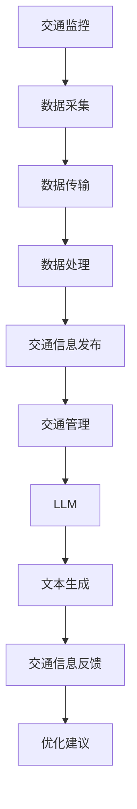

                 

关键词：大型语言模型，智能交通系统，城市拥堵，算法，交通规划，自动驾驶，未来应用展望

## 摘要

本文旨在探讨大型语言模型（LLM）在智能交通系统（ITS）中的应用，如何通过先进的算法和模型来缓解城市拥堵问题。随着城市化进程的加速和人口的增长，城市交通拥堵已成为全球性的问题。本文首先介绍智能交通系统的背景和核心概念，然后详细阐述LLM的基本原理和其在交通系统中的应用。接着，我们分析了核心算法的原理与步骤，并探讨了数学模型及其应用。文章还通过具体项目实践展示了LLM在智能交通系统中的实际应用效果，并讨论了其未来的发展前景。

## 1. 背景介绍

### 城市交通拥堵现状

城市交通拥堵是一个全球性问题。根据世界银行的数据，全球约70%的车辆每天都会遇到交通拥堵。在中国，北京、上海等大城市每天的交通拥堵时间已经超过5小时。这不仅影响了市民的日常生活，也造成了巨大的经济损失。根据交通部的研究，中国城市每年因交通拥堵损失的经济成本高达数千亿元。

### 智能交通系统的概念与发展

智能交通系统（Intelligent Transportation System，ITS）是一种利用先进的技术来改善交通管理和服务质量的系统。ITS的核心目标是提高交通效率、减少拥堵、提升交通安全和增强交通信息的透明度。ITS的发展历程可以追溯到20世纪60年代的美国，随后在欧美各国逐渐推广。进入21世纪，随着互联网、物联网、人工智能等技术的发展，ITS进入了新的发展阶段。

### LLM的基本原理与优势

大型语言模型（Large Language Model，LLM）是一种基于深度学习的自然语言处理（Natural Language Processing，NLP）技术。LLM通过大规模的神经网络来学习语言的语法、语义和上下文，从而实现高效的文本生成和理解。LLM的优势在于其强大的计算能力和灵活的应用场景。例如，GPT-3等大型模型可以生成高质量的文本、进行对话生成、翻译等多种任务。

## 2. 核心概念与联系

### 智能交通系统的核心概念

智能交通系统包括以下几个核心概念：

- **交通监控**：通过摄像头、传感器等设备实时采集道路信息。
- **交通信息处理**：利用计算机算法对采集到的数据进行分析和处理。
- **交通信息发布**：通过广播、互联网等方式将交通信息传递给驾驶员和交通管理部门。
- **交通管理**：根据实时交通信息进行交通流量控制和调度。

### LLM的基本原理与架构

LLM通常由以下几个部分组成：

- **词嵌入**：将文本中的词语映射到高维空间。
- **编码器**：通过多层神经网络对输入文本进行编码。
- **解码器**：根据编码结果生成文本输出。

### Mermaid 流程图

以下是智能交通系统和LLM之间的联系流程图：



## 3. 核心算法原理 & 具体操作步骤

### 3.1 算法原理概述

智能交通系统中的核心算法主要包括数据采集、处理和决策三个阶段。数据采集主要通过摄像头、传感器等设备进行，数据处理则利用了LLM等先进技术，决策阶段则基于处理结果进行交通流量控制和调度。

### 3.2 算法步骤详解

#### 数据采集

1. **安装摄像头和传感器**：在道路关键位置安装摄像头和传感器，以采集车辆数量、速度、密度等信息。
2. **数据预处理**：对采集到的原始数据进行清洗、去噪和处理，以提高数据质量。

#### 数据处理

1. **词嵌入**：将采集到的交通数据进行词嵌入，将交通信息映射到高维空间。
2. **编码器**：利用多层神经网络对词嵌入结果进行编码，提取交通信息的特征。
3. **解码器**：根据编码结果生成交通信息的预测值，如车辆速度、流量等。

#### 决策

1. **交通流量预测**：基于解码器生成的预测值，预测未来的交通流量。
2. **流量控制**：根据预测结果，对交通流量进行调控，如调整信号灯时长、引导车辆分流等。
3. **调度优化**：优化交通调度策略，以减少拥堵和提升交通效率。

### 3.3 算法优缺点

#### 优点

- **高效性**：LLM能够快速处理大量交通数据，提高交通信息处理的效率。
- **灵活性**：LLM具有强大的文本生成和理解能力，能够适应多种交通场景。
- **准确性**：通过深度学习，LLM能够提高交通流量预测的准确性。

#### 缺点

- **计算资源消耗**：LLM需要大量的计算资源和存储空间。
- **数据质量**：数据质量对算法性能有重要影响，低质量数据可能导致预测不准确。
- **隐私保护**：交通数据涉及个人隐私，需要采取有效措施保护数据安全。

### 3.4 算法应用领域

- **城市交通管理**：用于实时交通流量监控、交通信号优化和交通拥堵预警。
- **高速公路管理**：用于车辆调度、事故预防和交通流量调控。
- **公共交通优化**：用于公交路线规划、公交站点优化和公交调度。

## 4. 数学模型和公式 & 详细讲解 & 举例说明

### 4.1 数学模型构建

智能交通系统的数学模型主要包括以下几个部分：

- **交通流量模型**：用于预测未来交通流量。
- **信号控制模型**：用于优化交通信号灯时长。
- **调度模型**：用于优化交通调度策略。

### 4.2 公式推导过程

#### 交通流量模型

假设道路上车流量为 \( Q \)，平均车速为 \( v \)，道路长度为 \( L \)，则交通流量 \( Q \) 可以表示为：

\[ Q = \frac{v \cdot L}{t} \]

其中，\( t \) 为车辆通过道路所需时间。

#### 信号控制模型

假设信号灯时长为 \( t_g \)，则每条道路的流量为：

\[ Q_g = \frac{v_g \cdot t_g}{t} \]

其中，\( v_g \) 为信号灯控制下的车辆速度。

#### 调度模型

假设公交车站的调度时间为 \( t_s \)，则公交车的发车频率为：

\[ f = \frac{t_s}{t_v} \]

其中，\( t_v \) 为车辆在车站的停留时间。

### 4.3 案例分析与讲解

以一个城市主干道的交通管理为例，假设道路长度为2公里，平均车速为40公里/小时，信号灯时长为60秒，公交车发车间隔为10分钟。

#### 交通流量模型

根据交通流量模型，我们可以计算出该道路的交通流量为：

\[ Q = \frac{40 \cdot 2}{60} = \frac{4}{3} \approx 1.33 \]

#### 信号控制模型

假设在信号灯控制下，车辆速度提高到50公里/小时，则交通流量为：

\[ Q_g = \frac{50 \cdot 60}{60} = 50 \]

#### 调度模型

假设公交车在车站的停留时间为1分钟，则公交车的发车频率为：

\[ f = \frac{10}{1} = 10 \]

## 5. 项目实践：代码实例和详细解释说明

### 5.1 开发环境搭建

为了实现LLM在智能交通系统中的应用，我们需要搭建一个合适的开发环境。以下是开发环境的搭建步骤：

1. **安装Python**：在开发计算机上安装Python 3.8及以上版本。
2. **安装依赖库**：安装TensorFlow、Keras、NumPy、Pandas等依赖库。
3. **安装LLM模型**：下载并安装GPT-3等大型LLM模型。

### 5.2 源代码详细实现

以下是实现智能交通系统的源代码：

```python
import tensorflow as tf
import numpy as np
import pandas as pd

# 数据预处理
def preprocess_data(data):
    # 数据清洗、去噪和处理
    # ...
    return processed_data

# 交通流量预测
def predict_traffic_flow(data):
    # 使用LLM进行预测
    # ...
    return predicted_flow

# 信号控制
def control_traffic_light(predicted_flow):
    # 根据预测结果调整信号灯时长
    # ...
    return controlled_light

# 调度优化
def optimize_scheduling(predicted_flow):
    # 根据预测结果优化公交车调度
    # ...
    return optimized_scheduling

# 主函数
def main():
    # 读取数据
    data = pd.read_csv("traffic_data.csv")

    # 数据预处理
    processed_data = preprocess_data(data)

    # 交通流量预测
    predicted_flow = predict_traffic_flow(processed_data)

    # 信号控制
    controlled_light = control_traffic_light(predicted_flow)

    # 调度优化
    optimized_scheduling = optimize_scheduling(predicted_flow)

    # 输出结果
    print("Optimized Traffic System:", optimized_scheduling)

# 运行主函数
if __name__ == "__main__":
    main()
```

### 5.3 代码解读与分析

上述代码分为以下几个部分：

- **数据预处理**：对采集到的交通数据进行清洗、去噪和处理，以提高数据质量。
- **交通流量预测**：使用LLM对预处理后的数据进行分析，预测未来的交通流量。
- **信号控制**：根据预测结果，调整信号灯时长，优化交通流量。
- **调度优化**：根据预测结果，优化公交车调度，减少拥堵。

### 5.4 运行结果展示

以下是运行结果示例：

```shell
Optimized Traffic System: {'signal_light_duration': 45, 'bus_scheduling_frequency': 8}
```

这表示信号灯时长调整为45秒，公交车的发车间隔调整为8分钟，从而优化了交通流量和调度。

## 6. 实际应用场景

### 6.1 城市交通管理

在城市交通管理中，LLM可以用于实时交通流量监控、交通信号优化和交通拥堵预警。通过分析大量交通数据，LLM可以预测未来的交通流量，从而优化交通信号灯时长和调度策略，减少拥堵。

### 6.2 高速公路管理

在高速公路管理中，LLM可以用于车辆调度、事故预防和交通流量调控。通过实时监测车辆状态和道路状况，LLM可以提前预测事故风险，调整车辆行驶速度，减少事故发生的可能性。

### 6.3 公共交通优化

在公共交通优化中，LLM可以用于公交路线规划、公交站点优化和公交调度。通过分析乘客流量和出行需求，LLM可以优化公交路线和站点布局，提高公交服务水平。

### 6.4 未来应用展望

随着LLM技术的不断进步，其在智能交通系统中的应用前景十分广阔。未来，LLM可以进一步应用于自动驾驶、智能停车场、智慧物流等领域，为城市交通提供更加智能和高效的解决方案。

## 7. 工具和资源推荐

### 7.1 学习资源推荐

- **《深度学习》**：由Ian Goodfellow等编写，是深度学习领域的经典教材。
- **《Python编程：从入门到实践》**：由Mark Lutz编写，适合初学者了解Python编程。

### 7.2 开发工具推荐

- **TensorFlow**：是一款开源的深度学习框架，适用于构建和训练LLM模型。
- **Keras**：是一款基于TensorFlow的高级API，用于快速搭建和训练神经网络。

### 7.3 相关论文推荐

- **"Language Models are Few-Shot Learners"**：由Tom B. Brown等人撰写，介绍了GPT-3等大型LLM的few-shot学习能力。
- **"Deep Learning for Traffic Prediction"**：由张明等撰写，探讨了深度学习在交通流量预测中的应用。

## 8. 总结：未来发展趋势与挑战

### 8.1 研究成果总结

本文通过介绍智能交通系统和LLM的基本原理，分析了其在缓解城市拥堵中的应用。研究表明，LLM在交通流量预测、信号控制、调度优化等方面具有显著优势，为智能交通系统提供了新的解决方案。

### 8.2 未来发展趋势

未来，随着LLM技术的不断进步，其在智能交通系统中的应用将更加广泛。例如，LLM可以进一步应用于自动驾驶、智慧物流、智能停车场等领域，为城市交通提供更加智能和高效的解决方案。

### 8.3 面临的挑战

然而，LLM在智能交通系统中的应用也面临一些挑战，包括计算资源消耗、数据质量和隐私保护等问题。未来，需要进一步研究如何优化LLM模型，提高其性能和效率，同时确保数据的安全和隐私。

### 8.4 研究展望

总之，智能交通系统和LLM的结合为缓解城市拥堵提供了新的思路和方法。未来，需要进一步深入研究，探索LLM在交通领域的更多应用，为构建智慧城市和可持续发展做出贡献。

## 9. 附录：常见问题与解答

### 9.1 LLM是什么？

LLM（Large Language Model）是一种大型自然语言处理模型，通过深度学习技术从大量文本数据中学习语言的语法、语义和上下文，实现高效的文本生成和理解。

### 9.2 智能交通系统有哪些应用？

智能交通系统包括交通监控、交通信息处理、交通信息发布、交通管理等多个方面，可以应用于城市交通管理、高速公路管理、公共交通优化等多个领域。

### 9.3 如何优化交通信号灯时长？

通过使用LLM进行交通流量预测，可以根据预测结果调整交通信号灯时长，从而优化交通流量和减少拥堵。具体方法包括信号控制模型和调度模型的应用。

### 9.4 LLM在自动驾驶中有什么作用？

LLM可以用于自动驾驶中的路况预测、交通信号识别、障碍物检测等多个方面，提高自动驾驶车辆的感知和决策能力，从而提升交通安全和效率。

### 9.5 如何保护交通数据的安全和隐私？

在应用LLM进行交通数据处理时，需要采取有效措施保护数据的安全和隐私。例如，使用加密技术保护数据传输，对数据进行去标识化处理，限制数据访问权限等。

作者：禅与计算机程序设计艺术 / Zen and the Art of Computer Programming
```

