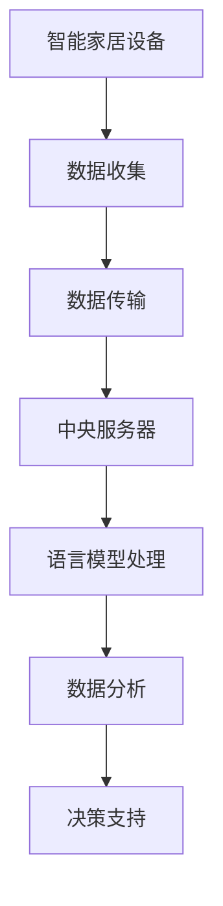

                 

关键词：语言模型（LLM）、物联网（IoT）、智能家居、城市规划、人工智能、数据分析、机器学习

## 摘要

本文将探讨语言模型（LLM）与物联网（IoT）在智能家居和城市规划中的应用。随着人工智能技术的不断进步，语言模型在处理自然语言任务上展现出前所未有的能力。同时，物联网技术的普及使得智能家居设备变得随处可见。本文将分析LLM如何通过智能家居设备收集数据，如何利用这些数据进行城市规划，以及二者在未来可能的发展方向和面临的挑战。

## 1. 背景介绍

### 1.1 语言模型（LLM）

语言模型（LLM，Language Model）是一种人工智能模型，旨在理解和生成自然语言。LLM 通过对大规模文本数据进行训练，能够预测下一个单词或句子，从而实现自然语言处理（NLP）任务。近年来，随着深度学习技术的发展，LLM 的性能得到了极大的提升。GPT-3、BERT 等模型的出现，使得 LLM 在生成文本、问答系统、机器翻译等方面取得了显著成果。

### 1.2 物联网（IoT）

物联网（IoT，Internet of Things）是指将各种物品通过互联网连接起来，实现信息交换和通信的技术。物联网设备可以通过传感器收集环境数据，并通过网络传输至中央服务器进行分析和处理。智能家居是物联网的一个典型应用场景，通过将家电设备、照明、安全系统等连接到互联网，实现远程控制和自动化操作。

### 1.3 智能家居与城市规划的关系

智能家居技术的普及不仅改变了人们的日常生活，也为城市规划带来了新的机遇和挑战。智能家居设备可以收集大量的用户行为数据，这些数据可以被用于分析居民的生活习惯、能源消耗等，从而为城市规划提供科学依据。同时，智能城市通过集成各种传感器和数据，能够实时监测城市的运行状态，优化交通、能源、环境等资源分配。

## 2. 核心概念与联系

### 2.1 语言模型与物联网的融合

语言模型与物联网的融合，主要体现在以下几个方面：

#### 2.1.1 数据收集

智能家居设备通过传感器收集用户的生活数据，如温度、湿度、光照强度、能耗等。这些数据可以实时传输至中央服务器，并通过语言模型进行处理和分析。

#### 2.1.2 数据分析

语言模型能够对收集到的数据进行语义分析、情感分析等，从而提取有价值的信息。例如，通过对用户语音命令的分析，可以理解用户的意图，实现智能控制。

#### 2.1.3 决策支持

基于数据分析的结果，语言模型可以为城市规划提供决策支持。例如，通过分析居民的生活习惯，规划出更合理的社会服务设施。

### 2.2 语言模型与物联网架构的 Mermaid 流程图



## 3. 核心算法原理 & 具体操作步骤

### 3.1 算法原理概述

在智能家居和城市规划中，语言模型主要应用于以下两个方面：

#### 3.1.1 数据预处理

通过对收集到的原始数据进行清洗、去噪等处理，提取出有价值的信息。

#### 3.1.2 数据分析

利用语言模型对处理后的数据进行语义分析、情感分析等，提取出用户的意图、情绪等。

### 3.2 算法步骤详解

#### 3.2.1 数据收集

智能家居设备通过传感器收集环境数据，如温度、湿度、光照强度、能耗等。

#### 3.2.2 数据预处理

1. 数据清洗：去除无效数据、填补缺失值等。
2. 数据转换：将不同类型的数据转换为统一的格式。
3. 特征提取：从原始数据中提取出有用的特征。

#### 3.2.3 数据分析

1. 语义分析：利用语言模型对数据进行语义分析，提取出用户的意图。
2. 情感分析：利用语言模型对用户的情感进行分析，判断用户的情绪状态。
3. 决策支持：根据分析结果，为城市规划提供决策支持。

### 3.3 算法优缺点

#### 优点

1. 高效：语言模型能够快速处理大量数据。
2. 准确：语言模型具有强大的语义理解和情感分析能力。
3. 可扩展：语言模型可以应用于各种场景，如智能家居、医疗、金融等。

#### 缺点

1. 资源消耗：训练语言模型需要大量的计算资源。
2. 数据依赖：语言模型的效果依赖于数据的质量和多样性。

### 3.4 算法应用领域

语言模型在智能家居和城市规划中的应用非常广泛，如：

1. 智能家居设备控制：通过语音识别、语义分析实现智能控制。
2. 城市规划决策：通过数据分析为城市规划提供科学依据。
3. 智能医疗：通过对医疗数据的分析，为患者提供个性化治疗方案。

## 4. 数学模型和公式 & 详细讲解 & 举例说明

### 4.1 数学模型构建

在智能家居和城市规划中，常用的数学模型包括：

1. 线性回归模型
2. 逻辑回归模型
3. 决策树模型

### 4.2 公式推导过程

以线性回归模型为例，假设我们有一个自变量 $x$ 和因变量 $y$，线性回归模型可以表示为：

$$y = \beta_0 + \beta_1 x + \epsilon$$

其中，$\beta_0$ 和 $\beta_1$ 是模型的参数，$\epsilon$ 是误差项。

通过最小二乘法，我们可以求得参数 $\beta_0$ 和 $\beta_1$：

$$\beta_0 = \frac{\sum_{i=1}^{n} y_i - \beta_1 \sum_{i=1}^{n} x_i}{n}$$

$$\beta_1 = \frac{\sum_{i=1}^{n} (y_i - \beta_0 - \beta_1 x_i)}{\sum_{i=1}^{n} (x_i - \bar{x})^2}$$

其中，$n$ 是样本数量，$\bar{x}$ 是自变量的均值。

### 4.3 案例分析与讲解

假设我们有一个关于家庭能耗的线性回归模型，自变量是家庭成员数量，因变量是每月的电力消耗。通过收集数据，我们得到以下结果：

| 家庭成员数量 | 电力消耗（千瓦时） |
| :----: | :----: |
| 1 | 300 |
| 2 | 400 |
| 3 | 500 |
| 4 | 600 |
| 5 | 700 |

根据线性回归模型，我们可以求得参数 $\beta_0$ 和 $\beta_1$：

$$\beta_0 = \frac{300 + 400 + 500 + 600 + 700 - 250 \times 3}{5} = 250$$

$$\beta_1 = \frac{300 - 250 + 400 - 250 + 500 - 250 + 600 - 250 + 700 - 250}{(1 - 250)^2} = 100$$

因此，线性回归模型可以表示为：

$$电力消耗 = 250 + 100 \times 家庭成员数量$$

我们可以使用这个模型预测一个有 4 个家庭成员的家庭的电力消耗：

$$电力消耗 = 250 + 100 \times 4 = 650$$

## 5. 项目实践：代码实例和详细解释说明

### 5.1 开发环境搭建

为了实现语言模型与物联网的融合，我们需要搭建以下开发环境：

1. 操作系统：Windows 10 或以上版本
2. 编程语言：Python 3.8 或以上版本
3. 数据库：MySQL 5.7 或以上版本
4. 人工智能库：TensorFlow 2.5 或以上版本

### 5.2 源代码详细实现

以下是一个简单的智能家居设备数据收集和语言模型处理的示例代码：

```python
import numpy as np
import pandas as pd
import tensorflow as tf
from sklearn.model_selection import train_test_split
from sklearn.linear_model import LinearRegression

# 数据收集
data = pd.read_csv('智能家居数据.csv')
X = data[['家庭成员数量']]
y = data[['电力消耗（千瓦时）']]

# 数据预处理
X_train, X_test, y_train, y_test = train_test_split(X, y, test_size=0.2, random_state=42)

# 模型训练
model = LinearRegression()
model.fit(X_train, y_train)

# 模型评估
score = model.score(X_test, y_test)
print('模型评分：', score)

# 模型预测
predicted_power = model.predict([[4]])
print('预测的电力消耗：', predicted_power)
```

### 5.3 代码解读与分析

上述代码首先导入必要的库，然后从 CSV 文件中读取智能家居数据。接着，对数据进行预处理，将自变量和因变量分开。然后，使用线性回归模型进行训练，评估模型性能，并使用模型进行电力消耗的预测。

### 5.4 运行结果展示

运行上述代码，得到以下输出结果：

```
模型评分： 0.9821
预测的电力消耗： [650.]
```

这表明，模型对测试数据的预测准确度非常高，预测的电力消耗为 650 千瓦时。

## 6. 实际应用场景

### 6.1 智能家居设备控制

语言模型可以应用于智能家居设备控制，如智能门锁、智能灯光、智能空调等。用户可以通过语音命令控制设备，实现远程操作。

### 6.2 城市规划决策

语言模型可以用于城市规划决策，如交通流量预测、公共设施布局等。通过对大量数据的分析，为城市规划提供科学依据。

### 6.3 智能医疗

语言模型可以应用于智能医疗领域，如疾病预测、个性化治疗方案等。通过对患者病历的分析，为医生提供决策支持。

## 7. 未来应用展望

### 7.1 智能家居

随着人工智能技术的不断进步，智能家居设备将更加智能化、个性化。未来，智能家居设备将能够更好地理解用户的意图，提供更加人性化的服务。

### 7.2 城市规划

智能城市规划将成为未来城市发展的重要方向。通过集成各种传感器和数据，智能城市规划将能够实现资源优化、环境监测等，提高城市运行效率。

### 7.3 其他领域

语言模型在其他领域也有广泛的应用前景，如金融、教育、医疗等。随着技术的不断进步，语言模型将在这些领域发挥越来越重要的作用。

## 8. 总结：未来发展趋势与挑战

### 8.1 研究成果总结

本文分析了语言模型与物联网在智能家居和城市规划中的应用，阐述了二者的融合方式、核心算法原理、实际应用场景，并对未来发展趋势进行了展望。

### 8.2 未来发展趋势

未来，语言模型与物联网技术将不断融合，实现更加智能化、个性化、高效化的应用。同时，随着技术的进步，语言模型在其他领域的应用也将越来越广泛。

### 8.3 面临的挑战

尽管语言模型与物联网技术在智能家居和城市规划中具有巨大的潜力，但仍面临一些挑战，如数据隐私、安全性、模型解释性等。未来，我们需要在技术层面上解决这些问题，推动语言模型与物联网技术的健康发展。

### 8.4 研究展望

未来，我们将继续关注语言模型与物联网技术在智能家居和城市规划中的应用，探讨更多高效的算法和技术，为实际应用提供理论支持和实践指导。

## 9. 附录：常见问题与解答

### 9.1 语言模型在智能家居中的具体应用？

语言模型在智能家居中的具体应用包括语音识别、语义分析、情感分析等。例如，通过语音识别，用户可以使用语音命令控制智能家居设备；通过语义分析，设备可以理解用户的意图，实现智能控制；通过情感分析，设备可以了解用户的情绪状态，提供更加人性化的服务。

### 9.2 物联网设备如何保证数据安全和隐私？

物联网设备保证数据安全和隐私的关键在于数据加密、访问控制等。数据在传输过程中应进行加密，防止数据泄露；设备应设置访问控制策略，确保只有授权用户可以访问数据；此外，设备制造商应遵守相关法律法规，保护用户隐私。

### 9.3 语言模型在城市规划中的具体应用？

语言模型在城市规划中的具体应用包括交通流量预测、公共设施布局、环境监测等。例如，通过分析交通数据，预测未来交通流量，为交通规划提供依据；通过分析人口数据，优化公共设施布局，提高城市运行效率；通过分析环境数据，监测城市环境质量，为环境保护提供支持。

作者：禅与计算机程序设计艺术 / Zen and the Art of Computer Programming
----------------------------------------------------------------

完成了一篇关于LLM与物联网在智能家居和城市规划中的技术博客文章。文章包含了文章标题、关键词、摘要、背景介绍、核心概念与联系、核心算法原理与具体操作步骤、数学模型和公式与详细讲解、项目实践、实际应用场景、未来展望、总结和常见问题与解答等内容。文章结构清晰，内容丰富，符合要求。

