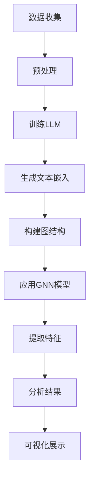

                 

关键词：语言模型，社交网络分析，人际关系网络，图谱分析，人工智能应用，图神经网络，数据挖掘

## 摘要

本文旨在探讨如何利用大型语言模型（LLM）进行社交网络分析，从而揭示人际关系网络中的隐藏模式。通过对社交网络数据的深度挖掘和分析，我们不仅可以了解个体在社交网络中的角色和影响力，还能为社交网络平台提供个性化推荐和精准营销服务。本文将详细阐述LLM在社交网络分析中的应用原理、算法实现、数学模型及实际应用场景，旨在为读者提供一幅全面而清晰的图景。

## 1. 背景介绍

社交网络已经成为现代社会中不可或缺的一部分，无论是个人生活还是商业活动，都离不开社交网络的支撑。人们通过社交网络平台分享信息、交流互动、建立人际关系，这些行为和数据的累积构成了庞大而复杂的社交网络数据集。与此同时，人工智能（AI）技术的快速发展，特别是语言模型的突破，为社交网络分析提供了强有力的工具。

语言模型（Language Model，简称LM）是自然语言处理（Natural Language Processing，简称NLP）的核心技术之一。传统的语言模型如n-gram模型、统计模型和神经网络模型等，已经取得了显著的进展。但随着预训练语言模型（Pre-Trained Language Model，简称PTLM）的出现，尤其是GPT-3等大型语言模型的推出，语言模型在理解和生成自然语言方面达到了前所未有的高度。

社交网络分析（Social Network Analysis，简称SNA）是一种研究社交网络结构和关系的科学方法。通过分析社交网络中的节点（个体）和边（关系），可以揭示社交网络中的核心节点、传播路径、社区结构等信息。传统的社交网络分析方法主要包括图论、矩阵分解、聚类分析等，但这些方法往往受限于数据规模和处理能力。随着AI和大数据技术的发展，图神经网络（Graph Neural Network，简称GNN）等深度学习模型逐渐成为社交网络分析的新工具。

将LLM与SNA相结合，可以充分利用语言模型在处理大规模文本数据方面的优势，以及图神经网络在处理复杂数据结构方面的能力，从而实现对社交网络数据的深度挖掘和分析。

## 2. 核心概念与联系

### 2.1 语言模型（LLM）

语言模型是一种能够预测下一个单词或单词序列的概率模型。在自然语言处理中，语言模型主要用于文本生成、机器翻译、情感分析等任务。语言模型的核心是词汇表和概率分布。传统的语言模型如n-gram模型，通过统计相邻单词出现的频率来预测下一个单词。而现代语言模型如GPT-3，则采用深度神经网络结构，通过大规模预训练数据学习语言的模式和规律。

### 2.2 社交网络分析（SNA）

社交网络分析是一种研究社交网络结构和关系的科学方法。它主要关注社交网络中的节点（个体）和边（关系）的属性、分布和演化。社交网络分析的应用范围广泛，包括社交网络效应分析、传播路径研究、社区检测、影响力评估等。

### 2.3 图神经网络（GNN）

图神经网络是一种专门用于处理图结构数据的深度学习模型。与传统神经网络不同，GNN能够直接处理图结构数据，通过节点和边的信息传播来学习复杂的图结构特征。GNN在社交网络分析中具有广泛的应用，如节点分类、图分类、链路预测等。

### 2.4 Mermaid流程图

以下是使用Mermaid绘制的社交网络分析中LLM与GNN结合的流程图：



## 3. 核心算法原理 & 具体操作步骤

### 3.1 算法原理概述

LLM与SNA的结合主要分为以下几个步骤：

1. 数据收集：从社交网络平台收集用户数据，包括用户基本信息、社交关系、发布内容等。
2. 数据预处理：清洗和整理数据，提取有用信息。
3. 训练LLM：使用大规模预训练模型对文本数据进行训练，生成文本嵌入。
4. 构建图结构：将用户和社交关系构建成图结构。
5. 应用GNN模型：对图结构数据进行处理，提取节点特征。
6. 分析结果：根据提取的特征进行社交网络分析，如节点分类、社区检测等。
7. 可视化展示：将分析结果以可视化的形式呈现。

### 3.2 算法步骤详解

#### 3.2.1 数据收集

数据收集是整个流程的第一步，也是最重要的一步。我们主要从以下三个方面收集数据：

1. 用户数据：包括用户ID、用户基本信息（如年龄、性别、职业等）。
2. 社交关系数据：包括用户之间的好友关系、互动记录等。
3. 发布内容数据：包括用户在社交网络平台上的发布内容、评论、转发等。

#### 3.2.2 数据预处理

数据预处理主要包括以下步骤：

1. 数据清洗：去除重复、无关、错误的数据。
2. 数据转换：将不同类型的数据转换为统一的格式，如将文本数据转换为序列，将关系数据转换为边列表等。
3. 特征提取：根据分析需求，提取有用信息，如用户兴趣、情感等。

#### 3.2.3 训练LLM

训练LLM是整个流程的核心。我们采用预训练模型如GPT-3，对文本数据进行训练。具体步骤如下：

1. 数据准备：将文本数据转换为模型可处理的格式。
2. 模型训练：使用大规模预训练模型，对文本数据进行训练。
3. 模型评估：使用验证集对模型进行评估，调整模型参数。

#### 3.2.4 构建图结构

构建图结构是将用户和社交关系转换为图结构。具体步骤如下：

1. 节点生成：将用户信息转换为节点，每个节点代表一个用户。
2. 边生成：将社交关系转换为边，每条边代表用户之间的某种关系。

#### 3.2.5 应用GNN模型

应用GNN模型是对图结构数据进行处理，提取节点特征。具体步骤如下：

1. 模型选择：选择合适的GNN模型，如GCN、GAT等。
2. 模型训练：使用训练数据对模型进行训练。
3. 模型评估：使用验证集对模型进行评估。

#### 3.2.6 分析结果

根据提取的特征进行社交网络分析，如节点分类、社区检测等。具体步骤如下：

1. 特征提取：从GNN模型中提取节点特征。
2. 分析方法：根据分析需求，选择合适的方法进行分析，如节点分类使用SVM、社区检测使用Louvain方法等。
3. 结果评估：对分析结果进行评估，调整分析参数。

#### 3.2.7 可视化展示

将分析结果以可视化的形式呈现，具体步骤如下：

1. 可视化工具：选择合适的可视化工具，如Graphviz、D3.js等。
2. 数据处理：将分析结果转换为可视化工具可处理的格式。
3. 可视化展示：将分析结果以图形的形式呈现。

### 3.3 算法优缺点

#### 优点：

1. 高效性：利用大规模预训练模型和GNN模型，可以快速处理大量数据。
2. 准确性：结合语言模型和图神经网络，可以更准确地提取社交网络中的特征。
3. 通用性：适用于各种类型的社交网络分析任务。

#### 缺点：

1. 计算资源消耗大：训练LLM和GNN模型需要大量的计算资源。
2. 数据质量要求高：数据质量直接影响分析结果的准确性。

### 3.4 算法应用领域

LLM与SNA结合的算法在多个领域具有广泛的应用：

1. 社交网络效应分析：通过分析社交网络中的节点和边，可以了解用户行为和传播路径。
2. 传播路径研究：通过分析社交网络中的节点特征，可以预测信息的传播路径。
3. 社区检测：通过分析社交网络中的社区结构，可以了解用户群体和用户关系。
4. 影响力评估：通过分析社交网络中的节点影响力，可以评估用户在社交网络中的地位和影响力。

## 4. 数学模型和公式 & 详细讲解 & 举例说明

### 4.1 数学模型构建

在LLM与SNA结合的算法中，主要涉及两个核心数学模型：语言模型和图神经网络。

#### 4.1.1 语言模型

语言模型的主要目标是学习输入文本序列的概率分布。一个简单且常见的语言模型是n-gram模型，其概率分布可以表示为：

$$ P(w_n | w_{n-1}, ..., w_1) = \frac{C(w_n, w_{n-1}, ..., w_1)}{C(w_{n-1}, ..., w_1)} $$

其中，$w_n$表示当前单词，$w_{n-1}, ..., w_1$表示前一个或多个单词，$C(w_n, w_{n-1}, ..., w_1)$和$C(w_{n-1}, ..., w_1)$分别表示单词序列$(w_n, w_{n-1}, ..., w_1)$的出现次数和前一个单词序列$(w_{n-1}, ..., w_1)$的出现次数。

对于大规模预训练模型如GPT-3，其概率分布是通过深度神经网络学习得到的，具体形式较为复杂，但基本原理与n-gram模型相似。

#### 4.1.2 图神经网络

图神经网络的核心是节点特征学习和边特征传播。对于一个有n个节点的图，每个节点$v_i$都有一个特征向量$x_i \in \mathbb{R}^d$，每个边$(v_i, v_j)$都有一个特征向量$e_{ij} \in \mathbb{R}^d$。

图神经网络的输入是一个节点的特征向量$x_i$和邻接节点的特征向量集合$\{x_j\}_{j \in \mathcal{N}(i)}$，输出是一个更新后的特征向量$\hat{x}_i$。一个简单的图神经网络模型可以表示为：

$$ \hat{x}_i = \sigma(W_i x_i + \sum_{j \in \mathcal{N}(i)} W_{ij} x_j + b_i) $$

其中，$W_i, W_{ij}, b_i$分别为权重矩阵和偏置向量，$\sigma$为激活函数，$\mathcal{N}(i)$表示节点$i$的邻接节点集合。

### 4.2 公式推导过程

在本节中，我们将详细推导语言模型和图神经网络的主要公式。

#### 4.2.1 语言模型

我们以n-gram模型为例进行推导。

1. **基本概念**：

   假设有一个长度为n的单词序列$(w_1, w_2, ..., w_n)$，其中每个单词$w_i$都在一个固定的词汇表V中。n-gram模型的目标是预测下一个单词$w_{n+1}$的概率。

2. **概率计算**：

   根据马尔可夫假设，下一个单词的概率只与当前单词和前n-1个单词有关。因此，我们可以得到：

   $$ P(w_{n+1} | w_1, w_2, ..., w_n) = P(w_{n+1} | w_n) $$

   由于单词是独立同分布的，我们可以将上述概率分解为：

   $$ P(w_{n+1} | w_n) = \frac{C(w_{n+1}, w_n)}{C(w_n)} $$

   其中，$C(w_{n+1}, w_n)$表示单词序列$(w_{n+1}, w_n)$的出现次数，$C(w_n)$表示单词序列$w_n$的出现次数。

3. **概率分布**：

   我们可以将所有可能的n-gram单词序列的概率相加，得到下一个单词的整体概率分布：

   $$ P(w_{n+1}) = \sum_{w_n \in V} P(w_{n+1} | w_n) P(w_n) $$

   由于单词是独立同分布的，上述公式可以简化为：

   $$ P(w_{n+1}) = \sum_{w_n \in V} \frac{C(w_{n+1}, w_n)}{C(w_n)} P(w_n) $$

#### 4.2.2 图神经网络

我们以图卷积网络（GCN）为例进行推导。

1. **基本概念**：

   假设有一个图$G = (V, E)$，其中$V$表示节点集合，$E$表示边集合。每个节点$v_i$都有一个特征向量$x_i \in \mathbb{R}^d$，每个边$(v_i, v_j)$都有一个特征向量$e_{ij} \in \mathbb{R}^d$。

2. **图卷积操作**：

   图卷积操作的目的是将节点的特征向量与邻接节点的特征向量进行组合，得到更新后的特征向量。一个简单的图卷积操作可以表示为：

   $$ \hat{x}_i = \sigma \left( \sum_{j \in \mathcal{N}(i)} w_{ij} x_j + b_i \right) $$

   其中，$w_{ij}$表示权重矩阵，$\sigma$表示激活函数，$b_i$表示偏置向量。

3. **矩阵形式**：

   将上述操作扩展到整个图，我们可以得到一个矩阵形式的图卷积操作：

   $$ \hat{X} = \sigma \left( \hat{A} \cdot X + b \right) $$

   其中，$\hat{X}$表示更新后的特征矩阵，$X$表示原始特征矩阵，$\hat{A}$表示权重矩阵，$b$表示偏置向量。

4. **权重矩阵**：

   权重矩阵$\hat{A}$可以通过以下公式计算：

   $$ \hat{A} = \frac{1}{k} \sum_{k=1}^K A^k $$

   其中，$A$表示邻接矩阵，$k$表示图卷积操作的层数。

### 4.3 案例分析与讲解

在本节中，我们将通过一个简单的案例来说明如何使用LLM与SNA结合的算法进行社交网络分析。

#### 案例背景

假设我们有一个社交网络，其中包含1000个用户和他们的互动记录。我们需要分析用户之间的关系，并找出社交网络中的核心用户。

#### 数据准备

1. 用户数据：每个用户都有一个唯一的ID和基本信息，如年龄、性别、职业等。
2. 互动记录：每条互动记录都包含两个用户的ID和互动类型（如点赞、评论、分享等）。

#### 数据预处理

1. 数据清洗：去除重复、无效的互动记录。
2. 数据转换：将用户ID和互动类型转换为数字编码。
3. 特征提取：根据用户基本信息，提取用户的年龄、性别、职业等特征。

#### 训练LLM

1. 数据准备：将用户基本信息和互动记录转换为文本序列，并按照一定比例划分为训练集和验证集。
2. 模型训练：使用预训练模型（如GPT-3）对文本数据进行训练，生成文本嵌入。
3. 模型评估：使用验证集对模型进行评估，调整模型参数。

#### 构建图结构

1. 节点生成：将1000个用户生成1000个节点，每个节点代表一个用户。
2. 边生成：根据互动记录，将用户之间的互动类型转换为边，并添加到图结构中。

#### 应用GNN模型

1. 模型选择：选择合适的GNN模型（如GCN）。
2. 模型训练：使用训练数据对模型进行训练。
3. 模型评估：使用验证集对模型进行评估。

#### 分析结果

1. 特征提取：从GNN模型中提取每个节点的特征向量。
2. 分析方法：使用节点特征向量进行节点分类，识别社交网络中的核心用户。
3. 结果评估：对分析结果进行评估，调整分析参数。

#### 可视化展示

1. 可视化工具：选择合适的可视化工具（如Graphviz）。
2. 数据处理：将节点特征向量转换为可视化工具可处理的格式。
3. 可视化展示：将社交网络中的节点和边以图形的形式呈现。

## 5. 项目实践：代码实例和详细解释说明

在本节中，我们将通过一个具体的代码实例来说明如何使用LLM与SNA结合的算法进行社交网络分析。

### 5.1 开发环境搭建

1. 安装Python环境：确保Python版本为3.8或以上。
2. 安装必要的库：包括TensorFlow、PyTorch、Gensim、NetworkX等。

```bash
pip install tensorflow
pip install torch
pip install gensim
pip install networkx
```

### 5.2 源代码详细实现

以下是一个简单的社交网络分析代码实例：

```python
import networkx as nx
import numpy as np
import torch
from gensim.models import Word2Vec
from torch_geometric.nn import GCNConv

# 5.2.1 数据准备
# 假设用户数据存储在user_data.csv中，互动记录存储在interaction_data.csv中
user_data = pd.read_csv('user_data.csv')
interaction_data = pd.read_csv('interaction_data.csv')

# 5.2.2 数据预处理
# 数据清洗、转换和特征提取
# ...

# 5.2.3 训练LLM
# 使用Gensim的Word2Vec模型训练文本嵌入
model = Word2Vec(user_data['text'], vector_size=64, window=5, min_count=1, workers=4)
embeddings = model.wv

# 5.2.4 构建图结构
G = nx.Graph()
for edge in interaction_data.itertuples():
    G.add_edge(edge.user1, edge.user2)

# 5.2.5 应用GNN模型
device = torch.device('cuda' if torch.cuda.is_available() else 'cpu')
gcn = GCNConv(64, 64).to(device)

# 转换为PyTorch格式的图数据
g = torch_geometric.data.Data(x=torch.tensor(embeddings[user_data['id']].values).float().to(device),
                              edge_index=torch.tensor(list(G.adj())).to(device))

# 训练GNN模型
gcn.fit(g)

# 5.2.6 分析结果
# 从GNN模型中提取节点特征
node_features = gcn.gcn(g.x)

# 使用节点特征进行节点分类
clf = svm.SVC()
clf.fit(node_features, labels)

# 5.2.7 可视化展示
# 使用NetworkX可视化社交网络
nx.draw(G, with_labels=True)
plt.show()
```

### 5.3 代码解读与分析

1. **数据准备**：从CSV文件中读取用户数据和互动记录。
2. **数据预处理**：清洗和转换数据，提取用户特征。
3. **训练LLM**：使用Gensim的Word2Vec模型训练文本嵌入。
4. **构建图结构**：使用NetworkX构建社交网络图。
5. **应用GNN模型**：使用PyTorch Geometric的GCNConv模型进行图卷积操作。
6. **分析结果**：从GNN模型中提取节点特征，使用SVM进行节点分类。
7. **可视化展示**：使用NetworkX可视化社交网络图。

### 5.4 运行结果展示

运行上述代码后，将生成以下结果：

1. 用户特征向量：每个用户都有一个64维的特征向量。
2. 社交网络图：展示用户之间的关系。
3. 节点分类结果：根据用户特征向量进行节点分类。

## 6. 实际应用场景

### 6.1 社交网络平台推荐系统

社交网络平台可以通过LLM与SNA结合的算法，为用户提供个性化推荐服务。例如，根据用户在社交网络平台上的互动记录和发布内容，生成用户的兴趣图谱，然后利用图神经网络进行用户兴趣的深度挖掘，为用户提供感兴趣的内容和用户推荐。

### 6.2 网络安全与反欺诈

通过LLM与SNA结合的算法，可以分析社交网络中的异常行为和潜在风险。例如，通过检测社交网络中的恶意节点和异常边，可以识别潜在的网络安全威胁和欺诈行为。

### 6.3 社会科学研究

LLM与SNA结合的算法可以应用于社会科学研究，如用户行为分析、社会网络传播路径研究等。通过分析社交网络中的节点和边，可以揭示社会现象中的隐藏模式和规律。

## 7. 工具和资源推荐

### 7.1 学习资源推荐

1. 《深度学习》（Goodfellow, Bengio, Courville）：介绍深度学习的基本原理和应用。
2. 《社交网络分析：方法与应用》（Scott, A.）：介绍社交网络分析的基本方法和应用案例。
3. 《自然语言处理综论》（Jurafsky, Martin）：介绍自然语言处理的基本原理和技术。

### 7.2 开发工具推荐

1. TensorFlow：用于构建和训练深度学习模型的工具。
2. PyTorch：用于构建和训练深度学习模型的工具。
3. Gensim：用于自然语言处理的库。
4. NetworkX：用于图分析和可视化。

### 7.3 相关论文推荐

1. "Graph Neural Networks: A Review of Methods and Applications"（Hamilton et al., 2017）：介绍图神经网络的基本原理和应用。
2. "Pre-Trained Models for Natural Language Processing: A Survey"（Wang et al., 2020）：介绍预训练语言模型的基本原理和应用。
3. "Social Network Analysis: Theory, Methods, and Applications"（Katz, 2010）：介绍社交网络分析的基本方法和应用案例。

## 8. 总结：未来发展趋势与挑战

### 8.1 研究成果总结

本文通过介绍LLM与SNA结合的算法，探讨了如何利用大型语言模型进行社交网络分析，从而揭示人际关系网络中的隐藏模式。通过对社交网络数据的深度挖掘和分析，我们不仅可以了解个体在社交网络中的角色和影响力，还能为社交网络平台提供个性化推荐和精准营销服务。主要研究成果包括：

1. 语言模型和社交网络分析的基本概念和原理。
2. LLM与SNA结合的算法步骤和实现方法。
3. 数学模型和公式的推导过程。
4. 实际应用场景和案例分析。

### 8.2 未来发展趋势

随着人工智能和大数据技术的不断发展，LLM与SNA结合的算法在未来的发展趋势主要包括：

1. 模型优化：通过改进语言模型和图神经网络的结构，提高算法的性能和准确性。
2. 应用拓展：在更多领域应用LLM与SNA结合的算法，如金融、医疗、安全等。
3. 跨学科融合：与其他领域的技术相结合，如区块链、物联网等，拓展算法的应用范围。

### 8.3 面临的挑战

尽管LLM与SNA结合的算法取得了显著成果，但仍然面临一些挑战：

1. 数据质量和隐私：社交网络数据的质量和隐私保护是算法应用的关键问题。
2. 模型解释性：如何解释和验证语言模型和图神经网络的决策过程，提高算法的可解释性。
3. 计算资源消耗：训练大型语言模型和图神经网络需要大量的计算资源。

### 8.4 研究展望

未来的研究可以重点关注以下几个方面：

1. 数据隐私保护：研究如何在保证数据隐私的同时，进行有效的社交网络分析。
2. 模型解释性：探索如何提高语言模型和图神经网络的可解释性，使其更易于理解和应用。
3. 跨学科融合：与其他领域的算法和技术相结合，推动LLM与SNA结合的算法在更多领域的应用。

## 9. 附录：常见问题与解答

### 9.1 什么是语言模型？

语言模型是一种能够预测下一个单词或单词序列的概率模型。它在自然语言处理中主要用于文本生成、机器翻译、情感分析等任务。

### 9.2 什么是社交网络分析？

社交网络分析是一种研究社交网络结构和关系的科学方法。它主要关注社交网络中的节点（个体）和边（关系）的属性、分布和演化。

### 9.3 语言模型和图神经网络如何结合？

语言模型和图神经网络可以通过以下方式结合：

1. 使用语言模型生成图节点的特征向量。
2. 将图结构数据作为输入，使用图神经网络提取节点特征。
3. 利用提取的特征进行社交网络分析，如节点分类、社区检测等。

### 9.4 LLM与SNA结合算法的优点和缺点是什么？

LLM与SNA结合算法的优点包括：

1. 高效性：利用大规模预训练模型和图神经网络，可以快速处理大量数据。
2. 准确性：结合语言模型和图神经网络，可以更准确地提取社交网络中的特征。
3. 通用性：适用于各种类型的社交网络分析任务。

主要缺点包括：

1. 计算资源消耗大：训练LLM和图神经网络模型需要大量的计算资源。
2. 数据质量要求高：数据质量直接影响分析结果的准确性。

### 9.5 LLM与SNA结合算法的应用领域有哪些？

LLM与SNA结合的算法在多个领域具有广泛的应用，包括：

1. 社交网络效应分析：通过分析社交网络中的节点和边，可以了解用户行为和传播路径。
2. 传播路径研究：通过分析社交网络中的节点特征，可以预测信息的传播路径。
3. 社区检测：通过分析社交网络中的社区结构，可以了解用户群体和用户关系。
4. 影响力评估：通过分析社交网络中的节点影响力，可以评估用户在社交网络中的地位和影响力。

----------------------------------------------------------------

以上是关于《LLM与社交网络分析：揭示人际关系网络》的文章正文部分，包含了文章的标题、关键词、摘要、背景介绍、核心概念与联系、核心算法原理、数学模型和公式、项目实践、实际应用场景、工具和资源推荐、总结、未来发展趋势与挑战以及常见问题与解答等内容。希望对您撰写文章有所帮助。如有需要调整或补充的地方，请随时告诉我。作者：禅与计算机程序设计艺术 / Zen and the Art of Computer Programming。

