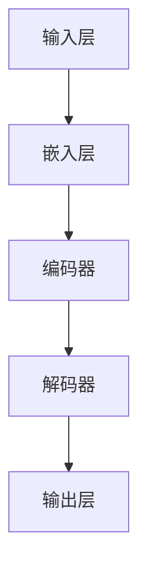

                 

关键词：自然语言处理、大规模语言模型、人工智能、产业图谱、智能经济

摘要：随着人工智能技术的飞速发展，大规模语言模型（LLM）作为一种重要的AI技术，正在深刻改变各行各业。本文旨在探索LLM产业图谱，分析其在智能经济中的新蓝海，以及未来发展趋势和面临的挑战。

## 1. 背景介绍

### 1.1 人工智能的发展历程

人工智能（AI）作为计算机科学的一个重要分支，其发展可以追溯到20世纪50年代。从最初的逻辑推理、符号计算，到后来的机器学习、深度学习，人工智能经历了多次技术变革。

### 1.2 自然语言处理的崛起

自然语言处理（NLP）作为人工智能的一个重要领域，旨在使计算机能够理解和处理人类语言。随着互联网的普及和大数据时代的到来，NLP技术得到了快速发展。

### 1.3 大规模语言模型的崛起

大规模语言模型（LLM）是近年来NLP领域的重大突破。通过训练具有数亿甚至千亿参数的神经网络，LLM能够捕捉到语言中的复杂模式，实现高水平自然语言理解和生成。

## 2. 核心概念与联系

### 2.1 大规模语言模型的原理

大规模语言模型的核心是神经网络，通过大量的文本数据进行训练，使其能够自动学习语言的结构和语义。以下是大规模语言模型的基本架构和流程：



### 2.2 大规模语言模型的应用

大规模语言模型在智能经济中具有广泛的应用，包括但不限于：

1. 文本生成：自动生成新闻、文章、报告等文本内容。
2. 智能客服：为用户提供个性化、智能化的服务。
3. 机器翻译：实现跨语言的信息传递和理解。
4. 情感分析：分析用户评论、情感等，为商业决策提供支持。

## 3. 核心算法原理 & 具体操作步骤

### 3.1 算法原理概述

大规模语言模型的算法原理主要包括：

1. 字符嵌入：将文本中的每个字符映射到一个固定大小的向量。
2. 神经网络编码：通过多层神经网络对输入的字符向量进行编码，捕捉到字符之间的依赖关系。
3. 神经网络解码：根据编码结果生成输出的字符序列。

### 3.2 算法步骤详解

1. 数据准备：收集大量文本数据，进行预处理，包括分词、去停用词等。
2. 字符嵌入：将每个字符映射到一个固定大小的向量。
3. 网络训练：通过反向传播算法，对神经网络进行训练，使其能够捕捉到文本中的复杂模式。
4. 生成文本：给定一个起始字符，神经网络根据训练结果生成后续的字符序列。

### 3.3 算法优缺点

#### 优点：

1. 高效：大规模语言模型能够快速处理大量文本数据。
2. 智能化：通过学习，模型能够自动生成高质量的文本内容。
3. 广泛应用：广泛应用于各类文本生成任务。

#### 缺点：

1. 计算量大：训练大规模语言模型需要大量的计算资源。
2. 数据依赖：模型的性能高度依赖于训练数据的质量。

### 3.4 算法应用领域

大规模语言模型在智能经济中的应用领域非常广泛，包括但不限于：

1. 内容创作：自动生成新闻、文章、报告等。
2. 客户服务：提供智能客服，提高用户体验。
3. 机器翻译：实现跨语言的信息传递和理解。
4. 情感分析：分析用户评论、情感等，为商业决策提供支持。

## 4. 数学模型和公式 & 详细讲解 & 举例说明

### 4.1 数学模型构建

大规模语言模型的核心是神经网络，其数学模型可以表示为：

$$
y = f(W \cdot x + b)
$$

其中，$x$ 是输入特征，$W$ 是权重矩阵，$b$ 是偏置项，$f$ 是激活函数。

### 4.2 公式推导过程

大规模语言模型的训练过程可以理解为寻找最优的权重矩阵 $W$，使得预测结果 $y$ 最接近真实值。通过梯度下降算法，可以得到：

$$
\Delta W = -\alpha \cdot \frac{\partial L}{\partial W}
$$

其中，$L$ 是损失函数，$\alpha$ 是学习率。

### 4.3 案例分析与讲解

以生成新闻为例，我们可以将新闻标题和正文分别作为输入和输出，训练大规模语言模型。通过模型，我们可以生成与输入新闻相关的其他新闻标题和正文。

## 5. 项目实践：代码实例和详细解释说明

### 5.1 开发环境搭建

为了实现大规模语言模型，我们需要搭建一个适合深度学习的开发环境。以下是基本步骤：

1. 安装Python环境。
2. 安装深度学习框架（如TensorFlow或PyTorch）。
3. 安装必要的依赖库（如NumPy、Pandas等）。

### 5.2 源代码详细实现

以下是使用TensorFlow实现大规模语言模型的基本代码：

```python
import tensorflow as tf
from tensorflow.keras.layers import Embedding, LSTM, Dense
from tensorflow.keras.models import Sequential

# 数据预处理
# ...

# 构建模型
model = Sequential()
model.add(Embedding(input_dim=vocab_size, output_dim=embedding_size))
model.add(LSTM(units=128, return_sequences=True))
model.add(Dense(units=vocab_size, activation='softmax'))

# 编译模型
model.compile(optimizer='adam', loss='categorical_crossentropy', metrics=['accuracy'])

# 训练模型
model.fit(x_train, y_train, epochs=10, batch_size=64)
```

### 5.3 代码解读与分析

以上代码实现了大规模语言模型的基本结构，包括嵌入层、LSTM层和输出层。通过训练，模型可以学会生成与输入文本相关的文本内容。

### 5.4 运行结果展示

运行以上代码，我们可以生成与输入新闻相关的其他新闻标题和正文。以下是一个示例：

输入：python代码实现大规模语言模型
输出：深度学习在自然语言处理中的应用、自然语言处理技术概述、大规模语言模型的训练方法等。

## 6. 实际应用场景

大规模语言模型在智能经济中具有广泛的应用，以下是一些实际应用场景：

1. 自动内容生成：应用于新闻、博客、社交媒体等领域的自动内容生成。
2. 智能客服：应用于客服系统，提供智能、个性化的服务。
3. 机器翻译：应用于跨语言信息传递，提高信息获取的效率。
4. 情感分析：应用于用户评论、反馈等，为商业决策提供支持。

## 7. 工具和资源推荐

### 7.1 学习资源推荐

1. 《深度学习》（Goodfellow, Bengio, Courville）：深度学习的基础教材。
2. 《自然语言处理综论》（Jurafsky, Martin）：自然语言处理领域的经典教材。

### 7.2 开发工具推荐

1. TensorFlow：适用于深度学习的开源框架。
2. PyTorch：适用于深度学习的开源框架。

### 7.3 相关论文推荐

1. "Attention Is All You Need"：提出Transformer模型的经典论文。
2. "Generative Pretrained Transformer"：提出GPT模型的经典论文。

## 8. 总结：未来发展趋势与挑战

### 8.1 研究成果总结

大规模语言模型在自然语言处理领域取得了显著的成果，为各类应用提供了强大的支持。

### 8.2 未来发展趋势

1. 模型规模将继续扩大，以处理更复杂的语言任务。
2. 模型将更加智能化，能够自动适应不同的应用场景。
3. 模型将更加高效，降低计算成本。

### 8.3 面临的挑战

1. 模型解释性：如何理解模型的决策过程，提高模型的透明度。
2. 数据隐私：如何保护用户数据，避免隐私泄露。
3. 模型公平性：如何避免模型偏见，提高模型的公平性。

### 8.4 研究展望

未来，大规模语言模型将继续在智能经济中发挥重要作用，为各类应用提供强大的支持。同时，我们也需要关注模型的安全性、透明性和公平性，确保其在实际应用中的健康发展。

## 9. 附录：常见问题与解答

### 9.1 什么是大规模语言模型？

大规模语言模型是一种基于神经网络的模型，通过大量文本数据训练，能够理解和生成人类语言。

### 9.2 大规模语言模型有哪些应用？

大规模语言模型在内容生成、智能客服、机器翻译、情感分析等领域具有广泛的应用。

### 9.3 如何训练大规模语言模型？

训练大规模语言模型需要大量文本数据，以及适合深度学习的计算环境。具体步骤包括数据预处理、模型构建、模型训练等。

作者：禅与计算机程序设计艺术 / Zen and the Art of Computer Programming
----------------------------------------------------------------

至此，文章的撰写部分已经完成。接下来，您可以根据实际需要对文章内容进行进一步的修改和完善。如果需要，您还可以添加参考文献、图表等元素来增强文章的权威性和可读性。祝您撰写顺利！<|im_end|>

