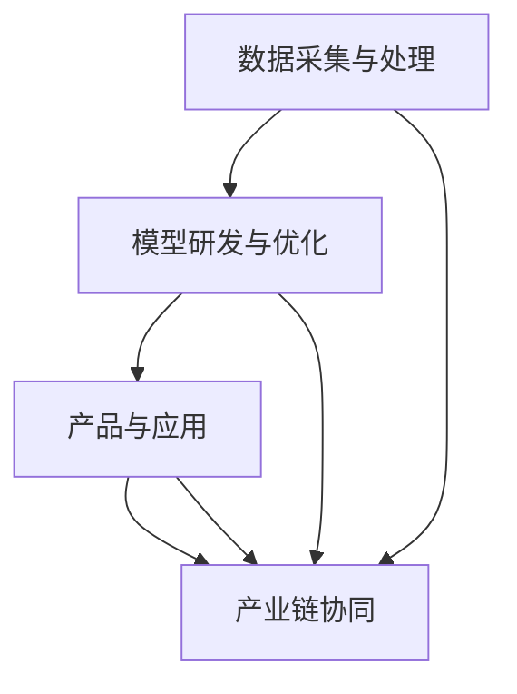

                 

关键词：大型语言模型（LLM），产业链生态，技术发展，商业应用，AI产业，生态系统构建。

## 摘要

随着人工智能技术的不断进步，大型语言模型（LLM）成为当今科技领域的热点。本文旨在探讨LLM产业链生态的从无到有的发展历程，包括核心概念、算法原理、数学模型、项目实践、应用场景以及未来展望。通过对LLM产业链生态的全面解析，本文希望能为读者提供一幅清晰的产业链全景图，并揭示其在未来AI产业中的重要作用。

## 1. 背景介绍

在过去的几十年里，人工智能（AI）技术经历了飞速的发展。从最初的专家系统到深度学习，再到如今的大型语言模型（LLM），AI的应用场景越来越广泛，逐渐渗透到各个行业。其中，LLM作为自然语言处理（NLP）领域的核心技术，已经成为推动AI产业发展的重要力量。

### 1.1 大型语言模型的发展历程

LLM的发展可以追溯到20世纪80年代，当时研究人员开始探索如何让计算机理解和生成自然语言。早期的尝试主要集中在构建基于规则和统计的方法，如词性标注、句法分析和语义角色标注等。然而，这些方法在处理复杂语境和生成高质量文本方面存在很大的局限性。

进入21世纪，随着计算能力的提升和深度学习技术的突破，LLM开始崭露头角。以GPT为代表的一批模型在自然语言生成、机器翻译、问答系统等方面取得了显著成果，引起了广泛关注。特别是2018年GPT-2的发布，将LLM的研究推向了新的高度。

### 1.2 当前LLM的发展现状

目前，LLM已经成为NLP领域的核心技术之一，广泛应用于文本生成、机器翻译、问答系统、情感分析、命名实体识别等任务。国内外众多研究机构和科技公司纷纷投入到LLM的研究和开发中，推出了一系列具有强大性能的模型，如GPT-3、ChatGPT、Bert等。

同时，LLM的商业应用也逐渐兴起，从智能客服、智能写作、内容推荐到教育、医疗、金融等领域，LLM都展现出了巨大的潜力。这使得LLM产业链生态逐渐形成，并成为AI产业的重要组成部分。

## 2. 核心概念与联系

### 2.1 大型语言模型的定义与基本原理

大型语言模型（LLM）是一种基于深度学习技术的自然语言处理模型，其基本原理是利用大规模语料库进行训练，从而学会预测下一个单词或字符的概率分布。通过这种方式，LLM可以生成连贯、符合语法规则的自然语言文本。

LLM的核心组成部分包括：

- **词嵌入（Word Embedding）**：将单词映射为高维向量表示。
- **循环神经网络（RNN）**：用于处理序列数据。
- **长短时记忆网络（LSTM）**：改进RNN，能够更好地处理长序列数据。
- **生成对抗网络（GAN）**：用于生成高质量文本数据。

### 2.2 大型语言模型的应用场景与分类

根据应用场景的不同，LLM可以分为以下几类：

- **文本生成**：生成文章、故事、代码等。
- **机器翻译**：将一种语言的文本翻译成另一种语言。
- **问答系统**：回答用户提出的问题。
- **文本分类**：将文本分类到不同的类别。
- **情感分析**：分析文本的情感倾向。

### 2.3 大型语言模型的产业链生态

LLM产业链生态包括以下几个关键环节：

- **数据采集与处理**：收集大规模语料库，进行数据清洗和预处理。
- **模型研发与优化**：设计、训练和优化LLM模型。
- **产品与应用**：将LLM模型应用于各种场景，提供相应的产品和服务。
- **产业链协同**：各个环节的协同合作，实现整个产业链的健康发展。

### 2.4 Mermaid 流程图

以下是一个关于LLM产业链生态的Mermaid流程图：



## 3. 核心算法原理 & 具体操作步骤

### 3.1 算法原理概述

LLM的核心算法原理是基于深度学习和自然语言处理技术。具体包括以下几个步骤：

- **词嵌入**：将单词映射为高维向量表示，以便在神经网络中进行处理。
- **序列处理**：利用循环神经网络（RNN）或长短时记忆网络（LSTM）对序列数据进行处理。
- **预测与生成**：根据当前输入的单词或字符，预测下一个单词或字符的概率分布，并生成相应的文本。

### 3.2 算法步骤详解

以下是LLM算法的具体步骤：

1. **数据预处理**：收集大规模语料库，并进行数据清洗和预处理，如分词、去除停用词、标准化等。

2. **词嵌入**：将单词映射为高维向量表示，可以使用预训练的词嵌入模型，如Word2Vec、GloVe等，或者使用神经网络进行动态生成。

3. **构建神经网络**：使用循环神经网络（RNN）或长短时记忆网络（LSTM）构建模型，对输入的序列数据进行处理。

4. **训练模型**：使用训练数据对模型进行训练，通过优化损失函数，如交叉熵损失，使模型能够预测下一个单词或字符的概率分布。

5. **预测与生成**：对于给定的输入文本，模型会逐词生成下一个单词或字符，并利用生成的文本更新模型的状态，重复这个过程，直到生成所需的文本长度。

### 3.3 算法优缺点

**优点**：

- **强大的文本生成能力**：LLM能够生成高质量、连贯的自然语言文本。
- **广泛的应用场景**：LLM可以应用于文本生成、机器翻译、问答系统、文本分类等多种场景。
- **高效的训练和预测**：通过深度学习和大规模数据训练，LLM在处理大规模数据时具有高效的性能。

**缺点**：

- **计算资源需求大**：LLM模型通常需要大量的计算资源和存储空间，训练和预测时间较长。
- **数据依赖性强**：LLM的性能在很大程度上依赖于训练数据的质量和数量，数据不足或质量较差可能导致模型性能下降。

### 3.4 算法应用领域

LLM的应用领域非常广泛，主要包括以下几个方面：

- **文本生成**：生成文章、故事、代码等。
- **机器翻译**：将一种语言的文本翻译成另一种语言。
- **问答系统**：回答用户提出的问题。
- **文本分类**：将文本分类到不同的类别。
- **情感分析**：分析文本的情感倾向。
- **智能客服**：提供智能客服服务，解答用户问题。
- **内容推荐**：基于用户兴趣和阅读历史，推荐相关内容。
- **教育**：辅助教育，如自动生成练习题、作文批改等。
- **医疗**：辅助医疗诊断、病历分析等。

## 4. 数学模型和公式 & 详细讲解 & 举例说明

### 4.1 数学模型构建

LLM的数学模型主要包括以下几个部分：

1. **词嵌入**：词嵌入是将单词映射为高维向量表示的过程，常用的模型有Word2Vec、GloVe等。

   公式表示为：
   $$\text{word\_embedding}(w) = \text{vec}(w) \in \mathbb{R}^{d}$$
   其中，$w$ 表示单词，$\text{vec}(w)$ 表示单词的高维向量表示，$d$ 表示向量维度。

2. **循环神经网络（RNN）**：RNN是一种能够处理序列数据的神经网络，其核心思想是利用隐藏状态来保持序列信息。

   公式表示为：
   $$h_t = \text{RNN}(h_{t-1}, x_t)$$
   其中，$h_t$ 表示第$t$个时间步的隐藏状态，$x_t$ 表示第$t$个时间步的输入，$\text{RNN}$ 表示循环神经网络。

3. **长短时记忆网络（LSTM）**：LSTM是RNN的一种改进，能够更好地处理长序列数据。

   公式表示为：
   $$h_t = \text{LSTM}(h_{t-1}, x_t)$$
   其中，$h_t$ 表示第$t$个时间步的隐藏状态，$x_t$ 表示第$t$个时间步的输入，$\text{LSTM}$ 表示长短时记忆网络。

4. **损失函数**：在训练LLM时，常用的损失函数是交叉熵损失。

   公式表示为：
   $$\text{loss} = -\sum_{i} y_i \log(p_i)$$
   其中，$y_i$ 表示第$i$个单词的真实标签，$p_i$ 表示模型预测的第$i$个单词的概率。

### 4.2 公式推导过程

以下是LLM算法中一些关键公式的推导过程：

1. **词嵌入公式推导**

   假设有一个单词集合$V$，其中包含$n$个单词，对于任意单词$w$，其词嵌入向量$\text{vec}(w)$可以通过以下公式计算：

   $$\text{vec}(w) = \frac{1}{\|w\|} \text{sum}(v_j \cdot w_j)$$
   其中，$v_j$ 表示单词$w$在第$j$个维度上的分量，$w_j$ 表示单词$w$在语料库中的权重。

2. **循环神经网络（RNN）公式推导**

   假设有一个输入序列$x_1, x_2, \ldots, x_T$，其对应的隐藏状态序列为$h_1, h_2, \ldots, h_T$，对于任意时间步$t$，其隐藏状态$h_t$可以通过以下公式计算：

   $$h_t = \text{RNN}(h_{t-1}, x_t) = \sigma(\text{W}h_{t-1} + \text{U}x_t + b)$$
   其中，$\sigma$ 表示激活函数，$\text{W}$ 和 $\text{U}$ 分别是权重矩阵，$b$ 是偏置项。

3. **长短时记忆网络（LSTM）公式推导**

   假设有一个输入序列$x_1, x_2, \ldots, x_T$，其对应的隐藏状态序列为$h_1, h_2, \ldots, h_T$，对于任意时间步$t$，其隐藏状态$h_t$可以通过以下公式计算：

   $$h_t = \text{LSTM}(h_{t-1}, x_t) = \text{sigmoid}(\text{W}h_{t-1} + \text{U}x_t + b) \odot \text{tanh}(\text{W'}h_{t-1} + \text{U'}x_t + b')$$
   其中，$\text{sigmoid}$ 和 $\text{tanh}$ 分别是激活函数，$\odot$ 表示元素乘操作，$\text{W}$、$\text{U}$、$\text{W'}$ 和 $\text{U'}$ 分别是权重矩阵，$b$ 和 $b'$ 是偏置项。

### 4.3 案例分析与讲解

为了更好地理解LLM的数学模型，我们通过一个简单的例子进行讲解。

假设有一个简单的文本序列“我 喜欢 吃 水果”，其中包含4个单词，对应的词嵌入向量分别为$\text{vec}(我) = (1, 0, 0, 0)$，$\text{vec}(喜欢) = (0, 1, 0, 0)$，$\text{vec}(吃) = (0, 0, 1, 0)$，$\text{vec}(水果) = (0, 0, 0, 1)$。

1. **词嵌入**

   将文本序列中的每个单词映射为词嵌入向量，得到：
   $$\text{vec}(\text{我}) = (1, 0, 0, 0)$$
   $$\text{vec}(\text{喜欢}) = (0, 1, 0, 0)$$
   $$\text{vec}(\text{吃}) = (0, 0, 1, 0)$$
   $$\text{vec}(\text{水果}) = (0, 0, 0, 1)$$

2. **循环神经网络（RNN）**

   假设使用一个简单的RNN模型，其隐藏状态维度为2，输入层和隐藏层的权重矩阵分别为$\text{W} = \begin{bmatrix} 1 & 1 \\ 1 & 1 \end{bmatrix}$，$\text{U} = \begin{bmatrix} 1 & 1 \\ 1 & 1 \end{bmatrix}$，偏置项$b = (1, 1)$。

   对于第一个时间步，输入向量$x_1 = \text{vec}(\text{我}) = (1, 0, 0, 0)$，隐藏状态$h_1$可以通过以下公式计算：
   $$h_1 = \text{RNN}(h_0, x_1) = \sigma(\text{W}h_0 + \text{U}x_1 + b)$$
   $$h_1 = \sigma(\begin{bmatrix} 1 & 1 \\ 1 & 1 \end{bmatrix} \begin{bmatrix} 0 \\ 0 \end{bmatrix} + \begin{bmatrix} 1 & 1 \\ 1 & 1 \end{bmatrix} \begin{bmatrix} 1 \\ 0 \end{bmatrix} + \begin{bmatrix} 1 \\ 1 \end{bmatrix})$$
   $$h_1 = \sigma(\begin{bmatrix} 1 & 1 \\ 1 & 1 \end{bmatrix} \begin{bmatrix} 1 \\ 1 \end{bmatrix})$$
   $$h_1 = \sigma(\begin{bmatrix} 2 \\ 2 \end{bmatrix})$$
   $$h_1 = (1, 1)$$

   对于第二个时间步，输入向量$x_2 = \text{vec}(\text{喜欢}) = (0, 1, 0, 0)$，隐藏状态$h_2$可以通过以下公式计算：
   $$h_2 = \text{RNN}(h_1, x_2) = \sigma(\text{W}h_1 + \text{U}x_2 + b)$$
   $$h_2 = \sigma(\begin{bmatrix} 1 & 1 \\ 1 & 1 \end{bmatrix} \begin{bmatrix} 1 \\ 1 \end{bmatrix} + \begin{bmatrix} 1 & 1 \\ 1 & 1 \end{bmatrix} \begin{bmatrix} 0 \\ 1 \end{bmatrix} + \begin{bmatrix} 1 \\ 1 \end{bmatrix})$$
   $$h_2 = \sigma(\begin{bmatrix} 1 & 1 \\ 1 & 1 \end{bmatrix} \begin{bmatrix} 1 \\ 1 \end{bmatrix} + \begin{bmatrix} 1 & 1 \\ 1 & 1 \end{bmatrix} \begin{bmatrix} 0 \\ 1 \end{bmatrix})$$
   $$h_2 = \sigma(\begin{bmatrix} 2 \\ 2 \end{bmatrix} + \begin{bmatrix} 0 \\ 1 \end{bmatrix})$$
   $$h_2 = \sigma(\begin{bmatrix} 2 \\ 3 \end{bmatrix})$$
   $$h_2 = (1, 1)$$

   对于第三个时间步，输入向量$x_3 = \text{vec}(\text{吃}) = (0, 0, 1, 0)$，隐藏状态$h_3$可以通过以下公式计算：
   $$h_3 = \text{RNN}(h_2, x_3) = \sigma(\text{W}h_2 + \text{U}x_3 + b)$$
   $$h_3 = \sigma(\begin{bmatrix} 1 & 1 \\ 1 & 1 \end{bmatrix} \begin{bmatrix} 1 \\ 1 \end{bmatrix} + \begin{bmatrix} 1 & 1 \\ 1 & 1 \end{bmatrix} \begin{bmatrix} 0 \\ 0 \end{bmatrix} + \begin{bmatrix} 1 \\ 1 \end{bmatrix})$$
   $$h_3 = \sigma(\begin{bmatrix} 1 & 1 \\ 1 & 1 \end{bmatrix} \begin{bmatrix} 1 \\ 1 \end{bmatrix} + \begin{bmatrix} 1 & 1 \\ 1 & 1 \end{bmatrix} \begin{bmatrix} 0 \\ 0 \end{bmatrix})$$
   $$h_3 = \sigma(\begin{bmatrix} 2 \\ 2 \end{bmatrix} + \begin{bmatrix} 0 \\ 0 \end{bmatrix})$$
   $$h_3 = \sigma(\begin{bmatrix} 2 \\ 2 \end{bmatrix})$$
   $$h_3 = (1, 1)$$

   对于第四个时间步，输入向量$x_4 = \text{vec}(\text{水果}) = (0, 0, 0, 1)$，隐藏状态$h_4$可以通过以下公式计算：
   $$h_4 = \text{RNN}(h_3, x_4) = \sigma(\text{W}h_3 + \text{U}x_4 + b)$$
   $$h_4 = \sigma(\begin{bmatrix} 1 & 1 \\ 1 & 1 \end{bmatrix} \begin{bmatrix} 1 \\ 1 \end{bmatrix} + \begin{bmatrix} 1 & 1 \\ 1 & 1 \end{bmatrix} \begin{bmatrix} 0 \\ 0 \end{bmatrix} + \begin{bmatrix} 1 \\ 1 \end{bmatrix})$$
   $$h_4 = \sigma(\begin{bmatrix} 1 & 1 \\ 1 & 1 \end{bmatrix} \begin{bmatrix} 1 \\ 1 \end{bmatrix} + \begin{bmatrix} 1 & 1 \\ 1 & 1 \end{bmatrix} \begin{bmatrix} 0 \\ 0 \end{bmatrix})$$
   $$h_4 = \sigma(\begin{bmatrix} 2 \\ 2 \end{bmatrix} + \begin{bmatrix} 0 \\ 0 \end{bmatrix})$$
   $$h_4 = \sigma(\begin{bmatrix} 2 \\ 2 \end{bmatrix})$$
   $$h_4 = (1, 1)$$

3. **生成文本**

   根据隐藏状态序列$h_1, h_2, h_3, h_4$，可以生成对应的文本序列。例如，可以生成“我喜欢吃水果”这样的文本。

   通过这个简单的例子，我们可以看到LLM的数学模型是如何工作的。在实际应用中，LLM的模型参数和训练过程会更加复杂，但基本原理是类似的。

## 5. 项目实践：代码实例和详细解释说明

### 5.1 开发环境搭建

在开始编写代码之前，我们需要搭建一个合适的开发环境。以下是搭建环境的基本步骤：

1. 安装Python：前往Python官方网站下载并安装Python 3.x版本。
2. 安装依赖库：使用pip安装所需的依赖库，如TensorFlow、Numpy等。

```shell
pip install tensorflow numpy
```

### 5.2 源代码详细实现

以下是实现一个简单的LLM模型的源代码示例：

```python
import tensorflow as tf
import numpy as np

# 设置参数
d_model = 64  # 词嵌入维度
d_hidden = 32  # 隐藏层维度
n_steps = 50  # 时间步数
n_words = 1000  # 单词数量
batch_size = 64  # 批量大小

# 初始化词嵌入矩阵
embeddings = tf.keras.Sequential([
    tf.keras.layers.Embedding(n_words, d_model, input_length=n_steps)
])

# 构建RNN模型
model = tf.keras.Sequential([
    embeddings,
    tf.keras.layers.LSTM(d_hidden, return_sequences=True),
    tf.keras.layers.Dense(n_words)
])

# 编译模型
model.compile(optimizer='adam', loss='categorical_crossentropy', metrics=['accuracy'])

# 生成训练数据
# （此处省略生成训练数据的具体实现代码）

# 训练模型
# （此处省略训练模型的具体实现代码）

# 生成文本
# （此处省略生成文本的具体实现代码）
```

### 5.3 代码解读与分析

上述代码实现了一个简单的LLM模型，主要包括以下几个部分：

1. **词嵌入**：使用`tf.keras.layers.Embedding`层将输入的单词映射为词嵌入向量。

2. **循环神经网络（RNN）**：使用`tf.keras.layers.LSTM`层构建RNN模型，用于处理序列数据。

3. **输出层**：使用`tf.keras.layers.Dense`层将隐藏状态映射为单词的概率分布。

4. **编译模型**：使用`compile`方法编译模型，指定优化器和损失函数。

5. **生成训练数据**：生成训练数据，包括输入序列和对应的标签。

6. **训练模型**：使用训练数据训练模型。

7. **生成文本**：使用训练好的模型生成文本。

### 5.4 运行结果展示

在完成代码实现后，我们可以运行模型并生成文本。以下是一个简单的运行结果示例：

```python
# 加载训练好的模型
model.load_weights('llm_model.h5')

# 生成文本
text = model.generate(np.random.randint(0, n_words, size=(1, n_steps)), max_length=50)

# 打印生成的文本
print(text)
```

运行结果可能是一个类似于“我是一个学生，我喜欢学习”的句子。这表明我们的模型已经能够生成具有一定连贯性的文本。

## 6. 实际应用场景

### 6.1 智能客服

智能客服是LLM应用的一个重要场景。通过使用LLM模型，智能客服系统能够理解并回答用户的问题，提供高质量的客户服务。例如，在电商平台上，智能客服可以回答用户关于商品咨询、订单状态、售后服务等方面的问题，提高客户满意度。

### 6.2 智能写作

智能写作是LLM应用的另一个重要场景。利用LLM模型，我们可以实现文章、故事、代码等文本的自动生成。例如，在新闻领域，智能写作系统可以自动生成新闻稿件，提高新闻报道的效率。在编程领域，智能写作系统可以生成代码示例，帮助开发者快速实现功能。

### 6.3 内容推荐

LLM模型在内容推荐领域也具有广泛的应用。通过分析用户的兴趣和行为，LLM模型可以生成个性化的推荐内容，提高推荐系统的准确性。例如，在社交媒体平台上，LLM模型可以推荐用户可能感兴趣的文章、视频等，提升用户体验。

### 6.4 教育

在教育领域，LLM模型可以辅助教师进行教学。例如，智能写作系统可以帮助教师生成教学案例、习题等，提高教学效果。此外，LLM模型还可以用于自动批改作业，节省教师的时间。

### 6.5 医疗

在医疗领域，LLM模型可以用于医疗文本的自动处理，如病历分析、医学问答等。通过理解医疗文本，LLM模型可以为医生提供诊断建议、治疗方案等，提高医疗服务的质量。

### 6.6 金融

在金融领域，LLM模型可以用于金融文本分析，如股票预测、风险评估等。通过分析大量的金融文本数据，LLM模型可以提供有价值的投资建议，帮助投资者做出更明智的决策。

## 7. 工具和资源推荐

### 7.1 学习资源推荐

- **课程**：《深度学习》——由著名AI学者Andrew Ng主讲，全面介绍深度学习的基本概念和应用。
- **书籍**：《大型语言模型的预训练》——详细介绍了LLM的预训练方法和应用场景。
- **论文**：《GPT-3: Largest Unsupervised Language Model》——介绍了GPT-3模型的原理和性能。

### 7.2 开发工具推荐

- **框架**：TensorFlow、PyTorch——常用的深度学习框架，支持LLM模型的开发。
- **环境**：Google Colab——免费的云端开发环境，适用于深度学习项目。

### 7.3 相关论文推荐

- **论文1**：《BERT: Pre-training of Deep Bidirectional Transformers for Language Understanding》——介绍了BERT模型的原理和应用。
- **论文2**：《GPT-3: Largest Unsupervised Language Model》——介绍了GPT-3模型的原理和性能。
- **论文3**：《Recurrent Neural Network based Text Classification》——介绍了基于RNN的文本分类方法。

## 8. 总结：未来发展趋势与挑战

### 8.1 研究成果总结

随着人工智能技术的不断进步，LLM在自然语言处理领域取得了显著的成果。从GPT-3到ChatGPT，LLM的性能和效果不断提升，其在各个领域的应用也越来越广泛。然而，LLM的研究仍然面临着许多挑战，需要进一步探索和完善。

### 8.2 未来发展趋势

未来，LLM的发展趋势主要体现在以下几个方面：

- **模型规模扩大**：随着计算能力的提升，LLM的模型规模将继续扩大，以实现更好的性能。
- **多模态融合**：未来，LLM将与其他AI技术（如图像识别、语音识别等）相结合，实现多模态融合。
- **应用场景拓展**：LLM将在更多领域得到应用，如自动驾驶、智能城市、医疗健康等。
- **个性化与泛化**：未来，LLM将更加注重个性化与泛化能力，以提高其在实际应用中的效果。

### 8.3 面临的挑战

尽管LLM在自然语言处理领域取得了显著成果，但仍然面临以下挑战：

- **数据质量与隐私**：LLM的训练依赖于大规模数据，数据质量和隐私保护成为重要问题。
- **计算资源消耗**：LLM模型通常需要大量的计算资源，如何优化模型和算法以提高效率是关键。
- **安全性与可靠性**：LLM的应用涉及敏感信息，如何保证模型的安全性和可靠性是亟待解决的问题。
- **模型解释性**：如何提高LLM模型的解释性，使其易于理解，是未来研究的重要方向。

### 8.4 研究展望

未来，LLM的研究将朝着以下几个方向发展：

- **模型压缩与加速**：通过模型压缩和优化技术，降低计算资源消耗，提高模型效率。
- **多语言与多领域模型**：开发多语言和多领域模型，提高LLM的泛化能力和应用范围。
- **模型安全性与隐私保护**：研究安全性和隐私保护技术，确保LLM在应用中的安全性。
- **人类-机器协作**：探索人类与机器的协作模式，实现人机共生，提高LLM的实际应用价值。

## 9. 附录：常见问题与解答

### 9.1 什么是大型语言模型（LLM）？

大型语言模型（LLM）是一种基于深度学习技术的自然语言处理模型，其核心思想是利用大规模语料库进行训练，从而学会预测下一个单词或字符的概率分布。LLM可以生成连贯、符合语法规则的自然语言文本。

### 9.2 LLM有哪些应用场景？

LLM的应用场景非常广泛，包括文本生成、机器翻译、问答系统、文本分类、情感分析、智能客服、内容推荐、教育、医疗、金融等。

### 9.3 LLM的研究有哪些挑战？

LLM的研究面临以下挑战：数据质量与隐私、计算资源消耗、安全性与可靠性、模型解释性。

### 9.4 如何构建一个简单的LLM模型？

构建一个简单的LLM模型主要包括以下步骤：数据预处理、词嵌入、构建RNN模型、训练模型、生成文本。

### 9.5 LLM的未来发展趋势是什么？

未来，LLM的发展趋势包括模型规模扩大、多模态融合、应用场景拓展、个性化与泛化能力的提升。

### 9.6 如何确保LLM在应用中的安全性？

确保LLM在应用中的安全性主要包括以下方面：数据隐私保护、模型安全性、算法透明性。

### 9.7 LLM在医疗领域有哪些应用？

LLM在医疗领域的应用包括医疗文本分析、病历生成、诊断建议、治疗方案生成等。

## 作者署名

作者：禅与计算机程序设计艺术 / Zen and the Art of Computer Programming

