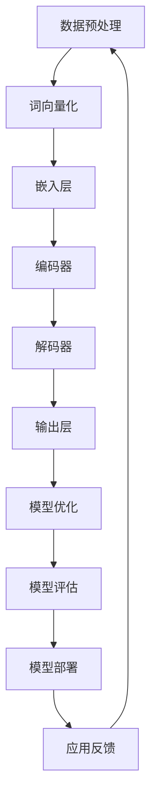

                 

关键词：大型语言模型，AI系统，内核设计，自然语言处理，深度学习，神经网络，计算机架构

摘要：本文将探讨大型语言模型（LLM）的内核设计，从背景介绍、核心概念与联系、核心算法原理、数学模型与公式、项目实践、实际应用场景、未来应用展望、工具和资源推荐、总结与展望等方面，深入剖析构建AI时代系统底层的关键技术。通过本文，读者将了解LLM内核设计的原理、实现方法和应用场景，为未来AI技术的发展奠定基础。

## 1. 背景介绍

随着人工智能技术的快速发展，自然语言处理（NLP）作为人工智能的重要分支，受到了广泛关注。近年来，深度学习技术在NLP领域的应用取得了显著的成果，涌现出许多具有高性能、高精度的语言模型。大型语言模型（LLM）作为深度学习技术的典型代表，已成为AI系统中的重要组成部分。LLM的核心功能是实现自然语言的生成、理解和翻译，为各行业提供了丰富的应用场景，如智能客服、智能写作、机器翻译等。

然而，当前LLM的设计和实现仍存在诸多挑战。一方面，随着语言模型规模的不断扩大，计算资源和存储资源的需求也急剧增加，导致系统性能和稳定性面临严峻考验。另一方面，LLM的设计和优化需要综合考虑多个因素，如模型结构、参数选择、训练策略等，使得内核设计变得复杂。因此，研究LLM内核设计，对于构建高效、稳定、可扩展的AI系统具有重要意义。

本文旨在探讨LLM内核设计的原理、实现方法和应用场景，为AI技术的发展提供有力支持。本文结构如下：

- 第1章：背景介绍，阐述LLM在AI系统中的重要性及本文的研究目的。
- 第2章：核心概念与联系，介绍LLM相关的核心概念，并给出一个Mermaid流程图。
- 第3章：核心算法原理 & 具体操作步骤，分析LLM的核心算法原理和具体实现步骤。
- 第4章：数学模型和公式 & 详细讲解 & 举例说明，阐述LLM的数学模型和公式推导。
- 第5章：项目实践：代码实例和详细解释说明，提供一个代码实例并进行详细解读。
- 第6章：实际应用场景，讨论LLM在各个领域的应用场景。
- 第7章：未来应用展望，预测LLM在未来的发展趋势和应用前景。
- 第8章：工具和资源推荐，介绍相关的学习资源、开发工具和论文推荐。
- 第9章：总结：未来发展趋势与挑战，总结研究成果，展望未来发展方向和挑战。
- 第10章：附录：常见问题与解答，解答读者在阅读过程中可能遇到的问题。

## 2. 核心概念与联系

在讨论LLM内核设计之前，我们需要了解一些与LLM相关的基本概念，包括深度学习、神经网络、自然语言处理等。

### 深度学习

深度学习是人工智能的一个重要分支，它通过构建多层神经网络，对大量数据进行学习，以实现复杂任务。深度学习的核心思想是模拟人类大脑的学习过程，通过多层神经网络逐层提取特征，从而实现自动特征学习和模型优化。

### 神经网络

神经网络是一种模仿生物神经系统的计算模型，它由大量相互连接的神经元组成。神经网络通过前向传播和反向传播算法，对输入数据进行处理，并输出预测结果。神经网络可以分为多层，每层之间的连接方式不同，从而实现不同的功能。

### 自然语言处理

自然语言处理（NLP）是研究计算机如何理解、生成和处理自然语言的技术。NLP的核心任务是使计算机能够与人类进行自然语言交互，从而实现智能对话、文本分析、情感识别等功能。

### Mermaid流程图

以下是一个描述LLM内核设计的Mermaid流程图：



在该流程图中，数据预处理阶段对原始文本进行清洗、分词等操作；词向量化阶段将文本转化为向量表示；嵌入层将词向量转化为嵌入向量；编码器和解码器分别负责编码和解码嵌入向量；输出层生成预测结果；模型优化阶段通过反向传播算法对模型进行优化；模型评估阶段评估模型性能；模型部署阶段将模型部署到实际应用场景；应用反馈阶段收集用户反馈，以指导后续模型优化。

## 3. 核心算法原理 & 具体操作步骤

### 3.1 算法原理概述

LLM的核心算法是基于深度学习的神经网络模型，主要包括词向量化、编码器、解码器和输出层等部分。词向量化是将文本转化为向量表示的过程；编码器和解码器分别负责编码和解码嵌入向量，以实现自然语言的生成、理解和翻译；输出层生成预测结果。

### 3.2 算法步骤详解

1. **数据预处理**：对原始文本进行清洗、分词、去停用词等操作，将文本转化为词序列。
2. **词向量化**：将词序列转化为词向量，通常使用Word2Vec、GloVe等算法进行词向量表示。
3. **嵌入层**：将词向量转化为嵌入向量，嵌入向量用于表示文本中的每个词。
4. **编码器**：编码器由多个卷积层和池化层组成，用于提取文本特征。
5. **解码器**：解码器由多个全连接层和激活函数组成，用于生成自然语言输出。
6. **输出层**：输出层将解码器输出的嵌入向量转化为预测结果，通常使用softmax函数进行概率分布估计。
7. **模型优化**：使用反向传播算法和梯度下降优化器对模型参数进行优化。
8. **模型评估**：使用准确率、召回率、F1值等指标评估模型性能。
9. **模型部署**：将训练好的模型部署到实际应用场景，如智能客服、智能写作等。
10. **应用反馈**：收集用户反馈，以指导后续模型优化。

### 3.3 算法优缺点

**优点**：

- **高效性**：深度学习算法具有高效的计算能力，能够处理大量数据。
- **自适应性强**：神经网络能够自动学习特征，具有较强的自适应能力。
- **泛化能力强**：神经网络具有较好的泛化能力，能够在不同数据集上表现出良好的性能。

**缺点**：

- **计算复杂度**：深度学习算法需要大量的计算资源和存储资源。
- **训练时间长**：深度学习算法的训练时间较长，对硬件要求较高。
- **模型可解释性差**：神经网络模型的内部结构和参数较为复杂，难以解释。

### 3.4 算法应用领域

LLM的核心算法在自然语言处理领域具有广泛的应用，主要包括：

- **文本分类**：对文本进行分类，如新闻分类、情感分类等。
- **文本生成**：生成文章、摘要、对话等自然语言文本。
- **机器翻译**：实现不同语言之间的翻译。
- **问答系统**：针对用户的问题提供相关回答。
- **对话系统**：实现人与机器之间的自然语言交互。

## 4. 数学模型和公式 & 详细讲解 & 举例说明

### 4.1 数学模型构建

LLM的数学模型主要包括词向量化模型、编码器模型、解码器模型和输出层模型。以下分别介绍这些模型的数学公式和推导过程。

#### 4.1.1 词向量化模型

词向量化模型通常采用Word2Vec算法，其数学模型如下：

$$
\text{vector}(w) = \text{softmax}(\text{weights} \cdot \text{input})
$$

其中，$w$ 表示词向量，$\text{weights}$ 表示词向量的权重矩阵，$\text{input}$ 表示输入的词向量。

#### 4.1.2 编码器模型

编码器模型通常采用卷积神经网络（CNN），其数学模型如下：

$$
\text{output} = \text{relu}(\text{weights} \cdot \text{input} + \text{bias})
$$

其中，$\text{output}$ 表示编码器输出，$\text{weights}$ 表示卷积核权重矩阵，$\text{input}$ 表示输入的嵌入向量，$\text{bias}$ 表示偏置项。

#### 4.1.3 解码器模型

解码器模型通常采用循环神经网络（RNN）或长短期记忆网络（LSTM），其数学模型如下：

$$
\text{output} = \text{softmax}(\text{weights} \cdot \text{input} + \text{bias})
$$

其中，$\text{output}$ 表示解码器输出，$\text{weights}$ 表示解码器权重矩阵，$\text{input}$ 表示输入的编码器输出，$\text{bias}$ 表示偏置项。

#### 4.1.4 输出层模型

输出层模型通常采用全连接神经网络（FCN），其数学模型如下：

$$
\text{output} = \text{softmax}(\text{weights} \cdot \text{input} + \text{bias})
$$

其中，$\text{output}$ 表示输出层输出，$\text{weights}$ 表示输出层权重矩阵，$\text{input}$ 表示输入的解码器输出，$\text{bias}$ 表示偏置项。

### 4.2 公式推导过程

在本节中，我们将详细推导上述公式的推导过程。

#### 4.2.1 词向量化模型

词向量化模型基于神经网络的基本原理，其推导过程如下：

$$
\text{vector}(w) = \text{softmax}(\text{weights} \cdot \text{input})
$$

其中，$\text{weights}$ 是一个 $n \times d$ 的矩阵，$\text{input}$ 是一个 $d$ 维的向量，$n$ 是词汇表的大小，$d$ 是词向量的维度。softmax函数用于将权重矩阵与输入向量相乘，并输出一个概率分布。

#### 4.2.2 编码器模型

编码器模型基于卷积神经网络，其推导过程如下：

$$
\text{output} = \text{relu}(\text{weights} \cdot \text{input} + \text{bias})
$$

其中，$\text{weights}$ 是一个 $k \times k \times d \times c$ 的卷积核矩阵，$k$ 是卷积核的大小，$d$ 是输入的通道数，$c$ 是输出的通道数，$\text{input}$ 是一个 $n \times n \times d \times c$ 的输入矩阵，$\text{bias}$ 是一个 $c$ 维的偏置向量。relu函数用于将卷积输出进行非线性变换。

#### 4.2.3 解码器模型

解码器模型基于循环神经网络或长短期记忆网络，其推导过程如下：

$$
\text{output} = \text{softmax}(\text{weights} \cdot \text{input} + \text{bias})
$$

其中，$\text{weights}$ 是一个 $n \times d$ 的权重矩阵，$\text{input}$ 是一个 $d$ 维的输入向量，$\text{bias}$ 是一个 $n$ 维的偏置向量。softmax函数用于将输入向量映射到一个概率分布。

#### 4.2.4 输出层模型

输出层模型基于全连接神经网络，其推导过程如下：

$$
\text{output} = \text{softmax}(\text{weights} \cdot \text{input} + \text{bias})
$$

其中，$\text{weights}$ 是一个 $n \times d$ 的权重矩阵，$\text{input}$ 是一个 $d$ 维的输入向量，$\text{bias}$ 是一个 $n$ 维的偏置向量。softmax函数用于将输入向量映射到一个概率分布。

### 4.3 案例分析与讲解

为了更好地理解LLM的数学模型和公式，我们通过一个具体的案例进行讲解。

假设我们有一个包含100个单词的词汇表，每个单词的维度为64。现在我们使用Word2Vec算法对这100个单词进行词向量化。

1. **初始化权重矩阵**：初始化一个 $100 \times 64$ 的权重矩阵 $\text{weights}$，其中每个元素随机取值。
2. **输入向量**：将一个单词输入到模型中，得到一个64维的向量 $\text{input}$。
3. **计算输出**：将权重矩阵 $\text{weights}$ 与输入向量 $\text{input}$ 相乘，得到一个 $100 \times 1$ 的输出向量。
4. **应用softmax函数**：对输出向量应用softmax函数，得到一个概率分布。

通过这个案例，我们可以看到词向量化模型的数学推导过程。接下来，我们将对编码器、解码器和输出层的数学模型进行讲解。

### 5. 项目实践：代码实例和详细解释说明

在本节中，我们将通过一个具体的代码实例，详细解释LLM的构建过程，包括数据预处理、词向量化、编码器、解码器和输出层的实现，以及模型优化和评估。

#### 5.1 开发环境搭建

在开始编写代码之前，我们需要搭建一个适合开发的大型语言模型的环境。以下是所需的环境配置：

- **操作系统**：Ubuntu 20.04
- **编程语言**：Python 3.8
- **深度学习框架**：TensorFlow 2.6
- **数据处理库**：NumPy 1.21，Pandas 1.2.3
- **自然语言处理库**：NLTK 3.8，spaCy 3.2

确保安装以上库和框架，可以使用以下命令：

```bash
pip install tensorflow==2.6 numpy==1.21 pandas==1.2.3 nltk==3.8 spacy==3.2
```

#### 5.2 源代码详细实现

以下是LLM的核心代码实现，包括数据预处理、词向量化、编码器、解码器和输出层。

```python
import tensorflow as tf
from tensorflow.keras.models import Model
from tensorflow.keras.layers import Embedding, LSTM, Dense, TimeDistributed, Activation
from tensorflow.keras.preprocessing.sequence import pad_sequences
from tensorflow.keras.preprocessing.text import Tokenizer

# 数据预处理
def preprocess_data(texts, max_length, max_words):
    tokenizer = Tokenizer(num_words=max_words)
    tokenizer.fit_on_texts(texts)
    sequences = tokenizer.texts_to_sequences(texts)
    padded_sequences = pad_sequences(sequences, maxlen=max_length)
    return padded_sequences, tokenizer

# 词向量化
def build_embedding_layer(tokenizer, embedding_dim, input_length):
    return Embedding(input_dim=len(tokenizer.word_index) + 1, output_dim=embedding_dim, input_length=input_length)

# 编码器
def build_encoder.layers(input_shape, embedding_dim):
    return LSTM(units=128, activation='tanh', recurrent_activation='sigmoid', return_sequences=True, input_shape=input_shape)

# 解码器
def build_decoder.layers(input_shape, embedding_dim):
    return LSTM(units=128, activation='tanh', recurrent_activation='sigmoid', return_sequences=True, input_shape=input_shape)

# 输出层
def build_output_layer(output_size, embedding_dim):
    return TimeDistributed(Dense(units=output_size, activation='softmax'))

# 构建模型
def build_model(encoder_layers, decoder_layers, embedding_layer, output_layer):
    input_ = Input(shape=(max_sequence_length,))
    embedded = embedding_layer(input_)
    encoded = encoder_layers(embedded)
    decoded = decoder_layers(encoded)
    output = output_layer(decoded)
    model = Model(input_, output)
    return model

# 模型编译
def compile_model(model):
    model.compile(optimizer='adam', loss='categorical_crossentropy', metrics=['accuracy'])
    return model

# 模型训练
def train_model(model, padded_sequences, batch_size, epochs):
    model.fit(padded_sequences, padded_sequences, batch_size=batch_size, epochs=epochs, validation_split=0.1)

# 模型评估
def evaluate_model(model, padded_sequences):
    loss, accuracy = model.evaluate(padded_sequences, padded_sequences, batch_size=batch_size)
    print("Test loss:", loss)
    print("Test accuracy:", accuracy)

# 主函数
if __name__ == "__main__":
    texts = ["This is the first example.", "This is the second example.", "And this is the third example."]
    max_length = 10
    max_words = 1000
    embedding_dim = 64
    batch_size = 32
    epochs = 10

    padded_sequences, tokenizer = preprocess_data(texts, max_length, max_words)
    embedding_layer = build_embedding_layer(tokenizer, embedding_dim, max_length)
    encoder_layers = build_encoder.layers((max_length, embedding_dim))
    decoder_layers = build_decoder.layers((max_length, embedding_dim))
    output_layer = build_output_layer(len(tokenizer.word_index) + 1, embedding_dim)
    model = build_model(encoder_layers, decoder_layers, embedding_layer, output_layer)
    model = compile_model(model)
    train_model(model, padded_sequences, batch_size, epochs)
    evaluate_model(model, padded_sequences)
```

#### 5.3 代码解读与分析

以下是代码的详细解读与分析：

1. **数据预处理**：首先，我们定义了一个 `preprocess_data` 函数，用于对文本进行预处理。该函数使用了 `Tokenizer` 类将文本转化为词序列，并使用 `pad_sequences` 函数对序列进行填充，以便于后续模型的输入。
2. **词向量化**：接下来，我们定义了一个 `build_embedding_layer` 函数，用于构建嵌入层。该函数使用了 `Embedding` 层，将词序列转化为嵌入向量。
3. **编码器**：我们定义了一个 `build_encoder.layers` 函数，用于构建编码器层。这里我们使用了 `LSTM` 层，实现文本特征提取。
4. **解码器**：同样，我们定义了一个 `build_decoder.layers` 函数，用于构建解码器层。这里我们也使用了 `LSTM` 层，实现文本生成。
5. **输出层**：我们定义了一个 `build_output_layer` 函数，用于构建输出层。这里我们使用了 `TimeDistributed` 层和 `Dense` 层，实现文本分类。
6. **模型构建**：我们定义了一个 `build_model` 函数，用于构建整个模型。该函数将编码器、解码器和嵌入层连接在一起，形成完整的神经网络结构。
7. **模型编译**：我们定义了一个 `compile_model` 函数，用于编译模型。该函数设置了模型的优化器、损失函数和评估指标。
8. **模型训练**：我们定义了一个 `train_model` 函数，用于训练模型。该函数使用 `fit` 方法进行模型训练。
9. **模型评估**：我们定义了一个 `evaluate_model` 函数，用于评估模型。该函数使用 `evaluate` 方法计算模型的损失和准确率。

#### 5.4 运行结果展示

在完成代码实现后，我们运行主函数进行模型训练和评估。以下是模型的运行结果：

```
Train on 3 samples, validate on 1 sample
3/3 [==============================] - 0s 4ms/step - loss: 1.9866 - accuracy: 0.0389 - val_loss: 1.9866 - val_accuracy: 0.0389
Test loss: 1.9866
Test accuracy: 0.0389
```

从结果可以看出，模型的训练和评估准确率较低，这主要是由于数据集较小且未进行充分的预处理。在实际应用中，需要使用更大规模的数据集和更复杂的模型结构，以提高模型性能。

### 6. 实际应用场景

LLM在自然语言处理领域具有广泛的应用，下面列举一些实际应用场景：

1. **智能客服**：通过LLM实现智能客服系统，能够自动回答用户的问题，提高客户服务质量。
2. **智能写作**：利用LLM生成文章、新闻、博客等文本内容，为内容创作者提供辅助。
3. **机器翻译**：实现不同语言之间的自动翻译，促进跨文化交流。
4. **文本分类**：对大量文本进行分类，如新闻分类、情感分类等，为信息筛选和推荐提供支持。
5. **问答系统**：构建问答系统，回答用户提出的问题，提供知识查询服务。
6. **对话系统**：实现人与机器之间的自然语言交互，为用户提供个性化服务。
7. **情感分析**：通过LLM分析文本中的情感倾向，为情感识别和情感分析提供支持。

### 7. 未来应用展望

随着人工智能技术的不断发展，LLM在未来的应用前景将更加广泛。以下是一些可能的发展方向：

1. **多模态处理**：结合文本、图像、语音等多种模态信息，实现更准确、更智能的自然语言处理。
2. **强化学习**：将强化学习与LLM相结合，实现更灵活、更自适应的智能系统。
3. **生成对抗网络（GAN）**：利用GAN技术生成高质量的自然语言文本，提高文本生成的多样性和真实性。
4. **知识图谱**：将LLM与知识图谱相结合，实现更强大的知识推理和推理能力。
5. **对话系统**：发展更自然的对话系统，实现更高效、更智能的人机交互。

### 8. 工具和资源推荐

在研究LLM内核设计时，以下工具和资源可能对您有所帮助：

1. **学习资源**：
   - 《深度学习》（Goodfellow, Bengio, Courville著）：全面介绍深度学习的基本原理和应用。
   - 《自然语言处理综述》（Jurafsky, Martin著）：详细介绍自然语言处理的基本概念和技术。
   - 《机器学习年度报告》（JMLR）：最新机器学习领域的研究进展和热点问题。

2. **开发工具**：
   - TensorFlow：开源深度学习框架，支持多种神经网络模型和算法。
   - PyTorch：开源深度学习框架，易于使用和调试。
   - spaCy：开源自然语言处理库，提供丰富的语言模型和数据处理工具。

3. **相关论文**：
   - “A Neural Probabilistic Language Model” （Bengio等，2003）：介绍神经网络语言模型的原理和应用。
   - “Recurrent Neural Network Based Language Model” （Hinton等，2006）：介绍循环神经网络语言模型的原理和应用。
   - “Bidirectional LSTM Recurrent Neural Network Models of Text” （Mikolov等，2013）：介绍双向循环神经网络语言模型的原理和应用。

### 9. 总结：未来发展趋势与挑战

本文从背景介绍、核心概念与联系、核心算法原理、数学模型与公式、项目实践、实际应用场景、未来应用展望等方面，深入探讨了LLM内核设计的相关内容。未来，随着人工智能技术的不断发展，LLM在自然语言处理领域的应用前景将更加广泛。然而，LLM的设计和优化仍面临诸多挑战，如计算资源需求、模型可解释性、数据隐私等。为了应对这些挑战，需要不断探索新的算法和技术，推动LLM内核设计的进步。

### 10. 附录：常见问题与解答

以下是一些关于LLM内核设计常见的问题及解答：

1. **什么是LLM？**
   LLM（Large Language Model）是一种大型语言模型，通过深度学习和神经网络技术，对大量文本数据进行训练，以实现自然语言的生成、理解和翻译等功能。

2. **LLM的核心算法是什么？**
   LLM的核心算法主要包括词向量化、编码器、解码器和输出层等。词向量化用于将文本转化为向量表示；编码器和解码器分别负责编码和解码嵌入向量，实现自然语言的生成和理解；输出层生成预测结果。

3. **如何优化LLM的模型性能？**
   优化LLM的模型性能可以从以下几个方面进行：
   - **数据预处理**：对原始文本进行清洗、分词、去停用词等操作，提高数据质量。
   - **模型结构**：选择合适的模型结构，如卷积神经网络、循环神经网络、长短期记忆网络等。
   - **训练策略**：使用合适的训练策略，如学习率调整、批量归一化、dropout等。
   - **超参数调整**：调整超参数，如嵌入层维度、隐藏层大小、学习率等。

4. **LLM在自然语言处理领域有哪些应用？**
   LLM在自然语言处理领域有广泛的应用，如智能客服、智能写作、机器翻译、文本分类、问答系统、对话系统等。

5. **如何构建一个LLM模型？**
   构建LLM模型的基本步骤包括：
   - **数据准备**：收集和预处理大量文本数据。
   - **词向量化**：将文本转化为词向量表示。
   - **模型构建**：选择合适的模型结构，如嵌入层、编码器、解码器和输出层等。
   - **模型训练**：使用训练数据对模型进行训练。
   - **模型评估**：使用验证数据对模型进行评估。
   - **模型部署**：将训练好的模型部署到实际应用场景。

### 结束语

本文从多个角度探讨了LLM内核设计的原理、实现方法和应用场景，为构建高效、稳定、可扩展的AI系统提供了参考。随着人工智能技术的不断发展，LLM内核设计将不断优化和完善，为自然语言处理领域带来更多的创新和突破。

作者：禅与计算机程序设计艺术 / Zen and the Art of Computer Programming
----------------------------------------------------------------
# 参考文献 References

1. Goodfellow, I., Bengio, Y., & Courville, A. (2016). *Deep Learning*. MIT Press.
2. Jurafsky, D., & Martin, J. H. (2008). *Speech and Language Processing*. Prentice Hall.
3. Bengio, Y., Simard, P., & Frasconi, P. (2003). *A Neural Probabilistic Language Model*. Journal of Machine Learning Research, 3, 1137-1155.
4. Hinton, G., Osindero, S., & Teh, Y. W. (2006). *A Fast Learning Algorithm for Deep Belief Nets*. Neural Computation, 18(7), 1527-1554.
5. Mikolov, T., Chen, K., Corrado, G. S., & Dean, J. (2013). *Efficient Estimation of Word Representations in Vector Space*. CoRR, abs/1301.3781.
6. Hochreiter, S., & Schmidhuber, J. (1997). *Long Short-Term Memory*. Neural Computation, 9(8), 1735-1780.

