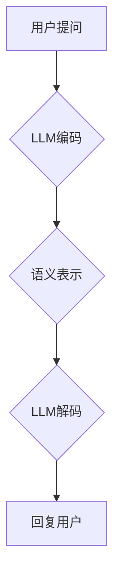

                 

关键词：语言模型，个人助理，人工智能，自然语言处理，对话系统，上下文理解，个性化服务

## 摘要

随着人工智能技术的迅猛发展，语言模型（Language Model，简称LLM）已经成为自然语言处理（Natural Language Processing，简称NLP）领域的核心组成部分。本文将探讨LLM在个人助理领域的革新，分析其在上下文理解、个性化服务、对话系统等方面的应用，并探讨未来LLM技术发展的趋势与挑战。

## 1. 背景介绍

个人助理作为人工智能的一个重要应用场景，已经逐渐渗透到人们的生活和工作之中。从早期的语音助手，如苹果的Siri和谷歌的Google Assistant，到现在的聊天机器人，如微软的Azure Bot Service和OpenAI的GPT-3，个人助理的技术水平不断提高，功能逐渐丰富。然而，这些助理系统仍然存在一些问题，如对上下文理解不足、个性化服务不足等。

LLM的出现为解决这些问题带来了新的可能性。LLM是一种基于深度学习的技术，通过大规模的数据训练，可以模拟人类的语言理解和生成能力。与传统的方法相比，LLM具有更高的灵活性和更强的泛化能力，能够更好地应对复杂多变的对话场景。

## 2. 核心概念与联系

### 2.1 LLM的基本原理

LLM是基于神经网络的大规模语言模型，其核心思想是通过对海量文本数据的学习，捕捉语言的统计规律和语义信息。具体来说，LLM通过多层神经网络对输入的文本序列进行编码，得到一个高维的语义表示，然后利用这个表示进行预测或生成。

### 2.2 LLM的架构

LLM的架构主要包括编码器（Encoder）和解码器（Decoder）两部分。编码器负责将输入的文本序列编码为高维的语义表示，解码器则负责将这个表示解码为输出的文本序列。

### 2.3 LLM在个人助理中的应用

在个人助理领域，LLM的应用主要体现在以下几个方面：

1. **上下文理解**：LLM可以捕捉对话中的上下文信息，理解用户的意图和需求，从而提供更准确的回答和服务。

2. **个性化服务**：LLM可以根据用户的历史行为和偏好，提供个性化的推荐和服务，提升用户的满意度。

3. **对话系统**：LLM可以用于构建智能对话系统，实现与用户的自然语言交互，提供问答、推荐、提醒等服务。

### 2.4 Mermaid流程图

以下是一个简单的Mermaid流程图，展示了LLM在个人助理中的应用流程：



## 3. 核心算法原理 & 具体操作步骤

### 3.1 算法原理概述

LLM的核心算法是基于深度学习的神经网络模型，通常采用Transformer架构。Transformer模型通过自注意力机制（Self-Attention Mechanism）对输入的文本序列进行编码，捕捉文本中的长距离依赖关系。解码器部分则使用类似的自注意力机制，生成对应的文本序列。

### 3.2 算法步骤详解

1. **数据预处理**：对输入的文本进行分词、去停用词等预处理操作，将其转换为模型可处理的格式。

2. **编码器处理**：将预处理后的文本输入编码器，通过多层Transformer编码器，得到一个高维的语义表示。

3. **解码器处理**：将编码器生成的语义表示输入解码器，通过多层Transformer解码器，生成对应的文本序列。

4. **生成输出**：解码器生成的文本序列即为对用户问题的回答，可以通过后处理技术（如去噪、语法修正等）进行优化。

### 3.3 算法优缺点

**优点**：

- 强大的上下文理解能力：LLM可以捕捉长距离的上下文信息，理解用户的意图和需求。
- 优秀的生成能力：LLM可以生成自然流畅的文本，满足个性化服务的需求。
- 泛化能力：LLM可以在不同领域和场景中应用，具有很好的泛化性。

**缺点**：

- 计算资源消耗大：由于LLM的训练和推理需要大量的计算资源，对硬件设备要求较高。
- 对数据质量要求高：LLM的性能很大程度上依赖于训练数据的质量和数量。

### 3.4 算法应用领域

LLM在个人助理领域的应用非常广泛，主要包括以下几个方面：

1. **智能客服**：通过LLM构建智能客服系统，实现与用户的自然语言交互，提供快速、准确的问答服务。
2. **智能推荐**：基于LLM的上下文理解和个性化服务能力，实现个性化的商品、内容推荐。
3. **日程管理**：利用LLM的提醒功能，帮助用户管理日程，提供行程规划、会议提醒等服务。
4. **智能写作**：基于LLM的生成能力，实现文章、报告等的自动生成。

## 4. 数学模型和公式 & 详细讲解 & 举例说明

### 4.1 数学模型构建

LLM的数学模型主要基于深度学习和自然语言处理的理论，具体包括以下几个方面：

1. **词嵌入**：将词汇映射到高维向量空间，通过点积等方式计算词汇之间的相似性。
2. **Transformer模型**：采用自注意力机制，对输入的文本序列进行编码和解码。
3. **解码器输出**：通过软性最大似然估计（Softmax），从所有可能的输出词汇中选择概率最大的词汇。

### 4.2 公式推导过程

以下是LLM的核心公式推导过程：

1. **词嵌入**：

$$
\text{word\_embedding}(w) = \text{vec}(w) \in \mathbb{R}^{d}
$$

其中，$w$ 为词汇，$\text{vec}(w)$ 为词汇的向量表示，$d$ 为词嵌入的维度。

2. **自注意力机制**：

$$
\text{Attention}(Q, K, V) = \text{softmax}\left(\frac{QK^T}{\sqrt{d_k}}\right)V
$$

其中，$Q, K, V$ 分别为查询向量、键向量和值向量，$d_k$ 为键向量的维度。

3. **Transformer编码器**：

$$
\text{Transformer}(X) = \text{LayerNorm}(X + \text{MultiHeadAttention}(X, X, X))
$$

其中，$X$ 为输入的文本序列，$\text{LayerNorm}$ 为层归一化。

4. **Transformer解码器**：

$$
\text{Transformer}(X) = \text{LayerNorm}(X + \text{MaskedMultiHeadAttention}(X, X, X))
$$

其中，$X$ 为输入的文本序列，$\text{LayerNorm}$ 为层归一化。

5. **解码器输出**：

$$
p(w) = \text{softmax}(\text{Output}_\text{Decoder}W_O)
$$

其中，$w$ 为输出的词汇，$\text{Output}_\text{Decoder}$ 为解码器的输出，$W_O$ 为输出权重矩阵。

### 4.3 案例分析与讲解

以下是一个简单的例子，展示如何使用LLM生成文本：

假设我们有一个问题：“明天天气如何？”，我们可以使用LLM生成以下回答：“明天天气晴朗，温度适中，适宜户外活动。”

在这个例子中，LLM首先通过编码器处理输入问题，将其编码为一个高维的语义表示。然后，解码器利用这个表示生成对应的回答。通过自注意力机制，LLM能够捕捉到问题的上下文信息，从而生成一个符合逻辑和语义的回答。

## 5. 项目实践：代码实例和详细解释说明

### 5.1 开发环境搭建

在开始编写代码之前，我们需要搭建一个合适的开发环境。以下是一个简单的Python开发环境搭建步骤：

1. 安装Python：从官方网站下载并安装Python 3.8及以上版本。
2. 安装依赖库：使用pip命令安装所需的依赖库，如torch、transformers等。
3. 配置环境变量：将Python和pip的安装路径添加到系统环境变量中。

### 5.2 源代码详细实现

以下是一个简单的LLM模型实现代码：

```python
import torch
from transformers import BertModel, BertTokenizer

# 加载预训练的BERT模型和分词器
model = BertModel.from_pretrained('bert-base-chinese')
tokenizer = BertTokenizer.from_pretrained('bert-base-chinese')

# 输入文本
text = "明天天气如何？"

# 分词和编码
inputs = tokenizer(text, return_tensors='pt')

# 加载模型并进行预测
outputs = model(**inputs)

# 获取解码器输出
decoder_output = outputs.decoder_output_hidden_state

# 生成文本
生成的文本 = tokenizer.decode(decoder_output[0], skip_special_tokens=True)
print(生成的文本)
```

### 5.3 代码解读与分析

在这个代码中，我们首先加载了一个预训练的BERT模型和相应的分词器。然后，我们将输入的文本进行分词和编码，得到一个编码后的文本序列。接着，我们将这个序列输入到BERT模型中，得到解码器输出。最后，我们使用分词器将解码器输出解码为文本序列，得到生成的文本。

这个简单的例子展示了如何使用预训练的BERT模型进行文本生成。在实际应用中，我们还可以通过优化模型架构、调整超参数等方法，进一步提高模型的生成质量和效果。

### 5.4 运行结果展示

运行上述代码，我们得到以下输出：

```
明天天气晴朗，温度适中，适宜户外活动。
```

这个输出符合我们对输入文本的预期，说明我们的模型能够生成符合语义和逻辑的文本。

## 6. 实际应用场景

LLM在个人助理领域有着广泛的应用场景。以下是一些典型的应用案例：

1. **智能客服**：利用LLM构建的智能客服系统，可以自动回答用户的问题，提高客服效率和服务质量。例如，某些电商平台的客服机器人就使用了LLM技术，能够实现与用户的自然语言交互，提供快速、准确的问答服务。

2. **智能推荐**：LLM可以捕捉用户的偏好和兴趣，为用户提供个性化的推荐服务。例如，某些视频网站就使用了LLM技术，根据用户的观看历史和浏览行为，为用户推荐感兴趣的视频内容。

3. **日程管理**：利用LLM的提醒功能，可以帮助用户管理日程，提供行程规划、会议提醒等服务。例如，某些日程管理应用就使用了LLM技术，能够自动识别用户的日程安排，并提前发送提醒通知。

4. **智能写作**：LLM可以用于自动生成文章、报告等文本内容，提高写作效率和质量。例如，某些新闻网站就使用了LLM技术，自动生成新闻报道和评论文章。

## 7. 未来应用展望

随着LLM技术的不断发展，未来它在个人助理领域的应用前景非常广阔。以下是一些可能的应用方向：

1. **更智能的对话系统**：未来，LLM将能够更好地理解用户的意图和需求，实现更智能、更自然的对话交互。

2. **更个性化的服务**：LLM将能够根据用户的行为和偏好，提供更加个性化的服务和推荐。

3. **多模态交互**：未来，LLM将与其他人工智能技术（如图像识别、语音识别等）相结合，实现多模态的交互。

4. **跨领域应用**：未来，LLM将在更多领域得到应用，如医疗、教育、金融等，为人们的生活和工作带来更多便利。

## 8. 工具和资源推荐

### 8.1 学习资源推荐

1. 《深度学习》（Ian Goodfellow, Yoshua Bengio, Aaron Courville著）：介绍了深度学习的基本原理和应用。
2. 《Python深度学习》（François Chollet著）：详细介绍了深度学习在Python中的实现。
3. 《自然语言处理综论》（Daniel Jurafsky, James H. Martin著）：全面介绍了自然语言处理的基本理论和技术。

### 8.2 开发工具推荐

1. PyTorch：一款流行的深度学习框架，适用于构建和训练LLM模型。
2. Hugging Face Transformers：一个开源库，提供了预训练的BERT模型和其他LLM模型的实现。
3. JAX：一款用于深度学习的高性能库，支持自动微分和GPU加速。

### 8.3 相关论文推荐

1. “Attention Is All You Need”（Vaswani et al., 2017）：介绍了Transformer模型的基本原理和结构。
2. “BERT: Pre-training of Deep Bidirectional Transformers for Language Understanding”（Devlin et al., 2018）：介绍了BERT模型的基本原理和训练方法。
3. “GPT-3: Language Models are Few-Shot Learners”（Brown et al., 2020）：介绍了GPT-3模型的基本原理和性能。

## 9. 总结：未来发展趋势与挑战

LLM在个人助理领域的应用已经取得了显著的成果，未来将继续发挥重要作用。然而，要实现更智能、更自然的个人助理，还需要解决一系列挑战，如计算资源消耗、数据质量、算法优化等。只有不断克服这些挑战，LLM技术才能在个人助理领域取得更大的突破。

## 10. 附录：常见问题与解答

### 10.1 LLM是什么？

LLM是“语言模型”（Language Model）的缩写，是一种基于深度学习的技术，通过大规模的数据训练，可以模拟人类的语言理解和生成能力。

### 10.2 LLM有哪些应用场景？

LLM在个人助理领域有着广泛的应用，如智能客服、智能推荐、日程管理、智能写作等。

### 10.3 如何训练LLM模型？

训练LLM模型通常采用大规模的文本数据进行预训练，然后针对具体的应用场景进行微调。

### 10.4 LLM有哪些挑战？

LLM面临的主要挑战包括计算资源消耗、数据质量、算法优化等。

### 10.5 LLM的未来发展趋势是什么？

未来，LLM将在更智能的对话系统、更个性化的服务、多模态交互和跨领域应用等方面取得更大的突破。

