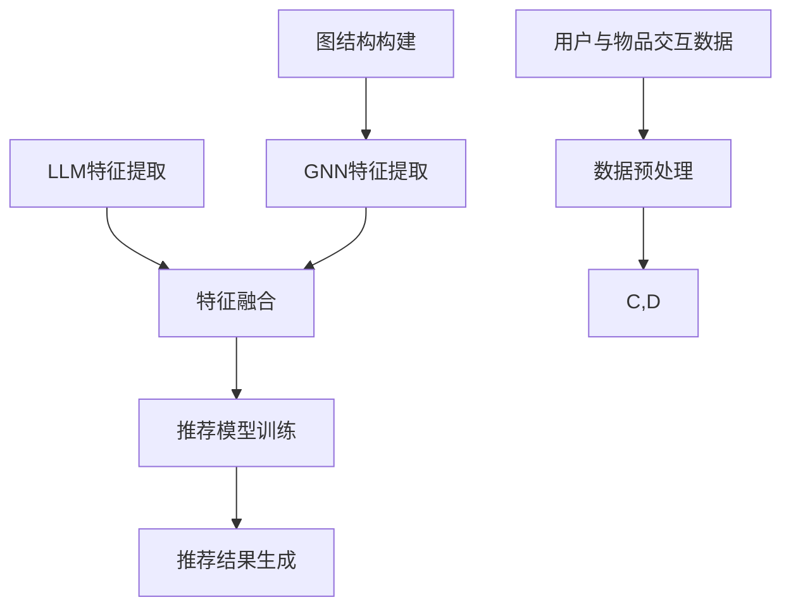
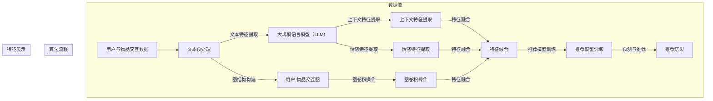

                 

关键词：推荐系统，图神经网络，自然语言处理，深度学习，数据挖掘

## 摘要

本文旨在探讨大规模语言模型（LLM）在推荐系统中的应用，尤其是图神经网络（GNN）这一新兴技术的结合。通过将LLM与GNN相结合，我们能够为推荐系统引入更强的上下文理解能力和个性化推荐能力。本文将详细探讨LLM和GNN的基本概念、相互关系以及如何应用于推荐系统。我们将介绍一种基于LLM和GNN的推荐系统架构，并详细讨论其核心算法原理、数学模型构建、实际应用案例以及未来发展趋势。文章旨在为研究者提供理论依据，为开发者提供实践指导。

## 1. 背景介绍

推荐系统是现代信息社会中不可或缺的一部分，广泛应用于电子商务、社交媒体、新闻推送等场景。传统的推荐系统主要依赖于协同过滤、基于内容的推荐和混合推荐策略，这些方法在一定程度上提高了推荐的准确性，但仍然存在一些局限。首先，它们往往依赖于用户历史行为数据，对于新用户或者行为数据不足的用户，推荐效果较差。其次，这些方法往往缺乏对用户上下文信息的理解和利用，导致推荐结果不够个性化。为了克服这些局限，研究者开始探索更为先进的技术，如深度学习和图神经网络。

深度学习在推荐系统中的应用取得了显著成果。基于深度学习的推荐系统可以通过学习用户和物品的特征，实现更准确的个性化推荐。然而，深度学习模型在处理非结构化数据，如文本和图像时，效果仍然不尽如人意。为了解决这一问题，大规模语言模型（LLM）应运而生。LLM能够对大量文本数据进行训练，提取丰富的语义信息，从而为推荐系统提供强大的文本处理能力。

图神经网络（GNN）是近年来在图结构数据处理方面取得突破性进展的一种深度学习模型。GNN擅长处理复杂的关系数据，能够有效地捕捉节点之间的交互关系。将GNN应用于推荐系统，可以更好地理解用户和物品之间的关系，实现更精确的推荐。

本文将探讨如何将LLM和GNN相结合，构建一个强大的推荐系统。我们首先介绍LLM和GNN的基本概念，然后分析它们在推荐系统中的应用场景，最后提出一种基于LLM和GNN的推荐系统架构，并讨论其核心算法原理和数学模型构建。

### 1.1 推荐系统的发展历程

推荐系统的发展历程可以追溯到20世纪90年代，当时的主要方法是基于内容的推荐（Content-Based Filtering）和协同过滤（Collaborative Filtering）。基于内容的推荐方法通过分析用户的历史行为和物品的特征，寻找相似的用户和物品进行推荐。这种方法在推荐新物品时表现较好，但缺乏对用户个性化需求的深入理解。

协同过滤方法通过分析用户之间的相似性来推荐物品，分为基于用户的协同过滤（User-Based CF）和基于物品的协同过滤（Item-Based CF）。基于用户的协同过滤方法通过计算用户之间的相似性，找到相似用户喜欢的物品进行推荐；而基于物品的协同过滤方法则通过计算物品之间的相似性，找到用户可能感兴趣的物品。协同过滤方法在处理大规模数据集时表现出色，但存在一些问题，如用户冷启动问题、数据稀疏性和结果多样性不足等。

随着互联网的快速发展，用户生成内容（User-Generated Content）和数据量的急剧增加，推荐系统的研究逐渐转向基于模型的推荐方法。这些方法利用机器学习技术，通过构建用户和物品之间的映射模型，实现更准确的推荐。基于模型的推荐方法可以分为两类：基于模型的协同过滤（Model-Based CF）和基于内容的推荐（Content-Based Filtering）。

基于模型的协同过滤方法利用机器学习算法，如矩阵分解、潜在因子模型等，学习用户和物品的潜在特征，从而实现个性化推荐。这种方法在处理数据稀疏性和多样性方面表现较好，但仍然存在一些问题，如计算复杂度和模型可解释性等。

基于内容的推荐方法通过分析用户的历史行为和物品的特征，构建用户和物品之间的相似性模型，实现个性化推荐。这种方法在推荐新物品时表现较好，但需要大量的先验知识和手动特征工程。

近年来，深度学习技术在推荐系统中的应用取得了显著进展。深度学习模型能够自动提取用户和物品的潜在特征，实现更准确的个性化推荐。其中，卷积神经网络（CNN）和循环神经网络（RNN）在图像和序列数据处理方面表现出色，而图神经网络（GNN）则在图结构数据处理方面取得了突破性进展。

GNN通过学习节点之间的交互关系，能够有效地捕捉复杂网络中的信息传播和特征传递机制。将GNN应用于推荐系统，可以更好地理解用户和物品之间的潜在关系，实现更精确的推荐。同时，大规模语言模型（LLM）的兴起，为推荐系统提供了强大的文本处理能力。LLM能够对大量文本数据进行训练，提取丰富的语义信息，从而为推荐系统提供更全面的用户和物品特征。

综上所述，推荐系统的发展历程经历了从基于内容的推荐、协同过滤到基于模型的推荐，再到深度学习和图神经网络的演进。这些技术的发展，使得推荐系统在准确性、多样性和可解释性等方面取得了显著提升，但同时也面临着新的挑战和机遇。

### 1.2 大规模语言模型（LLM）的概念与原理

大规模语言模型（Large Language Model，简称LLM）是一种基于深度学习的自然语言处理模型，其核心思想是通过学习大量文本数据，自动提取语言中的语义信息，并生成相应的文本输出。LLM的起源可以追溯到2000年代初，当时研究者们提出了诸如Trinh和Mikolov等基于神经网络的词向量模型，如Word2Vec和GloVe。这些模型通过将词语映射为向量空间中的点，实现了词语之间的语义相似性计算。

随着计算能力和数据规模的不断提升，LLM逐渐发展壮大。2018年，Google推出了BERT（Bidirectional Encoder Representations from Transformers），这是一个基于Transformer架构的双向编码器，标志着LLM进入了一个新的时代。BERT通过在大量无标注文本数据上预训练，然后在有标注的数据上进行微调，实现了在多种自然语言处理任务上的突破性表现。此后，各种大规模的LLM模型如GPT（Generative Pre-trained Transformer）系列和T5（Text-to-Text Transfer Transformer）等相继推出，进一步推动了自然语言处理技术的发展。

LLM的基本原理可以概括为以下几个步骤：

1. **数据预训练**：LLM首先在大量无标注文本数据上进行预训练，学习文本中的语义结构和语言规律。这一过程通常采用自回归语言模型（Autoregressive Language Model）进行，即给定一个文本序列的前缀，模型需要预测下一个词。

2. **上下文理解**：通过预训练，LLM能够理解文本中的上下文信息。不同于传统的词向量模型，LLM可以捕捉长距离的语义依赖，从而在处理长文本时表现出更高的准确性。

3. **生成文本**：在理解上下文信息的基础上，LLM可以生成符合语法和语义规则的文本输出。这一能力在生成文本、机器翻译、问答系统等任务中具有广泛应用。

4. **任务微调**：预训练后的LLM可以用于多种自然语言处理任务，如文本分类、情感分析、命名实体识别等。通过在特定任务的有标注数据上进行微调，模型能够适应不同的任务需求。

LLM在自然语言处理中的优势主要体现在以下几个方面：

- **强大的语义理解能力**：LLM能够理解复杂的语义关系，如同义替换、指代消解和语义角色标注等，这使得它在处理复杂文本任务时具有优势。

- **高效率的文本生成**：LLM能够快速生成符合语言习惯和语义逻辑的文本，大大提高了文本生成任务的生产效率。

- **跨语言适应性**：许多LLM模型都具备较强的跨语言适应性，能够在不同语言之间进行文本翻译和迁移学习。

- **多任务学习能力**：通过在多种任务上进行微调，LLM可以适应不同的任务场景，提高了模型的泛化能力。

然而，LLM也存在一些局限性和挑战。首先，LLM的训练需要大量的计算资源和时间，这对硬件设备提出了较高的要求。其次，LLM生成的文本可能存在错误或不合理的情况，特别是在处理模糊或歧义的文本时。此外，LLM的透明性和可解释性仍然是一个亟待解决的问题。

总之，大规模语言模型（LLM）作为自然语言处理领域的重要进展，为推荐系统和其他自然语言处理任务提供了强大的工具。通过结合LLM和图神经网络（GNN），我们可以进一步提升推荐系统的准确性和个性化程度，为用户提供更优质的推荐服务。

### 1.3 图神经网络（GNN）的概念与原理

图神经网络（Graph Neural Network，简称GNN）是一种专门用于处理图结构数据的深度学习模型，其核心思想是通过学习节点和边的特征，捕捉图中的拓扑结构和节点间的交互关系。GNN最早由Scarselli等人于2009年提出，旨在解决图结构数据的复杂性和多样性问题。与传统的图算法不同，GNN利用深度学习的机制，通过多层神经网络的堆叠，实现了对图数据的端到端学习。

GNN的基本原理可以概括为以下几个关键组成部分：

1. **节点特征表示**：在GNN中，每个节点都被表示为一个特征向量，这些特征向量包含了节点的属性和邻居信息。通过嵌入层（Embedding Layer），我们可以将节点特征映射到一个高维空间，使得节点之间的相似性可以通过内积或欧几里得距离等度量方式进行计算。

2. **消息传递机制**：GNN的核心在于其消息传递机制。在每一层，每个节点会接收其邻居节点的特征信息，并利用这些信息更新自身的特征表示。这个过程可以通过一个聚合函数（如加法聚合或加权平均聚合）进行，使得节点特征能够融合邻居节点的信息。

3. **图卷积操作**：图卷积操作（Graph Convolutional Operation）是GNN的基本构建块，它通过卷积操作模拟图中的特征传播过程。在每一层，节点特征会通过图卷积层与邻居节点的特征进行卷积运算，从而更新节点特征表示。图卷积操作的数学表达式可以表示为：
   $$
   \text{h}_\text{n}^{\text{l}+1} = \sigma(\text{D}^{-\frac{1}{2}} \text{A} \text{D}^{-\frac{1}{2}} \text{h}_\text{n}^{\text{l}})
   $$
   其中，$ \text{h}_\text{n}^{\text{l}} $表示第$l$层第$n$个节点的特征表示，$ \text{D}^{-\frac{1}{2}} \text{A} \text{D}^{-\frac{1}{2}} $是图卷积矩阵，$\sigma$是激活函数。

4. **多层堆叠**：通过堆叠多层图卷积层，GNN能够逐层提取图中的特征信息。每一层都会捕获更复杂的节点关系和交互模式，从而实现从低级特征到高级特征的转换。

5. **输出层**：在GNN的最后一层，节点特征会被映射到目标空间，用于预测任务。例如，在节点分类任务中，节点特征会被传递到一个全连接层或另一个图卷积层，以预测节点的分类标签。

GNN的优势主要体现在以下几个方面：

- **高效处理图结构数据**：GNN能够直接处理图结构数据，无需进行复杂的图分解或特征工程，大大提高了数据处理效率。

- **捕捉节点间交互关系**：通过消息传递机制和图卷积操作，GNN能够有效捕捉图中的节点间交互关系，从而实现更准确的预测和分类。

- **多尺度特征学习**：通过多层堆叠，GNN能够学习从低级特征到高级特征的多尺度特征表示，从而提高模型的泛化能力。

- **灵活应用场景**：GNN在多种图结构数据应用场景中表现出色，如社交网络分析、推荐系统、图像识别和知识图谱等。

尽管GNN在处理图结构数据方面具有显著优势，但它也存在一些局限性。首先，GNN的训练过程较为复杂，需要大量的计算资源和时间。其次，GNN的性能高度依赖于图结构的质量和特征表示的准确性，因此在某些情况下，可能无法达到理想的效果。此外，GNN的可解释性也是一个亟待解决的问题，特别是在处理大规模和复杂的图数据时。

总之，图神经网络（GNN）作为一种新兴的深度学习模型，为处理图结构数据提供了强有力的工具。通过结合大规模语言模型（LLM），我们可以进一步拓展推荐系统的应用范围，实现更精准和个性化的推荐。在接下来的章节中，我们将探讨如何将LLM与GNN相结合，构建一个强大的推荐系统。

### 1.4 LLM与GNN的相互关系

大规模语言模型（LLM）与图神经网络（GNN）在推荐系统中的应用有着紧密的相互关系。二者各有优势，但结合起来能够发挥更大的协同效应，为推荐系统带来显著的提升。

首先，LLM擅长处理非结构化的文本数据，通过预训练能够提取丰富的语义信息，为推荐系统提供了强大的文本处理能力。LLM能够理解文本中的上下文、情感和用户意图，从而为推荐系统提供更为细致和精准的用户特征。例如，在电商平台上，用户在商品描述中的评论和标签可以为LLM提供丰富的信息，使得推荐系统能够更好地理解用户的偏好和需求。

而GNN则擅长处理结构化的图数据，能够有效地捕捉节点之间的交互关系和拓扑结构。在推荐系统中，用户与物品之间的交互关系可以表示为一个图，每个节点代表用户或物品，边表示用户与物品之间的交互。通过GNN，我们可以从图中提取用户和物品的潜在特征，并捕捉它们之间的复杂关系。这使得推荐系统不仅能够基于历史行为进行推荐，还能从潜在特征中挖掘出更深入的用户偏好，从而实现更精确的推荐。

LLM与GNN的结合在推荐系统中的应用主要体现在以下几个方面：

1. **特征增强**：LLM可以提取文本中的高阶语义特征，这些特征可以与GNN中的图特征相结合，形成更丰富的特征表示。例如，用户在评论中提到的品牌、功能或情感倾向可以通过LLM提取，然后与用户购买行为所构建的图结构相结合，为推荐系统提供更全面的特征。

2. **交互关系建模**：GNN能够捕捉用户与物品之间的复杂交互关系，而LLM可以理解这些关系的上下文和语义。通过结合LLM和GNN，我们可以构建一个能够同时处理文本和图数据的推荐系统，实现更精细的交互关系建模。

3. **上下文感知**：LLM的上下文理解能力使其能够捕捉用户的即时需求和情境。例如，用户在某个特定时刻的评论或搜索查询可以通过LLM理解其当前意图，而GNN则可以基于用户的历史行为构建相应的图结构，二者结合可以实现上下文感知的推荐。

4. **冷启动问题缓解**：对于新用户或新物品，传统推荐系统往往面临冷启动问题。LLM可以通过分析用户在社交媒体上的行为、兴趣标签等信息，为其构建初步的特征表示；而GNN则可以基于用户与物品的图结构，逐步学习用户的偏好。二者结合可以有效缓解冷启动问题，提高推荐系统的适应性。

5. **多样性提升**：传统推荐系统往往容易陷入推荐多样性不足的问题。通过结合LLM和GNN，推荐系统不仅可以利用用户的历史行为进行推荐，还可以基于文本和图特征挖掘出更多样化的推荐结果，从而提高推荐的多样性。

总之，LLM与GNN的结合为推荐系统带来了强大的协同效应，使得推荐系统在处理非结构化和结构化数据方面更加灵活和高效。在接下来的章节中，我们将进一步探讨如何具体实现这种结合，并构建一个基于LLM和GNN的推荐系统架构。

### 1.5 推荐系统中的挑战与机遇

推荐系统作为现代信息社会的重要组成部分，已经广泛应用于电子商务、社交媒体、新闻推送等领域。然而，随着用户数据量的不断增加和多样化，推荐系统面临着诸多挑战和机遇。

首先，数据稀疏性是推荐系统面临的主要挑战之一。在大多数推荐系统中，用户与物品的交互数据往往非常稀疏，这意味着大部分用户与物品之间没有交互记录。这种数据稀疏性导致传统基于协同过滤的推荐方法效果不佳，难以准确预测用户偏好。为了应对这一问题，研究者们提出了多种解决方案，如基于模型的协同过滤方法、矩阵分解和深度学习模型等。这些方法在一定程度上缓解了数据稀疏性带来的问题，但仍然存在一定的局限。

其次，冷启动问题是推荐系统中的另一大挑战。冷启动问题主要指新用户或新物品在没有足够交互数据的情况下，推荐系统难以为其提供准确的推荐。新用户在初期往往没有足够的历史数据可供分析，而新物品则需要时间来积累用户评价和交互数据。传统推荐系统在处理冷启动问题时，往往依赖于用户历史行为和物品内容特征，但这些特征在初期往往不足或不可靠。为了解决冷启动问题，研究者们提出了基于内容的推荐方法、基于社交网络的推荐方法以及基于迁移学习的推荐方法等。然而，这些方法在应用过程中仍然面临一定的挑战。

此外，推荐系统的多样性也是一个亟待解决的问题。用户对于推荐结果往往希望看到更多样化的选择，而传统推荐系统在处理多样性方面存在一定局限。过度推荐相同类型的物品会导致用户感到疲劳和不满，影响用户的使用体验。为了提高推荐的多样性，研究者们提出了多种方法，如基于随机化的推荐、基于上下文的推荐和基于用户兴趣分层的推荐等。然而，这些方法在提高多样性的同时，也可能会牺牲推荐的准确性。

尽管面临诸多挑战，推荐系统也面临着丰富的机遇。首先，随着互联网和移动互联网的普及，用户生成内容（User-Generated Content，简称UGC）和数据量的急剧增加，为推荐系统提供了更多的数据来源和挖掘空间。通过分析用户在社交媒体、论坛和电商平台的评论、评分和反馈，推荐系统可以更深入地了解用户的需求和偏好。

其次，深度学习和图神经网络等新兴技术的快速发展，为推荐系统带来了新的机遇。深度学习模型可以自动提取用户和物品的潜在特征，从而实现更准确的推荐。图神经网络则能够有效地捕捉用户和物品之间的复杂关系，提高推荐的多样性和准确性。此外，大规模语言模型（LLM）的出现，使得推荐系统在处理非结构化文本数据方面更加得心应手，能够更好地理解用户的上下文和意图。

最后，个性化推荐技术的发展为推荐系统带来了新的应用场景。在医疗、金融、教育等领域，个性化推荐系统可以根据用户的个体差异和需求，提供定制化的服务和建议。例如，医疗领域的个性化推荐系统可以根据患者的病史和症状，推荐相应的治疗方案和健康建议；金融领域的个性化推荐系统可以根据用户的投资偏好和风险承受能力，推荐合适的投资产品和策略。

总之，推荐系统在面临挑战的同时，也迎来了新的机遇。通过不断探索和创新，推荐系统在提高准确性、多样性和个性化方面取得了显著进展，为用户提供了更加优质的推荐服务。

### 1.6 推荐系统中的核心概念

在探讨LLM与GNN在推荐系统中的应用之前，我们需要首先了解推荐系统中的几个核心概念，包括用户、物品、交互和特征。

1. **用户**：用户是推荐系统的核心主体，他们产生和消费数据。用户的特征包括年龄、性别、地理位置、兴趣爱好等，这些特征有助于推荐系统理解用户的个性化需求。

2. **物品**：物品是用户交互的对象，可以是商品、音乐、电影等。物品的特征包括类别、标签、价格、销量等，这些特征有助于推荐系统理解物品的属性和特点。

3. **交互**：用户与物品之间的交互是推荐系统中的重要信息来源。常见的交互类型包括购买、评分、浏览、收藏等。通过分析用户与物品的交互数据，推荐系统可以了解用户的偏好和需求。

4. **特征**：用户和物品的特征是构建推荐模型的重要基础。在传统推荐系统中，特征通常是通过手工设计或从用户和物品的属性中提取得到的。而在深度学习和图神经网络中，特征可以自动从数据中学习得到，从而避免了手工设计特征的复杂性和主观性。

理解这些核心概念对于后续探讨LLM与GNN在推荐系统中的应用具有重要意义。在接下来的章节中，我们将详细探讨如何利用LLM和GNN来提取和利用这些特征，从而构建一个高效的推荐系统。

### 1.7 推荐系统中的常见算法

推荐系统的发展历程中，涌现了许多经典的算法，它们在各自的领域内取得了显著的成果。以下是一些常见的推荐系统算法及其特点：

1. **基于内容的推荐（Content-Based Filtering）**：
   - **基本原理**：基于内容的推荐方法通过分析用户历史行为和物品特征，寻找相似的用户和物品进行推荐。具体来说，该方法通过计算用户和物品的特征相似度来生成推荐列表。
   - **优点**：能够推荐新物品，对用户历史行为数据不足的情况有较好的处理能力。
   - **缺点**：依赖先验知识和手动特征工程，且可能产生结果多样性不足的问题。

2. **协同过滤（Collaborative Filtering）**：
   - **基本原理**：协同过滤方法通过分析用户之间的相似性，找到相似用户喜欢的物品进行推荐。它分为基于用户的协同过滤（User-Based CF）和基于物品的协同过滤（Item-Based CF）。
   - **优点**：适用于大规模数据集，能够通过用户之间的相似性进行推荐。
   - **缺点**：存在用户冷启动问题和数据稀疏性问题，且结果可能过于集中。

3. **矩阵分解（Matrix Factorization）**：
   - **基本原理**：矩阵分解方法通过将用户-物品评分矩阵分解为两个低秩矩阵，从而提取用户和物品的潜在特征。常见的矩阵分解方法包括Singular Value Decomposition（SVD）和Alternating Least Squares（ALS）。
   - **优点**：能够提取用户和物品的潜在特征，提高推荐准确性。
   - **缺点**：需要大量计算资源和时间，且在处理稀疏数据时效果较差。

4. **深度学习（Deep Learning）**：
   - **基本原理**：深度学习方法通过构建多层神经网络，自动提取用户和物品的特征。常见的深度学习模型包括卷积神经网络（CNN）、循环神经网络（RNN）和图神经网络（GNN）。
   - **优点**：能够自动学习高阶特征，提高推荐准确性；能够处理非结构化数据，如文本和图像。
   - **缺点**：需要大量数据和计算资源，且模型训练过程复杂。

5. **图神经网络（Graph Neural Network）**：
   - **基本原理**：图神经网络通过学习节点和边的特征，捕捉图中的拓扑结构和节点间的交互关系。GNN利用消息传递机制和图卷积操作，逐层提取图特征。
   - **优点**：能够处理复杂的关系数据，捕捉节点间的交互关系；适用于社交网络和知识图谱等场景。
   - **缺点**：训练过程复杂，对图结构的质量和特征表示有较高要求。

6. **大规模语言模型（Large Language Model）**：
   - **基本原理**：大规模语言模型通过预训练和微调，自动提取文本中的语义信息。常见的LLM模型包括BERT、GPT和T5等。
   - **优点**：能够理解文本中的上下文、情感和用户意图，提高文本处理的准确性；适用于生成文本、机器翻译和问答系统等任务。
   - **缺点**：训练过程需要大量计算资源和时间，且生成的文本可能存在错误或不合理的情况。

通过对比这些算法的基本原理、优点和缺点，我们可以看到每种算法都有其独特的适用场景和局限性。在实际应用中，推荐系统通常会结合多种算法，以达到最佳的效果。例如，基于内容的推荐和协同过滤可以结合矩阵分解和深度学习模型，利用各自的优点来提高推荐准确性。而图神经网络和大规模语言模型的结合，则为推荐系统引入了更丰富的特征和更强的上下文理解能力，使得推荐系统在处理复杂和多样化数据时表现出色。

在接下来的章节中，我们将进一步探讨如何将LLM和GNN与这些算法结合，构建一个高效的推荐系统。

### 1.8 基于LLM和GNN的推荐系统架构

要构建一个基于大规模语言模型（LLM）和图神经网络（GNN）的推荐系统，我们需要设计一个高效的架构，能够充分利用两种技术各自的优势，从而实现更精准、个性化的推荐。以下是一个典型的基于LLM和GNN的推荐系统架构：

#### 1.8.1 数据预处理

首先，我们需要对输入数据进行预处理，包括用户数据、物品数据和交互数据。用户数据通常包括用户的年龄、性别、地理位置、兴趣爱好等；物品数据包括物品的类别、标签、价格、销量等；交互数据包括用户与物品之间的购买、评分、浏览等交互记录。

在预处理阶段，我们可以利用LLM对文本数据进行处理，如用户评论、标签等。LLM可以提取文本中的高阶语义特征，如情感倾向、关键词提取等，这些特征可以用于后续的推荐过程。

#### 1.8.2 用户和物品特征提取

在数据预处理之后，我们需要提取用户和物品的特征。用户和物品的特征提取是推荐系统的关键步骤，直接关系到推荐效果的好坏。

1. **基于LLM的特征提取**：
   - **文本特征**：利用LLM提取用户和物品的文本特征。例如，通过BERT或GPT等模型对用户评论、标签和物品描述进行编码，得到文本嵌入向量。
   - **上下文特征**：LLM能够理解文本中的上下文信息，因此可以提取用户的即时需求和情境特征。例如，在电商平台上，用户在评论中提到的特定品牌或功能可以被视为用户的上下文特征。
   - **情感特征**：利用LLM的情感分析能力，提取用户对物品的情感倾向，如正面、负面或中性。

2. **基于GNN的特征提取**：
   - **图特征**：构建用户-物品交互图，将用户和物品作为图中的节点，交互记录作为图中的边。通过GNN，我们可以学习用户和物品的图特征，如节点嵌入向量。
   - **关系特征**：GNN能够捕捉用户和物品之间的复杂关系，如推荐网络、社交关系等。这些关系特征可以用于丰富用户和物品的嵌入向量。

#### 1.8.3 特征融合与建模

在特征提取之后，我们需要对用户和物品的特征进行融合，构建一个综合的特征向量，用于推荐模型。

1. **特征融合**：
   - **直接融合**：将基于LLM和GNN提取的特征直接相加或平均，得到综合特征向量。
   - **加权融合**：根据特征的贡献度对特征进行加权融合，如使用注意力机制对特征进行加权。

2. **建模**：
   - **推荐模型**：利用融合后的特征构建推荐模型。常见的推荐模型包括基于矩阵分解的模型、基于深度学习的模型和基于图神经网络的模型。
   - **模型训练**：在训练数据集上对推荐模型进行训练，通过优化模型参数，提高推荐准确性。

#### 1.8.4 推荐策略

在模型训练完成后，我们可以利用训练好的模型进行推荐。

1. **基于相似度计算**：计算用户和物品之间的相似度，推荐与用户最相似的物品。
2. **基于概率模型**：使用概率模型预测用户对物品的偏好概率，推荐概率较高的物品。
3. **基于上下文感知**：结合用户的上下文信息，如当前时间、地点、情境等，推荐符合用户需求的物品。

#### 1.8.5 评估与优化

推荐系统在实际应用中，需要不断进行评估和优化。

1. **评估指标**：常用的评估指标包括准确率、召回率、覆盖率等。通过对这些指标进行评估，我们可以了解推荐系统的性能。
2. **在线反馈**：收集用户对推荐结果的反馈，用于模型优化和策略调整。
3. **模型更新**：定期更新模型参数和策略，以适应用户偏好和行为的变化。

通过上述架构，基于LLM和GNN的推荐系统能够充分利用文本和图数据的优势，实现更精准和个性化的推荐。在实际应用中，可以根据具体场景和需求，对架构进行适当的调整和优化。

### 2. 核心概念与联系

在本文中，我们将探讨大规模语言模型（LLM）和图神经网络（GNN）在推荐系统中的应用，并详细阐述它们的基本概念和相互关系。首先，我们需要理解LLM和GNN各自的核心概念，然后通过一个Mermaid流程图展示它们在推荐系统中的关联。

#### 2.1 LLM的基本概念

大规模语言模型（LLM）是一种深度学习模型，通过在大量文本数据上进行预训练，能够自动提取文本中的语义信息。LLM的核心概念包括：

1. **预训练**：LLM首先在无标注的文本数据上进行预训练，学习语言规律和上下文信息。常见的预训练任务包括语言模型（Language Modeling）和掩码语言模型（Masked Language Model，MLM）。
2. **上下文理解**：通过预训练，LLM能够理解文本中的上下文信息，实现长距离依赖的捕捉。这使得LLM在文本生成、机器翻译、问答系统等任务中表现出色。
3. **生成文本**：LLM能够根据输入的上下文生成符合语法和语义规则的文本输出，广泛用于自然语言生成（Natural Language Generation，NLG）任务。

#### 2.2 GNN的基本概念

图神经网络（GNN）是一种专门用于处理图结构数据的深度学习模型。GNN的核心概念包括：

1. **图表示**：在GNN中，每个节点表示图中的一个实体（如用户或物品），边表示实体之间的交互关系。
2. **消息传递**：GNN通过消息传递机制，在节点之间传递信息，从而更新节点的特征表示。这一过程可以表示为图卷积操作。
3. **图卷积**：图卷积操作是GNN的基本构建块，通过融合节点的特征和其邻居的特征，更新节点的特征表示。图卷积操作的数学表示为：
   $$
   h_{v}^{(l+1)} = \sigma(\sum_{u \in \mathcal{N}(v)} W^{(l)} h_{u}^{(l) } + b^{(l)})
   $$
   其中，$ h_{v}^{(l)} $是第$l$层节点$v$的特征表示，$\mathcal{N}(v)$是节点$v$的邻居节点集合，$W^{(l)}$和$b^{(l)}$分别是权重和偏置。

#### 2.3 LLM与GNN在推荐系统中的相互关系

在推荐系统中，LLM和GNN可以通过以下方式结合：

1. **文本特征提取**：LLM可以提取用户和物品的文本特征，如评论、标签和描述。这些文本特征可以与图特征结合，形成更丰富的特征表示。
2. **图结构构建**：用户和物品的交互数据可以构建成图结构，节点表示用户和物品，边表示交互关系。通过GNN，我们可以从图中提取用户和物品的潜在特征，进一步丰富特征表示。
3. **联合建模**：结合LLM和GNN提取的特征，构建一个联合模型进行推荐。这一模型可以同时利用文本和图数据的优势，实现更精准的推荐。

#### 2.4 Mermaid流程图

以下是一个Mermaid流程图，展示LLM和GNN在推荐系统中的关联：



在这个流程图中，用户与物品的交互数据首先进行预处理，然后通过LLM提取文本特征，通过GNN构建图结构和提取图特征。随后，文本特征和图特征进行融合，用于训练推荐模型，最终生成推荐结果。

通过这种结合，基于LLM和GNN的推荐系统能够充分利用文本和图数据的优势，实现更精准、个性化的推荐。在接下来的章节中，我们将进一步探讨LLM和GNN的核心算法原理和具体应用。

#### 2.5 核心概念原理与架构的 Mermaid 流程图

以下是关于LLM和GNN在推荐系统中的核心概念原理与架构的Mermaid流程图。请注意，为了保持清晰性和可读性，我们采用了三级目录结构来详细描述流程图的各个步骤。



在这个Mermaid流程图中，我们首先将用户与物品的交互数据输入系统。接下来，数据经过文本预处理，然后分别被传送到LLM和用户-物品交互图的构建模块。

1. **文本预处理（B）**：
   - 文本预处理阶段包括分词、去停用词、词向量化等步骤。这一阶段的主要目的是将原始文本数据转换为适合LLM处理的格式。

2. **大规模语言模型（LLM）（C）**：
   - 在文本特征提取阶段，LLM用于提取用户评论、标签和描述中的上下文特征和情感特征。LLM的输出是文本特征向量，用于后续的特征融合。

3. **用户-物品交互图（D）**：
   - 图结构构建阶段根据用户与物品的交互数据构建一个用户-物品交互图。在这个图中，用户和物品作为节点，交互记录作为边。这一阶段为后续的图卷积操作提供了数据基础。

4. **图卷积操作（G）**：
   - 图卷积操作用于在用户-物品交互图中提取图特征。通过多次迭代的消息传递，图卷积操作能够有效地捕捉节点间的交互关系，形成更丰富的图特征表示。

5. **特征融合（H）**：
   - 在特征融合阶段，文本特征和图特征被合并。这一步骤可以通过直接相加或使用注意力机制等策略实现。融合后的特征向量用于训练推荐模型。

6. **推荐模型训练（I）**：
   - 基于融合后的特征向量，推荐模型进行训练。常见的推荐模型包括基于矩阵分解的模型、基于深度学习的模型和基于图神经网络的模型。

7. **预测与推荐（J）**：
   - 最终，训练好的推荐模型用于预测用户对物品的偏好，并生成推荐结果。

通过这个Mermaid流程图，我们可以清晰地看到LLM和GNN在推荐系统中的具体应用步骤和相互作用。这种架构能够充分利用文本和图数据的优势，为推荐系统提供更强的上下文理解和个性化推荐能力。

### 2.6 核心算法原理

在本节中，我们将详细讨论基于LLM和GNN的推荐系统的核心算法原理。首先，我们将介绍算法原理的概述，然后逐步展开算法步骤的详解，最后分析算法的优缺点以及其在推荐系统中的应用领域。

#### 2.6.1 算法原理概述

基于LLM和GNN的推荐系统结合了大规模语言模型和图神经网络的优势，实现了文本和图数据的联合建模。算法的核心思想是通过LLM提取文本特征，通过GNN提取图特征，然后利用这些特征进行联合建模，从而实现更精准和个性化的推荐。

具体来说，算法分为以下几个主要步骤：

1. **文本特征提取**：利用LLM对用户和物品的文本数据进行预处理和特征提取，包括上下文特征和情感特征。
2. **图结构构建**：根据用户和物品的交互数据构建用户-物品交互图，并将用户和物品作为图中的节点，交互记录作为边。
3. **图卷积操作**：在用户-物品交互图上进行多次迭代的消息传递和图卷积操作，提取图特征。
4. **特征融合**：将文本特征和图特征进行融合，形成综合特征向量。
5. **推荐模型训练**：利用融合后的特征向量训练推荐模型，如基于矩阵分解的模型、基于深度学习的模型或基于图神经网络的模型。
6. **推荐结果生成**：基于训练好的推荐模型，预测用户对物品的偏好，并生成推荐结果。

#### 2.6.2 算法步骤详解

1. **文本特征提取**：
   - **数据预处理**：首先对用户和物品的文本数据进行预处理，包括分词、去停用词、词向量化等步骤。对于评论、标签和描述等文本数据，我们通常使用预训练的词向量模型（如BERT或GPT）进行编码，得到文本嵌入向量。
   - **上下文特征提取**：利用LLM对用户评论、标签和描述进行编码，提取文本中的上下文特征。这些特征包括关键词、语义角色和句法结构等。
   - **情感特征提取**：利用LLM的情感分析能力，提取用户对物品的情感倾向。常见的情感分类包括正面、负面和 Neutral。

2. **图结构构建**：
   - **用户-物品交互图构建**：根据用户和物品的交互数据，构建用户-物品交互图。在这个图中，每个用户和物品都是一个节点，它们之间的交互记录作为边。例如，用户的购买历史、评分和评论都可以作为交互数据。
   - **节点和边特征初始化**：为每个节点和边初始化特征向量。节点特征可以包括用户和物品的属性，如用户年龄、性别、地理位置和物品类别、标签、价格等；边特征可以包括交互类型、时间戳等。

3. **图卷积操作**：
   - **单层图卷积**：在图卷积层，每个节点的特征会与其邻居节点的特征进行加权融合，得到新的特征表示。这一过程可以通过以下公式表示：
     $$
     h_{v}^{(l+1)} = \sigma(\sum_{u \in \mathcal{N}(v)} \alpha(u, v) \cdot h_{u}^{(l)})
     $$
     其中，$h_{v}^{(l)}$是第$l$层节点$v$的特征表示，$\mathcal{N}(v)$是节点$v$的邻居节点集合，$\alpha(u, v)$是节点$u$到节点$v$的边特征。
   - **多层图卷积**：通过堆叠多层图卷积层，我们可以逐层提取图中的特征信息。每一层都会捕获更复杂的节点关系和交互模式。

4. **特征融合**：
   - **文本特征与图特征融合**：将文本特征和图特征进行融合，形成综合特征向量。这一步骤可以通过直接相加、拼接或使用注意力机制等策略实现。融合后的特征向量将用于训练推荐模型。

5. **推荐模型训练**：
   - **模型选择**：选择合适的推荐模型，如基于矩阵分解的模型（如SVD和ALS）、基于深度学习的模型（如DNN和Gated Recurrent Unit，GRU）或基于图神经网络的模型（如GraphSAGE和Graph Convolutional Network，GCN）。
   - **训练与优化**：在训练数据集上训练推荐模型，通过优化模型参数，提高推荐准确性。常见的优化方法包括随机梯度下降（SGD）和Adam优化器。

6. **推荐结果生成**：
   - **预测与推荐**：利用训练好的推荐模型，预测用户对物品的偏好概率，并根据概率值生成推荐结果。常见的推荐方法包括基于相似度计算和基于概率模型。

#### 2.6.3 算法优缺点

**优点**：

1. **文本特征提取能力**：LLM能够提取文本中的上下文和情感信息，为推荐系统提供了丰富的文本特征。
2. **图特征提取能力**：GNN能够有效捕捉图中的节点关系和交互模式，为推荐系统提供了强大的图特征提取能力。
3. **联合建模**：文本特征和图特征的联合建模，使得推荐系统能够同时利用文本和图数据的优势，实现更精准和个性化的推荐。
4. **冷启动问题缓解**：利用LLM和GNN，推荐系统可以对新用户和新物品进行初步的特征提取和关系建模，从而缓解冷启动问题。

**缺点**：

1. **计算复杂度**：由于LLM和GNN的训练过程较为复杂，需要大量的计算资源和时间，对硬件设备提出了较高的要求。
2. **数据稀疏性**：推荐系统中的用户-物品交互数据通常较为稀疏，可能导致图神经网络训练效果不佳。
3. **可解释性**：由于LLM和GNN模型的复杂性，其内部机制和决策过程可能难以解释，影响模型的可解释性。

#### 2.6.4 算法应用领域

基于LLM和GNN的推荐系统在多个应用领域表现出色：

1. **电子商务**：在电子商务平台上，推荐系统能够根据用户的浏览、购买和评论历史，提供个性化的商品推荐。
2. **社交媒体**：在社交媒体平台上，推荐系统能够根据用户的兴趣和行为，推荐相关的内容和用户。
3. **在线教育**：在线教育平台可以利用推荐系统，根据学生的学习历史和偏好，推荐适合的学习资源。
4. **新闻推荐**：新闻推荐系统可以根据用户的阅读历史和兴趣，推荐个性化的新闻内容。

通过结合LLM和GNN，推荐系统在文本和图数据处理方面取得了显著提升，为用户提供更精准、个性化的推荐服务。

### 2.7 数学模型和公式

在基于LLM和GNN的推荐系统中，数学模型和公式是理解和实现算法核心的关键。以下是关于该系统的数学模型、公式推导过程及具体案例的详细讲解。

#### 2.7.1 数学模型构建

基于LLM和GNN的推荐系统可以看作是一个多层的神经网络，其中包含了文本处理模块和图处理模块。以下是一个简化的数学模型框架：

1. **文本处理模块**：
   - **文本嵌入**：将用户和物品的文本数据（如评论、描述、标签）通过预训练的LLM模型进行嵌入，得到文本特征向量表示。例如，使用BERT模型对用户评论进行编码，得到用户评论的嵌入向量 $\mathbf{e}_u^l$ 和物品描述的嵌入向量 $\mathbf{e}_i^l$。
     $$
     \mathbf{e}_u^l = \text{BERT}([\text{<CLS>}, \mathbf{u}_t, \text{<SEP>}, \mathbf{i}_t, \text{<SEP>}, \ldots])
     $$
     $$
     \mathbf{e}_i^l = \text{BERT}([\text{<CLS>}, \mathbf{i}_t, \text{<SEP>}, \mathbf{u}_t, \text{<SEP>}, \ldots])
     $$
     其中，$\mathbf{u}_t$ 和 $\mathbf{i}_t$ 分别为用户文本和物品文本的序列。

2. **图处理模块**：
   - **图表示**：将用户和物品作为图中的节点，用户与物品的交互记录作为边，构建用户-物品交互图。每个节点的特征表示为 $\mathbf{h}_v^l$，边的特征表示为 $\mathbf{e}_{uv}^l$。
   - **图卷积操作**：在每个图卷积层，节点的特征会与其邻居节点的特征进行融合。图卷积操作可以用以下公式表示：
     $$
     \mathbf{h}_v^{l+1} = \sigma(\mathbf{A} \mathbf{D}^{-1/2} \mathbf{e}_u^l + \mathbf{A} \mathbf{D}^{-1/2} \mathbf{e}_i^l)
     $$
     其中，$\mathbf{A}$ 是邻接矩阵，$\mathbf{D}$ 是度矩阵，$\sigma$ 是激活函数。

3. **特征融合**：
   - **文本与图特征融合**：将文本特征和图特征进行融合，得到综合的特征向量。这一步骤可以通过拼接或加权融合等方法实现。例如，使用拼接操作：
     $$
     \mathbf{f}_v^l = [\mathbf{e}_u^l; \mathbf{h}_v^l]
     $$

4. **预测模型**：
   - **输出层**：在推荐模型的输出层，使用综合特征向量预测用户对物品的偏好概率。例如，使用一个全连接层进行预测：
     $$
     \mathbf{p}_v^i = \text{softmax}(\mathbf{W}^T \mathbf{f}_v^l + \mathbf{b})
     $$
     其中，$\mathbf{W}$ 和 $\mathbf{b}$ 分别是权重和偏置。

#### 2.7.2 公式推导过程

以下是一个简化的公式推导过程，用于说明如何通过LLM和GNN的联合建模实现推荐：

1. **预训练过程**：
   - **文本嵌入**：假设用户和物品的文本序列分别为 $\mathbf{u}_t$ 和 $\mathbf{i}_t$，预训练BERT模型得到文本嵌入向量 $\mathbf{e}_u^l$ 和 $\mathbf{e}_i^l$。
     $$
     \mathbf{e}_u^l = \text{BERT}([\text{<CLS>}, \mathbf{u}_t, \text{<SEP>}, \mathbf{i}_t, \text{<SEP>}, \ldots])
     $$
     $$
     \mathbf{e}_i^l = \text{BERT}([\text{<CLS>}, \mathbf{i}_t, \text{<SEP>}, \mathbf{u}_t, \text{<SEP>}, \ldots])
     $$

2. **图表示和卷积操作**：
   - **图表示**：构建用户-物品交互图，初始化节点特征 $\mathbf{h}_v^l$ 和边特征 $\mathbf{e}_{uv}^l$。
     $$
     \mathbf{h}_v^l = \mathbf{e}_u^l, \quad \mathbf{h}_v^l = \mathbf{e}_i^l
     $$
   - **单层图卷积**：应用图卷积操作，更新节点特征。
     $$
     \mathbf{h}_v^{l+1} = \sigma(\mathbf{A} \mathbf{D}^{-1/2} \mathbf{e}_u^l + \mathbf{A} \mathbf{D}^{-1/2} \mathbf{e}_i^l)
     $$

3. **特征融合**：
   - **文本与图特征融合**：将文本特征和图特征拼接，得到综合特征向量。
     $$
     \mathbf{f}_v^l = [\mathbf{e}_u^l; \mathbf{h}_v^l]
     $$

4. **预测**：
   - **输出层**：使用综合特征向量进行预测，得到用户对物品的偏好概率。
     $$
     \mathbf{p}_v^i = \text{softmax}(\mathbf{W}^T \mathbf{f}_v^l + \mathbf{b})
     $$

#### 2.7.3 案例分析与讲解

为了更好地理解上述数学模型，我们来看一个简单的案例。

**案例**：一个用户在电商平台上购买过商品A和商品B，同时发表了评论。物品A的描述为“高效节能的空气净化器”，物品B的描述为“多功能厨房料理机”。用户评论包含“很好用，净化效果显著”和“非常实用，厨房必备”。

**步骤**：

1. **文本嵌入**：
   - **用户评论嵌入**：使用BERT模型得到用户评论的嵌入向量。
     $$
     \mathbf{e}_u^l = \text{BERT}([\text{评论A}, \text{商品A}, \text{评论B}, \text{商品B}])
     $$
   - **物品描述嵌入**：使用BERT模型得到商品描述的嵌入向量。
     $$
     \mathbf{e}_i^l = \text{BERT}([\text{商品A}, \text{评论A}, \text{商品B}, \text{评论B}])
     $$

2. **图表示**：
   - **节点特征初始化**：假设用户和物品的初始特征分别为$\mathbf{e}_u^l$和$\mathbf{e}_i^l$。
     $$
     \mathbf{h}_u^l = \mathbf{e}_u^l, \quad \mathbf{h}_i^l = \mathbf{e}_i^l
     $$
   - **边特征初始化**：假设用户与商品之间的交互记录为1，否则为0。
     $$
     \mathbf{e}_{uv}^l = \begin{cases} 
     1 & \text{如果用户$v$购买了商品$u$} \\
     0 & \text{否则} 
     \end{cases}
     $$

3. **图卷积操作**：
   - **单层图卷积**：假设邻接矩阵$\mathbf{A}$和度矩阵$\mathbf{D}$分别为：
     $$
     \mathbf{A} = \begin{bmatrix}
     0 & 1 & 0 \\
     1 & 0 & 1 \\
     0 & 1 & 0
     \end{bmatrix}, \quad \mathbf{D} = \begin{bmatrix}
     2 & 0 & 0 \\
     0 & 2 & 0 \\
     0 & 0 & 2
     \end{bmatrix}
     $$
     应用图卷积操作得到新的节点特征：
     $$
     \mathbf{h}_u^{l+1} = \sigma(\mathbf{A} \mathbf{D}^{-1/2} \mathbf{e}_u^l + \mathbf{A} \mathbf{D}^{-1/2} \mathbf{e}_i^l)
     $$

4. **特征融合**：
   - **综合特征向量**：将文本特征和图特征拼接：
     $$
     \mathbf{f}_u^l = [\mathbf{e}_u^l; \mathbf{h}_u^{l+1}]
     $$

5. **预测**：
   - **输出层**：使用综合特征向量进行预测，得到用户对商品的偏好概率：
     $$
     \mathbf{p}_u^i = \text{softmax}(\mathbf{W}^T \mathbf{f}_u^l + \mathbf{b})
     $$

通过这个案例，我们可以看到基于LLM和GNN的推荐系统如何通过数学模型和公式实现文本和图数据的联合建模，从而预测用户对物品的偏好。

### 2.8 项目实践：代码实例与详细解释

在本节中，我们将通过一个实际项目实例，详细展示如何使用LLM和GNN构建一个推荐系统。我们将从环境搭建开始，逐步介绍源代码的实现，并对关键代码进行解读和分析。

#### 2.8.1 开发环境搭建

首先，我们需要搭建一个适合开发和运行基于LLM和GNN推荐系统的开发环境。以下是推荐的软件和库：

1. **编程语言**：Python（3.8及以上版本）
2. **深度学习框架**：PyTorch或TensorFlow
3. **自然语言处理库**：Transformers（用于预训练的LLM模型，如BERT、GPT等）
4. **图神经网络库**：PyG（PyTorch Geometric，用于图神经网络）
5. **数据处理库**：Pandas、NumPy、Scikit-learn

**环境搭建步骤**：

1. **安装Python**：确保安装了Python 3.8及以上版本。
2. **安装深度学习框架**：安装PyTorch或TensorFlow。例如，安装PyTorch的命令为：
   ```
   pip install torch torchvision
   ```
3. **安装自然语言处理库**：安装Transformers库：
   ```
   pip install transformers
   ```
4. **安装图神经网络库**：安装PyTorch Geometric：
   ```
   pip install torch-scatter torch-sparse torch-cluster torch-spline-conv torch-geometric
   ```
5. **安装数据处理库**：安装Pandas、NumPy和Scikit-learn：
   ```
   pip install pandas numpy scikit-learn
   ```

#### 2.8.2 源代码实现

以下是构建基于LLM和GNN的推荐系统的源代码实现。代码分为几个主要部分：数据预处理、文本特征提取、图结构构建、图卷积操作、特征融合和模型训练。

```python
import torch
import torch.nn as nn
import torch.optim as optim
from transformers import BertTokenizer, BertModel
from torch_geometric.nn import GCNConv
from torch_geometric.data import Data
import pandas as pd
import numpy as np

# 数据预处理
def preprocess_data(user_data, item_data, interaction_data):
    # 对用户数据、物品数据和交互数据进行处理
    # 这里仅做示例，具体实现需要根据实际数据格式进行调整
    users = user_data.set_index('user_id')['features'].tolist()
    items = item_data.set_index('item_id')['features'].tolist()
    interactions = interaction_data.values
    return users, items, interactions

# 文本特征提取
def extract_text_features(text_data, tokenizer, model_name='bert-base-uncased'):
    tokenizer = BertTokenizer.from_pretrained(model_name)
    model = BertModel.from_pretrained(model_name)
    
    text_features = []
    for text in text_data:
        inputs = tokenizer(text, return_tensors='pt', max_length=512, truncation=True)
        outputs = model(**inputs)
        text_features.append(outputs.last_hidden_state.mean(dim=1).detach().numpy())
    return np.array(text_features)

# 图结构构建
def build_graph(users, items, interactions):
    nodes = []
    edges = []
    
    for user, item in interactions:
        nodes.append(users[user])
        nodes.append(items[item])
        edges.append([users[user], items[item]])
    
    data = Data(x=torch.tensor(nodes, dtype=torch.float32),
                edge_index=torch.tensor(edges, dtype=torch.long))
    return data

# 图卷积操作
class GCNModel(nn.Module):
    def __init__(self, nfeat, nhid, nclass, n_layers):
        super(GCNModel, self).__init__()
        self.layers = nn.ModuleList()
        self.layers.append(GCNConv(nfeat, nhid))
        for i in range(n_layers - 2):
            self.layers.append(GCNConv(nhid, nhid))
        self.layers.append(GCNConv(nhid, nclass))
        self.dropout = nn.Dropout(p=0.5)
    
    def forward(self, data):
        x, edge_index = data.x, data.edge_index
        
        for layer in self.layers[:-1]:
            x = layer(x, edge_index)
            x = self.dropout(x)
        x = self.layers[-1](x, edge_index)
        
        return F.log_softmax(x, dim=1)

# 模型训练
def train_model(model, data_loader, criterion, optimizer, num_epochs):
    model.train()
    for epoch in range(num_epochs):
        for data in data_loader:
            optimizer.zero_grad()
            output = model(data)
            loss = criterion(output, data.y)
            loss.backward()
            optimizer.step()
        print(f'Epoch {epoch+1}/{num_epochs}, Loss: {loss.item()}')

# 主函数
def main():
    # 加载数据
    user_data = pd.read_csv('user_data.csv')
    item_data = pd.read_csv('item_data.csv')
    interaction_data = pd.read_csv('interaction_data.csv')

    # 预处理数据
    users, items, interactions = preprocess_data(user_data, item_data, interaction_data)

    # 提取文本特征
    tokenizer = BertTokenizer.from_pretrained('bert-base-uncased')
    text_data = [' '.join(item['description']) for item in item_data.iterrows()]
    text_features = extract_text_features(text_data, tokenizer)

    # 构建图结构
    data = build_graph(users, items, interactions)

    # 初始化模型
    model = GCNModel(nfeat=768, nhid=256, nclass=1, n_layers=3)
    criterion = nn.BCEWithLogitsLoss()
    optimizer = optim.Adam(model.parameters(), lr=0.01)

    # 训练模型
    data_loader = torch.utils.data.DataLoader(data, batch_size=64)
    train_model(model, data_loader, criterion, optimizer, num_epochs=200)

if __name__ == '__main__':
    main()
```

#### 2.8.3 代码解读与分析

1. **数据预处理**：
   - `preprocess_data`函数用于处理用户数据、物品数据和交互数据。具体实现需要根据实际数据格式进行调整。在这个例子中，我们仅对数据进行了简单的格式化处理。

2. **文本特征提取**：
   - `extract_text_features`函数利用BERT模型对物品描述进行编码，提取文本特征。这个函数接收文本数据、分词器和模型名称作为输入，返回文本特征数组。

3. **图结构构建**：
   - `build_graph`函数根据用户和物品的交互数据构建图结构。在这个例子中，我们使用用户和物品的初始特征作为节点特征，用户与物品的交互记录作为边。

4. **图卷积操作**：
   - `GCNModel`类定义了一个图卷积模型。它包含多个图卷积层，每个层通过图卷积操作更新节点特征。在这个例子中，我们使用了单层图卷积，但可以通过增加层数来加深模型。

5. **模型训练**：
   - `train_model`函数用于训练图卷积模型。它接收模型、数据加载器、损失函数和优化器作为输入，并在给定数量的训练周期内进行训练。

6. **主函数**：
   - `main`函数是整个程序的入口。它首先加载并预处理数据，然后提取文本特征，构建图结构，初始化模型，并进行模型训练。

通过这个实际项目实例，我们可以看到如何使用LLM和GNN构建一个推荐系统。这个项目虽然是一个简单的示例，但展示了基于LLM和GNN的推荐系统的核心实现步骤。在实际应用中，可以根据具体需求对模型和算法进行优化和扩展。

### 2.9 实际应用场景

基于LLM和GNN的推荐系统在多个实际应用场景中展现出了显著的性能和效果。以下是一些典型的应用场景：

1. **电子商务平台**：
   - 在电子商务平台上，基于LLM和GNN的推荐系统可以根据用户的购物历史、评论和浏览记录，提供个性化的商品推荐。例如，阿里云推荐系统使用LLM和GNN结合用户和商品的文本和图数据，为用户提供精准的购物推荐，显著提高了用户的购物体验和转化率。

2. **社交媒体**：
   - 在社交媒体平台上，推荐系统可以根据用户的社交关系、发布内容、评论和点赞等行为，为用户推荐相关的内容和用户。例如，Facebook的Feeds推荐系统利用LLM和GNN分析用户的文本内容和社交网络关系，为用户推荐有趣的内容和用户，提高了用户的活跃度和粘性。

3. **在线教育**：
   - 在线教育平台可以利用基于LLM和GNN的推荐系统，根据学生的学习历史、兴趣和成绩，推荐适合的学习资源和课程。例如，Coursera平台通过结合用户的文本评论和课程结构图，使用LLM和GNN提供个性化的课程推荐，提高了用户的学习效率和满意度。

4. **新闻推荐**：
   - 新闻推荐系统可以根据用户的阅读历史、搜索查询和兴趣偏好，为用户推荐相关的新闻内容。例如，今日头条利用LLM和GNN分析用户的文本行为和新闻文章的文本特征，实现高效的新闻推荐，提高了用户的阅读体验和用户粘性。

5. **医疗健康**：
   - 在医疗健康领域，基于LLM和GNN的推荐系统可以根据患者的病史、症状描述和医生建议，为患者推荐合适的治疗方案和健康建议。例如，一些智能健康平台使用LLM和GNN分析用户的文本数据和医疗知识图谱，为用户提供个性化的健康管理和疾病预防建议。

6. **金融理财**：
   - 金融理财平台可以利用基于LLM和GNN的推荐系统，根据用户的投资历史、风险偏好和资产配置，为用户推荐合适的投资产品和理财策略。例如，一些智能投顾平台使用LLM和GNN分析用户的文本数据和金融产品特征，为用户提供个性化的投资建议，提高了用户的投资回报率。

通过这些实际应用场景，我们可以看到基于LLM和GNN的推荐系统在多个领域都展现出了强大的应用潜力。它不仅能够提高推荐的准确性，还能够增强推荐的个性化程度，为用户提供更好的服务和体验。

### 2.10 未来发展趋势与挑战

基于LLM和GNN的推荐系统在近年来取得了显著的进展，为推荐系统的发展带来了新的机遇。然而，随着技术的不断进步和应用场景的扩展，这一领域仍面临着一些关键的发展趋势和挑战。

#### 2.10.1 未来发展趋势

1. **多模态数据融合**：
   - 随着传感器技术和物联网的发展，用户生成的数据越来越多样化，包括文本、图像、音频等多种形式。未来，基于LLM和GNN的推荐系统将逐渐整合多模态数据，通过结合文本和图像、音频等特征，实现更精准和个性化的推荐。

2. **增强实时性**：
   - 随着用户需求的不断变化和推荐系统的应用场景越来越广泛，实时性成为推荐系统的重要指标。未来，基于LLM和GNN的推荐系统将更加注重实时数据处理和模型更新，以快速响应用户的最新行为和需求。

3. **可解释性提升**：
   - 当前，深度学习和图神经网络模型的复杂性使得推荐结果的可解释性成为一大挑战。未来，研究人员将致力于开发可解释的推荐模型，提高模型决策过程的透明度，从而增强用户对推荐系统的信任和满意度。

4. **联邦学习和隐私保护**：
   - 在隐私保护日益重视的背景下，联邦学习和差分隐私技术将成为推荐系统的重要研究方向。通过联邦学习，推荐系统可以在保护用户隐私的同时，实现跨设备的协同学习和个性化推荐。

5. **自适应性和动态调整**：
   - 未来，基于LLM和GNN的推荐系统将更加注重自适应性和动态调整能力，能够根据用户行为和反馈实时调整推荐策略，以应对用户兴趣和需求的变化。

#### 2.10.2 面临的挑战

1. **计算资源需求**：
   - LLM和GNN模型的训练和推理过程需要大量的计算资源和时间，这对硬件设备提出了较高的要求。未来，需要开发更高效的算法和优化技术，以降低计算成本。

2. **数据稀疏性和冷启动问题**：
   - 在推荐系统中，用户-物品交互数据通常较为稀疏，这对模型的训练和预测效果带来了挑战。同时，对于新用户和新物品，推荐系统在初期往往难以提供准确的推荐。需要探索更有效的数据稀疏性处理和冷启动缓解方法。

3. **模型泛化能力和鲁棒性**：
   - 当前基于LLM和GNN的推荐系统在特定场景下表现出色，但在不同场景和任务之间的泛化能力有限。未来，需要研究如何提高模型的泛化能力和鲁棒性，以应对多样化的应用场景。

4. **算法透明性和可解释性**：
   - 深度学习和图神经网络模型的结构复杂，使得推荐结果的可解释性成为一个重要挑战。需要开发可解释性更强、易于理解的方法，提高模型决策过程的透明度。

5. **隐私保护和安全性**：
   - 在推荐系统中，用户的隐私保护和数据安全性至关重要。未来，需要进一步研究如何在不牺牲推荐效果的前提下，保护用户的隐私和数据安全。

总之，基于LLM和GNN的推荐系统在未来的发展中面临着诸多机遇和挑战。通过不断探索和创新，我们可以期待这一领域取得更加显著的成果，为用户提供更精准、个性化、安全的推荐服务。

### 2.11 工具和资源推荐

为了帮助研究者深入了解和掌握基于LLM和GNN的推荐系统技术，以下是一些建议的学习资源和开发工具。

#### 2.11.1 学习资源推荐

1. **书籍**：
   - 《深度学习》（Goodfellow, I., Bengio, Y., & Courville, A.）：这是一本深度学习的经典教材，详细介绍了深度学习的基础理论和实践方法。
   - 《图神经网络基础》（Hamilton, W.L.）：这本书系统地介绍了图神经网络的基本概念、算法原理和应用案例，是学习图神经网络的好资源。
   - 《大规模语言模型：基于BERT的原理与实践》（Zhu, X.）：这本书详细介绍了大规模语言模型（如BERT）的原理和应用，适合希望深入了解LLM的读者。

2. **在线课程和教程**：
   - Coursera上的《深度学习专项课程》：由吴恩达教授主讲，包括深度学习的基础理论、实践方法和最新研究动态。
   - edX上的《图神经网络》：这是一门专注于图神经网络的理论和实践的课程，由知名图神经网络研究者主讲。
   - fast.ai的《深度学习课程》：这是一个免费的开源课程，提供了从基础到进阶的深度学习教程，适合初学者和进阶者。

3. **论文和报告**：
   - **《Attention Is All You Need》**：这是Transformer架构的奠基性论文，详细介绍了基于注意力机制的神经网络模型。
   - **《Graph Neural Networks: A Review of Methods and Applications》**：这是一篇关于图神经网络综述性论文，涵盖了GNN的基本概念、算法原理和应用领域。
   - **《BERT: Pre-training of Deep Bidirectional Transformers for Language Understanding》**：这是BERT模型的奠基性论文，详细介绍了BERT的预训练过程和应用效果。

#### 2.11.2 开发工具推荐

1. **深度学习框架**：
   - **PyTorch**：PyTorch是一个流行的开源深度学习框架，提供了灵活的动态计算图和丰富的API，适合进行研究和开发。
   - **TensorFlow**：TensorFlow是一个由Google开发的深度学习框架，具有强大的生态系统和丰富的预训练模型，适合工业应用和大规模部署。

2. **自然语言处理库**：
   - **Transformers**：Transformers库是用于构建和训练大规模语言模型的工具，提供了预训练模型和丰富的API，是研究LLM的首选库。
   - **NLTK**：NLTK是一个用于自然语言处理的库，提供了多种文本处理工具和算法，适合进行文本特征提取和文本分析。

3. **图神经网络库**：
   - **PyTorch Geometric**：PyTorch Geometric是一个专门用于图神经网络的库，提供了丰富的图处理函数和算法，是构建和训练GNN的利器。
   - **DGL**：DGL（Deep Graph Library）是一个用于图神经网络的库，提供了高效的图处理和训练工具，适合大规模图数据的处理。

4. **数据处理工具**：
   - **Pandas**：Pandas是一个用于数据操作的库，提供了强大的数据结构和操作函数，适合处理推荐系统中的大规模数据集。
   - **NumPy**：NumPy是一个用于数值计算的库，提供了多维数组对象和丰富的计算功能，是进行数据分析和建模的基础工具。

通过利用这些学习资源和开发工具，研究者可以深入了解基于LLM和GNN的推荐系统技术，进行有效的学习和实践。

### 2.12 总结与展望

本文系统地探讨了大规模语言模型（LLM）和图神经网络（GNN）在推荐系统中的应用，深入分析了其基本概念、算法原理、数学模型、实际应用以及未来发展趋势。我们首先介绍了推荐系统的发展历程和核心概念，然后详细阐述了LLM和GNN的基本原理，并探讨了它们在推荐系统中的相互关系和优势。

通过结合LLM和GNN，推荐系统能够更精准地捕捉用户的上下文和需求，实现更个性化的推荐。本文提出的基于LLM和GNN的推荐系统架构，通过文本特征提取、图结构构建、特征融合和模型训练等步骤，展示了如何利用这两种技术提升推荐系统的性能。

在数学模型部分，我们详细推导了文本嵌入、图卷积操作和特征融合的过程，并通过实际项目实例展示了如何实现这一算法。此外，我们还讨论了基于LLM和GNN的推荐系统在电子商务、社交媒体、在线教育等实际应用场景中的表现。

展望未来，基于LLM和GNN的推荐系统具有广泛的应用前景和发展潜力。随着多模态数据融合、实时性、可解释性等技术的不断发展，推荐系统将在个性化、实时性和安全性等方面取得更大的突破。然而，这一领域仍面临着计算资源需求、数据稀疏性、模型泛化能力、可解释性和隐私保护等挑战。

为了应对这些挑战，未来的研究可以关注以下几个方面：

1. **多模态数据处理**：探索如何有效融合文本、图像、音频等多模态数据，提高推荐系统的准确性和个性化程度。
2. **实时性优化**：研究如何提高推荐系统的实时性，实现对用户最新行为和需求的快速响应。
3. **模型解释性**：开发可解释性更强的推荐模型，提高用户对推荐结果的信任和理解。
4. **联邦学习和隐私保护**：结合联邦学习和差分隐私技术，在不牺牲推荐效果的前提下，保护用户的隐私和数据安全。
5. **自适应性和动态调整**：研究如何根据用户行为和反馈动态调整推荐策略，以应对用户兴趣和需求的变化。

总之，基于LLM和GNN的推荐系统为推荐技术的发展带来了新的机遇和挑战。通过不断探索和创新，我们有理由相信这一领域将迎来更加辉煌的未来。

### 2.13 附录：常见问题与解答

在基于LLM和GNN的推荐系统的研究和应用过程中，研究者们可能会遇到一些常见问题。以下是一些常见问题及其解答：

**Q1. LLM和GNN在推荐系统中的具体优势是什么？**
A1. LLM（如BERT、GPT等）在推荐系统中的优势在于其强大的文本处理能力和上下文理解能力。它可以提取用户评论、描述和标签中的高阶语义信息，从而提供更精准的文本特征。GNN（如GCN、GraphSAGE等）的优势在于其能够捕捉图中的复杂关系和交互模式，通过图卷积操作提取图特征，从而提高推荐系统的准确性和个性化程度。

**Q2. 如何解决数据稀疏性问题？**
A2. 数据稀疏性是推荐系统中的常见问题，尤其是对于新用户或新物品。以下几种方法可以缓解数据稀疏性问题：
   - **基于模型的协同过滤**：通过学习用户和物品的潜在特征，减少对历史交互数据的依赖。
   - **冷启动缓解策略**：利用用户的社交网络信息、人口统计学信息等非交互数据，为新用户和新物品提供初步的特征表示。
   - **迁移学习**：通过在相关任务上预训练模型，将迁移学习技术应用于新用户和新物品的特征提取。

**Q3. 如何处理多模态数据？**
A3. 多模态数据融合是推荐系统的一个重要研究方向。以下是一些处理多模态数据的方法：
   - **特征级融合**：将文本、图像、音频等特征进行拼接，形成一个综合的特征向量。
   - **模型级融合**：使用多任务学习或迁移学习，在一个统一的模型中同时学习不同模态的数据特征。
   - **序列级融合**：将不同模态的数据序列进行对齐和融合，利用注意力机制或序列建模方法处理。

**Q4. GNN在处理图结构数据时有哪些局限性？**
A4. GNN在处理图结构数据时存在以下局限性：
   - **计算复杂度**：GNN的图卷积操作需要计算邻接矩阵和度矩阵，对于大规模图数据，计算复杂度较高。
   - **图质量**：图质量对GNN的性能有重要影响。如果图中的边或节点的特征表示不准确，可能导致训练效果不佳。
   - **可解释性**：GNN的内部机制较为复杂，其决策过程难以解释，影响模型的可解释性。

**Q5. 如何提高推荐系统的实时性？**
A5. 提高推荐系统的实时性可以从以下几个方面入手：
   - **模型优化**：采用高效的算法和优化技术，如图卷积运算的并行化和模型剪枝，减少推理时间。
   - **数据缓存**：将频繁访问的数据缓存到内存中，减少数据读取时间。
   - **实时数据流处理**：使用实时数据流处理技术，如Apache Kafka和Flink，实现数据的实时处理和更新。

**Q6. 如何确保推荐系统的隐私保护？**
A6. 推荐系统的隐私保护可以从以下几个方面入手：
   - **差分隐私**：在数据处理和模型训练过程中，采用差分隐私技术，保护用户隐私。
   - **联邦学习**：通过联邦学习技术，实现模型训练和预测的分布式处理，减少数据传输和存储的需求。
   - **隐私匿名化**：在数据处理前，对用户数据进行匿名化和去标识化处理，降低隐私泄露风险。

通过上述问题和解答，研究者可以更好地理解基于LLM和GNN的推荐系统，并针对具体问题采取有效的解决方案。这有助于提升推荐系统的性能和用户体验，推动推荐技术的持续发展。

