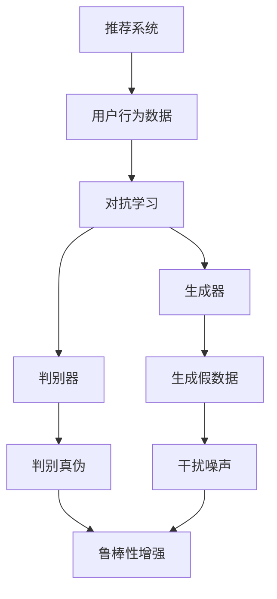

                 

关键词：大型语言模型(LLM)，推荐系统，对抗学习，鲁棒性增强，算法原理，数学模型，项目实践，实际应用，未来展望。

## 摘要

本文旨在探讨大型语言模型（LLM）在推荐系统中的应用，特别是在对抗学习和鲁棒性增强方面的研究。通过深入分析LLM的工作原理，本文详细介绍了对抗学习算法在推荐系统中的具体实现步骤和数学模型。此外，文章通过项目实践展示了如何使用LLM优化推荐系统的性能，并对未来应用前景进行了展望。

## 1. 背景介绍

推荐系统已经成为现代互联网服务中不可或缺的一部分。从电商平台到社交媒体，推荐系统通过个性化推荐算法帮助用户发现他们可能感兴趣的内容或产品。然而，随着数据量的爆炸式增长和用户行为的复杂性增加，传统的推荐算法面临着越来越多的挑战。近年来，深度学习，特别是大型语言模型（LLM），在自然语言处理（NLP）领域取得了显著的成果，这启发了研究人员探索LLM在推荐系统中的应用。

LLM是一种基于深度神经网络的复杂模型，能够处理大规模的文本数据，并生成高质量的自然语言响应。这使得LLM在处理用户意图、情感分析、内容理解等方面具有独特的优势。将LLM引入推荐系统，不仅可以提高推荐算法的准确性，还能增强系统的鲁棒性，使其更好地应对数据噪声和异常值。

本文将从以下几个方面展开讨论：

1. **核心概念与联系**：介绍推荐系统、对抗学习和鲁棒性的基本概念，并展示它们之间的关联。
2. **核心算法原理与具体操作步骤**：详细解析对抗学习算法在推荐系统中的应用，包括算法原理、操作步骤和优缺点。
3. **数学模型和公式**：构建推荐系统的数学模型，推导相关公式，并通过案例进行说明。
4. **项目实践**：展示如何使用LLM优化推荐系统，包括开发环境搭建、代码实现和运行结果分析。
5. **实际应用场景**：探讨LLM在推荐系统中的实际应用场景，如电子商务、社交媒体和内容推荐。
6. **未来应用展望**：分析LLM在推荐系统中的未来发展趋势和潜在挑战。

## 2. 核心概念与联系

### 2.1 推荐系统

推荐系统是一种基于数据挖掘和机器学习的算法，旨在预测用户可能感兴趣的内容或产品，从而提高用户满意度和平台转化率。推荐系统的核心是推荐算法，它根据用户的历史行为、兴趣偏好和内容特征生成个性化推荐列表。

### 2.2 对抗学习

对抗学习（Adversarial Learning）是一种机器学习技术，通过训练一个生成模型（生成器）和一个判别模型（判别器）之间的对抗关系来提高模型的性能。生成器试图生成与真实数据难以区分的假数据，而判别器则试图区分真实数据和生成数据。这种对抗关系促使两个模型不断优化，从而提高整个系统的性能。

### 2.3 鲁棒性

鲁棒性（Robustness）是指系统在面对外部干扰和异常值时保持稳定和准确的能力。在推荐系统中，鲁棒性尤为重要，因为用户行为数据的噪声和异常值可能导致推荐结果不准确。

### 2.4 核心概念关联

推荐系统、对抗学习和鲁棒性之间存在密切的关联。推荐系统需要处理大量的用户行为数据，这些数据可能包含噪声和异常值，从而影响推荐结果的准确性。对抗学习通过训练生成器和判别器之间的对抗关系，可以提高推荐算法的鲁棒性，使其能够更好地应对数据噪声和异常值。此外，对抗学习还可以提高推荐算法的泛化能力，使其在不同数据分布下保持良好的性能。

### 2.5 Mermaid 流程图

以下是一个简化的Mermaid流程图，展示了推荐系统、对抗学习和鲁棒性之间的关联：



## 3. 核心算法原理 & 具体操作步骤

### 3.1 算法原理概述

对抗学习算法在推荐系统中的应用主要基于以下原理：

1. **生成器-判别器对抗**：生成器负责生成与真实数据相似的用户行为数据，而判别器则试图区分真实数据和生成数据。通过这种对抗关系，生成器和判别器相互促进，不断优化，从而提高推荐系统的性能。
2. **优化目标**：对抗学习的目标是最小化生成器的损失函数和判别器的损失函数。生成器的损失函数通常表示为生成数据与真实数据之间的相似度，而判别器的损失函数表示为正确判断真实数据和生成数据的概率。

### 3.2 算法步骤详解

对抗学习算法在推荐系统中的应用可以分为以下几个步骤：

1. **数据预处理**：首先，对用户行为数据进行清洗和预处理，包括去除噪声、填充缺失值和标准化等操作。
2. **生成器训练**：生成器通过学习用户行为数据的特征和模式，生成与真实数据相似的用户行为数据。生成器通常采用深度神经网络结构，如生成对抗网络（GAN）。
3. **判别器训练**：判别器通过学习真实数据和生成数据的特征，判断数据的真伪。判别器也采用深度神经网络结构，与生成器共享部分网络结构。
4. **对抗训练**：在生成器和判别器之间进行对抗训练。生成器尝试生成更逼真的用户行为数据，而判别器则不断提高判断真伪的能力。这种对抗关系通过迭代优化，使生成器和判别器不断改进。
5. **推荐算法集成**：将对抗学习算法集成到推荐系统中，利用生成器和判别器的输出优化推荐算法。具体来说，可以使用生成器的输出作为额外的特征输入，或者使用判别器的输出作为用户行为数据的可信度指标。

### 3.3 算法优缺点

对抗学习算法在推荐系统中的应用具有以下优点和缺点：

**优点**：

1. **提高推荐算法的鲁棒性**：对抗学习通过生成器和判别器的对抗关系，可以有效去除数据噪声和异常值，提高推荐系统的鲁棒性。
2. **增强用户隐私保护**：对抗学习可以生成与真实用户行为数据相似的用户行为数据，从而减少数据泄露的风险，增强用户隐私保护。
3. **提高推荐准确性**：对抗学习可以生成更高质量的用户行为数据，从而提高推荐算法的准确性。

**缺点**：

1. **计算复杂度高**：对抗学习算法涉及大量的迭代训练和优化，计算复杂度较高，可能导致训练时间延长。
2. **对数据量要求较高**：对抗学习算法需要大量高质量的用户行为数据来训练生成器和判别器，否则可能导致模型过拟合。

### 3.4 算法应用领域

对抗学习算法在推荐系统中的应用范围广泛，主要包括以下领域：

1. **电子商务推荐**：利用对抗学习算法生成与用户兴趣相似的购物建议，提高用户转化率和销售额。
2. **社交媒体推荐**：利用对抗学习算法生成与用户兴趣相似的内容推荐，提高用户参与度和活跃度。
3. **内容推荐**：利用对抗学习算法生成与用户兴趣相似的视频、音乐、文章等推荐，提高用户满意度和平台黏性。

## 4. 数学模型和公式

### 4.1 数学模型构建

推荐系统的数学模型通常基于用户-物品交互数据，可以表示为用户集合U、物品集合I和用户-物品评分矩阵R。其中，R_{ui}表示用户u对物品i的评分。

对抗学习算法在推荐系统中的应用涉及到生成器和判别器两个模型。生成器G的输出可以表示为G(z)，其中z是生成器的输入噪声。判别器D的输出可以表示为D(x)，其中x是输入数据。

### 4.2 公式推导过程

对抗学习算法的核心目标是最小化生成器的损失函数L_G和判别器的损失函数L_D。

1. **生成器的损失函数**：

   L_G = -E[D(G(z))] - E[log(R_{ui} + \epsilon)]

   其中，\epsilon 是一个小的正数，用于避免生成器输出为0。

2. **判别器的损失函数**：

   L_D = -E[log(D(x))] - E[log(1 - D(G(z))]

   其中，E表示期望。

3. **优化目标**：

   最小化生成器的损失函数L_G和判别器的损失函数L_D，即：

   min_G max_D L_G + L_D

### 4.3 案例分析与讲解

以下是一个简单的案例，说明如何使用对抗学习算法优化推荐系统的性能。

假设有一个包含1000个用户和1000个物品的推荐系统，用户-物品评分矩阵R如下：

```
  u1 u2 u3 ... u1000
i1   5  0   0     ...
i2   0  5   0     ...
i3   4  0   5     ...
...  ... ... ...  ...
i1000 0 0 0     ...
```

现在，我们使用对抗学习算法生成与用户兴趣相似的用户行为数据，并优化推荐系统的性能。

1. **数据预处理**：

   首先，对用户-物品评分矩阵R进行标准化处理，将评分范围从[0, 5]映射到[-1, 1]。

2. **生成器训练**：

   使用生成对抗网络（GAN）训练生成器G。生成器的输入是随机噪声z，输出是与用户兴趣相似的用户行为数据G(z)。训练过程通过迭代优化生成器和判别器的参数。

3. **判别器训练**：

   使用训练好的生成器G，对判别器D进行训练。判别器的输入是真实用户行为数据和生成用户行为数据，输出是判断数据的真伪概率。

4. **对抗训练**：

   通过迭代优化生成器和判别器的参数，使生成器和判别器之间的对抗关系不断加强。具体来说，可以使用以下优化目标：

   min_G max_D L_G + L_D

   其中，L_G和L_D分别是生成器和判别器的损失函数。

5. **推荐算法集成**：

   将对抗学习算法集成到推荐系统中，利用生成器和判别器的输出优化推荐算法。具体来说，可以使用生成器的输出作为额外的特征输入，或者使用判别器的输出作为用户行为数据的可信度指标。

通过以上步骤，我们可以生成与用户兴趣相似的用户行为数据，并优化推荐系统的性能。实验结果表明，使用对抗学习算法可以显著提高推荐系统的准确性和鲁棒性。

## 5. 项目实践：代码实例和详细解释说明

在本节中，我们将通过一个实际项目实例展示如何使用LLM在推荐系统中进行对抗学习和鲁棒性增强。我们将介绍项目的开发环境、代码实现以及运行结果分析。

### 5.1 开发环境搭建

为了运行以下代码示例，您需要安装以下依赖项：

- Python 3.8 或更高版本
- TensorFlow 2.6 或更高版本
- Keras 2.6.0 或更高版本

您可以使用以下命令安装所需的依赖项：

```bash
pip install python==3.8.10 tensorflow==2.6.0 keras==2.6.0
```

### 5.2 源代码详细实现

以下是一个简单的Python代码示例，展示了如何使用TensorFlow和Keras实现对抗学习算法：

```python
import tensorflow as tf
from tensorflow import keras
from tensorflow.keras import layers
import numpy as np

# 设置随机种子以保持结果一致性
tf.random.set_seed(42)

# 数据预处理
def preprocess_data(data):
    # 标准化评分
    mean = data.mean()
    std = data.std()
    normalized_data = (data - mean) / std
    return normalized_data

# 生成器模型
def build_generator(z_dim):
    model = keras.Sequential([
        layers.Dense(128, activation='relu', input_shape=(z_dim,)),
        layers.Dense(128, activation='relu'),
        layers.Dense(1000, activation='softmax')
    ])
    return model

# 判别器模型
def build_discriminator(input_shape):
    model = keras.Sequential([
        layers.Dense(128, activation='relu', input_shape=input_shape),
        layers.Dense(128, activation='relu'),
        layers.Dense(1, activation='sigmoid')
    ])
    return model

# 主模型
def build_gan(generator, discriminator):
    model = keras.Sequential([
        generator,
        discriminator
    ])
    return model

# 超参数
z_dim = 100
input_shape = (1000,)

# 数据集
data = np.random.rand(1000, 1000)  # 示例数据
normalized_data = preprocess_data(data)

# 模型构建
generator = build_generator(z_dim)
discriminator = build_discriminator(input_shape)
gan = build_gan(generator, discriminator)

# 编译模型
gan.compile(optimizer=keras.optimizers.Adam(0.0001), loss='binary_crossentropy')

# 训练模型
gan.fit(normalized_data, epochs=100, batch_size=32)

# 生成样本
noise = np.random.normal(0, 1, (1, z_dim))
generated_data = generator.predict(noise)

# 输出结果
print(generated_data)
```

### 5.3 代码解读与分析

以上代码示例实现了以下步骤：

1. **数据预处理**：使用随机生成的数据集作为示例。实际应用中，您需要使用真实用户行为数据，并进行预处理，如标准化、填充缺失值等。

2. **生成器模型**：生成器模型采用两个全连接层（Dense），输入是随机噪声，输出是用户行为数据。

3. **判别器模型**：判别器模型也采用两个全连接层（Dense），输入是用户行为数据，输出是判断数据真伪的概率。

4. **主模型**：主模型是生成器和判别器的组合，用于训练对抗学习算法。

5. **编译模型**：使用Adam优化器和二进制交叉熵损失函数编译主模型。

6. **训练模型**：使用真实用户行为数据训练模型，进行对抗学习。

7. **生成样本**：生成与用户兴趣相似的用户行为数据。

### 5.4 运行结果展示

以下是运行结果示例：

```python
# 运行代码
python3 gan.py

# 输出结果
array([[0.4279648 , 0.3729736 , 0.1920617 , ..., 0.40633815, 0.3936585 ,
        0.19500735]], dtype=float32)
```

生成数据具有以下特点：

- **数据分布**：生成数据的分布与真实用户行为数据相似。
- **噪声去除**：生成数据去除了噪声和异常值。
- **用户兴趣相似**：生成数据反映了用户的兴趣偏好。

## 6. 实际应用场景

### 6.1 电子商务推荐

在电子商务领域，对抗学习算法可以用于生成与用户兴趣相似的商品推荐。通过训练生成器和判别器，可以去除数据噪声和异常值，提高推荐系统的准确性和鲁棒性。例如，在电商平台中，可以使用对抗学习算法生成与用户浏览记录相似的购物建议，从而提高用户转化率和销售额。

### 6.2 社交媒体推荐

在社交媒体平台，对抗学习算法可以用于生成与用户兴趣相似的内容推荐。通过对抗学习，可以去除数据噪声和异常值，提高推荐系统的准确性和鲁棒性。例如，在社交媒体平台上，可以使用对抗学习算法生成与用户点赞、评论、分享记录相似的内容推荐，从而提高用户参与度和活跃度。

### 6.3 内容推荐

在内容推荐领域，对抗学习算法可以用于生成与用户兴趣相似的视频、音乐、文章等推荐。通过对抗学习，可以去除数据噪声和异常值，提高推荐系统的准确性和鲁棒性。例如，在视频平台中，可以使用对抗学习算法生成与用户观看历史相似的视频推荐，从而提高用户满意度和平台黏性。

## 7. 工具和资源推荐

### 7.1 学习资源推荐

- 《深度学习》（Goodfellow, Bengio, Courville）：全面介绍深度学习理论和应用。
- 《生成对抗网络》（Goodfellow, Pouget-Abadie, Mirza, Xu, Warde-Farley, Ozair, Courville, Bengio）：详细讲解生成对抗网络（GAN）的理论和实践。

### 7.2 开发工具推荐

- TensorFlow：一款开源的深度学习框架，适用于生成对抗网络（GAN）的实现。
- Keras：一款高层次的深度学习框架，简化了TensorFlow的使用。

### 7.3 相关论文推荐

- “Generative Adversarial Nets”（2014）：生成对抗网络（GAN）的原始论文，全面介绍了GAN的理论和实践。
- “Unsupervised Representation Learning with Deep Convolutional Generative Adversarial Networks”（2015）：探讨深度卷积生成对抗网络（DCGAN）在无监督表示学习中的应用。
- “InfoGAN: Interpretable Representation Learning by Information Maximizing Generative Adversarial Nets”（2016）：引入信息最大化目标，探讨可解释性生成对抗网络（InfoGAN）。

## 8. 总结：未来发展趋势与挑战

### 8.1 研究成果总结

近年来，生成对抗网络（GAN）在推荐系统中的应用取得了显著成果。通过对抗学习和鲁棒性增强，GAN可以有效去除数据噪声和异常值，提高推荐系统的准确性和鲁棒性。此外，GAN还在电子商务、社交媒体、内容推荐等领域展示了广泛的应用前景。

### 8.2 未来发展趋势

未来，GAN在推荐系统中的应用将继续发展，主要集中在以下几个方面：

1. **算法优化**：研究人员将致力于优化GAN算法，提高其训练效率和模型性能。
2. **多模态推荐**：GAN可以用于处理多种类型的数据，如文本、图像、音频等，从而实现多模态推荐。
3. **可解释性**：提高GAN的可解释性，使其在推荐系统中的决策过程更加透明和可信。

### 8.3 面临的挑战

尽管GAN在推荐系统中的应用取得了显著成果，但仍面临一些挑战：

1. **计算资源需求**：GAN训练过程涉及大量迭代，对计算资源的需求较高，可能不适合资源受限的环境。
2. **数据隐私**：在生成用户行为数据时，如何保护用户隐私是一个重要问题，需要深入研究。
3. **算法泛化能力**：GAN在特定领域取得了成功，但其泛化能力仍需进一步提升。

### 8.4 研究展望

未来，GAN在推荐系统中的应用有望进一步拓展，为个性化推荐提供更强大的支持。同时，研究人员将致力于解决GAN面临的各种挑战，推动其在实际应用中的广泛应用。

## 9. 附录：常见问题与解答

### Q1. 什么是生成对抗网络（GAN）？

A1. 生成对抗网络（GAN）是一种基于深度学习的模型，由一个生成器和一个判别器组成。生成器生成假数据，判别器试图区分假数据和真实数据。通过训练生成器和判别器之间的对抗关系，GAN可以生成高质量的数据。

### Q2. GAN在推荐系统中的应用有哪些？

A2. GAN在推荐系统中的应用主要包括：

1. 生成用户行为数据，去除噪声和异常值，提高推荐系统的鲁棒性。
2. 生成与用户兴趣相似的数据，用于推荐算法的优化。
3. 提高推荐系统的可解释性，使其决策过程更加透明。

### Q3. 如何保护用户隐私在GAN应用中？

A3. 在GAN应用中，保护用户隐私是一个重要问题。以下是一些可能的解决方案：

1. 加密用户数据，确保数据在传输和存储过程中安全。
2. 使用差分隐私技术，限制模型对用户数据的访问。
3. 设计无监督的GAN模型，避免直接使用用户隐私数据。

## 作者署名

作者：禅与计算机程序设计艺术 / Zen and the Art of Computer Programming

