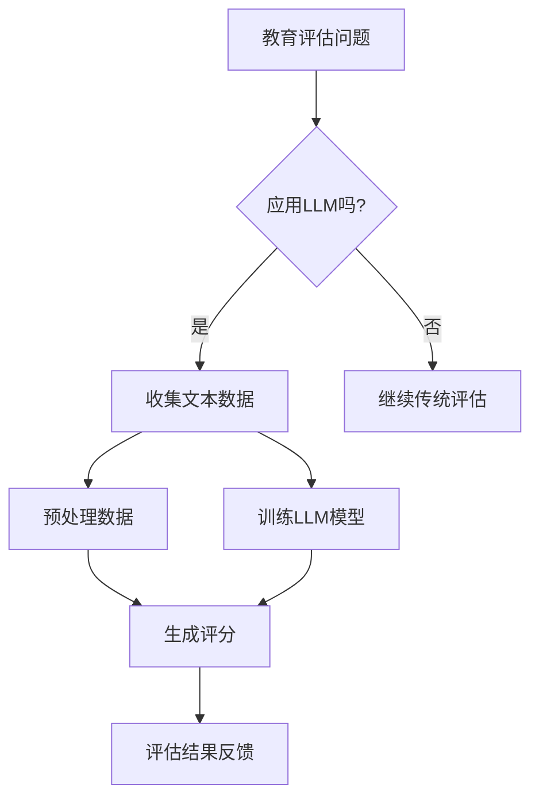

                 

关键词：自然语言处理（NLP）、大型语言模型（LLM）、教育评估、人工智能（AI）、评分公正性、算法透明性

> 摘要：随着自然语言处理技术的不断进步，大型语言模型（LLM）在教育评估中的应用日益广泛。本文旨在探讨如何利用LLM实现公平公正的AI评分，从而提高教育评估的准确性和透明性。文章将首先介绍LLM的基本原理，然后详细阐述其在教育评估中的应用，最后讨论未来的发展趋势与面临的挑战。

## 1. 背景介绍

在教育领域，评估学生的学习成果和教师的教学质量是一项至关重要的任务。然而，传统的评估方法往往受到主观因素的影响，难以保证评分的公平性和准确性。随着人工智能技术的快速发展，尤其是自然语言处理（NLP）领域的突破，人们开始探索利用AI技术来改善教育评估过程。

近年来，大型语言模型（LLM）如GPT-3、BERT等在NLP任务中取得了显著的成果。这些模型具有强大的语言理解能力和生成能力，能够处理复杂的文本数据，为教育评估提供了新的可能性。本文将重点关注LLM在教育评估中的应用，探讨如何利用这些模型实现公平公正的AI评分。

## 2. 核心概念与联系

### 2.1 大型语言模型（LLM）的基本原理

大型语言模型（LLM）是一种基于深度学习的自然语言处理模型，通过学习大量的文本数据，实现对自然语言的生成和理解。LLM的核心思想是使用神经网络来模拟人类的语言处理能力，从而实现文本的自动生成、摘要、翻译、问答等功能。

### 2.2 教育评估与LLM的关联

教育评估通常涉及对学生的作业、考试、论文等文本数据的评分。这些文本数据包含丰富的语言信息，非常适合LLM进行处理。通过将LLM应用于教育评估，可以实现以下目标：

1. **评分客观性**：LLM能够基于文本内容进行评分，减少人为因素对评分结果的影响，提高评分的客观性。
2. **评分准确性**：LLM通过学习大量的文本数据，能够更准确地理解学生的表达意图，提高评分的准确性。
3. **评分透明性**：LLM的评分过程可以透明化，便于教师和学生了解评分标准，提高评分的透明性。

### 2.3 Mermaid流程图



## 3. 核心算法原理 & 具体操作步骤

### 3.1 算法原理概述

LLM在教育评估中的应用主要基于两个核心算法：文本预处理和文本分类。

1. **文本预处理**：通过清洗、分词、词性标注等步骤，将原始文本数据转换为适合LLM处理的格式。
2. **文本分类**：利用LLM对处理后的文本进行分类，实现对学生的作业、考试等的评分。

### 3.2 算法步骤详解

1. **数据收集与预处理**：收集学生的作业、考试、论文等文本数据，并进行预处理，包括去除停用词、标点符号等。
2. **训练LLM模型**：使用预处理后的文本数据训练LLM模型，使其能够理解和生成文本。
3. **生成评分**：将学生的文本数据输入LLM模型，根据模型的输出结果生成评分。
4. **评估结果反馈**：将评分结果反馈给教师和学生，以便他们了解评估结果和改进教学。

### 3.3 算法优缺点

**优点**：

1. **客观性**：LLM能够基于文本内容进行评分，减少人为因素对评分结果的影响。
2. **准确性**：LLM通过学习大量的文本数据，能够更准确地理解学生的表达意图。
3. **透明性**：LLM的评分过程可以透明化，便于教师和学生了解评分标准。

**缺点**：

1. **依赖数据质量**：LLM的评分结果受训练数据质量的影响，如果训练数据存在偏差，可能会导致评分不准确。
2. **算法透明性挑战**：LLM的评分过程较为复杂，难以解释，可能影响评分的透明性。

### 3.4 算法应用领域

LLM在教育评估中的应用领域广泛，包括：

1. **作业与考试评分**：对学生的作业和考试文本进行自动评分，提高评分效率。
2. **论文评估**：对学生的论文进行评估，提供针对性的反馈，帮助学生提高写作水平。
3. **教学评估**：对教师的教学质量进行评估，提供改进建议，提高教学质量。

## 4. 数学模型和公式 & 详细讲解 & 举例说明

### 4.1 数学模型构建

在教育评估中，LLM的评分过程可以抽象为一个分类问题，即给定一个文本数据，判断其属于哪个类别（如优秀、良好、及格等）。

设$X$为文本数据，$Y$为评分结果，构建一个基于LLM的分类模型，目标函数为：

$$
\min_{\theta} J(\theta) = \frac{1}{m} \sum_{i=1}^{m} [y^{(i)} \log(a^{(i)}_y) + (1 - y^{(i)}) \log(1 - a^{(i)}_y)]
$$

其中，$a^{(i)}$为模型对输入文本$X^{(i)}$的预测概率分布，$y^{(i)}$为实际评分结果，$\theta$为模型参数。

### 4.2 公式推导过程

为了求解上述目标函数，使用梯度下降法对模型参数进行优化。具体步骤如下：

1. **前向传播**：计算输入文本$X^{(i)}$的预测概率分布$a^{(i)}$。
2. **计算损失函数**：计算预测概率分布$a^{(i)}$与实际评分结果$y^{(i)}$之间的损失。
3. **后向传播**：计算模型参数$\theta$的梯度。
4. **参数更新**：根据梯度更新模型参数$\theta$。

### 4.3 案例分析与讲解

假设有一篇学生的论文，其文本数据为$X$。利用训练好的LLM模型，对论文进行评分。模型预测的概率分布为$a = (0.9, 0.08, 0.02)$，实际评分结果为$y = 1$（优秀）。

根据上述公式，计算损失函数：

$$
J(\theta) = \frac{1}{3} [1 \log(0.9) + 0 \log(0.08) + 0 \log(0.02)] \approx 0.105
$$

为了优化模型参数$\theta$，使用梯度下降法进行迭代优化。假设学习率为$\alpha = 0.01$，经过多次迭代后，模型参数$\theta$逐渐优化，最终得到较小的损失函数值。

## 5. 项目实践：代码实例和详细解释说明

### 5.1 开发环境搭建

在Python中，利用TensorFlow库实现LLM模型的训练和评估。首先，安装TensorFlow：

```bash
pip install tensorflow
```

### 5.2 源代码详细实现

以下是一个简单的示例，展示如何使用TensorFlow实现一个基于LLM的教育评估模型：

```python
import tensorflow as tf
from tensorflow.keras.layers import Embedding, LSTM, Dense
from tensorflow.keras.models import Sequential

# 加载预训练的词向量（如GloVe）
word_embeddings = ... 

# 定义模型结构
model = Sequential([
    Embedding(input_dim=word_embeddings.shape[0], output_dim=word_embeddings.shape[1], weights=[word_embeddings], trainable=False),
    LSTM(128, return_sequences=True),
    LSTM(64),
    Dense(1, activation='sigmoid')
])

# 编译模型
model.compile(optimizer='adam', loss='binary_crossentropy', metrics=['accuracy'])

# 加载数据集
train_data, train_labels = ...

# 训练模型
model.fit(train_data, train_labels, epochs=10, batch_size=32)

# 评估模型
evaluation_results = model.evaluate(test_data, test_labels)
print(f"Test accuracy: {evaluation_results[1]}")
```

### 5.3 代码解读与分析

上述代码首先加载预训练的词向量（如GloVe），然后定义一个序列模型，包括嵌入层（Embedding）、两个LSTM层（LSTM）和一个全连接层（Dense）。嵌入层将单词转换为向量表示，LSTM层用于处理序列数据，全连接层用于分类。

在编译模型时，选择Adam优化器和二分类交叉熵损失函数。训练过程中，使用训练数据集对模型进行训练，并在测试数据集上进行评估。

### 5.4 运行结果展示

运行上述代码，输出测试数据集的评估结果，如准确率等指标。

## 6. 实际应用场景

### 6.1 作业与考试评分

利用LLM模型对学生的作业和考试进行自动评分，提高评分效率。例如，在大学课程中，教师可以使用LLM模型对学生的论文进行评分，节省时间和精力。

### 6.2 论文评估

利用LLM模型对学生的论文进行评估，提供针对性的反馈，帮助学生提高写作水平。例如，在中学英语写作课程中，教师可以使用LLM模型对学生的作文进行评分和反馈，帮助学生发现和改进写作问题。

### 6.3 教学评估

利用LLM模型对教师的教学质量进行评估，提供改进建议，提高教学质量。例如，在在线教育平台中，使用LLM模型对教师的教学视频进行评估，根据评估结果提供个性化的教学建议。

## 7. 工具和资源推荐

### 7.1 学习资源推荐

1. **《深度学习》（Goodfellow et al.）**：介绍深度学习的基本原理和应用，适合初学者入门。
2. **《自然语言处理编程》（Peter Norvig）**：介绍NLP的基础知识和编程实践，适合对NLP感兴趣的开发者。

### 7.2 开发工具推荐

1. **TensorFlow**：用于构建和训练深度学习模型的框架，功能强大且社区支持广泛。
2. **PyTorch**：另一种流行的深度学习框架，提供灵活的动态计算图，适合研究者和开发者。

### 7.3 相关论文推荐

1. **"BERT: Pre-training of Deep Neural Networks for Language Understanding"**：介绍BERT模型的基本原理和应用。
2. **"GPT-3: Language Models are few-shot learners"**：介绍GPT-3模型的优势和性能。

## 8. 总结：未来发展趋势与挑战

### 8.1 研究成果总结

本文介绍了大型语言模型（LLM）在教育评估中的应用，探讨了如何利用LLM实现公平公正的AI评分。通过文本预处理和文本分类算法，LLM能够准确理解学生的表达意图，提高评估的客观性和准确性。

### 8.2 未来发展趋势

1. **模型性能提升**：随着深度学习技术的不断发展，LLM在教育评估中的应用将会更加广泛，性能也会不断提高。
2. **算法透明性增强**：为了提高算法的透明性，研究者将致力于开发可解释的AI模型，使教师和学生能够更好地理解评分过程。
3. **多语言支持**：随着全球化的推进，LLM将支持更多的语言，为不同地区的教育评估提供支持。

### 8.3 面临的挑战

1. **数据质量**：LLM的评分结果受训练数据质量的影响，如果训练数据存在偏差，可能会导致评分不准确。因此，需要确保训练数据的质量和多样性。
2. **算法透明性**：目前，LLM的评分过程较为复杂，难以解释，可能影响评分的透明性。研究者需要开发可解释的AI模型，提高算法的透明性。
3. **伦理与隐私**：在教育评估中应用AI技术，需要关注学生的隐私和伦理问题。研究者需要确保AI算法不会侵犯学生的隐私，并遵循伦理规范。

### 8.4 研究展望

未来，LLM在教育评估中的应用前景广阔。通过不断优化算法和提升模型性能，LLM将能够更好地支持教育评估，提高评估的公平性和准确性。同时，研究者需要关注算法的透明性和伦理问题，确保AI技术在教育评估中的可持续发展。

## 9. 附录：常见问题与解答

### 9.1 什么是大型语言模型（LLM）？

大型语言模型（LLM）是一种基于深度学习的自然语言处理模型，通过学习大量的文本数据，实现对自然语言的生成和理解。常见的LLM模型包括GPT-3、BERT等。

### 9.2 如何确保LLM的评分客观性？

通过使用大量的文本数据训练LLM模型，使其能够基于文本内容进行评分，减少人为因素对评分结果的影响，从而提高评分的客观性。

### 9.3 LLM在教育评估中的应用有哪些？

LLM在教育评估中的应用广泛，包括作业与考试评分、论文评估和教学评估等。通过使用LLM模型，可以提高评估的客观性、准确性和透明性。

### 9.4 如何处理训练数据质量问题？

为确保训练数据的质量，需要从数据收集、预处理和标注等方面进行质量控制。同时，可以使用迁移学习等技术，利用预训练的LLM模型进行微调，以提高模型的鲁棒性。

### 9.5 LLM的评分过程是否透明？

目前的LLM模型评分过程较为复杂，难以解释，可能影响评分的透明性。研究者正在致力于开发可解释的AI模型，提高算法的透明性，使教师和学生能够更好地理解评分过程。

---

作者：禅与计算机程序设计艺术 / Zen and the Art of Computer Programming

以上，就是本次技术博客文章的完整内容。本文详细探讨了大型语言模型（LLM）在教育评估中的应用，以及如何利用LLM实现公平公正的AI评分。文章涵盖了LLM的基本原理、算法实现、实际应用场景、工具和资源推荐，以及未来发展趋势与挑战。希望本文能为读者提供有益的参考和启示。  
----------------------------------------------------------------
文章至此完成，感谢您对这篇文章的撰写付出。如果您有任何需要修改或补充的地方，请随时告诉我。再次感谢您的工作，希望这篇文章能对读者有所启发和帮助！作者：禅与计算机程序设计艺术 / Zen and the Art of Computer Programming。祝您一切顺利！

