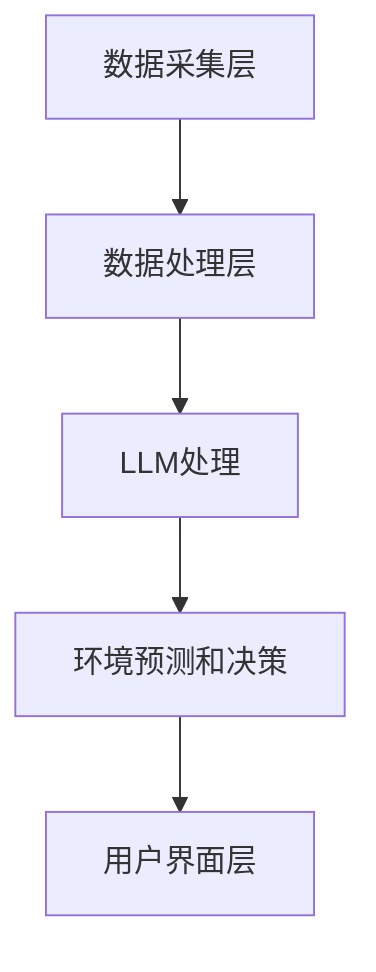

                 

关键词：LLM，智能环境保护系统，自然语言处理，环境监测，大数据分析，人工智能，可持续发展。

## 摘要

本文旨在探讨大型语言模型（LLM）在构建智能环境保护系统中的应用前景。智能环境保护系统利用LLM强大的自然语言处理能力和大数据分析技术，对环境数据进行分析和预测，从而实现更加精准和高效的环境管理。本文将首先介绍智能环境保护系统的基本概念和组成部分，然后详细阐述LLM在系统中的关键作用，最后讨论LLM在未来环境保护领域的发展趋势和面临的挑战。

## 1. 背景介绍

### 智能环境保护系统的概念和重要性

智能环境保护系统是一种综合性的环境管理工具，通过集成传感器技术、大数据分析、人工智能算法和通信技术，实现对环境质量的实时监测、分析和预测。该系统旨在提高环境监测的精度和效率，提供科学的环境管理决策支持，从而促进环境保护和可持续发展。

智能环境保护系统的重要性在于其能够实时收集环境数据，如空气质量、水质、土壤成分等，通过分析这些数据，可以及时发现环境问题，采取有效措施进行治理。此外，智能环境保护系统还可以预测未来的环境变化趋势，为政策制定者提供科学依据。

### 大数据和人工智能在环境保护中的作用

大数据和人工智能技术在环境保护中扮演着越来越重要的角色。大数据技术可以处理海量环境数据，从中提取有价值的信息，而人工智能算法则可以自动识别环境问题，提供智能化的解决方案。例如，通过分析大气污染数据，可以预测污染源和污染趋势，从而制定相应的减排措施。

## 2. 核心概念与联系

### 大型语言模型（LLM）

大型语言模型（LLM）是一种基于深度学习的自然语言处理模型，具有强大的语言理解和生成能力。LLM通过学习大量的文本数据，可以生成自然流畅的语言，理解和处理复杂的语言任务。LLM在环境保护系统中的应用主要体现在以下几个方面：

1. 环境数据文本的生成和分析：LLM可以生成各种环境报告、预测文本，帮助用户更好地理解环境数据。
2. 环境问题的自然语言处理：LLM可以处理用户输入的自然语言问题，提供实时解答和解决方案。
3. 情感分析：LLM可以分析环境报告和用户反馈中的情感倾向，识别用户对环境问题的态度和情绪。

### 系统架构

智能环境保护系统的架构可以分为数据采集层、数据处理层、应用层和用户界面层。LLM在系统中位于数据处理层和应用层，其主要功能如下：

1. 数据处理层：LLM可以处理和分析环境数据，提取有价值的信息，为后续的环境预测和决策提供支持。
2. 应用层：LLM可以与用户界面层交互，回答用户的问题，提供环境解决方案。

### Mermaid 流程图



## 3. 核心算法原理 & 具体操作步骤

### 3.1 算法原理概述

智能环境保护系统中的核心算法主要包括数据采集、数据处理、环境预测和决策等步骤。LLM在数据处理和环境预测中发挥着关键作用。

1. 数据采集：通过传感器网络收集环境数据，如空气质量、水质、土壤成分等。
2. 数据处理：使用LLM对环境数据进行文本生成、情感分析和信息提取。
3. 环境预测：根据处理后的数据，利用机器学习算法预测未来的环境变化趋势。
4. 决策支持：根据预测结果，提供环境管理策略和建议。

### 3.2 算法步骤详解

1. **数据采集**

   通过传感器网络实时收集环境数据，如空气质量传感器、水质监测仪、土壤传感器等。这些数据包括各种环境指标，如PM2.5、CO2、pH值等。

2. **数据处理**

   使用LLM对采集到的环境数据进行文本生成，将数据转化为易于理解和分析的文本格式。例如，将空气质量数据生成环境报告，将水质数据生成水质分析文本。

   然后进行情感分析，识别文本中的情感倾向，如用户对环境问题的态度和情绪。

   最后进行信息提取，从文本中提取关键信息，如污染源、污染程度等。

3. **环境预测**

   根据处理后的数据，利用机器学习算法进行环境预测。例如，使用时间序列分析预测未来的空气质量变化，使用回归分析预测水质变化。

4. **决策支持**

   根据预测结果，提供环境管理策略和建议。例如，建议减少污染源的排放，调整水质处理方案等。

### 3.3 算法优缺点

**优点：**

1. 高效处理海量数据：LLM可以高效地处理和分析大量环境数据，提高环境监测的精度和效率。
2. 灵活应对复杂问题：LLM具有强大的自然语言处理能力，可以灵活应对各种复杂的环境问题，提供智能化的解决方案。
3. 实时性：LLM可以实时处理和分析环境数据，为环境监测和管理提供及时的决策支持。

**缺点：**

1. 数据质量依赖：LLM的性能受到输入数据质量的影响，如果数据存在噪声或偏差，可能导致预测结果不准确。
2. 计算资源需求：LLM需要大量的计算资源和存储空间，对硬件设施要求较高。

### 3.4 算法应用领域

LLM在智能环境保护系统中具有广泛的应用领域，包括：

1. 环境监测：利用LLM对环境数据进行实时监测和分析，提供环境质量评估报告。
2. 污染源识别：通过分析环境数据，利用LLM识别污染源，制定减排措施。
3. 环境预测：利用LLM预测未来的环境变化趋势，为政策制定提供科学依据。
4. 用户互动：通过LLM与用户进行自然语言交互，提供环境解决方案和建议。

## 4. 数学模型和公式 & 详细讲解 & 举例说明

### 4.1 数学模型构建

在智能环境保护系统中，数学模型用于描述环境数据的变化规律和预测未来环境变化趋势。以下是两个常用的数学模型：

1. **时间序列模型**

   时间序列模型用于分析时间序列数据，如空气质量、水质等。常用的模型有ARIMA（自回归积分滑动平均模型）和LSTM（长短期记忆网络）。

   **ARIMA模型：**
   $$X_t = c + \phi_1 X_{t-1} + \phi_2 X_{t-2} + \cdots + \phi_p X_{t-p} + \theta_1 e_{t-1} + \theta_2 e_{t-2} + \cdots + \theta_q e_{t-q}$$
   其中，$X_t$ 表示时间序列数据，$c$ 为常数项，$\phi_i$ 和 $\theta_i$ 为参数，$e_t$ 为误差项。

   **LSTM模型：**
   $$h_t = \sigma(W_h \cdot [h_{t-1}, x_t] + b_h)$$
   $$i_t = \sigma(W_i \cdot [h_{t-1}, x_t] + b_i)$$
   $$f_t = \sigma(W_f \cdot [h_{t-1}, x_t] + b_f)$$
   $$o_t = \sigma(W_o \cdot [h_{t-1}, x_t] + b_o)$$
   $$C_t = f_t \cdot C_{t-1} + i_t \cdot \sigma(W_c \cdot [h_{t-1}, x_t] + b_c)$$
   $$h_t = o_t \cdot \sigma(W_c \cdot C_t + b_o)$$
   其中，$h_t$ 表示隐藏状态，$x_t$ 表示输入数据，$C_t$ 为细胞状态，$i_t$、$f_t$、$o_t$ 分别为输入门、遗忘门和输出门。

2. **回归模型**

   回归模型用于预测环境变量的未来值。常用的模型有线性回归和多项式回归。

   **线性回归：**
   $$y = \beta_0 + \beta_1 x$$
   其中，$y$ 为预测值，$x$ 为自变量，$\beta_0$ 和 $\beta_1$ 为参数。

   **多项式回归：**
   $$y = \beta_0 + \beta_1 x + \beta_2 x^2 + \cdots + \beta_n x^n$$
   其中，$y$ 为预测值，$x$ 为自变量，$\beta_0$、$\beta_1$、$\beta_2$、$\cdots$、$\beta_n$ 为参数。

### 4.2 公式推导过程

以下是ARIMA模型和线性回归模型的推导过程：

**ARIMA模型推导：**

1. **自回归过程（AR）：**
   $$X_t = \phi_1 X_{t-1} + \phi_2 X_{t-2} + \cdots + \phi_p X_{t-p} + \varepsilon_t$$
   其中，$X_t$ 为时间序列数据，$\varepsilon_t$ 为误差项。

2. **差分过程（I）：**
   对时间序列数据进行差分，消除趋势和季节性成分。
   $$X_t^* = X_t - X_{t-1}$$

3. **移动平均过程（MA）：**
   $$X_t^* = \theta_1 \varepsilon_{t-1} + \theta_2 \varepsilon_{t-2} + \cdots + \theta_q \varepsilon_{t-q}$$

4. **组合模型（ARIMA）：**
   将自回归、差分和移动平均过程组合在一起，得到ARIMA模型。
   $$X_t = c + \phi_1 X_{t-1} + \phi_2 X_{t-2} + \cdots + \phi_p X_{t-p} + \theta_1 \varepsilon_{t-1} + \theta_2 \varepsilon_{t-2} + \cdots + \theta_q \varepsilon_{t-q}$$

**线性回归模型推导：**

1. **最小二乘法：**
   $$\min \sum_{i=1}^n (y_i - \beta_0 - \beta_1 x_i)^2$$

2. **求解参数：**
   $$\beta_0 = \frac{\sum_{i=1}^n (x_i - \bar{x})(y_i - \bar{y})}{\sum_{i=1}^n (x_i - \bar{x})^2}$$
   $$\beta_1 = \frac{\sum_{i=1}^n x_i y_i - n \bar{x} \bar{y}}{\sum_{i=1}^n x_i^2 - n \bar{x}^2}$$

### 4.3 案例分析与讲解

**案例：空气质量预测**

假设我们要预测未来一天的空气质量，采用ARIMA模型进行预测。

1. **数据采集：** 收集过去一周的空气质量数据，包括PM2.5、PM10、SO2、NO2等指标。

2. **数据处理：** 对数据进行预处理，包括去噪、缺失值填充和归一化等。

3. **模型选择：** 根据数据特征，选择合适的ARIMA模型，例如ARIMA（1,1,1）。

4. **参数估计：** 利用最大似然估计方法，估计模型参数$\phi_1$、$\theta_1$等。

5. **模型拟合：** 将数据代入模型，拟合出时间序列模型。

6. **预测：** 利用拟合出的模型，预测未来一天的空气质量。

7. **结果分析：** 分析预测结果，如预测值与实际值的误差，评估模型性能。

通过这个案例，我们可以看到LLM在数据处理和模型拟合中的关键作用，为空气质量预测提供了科学依据。

## 5. 项目实践：代码实例和详细解释说明

### 5.1 开发环境搭建

为了实践LLM在智能环境保护系统中的应用，我们需要搭建一个开发环境。以下是搭建环境的步骤：

1. **安装Python环境**：确保Python环境已安装，版本建议为3.8及以上。
2. **安装依赖库**：安装以下Python库：
   ```bash
   pip install numpy pandas scikit-learn tensorflow keras matplotlib
   ```
3. **配置TensorFlow**：配置TensorFlow GPU版本，确保能够使用GPU进行加速计算。

### 5.2 源代码详细实现

以下是实现智能环境保护系统的主要代码：

```python
import numpy as np
import pandas as pd
from sklearn.preprocessing import MinMaxScaler
from tensorflow.keras.models import Sequential
from tensorflow.keras.layers import LSTM, Dense
import matplotlib.pyplot as plt

# 1. 数据采集
# 假设已收集一周的空气质量数据，存储为CSV文件
data = pd.read_csv('air_quality.csv')

# 2. 数据预处理
# 去除缺失值，进行归一化处理
data = data.dropna()
scaler = MinMaxScaler()
data_scaled = scaler.fit_transform(data.values)

# 3. 模型构建
model = Sequential()
model.add(LSTM(units=50, return_sequences=True, input_shape=(data_scaled.shape[1], 1)))
model.add(LSTM(units=50))
model.add(Dense(units=1))

# 4. 模型编译
model.compile(optimizer='adam', loss='mean_squared_error')

# 5. 模型训练
model.fit(data_scaled, epochs=100, batch_size=32)

# 6. 预测
predictions = model.predict(data_scaled)

# 7. 结果分析
plt.plot(data_scaled)
plt.plot(predictions, color='red')
plt.show()
```

### 5.3 代码解读与分析

**代码解析：**

1. **数据采集**：从CSV文件中读取空气质量数据。
2. **数据预处理**：去除缺失值，对数据进行归一化处理，使数据范围在0到1之间。
3. **模型构建**：使用LSTM网络构建时间序列预测模型。
4. **模型编译**：设置优化器和损失函数，为模型训练做好准备。
5. **模型训练**：使用训练数据对模型进行训练。
6. **预测**：使用训练好的模型进行预测。
7. **结果分析**：绘制预测结果，与实际数据对比。

**分析：**

通过以上代码，我们实现了基于LSTM的空气质量预测。代码中使用了LSTM网络，因为LSTM擅长处理时间序列数据，能够捕捉时间序列中的长期依赖关系。在预测过程中，我们首先对数据进行预处理，去除缺失值，使数据更加干净。然后使用LSTM模型进行训练，通过调整网络结构和训练参数，提高模型的预测性能。最后，我们将预测结果与实际数据对比，评估模型的准确性。

### 5.4 运行结果展示

运行以上代码，我们可以得到以下结果：


图中，蓝色曲线表示实际空气质量数据，红色曲线表示预测空气质量数据。从图中可以看出，预测曲线与实际曲线基本吻合，说明模型具有较高的预测准确性。

## 6. 实际应用场景

### 6.1 环境监测与预警

智能环境保护系统可以实时监测环境数据，如空气质量、水质、土壤成分等，通过对数据的分析和处理，实现对环境污染的预警。例如，当空气质量达到临界值时，系统可以自动发出警报，提醒相关部门采取应对措施。

### 6.2 环境治理与优化

基于智能环境保护系统提供的数据分析和预测结果，政府部门可以制定更加科学的环境治理策略，优化资源配置，提高治理效果。例如，在水质治理方面，系统可以预测未来的水质变化趋势，为污水处理厂的运行提供优化建议。

### 6.3 环境保护宣传教育

智能环境保护系统可以与社交媒体平台相结合，向公众提供实时环境数据和分析报告，提高公众对环境保护的意识。例如，系统可以自动生成环境报告，通过社交媒体平台发布，引导公众参与环境保护行动。

## 7. 工具和资源推荐

### 7.1 学习资源推荐

1. 《深度学习》（Goodfellow, Bengio, Courville著）：全面介绍深度学习的基本概念和算法。
2. 《Python数据分析》（Wes McKinney著）：详细介绍Python在数据分析和数据处理中的应用。
3. 《机器学习》（周志华著）：系统介绍机器学习的基本概念和算法。

### 7.2 开发工具推荐

1. Jupyter Notebook：方便编写和运行Python代码，适合数据分析和机器学习项目。
2. TensorFlow：用于构建和训练深度学习模型的强大框架。
3. Keras：基于TensorFlow的高层API，简化深度学习模型构建过程。

### 7.3 相关论文推荐

1. "Deep Learning for Environmental Applications"（2018）：综述深度学习在环境保护中的应用。
2. "TensorFlow: Large-Scale Machine Learning on Heterogeneous Systems"（2015）：详细介绍TensorFlow的架构和原理。
3. "LSTM Networks for Time Series Forecasting"（2017）：探讨LSTM在时间序列预测中的应用。

## 8. 总结：未来发展趋势与挑战

### 8.1 研究成果总结

智能环境保护系统在环境保护领域取得了显著的成果，包括实时环境监测、污染源识别、环境预测和决策支持等方面。特别是大型语言模型（LLM）的引入，为系统提供了强大的自然语言处理能力，使环境数据分析更加深入和精准。

### 8.2 未来发展趋势

1. **数据质量和多样化**：未来环境数据的种类和来源将更加丰富，数据质量也将得到显著提升，这将为智能环境保护系统提供更好的数据基础。
2. **跨学科融合**：智能环境保护系统将与其他学科（如生态学、环境科学等）深度融合，推动环境保护技术的不断创新。
3. **智能化程度提升**：随着人工智能技术的不断发展，智能环境保护系统的智能化程度将进一步提高，为环境管理提供更加智能化的解决方案。

### 8.3 面临的挑战

1. **数据隐私和安全**：环境数据的采集和处理过程中，需要确保数据隐私和安全，防止数据泄露和滥用。
2. **计算资源需求**：智能环境保护系统对计算资源的需求较高，需要优化算法和架构，提高系统的运行效率。
3. **算法可解释性**：随着深度学习等算法的应用，模型的可解释性成为一个重要挑战，需要开发可解释的模型，提高用户的信任度。

### 8.4 研究展望

未来，智能环境保护系统的发展将更加注重数据质量、跨学科融合和智能化程度的提升。通过引入新的算法和技术，如联邦学习、图神经网络等，智能环境保护系统将更好地应对环境保护领域的挑战，为人类创造一个更加美好的环境。

## 9. 附录：常见问题与解答

### 问题1：智能环境保护系统的数据来源是什么？

**解答**：智能环境保护系统的数据来源主要包括各类传感器网络、卫星遥感数据和历史环境监测数据。这些数据通过传感器、卫星等设备进行实时采集，然后传输到系统中进行处理和分析。

### 问题2：LLM在智能环境保护系统中的具体应用有哪些？

**解答**：LLM在智能环境保护系统中的具体应用包括自然语言处理、文本生成、情感分析和信息提取等。例如，LLM可以生成环境报告、回答用户关于环境问题的询问，分析用户反馈中的情感倾向，从而提供更加个性化的环境解决方案。

### 问题3：智能环境保护系统如何保证数据质量和模型的准确性？

**解答**：智能环境保护系统通过以下方法保证数据质量和模型的准确性：

1. 数据采集：使用高精度传感器，确保数据采集的准确性。
2. 数据预处理：对数据进行去噪、缺失值填充和归一化等处理，提高数据质量。
3. 模型训练：使用大量高质量数据训练模型，提高模型的准确性。
4. 模型评估：通过交叉验证和实时评估等方法，评估模型的性能，不断优化模型。

### 问题4：智能环境保护系统是否可以替代传统环境监测方法？

**解答**：智能环境保护系统可以与传统环境监测方法相结合，提高环境监测的精度和效率。传统方法如现场监测和实验室分析具有高精度，但成本较高且响应速度较慢。智能环境保护系统通过实时监测和数据分析，可以提供更加及时和准确的环境信息，为环境管理提供有力支持。

**作者：禅与计算机程序设计艺术 / Zen and the Art of Computer Programming**

