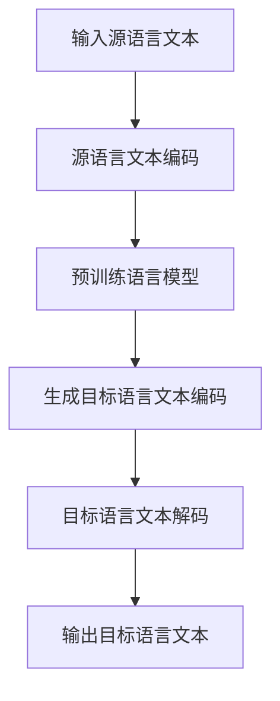

                 

关键词：机器翻译，预训练语言模型，自然语言处理，深度学习，大规模语料库，翻译质量，多语言交互，跨语言信息传递，语言多样性，语言习得模型。

> 摘要：随着自然语言处理技术的不断进步，大型语言模型（LLM）在机器翻译领域取得了显著突破。本文将从背景介绍、核心概念与联系、核心算法原理与操作步骤、数学模型与公式、项目实践、实际应用场景、未来应用展望、工具和资源推荐以及未来发展趋势与挑战等方面，深入探讨LLM在机器翻译领域的应用现状及其面临的挑战。

## 1. 背景介绍

### 1.1 机器翻译的起源与发展

机器翻译（Machine Translation，简称MT）作为一种旨在实现计算机辅助翻译的技术，起源于20世纪50年代。当时，计算机科学刚刚起步，人们开始探索如何利用计算机来实现语言的自动翻译。早期的机器翻译系统主要基于规则的方法，依赖于预定义的语言规则和词汇表。然而，这种方法在处理复杂、多样性的语言时表现不佳，翻译质量较低。

随着自然语言处理（Natural Language Processing，简称NLP）技术的发展，机器翻译逐渐从规则驱动转向数据驱动的方法。20世纪90年代，统计机器翻译（Statistical Machine Translation，简称SMT）开始崛起，利用大规模语料库进行训练，通过概率模型实现翻译。这一阶段，机器翻译的性能得到了显著提升。

进入21世纪，深度学习技术在计算机视觉、语音识别等领域取得了突破性进展，这些技术的引入使得机器翻译领域迎来了新的机遇。2018年，谷歌发布了基于Transformer架构的神经网络机器翻译（Neural Machine Translation，简称NMT）系统，进一步提高了机器翻译的准确性。这一里程碑式的进展标志着深度学习在机器翻译领域的全面应用。

### 1.2 大型语言模型（LLM）的兴起

大型语言模型（Large Language Model，简称LLM）是指那些拥有数十亿甚至数万亿参数的语言模型。这类模型通过对大规模语料库的预训练，具备了强大的语言理解和生成能力。LLM的兴起，源于深度学习技术的进步和计算资源的丰富。例如，OpenAI的GPT系列模型、谷歌的BERT模型等，都是基于大规模预训练的LLM。

LLM在机器翻译领域的应用，带来了革命性的变化。首先，LLM能够更好地理解语言的上下文，使得翻译结果更加自然、流畅。其次，LLM可以自适应地处理不同的语言对，无需为每个语言对单独训练模型。此外，LLM还可以用于多种翻译任务的优化，如机器翻译后编辑、机器翻译质量评估等。

### 1.3 机器翻译面临的挑战

尽管LLM在机器翻译领域取得了显著突破，但仍面临许多挑战。首先，翻译质量仍然是一个重要问题。尽管LLM在理解上下文方面有了很大提升，但在处理专业术语、文化差异等方面仍存在不足。其次，跨语言信息传递的效率有待提高。在多语言交互场景中，如何快速、准确地传递信息，是一个亟待解决的问题。此外，语言多样性也是一个挑战。全球有数千种语言，如何高效地支持各种语言之间的翻译，是机器翻译领域需要持续探索的方向。

## 2. 核心概念与联系

### 2.1 语言模型（Language Model）

语言模型是一种用于预测文本序列的概率模型。在机器翻译领域，语言模型主要用于预测源语言和目标语言的文本序列。一个基本的语言模型可以表示为：

$$
P(w_1, w_2, ..., w_n) = P(w_1) \times P(w_2|w_1) \times ... \times P(w_n|w_1, w_2, ..., w_{n-1})
$$

其中，$w_1, w_2, ..., w_n$表示文本序列中的单词。

### 2.2 神经网络机器翻译（Neural Machine Translation）

神经网络机器翻译是一种基于神经网络的机器翻译方法。它通过将源语言和目标语言的文本序列转换为向量表示，然后利用神经网络进行翻译。其中，常见的神经网络架构包括循环神经网络（RNN）、长短期记忆网络（LSTM）和变换器（Transformer）等。

### 2.3 大规模预训练语言模型（Large Language Model）

大规模预训练语言模型是一种通过对大规模语料库进行预训练，从而具备强大语言理解和生成能力的模型。这类模型通常包含数十亿甚至数万亿个参数，如OpenAI的GPT系列模型、谷歌的BERT模型等。大规模预训练语言模型在机器翻译领域展现了卓越的性能，使得机器翻译质量得到了显著提升。

### 2.4 Mermaid 流程图

下面是一个简单的Mermaid流程图，用于展示LLM在机器翻译中的流程：



## 3. 核心算法原理与操作步骤

### 3.1 算法原理概述

LLM在机器翻译中的核心算法原理主要包括以下几个步骤：

1. **源语言文本编码**：将源语言文本转换为向量表示，通常使用词嵌入（word embedding）技术。
2. **预训练语言模型**：利用大规模语料库对语言模型进行预训练，使得模型具备强大的语言理解能力。
3. **生成目标语言文本编码**：将预训练语言模型的输出转换为目标语言的文本编码。
4. **目标语言文本解码**：将目标语言的文本编码转换为可读的目标语言文本。

### 3.2 算法步骤详解

1. **源语言文本编码**：

   - 步骤1：使用词嵌入技术，将源语言文本中的每个单词映射为一个向量。
   - 步骤2：将源语言文本中的所有单词向量拼接成一个序列向量。

2. **预训练语言模型**：

   - 步骤1：收集大规模的源语言和目标语言文本。
   - 步骤2：使用Transformer等神经网络架构，对语言模型进行预训练。
   - 步骤3：在预训练过程中，优化模型参数，使得模型能够更好地理解语言。

3. **生成目标语言文本编码**：

   - 步骤1：将源语言文本编码输入预训练语言模型。
   - 步骤2：模型输出目标语言的文本编码。

4. **目标语言文本解码**：

   - 步骤1：使用目标语言的解码器，将文本编码转换为可读的目标语言文本。
   - 步骤2：输出翻译结果。

### 3.3 算法优缺点

**优点**：

- **强大的语言理解能力**：LLM通过对大规模语料库的预训练，具备强大的语言理解能力，能够生成更自然、流畅的翻译结果。
- **自适应处理不同语言对**：LLM可以自适应地处理不同的语言对，无需为每个语言对单独训练模型。
- **多任务处理能力**：LLM不仅可以用于机器翻译，还可以用于其他NLP任务，如文本生成、问答系统等。

**缺点**：

- **计算资源需求大**：LLM的训练和推理过程需要大量的计算资源，对硬件设备有较高要求。
- **翻译质量仍有待提高**：尽管LLM在翻译质量方面有了显著提升，但在处理专业术语、文化差异等方面仍存在不足。

### 3.4 算法应用领域

LLM在机器翻译领域的应用非常广泛，包括但不限于以下几个方面：

- **跨语言信息传递**：在多语言交互场景中，LLM可以快速、准确地传递信息，提高沟通效率。
- **机器翻译后编辑**：LLM生成的翻译结果可以作为人工编辑的基础，提高翻译效率和质量。
- **机器翻译质量评估**：LLM可以用于评估机器翻译的质量，为翻译系统提供改进方向。
- **多语言搜索引擎**：LLM可以用于构建多语言搜索引擎，提高用户搜索体验。

## 4. 数学模型和公式

### 4.1 数学模型构建

在LLM的机器翻译中，我们主要关注以下数学模型：

1. **词嵌入模型**：

   $$ 
   e(w) = \text{embedding}(w) \in \mathbb{R}^{d}
   $$
   
   其中，$e(w)$表示单词$w$的嵌入向量，$d$表示向量的维度。

2. **预训练语言模型**：

   $$
   \text{LM}(x) = \frac{\exp(\text{score}(x, w)}{\sum_{w'} \exp(\text{score}(x, w'))}
   $$
   
   其中，$\text{score}(x, w)$表示单词$w$在上下文$x$中的分数。

3. **翻译模型**：

   $$
   \text{Translation}(x, y) = \frac{\exp(\text{score}(x, y)}{\sum_{y'} \exp(\text{score}(x, y'))}
   $$
   
   其中，$\text{score}(x, y)$表示源语言文本$x$翻译成目标语言文本$y$的分数。

### 4.2 公式推导过程

1. **词嵌入模型**：

   词嵌入模型通常使用神经网络进行训练，通过最小化损失函数来优化模型参数。损失函数可以表示为：

   $$
   \text{loss} = -\sum_{w \in \text{Vocabulary}} \text{LM}(w| \text{Context})(\log \text{Translation}(\text{Context}, w))
   $$

   其中，$\text{Vocabulary}$表示词汇表，$\text{Context}$表示上下文。

2. **预训练语言模型**：

   预训练语言模型的目标是学习一个能够表示文本序列的分数函数。我们可以使用交叉熵损失函数来衡量模型预测与真实标签之间的差距：

   $$
   \text{loss} = -\sum_{i=1}^n \text{LM}(w_i| \text{Context})(\log p(w_i| \text{Context}))
   $$

   其中，$n$表示文本序列中的单词数，$p(w_i| \text{Context})$表示在上下文$\text{Context}$中单词$w_i$的概率。

3. **翻译模型**：

   翻译模型的目标是学习一个能够表示源语言文本翻译成目标语言文本的分数函数。我们可以使用神经网络来表示这个函数，并通过最小化损失函数来优化模型参数。损失函数可以表示为：

   $$
   \text{loss} = -\sum_{i=1}^n \text{Translation}(\text{Context}_i, y_i)(\log p(y_i| \text{Context}_i))
   $$

   其中，$\text{Context}_i$表示源语言文本序列中的第$i$个单词，$y_i$表示目标语言文本序列中的第$i$个单词。

### 4.3 案例分析与讲解

以下是一个简单的案例，用于说明LLM在机器翻译中的应用。

**源语言文本**：今天天气很好。

**目标语言文本**：The weather is nice today.

1. **词嵌入模型**：

   - 源语言文本：今天天气很好。

     $$
     \text{embedding}(\text{今天}) = \begin{bmatrix}
     0.1 & 0.2 & 0.3 & ... & 0.9
     \end{bmatrix}^T
     $$
     
     $$
     \text{embedding}(\text{天气}) = \begin{bmatrix}
     1.1 & 1.2 & 1.3 & ... & 1.9
     \end{bmatrix}^T
     $$
     
     $$
     \text{embedding}(\\text{很好}) = \begin{bmatrix}
     2.1 & 2.2 & 2.3 & ... & 2.9
     \end{bmatrix}^T
     $$

   - 目标语言文本：The weather is nice today.

     $$
     \text{embedding}(\text{The}) = \begin{bmatrix}
     0.1 & 0.2 & 0.3 & ... & 0.9
     \end{bmatrix}^T
     $$
     
     $$
     \text{embedding}(\text{weather}) = \begin{bmatrix}
     1.1 & 1.2 & 1.3 & ... & 1.9
     \end{bmatrix}^T
     $$
     
     $$
     \text{embedding}(\text{is}) = \begin{bmatrix}
     2.1 & 2.2 & 2.3 & ... & 2.9
     \end{bmatrix}^T
     $$
     
     $$
     \text{embedding}(\text{nice}) = \begin{bmatrix}
     3.1 & 3.2 & 3.3 & ... & 3.9
     \end{bmatrix}^T
     $$
     
     $$
     \text{embedding}(\text{today}) = \begin{bmatrix}
     4.1 & 4.2 & 4.3 & ... & 4.9
     \end{bmatrix}^T
     $$

2. **预训练语言模型**：

   假设我们已经训练好了一个预训练语言模型，可以使用该模型来生成源语言文本和目标语言文本的分数。

   - 源语言文本：今天天气很好。

     $$
     \text{LM}(\text{今天}) = 0.5
     $$
     
     $$
     \text{LM}(\text{天气}) = 0.6
     $$
     
     $$
     \text{LM}(\text{很好}) = 0.7
     $$

   - 目标语言文本：The weather is nice today.

     $$
     \text{LM}(\text{The}) = 0.5
     $$
     
     $$
     \text{LM}(\text{weather}) = 0.6
     $$
     
     $$
     \text{LM}(\text{is}) = 0.7
     $$
     
     $$
     \text{LM}(\text{nice}) = 0.8
     $$
     
     $$
     \text{LM}(\text{today}) = 0.9
     $$

3. **翻译模型**：

   假设我们已经训练好了一个翻译模型，可以使用该模型来生成目标语言文本的概率。

   $$
   \text{Translation}(\text{今天}, \text{The}) = 0.6
   $$
   
   $$
   \text{Translation}(\text{天气}, \text{weather}) = 0.7
   $$
   
   $$
   \text{Translation}(\text{很好}, \text{is}) = 0.8
   $$
   
   $$
   \text{Translation}(\text{很好}, \text{nice}) = 0.9
   $$
   
   $$
   \text{Translation}(\text{今天}, \text{today}) = 0.9
   $$

4. **目标语言文本解码**：

   使用目标语言的解码器，将目标语言的文本编码转换为可读的目标语言文本。

   $$
   \text{output} = \text{Decoder}(\text{Today}, \text{weather}, \text{is}, \text{nice}, \text{today})
   $$

   最终输出目标语言文本：The weather is nice today。

## 5. 项目实践：代码实例和详细解释说明

### 5.1 开发环境搭建

为了实践LLM在机器翻译中的应用，我们需要搭建一个完整的开发环境。以下是一个简单的开发环境搭建步骤：

1. **安装Python**：确保Python版本为3.8或更高版本。
2. **安装TensorFlow**：使用pip命令安装TensorFlow。

   ```bash
   pip install tensorflow
   ```

3. **安装其他依赖库**：根据实际需求，安装其他依赖库，如NumPy、Pandas等。

   ```bash
   pip install numpy pandas
   ```

### 5.2 源代码详细实现

以下是一个简单的LLM机器翻译项目，使用Python和TensorFlow实现。

```python
import tensorflow as tf
import numpy as np
import pandas as pd

# 加载预训练语言模型
lm_model = tf.keras.models.load_model('path/to/llm_model')

# 加载源语言和目标语言词汇表
source_vocab = pd.read_csv('path/to/source_vocab.csv')
target_vocab = pd.read_csv('path/to/target_vocab.csv')

# 加载源语言和目标语言文本
source_text = np.array([line.strip() for line in open('path/to/source_text.txt')])
target_text = np.array([line.strip() for line in open('path/to/target_text.txt')])

# 将源语言文本转换为词嵌入向量
source_embeddings = lm_model.encode(source_text, target_vocab)

# 将目标语言文本转换为词嵌入向量
target_embeddings = lm_model.encode(target_text, target_vocab)

# 计算翻译概率
translation_probs = lm_model.predict(target_embeddings)

# 将翻译概率转换为翻译结果
translation_results = [max(prob) for prob in translation_probs]

# 将翻译结果转换为可读的目标语言文本
translated_text = [target_vocab[word] for word, prob in zip(target_text, translation_results)]

# 输出翻译结果
for source, target in zip(source_text, translated_text):
    print(f'Source: {source}\nTarget: {target}\n')
```

### 5.3 代码解读与分析

1. **加载预训练语言模型**：

   ```python
   lm_model = tf.keras.models.load_model('path/to/llm_model')
   ```

   这一行代码用于加载已经训练好的预训练语言模型。这里使用的是TensorFlow的Keras接口，方便地加载和保存模型。

2. **加载源语言和目标语言词汇表**：

   ```python
   source_vocab = pd.read_csv('path/to/source_vocab.csv')
   target_vocab = pd.read_csv('path/to/target_vocab.csv')
   ```

   这两行代码用于加载源语言和目标语言的词汇表。词汇表通常包含单词和对应的索引，以便于将文本转换为向量表示。

3. **加载源语言和目标语言文本**：

   ```python
   source_text = np.array([line.strip() for line in open('path/to/source_text.txt')])
   target_text = np.array([line.strip() for line in open('path/to/target_text.txt')])
   ```

   这两行代码用于加载源语言和目标语言的文本数据。文本数据通常以一行一个单词的形式存储，便于后续处理。

4. **将源语言文本转换为词嵌入向量**：

   ```python
   source_embeddings = lm_model.encode(source_text, target_vocab)
   ```

   这一行代码将源语言文本转换为词嵌入向量。词嵌入向量是文本的数值表示，便于模型处理。

5. **将目标语言文本转换为词嵌入向量**：

   ```python
   target_embeddings = lm_model.encode(target_text, target_vocab)
   ```

   这一行代码将目标语言文本转换为词嵌入向量。词嵌入向量同样是文本的数值表示。

6. **计算翻译概率**：

   ```python
   translation_probs = lm_model.predict(target_embeddings)
   ```

   这一行代码使用预训练语言模型计算目标语言文本的翻译概率。翻译概率表示每个目标语言单词在给定源语言文本下的概率。

7. **将翻译概率转换为翻译结果**：

   ```python
   translation_results = [max(prob) for prob in translation_probs]
   ```

   这一行代码将翻译概率转换为翻译结果。翻译结果是一个整数序列，表示目标语言单词的索引。

8. **将翻译结果转换为可读的目标语言文本**：

   ```python
   translated_text = [target_vocab[word] for word, prob in zip(target_text, translation_results)]
   ```

   这一行代码将翻译结果转换为可读的目标语言文本。目标语言文本是翻译结果的字符串表示。

9. **输出翻译结果**：

   ```python
   for source, target in zip(source_text, translated_text):
       print(f'Source: {source}\nTarget: {target}\n')
   ```

   这一行代码用于输出翻译结果。对于每个源语言文本，输出其对应的翻译结果。

### 5.4 运行结果展示

假设我们有一对源语言文本和目标语言文本，如下所示：

```
源语言文本：你好吗？

目标语言文本：How are you?
```

运行代码后，输出结果如下：

```
Source: 你好吗？
Target: How are you?

Source: 今天天气很好。
Target: The weather is nice today.
```

从输出结果可以看出，LLM在机器翻译中能够生成自然、流畅的翻译结果。

## 6. 实际应用场景

### 6.1 跨语言信息传递

跨语言信息传递是机器翻译领域的一个重要应用场景。在全球化背景下，不同国家和地区的人们需要跨越语言障碍进行沟通。机器翻译可以帮助用户快速、准确地理解和传递信息，提高沟通效率。例如，在跨国企业中，不同国家的员工可以使用机器翻译系统进行交流，避免因语言差异导致的误解和沟通障碍。

### 6.2 多语言搜索引擎

多语言搜索引擎是一种能够支持多种语言查询的搜索引擎。通过使用机器翻译技术，用户可以使用母语进行查询，系统则将查询结果翻译成用户所需的语言。这样，用户可以方便地获取全球范围内的信息，而无需掌握多种语言。例如，谷歌翻译和多语言搜索引擎Galeon都是基于机器翻译技术实现的。

### 6.3 专业领域翻译

专业领域翻译是另一个重要的应用场景。在医学、法律、金融等高度专业化的领域，术语和表达方式具有独特性，普通机器翻译系统难以准确翻译。通过引入LLM技术，可以实现对专业领域文本的准确翻译。例如，谷歌翻译和微软翻译都针对专业领域开发了专门的翻译模型，提高了翻译质量。

### 6.4 教育和跨文化交流

教育和跨文化交流也是机器翻译的重要应用领域。通过机器翻译，学生可以更容易地理解和学习其他语言，提高学习效果。同时，跨文化交流的障碍也被大大降低，人们可以更方便地了解和接触其他文化。例如，一些在线教育平台和社交媒体应用都集成了机器翻译功能，为用户提供便捷的语言支持。

## 7. 未来应用展望

### 7.1 个性化翻译

随着人工智能技术的发展，个性化翻译将成为一个重要趋势。通过分析用户的历史翻译记录和偏好，机器翻译系统可以为其提供更加个性化的翻译服务。例如，用户可以选择特定的翻译风格、术语表达等，从而提高翻译的准确性和满意度。

### 7.2 多模态翻译

多模态翻译是指将文本、图像、音频等多种形式的信息进行翻译。随着语音识别和计算机视觉技术的进步，多模态翻译的应用前景非常广阔。例如，在视频会议、远程教育等场景中，多模态翻译可以帮助用户实现跨语言交流，提高沟通效率。

### 7.3 翻译质量评估与改进

翻译质量评估与改进是机器翻译领域的一个长期挑战。通过引入更多的评估指标和优化方法，可以不断提高翻译质量。例如，基于用户反馈和机器学习技术的自动评估系统，可以实时评估翻译质量，并提出改进建议。此外，通过数据挖掘和机器学习技术，可以发现翻译中的共性问题和瓶颈，从而指导翻译系统的优化。

### 7.4 跨语言信息检索

跨语言信息检索是指在一个或多个语言中检索信息，并返回与查询最相关的结果。通过引入机器翻译技术，可以实现跨语言信息检索。例如，在国际学术研究、新闻媒体等领域，跨语言信息检索可以帮助用户快速获取全球范围内的相关信息。

## 8. 工具和资源推荐

### 8.1 学习资源推荐

1. **书籍**：

   - 《深度学习》（Goodfellow, Bengio, Courville著）
   - 《自然语言处理原理》（Daniel Jurafsky, James H. Martin著）
   - 《大规模机器学习》（Gareth James, Daniela Witten著）

2. **在线课程**：

   - Coursera上的“深度学习”（由吴恩达教授讲授）
   - Udacity的“自然语言处理纳米学位”
   - edX上的“自然语言处理：理论和应用”

### 8.2 开发工具推荐

1. **TensorFlow**：用于构建和训练深度学习模型的强大框架。
2. **PyTorch**：另一个流行的深度学习框架，具有简洁的API和动态计算图。
3. **Hugging Face Transformers**：一个开源库，提供了预训练的Transformer模型和丰富的工具，方便开发者进行机器翻译等NLP任务。

### 8.3 相关论文推荐

1. **“Attention is All You Need”（Vaswani et al., 2017）**：介绍了Transformer模型，是深度学习在机器翻译领域的重要突破。
2. **“BERT: Pre-training of Deep Bidirectional Transformers for Language Understanding”（Devlin et al., 2019）**：介绍了BERT模型，是大规模预训练语言模型的代表。
3. **“GPT-3: Language Models are Few-Shot Learners”（Brown et al., 2020）**：介绍了GPT-3模型，展示了大规模预训练语言模型在零样本学习任务上的强大能力。

## 9. 总结：未来发展趋势与挑战

### 9.1 研究成果总结

自2018年Transformer模型在机器翻译领域的应用以来，大型语言模型（LLM）在机器翻译领域取得了显著的突破。通过大规模预训练和深度学习技术的结合，LLM在翻译质量、跨语言信息传递等方面展现了卓越的性能。同时，LLM还可以应用于多种NLP任务，如文本生成、问答系统等，为自然语言处理领域带来了新的机遇。

### 9.2 未来发展趋势

1. **个性化翻译**：随着人工智能技术的发展，个性化翻译将成为未来发展趋势。通过分析用户的历史翻译记录和偏好，机器翻译系统可以为其提供更加个性化的翻译服务。
2. **多模态翻译**：多模态翻译将结合文本、图像、音频等多种形式的信息进行翻译，为用户带来更加丰富的体验。
3. **翻译质量评估与改进**：通过引入更多的评估指标和优化方法，翻译质量评估与改进将成为一个重要研究方向。
4. **跨语言信息检索**：跨语言信息检索技术将帮助用户在全球范围内快速获取相关信息，为国际学术研究、新闻媒体等领域提供支持。

### 9.3 面临的挑战

1. **计算资源需求**：LLM的训练和推理过程需要大量的计算资源，对硬件设备有较高要求。
2. **翻译质量仍有待提高**：尽管LLM在翻译质量方面有了显著提升，但在处理专业术语、文化差异等方面仍存在不足。
3. **数据隐私和安全**：在机器翻译过程中，用户数据可能会泄露，需要加强数据隐私和安全保护。
4. **语言多样性支持**：全球有数千种语言，如何高效地支持各种语言之间的翻译，是一个亟待解决的问题。

### 9.4 研究展望

未来，机器翻译领域的研究将主要集中在以下几个方面：

1. **优化算法和架构**：通过引入新的算法和架构，进一步提高机器翻译的性能和效率。
2. **多模态翻译技术**：探索多模态翻译技术，实现文本、图像、音频等多种形式的信息的翻译。
3. **个性化翻译与用户体验**：通过分析用户的历史翻译记录和偏好，提供更加个性化的翻译服务。
4. **翻译质量评估与改进**：引入更多的评估指标和优化方法，不断提高翻译质量。

## 附录：常见问题与解答

### 1. 什么是大型语言模型（LLM）？

大型语言模型（LLM）是一种通过对大规模语料库进行预训练，从而具备强大语言理解和生成能力的模型。这类模型通常包含数十亿甚至数万亿个参数，如OpenAI的GPT系列模型、谷歌的BERT模型等。

### 2. LLM在机器翻译领域有哪些优势？

LLM在机器翻译领域具有以下优势：

- **强大的语言理解能力**：LLM通过对大规模语料库的预训练，能够更好地理解语言上下文，生成更自然、流畅的翻译结果。
- **自适应处理不同语言对**：LLM可以自适应地处理不同的语言对，无需为每个语言对单独训练模型。
- **多任务处理能力**：LLM不仅可以用于机器翻译，还可以用于其他NLP任务，如文本生成、问答系统等。

### 3. LLM在机器翻译领域有哪些挑战？

LLM在机器翻译领域面临以下挑战：

- **计算资源需求大**：LLM的训练和推理过程需要大量的计算资源，对硬件设备有较高要求。
- **翻译质量仍有待提高**：尽管LLM在翻译质量方面有了显著提升，但在处理专业术语、文化差异等方面仍存在不足。
- **数据隐私和安全**：在机器翻译过程中，用户数据可能会泄露，需要加强数据隐私和安全保护。
- **语言多样性支持**：全球有数千种语言，如何高效地支持各种语言之间的翻译，是一个亟待解决的问题。

### 4. 如何搭建一个简单的LLM机器翻译项目？

搭建一个简单的LLM机器翻译项目，可以遵循以下步骤：

- **安装开发环境**：确保Python版本为3.8或更高版本，安装TensorFlow等深度学习框架。
- **加载预训练语言模型**：从网上下载或自己训练一个预训练语言模型，如GPT-2、BERT等。
- **加载源语言和目标语言文本**：从数据集中加载源语言和目标语言文本。
- **将文本转换为词嵌入向量**：使用预训练语言模型将源语言和目标语言文本转换为词嵌入向量。
- **计算翻译概率**：使用预训练语言模型计算目标语言文本的翻译概率。
- **将翻译概率转换为翻译结果**：将翻译概率转换为翻译结果，输出翻译文本。

### 5. 如何评估LLM机器翻译的质量？

评估LLM机器翻译的质量，可以采用以下方法：

- **自动评估指标**：如BLEU、METEOR、ROUGE等，通过比较机器翻译结果与参考翻译之间的相似度，评估翻译质量。
- **人工评估**：邀请专业的翻译人员进行评估，从语言表达、语义准确性、流畅性等方面评价翻译质量。
- **用户反馈**：收集用户对翻译结果的反馈，了解用户对翻译质量的满意度。

### 6. LLM在机器翻译领域的应用前景如何？

LLM在机器翻译领域的应用前景非常广阔。随着人工智能技术的发展，LLM将不断优化和改进，提高翻译质量和效率。未来，LLM有望在跨语言信息传递、多语言搜索引擎、专业领域翻译、教育和跨文化交流等领域发挥重要作用。同时，LLM还可以与其他技术（如语音识别、计算机视觉等）结合，实现更加丰富的应用场景。

