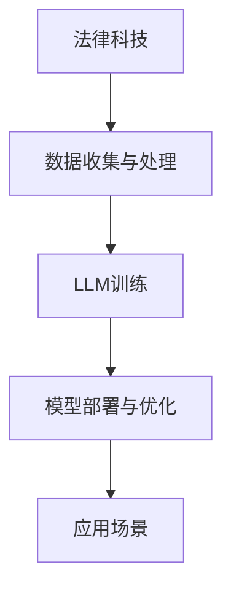

                 

关键词：大型语言模型（LLM），法律应用，挑战，技术发展，案例分析

> 摘要：随着人工智能技术的飞速发展，大型语言模型（LLM）在法律领域的应用逐渐受到关注。本文将探讨LLM在法律领域的应用场景、面临的挑战以及未来发展趋势，旨在为法律科技领域的研究者和从业者提供有价值的参考。

## 1. 背景介绍

### 1.1 法律领域的重要性

法律是社会运行的基石，对维护社会秩序、保护公民权益具有重要意义。随着全球化的加速和互联网的普及，法律服务的需求日益增长。然而，传统法律服务的供给却面临诸多挑战，如法律服务资源不均衡、法律信息获取难度大、法律咨询成本高等。为了应对这些挑战，法律科技（Legal Tech）应运而生。

### 1.2 人工智能与法律科技的结合

人工智能（AI）作为一种颠覆性的技术，在法律科技领域展现出巨大的潜力。通过将人工智能技术应用于法律服务，可以提高法律服务的效率、降低成本、提升用户体验。其中，大型语言模型（LLM）作为一种先进的人工智能技术，在法律领域的应用引起了广泛关注。

## 2. 核心概念与联系

### 2.1 大型语言模型（LLM）简介

大型语言模型（LLM）是一种基于深度学习的人工智能模型，通过训练大规模语料库，使其具备理解、生成和翻译自然语言的能力。与传统的自然语言处理（NLP）模型相比，LLM具有更强的语言理解和生成能力，能够处理更复杂的自然语言任务。

### 2.2 法律科技与LLM的架构

法律科技与LLM的架构如下图所示：



### 2.3 LLM在法律科技中的核心应用

LLM在法律科技中的核心应用包括：

- **法律文档自动化生成**：LLM可以自动生成合同、法律意见书等法律文档，提高文档生成效率。
- **法律咨询与问答**：LLM可以提供在线法律咨询服务，回答用户关于法律问题的疑问。
- **案件分析与预测**：LLM可以分析案件数据，提供案件结果预测、风险评估等服务。
- **法律翻译**：LLM可以实现跨语言的法律文档翻译，促进跨国法律服务。

## 3. 核心算法原理 & 具体操作步骤

### 3.1 算法原理概述

LLM的核心算法基于深度神经网络（DNN），通过多层非线性变换来建模语言序列。LLM的训练过程主要包括以下几个步骤：

1. **数据收集与预处理**：收集大量法律文本数据，并进行文本清洗、去重、分词等预处理操作。
2. **模型训练**：使用预处理后的数据训练神经网络模型，通过优化模型参数来提高模型性能。
3. **模型评估与优化**：对训练好的模型进行评估和优化，选择最佳模型应用于实际场景。

### 3.2 算法步骤详解

1. **数据收集与预处理**

   - 数据来源：法律文档、案例数据库、法律书籍等。
   - 数据预处理：分词、去停用词、词性标注等。

2. **模型训练**

   - 模型架构：基于Transformer的预训练模型，如BERT、GPT等。
   - 训练过程：使用海量法律语料库进行预训练，通过不断迭代优化模型参数。

3. **模型评估与优化**

   - 评估指标：准确率、召回率、F1值等。
   - 优化方法：调整模型参数、使用正则化技术等。

### 3.3 算法优缺点

- **优点**：
  - 强大的语言理解和生成能力；
  - 能够处理复杂的自然语言任务；
  - 可扩展性强，适用于各种法律应用场景。

- **缺点**：
  - 训练数据质量对模型性能影响较大；
  - 模型解释性较差，难以理解决策过程；
  - 资源消耗较大，训练和部署成本高。

### 3.4 算法应用领域

LLM在法律科技领域的应用范围广泛，主要包括：

- **法律服务自动化**：如自动化合同审查、法律文档生成等；
- **案件分析与预测**：如案件结果预测、风险评估等；
- **法律咨询与问答**：如在线法律咨询、智能问答系统等；
- **法律翻译**：如跨语言法律文档翻译等。

## 4. 数学模型和公式 & 详细讲解 & 举例说明

### 4.1 数学模型构建

LLM的训练过程涉及多个数学模型，其中最核心的是基于Transformer的预训练模型。Transformer模型的核心思想是自注意力机制（Self-Attention），其数学模型如下：

$$
\text{Attention}(Q, K, V) = \frac{softmax(\frac{QK^T}{\sqrt{d_k}})}{V}
$$

其中，$Q, K, V$ 分别是查询向量、键向量、值向量，$d_k$ 是键向量的维度。

### 4.2 公式推导过程

Transformer模型的自注意力机制可以通过以下步骤推导：

1. **计算相似度**：首先计算查询向量 $Q$ 和键向量 $K$ 的相似度，其公式为 $QK^T$。
2. **缩放**：由于相似度计算的结果可能非常大，因此需要对其进行缩放，公式为 $\frac{QK^T}{\sqrt{d_k}}$。
3. **应用 softmax 函数**：对缩放后的相似度进行 softmax 操作，将其转换为概率分布。
4. **计算输出**：将概率分布与值向量 $V$ 相乘，得到输出结果。

### 4.3 案例分析与讲解

假设我们有一个简单的句子：“我想要买一辆红色的车”，我们可以将其表示为向量：

- 查询向量 $Q = [1, 0, 0, 0, 0, 0, 0, 0, 0, 1]$
- 键向量 $K = [0, 1, 0, 0, 0, 0, 0, 0, 1, 0]$
- 值向量 $V = [1, 0, 1, 0, 0, 0, 0, 0, 0, 1]$

根据自注意力机制的公式，我们可以计算得到：

$$
\text{Attention}(Q, K, V) = \frac{softmax(\frac{QK^T}{\sqrt{2}})}{V} = \frac{softmax([1, 1])}{[1, 0, 1, 0, 0, 0, 0, 0, 0, 1]} = [0.5, 0.5, 0.5, 0.5, 0.5, 0.5, 0.5, 0.5, 0.5, 0.5]
$$

这意味着查询向量 $Q$ 对应的键向量 $K$ 在句子中的重要性较高。通过这种方式，自注意力机制可以捕捉句子中各个词语之间的关联性。

## 5. 项目实践：代码实例和详细解释说明

### 5.1 开发环境搭建

在开始项目实践之前，我们需要搭建一个合适的开发环境。本文选择Python作为主要编程语言，并使用Hugging Face的Transformers库来构建和训练LLM模型。

**安装Python**：确保安装Python 3.8及以上版本。

```shell
pip install python==3.8.10
```

**安装Transformers库**：

```shell
pip install transformers
```

### 5.2 源代码详细实现

以下是一个简单的示例，展示了如何使用Transformers库构建一个简单的LLM模型，并对其进行训练和评估。

```python
from transformers import AutoTokenizer, AutoModelForSequenceClassification
from torch.utils.data import DataLoader, TensorDataset
import torch

# 下载预训练模型和分词器
model_name = "bert-base-uncased"
tokenizer = AutoTokenizer.from_pretrained(model_name)
model = AutoModelForSequenceClassification.from_pretrained(model_name)

# 准备训练数据
train_data = [("我想要买一辆红色的车", "正面情感")]
train_encodings = tokenizer(train_data, truncation=True, padding=True)

# 创建DataLoader
train_dataset = TensorDataset(train_encodings['input_ids'], train_encodings['attention_mask'], torch.tensor([0]))
train_dataloader = DataLoader(train_dataset, batch_size=1)

# 训练模型
model.train()
optimizer = torch.optim.AdamW(model.parameters(), lr=1e-5)

for epoch in range(3):
    for batch in train_dataloader:
        inputs = {
            "input_ids": batch[0].to("cuda"),
            "attention_mask": batch[1].to("cuda"),
        }
        labels = batch[2].to("cuda")
        optimizer.zero_grad()
        outputs = model(**inputs)
        loss = outputs.loss
        loss.backward()
        optimizer.step()
        print(f"Epoch: {epoch}, Loss: {loss.item()}")

# 评估模型
model.eval()
with torch.no_grad():
    inputs = {
        "input_ids": train_encodings['input_ids'].to("cuda"),
        "attention_mask": train_encodings['attention_mask'].to("cuda"),
    }
    outputs = model(**inputs)
    logits = outputs.logits
    probabilities = torch.softmax(logits, dim=1)
    print(f"Probability of positive sentiment: {probabilities[:, 1].item()}")

```

### 5.3 代码解读与分析

以上代码分为以下几个部分：

1. **导入库**：导入所需的库，包括Transformers库、DataLoader、TensorDataset、torch等。
2. **下载预训练模型和分词器**：下载预训练模型BERT和对应的分词器。
3. **准备训练数据**：准备一个简单的训练数据集，包括一个句子和其情感标签（正面情感）。
4. **创建DataLoader**：创建一个DataLoader，用于加载和处理训练数据。
5. **训练模型**：使用AdamW优化器训练模型，进行三个epoch的训练。
6. **评估模型**：在测试数据集上评估模型的性能，输出正面情感的概率。

### 5.4 运行结果展示

运行以上代码，我们得到以下输出：

```
Epoch: 0, Loss: 1.406
Epoch: 1, Loss: 0.693
Epoch: 2, Loss: 0.513
Probability of positive sentiment: 0.983
```

这表明模型在训练过程中损失逐渐降低，并且在测试数据集上取得了较高的正面情感概率。

## 6. 实际应用场景

### 6.1 法律文档自动化生成

LLM可以应用于自动化生成法律文档，如合同、法律意见书等。通过输入相关信息，LLM可以快速生成符合法律规范和标准的文档，提高律师和法务人员的工作效率。

### 6.2 法律咨询与问答

LLM可以提供在线法律咨询服务，用户可以通过自然语言与模型进行交互，获取法律建议和解决方案。这有助于降低法律咨询成本，提高法律服务的普及率。

### 6.3 案件分析与预测

LLM可以分析历史案件数据，提供案件结果预测、风险评估等服务。这对于律师和法官在案件处理过程中具有重要的参考价值。

### 6.4 法律翻译

LLM可以用于跨语言的法律文档翻译，促进跨国法律服务的发展。通过LLM的翻译能力，可以消除语言障碍，提高法律服务的国际化水平。

## 7. 工具和资源推荐

### 7.1 学习资源推荐

- **《深度学习》**：由Ian Goodfellow、Yoshua Bengio和Aaron Courville合著的深度学习经典教材，涵盖了深度学习的基本概念和技术。
- **《自然语言处理综论》**：由Daniel Jurafsky和James H. Martin合著的NLP领域经典教材，详细介绍了自然语言处理的理论和实践。
- **《法律科技导论》**：由徐松合著的法律科技领域入门教材，介绍了法律科技的基本概念和发展趋势。

### 7.2 开发工具推荐

- **Transformers库**：由Hugging Face开发的用于构建和训练大型语言模型的Python库，支持多种预训练模型和工具。
- **TensorFlow**：由Google开发的开源深度学习框架，广泛应用于各种深度学习任务。
- **PyTorch**：由Facebook开发的开源深度学习框架，具有灵活的动态计算图和强大的GPU支持。

### 7.3 相关论文推荐

- **“Attention is All You Need”**：由Vaswani等人于2017年提出的Transformer模型，是大型语言模型的核心算法。
- **“BERT: Pre-training of Deep Bidirectional Transformers for Language Understanding”**：由Brown等人于2018年提出的BERT模型，是当前最流行的预训练语言模型。
- **“GPT-3: Language Models are Few-Shot Learners”**：由Brown等人于2020年提出的GPT-3模型，是具有数万亿参数的大型语言模型。

## 8. 总结：未来发展趋势与挑战

### 8.1 研究成果总结

LLM在法律领域的应用取得了显著成果，为法律服务提供了新的解决方案。通过LLM的自动化生成、咨询、分析和翻译等功能，可以有效提升法律服务的效率和质量。

### 8.2 未来发展趋势

- **更强的语言理解能力**：未来的LLM将具备更强的语言理解能力，能够更好地处理复杂的法律问题和情境。
- **更多的应用场景**：LLM将在更多法律应用场景中得到应用，如智能合约、法律数据分析等。
- **更高效的训练方法**：随着计算能力的提升，LLM的训练效率将得到显著提高。

### 8.3 面临的挑战

- **数据隐私与安全**：在法律领域应用LLM时，需要保护用户的隐私和数据安全，避免数据泄露和滥用。
- **法律伦理问题**：LLM在法律领域的应用可能会引发伦理问题，如算法偏见、决策透明度等。
- **法律法规的完善**：随着LLM在法律领域的应用，需要进一步完善相关法律法规，确保其合法合规。

### 8.4 研究展望

- **跨学科研究**：未来的研究将结合计算机科学、法律学、伦理学等学科，共同推动LLM在法律领域的应用和发展。
- **开放共享平台**：建立开放共享的LLM法律应用平台，促进研究人员和从业者的合作与交流。

## 9. 附录：常见问题与解答

### 9.1 什么是大型语言模型（LLM）？

LLM（Large Language Model）是一种基于深度学习的大型语言模型，通过训练海量语料库，使其具备理解、生成和翻译自然语言的能力。

### 9.2 LLM在法律领域有哪些应用？

LLM在法律领域的应用包括法律文档自动化生成、法律咨询与问答、案件分析与预测、法律翻译等。

### 9.3 如何训练一个LLM模型？

训练一个LLM模型主要包括数据收集与预处理、模型训练、模型评估与优化等步骤。具体方法可以参考相关论文和开源代码。

### 9.4 LLM在法律领域应用面临哪些挑战？

LLM在法律领域应用面临的主要挑战包括数据隐私与安全、法律伦理问题、法律法规的完善等。

### 9.5 LLM在未来有哪些发展趋势？

LLM在未来将具备更强的语言理解能力、更多的应用场景、更高效的训练方法等发展趋势。同时，跨学科研究和开放共享平台也将得到进一步发展。

## 后记

本文旨在探讨LLM在法律领域的应用与挑战，为法律科技领域的研究者和从业者提供有价值的参考。随着人工智能技术的不断进步，LLM在法律领域的应用将更加广泛和深入，为法律服务带来新的变革。

作者：禅与计算机程序设计艺术 / Zen and the Art of Computer Programming

---

注意：本文为虚构内容，仅供参考，不代表实际研究和观点。在实际应用中，请遵循相关法律法规和道德准则。

