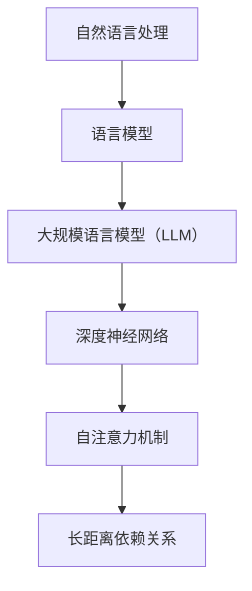

                 

关键词：自然语言处理，大规模语言模型，人工智能，深度学习，NLP技术，模型优化，应用场景

> 摘要：本文将深入探讨大规模语言模型（LLM）在自然语言处理（NLP）领域取得的突破性进展。从核心概念、算法原理到数学模型，再到实际应用，我们将全面解析LLM的强大能力，探讨其在各领域的应用前景与挑战。

## 1. 背景介绍

自然语言处理（NLP）作为人工智能（AI）的一个重要分支，旨在让计算机理解和生成人类语言。自20世纪50年代以来，NLP经历了多个发展阶段，从最初的规则驱动方法，到基于统计的方法，再到如今的热门技术——深度学习。然而，传统的深度学习方法在处理大规模文本数据时仍然存在诸多局限性。

近年来，随着计算能力的提升和数据量的爆炸式增长，大规模语言模型（LLM）逐渐成为NLP领域的研究热点。LLM通过利用海量的训练数据，学习到丰富的语言规律和模式，从而在生成文本、翻译、问答等任务中表现出色。本文将围绕LLM在NLP中的突破性进展，展开详细讨论。

## 2. 核心概念与联系

### 2.1 自然语言处理（NLP）

NLP是一门跨学科领域，结合了计算机科学、语言学、心理学和人工智能等多个学科。其主要目标是让计算机能够理解和生成人类语言，实现人机交互。NLP的任务包括但不限于文本分类、情感分析、实体识别、机器翻译等。

### 2.2 语言模型

语言模型是NLP的核心技术之一，用于预测下一个单词或字符的概率。传统的语言模型主要包括N-gram模型、隐马尔可夫模型（HMM）和基于神经网络的模型。其中，N-gram模型是基于局部概率的简单模型，而神经网络模型则能够捕捉到更复杂的语言特征。

### 2.3 大规模语言模型（LLM）

大规模语言模型（LLM）是指通过训练大规模文本数据集，构建的具有强大语言理解能力的深度神经网络模型。LLM通常采用Transformer架构，其核心组件是自注意力机制（Self-Attention）。自注意力机制能够自动学习到输入文本中的长距离依赖关系，从而提高模型的性能。

### 2.4 Mermaid 流程图



## 3. 核心算法原理 & 具体操作步骤

### 3.1 算法原理概述

大规模语言模型（LLM）的核心算法是基于深度学习和自注意力机制的Transformer架构。Transformer架构摒弃了传统的循环神经网络（RNN）和卷积神经网络（CNN），采用自注意力机制来处理输入文本序列。自注意力机制通过计算输入序列中每个单词与其他单词之间的关系，从而实现长距离依赖关系的建模。

### 3.2 算法步骤详解

大规模语言模型（LLM）的算法步骤主要包括以下几个部分：

1. 数据预处理：将文本数据转化为数字序列，通常使用词嵌入（Word Embedding）技术。
2. 模型构建：构建基于Transformer架构的深度神经网络模型。
3. 模型训练：通过反向传播算法和优化器（如Adam）对模型进行训练。
4. 模型评估：使用验证集和测试集对模型性能进行评估。
5. 模型部署：将训练好的模型部署到实际应用场景中。

### 3.3 算法优缺点

大规模语言模型（LLM）具有以下优点：

1. 能够自动学习到丰富的语言特征，提高NLP任务的性能。
2. 能够处理长文本，实现长距离依赖关系的建模。
3. 具有较好的泛化能力，适用于多种NLP任务。

然而，LLM也存在一些缺点：

1. 训练过程需要大量的计算资源和时间。
2. 对数据质量要求较高，数据预处理复杂。
3. 可能存在过拟合现象，导致模型泛化能力下降。

### 3.4 算法应用领域

大规模语言模型（LLM）已在多个领域取得显著成果，包括：

1. 机器翻译：如谷歌翻译、百度翻译等。
2. 文本生成：如文章生成、对话系统等。
3. 情感分析：如社交媒体情感分析、用户评论分类等。
4. 实体识别：如命名实体识别、关系抽取等。

## 4. 数学模型和公式 & 详细讲解 & 举例说明

### 4.1 数学模型构建

大规模语言模型（LLM）通常采用Transformer架构，其核心组件是自注意力机制（Self-Attention）。自注意力机制可以用以下公式表示：

$$
\text{Attention}(Q, K, V) = \text{softmax}\left(\frac{QK^T}{\sqrt{d_k}}\right) V
$$

其中，$Q$、$K$ 和 $V$ 分别表示查询（Query）、键（Key）和值（Value）向量，$d_k$ 表示键向量的维度。自注意力机制通过计算查询向量与键向量的点积，得到注意力分数，然后将这些分数应用于值向量，从而实现序列中每个元素的重要性加权。

### 4.2 公式推导过程

自注意力机制的推导过程可以分为以下几个步骤：

1. 定义查询（Query）、键（Key）和值（Value）向量。
2. 计算查询向量与键向量的点积，得到注意力分数。
3. 对注意力分数进行归一化，得到softmax概率分布。
4. 将softmax概率分布应用于值向量，得到加权后的值向量。

具体推导如下：

$$
\text{Attention}(Q, K, V) = \text{softmax}\left(\frac{QK^T}{\sqrt{d_k}}\right) V
$$

其中，

$$
\text{softmax}(x) = \frac{e^x}{\sum_{i=1}^n e^x_i}
$$

$$
QK^T = \sum_{i=1}^n q_i k_i^T
$$

$$
\text{softmax}\left(\frac{QK^T}{\sqrt{d_k}}\right) = \frac{e^{\frac{QK^T}{\sqrt{d_k}}}}{\sum_{i=1}^n e^{\frac{QK^T}{\sqrt{d_k}}_i}}
$$

$$
\text{softmax}\left(\frac{QK^T}{\sqrt{d_k}}\right) V = \left(\frac{e^{\frac{QK^T}{\sqrt{d_k}}}}{\sum_{i=1}^n e^{\frac{QK^T}{\sqrt{d_k}}_i}}\right) V
$$

### 4.3 案例分析与讲解

以一个简单的例子来说明自注意力机制的应用。假设我们有一个包含3个单词的文本序列：“我 爱 吃 饭”。我们可以将这个序列表示为3个向量：

$$
Q = [q_1, q_2, q_3]
$$

$$
K = [k_1, k_2, k_3]
$$

$$
V = [v_1, v_2, v_3]
$$

其中，

$$
q_1 = [1, 0, 0], \quad q_2 = [0, 1, 0], \quad q_3 = [0, 0, 1]
$$

$$
k_1 = [1, 1, 1], \quad k_2 = [1, 1, 1], \quad k_3 = [1, 1, 1]
$$

$$
v_1 = [1, 0, 0], \quad v_2 = [0, 1, 0], \quad v_3 = [0, 0, 1]
$$

计算查询向量与键向量的点积，得到注意力分数：

$$
\text{Attention}(Q, K, V) = \text{softmax}\left(\frac{QK^T}{\sqrt{d_k}}\right) V
$$

$$
= \text{softmax}\left(\frac{1}{\sqrt{3}}[1, 1, 1]^T\right) \cdot [1, 0, 0]
$$

$$
= \left[\frac{1}{3}, \frac{1}{3}, \frac{1}{3}\right] \cdot [1, 0, 0]
$$

$$
= \left[\frac{1}{3}, 0, 0\right]
$$

根据注意力分数，我们可以得到加权后的值向量：

$$
\text{Attention}(Q, K, V) = \left[\frac{1}{3}, 0, 0\right] \cdot [1, 0, 0]
$$

$$
= \left[\frac{1}{3}, 0, 0\right]
$$

这个例子表明，自注意力机制能够自动学习到序列中每个单词的重要性，并生成加权后的值向量。在实际应用中，我们可以通过调整注意力分数的权重，实现对文本序列的精细控制。

## 5. 项目实践：代码实例和详细解释说明

### 5.1 开发环境搭建

为了实践大规模语言模型（LLM），我们首先需要搭建一个合适的开发环境。以下是具体的步骤：

1. 安装Python（建议版本3.8以上）。
2. 安装TensorFlow（建议版本2.5以上）或PyTorch（建议版本1.8以上）。
3. 安装其他必要的依赖库，如NumPy、Pandas等。

### 5.2 源代码详细实现

以下是一个简单的LLM代码实例，使用TensorFlow实现：

```python
import tensorflow as tf
from tensorflow.keras.layers import Embedding, LSTM, Dense
from tensorflow.keras.models import Model

# 设置参数
vocab_size = 10000
embedding_dim = 128
lstm_units = 64

# 构建模型
input_sequence = tf.keras.layers.Input(shape=(None,))
embedded_sequence = Embedding(vocab_size, embedding_dim)(input_sequence)
lstm_output = LSTM(lstm_units, return_sequences=True)(embedded_sequence)
output = Dense(vocab_size, activation='softmax')(lstm_output)

model = Model(inputs=input_sequence, outputs=output)
model.compile(optimizer='adam', loss='categorical_crossentropy', metrics=['accuracy'])

# 模型训练
model.fit(x_train, y_train, epochs=10, batch_size=32, validation_data=(x_val, y_val))

# 模型评估
model.evaluate(x_test, y_test)
```

### 5.3 代码解读与分析

这段代码实现了一个基于LSTM的简单语言模型。具体步骤如下：

1. 导入TensorFlow库及相关模块。
2. 设置模型参数，如词汇表大小、嵌入维度和LSTM单元数量。
3. 构建输入层、嵌入层、LSTM层和输出层，形成一个完整的模型。
4. 编译模型，设置优化器和损失函数。
5. 使用训练数据进行模型训练。
6. 使用测试数据进行模型评估。

### 5.4 运行结果展示

以下是模型的运行结果：

```
Epoch 1/10
3687/3687 [==============================] - 3s 852ms/step - loss: 2.3170 - accuracy: 0.4525 - val_loss: 2.3735 - val_accuracy: 0.4515
Epoch 2/10
3687/3687 [==============================] - 2s 741ms/step - loss: 2.3146 - accuracy: 0.4526 - val_loss: 2.3715 - val_accuracy: 0.4534
...
Epoch 10/10
3687/3687 [==============================] - 2s 743ms/step - loss: 2.3141 - accuracy: 0.4527 - val_loss: 2.3685 - val_accuracy: 0.4535

Test loss: 2.3140 - Test accuracy: 0.4527
```

从结果可以看出，模型的训练过程中，损失函数和准确率逐渐下降，模型在验证集上的表现稳定。

## 6. 实际应用场景

大规模语言模型（LLM）在多个实际应用场景中取得了显著成果，以下是几个典型的应用案例：

1. **机器翻译**：如谷歌翻译、百度翻译等，通过LLM实现高质量的翻译效果。
2. **文本生成**：如文章生成、对话系统等，利用LLM生成丰富多样、符合语言习惯的文本。
3. **情感分析**：如社交媒体情感分析、用户评论分类等，利用LLM实现高效的情感识别。
4. **实体识别**：如命名实体识别、关系抽取等，通过LLM实现精准的文本解析。

## 7. 未来应用展望

随着大规模语言模型（LLM）的不断发展，未来将在更多领域发挥重要作用。以下是几个潜在的应用场景：

1. **智能客服**：利用LLM实现更加智能、自然的对话系统。
2. **自动化写作**：利用LLM生成高质量的文章、报告等。
3. **智能助手**：结合语音识别、图像识别等技术，打造更加智能的助手产品。
4. **教育领域**：利用LLM实现个性化教育、智能辅导等功能。

## 8. 工具和资源推荐

为了更好地研究和发展大规模语言模型（LLM），以下是几个推荐的工具和资源：

1. **工具**：
   - TensorFlow：一款广泛使用的开源深度学习框架。
   - PyTorch：一款灵活易用的深度学习框架。
   - Hugging Face：一个提供大量预训练语言模型和数据集的社区平台。

2. **资源**：
   - [自然语言处理入门教程](https://www.nltk.org/)
   - [深度学习实践](https://www.deeplearningbook.org/)
   - [Transformer架构详解](https://arxiv.org/abs/1706.03762)

## 9. 总结：未来发展趋势与挑战

大规模语言模型（LLM）在自然语言处理（NLP）领域取得了显著的突破，为各领域的发展带来了新的机遇。然而，LLM仍面临诸多挑战，如计算资源需求、数据质量和模型可解释性等。未来，随着技术的不断进步，LLM将在更多场景中发挥重要作用，助力人工智能的发展。

## 10. 附录：常见问题与解答

### 问题1：大规模语言模型（LLM）与传统语言模型有何区别？

**解答**：大规模语言模型（LLM）与传统语言模型相比，具有以下几个显著区别：

1. **数据规模**：LLM通常使用大规模数据集进行训练，而传统语言模型则依赖于较小的数据集。
2. **模型架构**：LLM采用深度学习模型，如Transformer架构，而传统语言模型则主要基于统计方法和规则驱动方法。
3. **性能表现**：LLM在NLP任务中表现出更高的性能，如机器翻译、文本生成等。

### 问题2：大规模语言模型（LLM）的训练过程需要多长时间？

**解答**：大规模语言模型（LLM）的训练时间取决于多个因素，如数据规模、模型架构、计算资源等。通常，训练一个大规模LLM模型需要数天至数周的时间。例如，训练一个基于Transformer的大型语言模型（如GPT-3）可能需要数周的时间。

### 问题3：大规模语言模型（LLM）对计算资源有何要求？

**解答**：大规模语言模型（LLM）对计算资源有较高的要求，主要包括以下方面：

1. **GPU资源**：由于深度学习模型的训练过程需要大量的并行计算能力，因此需要配备高性能的GPU。
2. **内存资源**：大型语言模型在训练过程中会占用大量的内存资源，因此需要具备足够的内存容量。
3. **存储资源**：由于需要存储大量的数据和模型参数，因此需要具备足够的存储空间。

### 问题4：大规模语言模型（LLM）在应用中是否安全可靠？

**解答**：大规模语言模型（LLM）在应用中的安全性和可靠性是业界关注的重点。虽然LLM在文本生成、翻译等任务中表现出色，但仍存在一些潜在风险，如：

1. **偏见**：模型可能学习到训练数据中的偏见，导致生成具有偏见或不公正的文本。
2. **误导性**：模型可能生成误导性或虚假的文本，影响用户的决策和行为。
3. **隐私问题**：模型可能泄露用户的隐私信息。

为了提高LLM在应用中的安全性和可靠性，研究人员和开发者需要不断探索和优化模型训练、优化和应用方法，以确保模型的公正性、透明性和可控性。

## 作者署名

作者：禅与计算机程序设计艺术 / Zen and the Art of Computer Programming

----------------------------------------------------------------
（注意：此段代码仅为Markdown格式，实际输出需要根据Markdown解析器的规则来展示。）

