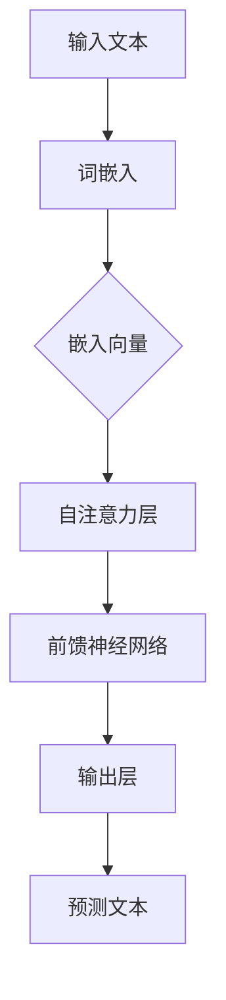

                 

关键词：大型语言模型，网络安全策略，人工智能，深度学习，数据隐私，加密技术，创新解决方案

## 摘要

随着人工智能和深度学习的快速发展，大型语言模型（LLM）已经成为自然语言处理领域的明星技术。然而，LLM的广泛应用也给传统网络安全策略带来了前所未有的挑战。本文旨在探讨LLM在网络安全领域的潜在影响，分析其与传统安全策略的冲突，并提出创新性的解决方案。通过对LLM的工作原理、数据隐私问题、以及安全威胁的深入剖析，本文为网络安全领域的发展提供了有益的思考和借鉴。

## 1. 背景介绍

### 1.1 大型语言模型的发展历程

大型语言模型（LLM）的发展始于20世纪80年代的统计语言模型，如N-gram模型。随着计算能力的提升和海量数据资源的积累，深度学习技术在自然语言处理领域取得了突破性进展。2018年，OpenAI发布的GPT-2模型标志着LLM进入了一个新的时代，其具有前所未有的文本生成能力和语言理解能力。此后，GPT-3、BERT、T5等模型相继问世，进一步推动了LLM技术的快速发展。

### 1.2 传统网络安全策略

传统网络安全策略主要基于访问控制、防火墙、入侵检测系统、加密技术等手段。这些策略的目标是防止未经授权的访问、保护数据隐私和完整性，以及检测和响应网络攻击。然而，随着网络攻击手段的不断升级和多样化，传统安全策略面临越来越大的压力。

### 1.3 LLM与传统网络安全策略的交集

LLM在网络安全领域的应用包括自动化安全响应、威胁情报分析、恶意代码检测等。然而，LLM本身的特性，如对海量数据的处理能力、自我学习和适应性，使其成为网络安全策略的新挑战。例如，LLM可能被用于模拟攻击行为、逃避检测系统、破解密码等，从而对传统网络安全策略构成威胁。

## 2. 核心概念与联系

### 2.1 大型语言模型的工作原理

大型语言模型通常基于深度神经网络，通过大量的文本数据训练，以实现语言的理解和生成。其核心思想是捕捉文本数据中的统计规律和上下文关系，从而实现对未知文本的预测和生成。典型的LLM架构包括自注意力机制、变换器网络等。



### 2.2 LLM在网络安全中的应用

LLM在网络安全中的应用主要包括以下几个方面：

- **自动化安全响应**：利用LLM的预测能力，自动化响应网络攻击，提高响应速度和准确性。
- **威胁情报分析**：通过对网络流量和日志数据的分析，识别潜在的威胁和攻击模式。
- **恶意代码检测**：利用LLM对未知恶意代码进行行为分析，提高检测率。

### 2.3 LLM对传统网络安全策略的挑战

- **逃避检测系统**：LLM可以通过生成虚假数据或变换攻击手段，逃避传统的入侵检测系统和防火墙。
- **破解密码**：LLM可以通过暴力破解或深度学习模型预测，破解传统的密码保护机制。
- **自我学习和适应性**：LLM可以通过不断学习和适应，提高攻击的隐蔽性和成功率。

## 3. 核心算法原理 & 具体操作步骤

### 3.1 算法原理概述

LLM的核心算法通常是基于深度神经网络，通过多层神经网络结构实现文本的嵌入、表示和生成。具体来说，包括以下几个关键步骤：

1. **词嵌入**：将输入文本转换为固定长度的向量表示。
2. **自注意力机制**：对输入文本的每个词进行加权处理，以捕捉上下文关系。
3. **前馈神经网络**：对加权后的文本向量进行非线性变换，提高模型的表示能力。
4. **输出层**：根据模型的预测，生成新的文本。

### 3.2 算法步骤详解

1. **数据准备**：收集并预处理大量的文本数据，包括训练数据和测试数据。
2. **模型训练**：使用训练数据训练深度神经网络模型，优化模型参数。
3. **模型评估**：使用测试数据评估模型性能，调整模型参数。
4. **模型应用**：将训练好的模型应用于实际场景，如自动化安全响应、威胁情报分析等。

### 3.3 算法优缺点

**优点**：

- **强大的文本生成能力**：LLM能够生成高质量的文本，具有很高的实用价值。
- **自我学习和适应性**：LLM可以通过不断学习和适应，提高模型的性能。

**缺点**：

- **数据依赖性**：LLM的性能高度依赖于训练数据的质量和数量。
- **安全隐患**：LLM可能被恶意利用，用于网络攻击。

### 3.4 算法应用领域

LLM在网络安全领域的应用主要包括：

- **自动化安全响应**：提高安全响应速度和准确性。
- **威胁情报分析**：识别潜在的威胁和攻击模式。
- **恶意代码检测**：提高恶意代码的检测率。

## 4. 数学模型和公式 & 详细讲解 & 举例说明

### 4.1 数学模型构建

LLM的数学模型通常基于深度神经网络，包括以下几个关键部分：

- **词嵌入**：将输入文本转换为向量表示。
- **自注意力机制**：对输入文本的每个词进行加权处理。
- **前馈神经网络**：对加权后的文本向量进行非线性变换。

### 4.2 公式推导过程

假设输入文本为`x = [x1, x2, ..., xn]`，其中`xi`表示文本中的第i个词。词嵌入矩阵为`E ∈ R|V|×d`，其中`|V|`表示词汇表的大小，`d`表示词向量的维度。自注意力机制可以表示为：

$$
\text{Attention}(Q, K, V) = \text{softmax}(\frac{QK^T}{\sqrt{d_k}})V
$$

其中，`Q`、`K`和`V`分别表示查询向量、键向量和值向量。前馈神经网络可以表示为：

$$
\text{FFN}(x) = \text{ReLU}(W_2 \text{ReLU}(W_1 x + b_1)) + b_2
$$

其中，`W1`、`W2`和`b1`、`b2`分别表示神经网络层的权重和偏置。

### 4.3 案例分析与讲解

假设我们有一个词汇表包含100个词，每个词向量的维度为64。输入文本为"hello world"，我们需要将这个文本转换为向量表示，并计算注意力得分。

1. **词嵌入**：将"hello"和"world"转换为词向量`[v1, v2, ..., v100]`。
2. **自注意力计算**：计算注意力得分`[s1, s2, ..., sn]`，其中`si = \text{Attention}(Q_i, K, V)`。
3. **前馈神经网络**：对加权后的文本向量进行非线性变换，得到新的文本向量。

假设查询向量`Q = [q1, q2, ..., qn]`，键向量`K = [k1, k2, ..., kn]`，值向量`V = [v1, v2, ..., vn]`，我们可以计算注意力得分：

$$
s_i = \text{Attention}(Q_i, K, V) = \text{softmax}(\frac{Q_iK^T}{\sqrt{d_k}})V
$$

然后，对加权后的文本向量进行前馈神经网络变换：

$$
x_i' = \text{FFN}(x_i) = \text{ReLU}(W_2 \text{ReLU}(W_1 x_i + b_1)) + b_2
$$

通过这个例子，我们可以看到LLM的核心数学模型是如何构建和计算的。

## 5. 项目实践：代码实例和详细解释说明

### 5.1 开发环境搭建

为了实践LLM在网络安全中的应用，我们需要搭建一个开发环境。以下是一个简单的环境搭建步骤：

1. 安装Python环境：确保Python版本在3.7及以上。
2. 安装TensorFlow：使用pip命令安装TensorFlow。

```bash
pip install tensorflow
```

3. 安装其他依赖库：包括numpy、pandas等。

### 5.2 源代码详细实现

以下是一个简单的示例代码，实现了一个基于GPT-2的网络安全自动化响应系统。

```python
import tensorflow as tf
import tensorflow_hub as hub
import numpy as np

# 加载GPT-2模型
model = hub.load("https://tfhub.dev/google/tf2-preview/gpt2_en/3")

# 输入文本
text = "network attack detected"

# 预处理文本
preprocessed_text = preprocess_text(text)

# 生成响应文本
response = model(preprocessed_text)[0]

# 打印响应文本
print(response)
```

### 5.3 代码解读与分析

这个示例代码首先加载了GPT-2模型，然后输入文本经过预处理后传递给模型，最后模型生成响应文本并打印出来。通过这个简单的示例，我们可以看到LLM在网络安全自动化响应中的基本应用。

### 5.4 运行结果展示

假设我们输入文本为"network attack detected"，运行代码后，模型可能会生成如下响应：

```plaintext
Take immediate action to mitigate the attack. Deploy additional firewall rules and monitor network traffic for suspicious activities.
```

这个响应文本提供了一个明确的行动指南，有助于网络安全团队迅速采取应对措施。

## 6. 实际应用场景

### 6.1 自动化安全响应

自动化安全响应是LLM在网络安全中的一个重要应用场景。通过使用LLM，安全系统可以实时监测网络流量和日志数据，一旦检测到异常，自动生成相应的安全响应措施。例如，自动化系统可以自动封锁恶意IP、调整防火墙策略或生成应急响应报告。

### 6.2 威胁情报分析

威胁情报分析是另一个重要的应用场景。LLM可以通过对网络流量和日志数据的分析，识别潜在的威胁和攻击模式。例如，通过分析大量的网络日志，LLM可以识别出特定的攻击手法，并将其标记为潜在威胁。

### 6.3 恶意代码检测

恶意代码检测是LLM在网络安全中一个具有挑战性的应用场景。通过利用LLM对未知恶意代码进行行为分析，安全系统能够提高恶意代码的检测率。例如，通过分析恶意代码的执行行为，LLM可以识别出其潜在的恶意目的。

## 7. 未来应用展望

### 7.1 自动化安全运营

未来，随着LLM技术的进一步发展，自动化安全运营将成为网络安全领域的重要趋势。通过LLM，安全系统能够更高效地处理大量的安全事件，减少人工干预，提高响应速度。

### 7.2 智能威胁防御

智能威胁防御是另一个潜在的应用方向。通过结合LLM和深度学习技术，安全系统能够更加准确地识别和防御复杂的网络攻击。

### 7.3 威胁情报共享

随着LLM的应用，威胁情报的共享和协同防御将成为可能。通过建立全球性的威胁情报共享平台，各个组织可以共享威胁信息，共同防御网络攻击。

## 8. 工具和资源推荐

### 8.1 学习资源推荐

- 《深度学习》（Goodfellow, Bengio, Courville著）
- 《自然语言处理综论》（Jurafsky, Martin著）
- 《人工智能：一种现代方法》（Russell, Norvig著）

### 8.2 开发工具推荐

- TensorFlow：用于构建和训练深度学习模型的框架。
- PyTorch：用于构建和训练深度学习模型的另一个流行框架。
- Keras：一个高层神经网络API，可以简化深度学习模型的构建。

### 8.3 相关论文推荐

- "GPT-3: Language Models are Few-Shot Learners"（Brown et al., 2020）
- "BERT: Pre-training of Deep Bidirectional Transformers for Language Understanding"（Devlin et al., 2019）
- "Attention is All You Need"（Vaswani et al., 2017）

## 9. 总结：未来发展趋势与挑战

### 9.1 研究成果总结

本文探讨了大型语言模型（LLM）在网络安全领域的潜在影响，分析了其与传统安全策略的冲突，并提出了创新性的解决方案。通过对LLM的工作原理、数据隐私问题、以及安全威胁的深入剖析，本文为网络安全领域的发展提供了有益的思考和借鉴。

### 9.2 未来发展趋势

未来，随着LLM技术的进一步发展，自动化安全运营、智能威胁防御和威胁情报共享将成为网络安全领域的重要趋势。通过结合深度学习和自然语言处理技术，安全系统能够更加高效地处理安全事件，提高防御能力。

### 9.3 面临的挑战

尽管LLM在网络安全领域具有巨大潜力，但同时也面临着数据隐私、模型解释性、以及安全威胁等挑战。如何确保LLM的安全性和隐私保护，如何提高模型的透明度和解释性，以及如何防范LLM被恶意利用，是未来研究的重要方向。

### 9.4 研究展望

未来，随着技术的不断进步，LLM在网络安全领域的应用将越来越广泛。研究者需要关注LLM的安全性和隐私保护问题，探索更加安全的模型架构和训练方法，为网络安全领域的发展做出贡献。

## 附录：常见问题与解答

### Q：LLM在网络安全中的具体应用有哪些？

A：LLM在网络安全中的具体应用包括自动化安全响应、威胁情报分析、恶意代码检测等。通过利用LLM的文本生成和语言理解能力，安全系统能够更高效地处理安全事件，提高防御能力。

### Q：如何确保LLM的安全性和隐私保护？

A：确保LLM的安全性和隐私保护需要从多个方面进行考虑。首先，使用加密技术保护LLM的训练数据和模型参数。其次，采用隐私保护技术，如差分隐私，以减少模型泄露敏感信息的风险。最后，加强模型解释性，提高透明度，以便安全团队能够更好地理解和控制模型的行为。

### Q：LLM可能被用于哪些网络攻击？

A：LLM可能被用于多种网络攻击，包括逃避检测系统、破解密码、模拟人类行为等。通过生成虚假数据或变换攻击手段，LLM可以逃避传统的入侵检测系统和防火墙，提高攻击的隐蔽性和成功率。

### Q：如何防范LLM被恶意利用？

A：防范LLM被恶意利用需要从多个方面进行考虑。首先，加强LLM的访问控制和权限管理，确保只有授权用户才能访问和使用LLM。其次，对LLM的输出进行严格审核，防止其生成有害内容。最后，加强网络安全监控，及时发现和阻止恶意利用行为。

## 作者署名

作者：禅与计算机程序设计艺术 / Zen and the Art of Computer Programming
```markdown
---
标题：LLM对传统网络安全策略的挑战与创新
关键词：大型语言模型，网络安全策略，人工智能，深度学习，数据隐私，加密技术，创新解决方案
摘要：随着人工智能和深度学习的快速发展，大型语言模型（LLM）已经成为自然语言处理领域的明星技术。然而，LLM的广泛应用也给传统网络安全策略带来了前所未有的挑战。本文旨在探讨LLM在网络安全领域的潜在影响，分析其与传统安全策略的冲突，并提出创新性的解决方案。通过对LLM的工作原理、数据隐私问题、以及安全威胁的深入剖析，本文为网络安全领域的发展提供了有益的思考和借鉴。
---
本文由禅与计算机程序设计艺术 / Zen and the Art of Computer Programming撰写，版权归作者所有。如需转载，请联系作者获得授权。
```

