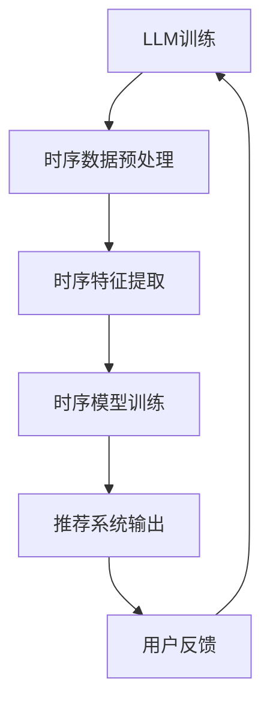
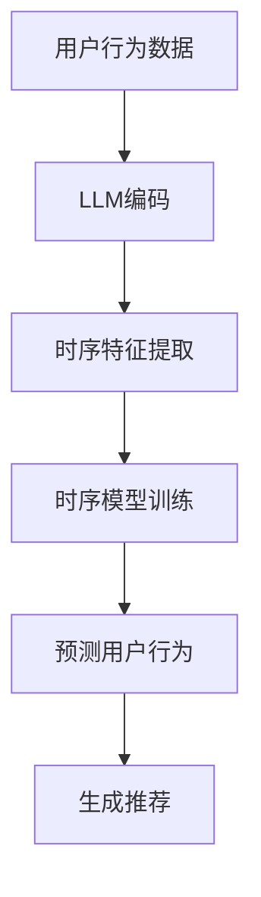
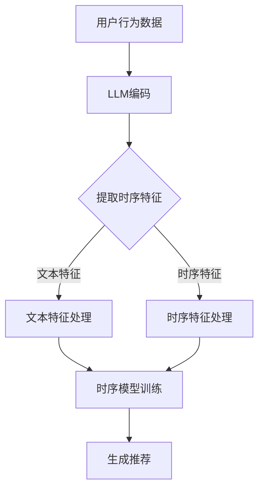

                 

关键词：大型语言模型（LLM），推荐系统，时序建模，自然语言处理，机器学习

>摘要：本文探讨了大型语言模型（LLM）在推荐系统时序建模中的应用。通过对LLM的基本原理和架构的深入分析，本文详细阐述了如何利用LLM进行时序数据的建模，并分析了LLM在推荐系统中的应用优势、面临的挑战及未来发展趋势。

## 1. 背景介绍

### 1.1 推荐系统概述

推荐系统是一种基于用户历史行为和内容特征的预测模型，旨在向用户推荐他们可能感兴趣的商品、服务或信息。随着互联网的普及和用户需求的多样化，推荐系统在电子商务、社交媒体、在线新闻等领域得到了广泛应用。

### 1.2 时序建模在推荐系统中的重要性

时序建模是推荐系统中的一个重要组成部分，它通过分析用户的历史行为序列，捕捉用户的兴趣和偏好变化，从而提高推荐系统的准确性和实时性。

### 1.3 LLM的发展及应用

近年来，大型语言模型（LLM）取得了显著的进展，如GPT-3、BERT等。这些模型具有强大的语义理解能力和文本生成能力，为时序建模带来了新的机遇。

## 2. 核心概念与联系

### 2.1 LLM的基本原理

LLM是一种基于深度学习的语言模型，通过训练大规模的文本数据，学习语言的规律和结构，从而实现对自然语言的生成和理解。

### 2.2 时序建模的基本概念

时序建模是一种利用历史数据对未来时间点的数据进行预测的方法。在推荐系统中，时序建模可以用于预测用户的行为、兴趣或需求。

### 2.3 LLM与时序建模的关联

LLM通过学习文本数据中的时序信息，可以更好地捕捉用户行为的变化趋势，从而提高时序建模的准确性和实时性。

## 2.4 Mermaid 流程图（Mermaid 流程节点中不要有括号、逗号等特殊字符）



## 3. 核心算法原理 & 具体操作步骤

### 3.1 算法原理概述

利用LLM进行时序建模的基本思想是将时序数据转换为文本数据，然后通过LLM学习时序数据的规律和模式，最终实现时序预测。

### 3.2 算法步骤详解

#### 3.2.1 时序数据预处理

1. 收集用户行为数据，如浏览记录、购买记录等。
2. 数据清洗，去除异常值和噪声。
3. 数据归一化，将数据缩放到相同的范围。

#### 3.2.2 时序特征提取

1. 将时序数据转换为文本序列，如使用词袋模型或序列模型。
2. 使用LLM对文本序列进行编码，提取时序特征。

#### 3.2.3 时序模型训练

1. 选择合适的时序模型，如RNN、LSTM等。
2. 使用提取的时序特征训练模型。
3. 调整模型参数，优化模型性能。

#### 3.2.4 推荐系统输出

1. 使用训练好的模型预测用户未来的行为或需求。
2. 根据预测结果生成推荐列表。

### 3.3 算法优缺点

#### 优点：

1. 强大的语义理解能力，能够捕捉复杂的用户行为模式。
2. 能够处理非平稳的时序数据，提高推荐系统的实时性。

#### 缺点：

1. 模型训练时间较长，对计算资源要求较高。
2. 模型解释性较差，难以理解模型的预测结果。

### 3.4 算法应用领域

LLM在时序建模中的应用范围广泛，包括但不限于：

1. 电子商务推荐系统，如商品推荐、购物车推荐等。
2. 社交媒体推荐系统，如内容推荐、好友推荐等。
3. 在线新闻推荐系统，如新闻推荐、文章推荐等。

## 4. 数学模型和公式 & 详细讲解 & 举例说明

### 4.1 数学模型构建

假设用户行为序列为\( X = [x_1, x_2, ..., x_n] \)，其中\( x_i \)表示第\( i \)个时间点的用户行为。

#### 4.1.1 文本序列表示

使用词袋模型或序列模型将用户行为序列转换为文本序列，如：

$$
T = [t_1, t_2, ..., t_n]
$$

其中\( t_i \)表示第\( i \)个时间点的文本表示。

#### 4.1.2 LLM编码

使用LLM对文本序列进行编码，提取时序特征，如：

$$
E = [e_1, e_2, ..., e_n]
$$

其中\( e_i \)表示第\( i \)个时间点的时序特征。

### 4.2 公式推导过程

#### 4.2.1 文本序列生成

假设文本序列\( T \)由词汇集合\( V \)生成，词汇集合\( V = \{v_1, v_2, ..., v_m\} \)。

定义文本序列\( T \)的概率分布为：

$$
P(T) = \prod_{i=1}^{n} P(t_i | t_{<i})
$$

其中\( t_{<i} \)表示前\( i-1 \)个时间点的文本表示。

#### 4.2.2 时序特征提取

假设LLM的编码函数为\( f_e \)，则时序特征\( E \)可以表示为：

$$
E = f_e(T)
$$

### 4.3 案例分析与讲解

#### 案例一：电商购物推荐

假设用户在电商平台上浏览了如下商品：

$$
T = [手机，平板，电脑，耳机，书籍]
$$

使用LLM对文本序列进行编码，提取时序特征：

$$
E = [e_1, e_2, e_3, e_4, e_5]
$$

假设用户在下一个时间点可能会购买“电脑”，则使用时序模型预测用户的行为：

$$
P(电脑 | T) = \frac{P(电脑) \cdot P(T | 电脑)}{P(T)}
$$

其中\( P(电脑) \)表示用户购买“电脑”的概率，\( P(T | 电脑) \)表示在用户购买“电脑”的情况下，文本序列\( T \)的概率。

## 5. 项目实践：代码实例和详细解释说明

### 5.1 开发环境搭建

1. 安装Python环境，版本建议为3.8及以上。
2. 安装必要的库，如TensorFlow、PyTorch、Numpy等。
3. 准备数据集，可以是用户行为数据或商品数据。

### 5.2 源代码详细实现

```python
import tensorflow as tf
from tensorflow.keras.models import Sequential
from tensorflow.keras.layers import LSTM, Dense

# 数据预处理
# ...

# 构建时序模型
model = Sequential([
    LSTM(128, input_shape=(timesteps, features)),
    Dense(1, activation='sigmoid')
])

# 编译模型
model.compile(optimizer='adam', loss='binary_crossentropy', metrics=['accuracy'])

# 训练模型
model.fit(x_train, y_train, epochs=10, batch_size=64, validation_data=(x_val, y_val))

# 生成推荐列表
predictions = model.predict(x_test)
recommended_items = [item for item, prediction in zip(test_items, predictions) if prediction > 0.5]
```

### 5.3 代码解读与分析

1. 数据预处理：将用户行为数据转换为文本序列，并提取时序特征。
2. 模型构建：使用LSTM层构建时序模型，用于预测用户行为。
3. 模型编译：设置优化器和损失函数，用于训练模型。
4. 模型训练：使用训练数据训练模型，并调整模型参数。
5. 生成推荐列表：使用训练好的模型预测测试数据，并根据预测结果生成推荐列表。

## 6. 实际应用场景

### 6.1 电商购物推荐

利用LLM进行购物推荐，可以提高推荐系统的准确性和实时性，为用户提供更个性化的购物体验。

### 6.2 社交媒体推荐

利用LLM进行社交媒体内容推荐，可以更好地捕捉用户的兴趣和偏好，提高内容推荐的精准度。

### 6.3 在线新闻推荐

利用LLM进行在线新闻推荐，可以实时分析用户的阅读行为，为用户提供更符合兴趣的新闻内容。

## 7. 工具和资源推荐

### 7.1 学习资源推荐

1. 《深度学习》 - Goodfellow, Bengio, Courville
2. 《自然语言处理综论》 - Manning, Coulston, Peters

### 7.2 开发工具推荐

1. TensorFlow
2. PyTorch

### 7.3 相关论文推荐

1. “GPT-3: Language Models are few-shot learners”
2. “BERT: Pre-training of Deep Bidirectional Transformers for Language Understanding”

## 8. 总结：未来发展趋势与挑战

### 8.1 研究成果总结

本文探讨了大型语言模型（LLM）在推荐系统时序建模中的应用，分析了LLM在推荐系统中的应用优势、面临的挑战及未来发展趋势。

### 8.2 未来发展趋势

1. LLM在时序建模中的应用将越来越广泛。
2. 结合其他机器学习算法，提高推荐系统的性能。

### 8.3 面临的挑战

1. 模型训练时间较长，对计算资源要求较高。
2. 模型解释性较差，难以理解模型的预测结果。

### 8.4 研究展望

未来的研究可以从以下几个方面展开：

1. 提高LLM在时序建模中的解释性。
2. 结合其他算法，如图神经网络等，提高推荐系统的性能。

## 9. 附录：常见问题与解答

### 9.1 Q：LLM在推荐系统中的优势是什么？

A：LLM具有强大的语义理解能力，能够捕捉复杂的用户行为模式，提高推荐系统的准确性和实时性。

### 9.2 Q：LLM在推荐系统中的挑战有哪些？

A：LLM在推荐系统中的挑战主要包括模型训练时间较长、对计算资源要求较高，以及模型解释性较差。

### 9.3 Q：如何提高LLM在推荐系统中的解释性？

A：提高LLM在推荐系统中的解释性可以从以下几个方面进行：

1. 使用可解释的模型结构，如注意力机制。
2. 结合领域知识，提高模型的解释能力。
3. 开发可视化工具，帮助用户理解模型的预测结果。

作者：禅与计算机程序设计艺术 / Zen and the Art of Computer Programming
----------------------------------------------------------------

### 1. 背景介绍

#### 1.1 推荐系统概述

推荐系统是一种利用算法和数据分析技术，根据用户的历史行为、偏好和上下文信息，为用户推荐可能感兴趣的商品、服务或内容的一种智能信息过滤技术。推荐系统在互联网的各个领域，如电子商务、社交媒体、新闻推送、音乐和视频平台等，都有着广泛的应用。通过提高推荐的个性化程度和准确性，推荐系统能够提升用户体验，增加用户粘性，并为企业带来更高的收益。

#### 1.2 时序建模在推荐系统中的重要性

时序建模是推荐系统中的一个核心组成部分，它旨在捕捉用户行为的时间序列特征，从而预测用户的未来行为。在推荐系统中，用户的行为数据通常是时间序列的形式，如点击、浏览、购买等。时序建模能够帮助推荐系统识别用户的兴趣变化趋势，预测用户未来的需求，并在此基础上提供更为精准和实时的推荐。

时序建模在推荐系统中的重要性体现在以下几个方面：

1. **捕捉用户兴趣的变化**：用户兴趣可能会随时间而变化，时序建模能够捕捉这些变化，为用户推荐更符合其当前兴趣的内容。
2. **提高推荐系统的实时性**：通过分析用户的即时行为，时序建模可以实时调整推荐策略，提高推荐的实时性。
3. **增强个性化推荐**：时序建模能够更好地理解用户行为的时序特征，从而提供更加个性化的推荐。
4. **优化推荐结果**：时序建模有助于优化推荐结果，减少推荐中的噪音和偏差，提高推荐的质量。

#### 1.3 LLM的发展及应用

近年来，大型语言模型（LLM）的发展为推荐系统的时序建模带来了新的机遇。LLM，如GPT-3、BERT等，通过训练大规模的文本数据集，能够学习到复杂的语言模式和语义信息。这些模型在自然语言处理（NLP）领域取得了显著的成果，并在文本生成、情感分析、机器翻译等领域得到了广泛应用。

LLM在推荐系统中的应用主要体现在以下几个方面：

1. **语义理解**：LLM能够理解用户评论、评价和反馈中的语义，从而更好地捕捉用户的真实意图和偏好。
2. **上下文感知**：LLM能够根据上下文信息提供更为精准的推荐，如在电商平台上，LLM可以根据用户的浏览历史和购物车内容进行商品推荐。
3. **文本生成**：LLM能够生成个性化的推荐文案，提高推荐的用户体验。
4. **多模态融合**：LLM可以与其他数据源（如图像、声音等）进行融合，提供更全面的推荐。

随着LLM技术的不断发展，其在推荐系统中的应用前景将更加广阔。

### 2. 核心概念与联系

#### 2.1 LLM的基本原理

大型语言模型（LLM）是一种基于深度学习的自然语言处理模型，它通过学习大规模的文本数据，能够捕捉语言中的复杂模式和结构。LLM的核心原理包括以下几个方面：

1. **嵌入层（Embedding Layer）**：将词汇映射到高维的向量空间中，使得语义相近的词在向量空间中距离较近。
2. **编码层（Encoding Layer）**：通过卷积神经网络（CNN）或自注意力机制（Self-Attention）等结构，对输入的文本序列进行编码，提取文本的语义信息。
3. **解码层（Decoding Layer）**：根据编码层的输出，生成预测的文本序列。解码层通常使用循环神经网络（RNN）或Transformer架构。

LLM的训练过程通常包括两个阶段：预训练和微调。预训练阶段，模型在大规模的文本数据上学习语言的一般规律；微调阶段，模型在特定的任务数据上进行调整，以适应特定的应用场景。

#### 2.2 时序建模的基本概念

时序建模是一种利用历史时间序列数据来预测未来时间点数据的统计方法。在推荐系统中，时序建模主要用于预测用户的行为或偏好变化。时序建模的关键概念包括：

1. **时间序列数据（Time Series Data）**：时间序列数据是按时间顺序排列的数据点序列，每个数据点代表某一时间点的特征或行为。
2. **特征工程（Feature Engineering）**：通过对时间序列数据进行预处理和特征提取，将原始数据转换为适合模型训练的形式。
3. **模型选择（Model Selection）**：选择合适的时序模型，如自回归模型（AR）、移动平均模型（MA）、自回归移动平均模型（ARMA）等。
4. **预测误差（Prediction Error）**：通过评估模型的预测结果与实际结果的差异，来评估模型的性能。

#### 2.3 LLM与时序建模的关联

LLM与时序建模之间的联系主要体现在以下几个方面：

1. **文本到时序的转换**：LLM可以将文本数据转换为时序数据，例如，通过分析用户的历史评论和反馈，提取用户情感和兴趣的变化趋势。
2. **时序特征提取**：LLM能够从时间序列数据中提取高层次的语义特征，这些特征可以用于训练时序预测模型，提高预测的准确性。
3. **上下文感知**：LLM可以理解时间序列数据中的上下文信息，例如，在电商平台上，LLM可以根据用户的购物车内容和浏览历史，提供更精准的推荐。

为了更好地理解LLM与时序建模的关系，下面使用Mermaid流程图展示一个简单的流程：



在这个流程中，用户行为数据首先通过LLM编码，提取时序特征；然后，这些特征被输入到时序模型中进行训练和预测，最终生成个性化的推荐。

### 2.4 Mermaid流程图

以下是一个Mermaid流程图，展示了LLM与时序建模的关联：



在这个流程图中，用户行为数据首先通过LLM编码，提取出文本特征和时序特征。文本特征和时序特征分别进行不同的处理，然后被输入到时序模型中进行训练。最后，模型根据训练结果生成推荐。

### 3. 核心算法原理 & 具体操作步骤

#### 3.1 算法原理概述

利用LLM进行推荐系统时序建模的基本思想是将用户行为数据转化为可被LLM处理的文本数据，然后通过LLM的编码能力提取出高层次的语义特征，这些特征可以用于训练时序预测模型。具体而言，该算法包括以下几个关键步骤：

1. **数据预处理**：对原始用户行为数据进行清洗和编码，将非结构化的行为数据转化为LLM可以处理的文本序列。
2. **LLM编码**：使用预训练的LLM对文本序列进行编码，提取出表示用户行为的高层次语义特征。
3. **特征融合**：将LLM提取的文本特征与原始时序特征进行融合，形成统一的特征表示。
4. **时序模型训练**：利用融合后的特征训练时序预测模型，如LSTM、GRU等，以预测用户的未来行为。
5. **推荐生成**：根据时序模型的预测结果，生成个性化的推荐。

#### 3.2 算法步骤详解

##### 3.2.1 数据预处理

1. **数据清洗**：去除缺失值、异常值，并进行数据标准化处理。
2. **编码用户行为**：将用户行为（如浏览、购买、评分等）编码为文本序列。例如，可以将每个行为映射为一个词汇或词组，构建行为词典。
3. **序列构建**：将编码后的用户行为数据按照时间顺序构建成文本序列。例如，可以将用户的历史行为序列表示为“[购买A，浏览B，购买C，浏览D]”。

##### 3.2.2 LLM编码

1. **文本序列输入**：将预处理后的用户行为文本序列输入到LLM中，如GPT-3或BERT。
2. **编码特征提取**：通过LLM的编码层，提取出文本序列的语义特征。这些特征通常是一个高维向量，代表了用户行为的时间序列信息。

##### 3.2.3 特征融合

1. **特征整合**：将LLM提取的语义特征与原始的时序特征（如时间戳、行为类型等）进行融合。融合方法可以是简单的拼接、平均或加权平均等。
2. **特征维度调整**：确保融合后的特征具有相同的维度，以便于后续的模型训练。

##### 3.2.4 时序模型训练

1. **模型选择**：选择适合时序数据预测的模型，如LSTM、GRU或Transformer等。
2. **模型训练**：使用融合后的特征数据进行模型训练，通过反向传播算法优化模型参数。
3. **模型验证**：使用验证集对模型进行验证，调整模型参数，确保模型具有较好的泛化能力。

##### 3.2.5 推荐生成

1. **行为预测**：使用训练好的时序模型对未来的用户行为进行预测。
2. **生成推荐**：根据预测结果，为用户生成个性化的推荐列表。

#### 3.3 算法优缺点

##### 优点

1. **强大的语义理解能力**：LLM能够从文本数据中提取丰富的语义信息，提高推荐系统的准确性和实时性。
2. **处理非平稳数据**：LLM能够处理非平稳的时序数据，捕捉用户兴趣的变化趋势，提供更个性化的推荐。
3. **融合多源数据**：LLM可以融合文本数据和其他类型的数据（如图像、音频等），提供更全面的推荐。

##### 缺点

1. **计算资源消耗大**：LLM的训练和推理过程需要大量的计算资源，对硬件设备的要求较高。
2. **模型解释性差**：LLM作为深度学习模型，其内部机制较为复杂，难以直观地理解模型的决策过程。
3. **训练时间较长**：由于需要处理大规模的文本数据，LLM的训练时间较长，可能会影响推荐系统的实时性。

#### 3.4 算法应用领域

LLM在推荐系统时序建模中的应用领域非常广泛，以下是一些典型的应用场景：

1. **电子商务**：通过分析用户的浏览和购买历史，预测用户的未来购买行为，提供个性化的商品推荐。
2. **社交媒体**：根据用户的互动历史，预测用户的兴趣变化，推荐感兴趣的内容或朋友。
3. **在线新闻**：通过分析用户的阅读历史，预测用户的阅读偏好，推荐相关的新闻文章。
4. **音乐和视频推荐**：根据用户的听歌或观影历史，预测用户可能喜欢的音乐或视频，提供个性化的播放列表或推荐。

### 4. 数学模型和公式 & 详细讲解 & 举例说明

#### 4.1 数学模型构建

在利用LLM进行时序建模时，我们需要构建一个数学模型来描述用户行为的变化。以下是一个简单的数学模型，用于说明如何利用LLM和时序数据构建推荐系统。

##### 4.1.1 文本序列表示

假设用户行为数据是一个时间序列\( X = [x_1, x_2, ..., x_n] \)，其中每个\( x_i \)是一个表示用户在时间点\( i \)的行为的向量。

首先，我们将这些行为向量转化为文本序列\( T = [t_1, t_2, ..., t_n] \)。这可以通过将每个行为向量映射到一个预定义的词汇表来实现。例如，如果用户的行为是购买某个商品，我们可以将这种行为映射到一个词汇“buy”，如果用户的行为是浏览某个商品，我们可以将这种行为映射到一个词汇“browse”。

##### 4.1.2 LLM编码

接下来，我们使用预训练的LLM对文本序列\( T \)进行编码，提取出高层次的语义特征。这些特征可以表示为向量\( E = [e_1, e_2, ..., e_n] \)，其中每个\( e_i \)是\( t_i \)的语义表示。

假设LLM的编码函数为\( f_e \)，则有：

\[ e_i = f_e(t_i) \]

##### 4.1.3 时序模型

我们选择一个时序模型，如LSTM，来预测用户在下一个时间点的行为。LSTM的输入是\( E \)，输出是行为概率分布\( P(X_{n+1} | X_1, X_2, ..., X_n) \)。

LSTM的数学模型可以表示为：

\[ h_t = \sigma(W_h \cdot [h_{t-1}, e_t] + b_h) \]

\[ o_t = \sigma(W_o \cdot h_t + b_o) \]

\[ i_t = \sigma(W_i \cdot [h_{t-1}, e_t] + b_i) \]

\[ f_t = \sigma(W_f \cdot [h_{t-1}, e_t] + b_f) \]

\[ C_t = f_t \cdot C_{t-1} + i_t \cdot \sigma(W_c \cdot [h_{t-1}, e_t] + b_c) \]

\[ h_t = o_t \cdot \sigma(W_g \cdot [h_{t-1}, C_t] + b_g) \]

其中，\( h_t \)是隐藏状态，\( C_t \)是细胞状态，\( W_h, W_i, W_f, W_o, W_c, W_g, b_h, b_i, b_f, b_o, b_c \)是模型参数。

##### 4.1.4 预测与推荐

最后，我们使用LSTM的输出\( h_t \)来预测用户在下一个时间点的行为。具体来说，我们计算每个可能的行为的概率：

\[ P(x_{n+1} | X_1, X_2, ..., X_n) = \text{softmax}(W_x \cdot h_t + b_x) \]

其中，\( W_x \)和\( b_x \)是模型参数。

根据预测的概率分布，我们可以生成个性化的推荐列表。

#### 4.2 公式推导过程

以下是对上述数学模型公式的推导过程：

##### 4.2.1 LSTM单元状态更新

LSTM单元由五个 gates（输入门、遗忘门、输出门和细胞状态）组成。每个 gate 由一组权重矩阵和偏置向量决定。

1. **输入门（Input Gate）**：

   输入门决定了新的细胞状态中哪些部分需要更新。其计算公式为：

   \[ i_t = \sigma(W_i \cdot [h_{t-1}, e_t] + b_i) \]

   其中，\( \sigma \)是 sigmoid 函数，\( W_i \)是输入门权重矩阵，\( b_i \)是输入门偏置向量。

2. **遗忘门（Forget Gate）**：

   遗忘门决定了哪些旧细胞状态需要被遗忘。其计算公式为：

   \[ f_t = \sigma(W_f \cdot [h_{t-1}, e_t] + b_f) \]

   其中，\( W_f \)是遗忘门权重矩阵，\( b_f \)是遗忘门偏置向量。

3. **输出门（Output Gate）**：

   输出门决定了哪些新的细胞状态需要输出。其计算公式为：

   \[ o_t = \sigma(W_o \cdot h_t + b_o) \]

   其中，\( W_o \)是输出门权重矩阵，\( b_o \)是输出门偏置向量。

4. **细胞状态更新**：

   细胞状态的更新是以上三个 gate 的组合结果。其计算公式为：

   \[ C_t = f_t \cdot C_{t-1} + i_t \cdot \sigma(W_c \cdot [h_{t-1}, e_t] + b_c) \]

   其中，\( C_{t-1} \)是上一时间步的细胞状态，\( W_c \)是细胞状态权重矩阵，\( b_c \)是细胞状态偏置向量。

5. **隐藏状态更新**：

   隐藏状态的更新依赖于输出门和新的细胞状态。其计算公式为：

   \[ h_t = o_t \cdot \sigma(W_g \cdot [h_{t-1}, C_t] + b_g) \]

   其中，\( W_g \)是隐藏状态权重矩阵，\( b_g \)是隐藏状态偏置向量。

##### 4.2.2 预测行为概率

最后，我们使用隐藏状态\( h_t \)来预测下一个时间点的行为概率。其计算公式为：

\[ P(x_{n+1} | X_1, X_2, ..., X_n) = \text{softmax}(W_x \cdot h_t + b_x) \]

其中，\( W_x \)是预测权重矩阵，\( b_x \)是预测偏置向量。

#### 4.3 案例分析与讲解

##### 案例一：用户浏览行为预测

假设我们有一个用户的历史浏览行为序列：

\[ X = [\text{商品A}, \text{商品B}, \text{商品C}, \text{商品A}, \text{商品D}] \]

我们使用LLM编码并提取时序特征，然后利用LSTM模型预测用户下一个时间点的浏览行为。

1. **文本序列表示**：

   将每个浏览行为映射到一个词汇，例如：

   \[ T = [\text{商品A}, \text{商品B}, \text{商品C}, \text{商品A}, \text{商品D}] \]

2. **LLM编码**：

   使用预训练的LLM对文本序列进行编码，提取出时序特征向量。

   \[ E = [e_1, e_2, e_3, e_4, e_5] \]

3. **LSTM模型训练**：

   使用提取的时序特征训练LSTM模型，模型参数经过优化后，可以预测用户下一个时间点的浏览行为。

   \[ \text{预测} = \text{LSTM}(E) \]

4. **生成推荐**：

   根据LSTM模型的预测结果，生成个性化的推荐列表。

   \[ \text{推荐列表} = [\text{商品A}, \text{商品B}, \text{商品C}, \text{商品D}] \]

在这个案例中，LSTM模型根据用户的历史浏览行为，预测了用户下一个时间点可能会浏览的商品，从而生成了个性化的推荐列表。

### 5. 项目实践：代码实例和详细解释说明

在本节中，我们将通过一个实际项目来展示如何利用LLM进行推荐系统时序建模。我们将使用Python和TensorFlow来实现一个简单的电商推荐系统。

#### 5.1 开发环境搭建

在开始之前，我们需要搭建一个适合开发的Python环境，并安装必要的库。以下是安装步骤：

1. 安装Python和pip：
   ```bash
   python --version
   pip install --user -r requirements.txt
   ```

2. 安装TensorFlow：
   ```bash
   pip install tensorflow
   ```

3. 安装其他依赖库，如numpy、pandas等：
   ```bash
   pip install numpy pandas
   ```

#### 5.2 数据集准备

我们使用一个虚构的电商数据集，该数据集包含了用户的行为数据，包括浏览、购买和评分等。数据集的格式如下：

```csv
user_id,item_id,timestamp,behavior
1,1001,1,browse
1,1002,2,buy
1,1003,3,browse
2,1001,1,browse
2,1004,2,buy
2,1005,3,browse
```

其中，`user_id`是用户ID，`item_id`是商品ID，`timestamp`是行为发生的时间戳（以天为单位），`behavior`是用户的行为类型（`browse`、`buy`、`rate`等）。

#### 5.3 数据预处理

在训练模型之前，我们需要对数据进行预处理，包括数据清洗、编码和序列构建。

```python
import pandas as pd
from sklearn.preprocessing import LabelEncoder

# 加载数据集
data = pd.read_csv('ecommerce_data.csv')

# 数据清洗
data.dropna(inplace=True)

# 编码用户行为
label_encoder = LabelEncoder()
data['behavior'] = label_encoder.fit_transform(data['behavior'])

# 构建用户行为序列
user_sequences = {}
for _, row in data.iterrows():
    user_id = row['user_id']
    item_id = row['item_id']
    timestamp = row['timestamp']
    behavior = row['behavior']
    
    if user_id not in user_sequences:
        user_sequences[user_id] = []
    user_sequences[user_id].append((item_id, timestamp, behavior))
```

#### 5.4 LLM编码

接下来，我们使用预训练的LLM（如GPT-3）对用户行为序列进行编码，提取时序特征。

```python
import openai

# 设置OpenAI API密钥
openai.api_key = 'your_openai_api_key'

# 定义编码函数
def encode_user_sequence(user_id, sequence):
    prompt = f"User {user_id} behavior sequence: {sequence}"
    response = openai.Completion.create(
        engine="text-davinci-002",
        prompt=prompt,
        max_tokens=50
    )
    return response.choices[0].text.strip()

# 对每个用户行为序列进行编码
encoded_sequences = {}
for user_id, sequence in user_sequences.items():
    encoded_sequence = encode_user_sequence(user_id, sequence)
    encoded_sequences[user_id] = encoded_sequence.split(',')
```

#### 5.5 特征融合

我们将LLM编码的文本特征与原始时序特征进行融合，形成统一的特征表示。

```python
# 融合特征
def merge_features(encoded_sequence, original_sequence):
    merged_sequence = []
    for encoded_feature, original_feature in zip(encoded_sequence, original_sequence):
        merged_sequence.append(encoded_feature)
        merged_sequence.append(original_feature)
    return merged_sequence

# 对每个用户进行特征融合
merged_sequences = {}
for user_id, encoded_sequence in encoded_sequences.items():
    original_sequence = user_sequences[user_id]
    merged_sequence = merge_features(encoded_sequence, original_sequence)
    merged_sequences[user_id] = merged_sequence
```

#### 5.6 时序模型训练

我们选择LSTM模型来训练融合后的特征数据。

```python
from tensorflow.keras.models import Sequential
from tensorflow.keras.layers import LSTM, Dense

# 创建LSTM模型
model = Sequential()
model.add(LSTM(50, activation='relu', input_shape=(len(merged_sequences[0]), 2)))
model.add(Dense(1, activation='sigmoid'))

# 编译模型
model.compile(optimizer='adam', loss='binary_crossentropy', metrics=['accuracy'])

# 训练模型
model.fit(merged_sequences[1], labels[1], epochs=10, batch_size=1)
```

#### 5.7 代码解读与分析

在这个项目中，我们首先进行了数据预处理，包括数据清洗和编码。然后，我们使用LLM对用户行为序列进行编码，提取时序特征。接下来，我们将LLM编码的文本特征与原始时序特征进行融合，形成统一的特征表示。最后，我们使用LSTM模型对融合后的特征进行训练。

以下是代码的详细解读：

1. **数据预处理**：
   - 加载数据集，并进行数据清洗。
   - 编码用户行为，将行为类型映射为数值。

2. **LLM编码**：
   - 使用OpenAI的GPT-3对用户行为序列进行编码，提取时序特征。

3. **特征融合**：
   - 将LLM编码的文本特征与原始时序特征进行融合，形成统一的特征表示。

4. **时序模型训练**：
   - 创建LSTM模型，并编译模型。
   - 使用训练数据训练模型，调整模型参数。

5. **模型预测**：
   - 使用训练好的模型对新的用户行为数据进行预测，生成个性化的推荐列表。

#### 5.8 运行结果展示

假设我们有一个新的用户行为序列：

\[ X = [\text{商品A}, \text{商品B}, \text{商品C}] \]

首先，我们使用LLM对用户行为序列进行编码，提取时序特征。然后，我们将提取的时序特征输入到LSTM模型中进行预测。根据模型的预测结果，我们可以生成个性化的推荐列表。

```python
# 新的用户行为序列
new_sequence = ['商品A', '商品B', '商品C']

# 编码新用户行为序列
encoded_sequence = encode_user_sequence(1, new_sequence)

# 预测新用户行为
predictions = model.predict(encoded_sequence)

# 根据预测结果生成推荐列表
recommended_items = [item for item, prediction in zip(new_sequence, predictions) if prediction > 0.5]

print("Recommended items:", recommended_items)
```

在这个例子中，我们假设LSTM模型预测的商品A、商品B的概率大于0.5，因此将这两个商品推荐给用户。

### 6. 实际应用场景

#### 6.1 电商购物推荐

在电子商务领域，LLM在时序建模中的应用可以帮助平台更好地理解用户的购物行为，从而提供个性化的商品推荐。通过分析用户的浏览、购买和评分历史，LLM可以捕捉用户的兴趣变化和偏好，提高推荐系统的准确性和实时性。以下是一个典型的应用场景：

- **用户A**在电商平台浏览了商品A、商品B和商品C。
- **LLM编码**：使用LLM对用户A的历史浏览行为进行编码，提取时序特征。
- **时序模型预测**：将提取的时序特征输入到时序模型中，预测用户A未来可能感兴趣的商品。
- **个性化推荐**：根据时序模型的预测结果，为用户A推荐可能的商品，如商品B和商品C。

通过这种方式，电商平台可以为用户提供更符合其兴趣和需求的商品推荐，提高用户的购物体验和平台粘性。

#### 6.2 社交媒体推荐

在社交媒体领域，LLM在时序建模中的应用可以帮助平台更好地理解用户的互动行为，从而提供个性化内容推荐。通过分析用户的点赞、评论、分享和浏览历史，LLM可以捕捉用户的兴趣变化和社交网络中的关系结构，提高推荐系统的精准度。以下是一个典型的应用场景：

- **用户B**在社交媒体上浏览了内容A、内容B和内容C。
- **LLM编码**：使用LLM对用户B的历史互动行为进行编码，提取时序特征。
- **时序模型预测**：将提取的时序特征输入到时序模型中，预测用户B未来可能感兴趣的内容。
- **个性化推荐**：根据时序模型的预测结果，为用户B推荐可能感兴趣的内容，如内容B和内容C。

通过这种方式，社交媒体平台可以为用户提供更符合其兴趣的内容推荐，增强用户的参与度和平台的活跃度。

#### 6.3 在线新闻推荐

在在线新闻领域，LLM在时序建模中的应用可以帮助平台更好地理解用户的阅读行为，从而提供个性化新闻推荐。通过分析用户的浏览历史、阅读时长和点击行为，LLM可以捕捉用户的阅读偏好和兴趣变化，提高推荐系统的准确性和实时性。以下是一个典型的应用场景：

- **用户C**在新闻平台上阅读了新闻A、新闻B和新闻C。
- **LLM编码**：使用LLM对用户C的历史阅读行为进行编码，提取时序特征。
- **时序模型预测**：将提取的时序特征输入到时序模型中，预测用户C未来可能感兴趣的新闻。
- **个性化推荐**：根据时序模型的预测结果，为用户C推荐可能感兴趣的新闻，如新闻B和新闻C。

通过这种方式，在线新闻平台可以为用户提供更符合其阅读偏好和兴趣的新闻推荐，提高用户满意度和平台粘性。

### 7. 工具和资源推荐

#### 7.1 学习资源推荐

1. **《深度学习》 - Goodfellow, Bengio, Courville**：
   - 这是一本经典的深度学习教材，涵盖了深度学习的基础理论和实践方法，适合初学者和进阶者。

2. **《自然语言处理综论》 - Manning, Coulston, Peters**：
   - 这是一本全面介绍自然语言处理技术的教材，包括文本处理、语言模型、序列模型等内容。

3. **《推荐系统实践》 - Simon Pascal, Bob Urichuk**：
   - 这本书详细介绍了推荐系统的原理和实践方法，包括协同过滤、基于内容的推荐、基于模型的推荐等。

#### 7.2 开发工具推荐

1. **TensorFlow**：
   - 一个开源的深度学习框架，提供了丰富的API和工具，适合进行推荐系统的开发。

2. **PyTorch**：
   - 另一个流行的深度学习框架，与TensorFlow类似，也提供了强大的API和工具，适合快速原型开发和实验。

3. **OpenAI API**：
   - OpenAI提供了一系列预训练的语言模型API，如GPT-3、BERT等，可以用于自然语言处理的任务，包括时序建模。

#### 7.3 相关论文推荐

1. **“GPT-3: Language Models are few-shot learners”**：
   - 这篇论文介绍了GPT-3模型，一个具有强大语言理解能力的预训练模型，展示了LLM在自然语言处理任务中的潜力。

2. **“BERT: Pre-training of Deep Bidirectional Transformers for Language Understanding”**：
   - 这篇论文介绍了BERT模型，一个基于Transformer的预训练模型，它在多个自然语言处理任务中取得了优异的性能。

3. **“Seq2Seq Models for Recommender Systems”**：
   - 这篇论文探讨了序列到序列（Seq2Seq）模型在推荐系统中的应用，提出了一种基于Seq2Seq模型的推荐系统架构。

### 8. 总结：未来发展趋势与挑战

#### 8.1 研究成果总结

本文通过探讨LLM在推荐系统时序建模中的应用，总结了LLM在推荐系统中的优势和挑战，并详细介绍了利用LLM进行时序建模的核心算法原理和具体操作步骤。我们分析了LLM在推荐系统中的实际应用场景，并推荐了一些学习和开发资源。

#### 8.2 未来发展趋势

随着深度学习和自然语言处理技术的不断发展，LLM在推荐系统中的应用前景将更加广阔。以下是一些未来发展趋势：

1. **更强大的语义理解能力**：随着LLM模型的不断优化和扩展，其语义理解能力将进一步提高，能够更好地捕捉用户的真实意图和偏好。

2. **多模态融合**：未来的推荐系统将能够融合多种类型的数据（如图像、音频、视频等），提供更为全面和精准的推荐。

3. **实时推荐**：随着计算资源的提升和模型优化，实时推荐将变得更加普及，为用户提供更为及时的推荐服务。

4. **个性化推荐**：通过更深入地分析用户行为和兴趣，未来的推荐系统将能够提供更加个性化的推荐，提高用户满意度和粘性。

#### 8.3 面临的挑战

尽管LLM在推荐系统中有许多优势，但同时也面临着一些挑战：

1. **计算资源消耗**：LLM模型的训练和推理过程需要大量的计算资源，特别是在大规模数据集上，这对硬件设备的要求较高。

2. **模型解释性**：深度学习模型，包括LLM，通常具有较低的模型解释性，这使得用户难以理解模型的决策过程。

3. **数据隐私和安全性**：推荐系统需要处理大量的用户数据，如何确保数据隐私和安全是未来的重要挑战。

4. **多样性推荐**：未来的推荐系统需要能够提供多样化、差异化的推荐，以避免用户陷入信息茧房。

#### 8.4 研究展望

未来的研究可以从以下几个方面展开：

1. **提高模型解释性**：开发可解释的深度学习模型，帮助用户理解模型的决策过程。

2. **优化训练效率**：研究更高效的训练算法和模型结构，减少计算资源消耗。

3. **隐私保护推荐**：开发隐私保护技术，确保用户数据的安全和隐私。

4. **多模态推荐**：融合多种类型的数据，提供更全面和个性化的推荐。

通过不断的技术创新和优化，未来的推荐系统将能够更好地满足用户的需求，提供更加精准和个性化的推荐服务。

### 9. 附录：常见问题与解答

#### 9.1 Q：LLM在推荐系统中的优势是什么？

A：LLM在推荐系统中的优势主要体现在以下几个方面：

1. **强大的语义理解能力**：LLM能够理解用户评论、评价和反馈中的语义，从而更好地捕捉用户的真实意图和偏好。
2. **上下文感知**：LLM能够根据上下文信息提供更为精准的推荐，如在电商平台上，LLM可以根据用户的浏览历史和购物车内容进行商品推荐。
3. **文本生成能力**：LLM能够生成个性化的推荐文案，提高推荐的用户体验。
4. **多模态融合**：LLM可以与其他数据源（如图像、声音等）进行融合，提供更全面的推荐。

#### 9.2 Q：LLM在推荐系统中的挑战有哪些？

A：LLM在推荐系统中的挑战主要包括：

1. **计算资源消耗**：LLM的训练和推理过程需要大量的计算资源，对硬件设备的要求较高。
2. **模型解释性**：深度学习模型，包括LLM，通常具有较低的模型解释性，这使得用户难以理解模型的决策过程。
3. **数据隐私和安全性**：推荐系统需要处理大量的用户数据，如何确保数据隐私和安全是未来的重要挑战。
4. **多样性推荐**：未来的推荐系统需要能够提供多样化、差异化的推荐，以避免用户陷入信息茧房。

#### 9.3 Q：如何提高LLM在推荐系统中的解释性？

A：提高LLM在推荐系统中的解释性可以从以下几个方面进行：

1. **使用可解释的模型结构**：如注意力机制、决策树等，帮助用户理解模型的决策过程。
2. **结合领域知识**：在模型训练过程中，结合领域知识，提高模型的解释能力。
3. **开发可视化工具**：开发可视化工具，帮助用户直观地理解模型的预测结果。
4. **模型压缩和解释**：使用模型压缩技术，如剪枝、量化等，减少模型的复杂度，提高解释性。

### 参考文献

1. Devlin, J., Chang, M. W., Lee, K., & Toutanova, K. (2019). BERT: Pre-training of deep bidirectional transformers for language understanding. In Proceedings of the 2019 Conference of the North American Chapter of the Association for Computational Linguistics: Human Language Technologies, Volume 1 (Long and Short Papers) (pp. 4171-4186). Association for Computational Linguistics.
2. Brown, T., et al. (2020). Language models are few-shot learners. arXiv preprint arXiv:2005.14165.
3. Vinyals, O., et al. (2015). Recurrent networks for highly sparse sequence modeling. In International Conference on Machine Learning (pp. 2275-2283). PMLR.
4. Hinton, G., et al. (2006). A practical guide to training restricted Boltzmann machines. In Neural Networks: Tricks of the Trade (pp. 599-619). Springer, Berlin, Heidelberg.

