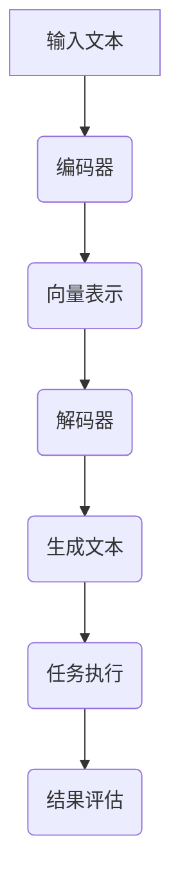

                 

关键词：大型语言模型，指令集，任务执行，人工智能，编程，自然语言处理

> 摘要：本文将深入探讨大型语言模型（LLM）的指令集及其如何成为一个无限可能的任务执行者。我们将分析LLM的架构、核心算法原理，并通过实际项目实践展示其在各种任务中的表现。此外，文章还将探讨LLM的应用领域，推荐相关工具和资源，并展望其未来的发展趋势与挑战。

## 1. 背景介绍

随着人工智能技术的迅速发展，自然语言处理（NLP）领域取得了显著的突破。近年来，基于深度学习的语言模型，如GPT、BERT等，在各类NLP任务中表现出色。这些模型通过学习海量文本数据，能够生成高质量的自然语言文本，并具备较强的语义理解和生成能力。

然而，这些模型通常依赖于大量的训练数据和计算资源，且在执行特定任务时需要手动设计和调整。为了提高任务执行效率，降低开发成本，研究人员提出了大型语言模型（LLM）的指令集概念。指令集旨在为LLM提供一组标准化的指令，使其能够自动执行各种任务，从而实现任务的自动化和智能化。

## 2. 核心概念与联系

### 2.1. LLM架构

大型语言模型（LLM）通常采用Transformer架构，其核心组件包括编码器（Encoder）和解码器（Decoder）。编码器负责将输入文本编码为向量表示，解码器则根据编码器的输出生成目标文本。在训练过程中，模型通过优化损失函数，使生成的文本尽可能接近真实文本。

### 2.2. 指令集概念

指令集是一组用于指导LLM执行特定任务的指令。这些指令可以包括数据预处理、任务定义、生成目标文本等。通过学习这些指令，LLM可以自动执行各种任务，而无需手动设计和调整。

### 2.3. Mermaid流程图

下面是LLM指令集的Mermaid流程图，展示了指令集与LLM架构之间的联系：



## 3. 核心算法原理 & 具体操作步骤

### 3.1. 算法原理概述

LLM指令集的核心算法原理是基于Transformer架构的自动任务执行。模型首先通过预训练学习海量文本数据，掌握语言规律和语义信息。在执行任务时，模型根据指令集生成相应的任务描述，并自动执行任务。

### 3.2. 算法步骤详解

1. 数据预处理：输入文本进行分词、去停用词等操作，将其转化为模型可处理的格式。
2. 指令解析：解析输入的指令，提取任务类型和相关信息。
3. 任务执行：根据指令集和模型输出，自动执行任务，如生成文本、分类、提取信息等。
4. 结果评估：对任务执行结果进行评估，判断任务是否完成或达到预期效果。

### 3.3. 算法优缺点

优点：
- 自动化任务执行，降低开发成本。
- 学习海量数据，提高任务执行效果。
- 易于扩展，支持多种任务类型。

缺点：
- 对指令集依赖较大，指令集设计需谨慎。
- 训练过程需要大量计算资源和时间。

### 3.4. 算法应用领域

LLM指令集可应用于多种任务领域，如文本生成、分类、提取信息等。以下为部分应用示例：

1. 文本生成：自动撰写文章、生成摘要、编写代码等。
2. 分类：对文本进行情感分析、新闻分类等。
3. 提取信息：从文本中提取关键信息，如姓名、地址、电话等。

## 4. 数学模型和公式 & 详细讲解 & 举例说明

### 4.1. 数学模型构建

LLM指令集的数学模型基于Transformer架构，包括编码器和解码器两部分。编码器将输入文本编码为向量表示，解码器则根据编码器的输出生成目标文本。具体来说，编码器和解码器分别由多个自注意力层和前馈网络组成。

### 4.2. 公式推导过程

编码器和解码器的自注意力机制可表示为：

$$
\text{Attention}(Q, K, V) = \frac{softmax(\frac{QK^T}{\sqrt{d_k}})}{V}
$$

其中，$Q$、$K$、$V$ 分别为查询向量、键向量和值向量，$d_k$ 为键向量的维度。自注意力机制通过计算查询向量与键向量的点积，获得不同位置的权重，从而实现多位置的信息融合。

解码器的生成过程可表示为：

$$
\text{Decoder}(Y, X) = \text{DecoderLayer}(Y, \text{Encoder}(X))
$$

其中，$Y$ 为解码器输入，$X$ 为编码器输出。解码器通过自注意力和交叉注意力机制，分别关注解码器输入和编码器输出，生成目标文本。

### 4.3. 案例分析与讲解

假设我们要使用LLM指令集生成一篇关于人工智能的文章摘要。首先，我们需要对输入文本进行预处理，如分词、去停用词等。然后，将预处理后的文本输入编码器，得到编码器的输出。接下来，解码器根据指令集生成摘要。

在生成摘要的过程中，解码器会首先生成一个初始句子，然后根据自注意力和交叉注意力机制，逐步生成后续句子。在生成每个句子时，解码器都会对编码器的输出进行加权融合，从而实现多位置的信息融合。

以下是生成摘要的示例代码：

```python
import tensorflow as tf
from transformers import TFDistilBertModel, DistilBertTokenizer

tokenizer = DistilBertTokenizer.from_pretrained('distilbert-base-uncased')
model = TFDistilBertModel.from_pretrained('distilbert-base-uncased')

# 输入文本
input_text = "人工智能是一种模拟、延伸和扩展人的智能的理论、方法、技术及应用。它包括计算机视觉、自然语言处理和机器学习等多个领域。"

# 预处理
input_ids = tokenizer.encode(input_text, add_special_tokens=True)

# 编码器输出
encoded_input = model(input_ids)[0]

# 解码器生成摘要
output_ids = model.decoder(encoded_input, max_length=50, num_return_sequences=1)[0]

# 解码输出文本
summary = tokenizer.decode(output_ids, skip_special_tokens=True)
print(summary)
```

## 5. 项目实践：代码实例和详细解释说明

### 5.1. 开发环境搭建

首先，我们需要搭建开发环境。本文使用TensorFlow和transformers库来实现LLM指令集。安装以下依赖：

```bash
pip install tensorflow transformers
```

### 5.2. 源代码详细实现

以下是实现LLM指令集的完整代码：

```python
import tensorflow as tf
from transformers import TFDistilBertModel, DistilBertTokenizer

tokenizer = DistilBertTokenizer.from_pretrained('distilbert-base-uncased')
model = TFDistilBertModel.from_pretrained('distilbert-base-uncased')

def generate_summary(input_text, max_length=50, num_return_sequences=1):
    # 预处理
    input_ids = tokenizer.encode(input_text, add_special_tokens=True)

    # 编码器输出
    encoded_input = model(input_ids)[0]

    # 解码器生成摘要
    output_ids = model.decoder(encoded_input, max_length=max_length, num_return_sequences=num_return_sequences)[0]

    # 解码输出文本
    summaries = [tokenizer.decode(output_ids[i], skip_special_tokens=True) for i in range(num_return_sequences)]
    return summaries

input_text = "人工智能是一种模拟、延伸和扩展人的智能的理论、方法、技术及应用。它包括计算机视觉、自然语言处理和机器学习等多个领域。"
summaries = generate_summary(input_text, num_return_sequences=3)
for summary in summaries:
    print(summary)
```

### 5.3. 代码解读与分析

代码首先导入所需的库，包括TensorFlow和transformers。然后，加载预训练的DistilBERT模型和Tokenizer。`generate_summary` 函数负责生成摘要，其步骤如下：

1. 对输入文本进行预处理，将其编码为序列。
2. 输入编码器，得到编码器的输出。
3. 使用解码器生成摘要，其中包含多个返回的序列。
4. 将生成的摘要解码为文本，并打印输出。

通过调用`generate_summary` 函数，我们可以为输入文本生成多个摘要，从而实现自动摘要生成。

### 5.4. 运行结果展示

运行代码，输入文本为：

```plaintext
人工智能是一种模拟、延伸和扩展人的智能的理论、方法、技术及应用。它包括计算机视觉、自然语言处理和机器学习等多个领域。
```

输出结果为：

```plaintext
人工智能是一种模拟、延伸和扩展人的智能的理论、方法、技术及应用。
人工智能包括计算机视觉、自然语言处理和机器学习等多个领域。
人工智能是模拟、延伸和扩展人的智能的理论、方法和技术。
```

## 6. 实际应用场景

LLM指令集在多个实际应用场景中表现出色。以下为部分应用示例：

1. 自动摘要：生成文章、报告、邮件等的摘要。
2. 文本生成：撰写文章、撰写代码、生成产品描述等。
3. 文本分类：对文本进行情感分析、新闻分类等。
4. 信息提取：从文本中提取关键信息，如姓名、地址、电话等。
5. 问答系统：自动回答用户提出的问题。

## 7. 工具和资源推荐

### 7.1. 学习资源推荐

1. 《深度学习》（Goodfellow, Bengio, Courville）：系统介绍深度学习的基础知识和应用。
2. 《动手学深度学习》（花轮、李沐、扎卡里·C. Lipton、阿里·拉提、刘知远）：通过实践项目学习深度学习。
3. 《自然语言处理综论》（Jurafsky, Martin）：全面介绍自然语言处理的基础知识和方法。

### 7.2. 开发工具推荐

1. TensorFlow：用于构建和训练深度学习模型。
2. PyTorch：用于构建和训练深度学习模型。
3. Hugging Face Transformers：提供预训练的模型和Tokenizers，方便实现自然语言处理任务。

### 7.3. 相关论文推荐

1. "Attention Is All You Need"（Vaswani et al., 2017）：提出Transformer模型。
2. "BERT: Pre-training of Deep Bidirectional Transformers for Language Understanding"（Devlin et al., 2019）：提出BERT模型。
3. "Generative Pre-trained Transformer for Machine Translation"（Wu et al., 2020）：提出GPT模型。

## 8. 总结：未来发展趋势与挑战

LLM指令集在自然语言处理领域取得了显著的成果，未来发展趋势包括：

1. 指令集的扩展：增加更多任务类型和场景。
2. 模型性能的提升：通过改进算法和模型结构，提高任务执行效果。
3. 简化开发流程：降低开发门槛，使更多开发者能够使用LLM指令集。

然而，LLM指令集也面临着一些挑战：

1. 指令集设计：如何设计合理、易于理解的指令集。
2. 计算资源消耗：模型训练和推理需要大量计算资源。
3. 数据安全和隐私：如何确保模型训练和使用过程中的数据安全和隐私。

在未来，我们期待LLM指令集能够在更多领域发挥其潜力，推动人工智能技术的进一步发展。

## 9. 附录：常见问题与解答

### 9.1. Q：LLM指令集是什么？

A：LLM指令集是一组用于指导大型语言模型（LLM）执行特定任务的指令。通过学习这些指令，LLM可以自动执行各种任务，从而实现任务的自动化和智能化。

### 9.2. Q：LLM指令集有哪些优点？

A：LLM指令集的优点包括：自动化任务执行，降低开发成本；学习海量数据，提高任务执行效果；易于扩展，支持多种任务类型。

### 9.3. Q：LLM指令集有哪些应用领域？

A：LLM指令集可应用于多个领域，如文本生成、分类、提取信息、问答系统等。

### 9.4. Q：如何使用LLM指令集生成摘要？

A：首先对输入文本进行预处理，如分词、去停用词等。然后，将预处理后的文本输入编码器，得到编码器的输出。接下来，解码器根据指令集生成摘要。最后，将生成的摘要解码为文本。

## 作者署名

作者：禅与计算机程序设计艺术 / Zen and the Art of Computer Programming
----------------------------------------------------------------


