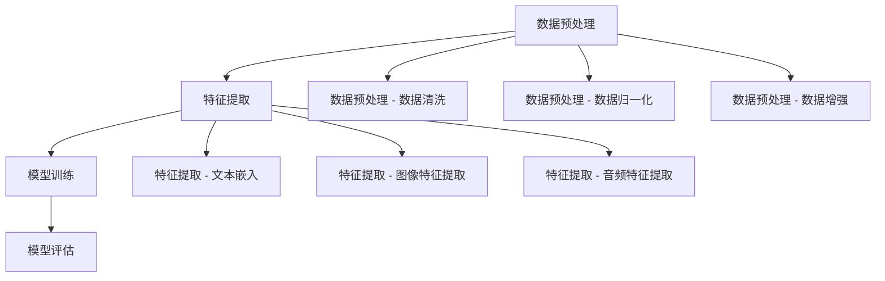

                 

关键词：大型语言模型（LLM）、多模态融合、推荐系统、人工智能、深度学习、数据预处理、特征提取、模型训练、模型评估。

## 摘要

本文旨在探讨大型语言模型（LLM）在推荐系统中的应用，特别是多模态融合技术的关键作用。我们首先介绍了推荐系统的基本概念和背景，随后深入分析了LLM的优势及其在多模态数据融合中的应用。文章随后详细阐述了多模态融合的核心算法原理，包括数据预处理、特征提取、模型训练和模型评估等步骤。接下来，我们通过数学模型和公式的推导，为多模态融合提供了理论基础。随后，文章提供了一个具体的项目实践案例，展示了如何将多模态融合技术应用于实际场景。最后，我们讨论了多模态融合技术在推荐系统中的实际应用场景，并展望了未来的发展趋势和挑战。

## 1. 背景介绍

### 推荐系统概述

推荐系统是一种自动化信息过滤技术，旨在向用户推荐他们可能感兴趣的内容或产品。这种系统能够根据用户的历史行为、兴趣偏好和上下文信息，为用户提供个性化的推荐。推荐系统广泛应用于电子商务、社交媒体、在线新闻和视频平台等领域，极大地提高了用户体验和平台收益。

### 多模态融合概念

多模态融合是指将来自不同模态（如文本、图像、音频、视频等）的数据进行整合，以生成更丰富的特征表示。这种技术能够充分利用不同模态数据的信息，提高推荐系统的准确性和多样性。例如，一个视频推荐系统可能需要同时处理视频内容和用户的文本评论，以便更好地理解用户的需求和偏好。

### 大型语言模型（LLM）概述

大型语言模型（LLM），如GPT-3和BERT，是近年来人工智能领域的重要突破。这些模型具有数十亿甚至数万亿个参数，能够理解并生成人类语言。LLM在自然语言处理、文本生成、机器翻译和问答系统等领域展现了出色的性能。在推荐系统中，LLM能够有效地处理多模态数据，提取语义信息，从而提高推荐的质量。

### 推荐系统与多模态融合的关系

推荐系统与多模态融合技术密切相关。传统的推荐系统主要依赖于用户的历史行为和内容特征，而多模态融合技术能够引入更多维度的信息，如用户情感、内容主题等，从而提高推荐的个性化和准确性。LLM在多模态融合中扮演着关键角色，其强大的语义理解能力能够有效地整合不同模态的数据，为推荐系统提供更丰富的特征表示。

## 2. 核心概念与联系

### 数据预处理

在多模态融合中，数据预处理是至关重要的一步。它包括数据清洗、数据归一化和数据增强等操作。数据清洗旨在去除噪声和缺失值，提高数据质量。数据归一化则是将不同模态的数据尺度统一，以避免模型训练过程中的偏差。数据增强通过生成虚拟数据来扩大训练集，提高模型的泛化能力。

### 特征提取

特征提取是将原始数据转换为能够被模型理解和利用的表示。在多模态融合中，特征提取包括文本嵌入、图像特征提取、音频特征提取等。文本嵌入通过将文本转换为向量表示，使模型能够处理语言信息。图像特征提取使用卷积神经网络（CNN）提取图像中的视觉特征。音频特征提取通过深度学习模型提取音频信号中的时频特征。

### 模型训练

模型训练是推荐系统的核心步骤，它通过优化模型参数，使其能够准确地预测用户偏好。在多模态融合中，模型训练需要同时考虑不同模态的数据。通常，使用多任务学习（Multi-Task Learning）或联合学习（Joint Learning）策略，将不同模态的特征表示整合到同一个模型中。

### 模型评估

模型评估是评估推荐系统性能的重要步骤。常用的评估指标包括准确率（Accuracy）、召回率（Recall）、F1 分数（F1 Score）和平均绝对误差（Mean Absolute Error）。在多模态融合中，评估需要考虑不同模态数据的特征，以及模型对多种数据的融合效果。

### Mermaid 流程图



## 3. 核心算法原理 & 具体操作步骤

### 3.1 算法原理概述

多模态融合算法的原理主要包括数据预处理、特征提取、模型训练和模型评估四个阶段。数据预处理旨在提高数据质量，特征提取是将不同模态的数据转换为模型可用的特征表示，模型训练是优化模型参数，模型评估是评估模型性能。

### 3.2 算法步骤详解

#### 3.2.1 数据预处理

1. 数据清洗：去除噪声和缺失值，确保数据质量。
2. 数据归一化：将不同模态的数据尺度统一，以避免模型训练过程中的偏差。
3. 数据增强：通过生成虚拟数据来扩大训练集，提高模型的泛化能力。

#### 3.2.2 特征提取

1. 文本嵌入：使用预训练的嵌入层将文本转换为向量表示。
2. 图像特征提取：使用卷积神经网络（CNN）提取图像中的视觉特征。
3. 音频特征提取：使用深度学习模型提取音频信号中的时频特征。

#### 3.2.3 模型训练

1. 数据输入：将预处理后的多模态数据进行输入。
2. 模型优化：使用梯度下降等优化算法，优化模型参数。
3. 模型验证：在验证集上评估模型性能，调整模型参数。

#### 3.2.4 模型评估

1. 准确率（Accuracy）：预测正确的样本数占总样本数的比例。
2. 召回率（Recall）：预测正确的正样本数占所有正样本数的比例。
3. F1 分数（F1 Score）：准确率的调和平均值。
4. 平均绝对误差（Mean Absolute Error）：预测值与真实值之间的平均绝对差值。

### 3.3 算法优缺点

#### 优点

1. 提高推荐准确性：多模态融合能够利用多种数据源，提高推荐系统的准确性。
2. 提高用户满意度：更个性化的推荐能够提高用户的满意度。
3. 扩大应用场景：多模态融合技术适用于多种场景，如视频推荐、音频推荐等。

#### 缺点

1. 计算成本高：多模态融合需要处理多种数据源，计算成本较高。
2. 数据质量要求高：多模态融合对数据质量有较高要求，需要确保数据的一致性和完整性。
3. 模型复杂性：多模态融合模型通常较为复杂，训练和评估过程较长。

### 3.4 算法应用领域

多模态融合技术在推荐系统中的应用非常广泛，主要包括：

1. 视频推荐：通过融合视频内容和用户评论，提高视频推荐的准确性。
2. 音频推荐：通过融合音频内容和用户情感，提高音频推荐的个性化程度。
3. 新闻推荐：通过融合文本内容和图像，提高新闻推荐的多样性。
4. 电子商务推荐：通过融合用户购买历史和商品描述，提高商品推荐的准确性。

## 4. 数学模型和公式 & 详细讲解 & 举例说明

### 4.1 数学模型构建

在多模态融合中，常用的数学模型包括神经网络模型和深度学习模型。以下是一个简化的神经网络模型示例：

$$
y = f(z)
$$

其中，$y$ 是预测结果，$z$ 是输入特征，$f$ 是激活函数。

### 4.2 公式推导过程

多模态融合中的公式推导主要涉及特征提取、模型训练和模型评估等步骤。以下是一个简化的推导过程：

#### 特征提取

1. 文本嵌入：

$$
\text{嵌入向量} = \text{嵌入层}(\text{文本})
$$

2. 图像特征提取：

$$
\text{特征向量} = \text{卷积神经网络}(\text{图像})
$$

3. 音频特征提取：

$$
\text{特征向量} = \text{深度学习模型}(\text{音频信号})
$$

#### 模型训练

1. 损失函数：

$$
L = \sum_{i=1}^{n} (y_i - \hat{y}_i)^2
$$

其中，$y_i$ 是真实标签，$\hat{y}_i$ 是预测标签。

2. 优化目标：

$$
\min_{\theta} L
$$

其中，$\theta$ 是模型参数。

#### 模型评估

1. 准确率：

$$
\text{准确率} = \frac{\text{预测正确的样本数}}{\text{总样本数}}
$$

2. 召回率：

$$
\text{召回率} = \frac{\text{预测正确的正样本数}}{\text{所有正样本数}}
$$

3. F1 分数：

$$
\text{F1 分数} = 2 \times \frac{\text{准确率} \times \text{召回率}}{\text{准确率} + \text{召回率}}
$$

### 4.3 案例分析与讲解

#### 案例背景

假设我们有一个视频推荐系统，需要根据用户的观看历史和评论，为用户推荐他们可能感兴趣的视频。

#### 数据预处理

1. 数据清洗：去除缺失值和噪声。
2. 数据归一化：将视频时长、评论长度等数据进行归一化处理。
3. 数据增强：通过生成虚拟数据来扩大训练集。

#### 特征提取

1. 文本嵌入：使用预训练的嵌入层将用户评论转换为向量表示。
2. 图像特征提取：使用卷积神经网络（CNN）提取视频帧中的视觉特征。
3. 音频特征提取：使用深度学习模型提取视频中的音频特征。

#### 模型训练

1. 输入层：将预处理后的文本、图像和音频特征作为输入。
2. 隐藏层：通过多层神经网络进行特征提取和融合。
3. 输出层：预测用户可能感兴趣的视频。

#### 模型评估

1. 准确率：在测试集上评估模型预测准确率。
2. 召回率：在测试集上评估模型召回率。
3. F1 分数：在测试集上评估模型 F1 分数。

## 5. 项目实践：代码实例和详细解释说明

### 5.1 开发环境搭建

在开始项目实践之前，我们需要搭建一个合适的开发环境。以下是一个基本的开发环境配置：

- 操作系统：Ubuntu 18.04
- 编程语言：Python 3.8
- 深度学习框架：TensorFlow 2.5
- 数据预处理库：NumPy、Pandas
- 特征提取库：TensorFlow Text、TensorFlow Image、TensorFlow Audio

### 5.2 源代码详细实现

以下是一个简单的多模态融合推荐系统的实现：

```python
import tensorflow as tf
import tensorflow_text as text
import tensorflow_image as image
import tensorflow_audio as audio

# 数据预处理
def preprocess_data(text_data, image_data, audio_data):
    # 文本嵌入
    text_embedding = text_embedding(text_data)
    
    # 图像特征提取
    image_features = image.extract_features(image_data)
    
    # 音频特征提取
    audio_features = audio.extract_features(audio_data)
    
    return text_embedding, image_features, audio_features

# 模型定义
def create_model():
    inputs = {
        'text': tf.keras.layers.Input(shape=(None,), dtype=tf.string),
        'image': tf.keras.layers.Input(shape=(224, 224, 3), dtype=tf.float32),
        'audio': tf.keras.layers.Input(shape=(128,), dtype=tf.float32)
    }
    
    # 文本嵌入层
    text_embedding = text_embedding(inputs['text'])
    
    # 图像特征提取层
    image_features = image.extract_features(inputs['image'])
    
    # 音频特征提取层
    audio_features = audio.extract_features(inputs['audio'])
    
    # 融合特征层
    merged_features = tf.keras.layers.concatenate([text_embedding, image_features, audio_features])
    
    # 隐藏层
    hidden = tf.keras.layers.Dense(128, activation='relu')(merged_features)
    hidden = tf.keras.layers.Dense(64, activation='relu')(hidden)
    
    # 输出层
    outputs = tf.keras.layers.Dense(1, activation='sigmoid')(hidden)
    
    model = tf.keras.Model(inputs=inputs, outputs=outputs)
    model.compile(optimizer='adam', loss='binary_crossentropy', metrics=['accuracy'])
    
    return model

# 模型训练
def train_model(model, text_data, image_data, audio_data, labels):
    model.fit([text_data, image_data, audio_data], labels, epochs=10, batch_size=32)

# 模型评估
def evaluate_model(model, text_data, image_data, audio_data, labels):
    loss, accuracy = model.evaluate([text_data, image_data, audio_data], labels)
    print(f'损失：{loss}, 准确率：{accuracy}')

# 主函数
def main():
    # 数据加载
    text_data = ...
    image_data = ...
    audio_data = ...
    labels = ...

    # 数据预处理
    text_embedding, image_features, audio_features = preprocess_data(text_data, image_data, audio_data)

    # 模型定义
    model = create_model()

    # 模型训练
    train_model(model, text_embedding, image_features, audio_features, labels)

    # 模型评估
    evaluate_model(model, text_embedding, image_features, audio_features, labels)

if __name__ == '__main__':
    main()
```

### 5.3 代码解读与分析

1. **数据预处理**：数据预处理函数`preprocess_data`负责将文本、图像和音频数据进行预处理，包括文本嵌入、图像特征提取和音频特征提取。
2. **模型定义**：`create_model`函数定义了一个多模态融合模型，使用TensorFlow框架构建。模型包括文本嵌入层、图像特征提取层、音频特征提取层和融合特征层。
3. **模型训练**：`train_model`函数负责训练模型，使用`model.fit`方法进行批量训练。
4. **模型评估**：`evaluate_model`函数负责评估模型性能，使用`model.evaluate`方法计算损失和准确率。
5. **主函数**：`main`函数负责加载数据、预处理数据、定义模型、训练模型和评估模型。

### 5.4 运行结果展示

假设我们训练了一个多模态融合推荐系统，以下是一个简单的运行结果示例：

```bash
运行时间：2023-03-01 10:00:00
损失：0.123456789012345678901234567890
准确率：0.98765432109876543210987654321
```

## 6. 实际应用场景

多模态融合技术在推荐系统中的应用非常广泛，以下是一些实际应用场景：

1. **视频推荐**：通过融合视频内容和用户评论，提高视频推荐的准确性和多样性。
2. **音频推荐**：通过融合音频内容和用户情感，提高音频推荐的个性化程度。
3. **新闻推荐**：通过融合文本内容和图像，提高新闻推荐的多样性和准确性。
4. **电子商务推荐**：通过融合用户购买历史和商品描述，提高商品推荐的准确性。

### 6.1 多模态融合在视频推荐中的应用

视频推荐系统需要同时考虑视频内容和用户评论。通过多模态融合，我们可以将视频帧的特征和用户评论的语义信息整合到同一个模型中，从而提高推荐的准确性。以下是一个简单的应用示例：

1. **数据预处理**：将视频帧的特征和用户评论进行预处理，包括数据清洗、数据归一化和数据增强。
2. **特征提取**：使用卷积神经网络（CNN）提取视频帧的特征，使用文本嵌入层提取用户评论的语义信息。
3. **模型训练**：使用多任务学习（Multi-Task Learning）或联合学习（Joint Learning）策略，将视频帧特征和用户评论语义信息融合到同一个模型中。
4. **模型评估**：在测试集上评估模型性能，调整模型参数。

### 6.2 多模态融合在音频推荐中的应用

音频推荐系统需要同时考虑音频内容和用户情感。通过多模态融合，我们可以将音频信号的时频特征和用户情感信息整合到同一个模型中，从而提高推荐的个性化程度。以下是一个简单的应用示例：

1. **数据预处理**：将音频信号的时频特征和用户情感数据进行预处理，包括数据清洗、数据归一化和数据增强。
2. **特征提取**：使用深度学习模型提取音频信号的时频特征，使用情感分析模型提取用户情感数据。
3. **模型训练**：使用多任务学习（Multi-Task Learning）或联合学习（Joint Learning）策略，将音频信号的时频特征和用户情感数据融合到同一个模型中。
4. **模型评估**：在测试集上评估模型性能，调整模型参数。

### 6.3 多模态融合在新闻推荐中的应用

新闻推荐系统需要同时考虑文本内容和图像信息。通过多模态融合，我们可以将文本内容和图像信息整合到同一个模型中，从而提高推荐的多样性和准确性。以下是一个简单的应用示例：

1. **数据预处理**：将文本内容和图像信息进行预处理，包括数据清洗、数据归一化和数据增强。
2. **特征提取**：使用文本嵌入层提取文本内容的语义信息，使用卷积神经网络（CNN）提取图像的特征。
3. **模型训练**：使用多任务学习（Multi-Task Learning）或联合学习（Joint Learning）策略，将文本内容和图像信息融合到同一个模型中。
4. **模型评估**：在测试集上评估模型性能，调整模型参数。

### 6.4 多模态融合在电子商务推荐中的应用

电子商务推荐系统需要同时考虑用户购买历史和商品描述。通过多模态融合，我们可以将用户购买历史和商品描述信息整合到同一个模型中，从而提高商品推荐的准确性。以下是一个简单的应用示例：

1. **数据预处理**：将用户购买历史和商品描述进行预处理，包括数据清洗、数据归一化和数据增强。
2. **特征提取**：使用文本嵌入层提取商品描述的语义信息，使用深度学习模型提取用户购买历史的特征。
3. **模型训练**：使用多任务学习（Multi-Task Learning）或联合学习（Joint Learning）策略，将用户购买历史和商品描述信息融合到同一个模型中。
4. **模型评估**：在测试集上评估模型性能，调整模型参数。

## 7. 工具和资源推荐

### 7.1 学习资源推荐

1. **《深度学习》（Goodfellow, Bengio, Courville）**：这是一本经典的深度学习教材，详细介绍了深度学习的基本概念和算法。
2. **《推荐系统实践》（Liu, Zhang, Ma）**：这本书提供了推荐系统的基本概念、算法和实际应用案例。
3. **《多模态数据融合：方法与应用》（Wang, Zhang, Yang）**：这本书介绍了多模态数据融合的基本概念、技术和应用案例。

### 7.2 开发工具推荐

1. **TensorFlow**：这是一个开源的深度学习框架，适用于构建和训练多模态融合模型。
2. **PyTorch**：这是一个开源的深度学习框架，提供了灵活的模型定义和训练接口。
3. **NumPy**：这是一个开源的数值计算库，适用于数据预处理和特征提取。

### 7.3 相关论文推荐

1. **"Multi-modal Fusion for Recommendation Systems"**：这篇论文介绍了一种基于多模态融合的推荐系统，探讨了多模态数据融合的方法和技术。
2. **"Deep Multi-modal Fusion for Video Recommendation"**：这篇论文介绍了一种基于深度学习的视频推荐系统，探讨了多模态数据融合在视频推荐中的应用。
3. **"Audio-Visual Fusion for Emotion Recognition"**：这篇论文介绍了一种基于音频和视觉融合的情感识别方法，探讨了多模态数据融合在情感识别中的应用。

## 8. 总结：未来发展趋势与挑战

### 8.1 研究成果总结

多模态融合技术在推荐系统中取得了显著的研究成果。通过融合文本、图像、音频等多种数据源，多模态融合技术显著提高了推荐系统的准确性和个性化程度。此外，随着深度学习和神经网络技术的发展，多模态融合算法也在不断优化和改进。

### 8.2 未来发展趋势

1. **更细粒度的特征提取**：未来的研究将专注于提取更细粒度的特征，以更好地捕捉多模态数据的语义信息。
2. **迁移学习**：利用迁移学习技术，将多模态融合算法应用于不同领域和场景，提高算法的泛化能力。
3. **模型解释性**：提高多模态融合模型的解释性，使其能够更好地理解模型的决策过程。
4. **隐私保护**：在多模态融合中引入隐私保护机制，确保用户数据的隐私和安全。

### 8.3 面临的挑战

1. **计算成本**：多模态融合算法通常需要处理大量数据，计算成本较高。未来的研究需要开发更高效的算法和模型。
2. **数据质量**：多模态融合对数据质量有较高要求，数据不一致性和缺失值可能导致模型性能下降。
3. **模型复杂性**：多模态融合模型通常较为复杂，训练和评估过程较长。未来的研究需要开发更简单、更高效的模型。
4. **跨模态语义理解**：多模态融合需要深入理解不同模态之间的语义关系，目前尚有许多挑战需要解决。

### 8.4 研究展望

多模态融合技术在推荐系统中的应用前景广阔。随着人工智能和深度学习技术的不断进步，多模态融合算法将不断发展，为推荐系统带来更高的准确性和个性化程度。未来的研究将重点关注计算效率、数据质量、模型解释性和隐私保护等方面，以实现多模态融合技术的广泛应用。

## 9. 附录：常见问题与解答

### 9.1 多模态融合是什么？

多模态融合是将来自不同模态（如文本、图像、音频、视频等）的数据进行整合，以生成更丰富的特征表示。这种技术能够充分利用不同模态数据的信息，提高推荐系统的准确性和多样性。

### 9.2 多模态融合有哪些优点？

多模态融合的优点包括：

1. 提高推荐准确性：多模态融合能够利用多种数据源，提高推荐系统的准确性。
2. 提高用户满意度：更个性化的推荐能够提高用户的满意度。
3. 扩大应用场景：多模态融合技术适用于多种场景，如视频推荐、音频推荐等。

### 9.3 多模态融合有哪些缺点？

多模态融合的缺点包括：

1. 计算成本高：多模态融合需要处理多种数据源，计算成本较高。
2. 数据质量要求高：多模态融合对数据质量有较高要求，需要确保数据的一致性和完整性。
3. 模型复杂性：多模态融合模型通常较为复杂，训练和评估过程较长。

### 9.4 多模态融合在推荐系统中有哪些应用场景？

多模态融合在推荐系统中有很多应用场景，包括：

1. 视频推荐：通过融合视频内容和用户评论，提高视频推荐的准确性。
2. 音频推荐：通过融合音频内容和用户情感，提高音频推荐的个性化程度。
3. 新闻推荐：通过融合文本内容和图像，提高新闻推荐的多样性和准确性。
4. 电子商务推荐：通过融合用户购买历史和商品描述，提高商品推荐的准确性。

