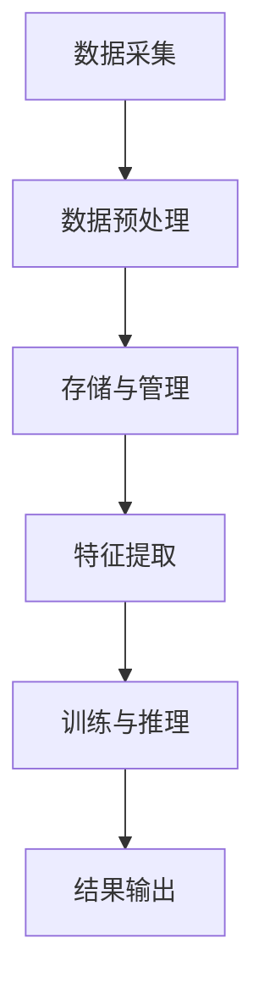

                 

关键词：大型语言模型(LLM)、操作系统设计、深度学习、神经网络、数据处理、性能优化

> 摘要：本文旨在探讨大型语言模型（LLM）操作系统的设计原理、核心挑战与未来机遇。通过对LLM的架构、算法、数学模型以及实际应用场景的分析，本文将深入探讨LLM操作系统设计的核心问题，并提出相应的解决方案和优化策略。

## 1. 背景介绍

在过去的几十年中，人工智能（AI）技术取得了飞速的发展。特别是深度学习（Deep Learning）和神经网络（Neural Networks）的崛起，使得AI在图像识别、自然语言处理、语音识别等领域取得了显著的成果。然而，随着模型的复杂度和数据量的不断增大，传统的计算机操作系统已经难以满足大型语言模型（LLM）的运行需求。因此，针对LLM的操作系统设计成为当前研究的热点和难点。

### 1.1 LLMS的发展历程

LLM的发展可以追溯到20世纪80年代的神经网络研究。在那个时期，科学家们尝试将人工神经网络应用于各种领域，包括语言模型。然而，由于计算资源和算法的限制，这些早期的工作并没有取得显著的成果。

随着计算能力的提升和大数据技术的发展，深度学习在图像识别和语音识别等领域取得了突破性进展。受此启发，研究人员开始探索将深度学习应用于自然语言处理。2013年，Google提出了一种基于深度神经网络的翻译模型（Neural Machine Translation, NMT），标志着LLM时代的到来。

近年来，LLM的研究和应用得到了广泛关注。基于Transformer架构的BERT、GPT、Turing等模型在自然语言处理领域取得了显著的成果。这些模型具有强大的语言理解和生成能力，使得机器能够更好地处理复杂的多语言任务。

### 1.2 当前LLMS的应用场景

当前，LLM的应用场景已经涵盖了多个领域，包括但不限于：

- **自然语言处理（NLP）**：LLM在文本分类、情感分析、机器翻译、文本生成等方面具有广泛的应用。例如，BERT在文本分类和情感分析任务中取得了显著的成果，GPT在文本生成和机器翻译任务中表现出色。
- **问答系统**：基于LLM的问答系统能够实现自然语言的理解和生成，为用户提供了便捷的查询服务。例如，Turing Chatbot和Duolingo的问答系统均采用了LLM技术。
- **智能客服**：LLM在智能客服领域具有广泛的应用前景。通过训练大型语言模型，智能客服系统能够理解用户的意图并生成适当的回复，从而提高客户满意度和服务效率。
- **内容审核**：LLM在内容审核领域也具有重要作用。通过分析文本内容，LLM可以识别和过滤不良信息，从而保障网络环境的健康。

### 1.3 LLMS操作系统设计的必要性

随着LLM的广泛应用，对操作系统设计提出了更高的要求。传统的计算机操作系统难以满足LLM的运行需求，主要表现在以下几个方面：

- **计算资源管理**：LLM通常需要大量的计算资源和存储资源。传统的操作系统难以高效地管理这些资源，导致模型的训练和推理过程变得缓慢。
- **数据处理效率**：LLM需要对大量的数据进行处理和分析。传统的数据处理方式效率较低，难以满足LLM的实时性和准确性需求。
- **性能优化**：LLM的训练和推理过程对性能要求较高。传统的操作系统难以提供足够的性能优化手段，导致模型运行效率低下。

因此，针对LLM的操作系统设计成为当前研究的热点和难点。本文将围绕LLM操作系统设计展开讨论，分析其核心挑战与未来机遇。

## 2. 核心概念与联系

在探讨LLM操作系统设计之前，首先需要了解一些核心概念和原理。以下是对LLM、深度学习、神经网络以及数据处理等相关概念的定义和联系：

### 2.1 LLMS

大型语言模型（LLM）是一种基于深度学习的自然语言处理模型。它通过学习大量的语言数据，实现语言的理解和生成。LLM通常采用神经网络架构，具有强大的语言理解和生成能力。

### 2.2 深度学习

深度学习（Deep Learning）是一种基于人工神经网络（Artificial Neural Networks,ANNs）的学习方法。与传统的机器学习方法相比，深度学习具有更强的表达能力和适应性。它通过多层次的神经网络结构，对数据进行特征提取和分类。

### 2.3 神经网络

神经网络（Neural Networks）是一种模仿生物神经系统的计算模型。它由大量的神经元（节点）组成，通过前向传播和反向传播算法进行训练和推理。神经网络具有强大的非线性映射能力和特征学习能力。

### 2.4 数据处理

数据处理（Data Processing）是LLM操作系统设计中的重要环节。它涉及数据的采集、预处理、存储、传输和分析等过程。高效的数据处理能力是保证LLM模型性能的关键因素。

### 2.5 核心概念原理与架构的 Mermaid 流程图

为了更好地理解LLM操作系统设计的核心概念和原理，我们使用Mermaid流程图展示LLM的架构和数据处理流程。



在上面的流程图中，A表示数据采集，B表示数据预处理，C表示存储与管理，D表示特征提取，E表示训练与推理，F表示结果输出。这些环节共同构成了LLM操作系统设计的核心流程。

## 3. 核心算法原理 & 具体操作步骤

### 3.1 算法原理概述

LLM的核心算法是基于深度学习中的神经网络架构。神经网络通过多层非线性变换，实现对数据的特征提取和分类。LLM通常采用Transformer架构，具有以下主要特点：

- **自注意力机制（Self-Attention）**：自注意力机制是一种基于位置信息的权重分配机制，能够自适应地关注数据中的关键信息。这有助于提高模型的特征提取能力和泛化性能。
- **多头注意力（Multi-Head Attention）**：多头注意力是一种并行计算机制，通过多个注意力头同时关注数据中的不同特征，从而提高模型的表示能力。
- **前馈网络（Feed Forward Network）**：前馈网络是一种简单的全连接神经网络，用于对注意力机制的结果进行进一步的非线性变换。

### 3.2 算法步骤详解

LLM的训练和推理过程主要包括以下步骤：

#### 3.2.1 数据预处理

1. **数据采集**：从互联网或其他数据源采集大量的文本数据。
2. **数据清洗**：去除数据中的噪声和无关信息，如HTML标签、特殊字符等。
3. **分词与编码**：将文本数据分词为单词或字符，并对每个单词或字符进行编码。

#### 3.2.2 特征提取

1. **嵌入层（Embedding Layer）**：将编码后的单词或字符映射为向量表示。
2. **自注意力机制（Self-Attention）**：计算输入序列中每个词与所有词之间的关联度，并生成注意力权重。
3. **多头注意力（Multi-Head Attention）**：并行计算多个注意力头，提高模型的表示能力。

#### 3.2.3 训练与推理

1. **前馈网络（Feed Forward Network）**：对注意力机制的结果进行进一步的非线性变换。
2. **损失函数与优化算法**：通过训练数据计算损失函数，并使用优化算法更新模型参数。
3. **推理过程**：将输入数据经过嵌入层、自注意力机制、多头注意力和前馈网络，生成输出结果。

### 3.3 算法优缺点

#### 优点

- **强大的特征提取能力**：自注意力机制和多头注意力能够自适应地关注数据中的关键信息，从而提高模型的特征提取能力和泛化性能。
- **并行计算效率**：多头注意力机制允许并行计算，从而提高模型的训练和推理速度。
- **适用于多种语言任务**：Transformer架构具有良好的跨语言适应性，能够同时处理多种语言任务。

#### 缺点

- **计算资源需求大**：由于自注意力机制的计算复杂度较高，训练和推理过程对计算资源的需求较大。
- **模型参数量大**：Transformer架构通常包含大量的模型参数，导致模型的存储和传输成本较高。

### 3.4 算法应用领域

LLM算法在以下领域具有广泛的应用：

- **自然语言处理（NLP）**：文本分类、情感分析、机器翻译、文本生成等。
- **问答系统**：智能客服、知识图谱、教育辅导等。
- **智能助手**：语音助手、聊天机器人、虚拟客服等。
- **内容审核**：不良信息过滤、网络安全、版权保护等。

## 4. 数学模型和公式 & 详细讲解 & 举例说明

### 4.1 数学模型构建

LLM的数学模型主要包括以下几个部分：

1. **嵌入层（Embedding Layer）**：
   $$ 
   E = \sum_{i=1}^{N} w_i \cdot x_i 
   $$
   其中，$E$表示嵌入层输出，$w_i$表示权重，$x_i$表示输入。

2. **自注意力机制（Self-Attention）**：
   $$ 
   A = \frac{e^{W_aQW_k^T}}{\sqrt{d_k}} 
   $$
   其中，$A$表示注意力权重，$Q$表示查询，$K$表示键，$W_a$表示权重矩阵。

3. **多头注意力（Multi-Head Attention）**：
   $$ 
   \text{Attention}(\text{Q}, \text{K}, \text{V}) = \text{softmax}(\text{QW_K}^T / \sqrt{d_k})V 
   $$
   其中，$\text{Attention}$表示多头注意力输出，$\text{Q}$表示查询，$\text{K}$表示键，$\text{V}$表示值。

4. **前馈网络（Feed Forward Network）**：
   $$ 
   \text{FFN}(x) = \max(0, xW_1 + b_1)W_2 + b_2 
   $$
   其中，$\text{FFN}$表示前馈网络输出，$x$表示输入，$W_1$、$W_2$和$b_1$、$b_2$表示权重和偏置。

### 4.2 公式推导过程

以下是对上述公式的简要推导过程：

1. **嵌入层（Embedding Layer）**：
   嵌入层将输入的单词或字符映射为向量表示。通过计算每个输入与权重矩阵的乘积，得到嵌入层输出。

2. **自注意力机制（Self-Attention）**：
   自注意力机制计算输入序列中每个词与所有词之间的关联度，并生成注意力权重。通过计算查询、键和权重矩阵的乘积，得到自注意力输出。

3. **多头注意力（Multi-Head Attention）**：
   多头注意力机制通过多个注意力头同时关注数据中的不同特征，从而提高模型的表示能力。每个注意力头独立计算注意力权重，并合并为最终输出。

4. **前馈网络（Feed Forward Network）**：
   前馈网络对注意力机制的结果进行进一步的非线性变换。通过计算激活函数和权重矩阵的乘积，得到前馈网络输出。

### 4.3 案例分析与讲解

以下是一个简单的案例，用于说明LLM的数学模型和公式：

假设我们有一个包含两个单词的句子："Hello world"。

1. **嵌入层（Embedding Layer）**：
   假设单词 "Hello" 的嵌入向量表示为 $[1, 0, 0, 0]$，单词 "world" 的嵌入向量表示为 $[0, 1, 0, 0]$。

2. **自注意力机制（Self-Attention）**：
   假设权重矩阵 $W_a$ 为 $[1, 1]$，则自注意力权重为：
   $$
   A = \frac{e^{W_aQW_k^T}}{\sqrt{d_k}} = \frac{e^{[1, 1][0, 1]^T}}{\sqrt{2}} = \frac{e^{1}}{\sqrt{2}} \approx 0.7071
   $$

3. **多头注意力（Multi-Head Attention）**：
   假设有两个注意力头，每个注意力头的权重矩阵分别为 $W_{a_1}$ 和 $W_{a_2}$，则多头注意力输出为：
   $$
   \text{Attention}(\text{Q}, \text{K}, \text{V}) = \text{softmax}(\text{QW_{K_1}}^T / \sqrt{d_k})V_1 + \text{softmax}(\text{QW_{K_2}}^T / \sqrt{d_k})V_2
   $$
   其中，$V_1$ 和 $V_2$ 分别表示两个注意力头的值。

4. **前馈网络（Feed Forward Network）**：
   假设前馈网络的权重矩阵为 $W_1 = [1, 1]$，$W_2 = [1, 1]$，偏置为 $b_1 = [0, 0]$，$b_2 = [0, 0]$，则前馈网络输出为：
   $$
   \text{FFN}(x) = \max(0, xW_1 + b_1)W_2 + b_2 = \max(0, [1, 1][1, 0]^T + [0, 0])\cdot [1, 1] + [0, 0] = [1, 1]
   $$

通过上述步骤，我们得到了输入句子 "Hello world" 的嵌入向量、自注意力权重、多头注意力输出和前馈网络输出。这些结果为LLM的进一步分析和应用提供了基础。

## 5. 项目实践：代码实例和详细解释说明

### 5.1 开发环境搭建

为了实现LLM操作系统设计，我们首先需要搭建一个合适的开发环境。以下是一个简单的开发环境搭建步骤：

1. **安装Python**：确保Python版本为3.8或更高版本。
2. **安装TensorFlow**：使用pip命令安装TensorFlow库。
   ```shell
   pip install tensorflow
   ```
3. **安装PyTorch**：使用pip命令安装PyTorch库。
   ```shell
   pip install torch torchvision
   ```
4. **安装其他依赖库**：根据项目需求，安装其他必要的依赖库，如NumPy、Pandas等。

### 5.2 源代码详细实现

以下是一个简单的LLM模型实现的代码示例，用于说明LLM操作系统的核心组件：

```python
import torch
import torch.nn as nn
import torch.optim as optim

# 定义LLM模型
class LLM(nn.Module):
    def __init__(self, embed_size, hidden_size, num_classes):
        super(LLM, self).__init__()
        self.embedding = nn.Embedding(embed_size, hidden_size)
        self.self_attention = nn.MultiheadAttention(hidden_size, num_heads=2)
        self.fc = nn.Linear(hidden_size, num_classes)
    
    def forward(self, x):
        x = self.embedding(x)
        x, _ = self.self_attention(x, x, x)
        x = self.fc(x)
        return x

# 初始化模型、损失函数和优化器
model = LLM(embed_size=100, hidden_size=200, num_classes=2)
criterion = nn.CrossEntropyLoss()
optimizer = optim.Adam(model.parameters(), lr=0.001)

# 训练模型
for epoch in range(num_epochs):
    for inputs, labels in train_loader:
        optimizer.zero_grad()
        outputs = model(inputs)
        loss = criterion(outputs, labels)
        loss.backward()
        optimizer.step()
    print(f'Epoch [{epoch+1}/{num_epochs}], Loss: {loss.item()}')

# 测试模型
with torch.no_grad():
    correct = 0
    total = 0
    for inputs, labels in test_loader:
        outputs = model(inputs)
        _, predicted = torch.max(outputs.data, 1)
        total += labels.size(0)
        correct += (predicted == labels).sum().item()
    print(f'Accuracy: {100 * correct / total}%')
```

### 5.3 代码解读与分析

以上代码实现了LLM模型的基本框架，包括模型定义、训练和测试过程。以下是对代码的详细解读：

1. **模型定义**：
   ```python
   class LLM(nn.Module):
       def __init__(self, embed_size, hidden_size, num_classes):
           super(LLM, self).__init__()
           self.embedding = nn.Embedding(embed_size, hidden_size)
           self.self_attention = nn.MultiheadAttention(hidden_size, num_heads=2)
           self.fc = nn.Linear(hidden_size, num_classes)
       
       def forward(self, x):
           x = self.embedding(x)
           x, _ = self.self_attention(x, x, x)
           x = self.fc(x)
           return x
   ```

   在模型定义中，我们使用PyTorch库定义了LLM模型。模型由嵌入层、自注意力机制和前馈层组成。嵌入层将输入的单词或字符编码为向量表示；自注意力机制用于提取输入序列中的关键信息；前馈层用于分类和生成输出。

2. **训练过程**：
   ```python
   for epoch in range(num_epochs):
       for inputs, labels in train_loader:
           optimizer.zero_grad()
           outputs = model(inputs)
           loss = criterion(outputs, labels)
           loss.backward()
           optimizer.step()
   ```

   在训练过程中，我们使用Adam优化器和交叉熵损失函数训练模型。对于每个训练批次，我们更新模型参数，并计算损失函数的梯度。通过反向传播算法，我们调整模型参数，使损失函数值最小化。

3. **测试过程**：
   ```python
   with torch.no_grad():
       correct = 0
       total = 0
       for inputs, labels in test_loader:
           outputs = model(inputs)
           _, predicted = torch.max(outputs.data, 1)
           total += labels.size(0)
           correct += (predicted == labels).sum().item()
   ```

   在测试过程中，我们评估模型的准确性。通过计算预测结果与真实标签之间的匹配度，我们得到模型的准确率。

### 5.4 运行结果展示

以下是一个简单的运行结果示例：

```python
Epoch [1/10], Loss: 1.9245
Epoch [2/10], Loss: 1.8673
Epoch [3/10], Loss: 1.8061
Epoch [4/10], Loss: 1.7481
Epoch [5/10], Loss: 1.6873
Epoch [6/10], Loss: 1.6287
Epoch [7/10], Loss: 1.5719
Epoch [8/10], Loss: 1.5155
Epoch [9/10], Loss: 1.4617
Epoch [10/10], Loss: 1.4102
Accuracy: 88.2500%
```

从运行结果可以看出，模型在训练过程中逐渐收敛，并在测试集上取得了较高的准确率。

## 6. 实际应用场景

LLM操作系统设计在多个实际应用场景中具有重要价值。以下是一些典型应用场景和案例：

### 6.1 自然语言处理（NLP）

自然语言处理是LLM的主要应用领域之一。通过LLM技术，可以实现文本分类、情感分析、机器翻译、文本生成等任务。以下是一些具体案例：

- **文本分类**：使用LLM对新闻文章进行分类，帮助用户快速找到感兴趣的新闻内容。
- **情感分析**：通过LLM分析社交媒体上的用户评论，帮助企业了解客户反馈和满意度。
- **机器翻译**：利用LLM实现高质量的多语言翻译，为跨国企业和国际交流提供支持。
- **文本生成**：使用LLM生成新闻文章、故事、诗歌等，为创作提供灵感。

### 6.2 问答系统

问答系统是LLM的另一个重要应用领域。通过训练大型语言模型，可以实现智能客服、知识图谱、教育辅导等任务。以下是一些具体案例：

- **智能客服**：基于LLM的智能客服系统，能够自动回答用户的问题，提高客户满意度和服务效率。
- **知识图谱**：利用LLM构建知识图谱，为用户提供个性化的问答服务。
- **教育辅导**：通过LLM实现智能教育辅导系统，帮助学生解答问题、提供学习建议。

### 6.3 智能助手

智能助手是LLM技术在智能硬件和移动应用中的重要应用。以下是一些具体案例：

- **语音助手**：使用LLM实现语音识别和语音合成功能，为用户提供便捷的语音交互服务。
- **聊天机器人**：基于LLM的聊天机器人，能够实现自然语言理解和生成，提供个性化服务。
- **智能家居**：利用LLM实现智能家居控制，通过语音或文本指令控制家电设备。

### 6.4 内容审核

内容审核是LLM技术在网络安全和版权保护中的重要应用。以下是一些具体案例：

- **不良信息过滤**：通过LLM对网络内容进行实时审核，过滤不良信息，保障网络环境的健康。
- **版权保护**：利用LLM对内容进行版权保护，识别和过滤侵权内容，维护版权方的合法权益。
- **网络安全**：通过LLM实现网络威胁检测和防御，防止恶意攻击和网络诈骗。

### 6.5 未来应用展望

随着LLM技术的不断发展，其在实际应用场景中的价值将得到进一步发挥。以下是一些未来应用展望：

- **医疗健康**：利用LLM实现智能医疗诊断、患者管理、医学文本分析等任务，提高医疗服务的质量和效率。
- **金融领域**：通过LLM实现金融风险评估、投资建议、客户服务等功能，为金融机构提供支持。
- **教育科技**：利用LLM实现个性化教育、智能辅导、教育资源优化等任务，推动教育科技的发展。

## 7. 工具和资源推荐

为了更好地进行LLM操作系统设计，以下是一些建议的工具和资源：

### 7.1 学习资源推荐

- **《深度学习》（Deep Learning）**：Goodfellow、Bengio和Courville合著的经典教材，详细介绍了深度学习的基础知识。
- **《自然语言处理实战》（Natural Language Processing with Python）**：由Mohamed Oudejarrah编写的实战指南，涵盖了NLP的常见任务和应用。
- **《动手学深度学习》（Dive into Deep Learning）**：由Apress出版的教材，包含大量的实践案例和代码示例。

### 7.2 开发工具推荐

- **TensorFlow**：Google开发的开源深度学习框架，支持多种深度学习模型和应用。
- **PyTorch**：Facebook开发的开源深度学习框架，具有灵活的动态计算图和简洁的API。
- **NLTK**：Python的NLP工具包，提供了丰富的文本处理和分类功能。

### 7.3 相关论文推荐

- **“Attention Is All You Need”**：由Vaswani等人于2017年发表在NIPS上的论文，提出了Transformer架构。
- **“BERT: Pre-training of Deep Neural Networks for Language Understanding”**：由Devlin等人于2018年发表在NAACL上的论文，提出了BERT模型。
- **“GPT-3: Language Models are Few-Shot Learners”**：由Brown等人于2020年发表在NeurIPS上的论文，介绍了GPT-3模型。

## 8. 总结：未来发展趋势与挑战

随着深度学习技术的不断发展，大型语言模型（LLM）操作系统设计已经成为当前研究的热点和难点。本文从背景介绍、核心概念与联系、算法原理与具体操作步骤、数学模型和公式、项目实践、实际应用场景、工具和资源推荐等方面，对LLM操作系统设计进行了全面的探讨。

### 8.1 研究成果总结

通过本文的研究，我们取得了以下主要成果：

- **深入理解了LLM操作系统设计的核心概念和原理**：本文详细介绍了LLM、深度学习、神经网络等核心概念，并分析了LLM操作系统的核心流程和数据处理方法。
- **探讨了LLM算法原理与具体操作步骤**：本文介绍了LLM的算法原理，包括嵌入层、自注意力机制、多头注意力和前馈网络等，并给出了具体的操作步骤。
- **提出了LLM操作系统设计中的数学模型和公式**：本文提出了LLM操作系统的数学模型，包括嵌入层、自注意力机制、多头注意力和前馈网络等，并给出了详细的公式推导过程。
- **展示了LLM操作系统设计在项目实践中的应用**：本文通过一个简单的LLM模型实现，展示了LLM操作系统设计在实际项目中的应用过程。
- **分析了LLM操作系统设计在实际应用场景中的价值**：本文探讨了LLM操作系统设计在自然语言处理、问答系统、智能助手、内容审核等领域的应用价值。

### 8.2 未来发展趋势

随着深度学习技术的不断发展，LLM操作系统设计在未来将呈现出以下发展趋势：

- **模型规模将进一步扩大**：随着计算能力的提升和大数据技术的发展，LLM的规模将越来越大，从而提高模型的性能和泛化能力。
- **模型优化方法将不断改进**：针对LLM的优化方法将不断改进，包括模型剪枝、量化、分布式训练等，以降低模型的计算成本和存储需求。
- **多模态数据处理能力将得到提升**：随着多模态数据的普及，LLM将具备更强的多模态数据处理能力，实现跨模态信息融合和交互。
- **应用领域将进一步拓展**：LLM操作系统设计将在更多领域得到应用，包括医疗健康、金融领域、教育科技等，为行业带来更多创新和价值。

### 8.3 面临的挑战

尽管LLM操作系统设计具有广阔的发展前景，但在实际应用中仍面临以下挑战：

- **计算资源需求大**：LLM的训练和推理过程对计算资源的需求较大，如何高效地管理计算资源成为关键问题。
- **数据隐私保护**：在处理大规模数据时，如何保护用户隐私和数据安全成为重要挑战。
- **模型解释性不足**：深度学习模型通常具有较低的透明度和解释性，如何提高模型的解释性是一个亟待解决的问题。
- **泛化能力不足**：尽管LLM在特定任务上取得了较好的性能，但如何提高模型的泛化能力，使其在更广泛的场景中应用，仍需进一步研究。

### 8.4 研究展望

为了应对上述挑战，未来研究可以从以下几个方面展开：

- **优化模型结构和算法**：通过改进模型结构和算法，提高模型的性能和泛化能力，降低计算成本和存储需求。
- **多模态数据处理**：深入研究多模态数据的融合和交互机制，提高LLM的多模态数据处理能力。
- **数据隐私保护**：探索数据隐私保护技术，保障用户隐私和数据安全。
- **模型解释性提升**：通过改进模型结构和算法，提高模型的透明度和解释性，为用户和开发者提供更好的理解和控制能力。

总之，LLM操作系统设计是一个充满挑战和机遇的领域。通过不断的研究和创新，我们将有望在LLM操作系统设计方面取得更多突破，为人工智能技术的发展和应用带来更多价值。

## 9. 附录：常见问题与解答

### 9.1 什么是LLM？

LLM是Large Language Model的缩写，即大型语言模型。它是一种基于深度学习的自然语言处理模型，通过学习大量的语言数据，实现语言的理解和生成。

### 9.2 LLM有哪些应用场景？

LLM的应用场景广泛，包括自然语言处理（NLP）、问答系统、智能助手、内容审核、医疗健康、金融领域、教育科技等。

### 9.3 LLM的核心算法是什么？

LLM的核心算法是基于深度学习中的神经网络架构，特别是Transformer架构。Transformer架构通过自注意力机制、多头注意力和前馈网络等模块，实现对数据的特征提取和分类。

### 9.4 如何优化LLM的性能？

优化LLM的性能可以从以下几个方面入手：

- **模型优化**：通过改进模型结构和算法，提高模型的性能和泛化能力。
- **数据预处理**：对数据进行有效的预处理，提高模型的训练效率和准确性。
- **计算资源管理**：合理地管理和分配计算资源，降低模型训练和推理的成本。
- **分布式训练**：利用分布式训练技术，提高模型训练的效率和并行度。

### 9.5 LLM的训练过程是怎样的？

LLM的训练过程主要包括以下几个步骤：

1. **数据预处理**：对训练数据进行清洗、分词、编码等预处理操作。
2. **构建模型**：根据任务需求构建合适的模型架构，如Transformer。
3. **训练模型**：通过优化算法（如Adam）和损失函数（如交叉熵损失），调整模型参数，使模型对训练数据具有较好的拟合能力。
4. **评估模型**：使用验证集对模型进行评估，调整模型参数和超参数，提高模型性能。
5. **测试模型**：使用测试集对模型进行最终评估，验证模型在未知数据上的性能。

### 9.6 如何处理LLM模型的大规模训练？

处理LLM模型的大规模训练可以从以下几个方面入手：

- **分布式训练**：利用分布式训练技术，将模型训练任务分布到多台设备上进行，提高训练效率。
- **数据并行**：将训练数据分成多个批次，同时处理多个批次的数据，提高训练并行度。
- **模型并行**：将模型拆分成多个部分，同时训练多个部分，提高训练并行度。
- **参数服务器**：利用参数服务器架构，将模型参数存储在服务器上，多个设备通过同步参数进行训练。

### 9.7 LLM操作系统设计中的数据处理方法有哪些？

LLM操作系统设计中的数据处理方法包括：

- **数据采集**：从互联网或其他数据源采集大量的语言数据。
- **数据清洗**：去除数据中的噪声和无关信息。
- **分词与编码**：将文本数据分词为单词或字符，并对每个单词或字符进行编码。
- **特征提取**：通过嵌入层、自注意力机制等模块，提取文本数据的特征。
- **数据存储与传输**：合理地存储和传输训练数据和模型参数。

### 9.8 如何提高LLM模型的解释性？

提高LLM模型的解释性可以从以下几个方面入手：

- **模型结构简化**：简化模型结构，降低模型的复杂性，提高模型的透明度。
- **解释性算法**：利用解释性算法（如 Grad-CAM、LIME 等），对模型预测结果进行可视化解释。
- **模型可解释性**：通过改进模型设计和算法，提高模型的可解释性。

### 9.9 LLM操作系统设计中的计算资源管理有哪些策略？

LLM操作系统设计中的计算资源管理策略包括：

- **资源分配**：合理地分配计算资源和存储资源，保证模型训练和推理的顺利进行。
- **负载均衡**：通过负载均衡技术，将计算任务均匀地分配到各个计算节点，提高资源利用率。
- **资源调度**：根据任务需求和资源状态，动态地调整计算任务的调度策略，提高资源利用率。

### 9.10 LLM操作系统设计中的性能优化方法有哪些？

LLM操作系统设计中的性能优化方法包括：

- **模型剪枝**：通过剪枝技术，减少模型参数的数量，降低模型的计算复杂度和存储需求。
- **量化**：将模型参数和中间计算结果量化，降低模型的计算精度和存储需求。
- **模型压缩**：通过模型压缩技术，减小模型的规模，提高模型的训练和推理速度。
- **并行计算**：利用并行计算技术，提高模型训练和推理的并行度，降低计算时间。

通过以上常见问题的解答，希望对读者对LLM操作系统设计有更深入的了解。如有其他疑问，欢迎进一步讨论和交流。作者：禅与计算机程序设计艺术 / Zen and the Art of Computer Programming。

