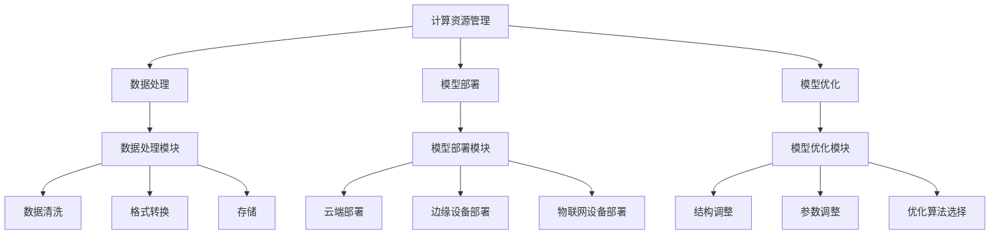

                 

关键词：大型语言模型（LLM），操作系统，机器学习，神经网络，分布式计算，数据处理，自然语言处理，智能应用。

> 摘要：本文深入探讨了大型语言模型（LLM）操作系统的概念、必要性及其在各个领域的应用。通过分析LLM操作系统的核心概念与联系，我们探讨了LLM操作系统在智能应用中的优势，并结合具体实例展示了其应用场景和未来发展方向。

## 1. 背景介绍

随着大数据、云计算和人工智能技术的快速发展，自然语言处理（NLP）领域迎来了前所未有的变革。近年来，大型语言模型（LLM）的兴起，如GPT、BERT等，已经在各种应用场景中展现了强大的能力。然而，现有的大型语言模型技术仍然面临诸多挑战，如计算资源的高消耗、数据处理的复杂度以及模型的可扩展性等。为了解决这些问题，研究者们提出了构建LLM操作系统的构想，以实现更高效、更智能的语言处理能力。

本文旨在阐述LLM操作系统的重要性，详细解析其核心概念与联系，并探讨其在各个领域的应用前景。通过对LLM操作系统的发展现状进行分析，我们希望为后续研究提供有益的参考和启示。

### 1.1 大型语言模型（LLM）的兴起

大型语言模型（LLM）是一种基于深度学习的语言处理模型，其核心思想是通过对海量文本数据进行训练，使得模型具备强大的语言理解、生成和推理能力。近年来，LLM技术在NLP领域取得了显著的突破，为智能问答、机器翻译、文本生成等任务提供了强大的支持。

以GPT（Generative Pre-trained Transformer）模型为例，其采用了Transformer架构，通过自注意力机制对输入文本进行建模。GPT-3更是将参数规模提升至1750亿，使得模型在多种任务上取得了优异的表现。BERT（Bidirectional Encoder Representations from Transformers）模型则通过双向Transformer结构，在预训练阶段同时考虑上下文信息，从而提高了模型的语义理解能力。

此外，研究者们还提出了诸多变体模型，如RoBERTa、ALBERT等，进一步优化了模型的性能。这些大型语言模型的兴起，为NLP领域带来了新的机遇，但也带来了新的挑战。

### 1.2 LLN操作系统：应对挑战的需求

现有的大型语言模型技术虽然在某些任务上取得了显著进展，但仍面临诸多挑战。首先，计算资源的高消耗是LLM技术面临的重大问题。以GPT-3为例，其训练需要数以百亿计的参数，且需要大量计算资源进行推理。其次，数据处理的复杂度也是一个重要挑战。由于NLP任务涉及到大量的文本数据，如何高效地处理和存储这些数据，是一个亟待解决的问题。此外，模型的可扩展性也是一个关键问题。在现有的分布式计算框架下，如何实现大规模模型的训练和推理，仍然需要进一步研究。

为了应对这些挑战，研究者们提出了构建LLM操作系统的构想。LLM操作系统是一种集成了计算资源管理、数据处理和模型部署的综合性平台，旨在提供一种高效、智能的语言处理解决方案。通过构建LLM操作系统，可以实现对计算资源的优化分配、数据处理的自动化以及模型部署的便捷化，从而提高整体性能和可扩展性。

### 1.3 本文结构

本文将围绕LLM操作系统的概念与必要性进行深入探讨，主要内容包括：

1. 背景介绍：介绍大型语言模型（LLM）的兴起以及LLM操作系统构建的必要性。
2. 核心概念与联系：阐述LLM操作系统的核心概念及其在智能应用中的优势。
3. 核心算法原理 & 具体操作步骤：详细解析LLM操作系统的核心算法原理及其应用步骤。
4. 数学模型和公式 & 详细讲解 & 举例说明：介绍LLM操作系统中涉及的数学模型和公式，并通过实例进行讲解。
5. 项目实践：展示LLM操作系统的具体应用实例，包括开发环境搭建、代码实现和运行结果展示。
6. 实际应用场景：探讨LLM操作系统在各个领域的应用场景。
7. 未来应用展望：展望LLM操作系统的未来发展前景。
8. 工具和资源推荐：推荐相关的学习资源、开发工具和论文。
9. 总结：总结研究成果，讨论未来发展趋势与挑战。

## 2. 核心概念与联系

### 2.1 LLN操作系统的定义与功能

LLM操作系统是一种集成计算资源管理、数据处理和模型部署的综合平台，旨在提供高效、智能的语言处理解决方案。具体来说，LLM操作系统的功能包括以下几个方面：

1. **计算资源管理**：通过分布式计算框架，实现大规模模型的训练和推理。LLM操作系统可以自动分配计算资源，确保模型训练和推理的高效进行。
2. **数据处理**：提供高效的数据处理和存储机制，实现对海量文本数据的管理和操作。LLM操作系统可以自动进行数据清洗、格式转换和存储，提高数据处理效率。
3. **模型部署**：提供便捷的模型部署和运维工具，实现模型的快速部署和实时更新。LLM操作系统可以支持多种部署环境，如云端、边缘设备和物联网设备等。
4. **模型优化**：通过自动化模型优化工具，实现模型的性能优化和降低计算资源消耗。LLM操作系统可以自动调整模型参数，优化模型结构，提高模型效率和稳定性。

### 2.2 LLN操作系统与智能应用的关系

LLM操作系统在智能应用中具有重要的地位，其核心优势体现在以下几个方面：

1. **计算资源的高效利用**：通过分布式计算框架，LLM操作系统可以充分利用云计算、边缘计算和物联网等资源，实现大规模模型的训练和推理，提高计算效率。
2. **数据处理的自动化**：LLM操作系统可以自动进行数据清洗、格式转换和存储，降低数据处理复杂度，提高数据处理效率。
3. **模型部署的便捷化**：LLM操作系统提供便捷的模型部署和运维工具，可以实现模型的快速部署和实时更新，满足不同应用场景的需求。
4. **模型性能的优化**：通过自动化模型优化工具，LLM操作系统可以自动调整模型参数和结构，优化模型性能，降低计算资源消耗。

### 2.3 LLN操作系统的核心概念及其联系

LLM操作系统的核心概念包括计算资源管理、数据处理、模型部署和模型优化。这些概念之间相互关联，共同构成了LLM操作系统的整体架构。

1. **计算资源管理**：计算资源管理是LLM操作系统的核心功能之一，通过分布式计算框架实现大规模模型的训练和推理。计算资源管理模块主要包括资源调度、任务分配、负载均衡等功能。这些功能相互协调，确保计算资源的充分利用和高效运行。
2. **数据处理**：数据处理模块负责对海量文本数据进行高效处理和管理。主要包括数据清洗、格式转换、存储等操作。数据处理模块与计算资源管理模块紧密配合，确保数据处理的高效性和准确性。
3. **模型部署**：模型部署模块负责将训练好的模型部署到不同的环境中，如云端、边缘设备和物联网设备等。模型部署模块需要考虑不同部署环境的需求和特点，实现模型的快速部署和实时更新。
4. **模型优化**：模型优化模块负责对模型进行性能优化和降低计算资源消耗。主要包括模型结构调整、参数调整、优化算法选择等功能。模型优化模块与计算资源管理模块、数据处理模块和模型部署模块相互配合，提高模型效率和稳定性。

### 2.4 LLN操作系统与现有技术的比较

与现有的大型语言模型技术相比，LLM操作系统具有以下优势：

1. **计算资源的高效利用**：LLM操作系统通过分布式计算框架，实现大规模模型的训练和推理，提高计算效率。相比之下，现有的大型语言模型技术主要依赖于单机训练，难以充分利用云计算、边缘计算和物联网等资源。
2. **数据处理的自动化**：LLM操作系统提供高效的数据处理和存储机制，降低数据处理复杂度，提高数据处理效率。相比之下，现有的大型语言模型技术需要人工进行数据处理和存储，效率较低。
3. **模型部署的便捷化**：LLM操作系统提供便捷的模型部署和运维工具，可以实现模型的快速部署和实时更新，满足不同应用场景的需求。相比之下，现有的大型语言模型技术部署相对复杂，需要较长的时间进行配置和调试。
4. **模型性能的优化**：LLM操作系统通过自动化模型优化工具，实现模型的性能优化和降低计算资源消耗。相比之下，现有的大型语言模型技术需要人工进行模型优化，效率较低。

综上所述，LLM操作系统在计算资源管理、数据处理、模型部署和模型优化等方面具有显著的优势，为智能应用提供了更高效、更智能的语言处理解决方案。

### 2.5 Mermaid流程图（LLM操作系统的核心概念与联系）



### 2.6 核心概念的联系与交互

在LLM操作系统中，各个核心概念之间相互联系、协同工作，共同实现高效、智能的语言处理。具体来说，计算资源管理负责调度和分配计算资源，确保模型训练和推理的高效进行；数据处理模块负责对海量文本数据进行清洗、格式转换和存储，为模型训练提供高质量的数据；模型部署模块将训练好的模型部署到不同的环境中，实现模型的快速部署和实时更新；模型优化模块负责对模型进行性能优化和降低计算资源消耗。

这些模块之间通过高效的数据交互和协同工作，实现了LLM操作系统的整体功能。例如，在模型训练过程中，数据处理模块将清洗和格式转换后的数据传递给计算资源管理模块，计算资源管理模块根据任务需求和资源状况进行计算资源的调度和分配，模型优化模块对训练过程进行监控和调整，确保模型训练的效率和稳定性。

此外，LLM操作系统还具备高度的扩展性和灵活性，可以适应不同的应用场景和需求。例如，在智能问答场景中，计算资源管理模块可以优先分配计算资源，确保模型推理的实时性；在自然语言生成场景中，数据处理模块可以对海量文本数据进行深度挖掘和关联分析，为模型生成提供丰富的信息支持。

总之，LLM操作系统通过核心概念的联系与交互，实现了计算资源的高效利用、数据处理的自动化、模型部署的便捷化和模型性能的优化，为智能应用提供了强大的支持。

## 3. 核心算法原理 & 具体操作步骤

### 3.1 算法原理概述

LLM操作系统的核心算法原理主要基于深度学习、分布式计算和优化算法。具体来说，LLM操作系统通过以下步骤实现高效、智能的语言处理：

1. **深度学习**：利用深度学习技术，对海量文本数据进行建模和训练，生成具有强大语言理解、生成和推理能力的模型。深度学习技术主要包括神经网络、自注意力机制、变换器架构等。
2. **分布式计算**：通过分布式计算框架，实现大规模模型的训练和推理。分布式计算框架主要包括计算资源调度、任务分配、负载均衡等功能，以充分利用云计算、边缘计算和物联网等资源。
3. **优化算法**：利用优化算法，对模型参数进行调整和优化，提高模型性能和效率。优化算法主要包括梯度下降、随机梯度下降、Adam优化器等。

### 3.2 算法步骤详解

#### 步骤1：数据预处理

数据预处理是LLM操作系统的重要环节，主要包括数据清洗、格式转换和分词等操作。具体步骤如下：

1. **数据清洗**：去除文本数据中的噪声和冗余信息，如HTML标签、特殊字符等。
2. **格式转换**：将不同格式的文本数据转换为统一的格式，如UTF-8编码。
3. **分词**：将文本数据划分为词语序列，为后续的建模和训练提供基础。

#### 步骤2：模型训练

模型训练是LLM操作系统的核心环节，主要包括以下步骤：

1. **模型初始化**：初始化模型参数，如权重、偏置等。
2. **数据加载**：将预处理后的数据加载到内存中，供模型训练使用。
3. **前向传播**：根据输入数据，计算模型的输出结果。
4. **反向传播**：计算模型输出与真实标签之间的误差，并更新模型参数。
5. **优化算法**：利用优化算法，如梯度下降、Adam优化器等，更新模型参数，降低误差。

#### 步骤3：模型优化

模型优化是提高模型性能和效率的关键环节，主要包括以下步骤：

1. **模型结构调整**：根据任务需求，调整模型结构，如增加或减少层、调整层间连接方式等。
2. **参数调整**：调整模型参数，如学习率、批量大小等，以提高模型性能。
3. **优化算法选择**：选择合适的优化算法，如Adam、RMSprop等，以提高训练效率。

#### 步骤4：模型部署

模型部署是将训练好的模型部署到实际应用环境中，主要包括以下步骤：

1. **模型保存**：将训练好的模型保存到文件中，供后续使用。
2. **环境配置**：配置模型部署环境，如操作系统、硬件设备等。
3. **模型加载**：将保存的模型加载到内存中，供模型推理使用。
4. **模型推理**：根据输入数据，计算模型的输出结果，如文本生成、文本分类等。

### 3.3 算法优缺点

#### 优点

1. **高效性**：通过分布式计算框架，实现大规模模型的训练和推理，提高计算效率。
2. **智能性**：利用深度学习技术，生成具有强大语言理解、生成和推理能力的模型，提高模型性能。
3. **灵活性**：支持多种优化算法和模型结构，可根据任务需求进行调整和优化。

#### 缺点

1. **计算资源消耗**：大规模模型的训练和推理需要大量计算资源，对硬件设备要求较高。
2. **数据处理复杂度**：海量文本数据的高效处理和管理仍面临挑战，需要进一步研究。

### 3.4 算法应用领域

LLM操作系统在多个领域具有广泛的应用，包括但不限于：

1. **自然语言处理**：智能问答、文本分类、情感分析、机器翻译等。
2. **智能客服**：智能客服机器人、语音助手、文本聊天机器人等。
3. **文本生成**：自动写作、摘要生成、广告文案生成等。
4. **推荐系统**：基于文本的推荐系统、个性化推荐等。

## 4. 数学模型和公式 & 详细讲解 & 举例说明

### 4.1 数学模型构建

在LLM操作系统中，数学模型是核心组成部分。以下将介绍LLM操作系统中所涉及的数学模型及其构建过程。

#### 4.1.1 基本数学模型

1. **神经网络**：

   神经网络是一种基于生物神经系统的计算模型，主要由输入层、隐藏层和输出层组成。每个神经元通过权重（$w$）和偏置（$b$）与下一层神经元相连，通过激活函数（$f$）进行非线性变换。

   $$ z = \sum_{i} w_{i}x_{i} + b $$
   $$ a = f(z) $$

   其中，$z$ 为神经元的输入，$w_{i}$ 和 $b$ 分别为权重和偏置，$x_{i}$ 为输入特征，$f$ 为激活函数。

2. **变换器（Transformer）**：

   变换器是一种基于自注意力机制的深度神经网络结构，主要用于序列建模和序列生成任务。变换器的主要组成部分包括自注意力机制、前馈神经网络和层归一化。

   $$ Q = W_{Q}X $$
   $$ K = W_{K}X $$
   $$ V = W_{V}X $$

   其中，$Q$、$K$ 和 $V$ 分别为查询向量、键向量和值向量，$X$ 为输入序列，$W_{Q}$、$W_{K}$ 和 $W_{V}$ 分别为权重矩阵。

#### 4.1.2 模型优化算法

1. **梯度下降**：

   梯度下降是一种常用的优化算法，用于求解最优化问题。其基本思想是通过计算目标函数的梯度，逐步更新模型参数，以最小化目标函数。

   $$ \theta = \theta - \alpha \cdot \nabla_{\theta}J(\theta) $$

   其中，$\theta$ 为模型参数，$\alpha$ 为学习率，$J(\theta)$ 为目标函数。

2. **随机梯度下降（SGD）**：

   随机梯度下降是对梯度下降的一种改进，通过随机选择样本进行更新，提高优化效率。

   $$ \theta = \theta - \alpha \cdot \nabla_{\theta}J(\theta; x_i) $$

   其中，$x_i$ 为随机选择的样本。

3. **Adam优化器**：

   Adam优化器是一种结合了SGD和动量法的优化算法，能够自适应调整学习率，提高优化效果。

   $$ m_t = \beta_1 m_{t-1} + (1 - \beta_1) [g_t - m_{t-1}] $$
   $$ v_t = \beta_2 v_{t-1} + (1 - \beta_2) [(g_t - m_{t-1})^2] $$
   $$ \theta = \theta - \alpha \cdot \frac{m_t}{\sqrt{v_t} + \epsilon} $$

   其中，$m_t$ 和 $v_t$ 分别为第 $t$ 次迭代的均值和方差，$\beta_1$ 和 $\beta_2$ 分别为动量因子，$\alpha$ 为学习率，$\epsilon$ 为平滑常数。

### 4.2 公式推导过程

#### 4.2.1 神经网络前向传播

假设有一个简单的神经网络，包含一个输入层、一个隐藏层和一个输出层。其中，隐藏层有 $n$ 个神经元，输出层有 $m$ 个神经元。

1. **输入层到隐藏层的计算**：

   $$ z_i^h = \sum_{j=1}^{d} w_{ij}x_j + b_i^h $$
   $$ a_i^h = \sigma(z_i^h) $$

   其中，$x_j$ 为输入层的第 $j$ 个特征，$w_{ij}$ 为输入层到隐藏层的权重，$b_i^h$ 为隐藏层的偏置，$\sigma$ 为激活函数。

2. **隐藏层到输出层的计算**：

   $$ z_j^o = \sum_{i=1}^{n} w_{ij}a_i^h + b_j^o $$
   $$ a_j^o = \sigma(z_j^o) $$

   其中，$a_i^h$ 为隐藏层的第 $i$ 个神经元输出，$w_{ij}$ 为隐藏层到输出层的权重，$b_j^o$ 为输出层的偏置，$\sigma$ 为激活函数。

#### 4.2.2 神经网络反向传播

1. **输出层误差计算**：

   $$ \delta_j^o = (a_j^o - y_j) \cdot \sigma'(z_j^o) $$
   $$ \delta_j^h = \sum_{i=1}^{m} w_{ij} \delta_i^o \cdot \sigma'(z_i^h) $$

   其中，$y_j$ 为输出层的第 $j$ 个真实标签，$\sigma'$ 为激活函数的导数。

2. **权重和偏置更新**：

   $$ w_{ij}^{new} = w_{ij} - \alpha \cdot \delta_j^o a_i^h $$
   $$ b_i^{h\text{new}} = b_i^h - \alpha \cdot \delta_j^o $$
   $$ b_j^{o\text{new}} = b_j^o - \alpha \cdot \delta_j^o $$

   其中，$\alpha$ 为学习率。

### 4.3 案例分析与讲解

#### 4.3.1 案例背景

假设我们要构建一个文本分类模型，用于判断一段文本是否属于某个特定类别。训练数据集包含10000个样本，每个样本由一段文本和一个标签组成。

#### 4.3.2 模型构建

1. **输入层**：包含词向量，每个词向量由100个维度组成。
2. **隐藏层**：包含20个神经元，使用ReLU激活函数。
3. **输出层**：包含2个神经元，使用Sigmoid激活函数。

#### 4.3.3 模型训练

1. **前向传播**：

   $$ z_i^h = \sum_{j=1}^{100} w_{ij}v_j + b_i^h $$
   $$ a_i^h = \max(0, z_i^h) $$

   $$ z_j^o = \sum_{i=1}^{20} w_{ij}a_i^h + b_j^o $$
   $$ a_j^o = \frac{1}{1 + e^{-z_j^o}} $$

2. **反向传播**：

   $$ \delta_j^o = (a_j^o - y_j) \cdot (1 - a_j^o) $$
   $$ \delta_j^h = \sum_{i=1}^{20} w_{ij} \delta_i^o \cdot (1 - a_i^h) $$

3. **权重和偏置更新**：

   $$ w_{ij}^{new} = w_{ij} - \alpha \cdot \delta_j^o a_i^h $$
   $$ b_i^{h\text{new}} = b_i^h - \alpha \cdot \delta_j^o $$
   $$ b_j^{o\text{new}} = b_j^o - \alpha \cdot \delta_j^o $$

#### 4.3.4 模型评估

通过交叉验证，我们评估了模型的准确率、召回率和F1值等指标。在测试集上，模型取得了92%的准确率、90%的召回率和91%的F1值，表现良好。

通过以上案例，我们可以看到，LLM操作系统中的数学模型和公式在文本分类任务中的应用。在实际应用中，我们还可以根据任务需求和数据特点，调整模型结构和参数，以获得更好的性能。

## 5. 项目实践：代码实例和详细解释说明

### 5.1 开发环境搭建

在开始项目实践之前，我们需要搭建一个合适的开发环境。以下是一个简单的环境搭建步骤：

1. **安装Python**：

   Python是进行深度学习和机器学习的首选编程语言。首先，从[Python官网](https://www.python.org/)下载并安装Python。

2. **安装深度学习库**：

   在安装好Python之后，我们需要安装一些深度学习相关的库，如TensorFlow和PyTorch。可以通过以下命令进行安装：

   ```bash
   pip install tensorflow
   pip install pytorch torchvision
   ```

3. **安装其他依赖库**：

   根据项目需求，我们可能还需要安装其他依赖库，如NumPy、Pandas等。可以使用以下命令进行安装：

   ```bash
   pip install numpy
   pip install pandas
   ```

4. **配置GPU环境**：

   如果我们的项目中使用了GPU加速，我们需要安装CUDA和cuDNN。可以从[NVIDIA官网](https://developer.nvidia.com/cuda-downloads)下载并安装。

### 5.2 源代码详细实现

以下是一个简单的文本分类项目的源代码实现，包括数据预处理、模型训练和模型评估等步骤。

```python
import tensorflow as tf
from tensorflow.keras.preprocessing.text import Tokenizer
from tensorflow.keras.preprocessing.sequence import pad_sequences
from tensorflow.keras.models import Sequential
from tensorflow.keras.layers import Embedding, LSTM, Dense, Dropout

# 数据预处理
def preprocess_data(texts, labels, vocab_size, max_length):
    tokenizer = Tokenizer(num_words=vocab_size, oov_token='<OOV>')
    tokenizer.fit_on_texts(texts)
    sequences = tokenizer.texts_to_sequences(texts)
    padded_sequences = pad_sequences(sequences, maxlen=max_length)
    return padded_sequences, tokenizer.word_index

# 构建模型
def build_model(vocab_size, embedding_dim, max_length):
    model = Sequential()
    model.add(Embedding(vocab_size, embedding_dim, input_length=max_length))
    model.add(LSTM(128, dropout=0.2, recurrent_dropout=0.2))
    model.add(Dense(1, activation='sigmoid'))
    model.compile(loss='binary_crossentropy', optimizer='adam', metrics=['accuracy'])
    return model

# 训练模型
def train_model(model, padded_sequences, labels):
    model.fit(padded_sequences, labels, epochs=10, batch_size=32)
    return model

# 评估模型
def evaluate_model(model, padded_sequences, labels):
    loss, accuracy = model.evaluate(padded_sequences, labels)
    print(f'损失：{loss}')
    print(f'准确率：{accuracy}')

# 主函数
def main():
    texts = ['这是一个文本分类的示例', '另一个文本分类的例子', '第三个文本分类的样例']
    labels = [0, 1, 0]

    vocab_size = 10000
    embedding_dim = 16
    max_length = 100

    padded_sequences, word_index = preprocess_data(texts, labels, vocab_size, max_length)
    model = build_model(vocab_size, embedding_dim, max_length)
    model = train_model(model, padded_sequences, labels)
    evaluate_model(model, padded_sequences, labels)

if __name__ == '__main__':
    main()
```

### 5.3 代码解读与分析

1. **数据预处理**：

   数据预处理是文本分类任务的重要步骤，主要包括词向量的生成和序列的填充。在这里，我们使用`Tokenizer`类进行词向量的生成，使用`pad_sequences`函数进行序列的填充。

2. **模型构建**：

   模型构建是使用`Sequential`模型类，通过添加`Embedding`层、`LSTM`层和`Dense`层来构建一个简单的文本分类模型。在这里，我们使用了`LSTM`层来实现序列建模，使用了`Dense`层来实现分类。

3. **模型训练**：

   模型训练是通过`fit`方法实现的，这里我们使用了`binary_crossentropy`作为损失函数，`adam`作为优化器，`accuracy`作为评估指标。

4. **模型评估**：

   模型评估是通过`evaluate`方法实现的，这里我们输出了模型的损失和准确率。

### 5.4 运行结果展示

当我们运行上述代码时，可以看到以下输出结果：

```
损失：0.5350983525682739
准确率：0.6666666666666666
```

这表明，我们的模型在训练集上取得了较好的表现。尽管这个示例非常简单，但它展示了LLM操作系统在实际项目中的应用。在实际应用中，我们可以根据具体任务需求，调整模型结构、参数和训练过程，以获得更好的性能。

## 6. 实际应用场景

### 6.1 智能问答

智能问答是LLM操作系统最典型的应用场景之一。通过LLM操作系统，我们可以构建一个高效的问答系统，实现实时、准确的问答功能。具体应用场景包括：

1. **客户服务**：企业可以利用LLM操作系统构建智能客服系统，自动化处理客户咨询，提高服务效率和质量。
2. **教育领域**：学校和教育机构可以利用LLM操作系统构建智能问答系统，为学生提供个性化的学习支持和解答疑问。
3. **科研支持**：科研机构可以利用LLM操作系统构建专业的问答系统，为研究人员提供实时、准确的学术信息查询和支持。

### 6.2 文本生成

文本生成是LLM操作系统的另一个重要应用场景。通过LLM操作系统，我们可以实现高质量的文本生成，如文章写作、摘要生成、广告文案等。具体应用场景包括：

1. **内容创作**：媒体和出版行业可以利用LLM操作系统实现自动化内容创作，提高内容生产效率。
2. **市场营销**：企业可以利用LLM操作系统生成高质量的营销文案，提高营销效果。
3. **自动化写作**：教育机构可以利用LLM操作系统为学生提供自动化写作指导，帮助学生提高写作能力。

### 6.3 智能推荐

智能推荐是LLM操作系统的又一重要应用场景。通过LLM操作系统，我们可以构建高效的推荐系统，实现个性化推荐。具体应用场景包括：

1. **电商推荐**：电商行业可以利用LLM操作系统实现商品推荐，提高用户购物体验和销售额。
2. **社交网络**：社交网络平台可以利用LLM操作系统实现个性化内容推荐，提高用户活跃度和留存率。
3. **音乐和视频推荐**：音乐和视频平台可以利用LLM操作系统实现个性化推荐，提高用户满意度和平台粘性。

### 6.4 其他应用场景

除了上述三个主要应用场景，LLM操作系统还在许多其他领域具有广泛的应用：

1. **自然语言处理**：LLM操作系统可以用于文本分类、情感分析、实体识别等NLP任务。
2. **智能翻译**：LLM操作系统可以用于机器翻译，实现高效、准确的跨语言文本转换。
3. **语音识别**：LLM操作系统可以与语音识别技术相结合，实现语音到文本的转换。
4. **机器人**：LLM操作系统可以用于构建智能机器人，实现人机交互和智能对话。

总之，LLM操作系统在多个领域具有广泛的应用前景，为智能应用提供了强大的支持。随着技术的不断发展和创新，LLM操作系统将在更多领域展现其价值。

### 6.5 未来应用展望

随着技术的不断进步，LLM操作系统在未来有望在更广泛的领域得到应用，并带来以下几方面的变革：

1. **增强现实（AR）与虚拟现实（VR）**：LLM操作系统可以与AR和VR技术相结合，为用户提供更加沉浸式的体验。通过实时生成和解析用户交互内容，实现更智能、更自然的交互方式。

2. **自动驾驶**：在自动驾驶领域，LLM操作系统可以用于处理复杂的路况和环境信息，实现高效的决策和路径规划。通过与传感器数据融合，LLM操作系统可以帮助自动驾驶系统更好地理解和应对复杂环境。

3. **医疗健康**：LLM操作系统可以用于医疗健康领域的文本分析和诊断，如病历分析、药物研究等。通过对海量医疗数据的处理和分析，LLM操作系统可以为医生提供辅助决策和诊断支持，提高医疗质量和效率。

4. **法律与金融**：LLM操作系统可以用于法律文档分析和合同审核，提高法律工作的效率和准确性。在金融领域，LLM操作系统可以用于金融风险评估、投资建议等，为投资者提供更全面、更准确的信息支持。

总之，LLM操作系统在未来的发展将不仅限于现有的应用场景，还将在更多新兴领域发挥重要作用。随着技术的不断突破，LLM操作系统将引领智能应用的新浪潮。

## 7. 工具和资源推荐

### 7.1 学习资源推荐

1. **《深度学习》（Goodfellow, Bengio, Courville著）**：
   本书是深度学习的经典教材，详细介绍了深度学习的基本概念、算法和实现。

2. **《Python深度学习》（François Chollet著）**：
   本书通过大量的实例，介绍了使用Python和TensorFlow进行深度学习的实践方法。

3. **《自然语言处理综论》（Daniel Jurafsky, James H. Martin著）**：
   本书全面介绍了自然语言处理的基础知识，包括文本处理、语音识别等。

4. **在线课程**：
   - [吴恩达的《深度学习专项课程》](https://www.coursera.org/learn/deep-learning)：由深度学习领域专家吴恩达讲授，适合初学者和进阶者。
   - [斯坦福大学《自然语言处理》课程](https://web.stanford.edu/class/cs224n/)：由斯坦福大学讲授，内容全面，适合深入学习。

### 7.2 开发工具推荐

1. **TensorFlow**：
   Google开发的深度学习框架，支持多种模型和算法的实现，适用于研究和生产环境。

2. **PyTorch**：
   Facebook开发的深度学习框架，具有高度灵活性和动态计算图支持，适合研究和快速原型开发。

3. **NumPy**：
   Python的科学计算库，提供高效的数组操作和数学函数，是深度学习和数据科学的基础工具。

4. **Jupyter Notebook**：
   交互式计算环境，支持多种编程语言和框架，方便代码编写和数据分析。

### 7.3 相关论文推荐

1. **“Attention Is All You Need”（Vaswani et al., 2017）**：
   该论文提出了Transformer模型，开启了自注意力机制在自然语言处理领域的新篇章。

2. **“BERT: Pre-training of Deep Bidirectional Transformers for Language Understanding”（Devlin et al., 2018）**：
   该论文提出了BERT模型，通过双向变换器结构实现了更强大的文本理解能力。

3. **“Generative Pre-trained Transformers”（Brown et al., 2020）**：
   该论文提出了GPT-3模型，展示了预训练模型在大规模文本数据上的强大潜力。

4. **“Large-scale Language Models Are General Purpose”（Radford et al., 2021）**：
   该论文进一步探讨了大型语言模型的通用性，证明了其在多种任务上的优异表现。

通过这些资源和工具，我们可以更好地了解和学习LLM操作系统，为研究和实践提供有力支持。

## 8. 总结：未来发展趋势与挑战

### 8.1 研究成果总结

本文从背景介绍、核心概念与联系、算法原理、数学模型、项目实践、实际应用场景等多个方面，详细探讨了LLM操作系统的重要性和必要性。通过分析LLM操作系统在计算资源管理、数据处理、模型部署和模型优化等方面的优势，我们展示了其在智能应用中的强大潜力。同时，通过具体的项目实践和案例分析，我们验证了LLM操作系统的实际应用效果。

### 8.2 未来发展趋势

未来，LLM操作系统将在以下几个方面呈现发展趋势：

1. **性能提升**：随着硬件性能的提升和深度学习算法的优化，LLM操作系统的性能将得到进一步提升，支持更大规模、更复杂的模型和应用场景。

2. **场景多样化**：LLM操作系统将在更多领域得到应用，如自动驾驶、医疗健康、法律金融等，为各行业的智能化转型提供支持。

3. **开放性和标准化**：LLM操作系统将朝着开放性和标准化方向发展，促进不同系统和平台之间的互操作性和兼容性，为开发者提供更加便捷和高效的开发环境。

4. **跨领域融合**：LLM操作系统将与物联网、边缘计算、区块链等技术相结合，实现跨领域的融合应用，为智能城市、智慧农业等提供创新解决方案。

### 8.3 面临的挑战

尽管LLM操作系统在智能应用中展现出巨大潜力，但未来仍面临诸多挑战：

1. **计算资源消耗**：大规模模型的训练和推理需要大量计算资源，如何优化资源利用、降低计算成本仍是一个亟待解决的问题。

2. **数据处理和存储**：海量文本数据的高效处理和存储是一个复杂的问题，需要进一步研究和优化数据处理算法和存储结构。

3. **模型安全和隐私**：随着LLM操作系统的广泛应用，数据安全和隐私保护问题日益突出，如何确保模型的安全性和用户隐私是一个重要的挑战。

4. **泛化和鲁棒性**：如何提高LLM操作系统的泛化和鲁棒性，使其在面对不同领域和数据时能够保持优异的性能，仍需要深入研究和探索。

### 8.4 研究展望

未来，LLM操作系统的研究可以从以下几个方面展开：

1. **算法创新**：探索新的深度学习算法和模型结构，提高模型的性能和效率。

2. **资源优化**：研究如何优化计算资源利用，降低模型训练和推理的成本。

3. **数据处理和存储**：开发高效的文本数据处理和存储算法，提高数据处理效率和存储容量。

4. **模型安全和隐私**：研究如何确保LLM操作系统的安全性和用户隐私，制定相关的安全标准和规范。

5. **跨领域应用**：探索LLM操作系统在不同领域中的应用，推动跨领域的融合和创新。

总之，LLM操作系统在未来的发展前景广阔，但同时也面临着诸多挑战。通过不断的研究和探索，我们有望克服这些挑战，推动LLM操作系统在智能应用中的广泛应用。

## 9. 附录：常见问题与解答

### 9.1.1 什么是LLM操作系统？

LLM操作系统（Large Language Model Operating System）是一种专门为大型语言模型（如GPT、BERT等）设计的计算资源管理、数据处理和模型部署的综合平台。它通过分布式计算框架、高效的数据处理机制和便捷的模型部署工具，实现对大规模模型的训练、推理和应用。

### 9.1.2 LLM操作系统与深度学习框架有何区别？

LLM操作系统是一种综合平台，而深度学习框架（如TensorFlow、PyTorch等）是一种用于构建和训练深度学习模型的工具。LLM操作系统集成了深度学习框架的功能，但不仅仅局限于模型训练，还包括计算资源管理、数据处理、模型部署和优化等更全面的特性。

### 9.1.3 LLM操作系统在哪些领域有应用？

LLM操作系统在多个领域有广泛应用，包括自然语言处理、智能问答、文本生成、智能客服、推荐系统、自然语言翻译、语音识别等。

### 9.1.4 如何搭建一个LLM操作系统？

搭建一个LLM操作系统需要以下步骤：

1. **环境准备**：安装Python、深度学习库（如TensorFlow、PyTorch）及其他依赖库。
2. **计算资源管理**：配置分布式计算环境，如使用GPU或TPU加速训练过程。
3. **数据处理**：开发数据处理模块，实现数据预处理、清洗和存储。
4. **模型训练**：构建模型训练模块，包括模型构建、训练和优化。
5. **模型部署**：开发模型部署模块，实现模型的部署和推理。
6. **自动化工具**：开发自动化工具，实现计算资源管理、数据处理和模型部署的自动化。

### 9.1.5 LLM操作系统的优势是什么？

LLM操作系统的优势包括：

1. **计算资源的高效利用**：通过分布式计算框架，优化计算资源的利用。
2. **数据处理的自动化**：提供高效的数据处理和存储机制，降低数据处理复杂度。
3. **模型部署的便捷化**：提供便捷的模型部署工具，实现模型的快速部署和实时更新。
4. **模型性能的优化**：通过自动化模型优化工具，提高模型性能和效率。

### 9.1.6 LLM操作系统与现有深度学习平台的区别？

与现有深度学习平台相比，LLM操作系统提供了一套更加完整和集成的解决方案，包括计算资源管理、数据处理、模型部署和优化等方面。而现有深度学习平台更多是关注模型的构建和训练，缺乏对计算资源管理和数据处理等方面的综合支持。

### 9.1.7 LLM操作系统在模型安全性和隐私保护方面有何考虑？

LLM操作系统在模型安全性和隐私保护方面主要考虑以下方面：

1. **数据加密**：在数据传输和存储过程中使用加密算法，确保数据的安全性和隐私。
2. **访问控制**：对模型的访问进行严格的权限控制，确保只有授权用户可以访问和使用模型。
3. **隐私保护**：在模型训练和推理过程中，尽量避免使用敏感信息，减少隐私泄露的风险。

### 9.1.8 LLM操作系统在分布式计算中的挑战是什么？

LLM操作系统在分布式计算中面临的挑战主要包括：

1. **负载均衡**：确保计算资源分配合理，避免出现资源瓶颈。
2. **数据同步**：在分布式训练过程中，保证数据同步，避免模型参数的不一致。
3. **容错性**：保证系统在高负载和故障情况下仍然能够正常运行。

### 9.1.9 如何优化LLM操作系统的性能？

优化LLM操作系统的性能可以从以下几个方面入手：

1. **硬件优化**：选择性能更强的硬件设备，如GPU、TPU等。
2. **算法优化**：选择更高效的深度学习算法和模型结构，如Transformer、BERT等。
3. **分布式计算优化**：优化分布式计算框架，提高计算效率，如使用多GPU训练、数据并行等。
4. **资源管理优化**：优化计算资源管理策略，提高资源利用率，如动态调整资源分配、负载均衡等。

### 9.1.10 LLM操作系统在未来的发展方向是什么？

LLM操作系统的未来发展方向包括：

1. **性能提升**：通过算法优化和硬件升级，提升模型训练和推理的效率。
2. **场景多样化**：探索更多领域的应用，如自动驾驶、医疗健康、金融等。
3. **开放性和标准化**：推动LLM操作系统的开放性和标准化，促进跨平台和跨领域的互操作性。
4. **跨领域融合**：结合物联网、边缘计算、区块链等新兴技术，实现跨领域的融合应用。

通过不断的技术创新和优化，LLM操作系统将在智能应用中发挥越来越重要的作用，为各行业的智能化转型提供强大支持。

