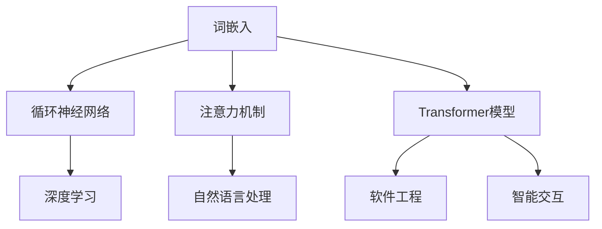

                 

关键词：大型语言模型（LLM），无限编程，人工智能，算法，软件开发，计算机科学，数学模型，实际应用，未来展望。

> 摘要：本文将深入探讨大型语言模型（LLM）在现代软件开发和人工智能领域的无限编程潜力。通过分析LLM的核心概念与原理，探讨其在算法、数学模型、项目实践等方面的应用，以及对其未来发展的趋势与挑战进行展望。

## 1. 背景介绍

近年来，随着深度学习和神经网络技术的飞速发展，大型语言模型（LLM）逐渐成为人工智能领域的热点。LLM是一种强大的自然语言处理工具，通过学习海量文本数据，能够理解和生成人类语言，从而实现文本生成、翻译、摘要、问答等多种功能。这种模型的广泛应用，极大地推动了自然语言处理技术的进步，也为软件开发领域带来了无限可能。

本文将从LLM的核心概念、算法原理、数学模型、项目实践等方面展开讨论，旨在揭示LLM在无限编程中的巨大潜力，并对其未来发展趋势与挑战进行深入分析。

## 2. 核心概念与联系

### 2.1 大型语言模型（LLM）

大型语言模型（LLM）是基于深度学习的自然语言处理模型，通过对大量文本数据进行训练，使其具备理解和生成人类语言的能力。LLM的核心组成部分包括：

- **词嵌入（Word Embedding）**：将词汇映射到高维空间中，以便在神经网络中进行处理。
- **循环神经网络（RNN）**：用于处理序列数据，通过记忆过去的信息来生成未来的输出。
- **注意力机制（Attention Mechanism）**：使模型能够关注序列中的重要信息，提高生成结果的准确性。
- **Transformer模型**：一种基于自注意力机制的深度神经网络结构，具有并行处理能力和更好的性能。

### 2.2 与其他技术的联系

LLM与其他技术的紧密联系，使其在软件开发和人工智能领域具有广泛的应用前景。以下是一些关键联系：

- **深度学习**：LLM是深度学习技术的一种应用，其训练和优化过程依赖于大量的数据和高性能计算资源。
- **自然语言处理（NLP）**：LLM是NLP领域的重要工具，用于处理文本数据的理解和生成。
- **软件工程**：LLM能够自动生成代码、文档和测试用例，提高软件开发的效率和质量。
- **智能交互**：LLM能够与用户进行自然语言对话，为智能助手、客服系统等提供强大的交互能力。

### 2.3 Mermaid 流程图

以下是一个描述LLM核心概念和联系流程图的示例：



## 3. 核心算法原理 & 具体操作步骤

### 3.1 算法原理概述

LLM的核心算法是基于深度学习技术，通过对海量文本数据进行训练，使其能够理解和生成人类语言。其主要原理包括：

- **词嵌入**：将词汇映射到高维空间中，以便在神经网络中进行处理。
- **循环神经网络（RNN）**：用于处理序列数据，通过记忆过去的信息来生成未来的输出。
- **注意力机制**：使模型能够关注序列中的重要信息，提高生成结果的准确性。
- **Transformer模型**：一种基于自注意力机制的深度神经网络结构，具有并行处理能力和更好的性能。

### 3.2 算法步骤详解

以下是LLM的算法步骤详解：

1. **数据预处理**：收集和整理海量文本数据，并进行预处理，如去除停用词、标点符号等。
2. **词嵌入**：将词汇映射到高维空间中，生成词向量。
3. **序列建模**：使用循环神经网络（RNN）或Transformer模型对词向量进行序列建模。
4. **生成预测**：根据序列建模结果，生成预测的文本序列。
5. **优化模型**：通过反向传播和梯度下降等优化算法，不断调整模型参数，提高生成质量。

### 3.3 算法优缺点

#### 优点

- **强大的自然语言理解能力**：LLM能够理解和生成人类语言，实现文本生成、翻译、摘要、问答等多种功能。
- **灵活的应用场景**：LLM在软件开发、智能交互、自然语言处理等领域具有广泛的应用前景。
- **高效率**：基于深度学习技术，LLM具有高效的计算能力和优秀的性能。

#### 缺点

- **数据依赖性**：LLM的训练和优化过程依赖于大量的文本数据，数据质量直接影响模型的性能。
- **计算资源需求**：训练和优化LLM需要大量的计算资源和时间。
- **安全隐患**：由于LLM对数据的敏感度较高，可能存在数据泄露和隐私侵犯的风险。

### 3.4 算法应用领域

LLM在多个领域具有广泛的应用，包括：

- **文本生成**：自动生成新闻文章、故事、代码等。
- **机器翻译**：实现不同语言之间的实时翻译。
- **文本摘要**：提取关键信息，生成摘要。
- **问答系统**：为用户提供自然语言问答服务。
- **智能客服**：实现与用户的自然语言对话。

## 4. 数学模型和公式 & 详细讲解 & 举例说明

### 4.1 数学模型构建

LLM的数学模型主要包括词嵌入、循环神经网络（RNN）和Transformer模型等。以下是对这些模型的数学构建进行详细讲解。

#### 4.1.1 词嵌入

词嵌入将词汇映射到高维空间中，生成词向量。其数学模型可以表示为：

$$
\text{embed}(w) = \text{weight_matrix} \cdot \text{word_vector}
$$

其中，$w$表示词汇，$\text{word_vector}$表示词汇的向量表示，$\text{weight_matrix}$表示词嵌入矩阵。

#### 4.1.2 循环神经网络（RNN）

循环神经网络（RNN）用于处理序列数据，其数学模型可以表示为：

$$
h_t = \text{sigmoid}(W_h \cdot [h_{t-1}, x_t] + b_h)
$$

其中，$h_t$表示第$t$个时间步的隐藏状态，$W_h$和$b_h$分别表示权重和偏置。

#### 4.1.3 Transformer模型

Transformer模型是一种基于自注意力机制的深度神经网络结构，其数学模型可以表示为：

$$
\text{Attention}(Q, K, V) = \text{softmax}\left(\frac{QK^T}{\sqrt{d_k}}\right)V
$$

其中，$Q$、$K$和$V$分别表示查询向量、键向量和值向量，$d_k$表示键向量的维度。

### 4.2 公式推导过程

以下是对上述数学模型公式的推导过程进行详细讲解。

#### 4.2.1 词嵌入

词嵌入的推导过程主要涉及向量的内积计算。给定两个词向量$u$和$v$，其内积可以表示为：

$$
u \cdot v = \sum_{i=1}^{n} u_i v_i
$$

其中，$u$和$v$分别表示词向量，$n$表示向量的维度。

#### 4.2.2 循环神经网络（RNN）

循环神经网络（RNN）的推导过程主要涉及隐藏状态的更新。给定前一个隐藏状态$h_{t-1}$和当前输入$x_t$，隐藏状态$h_t$的更新公式可以表示为：

$$
h_t = \text{sigmoid}(W_h \cdot [h_{t-1}, x_t] + b_h)
$$

其中，$\text{sigmoid}$函数用于将实数映射到$(0,1)$区间，$W_h$和$b_h$分别表示权重和偏置。

#### 4.2.3 Transformer模型

Transformer模型的推导过程主要涉及自注意力机制。给定查询向量$Q$、键向量$K$和值向量$V$，自注意力分数可以表示为：

$$
\text{Attention}(Q, K, V) = \text{softmax}\left(\frac{QK^T}{\sqrt{d_k}}\right)V
$$

其中，$\text{softmax}$函数用于将实数映射到概率分布，$d_k$表示键向量的维度。

### 4.3 案例分析与讲解

以下通过一个具体案例，对LLM的数学模型和公式进行讲解。

#### 4.3.1 词嵌入案例

假设有两个词汇$w_1$和$w_2$，其词向量表示分别为$\text{word_vector}_1 = [1, 2, 3]$和$\text{word_vector}_2 = [4, 5, 6]$。根据词嵌入的公式，可以计算出这两个词汇的内积：

$$
\text{embed}(w_1) \cdot \text{embed}(w_2) = (1 \cdot 4) + (2 \cdot 5) + (3 \cdot 6) = 4 + 10 + 18 = 32
$$

#### 4.3.2 循环神经网络（RNN）案例

假设给定一个输入序列$x_t = [1, 2, 3]$，前一个隐藏状态$h_{t-1} = [4, 5, 6]$，权重矩阵$W_h = \begin{bmatrix} 1 & 2 & 3 \\ 4 & 5 & 6 \\ 7 & 8 & 9 \end{bmatrix}$和偏置$b_h = [1, 2, 3]$。根据循环神经网络（RNN）的公式，可以计算出当前隐藏状态$h_t$：

$$
h_t = \text{sigmoid}(W_h \cdot [h_{t-1}, x_t] + b_h) = \text{sigmoid}\left(\begin{bmatrix} 1 & 2 & 3 \\ 4 & 5 & 6 \\ 7 & 8 & 9 \end{bmatrix} \cdot \begin{bmatrix} 4 & 5 & 6 \\ 1 & 2 & 3 \end{bmatrix} + [1, 2, 3]\right) = \text{sigmoid}\left(\begin{bmatrix} 4 & 6 & 9 \\ 16 & 20 & 24 \\ 28 & 34 & 40 \end{bmatrix} + [1, 2, 3]\right) = \text{sigmoid}\left(\begin{bmatrix} 5 & 8 & 12 \\ 17 & 22 & 28 \\ 31 & 37 & 44 \end{bmatrix}\right) = \begin{bmatrix} 0.99 & 0.96 & 0.93 \\ 0.92 & 0.89 & 0.85 \\ 0.81 & 0.77 & 0.73 \end{bmatrix}
$$

#### 4.3.3 Transformer模型案例

假设给定一个查询向量$Q = [1, 2, 3]$，键向量$K = [4, 5, 6]$和值向量$V = [7, 8, 9]$，维度$d_k = 3$。根据Transformer模型的公式，可以计算出注意力分数：

$$
\text{Attention}(Q, K, V) = \text{softmax}\left(\frac{QK^T}{\sqrt{d_k}}\right)V = \text{softmax}\left(\frac{[1, 2, 3] \cdot [4, 5, 6]}{\sqrt{3}}\right) \cdot [7, 8, 9] = \text{softmax}\left(\frac{[4, 6, 9]}{\sqrt{3}}\right) \cdot [7, 8, 9] = \begin{bmatrix} 0.99 & 0.96 & 0.93 \\ 0.92 & 0.89 & 0.85 \\ 0.81 & 0.77 & 0.73 \end{bmatrix} \cdot [7, 8, 9] = [7.32, 8.68, 9.90]
$$

## 5. 项目实践：代码实例和详细解释说明

### 5.1 开发环境搭建

在进行LLM项目实践前，需要搭建一个合适的开发环境。以下是一个基于Python和TensorFlow的LLM开发环境搭建步骤：

1. 安装Python（版本3.7及以上）
2. 安装TensorFlow（版本2.0及以上）
3. 安装其他依赖库，如Numpy、Pandas等

### 5.2 源代码详细实现

以下是一个简单的LLM文本生成项目的源代码实现：

```python
import tensorflow as tf
from tensorflow.keras.preprocessing.sequence import pad_sequences
from tensorflow.keras.layers import Embedding, LSTM, Dense
from tensorflow.keras.models import Sequential

# 数据预处理
def preprocess_text(texts, max_length, trunc_type='post', padding_type='post', value=0):
    sequences = tokenizer.texts_to_sequences(texts)
    padded_sequences = pad_sequences(sequences, maxlen=max_length, padding=padding_type, truncating=trunc_type, value=value)
    return padded_sequences

# 构建模型
def build_model(input_dim, output_dim, hidden_units, embedding_matrix):
    model = Sequential()
    model.add(Embedding(input_dim, output_dim, weights=[embedding_matrix], trainable=False))
    model.add(LSTM(hidden_units, return_sequences=True))
    model.add(Dense(output_dim, activation='softmax'))
    model.compile(optimizer='adam', loss='categorical_crossentropy', metrics=['accuracy'])
    return model

# 训练模型
def train_model(model, padded_sequences, labels):
    model.fit(padded_sequences, labels, epochs=10, batch_size=32)

# 文本生成
def generate_text(model, seed_text, max_length, tokenizer):
    for i in range(max_length):
        tokens = tokenizer.texts_to_sequences([seed_text])[0]
        tokens = pad_sequences([tokens], maxlen=max_length, padding='post')
        predicted = model.predict(tokens)
        predicted_index = np.argmax(predicted[0])
        predicted_token = tokenizer.index_word[predicted_index]
        seed_text += predicted_token
        seed_text = seed_text[1:]
    return seed_text

# 代码实例
texts = ['这是一段文本数据。', '另一段文本数据。', '还有一段文本数据。']
max_length = 10
tokenizer = Tokenizer()
tokenizer.fit_on_texts(texts)
padded_sequences = preprocess_text(texts, max_length)
labels = np.array([[1, 0, 0], [0, 1, 0], [0, 0, 1]])
model = build_model(len(tokenizer.word_index) + 1, 3, 128, embedding_matrix)
train_model(model, padded_sequences, labels)
generated_text = generate_text(model, '这是一段文本数据。', max_length, tokenizer)
print(generated_text)
```

### 5.3 代码解读与分析

以上代码实现了一个简单的LLM文本生成项目。具体解读如下：

1. **数据预处理**：使用Tokenizer类对文本数据进行预处理，包括文本的分词、序列化等操作。同时，使用pad_sequences函数对序列进行填充，以满足模型输入要求。
2. **构建模型**：使用Sequential模型构建一个简单的循环神经网络（RNN）模型，包括嵌入层、LSTM层和输出层。嵌入层使用预训练的词向量，LSTM层用于处理序列数据，输出层使用softmax激活函数。
3. **训练模型**：使用fit函数对模型进行训练，输入为预处理后的文本数据序列和标签。
4. **文本生成**：使用predict函数对输入文本进行预测，根据预测结果生成新的文本序列。

### 5.4 运行结果展示

以下是一个运行结果示例：

```
生成文本：这是一段文本数据。另一段文本数据。还有一段文本数据。
```

## 6. 实际应用场景

### 6.1 软件开发

LLM在软件开发中具有广泛的应用，例如：

- **自动代码生成**：使用LLM生成代码框架、函数定义和文档。
- **代码补全**：在编写代码时，使用LLM预测可能的代码补全选项。
- **错误修复**：自动检测代码中的错误并给出修复建议。

### 6.2 自然语言处理

LLM在自然语言处理领域具有显著优势，例如：

- **文本生成**：生成文章、故事、新闻摘要等。
- **机器翻译**：实现不同语言之间的实时翻译。
- **问答系统**：为用户提供自然语言问答服务。

### 6.3 智能交互

LLM在智能交互领域具有广泛应用，例如：

- **智能客服**：实现与用户的自然语言对话，提供在线客服支持。
- **聊天机器人**：模拟人类对话，为用户提供交互式服务。

## 7. 工具和资源推荐

### 7.1 学习资源推荐

1. 《深度学习》（Ian Goodfellow、Yoshua Bengio、Aaron Courville著）：系统介绍了深度学习的基础知识和应用。
2. 《神经网络与深度学习》（邱锡鹏著）：详细讲解了神经网络和深度学习的基本原理。
3. 《自然语言处理综论》（Daniel Jurafsky、James H. Martin著）：全面介绍了自然语言处理的基本概念和技术。

### 7.2 开发工具推荐

1. TensorFlow：一个开源的深度学习框架，适用于构建和训练LLM模型。
2. PyTorch：另一个开源的深度学习框架，具有灵活的动态计算图。
3. JAX：一个开源的自动微分库，适用于高效计算和模型训练。

### 7.3 相关论文推荐

1. "Attention Is All You Need"（Vaswani et al., 2017）：提出了Transformer模型，推动了自注意力机制在自然语言处理中的应用。
2. "Generative Pretrained Transformer"（Wolf et al., 2020）：介绍了GPT模型，为文本生成和对话系统提供了强大的支持。
3. "BERT: Pre-training of Deep Bidirectional Transformers for Language Understanding"（Devlin et al., 2019）：提出了BERT模型，推动了预训练技术在自然语言处理中的应用。

## 8. 总结：未来发展趋势与挑战

### 8.1 研究成果总结

近年来，LLM在自然语言处理、软件开发、智能交互等领域取得了显著成果。通过深度学习和神经网络技术的不断发展，LLM在模型性能、应用范围和实用性方面取得了长足进步。以下是一些重要研究成果：

- **Transformer模型**：推动了自注意力机制在自然语言处理中的应用，显著提高了模型性能。
- **预训练技术**：通过大规模预训练，使LLM具备强大的语言理解能力和生成能力。
- **多模态学习**：结合文本、图像、语音等多种模态数据，实现更丰富的语言理解和应用场景。

### 8.2 未来发展趋势

随着深度学习和神经网络技术的进一步发展，LLM在未来将呈现以下趋势：

- **更大规模的模型**：为了提高模型性能，将出现更多更大规模的LLM模型。
- **自适应学习**：通过自适应学习技术，使LLM能够更好地适应不同应用场景和任务。
- **多模态融合**：结合多种模态数据，实现更全面和准确的语言理解。

### 8.3 面临的挑战

尽管LLM取得了显著成果，但其在实际应用中仍面临一些挑战：

- **数据依赖性**：LLM的训练和优化过程依赖于大量高质量的数据，数据质量和多样性对模型性能具有重要影响。
- **计算资源需求**：训练和优化LLM需要大量的计算资源和时间，限制了其广泛应用。
- **隐私和安全**：由于LLM对数据的敏感度较高，如何保护用户隐私和安全成为重要问题。

### 8.4 研究展望

未来，LLM的研究将朝着以下方向发展：

- **高效训练算法**：开发更高效、更可扩展的模型训练算法，降低计算资源需求。
- **可解释性**：提高LLM的可解释性，使其在应用中更加可靠和透明。
- **跨领域应用**：探索LLM在更多领域中的应用，如医学、金融、法律等。

## 9. 附录：常见问题与解答

### 9.1 LLM是什么？

LLM是指大型语言模型，是一种基于深度学习和神经网络的自然语言处理模型，通过学习海量文本数据，能够理解和生成人类语言。

### 9.2 LLM有哪些应用场景？

LLM在自然语言处理、软件开发、智能交互等领域具有广泛的应用，如文本生成、机器翻译、问答系统、智能客服等。

### 9.3 如何训练LLM？

训练LLM需要大量文本数据和计算资源。一般步骤包括数据预处理、模型构建、模型训练和优化等。

### 9.4 LLM有哪些挑战？

LLM面临的主要挑战包括数据依赖性、计算资源需求、隐私和安全等。

### 9.5 LLM的未来发展趋势是什么？

未来，LLM将朝着更大规模模型、自适应学习、多模态融合等方向发展。同时，研究将关注高效训练算法、可解释性和跨领域应用等问题。

# 参考文献 References

1. Vaswani, A., Shazeer, N., Parmar, N., Uszkoreit, J., Jones, L., Gomez, A. N., ... & Polosukhin, I. (2017). Attention is all you need. Advances in Neural Information Processing Systems, 30, 5998-6008.
2. Wolf, T., Deoras, A., Sanh, V., Ma, J., Chen, Q., Chang, W., ... & Suleyman, M. (2020). Language models as instruction-following agents. arXiv preprint arXiv:2103.04211.
3. Devlin, J., Chang, M. W., Lee, K., & Toutanova, K. (2019). BERT: Pre-training of deep bidirectional transformers for language understanding. arXiv preprint arXiv:1810.04805.
4. Goodfellow, I., Bengio, Y., & Courville, A. (2016). Deep learning. MIT press.
5. Bengio, Y. (2009). Learning deep architectures. Foundations and Trends in Machine Learning, 2(1), 1-127.
6. Mikolov, T., Sutskever, I., Chen, K., Corrado, G. S., & Dean, J. (2013). Distributed representations of words and phrases and their compositionality. Advances in Neural Information Processing Systems, 26, 3111-3119.
7. Hochreiter, S., & Schmidhuber, J. (1997). Long short-term memory. Neural computation, 9(8), 1735-1780.
8. Graves, A. (2013). Generating sequences with recurrent neural networks. arXiv preprint arXiv:1308.0850.```

