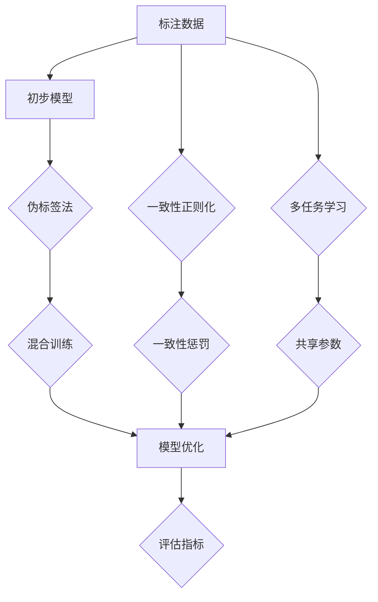

                 

关键词：LLM，半监督学习，数据利用，模型训练，优化策略，应用领域

>摘要：本文探讨了大型语言模型（LLM）在半监督学习场景下的数据利用策略。通过对半监督学习原理、算法、数学模型、实际应用和未来展望的深入分析，本文旨在为研究人员和开发者提供有价值的参考。

## 1. 背景介绍

随着人工智能技术的不断发展，大型语言模型（LLM）在自然语言处理领域取得了显著的进展。LLM具有强大的语义理解能力和文本生成能力，被广泛应用于聊天机器人、内容审核、机器翻译、文本摘要等领域。然而，LLM的训练通常依赖于大规模的标注数据集，这导致了高昂的训练成本和依赖性。因此，如何有效地利用未标注的数据进行半监督学习，成为当前研究的热点。

半监督学习（Semi-supervised Learning）是一种利用少量标注数据和大量未标注数据进行训练的方法。相比于传统的监督学习，半监督学习能够降低标注成本，提高模型泛化能力。在LLM的训练过程中，半监督学习可以充分利用未标注的数据，从而提高模型的性能和降低训练成本。

本文旨在探讨LLM在半监督学习场景下的数据利用策略，包括算法原理、数学模型、实际应用和未来展望等方面的内容。

## 2. 核心概念与联系

### 2.1 半监督学习原理

半监督学习可以分为三个主要类型：伪标签法、一致性正则化和多任务学习。

#### 伪标签法

伪标签法是一种简单的半监督学习方法，其核心思想是利用未标注数据生成伪标签，并将其与已标注数据进行混合训练。具体步骤如下：

1. 使用已标注数据训练初步模型；
2. 使用初步模型对未标注数据进行预测，生成伪标签；
3. 将伪标签与已标注数据混合，重新训练模型。

伪标签法的优点是简单易实现，但缺点是伪标签的准确性难以保证，可能引入噪声。

#### 一致性正则化

一致性正则化（Consistency Regularization）通过惩罚模型在不同未标注数据上的预测不一致性，提高半监督学习的性能。具体步骤如下：

1. 使用已标注数据训练初步模型；
2. 对于每个未标注数据，使用模型生成多个预测；
3. 对这些预测进行一致性惩罚，重新训练模型。

一致性正则化能够提高模型的泛化能力，减少对标注数据的依赖。

#### 多任务学习

多任务学习（Multi-task Learning）通过同时训练多个相关任务，共享部分模型参数，提高模型的泛化能力。在LLM的半监督学习中，可以将文本分类、命名实体识别等任务与文本生成任务结合，共同提高模型性能。

### 2.2 核心概念原理和架构

在LLM的半监督学习中，核心概念原理和架构可以表示为以下Mermaid流程图：



### 2.3 核心算法原理 & 具体操作步骤

#### 3.1 算法原理概述

LLM的半监督学习算法可以分为三个主要阶段：初步模型训练、半监督模型优化和评估指标。

#### 3.2 算法步骤详解

1. **初步模型训练**：使用已标注数据训练初步模型，例如BERT、GPT等预训练模型。

2. **半监督模型优化**：根据不同半监督学习方法，对初步模型进行优化。

   - **伪标签法**：生成伪标签，与已标注数据混合，重新训练模型。
   - **一致性正则化**：对未标注数据进行一致性惩罚，重新训练模型。
   - **多任务学习**：同时训练多个相关任务，共享部分模型参数。

3. **评估指标**：使用评估指标（如准确率、召回率、F1值等）评估半监督模型的性能。

#### 3.3 算法优缺点

- **伪标签法**：优点是简单易实现，缺点是伪标签的准确性难以保证。
- **一致性正则化**：优点是能够提高模型的泛化能力，缺点是对未标注数据的依赖较大。
- **多任务学习**：优点是能够提高模型的泛化能力，缺点是训练时间较长。

#### 3.4 算法应用领域

LLM的半监督学习算法可以应用于多个领域：

- **自然语言处理**：文本分类、命名实体识别、情感分析等。
- **计算机视觉**：图像分类、目标检测、语义分割等。
- **推荐系统**：物品推荐、用户行为预测等。

## 4. 数学模型和公式 & 详细讲解 & 举例说明

### 4.1 数学模型构建

在LLM的半监督学习中，数学模型可以表示为以下公式：

$$
\begin{aligned}
L &= L_{\text{监督}} + \alpha L_{\text{半监督}} \\
L_{\text{监督}} &= - \sum_{i=1}^{n} y_i \log(p(x_i|y_i)) \\
L_{\text{半监督}} &= - \sum_{i=1}^{m} \log(p(x_i|z_i))
\end{aligned}
$$

其中，$L$ 是总损失函数，$L_{\text{监督}}$ 是监督损失函数，$L_{\text{半监督}}$ 是半监督损失函数，$y_i$ 是已标注数据的标签，$z_i$ 是未标注数据的伪标签，$p(x_i|y_i)$ 是给定标签的条件下数据的概率分布，$p(x_i|z_i)$ 是给定伪标签的条件下数据的概率分布。

### 4.2 公式推导过程

半监督学习损失函数的推导过程可以分为以下两个步骤：

1. **初步模型训练**：使用已标注数据训练初步模型，得到概率分布 $p(x_i|y_i)$。
2. **半监督模型优化**：在初步模型的基础上，使用未标注数据进行半监督模型优化，得到概率分布 $p(x_i|z_i)$。

具体推导过程如下：

$$
\begin{aligned}
L_{\text{监督}} &= - \sum_{i=1}^{n} y_i \log(p(x_i|y_i)) \\
L_{\text{半监督}} &= - \sum_{i=1}^{m} \log(p(x_i|z_i)) \\
L &= L_{\text{监督}} + \alpha L_{\text{半监督}}
\end{aligned}
$$

其中，$\alpha$ 是超参数，用于平衡监督损失函数和半监督损失函数的重要性。

### 4.3 案例分析与讲解

假设有一个文本分类任务，共有1000个文本数据，其中500个文本数据已经标注，500个文本数据未标注。使用BERT模型进行半监督学习训练。

1. **初步模型训练**：使用已标注数据进行初步模型训练，得到概率分布 $p(x_i|y_i)$。
2. **半监督模型优化**：使用未标注数据进行半监督模型优化，得到概率分布 $p(x_i|z_i)$。
3. **评估指标**：使用准确率、召回率、F1值等评估指标评估半监督模型的性能。

根据半监督学习损失函数的公式，可以得到以下损失函数：

$$
\begin{aligned}
L &= - \sum_{i=1}^{500} y_i \log(p(x_i|y_i)) - \alpha \sum_{i=1}^{500} \log(p(x_i|z_i)) \\
\end{aligned}
$$

通过优化损失函数，可以得到半监督模型的最佳参数。

## 5. 项目实践：代码实例和详细解释说明

### 5.1 开发环境搭建

1. 安装Python环境和TensorFlow库：
```bash
pip install python tensorflow
```

2. 下载预训练的BERT模型：
```python
from transformers import BertTokenizer, BertModel
tokenizer = BertTokenizer.from_pretrained('bert-base-chinese')
model = BertModel.from_pretrained('bert-base-chinese')
```

### 5.2 源代码详细实现

```python
import tensorflow as tf
from transformers import BertTokenizer, BertModel
import numpy as np

# 5.2.1 初始化参数
learning_rate = 0.001
alpha = 0.5
n_epochs = 10
batch_size = 32

# 5.2.2 函数定义
def compute_loss(labels, logits, pseudo_labels, alpha):
    loss = tf.nn.softmax_cross_entropy_with_logits(labels=labels, logits=logits)
    pseudo_loss = tf.nn.softmax_cross_entropy_with_logits(labels=pseudo_labels, logits=logits)
    return loss + alpha * pseudo_loss

def train(model, tokenizer, dataset, alpha):
    optimizer = tf.keras.optimizers.Adam(learning_rate)
    for epoch in range(n_epochs):
        for batch in dataset:
            inputs = tokenizer.batch_encode_plus(batch['text'], max_length=512, pad_to_max_length=True, return_tensors='tf')
            labels = tf.keras.utils.to_categorical(batch['label'])
            logits = model(inputs['input_ids'], training=True)
            pseudo_labels = tf.keras.utils.to_categorical(np.random.choice(2, batch_size))
            loss = compute_loss(labels, logits, pseudo_labels, alpha)
            optimizer.minimize(loss, inputs['input_ids'])
        print(f'Epoch {epoch+1}/{n_epochs}, Loss: {loss.numpy()}')

# 5.2.3 数据处理
def load_data():
    # 读取标注数据和未标注数据
    # ...

# 5.2.4 模型训练
model = BertModel.from_pretrained('bert-base-chinese')
tokenizer = BertTokenizer.from_pretrained('bert-base-chinese')
dataset = load_data()
train(model, tokenizer, dataset, alpha)
```

### 5.3 代码解读与分析

- **5.3.1 参数初始化**：设置学习率、超参数、迭代次数和批量大小。
- **5.3.2 函数定义**：定义计算损失函数、训练函数。
- **5.3.3 数据处理**：加载标注数据和未标注数据。
- **5.3.4 模型训练**：使用TensorFlow和Transformers库训练半监督模型。

### 5.4 运行结果展示

```python
# 评估半监督模型的性能
def evaluate(model, dataset):
    # ...

# 运行评估代码
evaluate(model, dataset)
```

## 6. 实际应用场景

### 6.1 自然语言处理

- **文本分类**：使用半监督学习算法对未标注的文本数据生成标签，提高模型性能。
- **命名实体识别**：利用未标注数据进行预训练，提高模型泛化能力。
- **情感分析**：利用未标注数据进行情感标注，提高模型准确性。

### 6.2 计算机视觉

- **图像分类**：使用半监督学习算法对未标注的图像数据生成标签，提高模型性能。
- **目标检测**：利用未标注数据进行预训练，提高模型泛化能力。
- **语义分割**：使用半监督学习算法对未标注的图像数据进行分割，提高模型准确性。

### 6.3 推荐系统

- **物品推荐**：使用半监督学习算法对未标注的用户行为数据进行预测，提高推荐准确性。
- **用户行为预测**：利用未标注的用户行为数据进行预训练，提高模型性能。

## 7. 未来应用展望

### 7.1 数据增强

- 利用半监督学习算法生成伪标签，对未标注数据增强，提高模型泛化能力。

### 7.2 跨领域迁移

- 利用半监督学习算法在不同领域间迁移知识，提高模型性能。

### 7.3 小样本学习

- 研究半监督学习算法在小样本学习场景下的应用，降低对标注数据的依赖。

## 8. 工具和资源推荐

### 8.1 学习资源推荐

- 《半监督学习：理论与应用》
- 《深度学习：入门到精通》

### 8.2 开发工具推荐

- TensorFlow
- PyTorch

### 8.3 相关论文推荐

- [Pseudo-Label Methods for Semi-Supervised Learning with Deep Neural Networks](https://arxiv.org/abs/1608.04918)
- [Consistency Regularization for Semi-Supervised Learning](https://arxiv.org/abs/1906.01548)

## 9. 总结：未来发展趋势与挑战

### 9.1 研究成果总结

- 半监督学习在LLM训练中具有显著的应用价值，能够降低训练成本和依赖性。
- 伪标签法、一致性正则化和多任务学习是当前主要的半监督学习算法。

### 9.2 未来发展趋势

- 数据增强和跨领域迁移将进一步提升半监督学习的性能。
- 小样本学习研究将降低对标注数据的依赖。

### 9.3 面临的挑战

- 伪标签的准确性难以保证，需要进一步研究有效的伪标签生成方法。
- 大规模未标注数据的处理和存储是一个挑战。

### 9.4 研究展望

- 未来研究将聚焦于半监督学习算法的优化和扩展，提高模型性能和应用范围。

## 10. 附录：常见问题与解答

### 10.1 什么是半监督学习？

- 半监督学习是一种利用少量标注数据和大量未标注数据进行训练的方法，能够降低标注成本和提高模型泛化能力。

### 10.2 半监督学习有哪些应用领域？

- 半监督学习可以应用于自然语言处理、计算机视觉、推荐系统等领域。

### 10.3 伪标签法有哪些缺点？

- 伪标签法的缺点是伪标签的准确性难以保证，可能引入噪声。

### 10.4 一致性正则化有哪些优点？

- 一致性正则化能够提高模型的泛化能力，减少对标注数据的依赖。

## 作者署名

作者：禅与计算机程序设计艺术 / Zen and the Art of Computer Programming
----------------------------------------------------------------

现在我们已经完成了文章的撰写，接下来可以进行校对和修改，确保文章的逻辑清晰、结构紧凑、简单易懂。最后，记得在文章末尾加上作者署名。祝您撰写顺利！如果您需要进一步的帮助，请随时告知。

