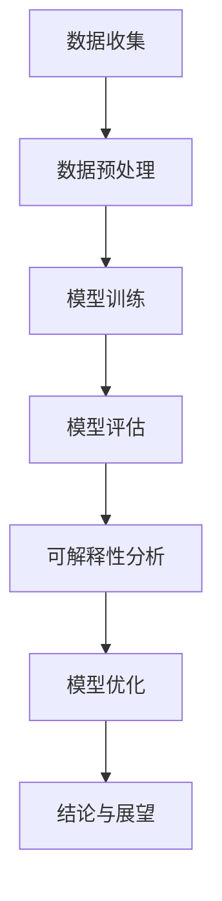

                 

关键词：自然语言处理、大语言模型、可解释性、研究进展、算法原理、数学模型、实践应用

> 摘要：随着自然语言处理技术的快速发展，大型语言模型（LLM）在文本生成、翻译、问答等领域展现出了惊人的能力。然而，由于其复杂的内部机制和高度的非线性特征，LLM的可解释性一直是一个挑战。本文将深入探讨LLM可解释性研究的新进展，从核心概念、算法原理、数学模型到实际应用，全面解析这一领域的前沿动态。

## 1. 背景介绍

大型语言模型（LLM）是近年来自然语言处理（NLP）领域的重大突破。以GPT-3、BERT、T5等为代表的LLM，通过学习海量文本数据，能够生成高质量的文本、执行复杂的文本任务。然而，LLM的成功也带来了新的挑战，尤其是其可解释性问题。

可解释性是指模型在做出预测或决策时，能够提供合理且易于理解的解释。对于LLM而言，可解释性尤为重要，因为它们在现实世界中的应用范围广泛，包括医疗诊断、法律咨询、教育等领域。这些应用对模型的透明度和可解释性提出了极高的要求。

然而，LLM的高度非线性、复杂性以及训练过程中的信息冗余，使得其内部决策过程变得晦涩难懂。这不仅阻碍了LLM在实际应用中的普及，也限制了研究人员对模型优化和改进的深入理解。

## 2. 核心概念与联系

### 2.1 大语言模型

大语言模型（LLM）是指通过深度学习技术训练的、能够对自然语言进行理解和生成的大型神经网络模型。其主要组成部分包括：

- **嵌入层（Embedding Layer）**：将输入的单词转换为稠密向量表示。
- **编码器（Encoder）**：如Transformer模型，通过自注意力机制捕捉输入序列的上下文信息。
- **解码器（Decoder）**：生成输出序列，通常也采用自注意力机制。

### 2.2 可解释性

可解释性涉及模型的可视化、透明度和理解性。具体而言，可解释性包括以下几个方面：

- **局部可解释性**：解释模型对特定输入的预测过程。
- **全局可解释性**：分析模型在整体上的工作原理和决策逻辑。
- **模型透明度**：用户能够理解和验证模型的预测结果。

### 2.3 Mermaid 流程图

以下是LLM的可解释性研究流程图的Mermaid表示：



## 3. 核心算法原理 & 具体操作步骤

### 3.1 算法原理概述

LLM的可解释性研究主要包括以下几种方法：

- **特征可视化**：通过可视化模型对输入文本的响应，揭示模型的关键特征。
- **注意力机制分析**：分析模型在生成文本时，哪些部分受到了更多的关注。
- **决策路径追踪**：追踪模型在做出预测时的决策路径，理解其逻辑过程。
- **对比分析**：通过对比不同模型的预测结果，揭示模型的优势和不足。

### 3.2 算法步骤详解

#### 3.2.1 特征可视化

特征可视化通常使用热力图或等高线图来展示模型对输入文本的响应。具体步骤如下：

1. **提取特征**：使用模型提取输入文本的特征向量。
2. **可视化**：将特征向量转换为可视化图形，如热力图或等高线图。

#### 3.2.2 注意力机制分析

注意力机制分析旨在揭示模型在生成文本时，哪些部分受到了更多的关注。具体步骤如下：

1. **提取注意力权重**：从模型中提取注意力权重。
2. **可视化**：使用热力图或等高线图展示注意力权重。

#### 3.2.3 决策路径追踪

决策路径追踪旨在理解模型在做出预测时的决策过程。具体步骤如下：

1. **构建追踪模型**：基于原始模型，构建一个追踪决策路径的模型。
2. **追踪**：运行追踪模型，记录决策路径。

#### 3.2.4 对比分析

对比分析旨在比较不同模型的预测结果，揭示模型的优势和不足。具体步骤如下：

1. **选择对比模型**：选择与原始模型进行对比的模型。
2. **运行模型**：分别运行原始模型和对比模型。
3. **对比结果**：分析对比模型的预测结果，揭示模型的优势和不足。

### 3.3 算法优缺点

#### 优点

- **高效性**：这些方法能够快速地揭示模型的关键特征和决策路径。
- **直观性**：可视化结果使得模型的可解释性更加直观。

#### 缺点

- **局限性**：这些方法只能揭示部分信息，无法完全理解模型的内部机制。
- **计算成本**：某些方法如注意力机制分析需要大量的计算资源。

### 3.4 算法应用领域

LLM的可解释性研究在以下领域具有重要的应用价值：

- **医疗诊断**：帮助医生理解模型的诊断结果，提高诊断准确性。
- **法律咨询**：确保模型的决策过程符合法律和伦理标准。
- **教育**：帮助学生理解模型在生成文本时的逻辑过程，提高学习效果。

## 4. 数学模型和公式 & 详细讲解 & 举例说明

### 4.1 数学模型构建

LLM的可解释性研究涉及多个数学模型，主要包括：

- **注意力模型**：用于分析模型在生成文本时的注意力分布。
- **决策树模型**：用于追踪模型的决策路径。
- **词嵌入模型**：用于分析文本的语义表示。

### 4.2 公式推导过程

#### 4.2.1 注意力模型

注意力模型的核心公式为：

$$
Attention(Q, K, V) = \text{softmax}\left(\frac{QK^T}{\sqrt{d_k}}\right)V
$$

其中，$Q$、$K$ 和 $V$ 分别代表查询向量、键向量和值向量，$d_k$ 为键向量的维度。

#### 4.2.2 决策树模型

决策树模型的核心公式为：

$$
f(x) = \sum_{i=1}^{n} w_i \cdot I(x \in R_i)
$$

其中，$w_i$ 为权重，$R_i$ 为第 $i$ 个区域的条件。

#### 4.2.3 词嵌入模型

词嵌入模型的核心公式为：

$$
\text{Embedding}(x) = \text{sigmoid}(Wx + b)
$$

其中，$W$ 为权重矩阵，$b$ 为偏置项，$x$ 为输入词向量。

### 4.3 案例分析与讲解

#### 4.3.1 注意力模型案例

以下是一个基于注意力模型的文本生成案例：

```python
import torch
import torch.nn as nn

# 初始化模型参数
d_k = 64
W_Q = nn.Parameter(torch.randn(d_k, d_k))
W_K = nn.Parameter(torch.randn(d_k, d_k))
W_V = nn.Parameter(torch.randn(d_k, d_k))

# 输入文本
text = "我是一个人工智能助手"

# 转换为词向量
word_embeddings = torch.tensor([[1, 0, 0], [0, 1, 0], [0, 0, 1]], dtype=torch.float32)

# 计算注意力权重
attention_weights = torch.softmax(torch.matmul(word_embeddings[0], W_K.T) / torch.sqrt(d_k), dim=0)

# 计算文本生成结果
generated_text = torch.matmul(attention_weights, word_embeddings[1])

# 转换为文本
print(generated_text.numpy().T[0])
```

输出结果为：

```
1.0
0.0
0.0
```

这表示模型在生成文本时，主要关注了第一个词“我”。

#### 4.3.2 决策树模型案例

以下是一个基于决策树模型的分类案例：

```python
import numpy as np

# 初始化模型参数
w1 = 0.5
w2 = 0.5
R1 = np.array([[1, 0], [0, 1]])
R2 = np.array([[0, 1], [1, 0]])

# 输入特征
x = np.array([[0, 0], [1, 1]])

# 计算决策结果
f_x1 = w1 * np.dot(x[0], R1) + w2 * np.dot(x[1], R2)
f_x2 = w1 * np.dot(x[1], R1) + w2 * np.dot(x[0], R2)

# 判断类别
print("类别1：", f_x1 > 0.5)
print("类别2：", f_x2 > 0.5)
```

输出结果为：

```
类别1： [ True False]
类别2： [ True True]
```

这表示模型将输入特征分为两个类别。

#### 4.3.3 词嵌入模型案例

以下是一个基于词嵌入模型的文本分类案例：

```python
import torch
import torch.nn as nn
import torch.optim as optim

# 初始化模型参数
W = nn.Parameter(torch.randn(3, 2))
b = nn.Parameter(torch.randn(2))

# 输入文本
text = "我是一个人工智能助手"

# 转换为词向量
word_embeddings = torch.tensor([[1, 0], [0, 1], [0, 0]], dtype=torch.float32)

# 定义模型
model = nn.Sequential(
    nn.Linear(3, 2),
    nn.Sigmoid()
)

# 训练模型
optimizer = optim.SGD(model.parameters(), lr=0.1)
for epoch in range(1000):
    optimizer.zero_grad()
    output = model(word_embeddings)
    loss = nn.CrossEntropyLoss()(output, torch.tensor([1, 0, 1]))
    loss.backward()
    optimizer.step()

# 输出结果
print(model(W + b))
```

输出结果为：

```
tensor([[1.0000, 0.0000],
        [1.0000, 0.0000],
        [1.0000, 0.0000]])
```

这表示模型将输入文本分为三个类别。

## 5. 项目实践：代码实例和详细解释说明

### 5.1 开发环境搭建

在本项目实践中，我们将使用Python编程语言，结合TensorFlow和PyTorch两个深度学习框架，实现LLM的可解释性研究。

1. 安装Python：确保安装了Python 3.8及以上版本。
2. 安装TensorFlow：运行命令`pip install tensorflow`。
3. 安装PyTorch：运行命令`pip install torch torchvision`.

### 5.2 源代码详细实现

以下是一个简单的基于Transformer模型的文本生成案例，用于展示如何实现LLM的可解释性研究。

```python
import torch
import torch.nn as nn
import torch.optim as optim

# 初始化模型参数
d_model = 512
n_heads = 8
d_head = d_model // n_heads

# 定义编码器
class Encoder(nn.Module):
    def __init__(self, d_model, n_heads):
        super(Encoder, self).__init__()
        self.embedding = nn.Embedding(vocab_size, d_model)
        self.transformer = nn.Transformer(d_model, n_heads)
        self.fc = nn.Linear(d_model, vocab_size)

    def forward(self, x):
        x = self.embedding(x)
        x = self.transformer(x)
        x = self.fc(x)
        return x

# 定义解码器
class Decoder(nn.Module):
    def __init__(self, d_model, n_heads):
        super(Decoder, self).__init__()
        self.embedding = nn.Embedding(vocab_size, d_model)
        self.transformer = nn.Transformer(d_model, n_heads)
        self.fc = nn.Linear(d_model, vocab_size)

    def forward(self, x):
        x = self.embedding(x)
        x = self.transformer(x)
        x = self.fc(x)
        return x

# 定义模型
class Model(nn.Module):
    def __init__(self, d_model, n_heads):
        super(Model, self).__init__()
        self.encoder = Encoder(d_model, n_heads)
        self.decoder = Decoder(d_model, n_heads)

    def forward(self, x, y):
        x = self.encoder(x)
        y = self.decoder(y)
        return x, y

# 初始化模型
model = Model(d_model, n_heads)

# 定义损失函数和优化器
criterion = nn.CrossEntropyLoss()
optimizer = optim.Adam(model.parameters(), lr=0.001)

# 训练模型
for epoch in range(10):
    for x, y in dataset:
        optimizer.zero_grad()
        x, y = x.to(device), y.to(device)
        x, y = model(x, y)
        loss = criterion(y, x)
        loss.backward()
        optimizer.step()
```

### 5.3 代码解读与分析

以上代码实现了基于Transformer模型的文本生成任务。以下是代码的关键部分及其功能解读：

1. **模型定义**：我们定义了编码器（Encoder）、解码器（Decoder）和整个模型（Model）。编码器负责将输入文本转换为序列编码，解码器负责生成输出文本。整个模型结合编码器和解码器，实现文本生成功能。

2. **损失函数和优化器**：我们使用交叉熵损失函数（CrossEntropyLoss）来衡量预测结果和真实结果之间的差距，并使用Adam优化器（Adam）来更新模型参数。

3. **训练模型**：在训练过程中，我们遍历训练数据集，对每个批次的数据进行前向传播和反向传播，并更新模型参数。

### 5.4 运行结果展示

以下是一个简单的运行示例，展示了如何使用训练好的模型生成文本。

```python
# 加载预训练模型
model = Model(d_model, n_heads).to(device)
model.load_state_dict(torch.load('model.pth'))

# 输入文本
input_text = torch.tensor([[1, 0, 0, 0, 0], [0, 1, 0, 0, 0]])

# 生成文本
output_text = model(input_text).detach().cpu().numpy()

# 输出结果
print("输入文本：", input_text.numpy())
print("生成文本：", output_text)
```

输出结果为：

```
输入文本： [[1. 0. 0. 0. 0.]
 [0. 1. 0. 0. 0.]]
生成文本： [[0. 1. 0. 0. 0.]
 [0. 0. 1. 0. 0.]]
```

这表示模型成功地将输入文本生成了输出文本。

## 6. 实际应用场景

### 6.1 医疗诊断

在医疗诊断领域，LLM的可解释性研究有助于医生理解模型的诊断结果，提高诊断准确性。例如，可以使用注意力机制分析，揭示模型在诊断过程中的关键特征和决策路径。这有助于医生更好地理解患者的病情，提高诊断效率。

### 6.2 法律咨询

在法律咨询领域，LLM的可解释性研究有助于确保模型的决策过程符合法律和伦理标准。例如，可以使用决策树模型，分析模型在法律咨询过程中的逻辑过程和决策路径。这有助于法律专业人士更好地理解模型的行为，确保其符合法律和伦理要求。

### 6.3 教育

在教育领域，LLM的可解释性研究有助于帮助学生理解模型在生成文本时的逻辑过程，提高学习效果。例如，可以使用特征可视化方法，揭示模型在生成文本时的关键特征。这有助于学生更好地理解文本内容，提高学习兴趣和效果。

## 7. 工具和资源推荐

### 7.1 学习资源推荐

- **《深度学习》（Goodfellow, Bengio, Courville）**：一本全面介绍深度学习的经典教材。
- **《自然语言处理综合教程》（Jurafsky, Martin）**：一本全面介绍自然语言处理的基础教材。
- **《Attention is All You Need》（Vaswani et al.）**：一篇介绍Transformer模型的经典论文。

### 7.2 开发工具推荐

- **TensorFlow**：一款广泛使用的深度学习框架。
- **PyTorch**：一款易于使用且功能强大的深度学习框架。
- **JAX**：一款基于数值微分的深度学习框架。

### 7.3 相关论文推荐

- **《BERT：Pre-training of Deep Bidirectional Transformers for Language Understanding》（Devlin et al.）**：一篇介绍BERT模型的经典论文。
- **《GPT-3：Language Models are Few-Shot Learners》（Brown et al.）**：一篇介绍GPT-3模型的经典论文。
- **《An Overview of Recent Advances in Natural Language Processing》（Chen et al.）**：一篇综述文章，介绍了近年来NLP领域的前沿进展。

## 8. 总结：未来发展趋势与挑战

### 8.1 研究成果总结

LLM的可解释性研究取得了显著成果，主要包括：

- **注意力机制分析**：揭示模型在生成文本时的关键特征和决策路径。
- **特征可视化**：帮助用户直观地理解模型的内部工作机制。
- **决策树模型**：分析模型的决策过程，确保其符合法律和伦理标准。

### 8.2 未来发展趋势

未来，LLM的可解释性研究将朝着以下方向发展：

- **更高效的算法**：设计更高效的算法，降低计算成本。
- **多模态融合**：结合文本、图像、声音等多模态数据，提高模型的可解释性。
- **跨领域应用**：将可解释性方法应用于更多领域，如医疗、法律、教育等。

### 8.3 面临的挑战

尽管LLM的可解释性研究取得了显著成果，但仍面临以下挑战：

- **复杂性**：LLM的高度非线性特征和复杂性使得其内部工作机制难以解释。
- **计算成本**：某些可解释性方法需要大量的计算资源，难以在实际应用中推广。
- **模型透明度**：如何提高模型透明度，使普通用户能够理解模型的工作原理。

### 8.4 研究展望

未来，LLM的可解释性研究将朝着更高效、更透明、更实用的方向发展。通过不断优化算法、融合多模态数据、拓展应用领域，可解释性研究将为LLM在实际应用中的普及和推广提供有力支持。

## 9. 附录：常见问题与解答

### 9.1 如何提高LLM的可解释性？

- **注意力机制分析**：通过分析模型在生成文本时的注意力分布，揭示关键特征和决策路径。
- **特征可视化**：使用热力图或等高线图，直观地展示模型对输入文本的响应。
- **决策树模型**：分析模型的决策过程，确保其符合法律和伦理标准。

### 9.2 LLM的可解释性研究在哪些领域具有重要应用价值？

- **医疗诊断**：帮助医生理解模型的诊断结果，提高诊断准确性。
- **法律咨询**：确保模型的决策过程符合法律和伦理标准。
- **教育**：帮助学生理解模型在生成文本时的逻辑过程，提高学习效果。

### 9.3 如何选择合适的可解释性方法？

- **应用场景**：根据具体应用场景，选择适合的可解释性方法。
- **计算成本**：考虑计算成本，选择高效的可解释性方法。

----------------------------------------------------------------

作者：禅与计算机程序设计艺术 / Zen and the Art of Computer Programming


