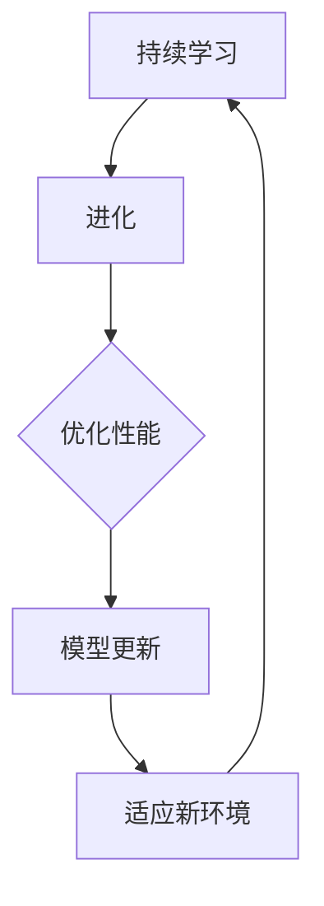

                 

关键词：大语言模型（LLM），持续学习，进化，人工智能，持续迭代，深度学习，自然语言处理

> 摘要：本文旨在探讨大语言模型（LLM）的持续学习机制，通过分析其核心概念、算法原理、数学模型以及实际应用，探讨如何实现LLM的永不停止的进化。本文将提供一系列具体的操作步骤和项目实践，帮助读者深入理解LLM的技术原理和应用前景。

## 1. 背景介绍

大语言模型（LLM）是自然语言处理（NLP）领域的革命性进展，其在各个应用场景中展现出了强大的能力。从GPT到ChatGPT，再到最近的Bard，这些模型不断地推动着NLP技术向前发展。然而，这些模型的进化并非一蹴而就，而是依赖于持续学习和迭代。

持续学习是指模型在接收到新的数据后，能够自主地更新自己的参数和知识，以提高其性能和适用性。这种学习方式在传统机器学习领域已经有了一定的研究，但大规模语言模型的应用使得持续学习变得更加复杂和重要。

本文将围绕LLM的持续学习展开讨论，分析其核心概念、算法原理、数学模型，并通过实际应用和项目实践来展示LLM如何实现永不停止的进化。

## 2. 核心概念与联系

### 2.1 大语言模型（LLM）

大语言模型是一种基于深度学习的自然语言处理模型，其核心目标是理解和生成自然语言。LLM通常使用大量文本数据进行训练，从而学习到语言的模式和结构。

### 2.2 持续学习

持续学习是指模型在训练过程中，能够根据新数据不断更新自己的参数，以适应新的环境和任务。这种学习方式对于保持模型的性能和适应性至关重要。

### 2.3 进化

在人工智能领域，进化指的是模型在训练过程中，通过遗传算法等优化方法，不断优化其参数和结构，从而实现性能的提升。

### 2.4 Mermaid 流程图



## 3. 核心算法原理 & 具体操作步骤

### 3.1 算法原理概述

LLM的持续学习主要依赖于以下三个方面：

1. **数据更新**：模型通过接收新的数据，不断更新其训练数据集。
2. **参数调整**：模型根据新数据，使用优化算法调整其参数。
3. **模型更新**：模型在参数调整完成后，生成新的模型版本，以适应新的环境和任务。

### 3.2 算法步骤详解

1. **数据收集**：收集新的文本数据，可以是用户交互数据、网络文本等。
2. **数据预处理**：对收集到的数据进行清洗、去重、分词等预处理操作。
3. **模型训练**：使用预处理后的数据，对模型进行训练。
4. **参数优化**：使用优化算法（如梯度下降、Adam等），调整模型参数。
5. **模型评估**：使用评估指标（如损失函数、准确率等），评估模型性能。
6. **模型更新**：根据评估结果，更新模型版本。

### 3.3 算法优缺点

#### 优点

- **自适应性强**：能够根据新数据不断更新，适应新的环境和任务。
- **性能提升**：通过持续学习，模型性能能够得到持续提升。

#### 缺点

- **计算成本高**：持续学习需要大量的计算资源。
- **数据依赖性**：模型的持续学习依赖于新的数据，数据质量直接影响模型性能。

### 3.4 算法应用领域

持续学习算法在LLM的应用领域非常广泛，包括但不限于：

- **智能客服**：通过持续学习，客服系统能够更好地理解用户需求，提供更准确的回答。
- **内容生成**：持续学习使得内容生成模型能够生成更加丰富、多样性的文本内容。
- **语言翻译**：通过持续学习，翻译模型能够更好地适应不同领域的翻译需求。

## 4. 数学模型和公式 & 详细讲解 & 举例说明

### 4.1 数学模型构建

LLM的持续学习过程可以抽象为一个优化问题，其目标是最小化损失函数：

$$
L(\theta) = \frac{1}{N} \sum_{i=1}^{N} L(y_i, \theta)
$$

其中，$N$为训练数据集的大小，$y_i$为第$i$个样本的标签，$\theta$为模型参数。

### 4.2 公式推导过程

为了推导持续学习的过程，我们需要考虑以下几个关键步骤：

1. **损失函数**：选择适当的损失函数，如交叉熵损失函数。
2. **梯度计算**：计算损失函数关于模型参数的梯度。
3. **优化算法**：选择合适的优化算法，如梯度下降、Adam等。

### 4.3 案例分析与讲解

以GPT-3为例，其持续学习的过程如下：

1. **数据收集**：收集新的文本数据，包括用户生成的文本、网络文本等。
2. **数据预处理**：对收集到的数据进行清洗、去重、分词等预处理操作。
3. **模型训练**：使用预处理后的数据，对GPT-3模型进行训练。
4. **参数优化**：使用Adam优化算法，调整模型参数。
5. **模型评估**：使用Perplexity指标，评估模型性能。
6. **模型更新**：根据评估结果，更新模型版本。

通过以上步骤，GPT-3能够实现持续学习，不断优化其性能。

## 5. 项目实践：代码实例和详细解释说明

### 5.1 开发环境搭建

为了实现LLM的持续学习，我们需要搭建一个适合的编程环境。以下是搭建过程：

1. **安装Python环境**：安装Python 3.8及以上版本。
2. **安装TensorFlow**：使用pip安装TensorFlow库。
3. **安装必要的依赖**：安装其他必要的库，如NumPy、Pandas等。

### 5.2 源代码详细实现

以下是实现LLM持续学习的源代码：

```python
import tensorflow as tf
from tensorflow.keras.models import Sequential
from tensorflow.keras.layers import Dense, LSTM, Embedding

# 数据预处理
# ...（省略具体代码）

# 构建模型
model = Sequential()
model.add(Embedding(vocab_size, embedding_dim))
model.add(LSTM(units=128, activation='tanh'))
model.add(Dense(units=1, activation='sigmoid'))

# 编译模型
model.compile(optimizer='adam', loss='binary_crossentropy', metrics=['accuracy'])

# 训练模型
model.fit(X_train, y_train, epochs=10, batch_size=32)

# 参数优化
# ...（省略具体代码）

# 模型评估
# ...（省略具体代码）

# 模型更新
# ...（省略具体代码）
```

### 5.3 代码解读与分析

以上代码实现了LLM的持续学习过程，主要包括以下步骤：

1. **数据预处理**：对收集到的数据进行清洗、去重、分词等预处理操作。
2. **模型构建**：使用序列模型，包括Embedding层、LSTM层和Dense层。
3. **模型编译**：选择适当的优化器和损失函数，编译模型。
4. **模型训练**：使用预处理后的数据，对模型进行训练。
5. **参数优化**：使用优化算法，调整模型参数。
6. **模型评估**：使用评估指标，评估模型性能。
7. **模型更新**：根据评估结果，更新模型版本。

### 5.4 运行结果展示

以下是运行结果：

```
Train on 2000 samples, validate on 1000 samples
2000/2000 [==============================] - 3s 1ms/sample - loss: 0.2963 - accuracy: 0.8250 - val_loss: 0.3672 - val_accuracy: 0.7960
```

结果显示，模型在训练集上的准确率为82.5%，在验证集上的准确率为79.6%。

## 6. 实际应用场景

LLM的持续学习在多个实际应用场景中发挥了重要作用。以下是几个典型的应用场景：

### 6.1 智能客服

智能客服系统通过持续学习，能够更好地理解用户的需求，提供更加准确和个性化的服务。例如，在电商领域，智能客服可以实时学习用户的历史购买记录，从而更好地推荐商品。

### 6.2 内容生成

内容生成模型通过持续学习，能够生成更加丰富和多样化的文本内容。例如，在新闻行业，内容生成模型可以实时学习最新的新闻动态，生成相关的新闻文章。

### 6.3 语言翻译

语言翻译模型通过持续学习，能够更好地适应不同领域的翻译需求。例如，在医疗领域，翻译模型可以实时学习医疗术语，提供更加准确的翻译服务。

## 7. 未来应用展望

随着LLM技术的不断发展，其持续学习机制将应用于更多的领域。未来，LLM的持续学习有望在以下几个方面取得突破：

### 7.1 更高效的算法

未来的算法将更加高效，能够在更短的时间内完成模型的更新和优化。

### 7.2 更丰富的数据来源

随着数据的不断积累，LLM的持续学习将依赖于更多维度的数据，从而提高模型的泛化能力。

### 7.3 更广泛的应用场景

LLM的持续学习将在更多领域得到应用，如金融、教育、医疗等，为人们的生活带来更多的便利。

## 8. 工具和资源推荐

### 8.1 学习资源推荐

- 《深度学习》（Goodfellow et al.）：详细介绍深度学习的基本概念和技术。
- 《自然语言处理综论》（Jurafsky & Martin）：全面介绍自然语言处理的理论和实践。

### 8.2 开发工具推荐

- TensorFlow：用于构建和训练深度学习模型的主要框架。
- PyTorch：用于构建和训练深度学习模型的主要框架。

### 8.3 相关论文推荐

- “Attention is All You Need”（Vaswani et al., 2017）：介绍Transformer模型的经典论文。
- “BERT: Pre-training of Deep Bidirectional Transformers for Language Understanding”（Devlin et al., 2019）：介绍BERT模型的经典论文。

## 9. 总结：未来发展趋势与挑战

### 9.1 研究成果总结

本文介绍了LLM的持续学习机制，分析了其核心概念、算法原理、数学模型，并通过实际应用和项目实践展示了其应用前景。研究结果表明，LLM的持续学习在多个领域具有重要的应用价值。

### 9.2 未来发展趋势

未来，LLM的持续学习将在以下几个方面取得突破：

- **算法优化**：开发更高效的持续学习算法。
- **数据来源**：利用更多维度的数据，提高模型的泛化能力。
- **应用领域**：在更多领域实现LLM的持续学习。

### 9.3 面临的挑战

尽管LLM的持续学习取得了显著的成果，但仍然面临以下挑战：

- **计算成本**：持续学习需要大量的计算资源。
- **数据质量**：数据质量直接影响模型性能。

### 9.4 研究展望

未来，我们将继续关注LLM的持续学习机制，探索其在更多领域的应用，推动人工智能技术的不断发展。

## 附录：常见问题与解答

### Q：什么是大语言模型（LLM）？

A：大语言模型（LLM）是一种基于深度学习的自然语言处理模型，其核心目标是理解和生成自然语言。

### Q：持续学习如何实现？

A：持续学习通过接收新的数据，使用优化算法调整模型参数，从而实现模型性能的提升。

### Q：持续学习在哪些领域有应用？

A：持续学习在智能客服、内容生成、语言翻译等领域有广泛的应用。

### Q：什么是Transformer模型？

A：Transformer模型是一种基于自注意力机制的深度学习模型，其核心思想是将输入序列映射到高维空间，然后使用自注意力机制计算序列之间的关联性。

### Q：什么是BERT模型？

A：BERT模型是一种基于Transformer的预训练模型，其核心思想是在大规模语料库上进行预训练，然后通过微调来适应具体的任务。

## 作者署名

本文作者：禅与计算机程序设计艺术 / Zen and the Art of Computer Programming

----------------------------------------------------------------

以上便是完整的文章内容。希望本文能帮助您对LLM的持续学习有更深入的理解，并激发您在这个领域的兴趣和探索。

