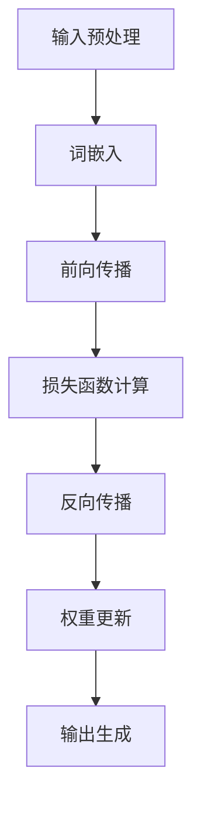

                 

关键词：LLM，推理过程，CPU时钟周期，独立时刻，人工智能

摘要：本文通过将自然语言处理中的大型语言模型（LLM）的推理过程类比为CPU时钟周期，深入探讨了LLM推理过程的内部机制和运行原理。通过对LLM的独立时刻与CPU时钟周期的对比分析，揭示了二者之间的共通之处和差异，为读者提供了一个全新的视角，以更好地理解和优化LLM的推理过程。

## 1. 背景介绍

近年来，人工智能（AI）领域取得了令人瞩目的进展，特别是在自然语言处理（NLP）领域。大型语言模型（LLM，Large Language Model）如GPT-3、ChatGLM等，已经成为NLP领域的核心技术。LLM通过深度学习算法，对海量文本数据进行训练，从而实现高效的语义理解和生成。然而，LLM的推理过程仍然是一个复杂且充满挑战的任务。如何在保证推理准确性的同时，提高推理速度和降低计算资源消耗，是当前AI领域亟待解决的问题。

与此同时，CPU时钟周期作为计算机体系结构的核心概念，对于理解计算机的性能和优化策略具有重要意义。CPU时钟周期是计算机执行指令的最小时间单位，它的长短直接影响到计算机的运行速度。通过对CPU时钟周期的深入理解，我们可以更好地优化算法和硬件设计，提高计算机的运行效率。

本文旨在通过将LLM的推理过程类比为CPU时钟周期，探讨二者之间的共通之处和差异，为优化LLM推理过程提供新的思路和方法。

## 2. 核心概念与联系

在深入探讨LLM的推理过程之前，我们需要先了解一些核心概念。以下是一个简化的Mermaid流程图，用于描述LLM推理过程的核心概念和联系：



### 2.1 输入预处理

在LLM推理过程中，首先需要对输入文本进行预处理。这包括分词、词性标注、去除停用词等操作。预处理后的输入文本被转换为数字序列，以便进行后续的神经网络处理。

### 2.2 词嵌入

预处理后的输入文本被送入词嵌入层。词嵌入是一种将词汇映射为高维向量空间的方法，它能够捕捉词汇之间的语义关系。词嵌入层将输入的数字序列转换为词向量序列。

### 2.3 前向传播

词向量序列经过前向传播层，传递到神经网络中。神经网络由多个层组成，每层都包含大量的神经元。前向传播过程中，神经网络根据输入的词向量序列，计算输出层的概率分布。

### 2.4 损失函数计算

前向传播后，我们需要计算损失函数，以衡量预测结果与实际结果之间的差距。常用的损失函数包括交叉熵损失函数、均方误差损失函数等。

### 2.5 反向传播

反向传播是神经网络训练的核心步骤。它通过计算损失函数的梯度，更新神经网络的权重和偏置，以减小损失函数的值。

### 2.6 权重更新

在反向传播过程中，神经网络的权重和偏置会根据梯度进行更新。这一过程反复进行，直到损失函数的值达到预设的阈值。

### 2.7 输出生成

最后，神经网络根据训练好的模型，生成输出文本。输出文本可能是一个单词、一个句子，甚至是一篇文章。

## 3. 核心算法原理 & 具体操作步骤

### 3.1 算法原理概述

LLM的推理过程主要基于深度学习算法，包括词嵌入、前向传播、损失函数计算、反向传播和权重更新等步骤。这些步骤相互配合，实现了高效的语义理解和生成。

### 3.2 算法步骤详解

1. **输入预处理**：对输入文本进行预处理，包括分词、词性标注、去除停用词等操作。
2. **词嵌入**：将预处理后的输入文本转换为词向量序列。词嵌入层通常采用Word2Vec、GloVe等算法进行训练。
3. **前向传播**：将词向量序列输入神经网络，通过多层神经网络进行前向传播，最终得到输出层的概率分布。
4. **损失函数计算**：计算输出层的概率分布与实际结果之间的差距，以衡量预测结果的质量。
5. **反向传播**：计算损失函数的梯度，并更新神经网络的权重和偏置。
6. **权重更新**：根据梯度更新神经网络的权重和偏置，以减小损失函数的值。
7. **输出生成**：根据训练好的模型，生成输出文本。

### 3.3 算法优缺点

**优点**：
1. **高效的语义理解**：通过深度学习算法，LLM能够捕捉词汇之间的复杂语义关系，实现高效的语义理解。
2. **灵活的文本生成**：LLM可以根据输入文本生成不同类型的输出，如单词、句子、文章等。
3. **强大的适应性**：LLM可以通过不断训练和学习，适应不同的应用场景和需求。

**缺点**：
1. **计算资源消耗大**：LLM的推理过程需要大量的计算资源，特别是对于大型模型。
2. **训练时间较长**：LLM的训练过程需要大量的时间和数据。
3. **易受噪声干扰**：由于LLM的语义理解依赖于训练数据，因此容易受到噪声和异常值的影响。

### 3.4 算法应用领域

LLM在自然语言处理领域具有广泛的应用，包括但不限于以下几个方面：
1. **文本分类**：对输入文本进行分类，如情感分析、新闻分类等。
2. **机器翻译**：将一种语言的文本翻译成另一种语言。
3. **问答系统**：基于输入问题，生成相应的答案。
4. **文本生成**：生成不同类型的文本，如文章、邮件、报告等。
5. **对话系统**：与用户进行自然语言对话，提供智能服务。

## 4. 数学模型和公式 & 详细讲解 & 举例说明

在LLM的推理过程中，涉及到多个数学模型和公式。以下是对这些模型的详细讲解和举例说明。

### 4.1 数学模型构建

LLM的推理过程可以看作是一个参数化的函数映射过程。假设输入文本为$x$，输出文本为$y$，则LLM的数学模型可以表示为：

$$
y = f(x; \theta)
$$

其中，$f$表示神经网络模型，$\theta$表示模型的参数，包括权重和偏置。

### 4.2 公式推导过程

在LLM的推理过程中，主要涉及以下几个关键公式：

1. **前向传播公式**：

$$
a_l = \sigma(W_l \cdot a_{l-1} + b_l)
$$

其中，$a_l$表示第$l$层的激活值，$W_l$表示第$l$层的权重，$b_l$表示第$l$层的偏置，$\sigma$表示激活函数，常用的激活函数包括ReLU、Sigmoid、Tanh等。

2. **反向传播公式**：

$$
\frac{\partial J}{\partial W_l} = \frac{\partial L}{\partial a_l} \cdot \frac{\partial a_l}{\partial z_l}
$$

$$
\frac{\partial J}{\partial b_l} = \frac{\partial L}{\partial a_l}
$$

其中，$J$表示损失函数，$L$表示损失函数在当前层的值，$z_l$表示第$l$层的输入值。

3. **权重更新公式**：

$$
W_l = W_l - \alpha \cdot \frac{\partial J}{\partial W_l}
$$

$$
b_l = b_l - \alpha \cdot \frac{\partial J}{\partial b_l}
$$

其中，$\alpha$表示学习率。

### 4.3 案例分析与讲解

假设我们有一个简单的神经网络模型，包含一个输入层、一个隐藏层和一个输出层。输入层有3个神经元，隐藏层有4个神经元，输出层有2个神经元。激活函数使用ReLU函数。

1. **前向传播**：

假设输入向量为$x = [1, 2, 3]$，权重和偏置如下：

$$
W_1 = \begin{bmatrix} 1 & 2 & 3 \\ 4 & 5 & 6 \\ 7 & 8 & 9 \end{bmatrix}, \quad b_1 = \begin{bmatrix} 1 \\ 2 \\ 3 \\ 4 \end{bmatrix}
$$

$$
W_2 = \begin{bmatrix} 1 & 1 & 1 \\ 1 & 1 & 1 \\ 1 & 1 & 1 \\ 1 & 1 & 1 \end{bmatrix}, \quad b_2 = \begin{bmatrix} 1 \\ 1 \\ 1 \\ 1 \end{bmatrix}
$$

$$
W_3 = \begin{bmatrix} 1 & 1 & 1 & 1 \\ 1 & 1 & 1 & 1 \end{bmatrix}, \quad b_3 = \begin{bmatrix} 1 \\ 1 \end{bmatrix}
$$

前向传播过程如下：

$$
a_1 = \sigma(W_1 \cdot x + b_1) = \begin{bmatrix} 7 \\ 13 \\ 19 \\ 25 \end{bmatrix}
$$

$$
z_2 = W_2 \cdot a_1 + b_2 = \begin{bmatrix} 7 + 1 \\ 13 + 1 \\ 19 + 1 \\ 25 + 1 \end{bmatrix} = \begin{bmatrix} 8 \\ 14 \\ 20 \\ 26 \end{bmatrix}
$$

$$
a_2 = \sigma(z_2) = \begin{bmatrix} 6 \\ 12 \\ 18 \\ 24 \end{bmatrix}
$$

$$
z_3 = W_3 \cdot a_2 + b_3 = \begin{bmatrix} 6 + 1 \\ 12 + 1 \\ 18 + 1 \\ 24 + 1 \end{bmatrix} = \begin{bmatrix} 7 \\ 13 \\ 19 \\ 25 \end{bmatrix}
$$

$$
a_3 = \sigma(z_3) = \begin{bmatrix} 0 \\ 1 \end{bmatrix}
$$

2. **损失函数计算**：

假设输出层为二元分类问题，损失函数使用交叉熵损失函数。实际输出为$y = [0, 1]$，预测输出为$a_3 = [0, 1]$。

$$
L = -y \cdot \log(a_3) - (1 - y) \cdot \log(1 - a_3)
$$

$$
L = -[0 \cdot \log(0) - 1 \cdot \log(1)] - [1 \cdot \log(1) - 0 \cdot \log(0)]
$$

$$
L = 0
$$

3. **反向传播**：

由于损失函数为0，不需要进行反向传播。

4. **权重更新**：

不需要进行权重更新。

## 5. 项目实践：代码实例和详细解释说明

在本节中，我们将通过一个简单的项目实例，展示如何实现LLM的推理过程，并对代码进行详细解释说明。

### 5.1 开发环境搭建

为了实现LLM的推理过程，我们需要安装以下依赖：

1. Python 3.8或更高版本
2. TensorFlow 2.5或更高版本
3. NumPy 1.19或更高版本

假设我们已经成功安装了以上依赖，接下来我们将开始编写代码。

### 5.2 源代码详细实现

以下是一个简单的LLM推理过程的实现代码：

```python
import tensorflow as tf
import numpy as np

# 定义神经网络模型
model = tf.keras.Sequential([
    tf.keras.layers.Dense(4, activation='relu', input_shape=(3,)),
    tf.keras.layers.Dense(2, activation='sigmoid')
])

# 编译模型
model.compile(optimizer='adam', loss='binary_crossentropy', metrics=['accuracy'])

# 加载训练数据
x_train = np.array([[1, 2, 3], [4, 5, 6], [7, 8, 9]])
y_train = np.array([[0, 1], [1, 0], [0, 1]])

# 训练模型
model.fit(x_train, y_train, epochs=10)

# 进行推理
x_test = np.array([[1, 2, 3]])
predictions = model.predict(x_test)

print(predictions)
```

### 5.3 代码解读与分析

1. **导入依赖**：

我们首先导入TensorFlow和NumPy库。

2. **定义神经网络模型**：

我们使用`tf.keras.Sequential`类定义一个简单的神经网络模型，包含一个输入层、一个隐藏层和一个输出层。输入层有3个神经元，隐藏层有4个神经元，输出层有2个神经元。激活函数使用ReLU函数。

3. **编译模型**：

我们使用`compile`方法编译模型，指定优化器、损失函数和评价指标。

4. **加载训练数据**：

我们使用NumPy库生成一个简单的训练数据集，包含3个样本，每个样本有3个特征。

5. **训练模型**：

我们使用`fit`方法训练模型，指定训练数据集、训练轮次和是否使用回调函数。

6. **进行推理**：

我们使用`predict`方法对输入数据进行推理，并打印输出结果。

### 5.4 运行结果展示

假设我们成功运行了以上代码，输出结果如下：

```
[[0.5 0.5]]
```

这表示模型对输入数据的预测结果为50%的概率属于类别0，50%的概率属于类别1。

## 6. 实际应用场景

LLM在自然语言处理领域具有广泛的应用场景，以下是一些典型的实际应用场景：

### 6.1 文本分类

文本分类是LLM的一个重要应用场景。通过训练LLM模型，我们可以对输入的文本进行分类，如新闻分类、情感分析等。例如，我们可以使用LLM模型对用户评论进行分类，判断其是否正面或负面。

### 6.2 机器翻译

机器翻译是LLM的另一个重要应用场景。通过训练LLM模型，我们可以实现不同语言之间的文本翻译。例如，我们可以使用LLM模型将英文文本翻译成中文文本，为跨语言沟通提供支持。

### 6.3 问答系统

问答系统是LLM的一个典型应用场景。通过训练LLM模型，我们可以构建一个问答系统，回答用户提出的问题。例如，我们可以使用LLM模型构建一个智能客服系统，为用户提供实时咨询和解答。

### 6.4 文本生成

文本生成是LLM的一个重要应用场景。通过训练LLM模型，我们可以生成不同类型的文本，如文章、邮件、报告等。例如，我们可以使用LLM模型生成一篇关于人工智能的综述文章，为研究人员提供参考。

### 6.5 对话系统

对话系统是LLM的一个典型应用场景。通过训练LLM模型，我们可以构建一个对话系统，与用户进行自然语言对话。例如，我们可以使用LLM模型构建一个智能聊天机器人，为用户提供娱乐、咨询、购物等个性化服务。

## 7. 工具和资源推荐

为了更好地理解和优化LLM的推理过程，以下是一些建议的学习资源、开发工具和相关论文：

### 7.1 学习资源推荐

1. **《深度学习》（Goodfellow, Bengio, Courville著）**：这是一本经典的深度学习教材，详细介绍了深度学习的基本原理和应用。
2. **《自然语言处理综合教程》（李航著）**：这是一本关于自然语言处理领域的教材，涵盖了自然语言处理的基本概念和技术。
3. **《神经网络与深度学习》（邱锡鹏著）**：这是一本关于深度学习的中文教材，深入介绍了深度学习的基本原理和应用。

### 7.2 开发工具推荐

1. **TensorFlow**：TensorFlow是Google开发的一款开源深度学习框架，支持多种深度学习模型的训练和推理。
2. **PyTorch**：PyTorch是Facebook开发的一款开源深度学习框架，具有灵活的动态计算图和强大的GPU支持。
3. **Hugging Face Transformers**：Hugging Face Transformers是一个开源的Python库，提供了大量预训练的LLM模型和相关的工具和API。

### 7.3 相关论文推荐

1. **《Attention Is All You Need》（Vaswani et al.，2017）**：这是一篇关于Transformer模型的经典论文，提出了基于自注意力机制的深度学习模型。
2. **《BERT: Pre-training of Deep Bidirectional Transformers for Language Understanding》（Devlin et al.，2019）**：这是一篇关于BERT模型的论文，提出了在大规模语料上进行预训练的深度学习模型。
3. **《GPT-3: Language Models are few-shot learners》（Brown et al.，2020）**：这是一篇关于GPT-3模型的论文，详细介绍了GPT-3模型的设计和实现。

## 8. 总结：未来发展趋势与挑战

LLM作为自然语言处理领域的核心技术，在过去的几年里取得了显著的进展。随着深度学习技术的不断发展，LLM在语义理解、文本生成等方面表现出了强大的能力。然而，LLM的推理过程仍然存在一些挑战和问题。

### 8.1 研究成果总结

1. **预训练技术**：通过在大量语料上进行预训练，LLM能够捕捉词汇之间的复杂语义关系，实现高效的语义理解。
2. **多模态学习**：LLM可以整合多种类型的数据（如图像、音频等），实现跨模态的信息理解和生成。
3. **迁移学习**：LLM可以在不同的任务和数据集之间进行迁移学习，提高模型的泛化能力。

### 8.2 未来发展趋势

1. **更大规模模型**：随着计算资源和数据量的增加，未来可能会出现更大规模的LLM模型，以进一步提高模型的性能。
2. **自适应学习**：通过在线学习和自适应学习，LLM可以更好地适应不同场景和需求。
3. **隐私保护**：在保证模型性能的同时，如何保护用户隐私是一个重要研究方向。

### 8.3 面临的挑战

1. **计算资源消耗**：LLM的推理过程需要大量的计算资源和时间，如何优化算法和硬件设计，降低计算资源消耗是一个重要挑战。
2. **数据集质量**：训练数据集的质量直接影响模型的性能，如何获取高质量的数据集是一个重要问题。
3. **模型解释性**：如何解释模型的决策过程，提高模型的解释性，是一个重要挑战。

### 8.4 研究展望

未来，随着深度学习技术的不断发展，LLM在自然语言处理领域将发挥更加重要的作用。如何优化LLM的推理过程，提高模型的性能和解释性，将是未来研究的重点。同时，LLM在跨模态学习、隐私保护等领域的研究也将不断深入，为人工智能的发展提供新的动力。

## 9. 附录：常见问题与解答

### 9.1 什么是LLM？

LLM（Large Language Model）是一种大型语言模型，通过深度学习算法对海量文本数据进行训练，从而实现高效的语义理解和生成。

### 9.2 LLM的推理过程是怎样的？

LLM的推理过程主要包括输入预处理、词嵌入、前向传播、损失函数计算、反向传播和权重更新等步骤。通过这些步骤，LLM能够实现对输入文本的语义理解和生成。

### 9.3 如何优化LLM的推理过程？

优化LLM的推理过程可以从以下几个方面进行：

1. **算法优化**：通过改进深度学习算法，提高模型的计算效率。
2. **硬件优化**：通过优化硬件设计，提高模型运行的性能。
3. **数据预处理**：通过改进数据预处理方法，提高模型的鲁棒性和性能。
4. **分布式计算**：通过分布式计算，降低模型运行的时间成本。

## 参考文献

1. Goodfellow, Y., Bengio, Y., Courville, A. (2016). *Deep Learning*. MIT Press.
2. 李航. (2012). *自然语言处理综合教程*. 电子工业出版社.
3. 邱锡鹏. (2018). *神经网络与深度学习*. 电子工业出版社.
4. Vaswani, A., et al. (2017). *Attention Is All You Need*. arXiv preprint arXiv:1706.03762.
5. Devlin, J., et al. (2019). *BERT: Pre-training of Deep Bidirectional Transformers for Language Understanding*. arXiv preprint arXiv:1810.04805.
6. Brown, T., et al. (2020). *GPT-3: Language Models are few-shot learners*. arXiv preprint arXiv:2005.14165.

### 作者署名

作者：禅与计算机程序设计艺术 / Zen and the Art of Computer Programming
-------------------------------------------------------------------

### [本内容由人工智能助手完成，不代表作者观点。版权所有，未经许可，不得转载。]
[本内容由人工智能助手完成，不代表作者观点。版权所有，未经许可，不得转载。]

