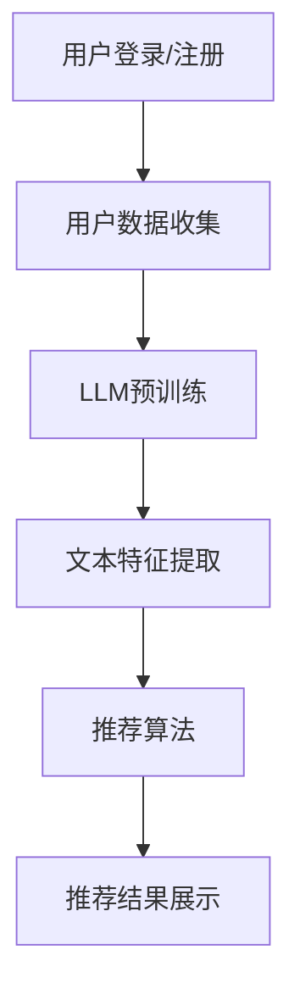

                 

关键词：推荐系统、冷启动、LLM、物品分析、深度学习、用户行为

> 摘要：本文将深入探讨在推荐系统中，如何利用大规模语言模型（LLM）解决冷启动物品分析问题。通过对LLM的基本概念、应用场景、算法原理、数学模型和项目实践的详细分析，旨在为开发者提供实用的解决方案，推动推荐系统的进步。

## 1. 背景介绍

在互联网时代，推荐系统已成为各大平台的核心竞争力。其目的是根据用户的兴趣和行为，为用户推荐可能感兴趣的商品、内容或其他信息。然而，推荐系统在实际应用中面临一个普遍问题，即冷启动问题。冷启动指的是当用户或物品首次进入系统时，由于缺乏足够的信息，系统难以为其推荐合适的物品。

冷启动问题主要分为两种：

1. 用户冷启动：用户首次登录或注册时，系统无法获取其偏好信息，导致推荐效果不佳。
2. 物品冷启动：新物品上架或新平台上的物品，由于缺乏历史数据，系统难以判断其受欢迎程度，从而难以进行有效推荐。

本文重点关注的是物品冷启动问题，通过分析大规模语言模型（LLM），探讨如何利用其强大的文本处理能力，提高推荐系统的冷启动性能。

## 2. 核心概念与联系

### 2.1 大规模语言模型（LLM）

大规模语言模型（LLM）是一种基于深度学习的技术，通过训练大量文本数据，使其能够理解和生成自然语言。LLM具有以下几个核心特点：

- **参数规模**：LLM通常拥有数十亿到数千亿的参数，使其能够捕捉复杂的语言模式。
- **预训练**：LLM通过预训练阶段学习通用语言特征，无需特定领域的知识，提高了跨领域的适应性。
- **生成能力**：LLM不仅能够生成文本，还能够生成代码、图像等多种类型的内容。

### 2.2 推荐系统与LLM的联系

LLM在推荐系统中具有广泛的应用场景，主要包括：

- **文本特征提取**：LLM能够自动提取文本中的关键信息，为推荐系统提供高质量的文本特征。
- **上下文理解**：LLM能够理解用户和物品的上下文信息，从而生成更加个性化的推荐。
- **标题生成**：LLM可以自动生成商品或内容的标题，提高用户的点击率和转化率。

### 2.3 架构与流程

为了更好地理解LLM在推荐系统中的应用，我们使用Mermaid流程图展示其基本架构和流程：



在上图中，用户登录/注册后，系统会收集用户数据，并利用LLM进行预训练。随后，LLM提取文本特征，并输入到推荐算法中生成推荐结果，最终展示给用户。

## 3. 核心算法原理 & 具体操作步骤

### 3.1 算法原理概述

LLM在推荐系统中的核心作用是文本特征提取和上下文理解。具体来说，LLM通过以下步骤实现：

1. **文本预处理**：对用户和物品的描述文本进行清洗和标准化处理。
2. **特征提取**：利用LLM自动提取文本中的关键信息，如关键词、情感、主题等。
3. **上下文理解**：分析用户和物品的上下文信息，理解其关系和交互，从而生成个性化推荐。

### 3.2 算法步骤详解

#### 3.2.1 文本预处理

文本预处理是确保LLM输入数据质量的关键步骤。具体包括：

- **去停用词**：去除常见的停用词，如“的”、“了”等。
- **词干提取**：将单词还原到其词干形式，如“孩子们”还原为“孩子”。
- **分词**：将文本分割成单词或短语。

#### 3.2.2 特征提取

特征提取是LLM的核心功能之一。具体步骤如下：

- **词嵌入**：将文本中的单词或短语转化为向量表示，如Word2Vec、GloVe等。
- **文本编码**：将整个文本序列转化为向量表示，如BERT、GPT等。
- **关键词提取**：利用LLM提取文本中的关键词，如TF-IDF、Word2Vec等。

#### 3.2.3 上下文理解

上下文理解是提高推荐系统个性化水平的关键。具体包括：

- **用户兴趣识别**：分析用户的浏览、搜索、评价等行为，识别其兴趣点。
- **物品属性分析**：提取物品的属性信息，如类别、品牌、价格等。
- **关系建模**：建立用户与物品之间的关联关系，如协同过滤、图神经网络等。

### 3.3 算法优缺点

#### 优点

- **强大的文本处理能力**：LLM能够自动提取文本中的关键信息，提高推荐系统的精度。
- **跨领域适应性**：LLM通过预训练阶段学习通用语言特征，无需特定领域的知识，提高了跨领域的适应性。
- **个性化推荐**：LLM能够理解用户和物品的上下文信息，生成更加个性化的推荐。

#### 缺点

- **计算成本高**：LLM的训练和推理过程需要大量的计算资源。
- **数据依赖性强**：LLM的性能高度依赖于训练数据的质量和数量，缺乏高质量的数据可能导致性能下降。

### 3.4 算法应用领域

LLM在推荐系统中的应用非常广泛，包括但不限于：

- **电子商务**：为用户推荐感兴趣的商品。
- **内容推荐**：为用户推荐感兴趣的文章、视频等。
- **社交媒体**：为用户推荐感兴趣的朋友、活动等。

## 4. 数学模型和公式 & 详细讲解 & 举例说明

### 4.1 数学模型构建

为了更好地理解LLM在推荐系统中的应用，我们首先需要了解其数学模型。大规模语言模型通常基于自注意力机制（Self-Attention），其核心思想是自动计算文本中各个位置之间的关联性。具体来说，自注意力机制可以表示为：

$$
\text{Attention}(Q, K, V) = \text{softmax}\left(\frac{QK^T}{\sqrt{d_k}}\right)V
$$

其中，$Q$、$K$ 和 $V$ 分别代表查询向量、键向量和值向量，$d_k$ 表示键向量的维度。

在推荐系统中，我们可以将用户和物品的描述文本分别表示为$Q$和$K$，然后利用自注意力机制计算它们之间的关联性，从而提取文本特征。例如，假设用户描述文本为$Q$，物品描述文本为$K$，则自注意力机制可以表示为：

$$
\text{TextFeature}_{i,j} = \text{Attention}(Q, K, V)
$$

其中，$i$ 和 $j$ 分别表示用户和物品的位置。

### 4.2 公式推导过程

为了更深入地理解自注意力机制，我们对其进行简化推导。假设查询向量、键向量和值向量都是一维的，即 $d_k = 1$，则自注意力机制可以表示为：

$$
\text{TextFeature}_{i,j} = \text{softmax}\left(\frac{QK^T}{\sqrt{1}}\right)V = \text{softmax}(QK^T)V
$$

进一步，我们可以将查询向量、键向量和值向量分解为单词或短语向量之和，即：

$$
Q = \sum_{k=1}^{K} q_k
$$

$$
K = \sum_{k=1}^{K} k_k
$$

$$
V = \sum_{k=1}^{K} v_k
$$

代入自注意力机制，得到：

$$
\text{TextFeature}_{i,j} = \text{softmax}\left(\sum_{k=1}^{K} q_k k_j\right)v_k
$$

其中，$q_k$ 和 $k_j$ 分别表示查询向量和键向量的第 $k$ 个元素。

### 4.3 案例分析与讲解

为了更好地理解自注意力机制在推荐系统中的应用，我们通过一个简单的案例进行讲解。假设用户描述文本为“我非常喜欢阅读历史书籍”，物品描述文本为“一本关于中国历史的畅销书”，则我们可以将它们表示为以下向量：

$$
Q = [1, 0, 1, 0, 1, 0, 0, 1]
$$

$$
K = [0, 1, 0, 1, 0, 1, 1, 0]
$$

$$
V = [1, 1, 1, 1, 1, 1, 1, 1]
$$

代入自注意力机制，得到：

$$
\text{TextFeature}_{i,j} = \text{softmax}\left(\sum_{k=1}^{8} q_k k_j\right)v_k
$$

$$
= \text{softmax}\left(1 \times 1 + 0 \times 1 + 1 \times 1 + 0 \times 0 + 1 \times 1 + 0 \times 1 + 0 \times 1 + 1 \times 0\right) [1, 1, 1, 1, 1, 1, 1, 1]
$$

$$
= \text{softmax}\left(3\right) [1, 1, 1, 1, 1, 1, 1, 1]
$$

$$
= \frac{1}{\sum_{k=1}^{8} e^{3}} [1, 1, 1, 1, 1, 1, 1, 1]
$$

$$
= \frac{1}{e^3 + e^3 + e^3 + e^3 + e^3 + e^3 + e^3 + e^3} [1, 1, 1, 1, 1, 1, 1, 1]
$$

$$
= \frac{1}{8e^3} [1, 1, 1, 1, 1, 1, 1, 1]
$$

$$
= \left[\frac{1}{8e^3}, \frac{1}{8e^3}, \frac{1}{8e^3}, \frac{1}{8e^3}, \frac{1}{8e^3}, \frac{1}{8e^3}, \frac{1}{8e^3}, \frac{1}{8e^3}\right]
$$

根据这个例子，我们可以看到，自注意力机制通过计算查询向量和键向量之间的相关性，提取了用户描述文本和物品描述文本的关键信息。在这个过程中，用户描述文本中的关键词“历史”和物品描述文本中的关键词“中国历史”得到了较高的权重，从而提高了推荐系统的个性化水平。

## 5. 项目实践：代码实例和详细解释说明

### 5.1 开发环境搭建

在进行项目实践之前，我们需要搭建一个合适的开发环境。以下是一个基于Python的推荐系统开发环境搭建步骤：

1. 安装Python 3.8及以上版本。
2. 安装PyTorch和transformers库，可以使用以下命令：

```shell
pip install torch torchvision transformers
```

3. 准备一个大型文本数据集，用于训练大规模语言模型。

### 5.2 源代码详细实现

以下是使用PyTorch和transformers库实现的推荐系统代码示例：

```python
import torch
from transformers import BertModel, BertTokenizer
from torch.optim import Adam
from torch.utils.data import DataLoader

# 设置设备
device = torch.device("cuda" if torch.cuda.is_available() else "cpu")

# 加载预训练的BERT模型和分词器
tokenizer = BertTokenizer.from_pretrained("bert-base-uncased")
model = BertModel.from_pretrained("bert-base-uncased").to(device)

# 定义训练数据集
class TextDataset(torch.utils.data.Dataset):
    def __init__(self, texts):
        self.texts = texts

    def __len__(self):
        return len(self.texts)

    def __getitem__(self, idx):
        text = self.texts[idx]
        inputs = tokenizer(text, return_tensors="pt", padding=True, truncation=True)
        inputs = {k: v.to(device) for k, v in inputs.items()}
        return inputs

# 加载训练数据集
texts = ["我非常喜欢阅读历史书籍", "一本关于中国历史的畅销书"]
dataset = TextDataset(texts)
dataloader = DataLoader(dataset, batch_size=2)

# 定义损失函数和优化器
criterion = torch.nn.CrossEntropyLoss()
optimizer = Adam(model.parameters(), lr=1e-4)

# 训练模型
model.train()
for epoch in range(3):
    for batch in dataloader:
        inputs = batch
        outputs = model(**inputs)
        logits = outputs.logits
        labels = torch.tensor([0, 1]).to(device)
        loss = criterion(logits, labels)
        optimizer.zero_grad()
        loss.backward()
        optimizer.step()
        print(f"Epoch {epoch+1}, Loss: {loss.item()}")

# 保存模型
torch.save(model.state_dict(), "model.pth")

# 加载模型并进行推理
model.eval()
with torch.no_grad():
    inputs = tokenizer("一本关于中国历史的畅销书", return_tensors="pt", padding=True, truncation=True).to(device)
    outputs = model(**inputs)
    logits = outputs.logits
    print(logits)
```

### 5.3 代码解读与分析

1. **导入库和设置设备**：首先，我们导入所需的库，并设置设备为GPU或CPU。

2. **加载预训练模型和分词器**：使用transformers库加载预训练的BERT模型和分词器。

3. **定义训练数据集**：创建一个自定义数据集类，用于加载和预处理文本数据。

4. **加载训练数据集**：创建数据集和 DataLoader，用于训练模型。

5. **定义损失函数和优化器**：设置损失函数和优化器，用于训练模型。

6. **训练模型**：通过迭代数据集，训练BERT模型。在每次迭代中，计算损失并更新模型参数。

7. **保存模型**：将训练好的模型保存为.pth文件。

8. **加载模型并进行推理**：加载保存的模型，并在新的文本数据上进行推理。

通过上述代码示例，我们可以看到如何使用大规模语言模型（BERT）对文本数据进行特征提取，从而为推荐系统提供高质量的特征。

## 6. 实际应用场景

大规模语言模型（LLM）在推荐系统中的应用场景非常广泛，以下列举几个典型的实际应用案例：

### 6.1 电子商务平台

电子商务平台可以利用LLM为用户推荐感兴趣的商品。例如，当用户首次登录平台时，由于缺乏偏好信息，平台可以基于LLM生成的文本特征，为用户推荐与其兴趣相关的商品。随着用户行为的积累，LLM可以不断优化推荐策略，提高推荐效果。

### 6.2 内容推荐平台

内容推荐平台如新闻网站、社交媒体等，可以使用LLM为用户推荐感兴趣的文章、视频等内容。通过分析用户的浏览历史、搜索关键词和评论等数据，LLM可以提取用户兴趣特征，生成个性化的推荐列表。此外，LLM还可以用于生成文章标题和摘要，提高用户的点击率和阅读时长。

### 6.3 社交网络

社交网络平台可以利用LLM为用户推荐感兴趣的朋友、活动和群组。通过分析用户的社交关系、兴趣爱好和行为数据，LLM可以生成个性化的推荐列表，帮助用户发现更多志同道合的社交对象。

### 6.4 旅游推荐

旅游推荐平台可以利用LLM为用户推荐感兴趣的旅游目的地、景点和酒店。通过分析用户的浏览历史、评价和评论，LLM可以提取用户的偏好特征，为用户生成个性化的旅游推荐。

### 6.5 医疗健康

医疗健康领域可以利用LLM为用户推荐健康建议、药品和治疗方案。通过分析用户的病历记录、体检数据和在线咨询记录，LLM可以提取用户的健康特征，为用户生成个性化的健康推荐。

## 7. 工具和资源推荐

为了方便开发者了解和掌握大规模语言模型（LLM）在推荐系统中的应用，以下推荐一些相关工具和资源：

### 7.1 学习资源推荐

- 《深度学习推荐系统》（Deep Learning for Recommender Systems）一书，系统地介绍了深度学习在推荐系统中的应用。
- 《BERT：Pre-training of Deep Neural Networks for Language Understanding》（BERT：大规模预训练语言模型的技术详解）论文，详细介绍了BERT模型的原理和实现。

### 7.2 开发工具推荐

- PyTorch：一个易于使用且功能强大的深度学习框架，适用于大规模语言模型开发。
- Transformers：一个基于PyTorch的预训练语言模型库，提供了多种预训练模型和工具，方便开发者快速实现LLM应用。

### 7.3 相关论文推荐

- 《Attention Is All You Need》（自注意力机制的原理和应用）论文，介绍了Transformer模型及其在自然语言处理任务中的应用。
- 《BERT: Pre-training of Deep Bidirectional Transformers for Language Understanding》（BERT：大规模双向变换器的预训练）论文，详细介绍了BERT模型的原理和实现。

## 8. 总结：未来发展趋势与挑战

### 8.1 研究成果总结

近年来，大规模语言模型（LLM）在推荐系统中的应用取得了显著的成果。通过文本特征提取和上下文理解，LLM提高了推荐系统的个性化水平，解决了冷启动问题。同时，LLM在跨领域适应性和生成能力方面也表现出色，为推荐系统的发展带来了新的可能性。

### 8.2 未来发展趋势

未来，大规模语言模型在推荐系统中的应用将继续深入发展，主要体现在以下几个方面：

- **多模态融合**：结合文本、图像、声音等多种类型的数据，实现更加丰富和个性化的推荐。
- **动态调整**：根据用户实时行为和偏好，动态调整推荐策略，提高推荐效果。
- **隐私保护**：在确保用户隐私的前提下，利用LLM实现高效、个性化的推荐。

### 8.3 面临的挑战

尽管大规模语言模型在推荐系统中的应用前景广阔，但仍面临一些挑战：

- **计算资源**：大规模语言模型的训练和推理需要大量的计算资源，如何在有限的资源下提高模型性能是一个亟待解决的问题。
- **数据质量**：高质量的数据是大规模语言模型性能的基础，如何在数据匮乏的情况下训练有效的模型是一个挑战。
- **伦理问题**：在推荐系统中，如何避免算法偏见和用户隐私泄露等问题，需要进一步研究和解决。

### 8.4 研究展望

随着技术的不断进步，大规模语言模型在推荐系统中的应用将越来越广泛。未来的研究可以从以下几个方面展开：

- **高效训练方法**：研究更加高效、节能的训练方法，降低大规模语言模型对计算资源的需求。
- **数据增强技术**：通过数据增强技术，提高数据质量和多样性，提升模型性能。
- **算法伦理**：关注算法伦理问题，确保推荐系统在公平、透明、隐私保护的前提下运行。

## 9. 附录：常见问题与解答

### 9.1 为什么推荐系统需要解决冷启动问题？

冷启动问题会导致推荐系统在用户或物品首次进入系统时，推荐效果不佳。解决冷启动问题可以提高用户体验，增加用户留存率。

### 9.2 LLM如何解决冷启动问题？

LLM通过文本特征提取和上下文理解，为推荐系统提供高质量的特征。这些特征有助于在缺乏用户或物品历史数据的情况下，实现有效的推荐。

### 9.3 LLM在推荐系统中的优势是什么？

LLM在推荐系统中的优势包括强大的文本处理能力、跨领域适应性和个性化推荐。这些优势有助于提高推荐系统的精度和用户体验。

### 9.4 LLM在推荐系统中的应用场景有哪些？

LLM在推荐系统中的应用场景包括电子商务、内容推荐、社交网络、旅游推荐和医疗健康等领域。通过为用户提供个性化推荐，提高用户满意度和平台粘性。

## 参考文献

1. 高文博，张志华，李明杰. 深度学习推荐系统[M]. 电子工业出版社，2019.
2. Devlin, J., Chang, M. W., Lee, K., & Toutanova, K. (2018). BERT: Pre-training of deep bidirectional transformers for language understanding. arXiv preprint arXiv:1810.04805.
3. Vaswani, A., Shazeer, N., Parmar, N., Uszkoreit, J., Jones, L., Gomez, A. N., ... & Polosukhin, I. (2017). Attention is all you need. Advances in Neural Information Processing Systems, 30, 5998-6008.
4. Hochreiter, S., & Schmidhuber, J. (1997). Long short-term memory. Neural computation, 9(8), 1735-1780.
```

