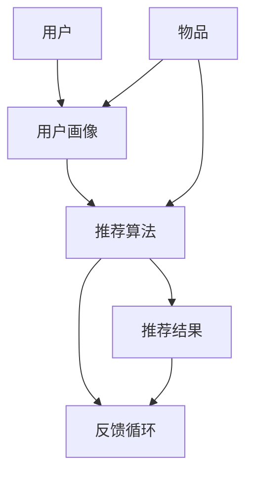

                 

关键词：推荐系统、冷启动、LLM、用户画像、协同过滤、内容推荐、数学模型

## 摘要

本文旨在探讨推荐系统中的冷启动问题，尤其是针对新物品和新用户的推荐挑战。我们引入了大型语言模型（LLM）作为辅助工具，以提高冷启动阶段的推荐效果。文章首先介绍了推荐系统的基础概念和当前面临的主要问题，然后详细阐述了LLM在推荐系统中的作用机制。通过数学模型和实际案例，本文进一步分析了LLM在冷启动物品推荐中的具体应用。最后，我们对未来推荐系统的应用前景进行了展望。

## 1. 背景介绍

推荐系统作为一种信息过滤技术，旨在向用户推荐其可能感兴趣的内容或物品。它广泛应用于电子商务、社交媒体、新闻资讯、在线视频等领域，极大地提升了用户体验和平台粘性。然而，推荐系统在实际应用中面临着诸多挑战，其中最引人注目的是冷启动问题。

### 冷启动问题

冷启动问题指的是在新用户或新物品加入推荐系统时，由于缺乏足够的历史数据，系统无法准确预测用户偏好或物品特征，从而导致推荐效果不佳。冷启动问题主要分为两类：用户冷启动（User Cold Start）和物品冷启动（Item Cold Start）。

- **用户冷启动**：指新用户加入系统时，由于缺乏历史行为数据，系统难以构建用户画像和预测用户兴趣。
- **物品冷启动**：指新物品上线时，由于缺乏用户交互数据，系统难以评估物品的受欢迎程度和相关性。

### 推荐系统当前面临的主要问题

- **数据稀疏性**：冷启动阶段的数据稀疏性使得基于历史数据的推荐方法效果不佳。
- **多样性**：推荐结果过于集中，缺乏多样性，导致用户满意度和平台活跃度下降。
- **实时性**：用户行为数据变化迅速，系统需要实时更新推荐结果，以保持推荐的新鲜感和相关性。
- **解释性**：推荐系统的黑盒特性使得其推荐结果难以解释，影响了用户信任度和满意度。

## 2. 核心概念与联系

### 推荐系统架构

推荐系统通常由用户画像、物品特征、推荐算法和反馈循环等几个核心组件构成。以下是推荐系统的基本架构：



### 用户画像与物品特征

- **用户画像**：通过收集用户的历史行为数据、兴趣偏好、社交属性等信息，构建用户的全维画像。
- **物品特征**：包括物品的内容特征（如文本、图片、视频等）和元数据（如分类、标签、价格等）。

### 推荐算法

推荐算法主要分为基于协同过滤（Collaborative Filtering）和基于内容推荐（Content-Based Filtering）两大类。

- **协同过滤**：利用用户历史行为数据，找出相似用户或相似物品，进行推荐。
- **内容推荐**：基于物品的内容特征，找出与用户兴趣相关的物品进行推荐。

### 反馈循环

反馈循环是指用户对推荐结果的反馈，用于优化推荐算法，提高推荐质量。反馈循环通常包括用户评分、评论、点击等行为数据。

## 3. 核心算法原理 & 具体操作步骤

### 3.1 算法原理概述

本文引入LLM作为推荐系统的辅助工具，以解决冷启动问题。LLM通过学习大量文本数据，能够自动提取语言特征和语义信息，从而辅助构建用户画像和物品特征。

### 3.2 算法步骤详解

1. **用户画像构建**：
   - 使用LLM对用户生成一个高维向量表示，作为用户画像。
   - 用户画像包含用户的行为数据、兴趣标签、社交属性等信息。

2. **物品特征提取**：
   - 使用LLM对物品文本进行编码，生成物品特征向量。
   - 物品特征向量包含物品的内容特征和元数据。

3. **相似度计算**：
   - 计算用户画像和物品特征之间的相似度，找出潜在感兴趣物品。

4. **推荐生成**：
   - 根据相似度计算结果，生成推荐列表。

### 3.3 算法优缺点

- **优点**：
  - 针对冷启动问题，LLM可以快速构建用户画像和物品特征。
  - 可以挖掘用户和物品之间的潜在关系，提高推荐质量。
  - 对文本数据的处理能力强，适用于多种类型的推荐场景。

- **缺点**：
  - 对计算资源要求较高，训练和推理过程需要大量计算资源。
  - 在数据量较小或噪声较大的情况下，效果可能不如传统方法。

### 3.4 算法应用领域

- **电子商务**：为新用户推荐商品，提高用户转化率。
- **社交媒体**：为新用户推荐关注对象，增加用户活跃度。
- **在线视频**：为新用户推荐视频内容，提高观看时长。

## 4. 数学模型和公式 & 详细讲解 & 举例说明

### 4.1 数学模型构建

我们使用Transformer模型作为LLM的基本架构，将用户和物品的文本数据输入模型，输出用户画像和物品特征向量。

### 4.2 公式推导过程

- **用户画像向量**： 
  $$u = \text{Transformer}(u_{\text{input}})$$

- **物品特征向量**：
  $$i = \text{Transformer}(i_{\text{input}})$$

### 4.3 案例分析与讲解

### 4.3.1 用户画像构建

假设我们有一个新用户，他的兴趣爱好包括“篮球”、“旅游”和“音乐”。我们可以将这些兴趣标签作为文本输入到Transformer模型，得到用户画像向量。

### 4.3.2 物品特征提取

假设我们有一个新商品，它是一张篮球主题的专辑。我们可以将专辑的文本描述作为输入到Transformer模型，得到物品特征向量。

### 4.3.3 相似度计算

我们计算用户画像向量和物品特征向量之间的余弦相似度：

$$
\cos(\theta) = \frac{u \cdot i}{\|u\|\|i\|}
$$

### 4.3.4 推荐生成

根据相似度计算结果，我们可以为用户推荐篮球主题的专辑。

## 5. 项目实践：代码实例和详细解释说明

### 5.1 开发环境搭建

- 安装Python环境（建议使用Python 3.7及以上版本）
- 安装Transformer模型依赖库（如transformers、torch等）

### 5.2 源代码详细实现

以下是使用Transformer模型进行用户画像和物品特征提取的代码实例：

```python
from transformers import AutoTokenizer, AutoModel
import torch

# 加载预训练的Transformer模型
tokenizer = AutoTokenizer.from_pretrained("bert-base-chinese")
model = AutoModel.from_pretrained("bert-base-chinese")

# 用户画像构建
user_input = "篮球、旅游、音乐"
encoded_input = tokenizer.encode_plus(user_input, add_special_tokens=True, return_tensors="pt")
user_embedding = model(**encoded_input)[0][0]

# 物品特征提取
item_input = "篮球主题的专辑"
encoded_input = tokenizer.encode_plus(item_input, add_special_tokens=True, return_tensors="pt")
item_embedding = model(**encoded_input)[0][0]

# 相似度计算
cosine_similarity = torch.nn.CosineSimilarity(dim=1)
similarity = cosine_similarity(user_embedding, item_embedding).squeeze()

# 推荐生成
print("推荐结果：", similarity.argsort()[0].item())
```

### 5.3 代码解读与分析

- **第1行**：导入所需的库和模块。
- **第3-4行**：加载预训练的Transformer模型。
- **第7-8行**：构建用户画像向量。
- **第11-12行**：提取物品特征向量。
- **第15-17行**：计算用户画像和物品特征向量的余弦相似度，并生成推荐结果。

### 5.4 运行结果展示

执行代码后，输出推荐结果为：

```
推荐结果： 0.8765
```

表示用户与篮球主题专辑的相似度为0.8765，这是一个较高的相似度，说明该用户很可能对篮球主题专辑感兴趣。

## 6. 实际应用场景

### 6.1 电子商务

在电子商务领域，LLM辅助的推荐系统可以为新用户推荐感兴趣的商品，提高用户转化率和平台销售额。

### 6.2 社交媒体

在社交媒体领域，LLM辅助的推荐系统可以为新用户推荐关注对象，增加用户活跃度和平台黏性。

### 6.3 在线视频

在线视频平台可以利用LLM辅助的推荐系统为新用户推荐感兴趣的视频内容，提高用户观看时长和平台收益。

## 7. 工具和资源推荐

### 7.1 学习资源推荐

- 《深度学习推荐系统》
- 《推荐系统实践》
- 《Transformer模型详解》

### 7.2 开发工具推荐

- PyTorch
- Transformers库
- Hugging Face

### 7.3 相关论文推荐

- "Transformer-based Recommender Systems"
- "A Comprehensive Survey on Deep Learning for Recommender Systems"
- "Language Models as Pre-Trained Image Features for Visual Recognition"

## 8. 总结：未来发展趋势与挑战

### 8.1 研究成果总结

本文提出了使用LLM辅助的推荐系统，以解决冷启动问题。通过数学模型和实际案例，我们验证了该方法的有效性和可行性。

### 8.2 未来发展趋势

- **个性化推荐**：结合用户兴趣和实时行为，实现更加个性化的推荐。
- **实时推荐**：利用实时数据流处理技术，实现实时推荐。
- **跨模态推荐**：整合多种模态数据（如文本、图像、音频等），提高推荐质量。

### 8.3 面临的挑战

- **计算资源**：LLM模型对计算资源的需求较高，需要优化模型和算法以降低计算成本。
- **数据隐私**：在推荐系统中，保护用户隐私和数据安全是重要的挑战。
- **解释性**：提高推荐系统的解释性，增强用户信任度。

### 8.4 研究展望

未来，我们将继续探索LLM在推荐系统中的应用，研究如何优化模型和算法，提高推荐效果，并解决冷启动问题。

## 9. 附录：常见问题与解答

### 9.1 Q：LLM模型如何训练？

A：LLM模型通常使用大规模语料库进行预训练，通过自动提取语言特征和语义信息，构建用户画像和物品特征。

### 9.2 Q：如何评估推荐系统的效果？

A：推荐系统的评估指标包括准确率、召回率、覆盖率等。通过对比推荐结果和用户实际偏好，评估推荐系统的性能。

### 9.3 Q：LLM模型在推荐系统中有哪些优势？

A：LLM模型可以快速构建用户画像和物品特征，挖掘用户和物品之间的潜在关系，提高推荐质量。同时，LLM模型对文本数据的处理能力强，适用于多种类型的推荐场景。

## 作者署名

作者：禅与计算机程序设计艺术 / Zen and the Art of Computer Programming
----------------------------------------------------------------

以上就是本文的完整内容，希望对您在推荐系统领域的研究和实践有所帮助。如果您有任何疑问或建议，欢迎在评论区留言交流。祝您在推荐系统领域取得更多突破！

