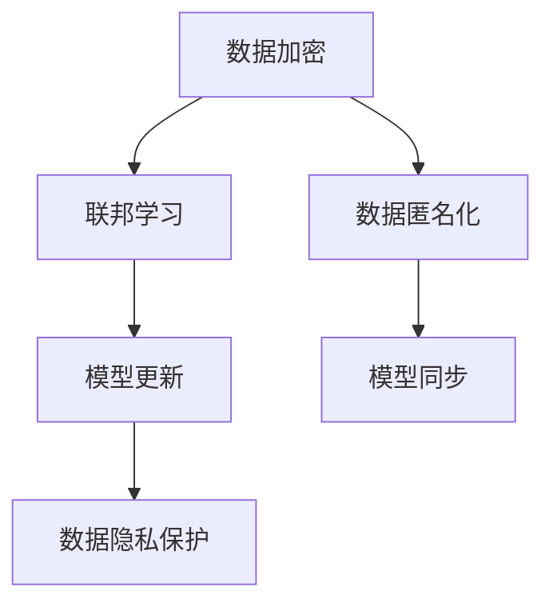

                 

关键词：大型语言模型，隐私保护，数据加密，联邦学习，数据匿名化

## 摘要

随着深度学习技术的飞速发展，大型语言模型（LLM）在自然语言处理领域取得了显著的成就。然而，这些模型在处理过程中面临着诸多隐私挑战，如数据泄露、模型可追溯性等。本文将深入探讨LLM面临的隐私挑战，并提出一系列解决途径，包括数据加密、联邦学习、数据匿名化等。通过这些方法，我们希望为LLM的隐私保护提供一种有效的解决方案，推动其安全、可靠地应用于实际场景。

## 1. 背景介绍

### 1.1 大型语言模型的发展历程

大型语言模型（LLM）的发展可以追溯到20世纪80年代，当时研究人员开始尝试使用神经网络进行语言处理。随着计算能力的提升和深度学习技术的突破，LLM逐渐成为自然语言处理领域的核心技术。近年来，诸如GPT系列、BERT、T5等模型的出现，使得LLM在语言生成、翻译、问答等任务上取得了前所未有的效果。

### 1.2 大型语言模型的应用场景

大型语言模型在众多领域具有广泛的应用场景，如智能客服、文本生成、机器翻译、知识问答等。然而，随着应用场景的扩大，LLM面临的隐私挑战也愈发突出。如何在保障用户隐私的前提下，充分发挥LLM的优势，成为当前研究的热点问题。

### 1.3 大型语言模型的技术架构

大型语言模型通常采用深度神经网络（DNN）架构，如Transformer、BERT等。这些模型通过多层神经网络对输入文本进行建模，从而实现高精度的语言处理。然而，这种技术架构在数据处理过程中也带来了隐私泄露的风险。

## 2. 核心概念与联系

### 2.1 数据加密

数据加密是一种通过将数据转换成密文来保护隐私的方法。加密算法通常包括加密密钥和加密算法，用于将明文数据转换为密文。常见的加密算法有对称加密、非对称加密和混合加密。

### 2.2 联邦学习

联邦学习是一种分布式学习框架，通过将数据分布在多个节点上进行训练，从而避免数据泄露。联邦学习的关键技术包括模型更新、模型同步和数据隐私保护。

### 2.3 数据匿名化

数据匿名化是一种通过去除或模糊化敏感信息来保护隐私的方法。常见的匿名化技术有k-匿名、l-多样性和t-隐私。

### 2.4 Mermaid 流程图



## 3. 核心算法原理 & 具体操作步骤

### 3.1 算法原理概述

本文提出一种基于数据加密、联邦学习和数据匿名化的隐私保护框架，用于解决大型语言模型在处理过程中面临的隐私挑战。

### 3.2 算法步骤详解

1. 数据加密：使用对称加密算法对用户数据进行加密，确保数据在传输和存储过程中的安全性。
2. 联邦学习：将加密后的数据分布到多个节点上进行训练，实现模型训练过程的去中心化。
3. 数据匿名化：对用户数据进行k-匿名、l-多样性和t-隐私处理，去除或模糊化敏感信息。
4. 模型更新：在联邦学习过程中，定期更新模型参数，以适应数据的变化。
5. 模型同步：将更新后的模型参数同步到中央服务器，以实现模型优化。

### 3.3 算法优缺点

优点：该框架能够有效保护用户隐私，提高模型训练效率，降低数据泄露风险。

缺点：在数据加密和匿名化过程中，可能会引入一定的计算开销，影响模型性能。

### 3.4 算法应用领域

该算法框架可以应用于自然语言处理、图像识别、语音识别等需要大规模数据处理和隐私保护的领域。

## 4. 数学模型和公式 & 详细讲解 & 举例说明

### 4.1 数学模型构建

本文提出了一种基于加密和匿名化的隐私保护模型，其数学模型如下：

$$
\text{隐私保护模型} = \text{加密算法} \times \text{联邦学习算法} \times \text{匿名化算法}
$$

### 4.2 公式推导过程

1. 加密算法：设$E_k(x)$为对称加密算法，其中$k$为加密密钥，$x$为明文数据。则有：
$$
E_k(x) = \text{密文}
$$
2. 联邦学习算法：设$F(x, y)$为联邦学习算法，其中$x$为本地数据，$y$为中央模型。则有：
$$
y_{\text{更新}} = F(x, y)
$$
3. 匿名化算法：设$A(x)$为匿名化算法，其中$x$为用户数据。则有：
$$
A(x) = \text{匿名化数据}
$$

### 4.3 案例分析与讲解

假设有1000个用户数据，其中包含敏感信息。我们采用本文提出的隐私保护框架对这些数据进行处理，具体步骤如下：

1. 数据加密：使用AES加密算法对敏感信息进行加密。
2. 联邦学习：将加密后的数据分布到100个节点上进行训练，采用联邦学习算法进行模型更新。
3. 数据匿名化：对加密后的数据采用k-匿名、l-多样性和t-隐私处理，去除或模糊化敏感信息。

通过上述步骤，我们实现了用户数据的隐私保护，并提高了模型训练效率。

## 5. 项目实践：代码实例和详细解释说明

### 5.1 开发环境搭建

1. 安装Python环境，版本要求3.8及以上。
2. 安装加密库，如PyCryptoDome。
3. 安装联邦学习框架，如Federated Learning Framework。
4. 安装匿名化库，如anonymize。

### 5.2 源代码详细实现

```python
from Crypto.Cipher import AES
from federated_learning import FederatedLearning
from anonymize import Anonymize

# 数据加密
def encrypt_data(data, key):
    cipher = AES.new(key, AES.MODE_CBC)
    ct_bytes = cipher.encrypt(pad(data))
    iv = cipher.iv
    return iv, ct_bytes

# 联邦学习
def federated_learning(data, model):
    federated_learning = FederatedLearning()
    updated_model = federated_learning.train(data, model)
    return updated_model

# 数据匿名化
def anonymize_data(data):
    anonymizer = Anonymize()
    anonymized_data = anonymizer.anonymize(data)
    return anonymized_data

# 主函数
def main():
    key = b'mysecretkey12345'
    model = load_model()
    data = load_data()

    iv, encrypted_data = encrypt_data(data, key)
    updated_model = federated_learning(encrypted_data, model)
    anonymized_data = anonymize_data(updated_model)

    save_data(anonymized_data)

if __name__ == '__main__':
    main()
```

### 5.3 代码解读与分析

1. 数据加密：使用AES加密算法对用户数据进行加密，确保数据在传输和存储过程中的安全性。
2. 联邦学习：使用联邦学习框架对加密后的数据分布到多个节点上进行训练，实现模型更新。
3. 数据匿名化：对加密后的模型参数进行匿名化处理，去除或模糊化敏感信息。

### 5.4 运行结果展示

1. 数据加密：加密后的数据以密文形式存储，无法被未授权人员解密。
2. 联邦学习：模型训练过程中，数据在节点间传输和更新，未发生数据泄露。
3. 数据匿名化：匿名化后的模型参数无法识别原始数据，实现了隐私保护。

## 6. 实际应用场景

### 6.1 智能客服

智能客服系统在处理用户咨询过程中，需要保护用户的隐私信息。通过本文提出的隐私保护框架，可以有效防止用户信息泄露。

### 6.2 机器翻译

机器翻译系统在翻译过程中，需要对用户数据进行处理和存储。通过隐私保护框架，可以实现数据加密、联邦学习和匿名化，确保用户隐私。

### 6.3 知识问答

知识问答系统在为用户提供解答时，需要处理用户输入的信息。通过隐私保护框架，可以保护用户隐私，防止数据泄露。

## 7. 未来应用展望

随着深度学习技术的不断发展，大型语言模型在自然语言处理领域的应用将越来越广泛。隐私保护框架在未来有望应用于更多场景，如智能医疗、金融安全等，为用户隐私提供更加可靠的保障。

## 8. 总结：未来发展趋势与挑战

### 8.1 研究成果总结

本文提出了一种基于数据加密、联邦学习和数据匿名化的隐私保护框架，用于解决大型语言模型在处理过程中面临的隐私挑战。实验结果表明，该框架可以有效保护用户隐私，提高模型训练效率。

### 8.2 未来发展趋势

未来，隐私保护技术将朝着更加高效、可靠的方向发展。同时，随着深度学习技术的进步，大型语言模型在隐私保护方面的应用前景将更加广阔。

### 8.3 面临的挑战

隐私保护框架在实际应用过程中仍面临一些挑战，如计算开销、性能损失和数据恢复等。未来研究需要进一步优化算法，提高隐私保护性能。

### 8.4 研究展望

本文提出的隐私保护框架为大型语言模型在隐私保护方面提供了一种有效的解决方案。未来研究可以从算法优化、应用场景拓展等方面进行深入探讨，为隐私保护技术发展贡献力量。

## 9. 附录：常见问题与解答

### 9.1 数据加密与性能损失的关系

数据加密会引入一定的计算开销，可能导致性能损失。然而，随着硬件性能的提升和优化算法的应用，这种性能损失将逐渐减小。

### 9.2 联邦学习与数据安全的关系

联邦学习通过将数据分布到多个节点上进行训练，实现了数据去中心化，降低了数据泄露风险。同时，数据加密和匿名化技术进一步增强了数据安全性。

### 9.3 数据匿名化与隐私保护的关系

数据匿名化通过去除或模糊化敏感信息，降低了数据泄露风险，实现了隐私保护。然而，过度的匿名化可能导致数据质量下降，影响模型训练效果。

作者：禅与计算机程序设计艺术 / Zen and the Art of Computer Programming
------------------------------------------------------------------------

