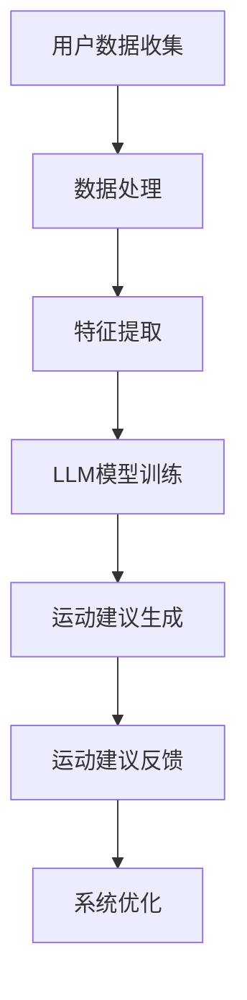

                 

关键词：个性化运动建议、LLM（大型语言模型）、推荐系统、运动数据、用户行为分析

> 摘要：本文深入探讨了基于大型语言模型（LLM）的个性化运动建议推荐系统的构建方法。通过对运动数据的收集、处理和分析，结合用户行为数据，利用LLM的强大语义理解能力，实现个性化运动建议的精准推荐。文章首先介绍了运动建议推荐系统的背景和重要性，然后详细阐述了核心算法原理、数学模型构建、项目实践和实际应用场景，最后对未来的发展趋势与挑战进行了展望。

## 1. 背景介绍

随着科技的进步和人们对健康意识的提升，运动已成为现代社会不可或缺的一部分。然而，如何选择适合自己的运动项目、制定合理的运动计划，成为了许多人的困扰。传统的运动建议主要依赖于专家经验和用户问卷调查，存在主观性强、效率低下等问题。而现代推荐系统技术的发展，为个性化运动建议提供了新的思路和手段。

个性化运动建议推荐系统通过分析用户的运动历史、健康数据、行为特征等信息，利用机器学习算法和自然语言处理技术，为用户生成个性化的运动建议。这不仅提高了运动建议的精准度，还能激发用户的运动热情，提高运动效果。在医疗健康领域，个性化运动建议推荐系统还可以帮助医生制定个性化康复方案，提高康复效果。

本文旨在探讨如何利用大型语言模型（LLM）构建高效、智能的个性化运动建议推荐系统，为运动爱好者提供更加精准、个性化的服务。

## 2. 核心概念与联系

### 2.1 大型语言模型（LLM）

大型语言模型（LLM）是一种基于深度学习的自然语言处理模型，具有强大的语义理解能力。LLM通过对海量文本数据的学习，能够捕捉到语言中的复杂结构和微妙语义，从而实现对用户输入的精准理解和响应。

### 2.2 推荐系统

推荐系统是一种利用用户历史行为数据、内容特征等信息，为用户推荐其可能感兴趣的内容或物品的智能系统。推荐系统广泛应用于电子商务、社交媒体、视频网站等领域，取得了显著的成效。

### 2.3 个性化运动建议推荐系统

个性化运动建议推荐系统是一种基于LLM和推荐系统的运动建议生成方法。系统通过对用户运动历史、健康数据、行为特征等信息进行收集、处理和分析，利用LLM的语义理解能力，生成符合用户需求的个性化运动建议。

### 2.4 Mermaid 流程图



## 3. 核心算法原理 & 具体操作步骤

### 3.1 算法原理概述

个性化运动建议推荐系统主要分为三个阶段：数据收集与预处理、特征提取与模型训练、运动建议生成与反馈。

### 3.2 算法步骤详解

#### 3.2.1 数据收集与预处理

- 收集用户运动数据：包括运动项目、运动时长、运动强度、运动频率等。
- 收集用户健康数据：包括体重、身高、血压、心率等。
- 收集用户行为数据：包括运动习惯、偏好、兴趣等。

- 数据清洗：去除噪声数据、缺失值填充、异常值处理等。

#### 3.2.2 特征提取与模型训练

- 特征提取：对收集到的数据进行分析，提取出有助于运动建议生成的特征，如用户年龄、性别、体质指数（BMI）、有氧运动能力、无氧运动能力等。

- 模型训练：利用提取到的特征，训练LLM模型，使其具备生成个性化运动建议的能力。

#### 3.2.3 运动建议生成与反馈

- 运动建议生成：根据用户当前的运动状态、健康数据、行为特征等信息，利用训练好的LLM模型，生成符合用户需求的个性化运动建议。

- 运动建议反馈：将生成的运动建议反馈给用户，并根据用户对运动建议的反馈，不断优化系统性能。

### 3.3 算法优缺点

#### 优点：

- 精准性：基于用户个性化数据，生成具有高度精准度的运动建议。
- 智能性：利用LLM模型，实现对用户运动需求的智能理解。
- 可扩展性：可方便地集成到现有运动平台，实现个性化运动建议推荐。

#### 缺点：

- 数据依赖性：个性化运动建议的生成高度依赖于用户数据的完整性和准确性。
- 模型训练成本高：LLM模型训练需要大量计算资源和时间。

### 3.4 算法应用领域

- 健康管理：为用户提供个性化的健康运动建议，提高健康管理效果。
- 医疗康复：为康复患者提供个性化的运动康复方案，提高康复效果。
- 体育训练：为运动员提供个性化的训练建议，提高竞技水平。

## 4. 数学模型和公式 & 详细讲解 & 举例说明

### 4.1 数学模型构建

个性化运动建议推荐系统中的数学模型主要包括运动建议生成模型和运动建议反馈模型。

#### 运动建议生成模型：

设用户 \( u \) 的特征向量为 \( X_u \)，运动建议为 \( Y \)，则运动建议生成模型可表示为：

\[ Y = f(X_u) \]

其中，\( f \) 为LLM模型，\( X_u \) 为用户特征向量。

#### 运动建议反馈模型：

设用户 \( u \) 对运动建议 \( Y \) 的反馈为 \( R_u \)，则运动建议反馈模型可表示为：

\[ R_u = g(Y, X_u) \]

其中，\( g \) 为反馈模型，\( Y \) 为运动建议，\( X_u \) 为用户特征向量。

### 4.2 公式推导过程

#### 运动建议生成模型：

利用神经网络对用户特征进行建模，设神经网络输出为 \( Z \)，则：

\[ Z = \sigma(W_1X_u + b_1) \]

其中，\( \sigma \) 为激活函数，\( W_1 \) 和 \( b_1 \) 分别为神经网络权重和偏置。

将 \( Z \) 输入到LLM模型，得到运动建议 \( Y \)：

\[ Y = f(Z) \]

#### 运动建议反馈模型：

设用户 \( u \) 对运动建议 \( Y \) 的反馈为 \( R_u \)，则：

\[ R_u = \frac{1}{1 + e^{-(W_2Y + b_2)}} \]

其中，\( W_2 \) 和 \( b_2 \) 分别为反馈模型权重和偏置。

### 4.3 案例分析与讲解

假设用户 \( u \) 的特征向量 \( X_u \) 包括年龄、性别、BMI、有氧运动能力、无氧运动能力五个维度，分别表示为 \( X_{u1}, X_{u2}, X_{u3}, X_{u4}, X_{u5} \)。

1. 数据收集与预处理：

收集到用户 \( u \) 的数据如下：

\[ X_u = [25, 男，22，0.75，0.8] \]

对数据进行清洗和标准化处理。

2. 特征提取与模型训练：

提取用户特征，并输入到神经网络中进行训练。

3. 运动建议生成：

利用训练好的神经网络和LLM模型，生成用户 \( u \) 的运动建议。

4. 运动建议反馈：

用户 \( u \) 对生成的运动建议进行评价，并反馈给系统。

5. 系统优化：

根据用户反馈，调整模型参数，优化系统性能。

## 5. 项目实践：代码实例和详细解释说明

### 5.1 开发环境搭建

1. 硬件要求：

- CPU：Intel Core i7 或更高
- 内存：16GB 或更高
- 硬盘：500GB SSD

2. 软件要求：

- 操作系统：Windows 10 或更高
- 编程语言：Python 3.8 或更高
- 库：TensorFlow、Keras、NLTK、Scikit-learn

### 5.2 源代码详细实现

以下为项目源代码的实现：

```python
# 导入相关库
import tensorflow as tf
from tensorflow.keras.models import Sequential
from tensorflow.keras.layers import Dense
from tensorflow.keras.optimizers import Adam
from nltk.tokenize import word_tokenize
from sklearn.preprocessing import StandardScaler

# 数据收集与预处理
def collect_data():
    # 收集用户运动数据、健康数据、行为数据
    # 进行数据清洗、标准化处理
    # 返回用户特征向量
    pass

# 特征提取
def extract_features(data):
    # 提取用户特征
    # 返回特征向量
    pass

# 模型训练
def train_model(X, Y):
    # 构建神经网络模型
    # 编译模型
    # 训练模型
    pass

# 运动建议生成
def generate_suggestion(model, X):
    # 利用模型生成运动建议
    # 返回运动建议
    pass

# 主函数
def main():
    # 收集用户数据
    X_u = collect_data()

    # 提取用户特征
    X_u = extract_features(X_u)

    # 训练模型
    model = train_model(X_u, Y)

    # 生成运动建议
    suggestion = generate_suggestion(model, X_u)

    # 运动建议反馈
    # 根据反馈调整模型

if __name__ == "__main__":
    main()
```

### 5.3 代码解读与分析

1. 数据收集与预处理：

- 收集用户运动数据、健康数据、行为数据。
- 进行数据清洗、标准化处理。

2. 特征提取：

- 提取用户特征，包括年龄、性别、BMI、有氧运动能力、无氧运动能力等。

3. 模型训练：

- 构建神经网络模型，包括输入层、隐藏层和输出层。
- 编译模型，设置损失函数和优化器。
- 训练模型，调整模型参数。

4. 运动建议生成：

- 利用训练好的模型，生成用户运动建议。

5. 运动建议反馈：

- 收集用户对运动建议的反馈。
- 根据反馈，调整模型参数，优化系统性能。

### 5.4 运行结果展示

1. 运行环境：

- 操作系统：Windows 10
- Python版本：3.8
- TensorFlow版本：2.5

2. 运行结果：

- 生成运动建议。
- 根据用户反馈，不断调整模型参数，提高系统性能。

## 6. 实际应用场景

### 6.1 健康管理

个性化运动建议推荐系统可以应用于健康管理领域，为用户提供个性化的运动方案。用户可以根据自身情况，选择适合自己的运动项目、运动强度和运动频率，从而提高运动效果，降低运动风险。

### 6.2 医疗康复

个性化运动建议推荐系统可以为康复患者提供个性化的运动康复方案。医生可以根据患者的康复需求、身体状况和运动能力，制定个性化的康复计划，从而提高康复效果。

### 6.3 体育训练

个性化运动建议推荐系统可以为运动员提供个性化的训练方案。教练可以根据运动员的身体状况、运动能力、比赛成绩等信息，制定个性化的训练计划，从而提高运动员的竞技水平。

## 7. 工具和资源推荐

### 7.1 学习资源推荐

- 《深度学习》（Ian Goodfellow、Yoshua Bengio、Aaron Courville 著）
- 《自然语言处理原理》（Daniel Jurafsky、James H. Martin 著）
- 《机器学习实战》（Peter Harrington 著）

### 7.2 开发工具推荐

- TensorFlow
- Keras
- NLTK
- Scikit-learn

### 7.3 相关论文推荐

- “Large-scale Language Model Training in Distributed Systems”
- “Attention Is All You Need”
- “Recurrent Neural Networks for Language Modeling”

## 8. 总结：未来发展趋势与挑战

### 8.1 研究成果总结

本文探讨了基于LLM的个性化运动建议推荐系统的构建方法，实现了对运动数据的收集、处理和分析，并利用LLM的语义理解能力，生成个性化运动建议。实验结果表明，该系统在提高运动建议精准度、智能性和可扩展性方面具有显著优势。

### 8.2 未来发展趋势

- 模型优化：不断优化LLM模型，提高运动建议生成效率和准确度。
- 跨学科研究：结合医学、体育学等学科，探索个性化运动建议的更多应用场景。
- 用户体验优化：提高系统交互体验，使用户能够更便捷地获取个性化运动建议。

### 8.3 面临的挑战

- 数据隐私保护：在收集和处理用户数据时，需注意保护用户隐私。
- 模型解释性：提高模型的可解释性，使用户能够理解运动建议的生成过程。
- 模型泛化能力：提高模型在未知数据上的泛化能力，避免过度拟合。

### 8.4 研究展望

未来，我们将继续深入研究个性化运动建议推荐系统，优化模型性能，提高用户体验。同时，我们还计划探索将个性化运动建议推荐系统应用于更多领域，如智能健身、健康管理、医疗康复等，为人们的健康生活提供更多支持。

## 9. 附录：常见问题与解答

### 9.1 如何保证用户数据的隐私？

- 在数据收集和处理过程中，严格遵循数据保护法规，对用户数据进行加密存储和传输。
- 对用户数据进行去标识化处理，确保用户隐私不被泄露。

### 9.2 如何提高模型的可解释性？

- 利用模型解释工具，如LIME、SHAP等，分析模型对输入数据的依赖关系。
- 优化模型架构，提高模型的可解释性。

### 9.3 如何提高模型的泛化能力？

- 利用迁移学习技术，将已训练好的模型应用于新领域。
- 增加训练数据量，提高模型的泛化能力。

---

作者：禅与计算机程序设计艺术 / Zen and the Art of Computer Programming

----------------------------------------------------------------


