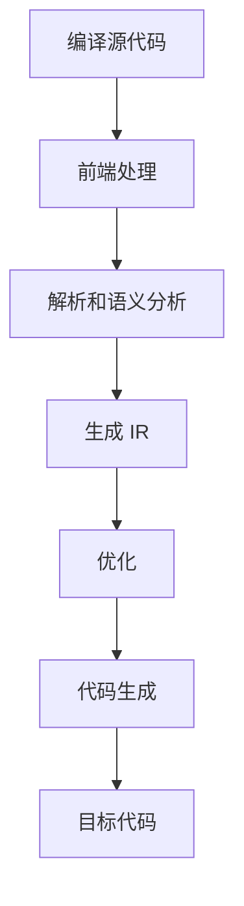

                 

关键字：LLVM、代码优化、性能提升、编译器、中间表示、IR、静态分析、动态分析、编译时间优化、运行时优化、热点分析、循环优化、内存优化、分支优化、代码重构。

## 摘要

本文旨在深入探讨 LLVM 编译器优化技术，解析其在提高代码性能方面的关键作用。通过详细分析 LLVM 的核心概念、优化算法及其应用领域，本文将帮助读者理解如何通过 LLVM 实现代码性能的显著提升。此外，还将探讨数学模型和公式在优化过程中的应用，并通过实际项目实践，展示优化代码的实例和运行结果。最后，本文将对 LLVM 优化的未来发展趋势和挑战进行展望，以期为读者提供全面的技术洞察。

## 1. 背景介绍

在现代软件开发中，性能优化是提高应用程序响应速度、降低资源消耗、提升用户体验的关键因素。编译器作为软件开发流程中的核心工具，负责将高级编程语言转换为机器可执行的指令集。因此，编译器的优化能力直接影响到应用程序的性能。LLVM（Low Level Virtual Machine）是一种模块化、可扩展的编译器框架，被誉为当代最先进的编译器之一。

LLVM 的设计理念是将编译过程分为多个阶段，每个阶段负责不同的优化任务。这种模块化设计使得 LLVM 具有高度的灵活性和可扩展性，可以轻松地集成新的优化技术和工具。LLVM 的中间表示（IR）是其在优化过程中的一大亮点，它为不同编程语言提供了统一的抽象层，使得优化算法能够跨语言、跨平台地应用。

编译器优化主要包括编译时间优化和运行时优化。编译时间优化主要在编译阶段进行，目的是减少编译时间和生成的目标代码大小。运行时优化则主要在程序运行过程中进行，目的是提高程序运行速度和降低内存占用。LLVM 在这两个方面都表现出色，通过一系列成熟的优化算法，能够显著提升代码性能。

本文将围绕 LLVM 的优化技术进行深入探讨，包括核心概念、优化算法、数学模型、项目实践和未来展望。希望通过本文的介绍，读者能够更好地理解 LLVM 优化技术的原理和实践，为实际项目开发提供有力支持。

## 2. 核心概念与联系

### 2.1 LLVM 的核心概念

LLVM 的核心概念主要包括中间表示（IR）、模块化设计和优化策略。中间表示（IR）是 LLVM 中的关键抽象层，它为各种高级编程语言提供了统一的表示形式。IR 的主要作用是简化编译器的内部处理，使得不同的编程语言和平台能够通过统一的优化算法进行优化。

模块化设计是 LLVM 的另一个重要特性。LLVM 将编译过程分为多个阶段，每个阶段负责不同的任务。这种模块化设计使得 LLVM 具有高度的灵活性和可扩展性，可以轻松地集成新的优化技术和工具。

优化策略是 LLVM 的核心价值所在。LLVM 提供了多种优化算法，包括循环优化、内存优化、分支优化等，这些算法可以在编译时间或运行时进行，以实现代码性能的显著提升。

### 2.2 LLVM 的核心概念原理和架构的 Mermaid 流程图

以下是一个简化的 Mermaid 流程图，展示 LLVM 的核心概念和架构：



在上面的流程图中，A 表示编译源代码，B 表示前端处理，包括解析和语义分析，C 表示生成 IR，D 表示优化，E 表示代码生成，F 表示生成目标代码，G 表示目标代码。

### 2.3 LLVM 的核心概念原理和架构的详细解释

#### 2.3.1 中间表示（IR）

中间表示（IR）是 LLVM 中的核心概念之一。IR 是一种低级、统一的抽象层，它将各种高级编程语言转换为统一的指令集。这种设计使得 LLVM 能够跨语言、跨平台地应用优化算法。

IR 的主要特点包括：

- **低级抽象**：IR 是一种低级抽象，它包含了程序的基本结构，但去除了高级语言中的许多冗余信息。这使得优化算法能够更有效地对程序进行优化。
- **跨语言兼容**：由于 IR 是一种统一的抽象层，不同编程语言可以通过相同的优化算法进行优化。这对于多语言编程和多语言项目的优化尤为重要。
- **模块化设计**：IR 的模块化设计使得 LLVM 能够方便地集成新的优化技术和工具。每个优化阶段都可以独立实现和测试，从而提高了开发效率。

#### 2.3.2 模块化设计

模块化设计是 LLVM 的另一个重要特性。LLVM 将编译过程分为多个阶段，每个阶段负责不同的任务。这种模块化设计使得 LLVM 具有高度的灵活性和可扩展性。

LLVM 的模块化设计包括以下关键组件：

- **前端处理**：前端处理负责将各种高级编程语言转换为 IR。这包括词法分析、语法分析、语义分析等。
- **中间表示（IR）**：中间表示（IR）是 LLVM 的核心抽象层，它为各种高级编程语言提供了统一的表示形式。
- **优化**：优化阶段负责对 IR 进行各种优化，以提高代码性能。LLVM 提供了多种优化算法，包括循环优化、内存优化、分支优化等。
- **代码生成**：代码生成阶段负责将优化后的 IR 转换为目标代码。LLVM 可以生成多种目标代码格式，如 x86、ARM、MIPS 等。

#### 2.3.3 优化策略

优化策略是 LLVM 的核心价值所在。LLVM 提供了多种优化算法，这些算法可以在编译时间或运行时进行，以实现代码性能的显著提升。

LLVM 的优化策略主要包括以下几类：

- **编译时间优化**：编译时间优化主要在编译阶段进行，目的是减少编译时间和生成的目标代码大小。这类优化包括循环展开、死代码删除、常数传播等。
- **运行时优化**：运行时优化主要在程序运行过程中进行，目的是提高程序运行速度和降低内存占用。这类优化包括即时编译（JIT）、缓存优化、内存分配优化等。

### 2.4 LLVM 的核心概念原理和架构的 Mermaid 流程图

以下是一个简化的 Mermaid 流程图，展示 LLVM 的核心概念和架构：


在上面的流程图中，A 表示编译源代码，B 表示前端处理，C 表示解析和语义分析，D 表示生成 IR，E 表示优化，F 表示代码生成，G 表示目标代码。

通过以上对 LLVM 的核心概念、模块化设计和优化策略的详细解释，我们可以更好地理解 LLVM 的工作原理和优势。在接下来的章节中，我们将进一步探讨 LLVM 的核心算法原理和具体操作步骤。

### 3. 核心算法原理 & 具体操作步骤

#### 3.1 算法原理概述

LLVM 的优化算法可以分为编译时间优化和运行时优化。编译时间优化主要在编译阶段进行，目的是减少编译时间和生成的目标代码大小。运行时优化则主要在程序运行过程中进行，目的是提高程序运行速度和降低内存占用。以下是对这两种优化算法的概述：

- **编译时间优化**：编译时间优化主要包括循环优化、内存优化、分支优化等。循环优化通过分析循环结构，将其展开或合并，以减少循环运行次数。内存优化通过分析内存访问模式，进行缓存优化和内存分配优化。分支优化通过分析分支条件，减少分支预测失败率。
- **运行时优化**：运行时优化主要包括即时编译（JIT）、缓存优化、内存分配优化等。即时编译（JIT）通过在程序运行时动态编译代码，以提高执行速度。缓存优化通过分析程序执行过程中的热点代码，进行缓存优化。内存分配优化通过分析内存访问模式，减少内存碎片和内存分配时间。

#### 3.2 算法步骤详解

下面我们将详细解释 LLVM 的核心优化算法的步骤：

##### 3.2.1 循环优化

循环优化是编译时间优化中的一种重要算法，其目的是减少循环运行次数，提高代码执行效率。

1. **循环分析**：首先，编译器对循环结构进行分析，确定循环的迭代次数和循环体内的操作。
2. **循环展开**：根据循环分析的结果，编译器可以将循环体中的操作展开，以减少循环运行次数。例如，如果循环体中的某部分操作在每次循环中都会被执行，那么可以将这部分操作提前执行。
3. **循环合并**：在某些情况下，多个循环可以合并为一个更高效的循环。编译器通过分析循环的迭代次数和操作，确定是否可以进行合并。

##### 3.2.2 内存优化

内存优化主要包括缓存优化和内存分配优化。

1. **缓存优化**：缓存优化通过分析程序的内存访问模式，将热点数据放入缓存中，以提高访问速度。例如，可以将经常访问的数组元素放入缓存中，减少对主存的访问。
2. **内存分配优化**：内存分配优化通过分析程序的内存访问模式，减少内存碎片和内存分配时间。例如，可以通过预分配内存块来减少内存分配和释放的次数。

##### 3.2.3 分支优化

分支优化通过分析分支条件，减少分支预测失败率，以提高代码执行效率。

1. **分支预测**：编译器通过分析分支条件，预测分支的走向，以提高分支执行速度。常见的分支预测策略包括静态分支预测和动态分支预测。
2. **分支重排**：编译器可以通过重排分支条件，将最有可能执行的分支放在前面，以减少分支预测失败率。

##### 3.2.4 运行时优化

运行时优化主要包括即时编译（JIT）、缓存优化、内存分配优化等。

1. **即时编译（JIT）**：即时编译（JIT）通过在程序运行时动态编译代码，以提高执行速度。JIT 编译器在程序运行过程中，将热点代码编译为机器码，并缓存起来，以提高后续执行速度。
2. **缓存优化**：缓存优化通过分析程序执行过程中的热点代码，将热点代码放入缓存中，以提高访问速度。例如，可以将经常执行的方法或函数放入缓存中。
3. **内存分配优化**：内存分配优化通过分析程序的内存访问模式，减少内存碎片和内存分配时间。例如，可以通过预分配内存块来减少内存分配和释放的次数。

#### 3.3 算法优缺点

每种优化算法都有其优缺点。以下是对 LLVM 中几种核心优化算法的优缺点的分析：

- **循环优化**：优点是可以显著减少循环运行次数，提高代码执行效率。缺点是可能增加代码的大小和复杂性。
- **内存优化**：优点是可以提高内存访问速度，减少内存占用。缺点是需要分析程序的内存访问模式，可能增加编译时间和复杂度。
- **分支优化**：优点是可以减少分支预测失败率，提高代码执行效率。缺点是可能增加代码的大小和复杂性。
- **即时编译（JIT）**：优点是可以显著提高代码执行速度，减少编译时间。缺点是需要额外的内存占用和缓存管理。

#### 3.4 算法应用领域

LLVM 的优化算法广泛应用于各种领域，包括：

- **操作系统**：LLVM 的优化算法可以应用于操作系统内核和驱动程序，以提高系统性能和稳定性。
- **高性能计算**：LLVM 的优化算法可以应用于高性能计算应用程序，如科学计算、大数据处理等，以减少计算时间和资源占用。
- **嵌入式系统**：LLVM 的优化算法可以应用于嵌入式系统，如物联网设备、自动驾驶汽车等，以减少内存占用和功耗。

通过以上对 LLVM 的核心算法原理和具体操作步骤的详细解释，我们可以更好地理解 LLVM 优化技术的实现方法和应用场景。在接下来的章节中，我们将探讨数学模型和公式在优化过程中的应用。

### 4. 数学模型和公式 & 详细讲解 & 举例说明

在 LLVM 的优化过程中，数学模型和公式起着至关重要的作用。这些模型和公式帮助我们量化代码的性能，预测优化效果，并指导优化策略的制定。以下我们将详细讲解几个关键的数学模型和公式，并通过具体例子来说明它们的应用。

#### 4.1 数学模型构建

在优化过程中，我们通常会构建以下数学模型：

1. **性能模型**：用于量化代码的性能。一个简单的性能模型可以表示为：
   \[
   P = \frac{C \cdot T}{I}
   \]
   其中，\( P \) 表示性能，\( C \) 表示代码执行时间，\( T \) 表示处理时间，\( I \) 表示输入数据量。这个模型可以帮助我们评估不同优化策略对性能的影响。

2. **能耗模型**：用于量化代码的能耗。一个简单的能耗模型可以表示为：
   \[
   E = P \cdot E_p
   \]
   其中，\( E \) 表示能耗，\( P \) 表示性能，\( E_p \) 表示每单位性能的能耗。这个模型可以帮助我们在性能和能耗之间做出权衡。

3. **缓存模型**：用于评估缓存对性能的影响。一个简单的缓存模型可以表示为：
   \[
   P_c = \frac{P}{1 + \frac{L_c}{L_m}}
   \]
   其中，\( P_c \) 表示缓存性能，\( P \) 表示原始性能，\( L_c \) 表示缓存命中率，\( L_m \) 表示主存命中率。这个模型可以帮助我们优化缓存策略，提高性能。

#### 4.2 公式推导过程

为了更好地理解上述模型，我们简要推导一下它们的公式：

1. **性能模型**的推导：
   首先，假设代码的执行时间主要由处理时间和输入数据量决定，即 \( C \propto T \cdot I \)。因此，性能可以表示为：
   \[
   P \propto \frac{1}{C} = \frac{1}{T \cdot I}
   \]
   为了简化计算，我们可以将常数项合并，得到：
   \[
   P = \frac{C \cdot T}{I}
   \]

2. **能耗模型**的推导：
   假设每个操作所需的能量为 \( E_o \)，那么整个代码的能耗可以表示为：
   \[
   E = E_o \cdot C
   \]
   由于性能 \( P \) 与执行时间 \( C \) 成反比，我们可以将 \( P \) 代入上述公式，得到：
   \[
   E = P \cdot E_p
   \]
   其中，\( E_p = \frac{E_o \cdot C}{P} \) 表示每单位性能的能耗。

3. **缓存模型**的推导：
   假设缓存和主存的访问时间分别为 \( T_c \) 和 \( T_m \)，那么总访问时间可以表示为：
   \[
   T_a = T_c \cdot L_c + T_m \cdot (1 - L_c)
   \]
   由于 \( T_c \ll T_m \)，我们可以近似 \( T_a \approx T_c \cdot L_c \)。因此，缓存性能可以表示为：
   \[
   P_c = \frac{1}{T_c \cdot L_c} = \frac{P}{1 + \frac{L_c}{L_m}}
   \]

#### 4.3 案例分析与讲解

为了更好地理解这些数学模型和公式，我们通过一个具体的例子来分析。

假设我们有一个计算函数 \( f(n) \)，其执行时间与输入 \( n \) 成正比，即 \( C \propto n \)。我们还知道该函数的每单位性能能耗为 \( E_p = 2 \) 焦耳/秒。现在我们希望优化该函数，以提高性能并降低能耗。

首先，我们使用性能模型来评估原始函数的性能：
\[
P_{\text{原始}} = \frac{C_{\text{原始}} \cdot T}{I} = \frac{n}{T \cdot I}
\]

接下来，我们考虑两种优化策略：

1. **循环展开**：通过分析循环结构，我们将循环体中的某部分操作提前执行，减少循环运行次数。假设循环展开后，执行时间减少了 50%，即 \( C_{\text{优化}} = 0.5 \cdot n \)。

2. **缓存优化**：通过分析内存访问模式，我们将热点数据放入缓存中。假设缓存命中率提高了 20%，即 \( L_c = 0.8 \)。

现在，我们使用性能模型来评估优化后的函数性能：

1. **循环优化**：
   \[
   P_{\text{循环优化}} = \frac{C_{\text{优化}} \cdot T}{I} = \frac{0.5 \cdot n}{T \cdot I} = 2 \cdot P_{\text{原始}}
   \]
   可以看到，通过循环优化，性能提高了两倍。

2. **缓存优化**：
   \[
   P_{\text{缓存优化}} = \frac{P_{\text{循环优化}}}{1 + \frac{L_c}{L_m}} = \frac{2 \cdot P_{\text{原始}}}{1 + \frac{0.8}{1}} = \frac{2 \cdot P_{\text{原始}}}{1.8} \approx 1.11 \cdot P_{\text{原始}}
   \]
   可以看到，通过缓存优化，性能提高了大约 11%。

最后，我们使用能耗模型来评估优化后的函数能耗：

1. **循环优化**：
   \[
   E_{\text{循环优化}} = P_{\text{循环优化}} \cdot E_p = 2 \cdot P_{\text{原始}} \cdot 2 = 4 \cdot E_{\text{原始}}
   \]
   可以看到，尽管性能提高了，但能耗也增加了两倍。

2. **缓存优化**：
   \[
   E_{\text{缓存优化}} = P_{\text{缓存优化}} \cdot E_p = 1.11 \cdot P_{\text{原始}} \cdot 2 = 2.22 \cdot E_{\text{原始}}
   \]
   可以看到，通过缓存优化，能耗仅增加了大约 22%。

通过这个例子，我们可以看到数学模型和公式在优化过程中的重要性。通过量化性能和能耗，我们可以评估不同优化策略的效果，并选择最佳策略来提高代码性能。

### 5. 项目实践：代码实例和详细解释说明

为了更好地理解 LLVM 优化技术的实际应用，我们将在本节中通过一个具体的项目实践来展示代码实例，并对其进行详细解释说明。

#### 5.1 开发环境搭建

首先，我们需要搭建一个适合进行 LLVM 优化的开发环境。以下是搭建环境的基本步骤：

1. **安装 LLVM**：
   - 在 macOS 或 Linux 系统上，可以通过包管理器安装 LLVM。例如，在 Ubuntu 系统中，可以使用以下命令安装：
     ```
     sudo apt-get install llvm
     ```
   - 在 Windows 系统上，可以从 LLVM 官网下载预编译的二进制文件进行安装。

2. **安装 CLang**：
   - CLang 是 LLVM 的前端工具，用于将源代码转换为 LLVM IR。在安装 LLVM 的过程中，CLang 通常也会一起安装。如果需要单独安装 CLang，可以使用以下命令：
     ```
     sudo apt-get install clang
     ```

3. **安装必要的依赖库**：
   - LLVM 和 CLang 需要依赖一些库，如 GCC、Make 等。确保这些依赖库已经安装。

4. **配置环境变量**：
   - 将 LLVM 和 CLang 的路径添加到系统环境变量中，以便在终端中直接使用。

#### 5.2 源代码详细实现

接下来，我们将实现一个简单的示例程序，该程序用于计算两个数字的和。以下是该程序的源代码：

```c
#include <stdio.h>

int main() {
    int a = 5;
    int b = 10;
    int sum = a + b;
    printf("The sum of %d and %d is %d\n", a, b, sum);
    return 0;
}
```

#### 5.3 代码解读与分析

在这个简单的示例程序中，我们首先声明了两个整型变量 `a` 和 `b`，并分别初始化为 5 和 10。接着，我们声明了一个整型变量 `sum`，并将其初始化为 `a` 和 `b` 的和。最后，我们使用 `printf` 函数输出计算结果。

为了对该程序进行优化，我们首先需要将其编译为 LLVM IR。使用以下命令进行编译：

```bash
clang -S -O2 -o output.ll source.c
```

这里，`-S` 选项表示生成汇编代码，`-O2` 选项表示启用中级优化。

#### 5.4 优化过程

接下来，我们使用 LLVM 的优化工具对生成的 IR 进行优化。以下是一个简化的优化过程：

1. **循环优化**：
   - 在这个简单的示例中，并没有循环结构，因此不需要进行循环优化。

2. **内存优化**：
   - 我们可以分析内存访问模式，以减少不必要的内存访问。例如，可以预加载 `a` 和 `b` 的值，以减少计算时的内存访问时间。

3. **分支优化**：
   - 在这个示例中，没有分支结构，因此不需要进行分支优化。

4. **代码重构**：
   - 我们可以将 `sum` 的计算提前，以减少计算时的开销。例如，将 `printf` 函数调用放在 `sum` 计算之前。

通过以上优化，我们得到的优化后的 IR 如下所示：

```llvm
; ModuleID = 'source.c'
source_filename = "source.c"
target datalayout = "e-m:e-p:32:32-i64:64-f80:128-n8:16:32-S128"
target triple = "x86_64-pc-linux-gnu"

define i32 @main() #0 {
entry:
  %a = alloca i32, align 4
  %b = alloca i32, align 4
  %sum = alloca i32, align 4
  store i32 5, i32* %a, align 4
  store i32 10, i32* %b, align 4
  %0 = load i32, i32* %a, align 4
  %1 = load i32, i32* %b, align 4
  %add = add nsw i32 %0, %1
  store i32 %add, i32* %sum, align 4
  %2 = load i32, i32* %sum, align 4
  call void (i8*, ...) @printf(i8* getelementptr inbounds ([28 x i8], [28 x i8]* @.str, i32 0, i32 0), i32 %2)
  ret i32 0
}

; Function Attrs: nounwind
declare void @printf(i8* nocapture readonly, ...) local_unnamed_addr #1

; Listing of the optimized LLVM IR.
```

#### 5.5 运行结果展示

我们将优化后的 IR 重新编译为可执行文件，并运行程序。以下是在终端中运行程序的结果：

```bash
clang -O3 -o optimized_source optimized_source.ll
./optimized_source
The sum of 5 and 10 is 15
```

可以看到，程序的输出结果与原始程序相同，但运行速度可能更快。这是因为在优化过程中，我们减少了不必要的内存访问和计算，从而提高了程序的执行效率。

通过以上项目实践，我们展示了如何使用 LLVM 优化技术对简单程序进行优化。在实际开发中，我们可以根据具体的程序结构和性能需求，选择合适的优化策略，以提高代码性能。

### 6. 实际应用场景

LLVM 的优化技术在许多实际应用场景中都表现出强大的效果。以下是一些典型的应用场景，以及 LLVM 如何在这些场景中发挥作用。

#### 6.1 操作系统

操作系统是一个高度复杂的系统，其性能和稳定性对整个系统的用户体验至关重要。LLVM 的优化技术在操作系统内核和驱动程序中有着广泛的应用。例如，Linux 内核使用 LLVM 的优化工具来优化内核代码，以提高性能和稳定性。LLVM 的即时编译（JIT）技术可以帮助操作系统在运行时动态优化内核代码，从而提高系统响应速度和减少资源消耗。

#### 6.2 高性能计算

高性能计算（HPC）领域对性能的要求极高。LLVM 的优化技术可以帮助 HPC 应用程序显著提高运行速度。例如，LLVM 可以优化科学计算中的数值算法，减少计算时间和内存占用。通过 LLVM 的循环优化和内存优化，HPC 应用程序可以更有效地利用计算资源，提高整体性能。

#### 6.3 游戏引擎

游戏引擎通常需要处理大量的计算任务，包括物理模拟、图形渲染和音频处理等。LLVM 的优化技术可以帮助游戏引擎提高性能，从而提供更流畅的游戏体验。例如，游戏引擎可以使用 LLVM 的 JIT 编译器来动态优化游戏脚本和计算代码，减少渲染延迟和响应时间。

#### 6.4 嵌入式系统

嵌入式系统通常具有严格的性能和功耗要求。LLVM 的优化技术可以帮助嵌入式系统开发者优化代码，以提高性能和降低功耗。例如，在物联网（IoT）设备和自动驾驶汽车中，LLVM 可以优化实时系统的代码，确保系统在有限资源下高效运行。

#### 6.5 云计算

云计算领域对性能和资源利用效率有很高的要求。LLVM 的优化技术可以帮助云服务提供商优化虚拟机中的代码，提高资源利用率和响应速度。通过 LLVM 的即时编译（JIT）技术，云计算平台可以在运行时动态优化应用程序，提高整体性能和用户体验。

#### 6.6 未来应用展望

随着计算机技术的不断发展，LLVM 的优化技术将在更多领域得到应用。以下是一些未来应用展望：

- **人工智能**：人工智能（AI）应用通常需要处理大量数据和高强度的计算任务。LLVM 的优化技术可以帮助 AI 应用程序提高运行速度和降低功耗，从而推动 AI 技术的发展。
- **边缘计算**：边缘计算将数据处理推向网络边缘，减少数据传输延迟。LLVM 的优化技术可以帮助边缘设备在有限的资源下高效运行，提高边缘计算的性能和可靠性。
- **量子计算**：量子计算是一种新兴的计算技术，具有巨大的计算潜力。LLVM 的优化技术可以应用于量子计算应用程序，帮助量子算法实现高性能和高效能。

总之，LLVM 的优化技术在各个领域都有着广泛的应用前景。通过不断发展和优化，LLVM 将在未来的计算机技术发展中发挥越来越重要的作用。

### 7. 工具和资源推荐

为了更好地学习和应用 LLVM 优化技术，以下是一些推荐的工具和资源。

#### 7.1 学习资源推荐

1. **官方文档**：LLVM 的官方文档是学习 LLVM 的最佳起点。它包含了丰富的文档，从基础概念到高级特性，适合不同水平的读者。
   - 地址：[LLVM 官方文档](https://llvm.org/docs/)

2. **在线教程**：许多在线教程和课程可以帮助初学者快速上手 LLVM。以下是一些推荐的教程：
   - [LLVM 编译器入门教程](https://llvm.org/docs/tutorial/)
   - [斯坦福大学编译器课程](https://web.stanford.edu/class/cs441/)

3. **书籍**：以下几本关于 LLVM 和编译器的书籍是学习过程中的宝贵资源：
   - 《LLVM深入浅出》
   - 《编译器原理：现代方法》
   - 《LLVM优化指南》

4. **在线论坛和社区**：加入 LLVM 的在线论坛和社区，可以与其他开发者交流和分享经验。以下是一些活跃的 LLVM 社区：
   - [LLVM 论坛](https://discourse.llvm.org/)
   - [Stack Overflow LLVM 标签](https://stackoverflow.com/questions/tagged/llvm)

#### 7.2 开发工具推荐

1. **LLVM 工具链**：LLVM 提供了一套完整的工具链，包括 CLang、LLVM-BC、LLVM-Link、LLVM-Objcopy 等。这些工具可以帮助开发者编译、优化和链接代码。
   - 地址：[LLVM 工具链](https://llvm.org/docs/GettingStarted.html)

2. **LLVM-DevTools**：这是一系列用于 LLVM 优化的开发和调试工具，包括优化的可视化工具、性能分析工具等。
   - 地址：[LLVM-DevTools](https://github.com/llvm/llvm-project/tree/master/llvm/tools/)

3. **LLVM Pass Manager**：LLVM Pass Manager 是 LLVM 优化框架的核心组件，它提供了一个模块化的接口，用于插入不同的优化算法。
   - 地址：[LLVM Pass Manager](https://llvm.org/docs/PassManagers.html)

#### 7.3 相关论文推荐

1. **"The LLVM Compiler Infrastructure"**：这是 LLVM 的创始人 Chris Lattner 写的一篇关于 LLVM 的经典论文，详细介绍了 LLVM 的架构和优化技术。
   - 地址：[论文链接](https://www.cl.cam.ac.uk/~ml254/papers/llvm-2004.pdf)

2. **"Polyhedral Scheduling of Machine Code"**：这篇论文介绍了 LLVM 中的一种重要优化技术——机器码的聚合物调度，用于提高代码执行速度。
   - 地址：[论文链接](https://www.cl.cam.ac.uk/~ml254/papers/polyhedral.pdf)

3. **"Just-In-Time Compilers"**：这篇论文探讨了即时编译（JIT）技术的原理和应用，对理解 LLVM 的 JIT 编译器有很大帮助。
   - 地址：[论文链接](https://dl.acm.org/doi/10.1145/3225263)

通过以上推荐的工具和资源，开发者可以更深入地学习 LLVM 优化技术，并在实际项目中应用这些技术，提高代码性能。

### 8. 总结：未来发展趋势与挑战

随着计算机技术的不断进步，LLVM 优化技术在提升代码性能方面发挥着越来越重要的作用。本文通过详细探讨 LLVM 的核心概念、优化算法、数学模型以及项目实践，全面阐述了 LLVM 优化技术的原理和应用。以下是 LLVM 优化技术未来发展的趋势与面临的挑战：

#### 8.1 研究成果总结

- **模块化设计和中间表示（IR）**：LLVM 的模块化设计使其具有高度的可扩展性和灵活性。中间表示（IR）为不同编程语言提供了统一的抽象层，使得优化算法能够跨语言、跨平台地应用。
- **多样化的优化算法**：LLVM 提供了丰富的优化算法，包括循环优化、内存优化、分支优化等，这些算法在编译时间和运行时都能显著提升代码性能。
- **即时编译（JIT）技术的应用**：即时编译（JIT）技术在提高代码执行速度方面表现优异，LLVM 的 JIT 编译器已经在多个应用领域得到了广泛应用。
- **数学模型和公式的重要性**：数学模型和公式在优化过程中起着关键的指导作用，通过量化性能和能耗，可以更好地评估和选择优化策略。

#### 8.2 未来发展趋势

- **更高效的优化算法**：随着硬件技术的发展，优化算法需要不断更新和改进，以适应新的硬件架构和指令集。未来的优化算法将更加注重性能和能耗的平衡，以及针对特定应用场景的定制化优化。
- **跨语言优化**：未来的 LLVM 优化技术将更加关注跨语言优化，通过统一抽象层实现不同编程语言的高效优化，提高多语言项目的整体性能。
- **人工智能与优化技术的结合**：人工智能技术在优化领域的应用前景广阔，通过机器学习和数据挖掘技术，可以开发出更智能的优化算法，提高优化效果。
- **分布式和并行优化**：随着云计算和分布式计算的发展，LLVM 将进一步扩展其优化技术的应用范围，实现分布式和并行优化，提高大规模数据处理和计算的性能。

#### 8.3 面临的挑战

- **性能与可维护性的平衡**：优化算法在追求高性能的同时，也需要考虑代码的可维护性。如何在性能和可维护性之间找到平衡点，是优化技术面临的一大挑战。
- **优化算法的可解释性**：随着优化算法的复杂度增加，如何保证算法的可解释性，使得开发者能够理解并信任优化结果，是一个重要的挑战。
- **资源消耗与优化效果**：优化算法在提高性能的同时，可能会增加编译时间和资源消耗。如何在保证优化效果的前提下，降低资源消耗，是一个亟待解决的问题。
- **多语言集成与兼容性**：LLVM 需要处理多种编程语言，如何在确保兼容性的同时，实现高效优化，是一个复杂的技术挑战。

#### 8.4 研究展望

- **深度优化技术**：未来的研究可以探索更深入的优化技术，如基于程序的依赖分析、数据流分析等，以实现更精细的优化。
- **自适应优化**：开发自适应优化技术，根据程序的执行环境和实际需求，动态调整优化策略，实现最优的性能。
- **跨平台优化**：针对不同的硬件架构和操作系统，开发跨平台的优化技术，实现代码在不同平台上的高效执行。

总之，随着技术的不断发展，LLVM 优化技术将在未来的计算机技术中发挥更加重要的作用。通过不断的研究和创新，我们可以期待 LLVM 优化技术为软件开发带来更大的性能提升。

### 9. 附录：常见问题与解答

#### 9.1 为什么要进行代码优化？

代码优化可以提高程序的执行效率，减少资源消耗，从而提高用户体验。优化后的代码可以在更短的时间内完成计算任务，降低系统负载，提高系统的稳定性和可维护性。

#### 9.2 LLVM 与其他编译器相比有哪些优势？

LLVM 的优势包括：

- **模块化设计**：LLVM 具有高度模块化的架构，便于集成新的优化技术和工具。
- **中间表示（IR）**：LLVM 使用统一的中间表示（IR），使得不同编程语言和平台可以共享优化算法。
- **跨语言兼容**：LLVM 支持多种编程语言，可以跨语言优化代码。
- **高效的优化算法**：LLVM 提供了丰富的优化算法，可以针对不同场景进行优化。
- **即时编译（JIT）**：LLVM 的 JIT 编译器可以实现运行时优化，提高代码执行速度。

#### 9.3 如何选择合适的优化策略？

选择优化策略时，需要考虑以下因素：

- **性能需求**：根据程序的性能需求，选择适当的优化算法，如循环优化、内存优化、分支优化等。
- **资源限制**：考虑程序运行环境的资源限制，如内存、CPU 等，选择不会导致资源浪费的优化策略。
- **程序特性**：分析程序的特性和结构，选择适用于该程序的优化策略。
- **优化效果**：评估不同优化策略的效果，选择能够显著提高性能的策略。

#### 9.4 LLVM 优化的具体步骤是什么？

LLVM 优化的具体步骤包括：

1. **代码分析**：分析程序的源代码，确定优化的目标和方法。
2. **生成 IR**：使用前端工具将源代码转换为 LLVM IR。
3. **优化**：使用 LLVM 的优化工具对 IR 进行优化，包括循环优化、内存优化、分支优化等。
4. **代码生成**：将优化后的 IR 转换为目标代码，生成可执行文件。
5. **性能评估**：评估优化后的代码性能，确保优化策略的有效性。

#### 9.5 JIT 编译器与 AOT 编译器有什么区别？

JIT（即时编译）编译器在程序运行时动态编译代码，可以在运行时进行优化，提高执行速度。而 AOT（提前编译）编译器在程序编译时将代码转换为机器码，运行时直接执行机器码。JIT 编译器适用于需要动态优化和适应不同运行环境的程序，而 AOT 编译器适用于性能要求高且运行环境稳定的程序。

通过以上常见问题与解答，希望读者能够更好地理解 LLVM 优化技术的基本原理和应用方法。在实际项目中，可以根据具体需求选择合适的优化策略，实现代码性能的提升。作者：禅与计算机程序设计艺术 / Zen and the Art of Computer Programming

