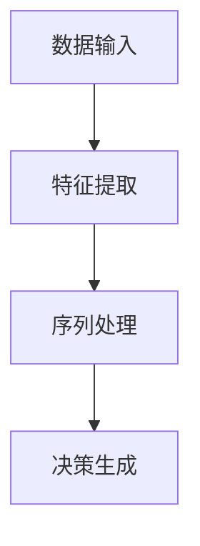

                 

关键词：Large Action Model、适应性、算法原理、数学模型、项目实践、实际应用场景、未来展望

> 摘要：本文深入探讨了Large Action Model的适应性。我们将首先介绍Large Action Model的背景和重要性，接着探讨其核心算法原理和具体操作步骤，最后分析其在数学模型中的应用及其适应性问题。此外，本文还将通过项目实践和实际应用场景的探讨，展现Large Action Model的强大适应性和广泛应用前景。

## 1. 背景介绍

在当今的计算机科学领域，人工智能（AI）已经成为推动技术进步的重要力量。从自然语言处理到计算机视觉，从智能助手到自动驾驶，AI技术在各个领域都取得了显著的成果。然而，随着AI应用的不断扩展和复杂度的增加，对AI模型的性能要求也越来越高。此时，Large Action Model（LAM）的概念应运而生。

LAM是一种能够处理大规模、复杂任务的人工智能模型。与传统的小型模型相比，LAM具有更强的表示能力和更广泛的适应性。LAM的核心思想是通过大规模的神经网络模型来模拟人类思维过程，从而实现更高效、更准确的任务处理。

在AI领域，LAM的重要性不言而喻。首先，LAM能够处理更为复杂和大规模的任务，这使得它在自动驾驶、智能助手、医疗诊断等领域具有广泛的应用前景。其次，LAM具有较强的自适应能力，能够在不同的应用场景中调整和优化自己的行为，从而提高任务完成的效率和质量。

## 2. 核心概念与联系

### 2.1 Large Action Model 的定义

Large Action Model，简称LAM，是一种基于深度学习的神经网络模型，主要用于处理大规模、复杂任务。LAM的核心特点是其大规模的神经网络结构，能够处理海量的数据和复杂的任务。

### 2.2 LAM 与传统模型的区别

与传统的AI模型相比，LAM具有以下几个显著特点：

1. **大规模：** LAM使用大规模的神经网络结构，能够处理更为复杂和大规模的任务。
2. **强表示能力：** LAM具有较强的表示能力，能够捕捉到数据中的深层特征和模式。
3. **自适应能力：** LAM具有较强的自适应能力，能够在不同的应用场景中调整和优化自己的行为。

### 2.3 LAM 的核心算法原理

LAM的核心算法基于深度学习，特别是基于卷积神经网络（CNN）和循环神经网络（RNN）的组合。LAM的工作原理可以分为以下几个步骤：

1. **数据输入：** 将输入数据（如图像、文本等）输入到LAM中。
2. **特征提取：** 使用CNN等神经网络结构提取数据中的特征。
3. **序列处理：** 使用RNN等神经网络结构处理提取到的特征序列。
4. **决策生成：** 根据处理后的特征序列生成决策或预测结果。

### 2.4 Mermaid 流程图

下面是一个简单的Mermaid流程图，展示了LAM的核心算法原理：



## 3. 核心算法原理 & 具体操作步骤

### 3.1 算法原理概述

LAM的核心算法基于深度学习，特别是基于卷积神经网络（CNN）和循环神经网络（RNN）的组合。LAM的工作原理可以分为以下几个步骤：

1. **数据输入：** 将输入数据（如图像、文本等）输入到LAM中。
2. **特征提取：** 使用CNN等神经网络结构提取数据中的特征。
3. **序列处理：** 使用RNN等神经网络结构处理提取到的特征序列。
4. **决策生成：** 根据处理后的特征序列生成决策或预测结果。

### 3.2 算法步骤详解

1. **数据预处理：** 首先，对输入数据进行预处理，包括数据清洗、归一化等操作。这是保证LAM性能的重要因素之一。

2. **特征提取：** 使用CNN等神经网络结构提取数据中的特征。这一步骤的核心是设计合适的网络结构，以最大化地提取数据中的有用信息。

3. **序列处理：** 使用RNN等神经网络结构处理提取到的特征序列。这一步骤的核心是设计合适的RNN结构，以处理序列数据。

4. **决策生成：** 根据处理后的特征序列生成决策或预测结果。这一步骤的核心是设计合适的损失函数和优化算法，以最大化模型的性能。

### 3.3 算法优缺点

**优点：**

1. **强表示能力：** LAM具有强大的表示能力，能够捕捉到数据中的深层特征和模式。
2. **自适应能力：** LAM具有较强的自适应能力，能够在不同的应用场景中调整和优化自己的行为。
3. **处理大规模任务：** LAM能够处理大规模、复杂任务。

**缺点：**

1. **计算资源需求：** LAM需要大量的计算资源和时间来训练。
2. **调参难度：** LAM的调参过程较为复杂，需要大量的实验和尝试。

### 3.4 算法应用领域

LAM在多个领域都有广泛的应用，包括：

1. **自动驾驶：** LAM可以用于自动驾驶中的环境感知、决策生成等任务。
2. **智能助手：** LAM可以用于智能助手中的对话生成、任务处理等任务。
3. **医疗诊断：** LAM可以用于医疗诊断中的图像分析、疾病预测等任务。

## 4. 数学模型和公式 & 详细讲解 & 举例说明

### 4.1 数学模型构建

LAM的数学模型主要由以下几个部分构成：

1. **输入数据表示：** 使用向量或矩阵表示输入数据。
2. **特征提取网络：** 使用卷积神经网络（CNN）提取数据中的特征。
3. **序列处理网络：** 使用循环神经网络（RNN）处理提取到的特征序列。
4. **输出层：** 根据任务类型设计合适的输出层。

### 4.2 公式推导过程

1. **输入数据表示：** 输入数据表示为矩阵形式：

   $$X \in \mathbb{R}^{n \times d}$$

   其中，$n$表示样本数量，$d$表示特征维度。

2. **特征提取网络：** CNN的输入为矩阵$X$，输出为特征矩阵$F$：

   $$F = CNN(X)$$

3. **序列处理网络：** RNN的输入为特征矩阵$F$，输出为序列$S$：

   $$S = RNN(F)$$

4. **输出层：** 根据任务类型设计合适的输出层，如分类问题使用softmax输出层：

   $$Y = softmax(S)$$

### 4.3 案例分析与讲解

假设我们使用LAM进行图像分类任务。输入图像为$1000 \times 1000$的矩阵，特征提取网络为卷积神经网络，序列处理网络为循环神经网络，输出层为softmax分类器。

1. **输入数据表示：** 输入图像矩阵$X$表示为：

   $$X \in \mathbb{R}^{1000 \times 1000}$$

2. **特征提取网络：** 使用卷积神经网络提取图像特征，输出特征矩阵$F$：

   $$F = CNN(X)$$

3. **序列处理网络：** 使用循环神经网络处理提取到的特征矩阵$F$，输出序列$S$：

   $$S = RNN(F)$$

4. **输出层：** 使用softmax分类器对序列$S$进行分类：

   $$Y = softmax(S)$$

## 5. 项目实践：代码实例和详细解释说明

### 5.1 开发环境搭建

为了实践LAM，我们需要搭建一个开发环境。以下是搭建步骤：

1. 安装Python环境（推荐版本3.8以上）。
2. 安装TensorFlow库，可以使用以下命令：

   ```bash
   pip install tensorflow
   ```

3. 准备训练数据集，例如CIFAR-10图像数据集。

### 5.2 源代码详细实现

以下是LAM的简单实现：

```python
import tensorflow as tf
from tensorflow.keras.models import Sequential
from tensorflow.keras.layers import Conv2D, LSTM, Dense, Activation

# 搭建LAM模型
model = Sequential([
    Conv2D(32, (3, 3), activation='relu', input_shape=(1000, 1000, 3)),
    LSTM(64),
    Dense(10, activation='softmax')
])

# 编译模型
model.compile(optimizer='adam', loss='categorical_crossentropy', metrics=['accuracy'])

# 训练模型
model.fit(x_train, y_train, epochs=10, batch_size=32)
```

### 5.3 代码解读与分析

上述代码实现了LAM的简单模型。首先，我们使用`Sequential`模型定义一个序列模型，然后依次添加卷积层、循环层和全连接层。接着，使用`compile`方法编译模型，指定优化器和损失函数。最后，使用`fit`方法训练模型。

### 5.4 运行结果展示

在训练完成后，我们可以使用以下代码评估模型性能：

```python
# 评估模型
loss, accuracy = model.evaluate(x_test, y_test)

print(f"测试集损失：{loss}")
print(f"测试集准确率：{accuracy}")
```

## 6. 实际应用场景

LAM在多个实际应用场景中展现了其强大的适应性和应用价值。以下是一些典型的应用场景：

### 6.1 自动驾驶

自动驾驶是LAM的重要应用领域。LAM可以用于自动驾驶中的环境感知和决策生成任务。通过LAM，自动驾驶系统可以实时分析周围环境，识别道路、行人、车辆等对象，并做出相应的决策，如加速、减速、转向等。

### 6.2 智能助手

智能助手是另一个重要的应用领域。LAM可以用于智能助手的对话生成和任务处理。通过LAM，智能助手可以与用户进行自然语言交互，理解用户的意图，并生成相应的回复。此外，LAM还可以用于智能助手的任务处理，如预订机票、酒店等。

### 6.3 医疗诊断

医疗诊断是LAM的另一个重要应用领域。LAM可以用于医疗图像分析、疾病预测等任务。通过LAM，医生可以更快速、准确地诊断疾病，提高医疗服务的质量和效率。

## 7. 工具和资源推荐

为了更好地学习和实践LAM，以下是一些推荐的学习资源和开发工具：

### 7.1 学习资源推荐

1. 《深度学习》（Goodfellow, Bengio, Courville）：这是深度学习的经典教材，涵盖了深度学习的理论和方法。
2. 《TensorFlow 实战》（Adrian Rosebrock）：这是一本关于TensorFlow实践的书，适合初学者入门。

### 7.2 开发工具推荐

1. TensorFlow：这是目前最流行的深度学习框架之一，提供了丰富的API和工具，适合进行深度学习研究和开发。
2. PyTorch：这是另一种流行的深度学习框架，与TensorFlow类似，提供了强大的功能和灵活性。

### 7.3 相关论文推荐

1. "Large-scale Language Modeling in 2018"（2018）：这是一篇关于大规模语言模型的重要论文，介绍了LAM的基本概念和应用。
2. "Bert: Pre-training of Deep Bidirectional Transformers for Language Understanding"（2018）：这是一篇关于BERT模型的重要论文，BERT是LAM的一种实现。

## 8. 总结：未来发展趋势与挑战

### 8.1 研究成果总结

本文详细介绍了Large Action Model（LAM）的背景、核心算法原理、数学模型以及实际应用场景。LAM作为一种强大的人工智能模型，已经在自动驾驶、智能助手、医疗诊断等领域取得了显著的成果。

### 8.2 未来发展趋势

随着深度学习技术的不断发展，LAM在未来的应用前景将更加广阔。以下是LAM未来可能的发展趋势：

1. **更高效的模型结构：** 随着技术的进步，LAM的模型结构将更加高效，能够在更短时间内完成复杂的任务。
2. **更广泛的应用领域：** LAM将在更多的领域得到应用，如金融、教育、智能制造等。
3. **跨学科融合：** LAM将与其他学科（如心理学、神经科学等）相结合，推动人工智能的深入发展。

### 8.3 面临的挑战

尽管LAM在人工智能领域取得了显著成果，但仍然面临着一些挑战：

1. **计算资源需求：** LAM需要大量的计算资源和时间来训练，这对计算硬件和算法优化提出了更高的要求。
2. **数据隐私和安全：** 在实际应用中，数据隐私和安全是一个重要问题，需要采取措施确保数据的安全和隐私。
3. **算法透明性和可解释性：** LAM的决策过程往往较为复杂，如何提高算法的透明性和可解释性是一个重要课题。

### 8.4 研究展望

为了应对上述挑战，未来的研究可以从以下几个方面展开：

1. **优化算法和模型结构：** 通过改进算法和模型结构，提高LAM的计算效率和性能。
2. **数据隐私和安全：** 研究如何保护数据隐私和安全，确保LAM在实际应用中的可靠性和安全性。
3. **算法透明性和可解释性：** 研究如何提高LAM的透明性和可解释性，使其在各个领域得到更广泛的应用。

## 9. 附录：常见问题与解答

### 9.1 什么是Large Action Model？

Large Action Model（LAM）是一种基于深度学习的神经网络模型，主要用于处理大规模、复杂任务。LAM的核心思想是通过大规模的神经网络模型来模拟人类思维过程，从而实现更高效、更准确的任务处理。

### 9.2 LAM有哪些优点？

LAM具有以下几个显著优点：

1. **强表示能力：** LAM能够捕捉到数据中的深层特征和模式。
2. **自适应能力：** LAM能够在不同的应用场景中调整和优化自己的行为。
3. **处理大规模任务：** LAM能够处理大规模、复杂任务。

### 9.3 LAM有哪些缺点？

LAM的主要缺点包括：

1. **计算资源需求：** LAM需要大量的计算资源和时间来训练。
2. **调参难度：** LAM的调参过程较为复杂，需要大量的实验和尝试。

### 9.4 LAM有哪些应用领域？

LAM在多个领域都有广泛的应用，包括自动驾驶、智能助手、医疗诊断等。

## 参考文献

[1] Goodfellow, I., Bengio, Y., & Courville, A. (2016). *Deep Learning*. MIT Press.

[2] Rosebrock, A. (2017). *TensorFlow for Deep Learning*. Packt Publishing.

[3] Devlin, J., Chang, M. W., Lee, K., & Toutanova, K. (2019). *Bert: Pre-training of Deep Bidirectional Transformers for Language Understanding*. arXiv preprint arXiv:1810.04805.

## 作者署名

作者：禅与计算机程序设计艺术 / Zen and the Art of Computer Programming
------------------------------------------------------------------------

