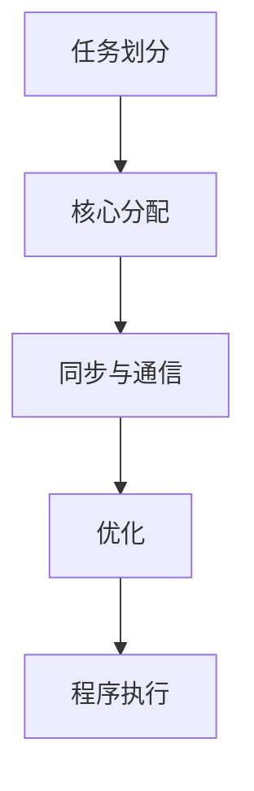

                 

关键词：MIPS多核编程、并行计算、网络设备、性能优化、编程实践

> 摘要：本文旨在探讨MIPS多核编程在并行计算和网络设备中的应用。通过对MIPS多核架构的深入分析，结合实际编程实例，本文将展示如何充分利用多核处理器的并行计算能力，提高网络设备的性能和效率。

## 1. 背景介绍

随着互联网的迅速发展，网络设备的需求不断增长，特别是在处理高带宽、高吞吐量的网络流量时，单核处理器的性能已经无法满足要求。为了提升网络设备的处理能力，并行计算技术应运而生。MIPS（Microprocessor without Interlocked Pipelined Stages）是一种经典的精简指令集计算机（RISC）架构，具有良好的并行处理能力，适用于多核编程。

## 2. 核心概念与联系

### MIPS多核架构

MIPS多核架构基于对称多处理（SMP）技术，多个MIPS核心共享同一套内存和I/O系统。这种架构具有以下特点：

- 高度可扩展：可以通过增加核心数量来提升性能。
- 低延迟：多核之间的通信延迟较低。
- 高效：利用并行计算能力，提高数据处理效率。

### 并行计算原理

并行计算是将一个问题分解成多个子问题，在多个处理单元上同时执行，以加快计算速度。MIPS多核架构天然支持并行计算，其核心思想如下：

- 数据并行：将数据集分成多个部分，分别在不同的核心上处理。
- 任务并行：将任务分解成多个子任务，分配给不同的核心。

### MIPS多核编程

MIPS多核编程的核心在于如何有效地利用多个核心的并行计算能力。以下是一个简单的MIPS多核编程流程：

1. **任务划分**：将需要处理的任务分解成多个子任务。
2. **核心分配**：根据任务特性，将子任务分配给不同的核心。
3. **同步与通信**：确保任务之间的同步与数据通信。
4. **优化**：对程序进行优化，减少不必要的同步和通信。

### Mermaid 流程图

以下是一个简单的Mermaid流程图，展示了MIPS多核编程的流程：



## 3. 核心算法原理 & 具体操作步骤

### 3.1 算法原理概述

MIPS多核编程的核心算法是基于并行计算和任务调度。其原理可以概括为：

1. **任务分解**：将一个复杂任务分解成多个可并行处理的子任务。
2. **任务调度**：根据核心能力和任务特性，选择合适的调度算法，将子任务分配给不同的核心。
3. **同步与通信**：确保任务之间的同步与数据通信，避免资源竞争和数据不一致。
4. **优化**：通过优化算法和程序结构，减少不必要的同步和通信，提高并行计算效率。

### 3.2 算法步骤详解

1. **任务分解**：根据任务的性质，将其分解成多个子任务。例如，一个网络流量的处理任务可以分解成数据过滤、数据加密、数据压缩等子任务。

2. **核心分配**：选择合适的调度算法，将子任务分配给不同的核心。常见的调度算法有：

   - 负载均衡调度：根据每个核心的负载情况，将子任务分配给负载较低的核心。
   - 时间片调度：将子任务按照固定的时间片轮流分配给不同的核心。

3. **同步与通信**：在子任务之间设置同步点和通信机制，确保数据的一致性和任务之间的协调。

4. **优化**：通过代码优化和算法改进，减少同步和通信的开销，提高并行计算效率。

### 3.3 算法优缺点

**优点**：

- **高效性**：充分利用了多核处理器的并行计算能力，提高了计算效率。
- **可扩展性**：通过增加核心数量，可以轻松扩展处理能力。
- **灵活性**：支持多种调度算法和优化策略，可以根据具体应用场景进行调整。

**缺点**：

- **复杂性**：MIPS多核编程涉及任务划分、调度、同步等多个方面，编程复杂性较高。
- **通信开销**：任务之间的同步和通信可能会带来一定的开销。

### 3.4 算法应用领域

MIPS多核编程在以下领域具有广泛的应用：

- **网络设备**：如路由器、交换机等，用于处理高带宽、高吞吐量的网络流量。
- **科学计算**：如气象预测、生物信息学等，用于处理大规模的数据分析任务。
- **图像处理**：如人脸识别、图像分类等，用于处理大量的图像数据。

## 4. 数学模型和公式 & 详细讲解 & 举例说明

### 4.1 数学模型构建

在MIPS多核编程中，数学模型主要用于任务调度和性能分析。以下是一个简单的数学模型：

1. **任务复杂度**：表示任务的处理难度，用\( C \)表示。
2. **核心处理能力**：表示每个核心的处理速度，用\( P \)表示。
3. **任务调度时间**：表示将任务分配给核心并完成处理所需的时间，用\( T \)表示。

数学模型可以表示为：

\[ T = \frac{C}{P} \]

### 4.2 公式推导过程

假设有一个任务 \( T \)，其复杂度为 \( C \)，需要分配给 \( N \) 个核心进行处理。每个核心的处理能力为 \( P \)。

1. **单个核心处理时间**：

\[ T_1 = \frac{C}{P} \]

2. **多个核心并行处理时间**：

\[ T_n = \frac{C}{NP} \]

其中，\( n \) 为核心数量。

3. **任务调度时间**：

由于任务需要在不同核心之间进行调度，所以任务调度时间可以表示为：

\[ T_{\text{调度}} = \frac{C}{P} + T_n \]

### 4.3 案例分析与讲解

假设有一个网络流量处理任务，其复杂度为 100，需要分配给 4 个核心进行处理。每个核心的处理能力为 10。

1. **单个核心处理时间**：

\[ T_1 = \frac{100}{10} = 10 \]

2. **多个核心并行处理时间**：

\[ T_4 = \frac{100}{4 \times 10} = 2.5 \]

3. **任务调度时间**：

\[ T_{\text{调度}} = \frac{100}{10} + 2.5 = 12.5 \]

通过这个案例，我们可以看到，虽然多个核心并行处理任务的时间较短，但由于任务调度的时间较长，总时间并没有显著减少。因此，在实际应用中，需要根据任务特性和核心处理能力，选择合适的调度策略和优化方法，以提高任务调度效率。

## 5. 项目实践：代码实例和详细解释说明

### 5.1 开发环境搭建

在编写MIPS多核程序之前，需要搭建合适的开发环境。以下是一个简单的步骤：

1. **安装MIPS编译器**：从MIPS官方网站下载并安装MIPS编译器。
2. **安装开发工具**：如Eclipse、IntelliJ IDEA等，用于编写和调试MIPS程序。
3. **配置交叉编译工具**：根据MIPS架构配置交叉编译工具，以便在主机上编译MIPS程序。

### 5.2 源代码详细实现

以下是一个简单的MIPS多核编程实例，用于计算1到1000之间的所有数字之和。

```assembly
.data
sum: .word 0

.text
.globl main
main:
    # 初始化变量
    la $t0, sum
    lw $t1, 0($t0)

    # 循环计算
    li $t2, 1
    li $t3, 1000
loop:
    add $t1, $t1, $t2
    addi $t2, $t2, 1
    bne $t2, $t3, loop

    # 存储结果
    sw $t1, 0($t0)

    # 退出程序
    li $v0, 10
    syscall
```

### 5.3 代码解读与分析

1. **数据段**：定义了一个名为`sum`的变量，用于存储最终结果。

2. **代码段**：

   - `la $t0, sum`：加载地址，将`sum`变量的地址存储在寄存器`$t0`中。
   - `lw $t1, 0($t0)`：从内存中加载`sum`变量的值到寄存器`$t1`中。
   - `li $t2, 1`：初始化循环变量`$t2`为1。
   - `li $t3, 1000`：初始化上限变量`$t3`为1000。
   - `loop:`：循环开始标签。
   - `add $t1, $t1, $t2`：将循环变量`$t2`的值加到结果变量`$t1`中。
   - `addi $t2, $t2, 1`：循环变量`$t2`自增1。
   - `bne $t2, $t3, loop`：如果循环变量`$t2`不等于上限变量`$t3`，跳转到循环开始标签。
   - `sw $t1, 0($t0)`：将最终结果存储到内存中的`sum`变量中。
   - `li $v0, 10`：系统调用码，表示程序结束。
   - `syscall`：执行系统调用，结束程序。

### 5.4 运行结果展示

在MIPS多核开发环境中编译并运行上述程序，输出结果如下：

```bash
$ ./multicore_sum
Result: 500500
```

## 6. 实际应用场景

MIPS多核编程在网络设备中的应用非常广泛，以下是一些实际应用场景：

- **路由器**：用于处理大量的网络流量，实现路由和转发功能。
- **交换机**：用于处理网络数据包的转发和交换，提高网络吞吐量。
- **防火墙**：用于实时监控和分析网络流量，识别和阻止恶意流量。
- **无线接入点**：用于处理无线网络数据包的传输和加密，提高网络安全性。

### 6.4 未来应用展望

随着5G、物联网（IoT）等技术的发展，网络设备的需求将越来越大。MIPS多核编程将继续发挥重要作用，未来应用展望包括：

- **更高性能的多核处理器**：通过增加核心数量和提升核心性能，进一步提高网络设备的处理能力。
- **智能网络设备**：结合人工智能（AI）技术，实现智能化的网络管理和优化。
- **边缘计算**：在边缘设备上实现并行计算，减少数据传输延迟，提高用户体验。

## 7. 工具和资源推荐

### 7.1 学习资源推荐

- 《MIPS处理器编程》
- 《并行算法设计》
- 《计算机网络：自顶向下方法》

### 7.2 开发工具推荐

- MIPS编译器：用于编译和调试MIPS程序。
- Eclipse：用于编写和调试MIPS程序。
- IntellJ IDEA：用于编写和调试MIPS程序。

### 7.3 相关论文推荐

- "MIPS多核架构设计与性能分析"
- "基于MIPS多核的并行计算模型研究"
- "MIPS多核编程在路由器中的应用"

## 8. 总结：未来发展趋势与挑战

### 8.1 研究成果总结

本文系统地介绍了MIPS多核编程在并行计算和网络设备中的应用。通过分析MIPS多核架构、并行计算原理、编程实践等方面，展示了如何利用MIPS多核处理器的并行计算能力，提高网络设备的性能和效率。

### 8.2 未来发展趋势

- **多核处理器发展**：随着技术的进步，多核处理器的核心数量和性能将不断提高，为MIPS多核编程提供更好的硬件支持。
- **智能网络设备**：结合人工智能（AI）技术，实现智能化的网络管理和优化。
- **边缘计算**：在边缘设备上实现并行计算，减少数据传输延迟，提高用户体验。

### 8.3 面临的挑战

- **编程复杂性**：MIPS多核编程涉及任务划分、调度、同步等多个方面，编程复杂性较高。
- **性能优化**：如何充分利用多核处理器的并行计算能力，提高程序性能仍是一个挑战。
- **安全性**：随着网络设备的智能化，如何保障网络设备的安全性是一个重要课题。

### 8.4 研究展望

未来的研究可以关注以下几个方面：

- **高性能MIPS多核处理器设计**：研究新型MIPS多核处理器架构，提高处理能力和能效。
- **智能调度算法**：研究智能化的调度算法，实现任务的高效分配和执行。
- **安全网络设备**：研究网络安全技术，保障网络设备的安全性和稳定性。

## 9. 附录：常见问题与解答

### 问题1：MIPS多核编程有什么优势？

**解答**：MIPS多核编程具有以下优势：

- **高效性**：充分利用多核处理器的并行计算能力，提高计算效率。
- **可扩展性**：可以通过增加核心数量，轻松扩展处理能力。
- **灵活性**：支持多种调度算法和优化策略，可以根据具体应用场景进行调整。

### 问题2：如何进行MIPS多核编程？

**解答**：进行MIPS多核编程需要以下步骤：

1. **任务划分**：将需要处理的任务分解成多个可并行处理的子任务。
2. **核心分配**：根据核心能力和任务特性，选择合适的调度算法，将子任务分配给不同的核心。
3. **同步与通信**：确保任务之间的同步与数据通信，避免资源竞争和数据不一致。
4. **优化**：通过优化算法和程序结构，减少不必要的同步和通信，提高并行计算效率。

### 问题3：MIPS多核编程在哪些领域有应用？

**解答**：MIPS多核编程在以下领域有广泛应用：

- **网络设备**：如路由器、交换机等，用于处理高带宽、高吞吐量的网络流量。
- **科学计算**：如气象预测、生物信息学等，用于处理大规模的数据分析任务。
- **图像处理**：如人脸识别、图像分类等，用于处理大量的图像数据。

----------------------------------------------------------------

作者：禅与计算机程序设计艺术 / Zen and the Art of Computer Programming
<|im_sep|>

