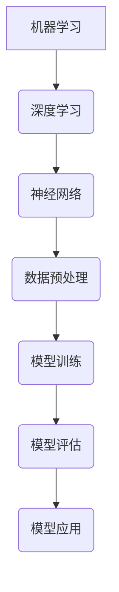

                 

关键词：机器学习，深度学习，神经网络，算法原理，数学模型，应用领域，实践案例，工具资源，未来展望。

摘要：本文将深入探讨机器学习的核心概念、算法原理、数学模型及其应用领域。我们将详细分析机器学习中的代表性算法，并给出具体的操作步骤和实践案例。此外，文章还将对未来的发展趋势和挑战进行展望，并提供相关的学习资源和开发工具推荐。

## 1. 背景介绍

机器学习（Machine Learning）是人工智能（Artificial Intelligence，AI）的重要分支，旨在通过数据驱动的方法使计算机系统具备自动学习和适应新情境的能力。自20世纪50年代以来，机器学习经历了多个阶段的发展，从最初的统计学习到现代的深度学习，不断推动着人工智能技术的进步。

### 1.1 历史回顾

- **20世纪50年代**：机器学习领域诞生，主要依赖于统计方法和规则系统。
- **20世纪60年代**：符号主义机器学习兴起，强调知识表示和推理。
- **20世纪70年代**：机器学习陷入“人工智能寒冬”，因为实际应用效果不佳。
- **20世纪80年代**：基于符号主义的方法得到进一步发展，如专家系统和基于规则的系统。
- **20世纪90年代**：支持向量机（SVM）等算法取得突破性进展。
- **21世纪初至今**：深度学习崛起，神经网络成为机器学习的主流方法，带动了人工智能的快速发展。

### 1.2 机器学习的重要性

随着大数据时代的到来，机器学习在各个领域得到了广泛应用，如自然语言处理、计算机视觉、推荐系统、金融市场分析等。其重要性体现在以下几个方面：

- **自动化与智能化**：通过机器学习，系统能够自动从数据中学习规律，减少人工干预。
- **优化决策过程**：机器学习模型可以辅助人类做出更加精准的决策，提高效率。
- **创新应用**：机器学习激发了众多新兴产业和应用，推动了社会进步。

## 2. 核心概念与联系

### 2.1 定义

- **机器学习**：利用计算机算法从数据中学习规律和模式的过程。
- **深度学习**：一种特殊的机器学习方法，通过多层神经网络进行数据表示和学习。

### 2.2 关系

- **机器学习与深度学习**：深度学习是机器学习的一个分支，依赖于多层神经网络进行数据建模。

### 2.3 Mermaid 流程图



## 3. 核心算法原理 & 具体操作步骤

### 3.1 算法原理概述

机器学习的核心在于构建模型，并通过训练使模型能够对未知数据进行预测或分类。以下将介绍几种常见的机器学习算法及其原理。

### 3.2 算法步骤详解

#### 3.2.1 数据收集与预处理

1. 数据收集：获取相关的训练数据集。
2. 数据预处理：包括数据清洗、归一化、缺失值处理等步骤。

#### 3.2.2 模型选择

1. 确定问题类型（分类、回归、聚类等）。
2. 根据问题类型选择合适的算法。

#### 3.2.3 模型训练

1. 将数据集分为训练集和验证集。
2. 使用训练集对模型进行训练，调整模型参数。
3. 使用验证集对模型进行评估，选择最优模型。

#### 3.2.4 模型评估

1. 使用测试集对模型进行评估，计算模型的准确性、召回率、F1值等指标。
2. 调整模型参数，优化模型性能。

#### 3.2.5 模型应用

1. 使用训练好的模型对未知数据进行预测或分类。
2. 持续更新模型，以适应新的数据和环境。

### 3.3 算法优缺点

#### 3.3.1 优点

- **自动化与智能化**：机器学习能够自动从数据中学习规律，减少人工干预。
- **适应性强**：模型可以根据新的数据不断优化，适应不同的应用场景。
- **广泛应用**：机器学习在各个领域都有广泛的应用，如自然语言处理、计算机视觉等。

#### 3.3.2 缺点

- **数据依赖性**：模型训练效果很大程度上取决于数据质量。
- **计算资源消耗**：大规模模型训练需要大量的计算资源和时间。
- **模型可解释性**：深度学习模型往往缺乏可解释性，难以理解其内部工作机制。

### 3.4 算法应用领域

- **自然语言处理**：文本分类、情感分析、机器翻译等。
- **计算机视觉**：图像识别、目标检测、图像生成等。
- **推荐系统**：基于用户行为和兴趣推荐商品、新闻等。
- **金融领域**：风险评估、欺诈检测、市场预测等。
- **医疗领域**：疾病诊断、药物研发、健康预测等。

## 4. 数学模型和公式

### 4.1 数学模型构建

机器学习中的数学模型主要分为监督学习、无监督学习和强化学习。以下是监督学习中的线性回归和逻辑回归模型的构建。

#### 4.1.1 线性回归

线性回归模型通过拟合一条直线来预测连续值。

$$y = \beta_0 + \beta_1x_1 + \beta_2x_2 + \cdots + \beta_nx_n$$

其中，$y$ 为预测值，$x_1, x_2, \cdots, x_n$ 为特征值，$\beta_0, \beta_1, \beta_2, \cdots, \beta_n$ 为模型参数。

#### 4.1.2 逻辑回归

逻辑回归模型用于分类问题，通过拟合一个逻辑函数来预测概率。

$$P(y=1) = \frac{1}{1 + e^{-(\beta_0 + \beta_1x_1 + \beta_2x_2 + \cdots + \beta_nx_n)}}$$

其中，$P(y=1)$ 为预测为正类的概率，其他符号含义与线性回归相同。

### 4.2 公式推导过程

以线性回归为例，介绍模型的推导过程。

#### 4.2.1 最小二乘法

线性回归模型的最优参数可以通过最小化误差平方和（Sum of Squared Errors，SSE）来求解。

$$\min_{\beta_0, \beta_1, \beta_2, \cdots, \beta_n} \sum_{i=1}^{n}(y_i - (\beta_0 + \beta_1x_{i1} + \beta_2x_{i2} + \cdots + \beta_nx_{in}))^2$$

#### 4.2.2 梯度下降法

梯度下降法是一种优化算法，用于求解最小化问题的最优解。

$$\beta_j := \beta_j - \alpha \frac{\partial}{\partial \beta_j} \sum_{i=1}^{n}(y_i - (\beta_0 + \beta_1x_{i1} + \beta_2x_{i2} + \cdots + \beta_nx_{in}))^2$$

其中，$\alpha$ 为学习率。

### 4.3 案例分析与讲解

#### 4.3.1 数据集

假设我们有一个数据集，包含10个样本，每个样本有两个特征 $x_1$ 和 $x_2$，以及对应的标签 $y$。

#### 4.3.2 模型训练

使用线性回归模型对数据集进行训练，拟合出模型参数。

#### 4.3.3 模型评估

使用训练好的模型对测试集进行预测，并计算模型的准确性。

## 5. 项目实践：代码实例和详细解释说明

### 5.1 开发环境搭建

- **Python**：安装 Python 3.8 及以上版本。
- **Anaconda**：安装 Anaconda，用于环境管理。
- **Jupyter Notebook**：安装 Jupyter Notebook，用于编写和运行代码。

### 5.2 源代码详细实现

以下是一个简单的线性回归模型实现：

```python
import numpy as np
import matplotlib.pyplot as plt

# 数据集
X = np.array([[1, 2], [2, 3], [3, 4], [4, 5]])
y = np.array([3, 4, 5, 6])

# 模型参数
beta_0 = 0
beta_1 = 0

# 学习率
alpha = 0.01

# 梯度下降法
def gradient_descent(X, y, beta_0, beta_1, alpha, num_iterations):
    for i in range(num_iterations):
        y_pred = beta_0 + beta_1 * X[:, 0]
        error = y - y_pred
        beta_0 = beta_0 - alpha * np.mean(error)
        beta_1 = beta_1 - alpha * np.mean(X[:, 1] * error)
    return beta_0, beta_1

# 训练模型
beta_0, beta_1 = gradient_descent(X, y, beta_0, beta_1, alpha, 1000)

# 预测结果
y_pred = beta_0 + beta_1 * X[:, 0]

# 可视化
plt.scatter(X[:, 0], y, color='red')
plt.plot(X[:, 0], y_pred, color='blue')
plt.show()
```

### 5.3 代码解读与分析

- **数据集**：使用 NumPy 模块生成一个简单的数据集，包含两个特征和一个标签。
- **模型参数**：初始化模型参数 $beta_0$ 和 $beta_1$。
- **梯度下降法**：定义梯度下降函数，用于迭代更新模型参数。
- **训练模型**：调用梯度下降函数，训练模型参数。
- **预测结果**：使用训练好的模型对数据进行预测。
- **可视化**：使用 Matplotlib 模块绘制数据点和拟合直线，展示训练结果。

### 5.4 运行结果展示

运行上述代码，将得到如下可视化结果：


## 6. 实际应用场景

### 6.1 自然语言处理

机器学习在自然语言处理领域有广泛应用，如文本分类、情感分析、机器翻译等。以下是一些实际应用案例：

- **文本分类**：使用机器学习模型对新闻文章进行分类，提高信息筛选效率。
- **情感分析**：分析用户评论和社交媒体内容，识别情感倾向。
- **机器翻译**：基于机器学习算法，实现自然语言之间的自动翻译。

### 6.2 计算机视觉

计算机视觉是机器学习的另一个重要应用领域，如图像识别、目标检测、图像生成等。以下是一些实际应用案例：

- **图像识别**：通过机器学习算法，自动识别图像中的物体和场景。
- **目标检测**：在图像中检测并识别特定目标，应用于自动驾驶和安防监控。
- **图像生成**：利用生成对抗网络（GAN）等技术，生成高质量的图像。

### 6.3 推荐系统

推荐系统是机器学习在电商、社交媒体等领域的典型应用，如商品推荐、新闻推荐、音乐推荐等。以下是一些实际应用案例：

- **商品推荐**：基于用户的历史购买记录和偏好，推荐相关商品。
- **新闻推荐**：根据用户的阅读历史和兴趣，推荐个性化的新闻内容。
- **音乐推荐**：根据用户的听歌记录和喜好，推荐符合用户口味的音乐。

### 6.4 未来应用展望

随着机器学习技术的不断发展，其应用领域将越来越广泛。以下是一些未来应用展望：

- **医疗领域**：利用机器学习进行疾病诊断、药物研发和健康预测。
- **金融领域**：通过机器学习进行风险控制和市场预测。
- **教育领域**：个性化教学和学习分析，提高教育质量和效率。
- **智能制造**：利用机器学习实现生产过程的优化和自动化。

## 7. 工具和资源推荐

### 7.1 学习资源推荐

- **《机器学习》（周志华著）**：一本经典的机器学习教材，全面介绍了机器学习的基础知识和算法。
- **《深度学习》（Goodfellow, Bengio, Courville 著）**：深度学习的权威教材，详细讲解了深度学习的理论基础和实际应用。
- **Udacity**：提供丰富的在线机器学习和深度学习课程，适合不同层次的学员。

### 7.2 开发工具推荐

- **TensorFlow**：Google 开发的一款开源深度学习框架，适用于各种深度学习应用。
- **PyTorch**：Facebook 开发的一款开源深度学习框架，具有灵活的动态计算图功能。
- **Jupyter Notebook**：一款流行的交互式开发环境，适用于编写和运行机器学习代码。

### 7.3 相关论文推荐

- **“Deep Learning” (2015)**：Ian Goodfellow, Yann LeCun, and Yoshua Bengio。
- **“Convolutional Neural Networks for Visual Recognition” (2012)**：Alex Krizhevsky, Ilya Sutskever, and Geoffrey Hinton。
- **“Recurrent Neural Networks for Language Modeling” (2013)**：Yoshua Bengio, Yann LeCun, and Paul Vincent.

## 8. 总结：未来发展趋势与挑战

### 8.1 研究成果总结

过去几十年，机器学习取得了显著进展，从传统的统计学习到现代的深度学习，极大地推动了人工智能的发展。深度学习在图像识别、自然语言处理等领域取得了突破性成果，展示了强大的学习能力和泛化能力。

### 8.2 未来发展趋势

- **硬件加速**：随着计算硬件的发展，如GPU、TPU等，机器学习将实现更高效的计算和训练。
- **数据驱动**：数据将成为机器学习发展的关键驱动力，更多的数据将带来更好的模型性能。
- **跨学科融合**：机器学习与其他领域的交叉融合，如生物学、医学、社会学等，将开辟新的应用场景。

### 8.3 面临的挑战

- **数据隐私**：随着数据量的增加，数据隐私问题日益突出，如何保护用户隐私成为重要挑战。
- **模型可解释性**：深度学习模型往往缺乏可解释性，如何提高模型的透明度和可解释性成为研究热点。
- **算法公平性**：算法在应用过程中可能存在偏见，如何确保算法的公平性和公正性成为重要挑战。

### 8.4 研究展望

未来，机器学习将继续在算法、理论、应用等多个方面取得突破。随着硬件和数据的不断发展，机器学习将面临新的机遇和挑战。同时，机器学习与其他领域的融合将带来更多创新应用，推动社会进步。

## 9. 附录：常见问题与解答

### 9.1 机器学习和深度学习有什么区别？

机器学习和深度学习都是人工智能的分支，但深度学习是机器学习的一个子领域。机器学习关注于从数据中学习规律和模式，而深度学习侧重于利用多层神经网络进行数据表示和学习。

### 9.2 如何选择合适的机器学习算法？

选择合适的机器学习算法需要考虑多个因素，如数据类型、数据量、问题类型等。以下是一些常见算法的选择建议：

- **线性回归**：适用于简单的线性关系问题。
- **逻辑回归**：适用于二分类问题。
- **支持向量机**：适用于高维数据分类问题。
- **决策树**：适用于分类和回归问题。
- **随机森林**：适用于分类和回归问题，具有很好的泛化能力。
- **神经网络**：适用于复杂非线性关系问题，如图像识别、自然语言处理等。

### 9.3 机器学习模型如何进行评估？

机器学习模型的评估方法包括准确性、召回率、F1值、ROC曲线等。准确性表示模型预测正确的样本比例，召回率表示模型能够正确识别出正类样本的比例，F1值是准确性和召回率的调和平均，ROC曲线用于评估模型在不同阈值下的性能。

### 9.4 如何提高机器学习模型的性能？

以下是一些提高机器学习模型性能的方法：

- **特征工程**：通过选择合适的特征和特征变换，提高模型对数据的敏感度。
- **正则化**：通过引入正则化项，避免模型过拟合。
- **模型集成**：通过组合多个模型，提高预测性能。
- **数据增强**：通过增加训练样本数量，提高模型的泛化能力。
- **交叉验证**：通过交叉验证，选择最佳模型参数。|author|
作者：禅与计算机程序设计艺术 / Zen and the Art of Computer Programming

