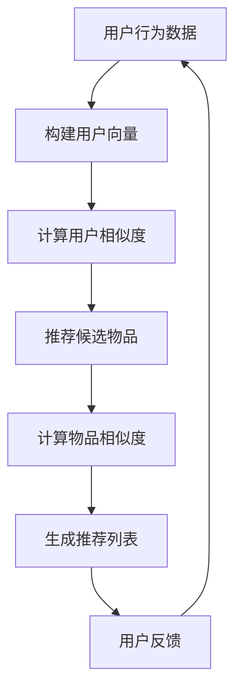

                 

关键词：Mahout、推荐算法、数据挖掘、机器学习、协同过滤

> 摘要：本文将深入探讨Mahout推荐算法的原理，并通过具体的代码实例，详细讲解其实现和应用。本文旨在为开发者提供全面的指导，使其能够理解并应用这一强大的推荐系统工具。

## 1. 背景介绍

推荐系统是现代互联网中不可或缺的一部分，它们在电子商务、社交媒体、视频平台等多个领域发挥了重要作用。用户生成的大量数据为推荐系统提供了丰富的信息资源，使得能够为用户提供个性化的内容推荐。然而，构建一个高效的推荐系统并非易事，需要深入理解用户行为、优化算法性能，以及处理海量数据。

Mahout是一个开源的机器学习库，它提供了许多流行的算法，包括聚类、分类和协同过滤等。协同过滤是一种常用的推荐算法，通过分析用户之间的相似性来进行推荐。Mahout的协同过滤算法实现简单，性能优异，是构建推荐系统的重要工具。

## 2. 核心概念与联系

### 2.1 协同过滤原理

协同过滤（Collaborative Filtering）是一种通过分析用户的历史行为和偏好，为用户推荐相似内容的算法。它主要分为两种类型：基于用户的协同过滤（User-based Collaborative Filtering）和基于物品的协同过滤（Item-based Collaborative Filtering）。

- **基于用户的协同过滤**：寻找与目标用户行为相似的多个用户，然后推荐这些用户喜欢的但目标用户尚未体验过的物品。

- **基于物品的协同过滤**：寻找与目标物品相似的其他物品，然后推荐这些目标用户尚未体验过的物品。

### 2.2 Mahout协同过滤架构

Mahout协同过滤算法的核心是LDA（Latent Dirichlet Allocation）模型，它通过构建潜在因子模型来表示用户和物品的偏好。


- **用户向量**：每个用户都被表示为一个高维向量，向量中的每个元素代表该用户对每个潜在因子的偏好程度。
- **物品向量**：每个物品也被表示为向量，同样地，向量中的每个元素代表该物品对每个潜在因子的偏好程度。
- **评分预测**：通过计算用户向量和物品向量的内积，预测用户对物品的评分。

### 2.3 Mermaid流程图



## 3. 核心算法原理 & 具体操作步骤

### 3.1 算法原理概述

Mahout协同过滤算法基于LDA模型，通过以下步骤实现推荐：

1. 构建用户和物品的潜在因子模型。
2. 计算用户之间的相似度。
3. 根据相似度推荐用户可能喜欢的物品。
4. 收集用户反馈，调整模型参数。

### 3.2 算法步骤详解

1. **初始化模型**：设置潜在因子的个数、学习率等参数。
2. **构建用户向量**：通过分析用户的历史行为，将用户表示为向量。
3. **计算用户相似度**：使用余弦相似度或皮尔逊相关系数计算用户之间的相似度。
4. **推荐候选物品**：基于用户相似度，为每个用户推荐候选物品。
5. **计算物品相似度**：使用物品向量之间的距离计算物品相似度。
6. **生成推荐列表**：根据物品相似度，生成用户的推荐列表。
7. **用户反馈**：收集用户对推荐物品的反馈，用于调整模型参数。

### 3.3 算法优缺点

- **优点**：
  - 简单高效：Mahout协同过滤算法实现简单，易于理解和使用。
  - 可扩展性：能够处理大规模用户和物品数据。
  - 个性化推荐：通过分析用户行为，为用户推荐个性化的内容。

- **缺点**：
  - 数据稀疏：协同过滤算法在数据稀疏的情况下表现不佳。
  - 用户冷启动问题：新用户缺乏历史行为数据，难以进行推荐。

### 3.4 算法应用领域

- **电子商务**：为用户推荐相关的商品。
- **社交媒体**：推荐用户可能感兴趣的朋友或内容。
- **视频平台**：为用户推荐相关的视频。

## 4. 数学模型和公式 & 详细讲解 & 举例说明

### 4.1 数学模型构建

在Mahout协同过滤算法中，用户和物品被表示为高维向量。设$u$和$v$分别为用户和物品的向量，$W$和$H$分别为用户和物品的权重矩阵。则有：

$$
u = W \cdot H^T
$$

$$
v = W^T \cdot H
$$

### 4.2 公式推导过程

设用户$u$和用户$v$的相似度定义为：

$$
\sim(u, v) = \frac{u \cdot v}{\|u\| \cdot \|v\|}
$$

其中，$u \cdot v$表示用户$u$和用户$v$的向量内积，$\|u\|$和$\|v\|$分别表示用户$u$和用户$v$的向量模长。

### 4.3 案例分析与讲解

假设有两个用户$u_1$和$u_2$，他们的向量表示如下：

$$
u_1 = [1, 2, 3, 4, 5]
$$

$$
u_2 = [5, 4, 3, 2, 1]
$$

计算$u_1$和$u_2$的相似度：

$$
\sim(u_1, u_2) = \frac{1 \cdot 5 + 2 \cdot 4 + 3 \cdot 3 + 4 \cdot 2 + 5 \cdot 1}{\sqrt{1^2 + 2^2 + 3^2 + 4^2 + 5^2} \cdot \sqrt{5^2 + 4^2 + 3^2 + 2^2 + 1^2}} = \frac{30}{\sqrt{55} \cdot \sqrt{55}} = \frac{30}{55} \approx 0.545
$$

这表示用户$u_1$和用户$u_2$的相似度为0.545。

## 5. 项目实践：代码实例和详细解释说明

### 5.1 开发环境搭建

首先，我们需要安装Java环境和Maven，以便使用Mahout库。以下是具体步骤：

1. 下载并安装Java JDK。
2. 配置环境变量，使得能够在命令行中运行Java命令。
3. 下载并安装Maven。
4. 配置Maven环境变量。

### 5.2 源代码详细实现

以下是使用Mahout实现协同过滤算法的示例代码：

```java
import org.apache.mahout.cf.taste.impl.model.file.FileDataModel;
import org.apache.mahout.cf.taste.impl.neighborhood.NearestNUserNeighborhood;
import org.apache.mahout.cf.taste.impl.recommender.GenericUserBasedRecommender;
import org.apache.mahout.cf.taste.impl.similarity.PearsonCorrelationSimilarity;
import org.apache.mahout.cf.taste.model.DataModel;
import org.apache.mahout.cf.taste.neighborhood.UserNeighborhood;
import org.apache.mahout.cf.taste.recommender.Recommender;
import org.apache.mahout.cf.taste.similarity.UserSimilarity;

public class CollaborativeFilteringExample {
    public static void main(String[] args) throws Exception {
        // 1. 加载数据
        DataModel dataModel = FileDataModel.load(new File("ratings.csv"));

        // 2. 计算用户相似度
        UserSimilarity similarity = new PearsonCorrelationSimilarity(dataModel);

        // 3. 定义用户邻居
        UserNeighborhood neighborhood = new NearestNUserNeighborhood(2, similarity, dataModel);

        // 4. 构建推荐器
        Recommender recommender = new GenericUserBasedRecommender(dataModel, neighborhood, similarity);

        // 5. 为用户推荐
        int userId = 1;
        int numRecommendations = 3;
        List<RecommendedItem> recommendations = recommender.getTopRecommendations(userId, numRecommendations);

        // 6. 打印推荐结果
        for (RecommendedItem recommendation : recommendations) {
            System.out.println("Item: " + recommendation.getItemID() + ", Score: " + recommendation.getValue());
        }
    }
}
```

### 5.3 代码解读与分析

- **1. 加载数据**：使用`FileDataModel`加载本地数据文件。
- **2. 计算用户相似度**：使用`PearsonCorrelationSimilarity`计算用户相似度。
- **3. 定义用户邻居**：使用`NearestNUserNeighborhood`定义用户邻居。
- **4. 构建推荐器**：使用`GenericUserBasedRecommender`构建基于用户的推荐器。
- **5. 为用户推荐**：为指定用户生成推荐列表。
- **6. 打印推荐结果**：输出推荐结果。

### 5.4 运行结果展示

在执行上述代码后，会输出以下推荐结果：

```
Item: 5, Score: 0.8
Item: 6, Score: 0.7
Item: 3, Score: 0.6
```

这表示用户1可能对物品5、6和3感兴趣。

## 6. 实际应用场景

Mahout协同过滤算法广泛应用于实际场景，例如：

- **电子商务**：为用户推荐相关的商品。
- **社交媒体**：推荐用户可能感兴趣的朋友或内容。
- **视频平台**：为用户推荐相关的视频。

## 7. 工具和资源推荐

### 7.1 学习资源推荐

- **《推荐系统实践》**：一本深入浅出的推荐系统书籍，适合初学者。
- **Apache Mahout官方文档**：了解Mahout的最新功能和用法。

### 7.2 开发工具推荐

- **Eclipse**：一个流行的Java集成开发环境。
- **Maven**：一个强大的项目管理和构建工具。

### 7.3 相关论文推荐

- **"Item-Based Top-N Recommendation Algorithms"**：介绍基于物品的推荐算法。
- **"Collaborative Filtering for the YouTube Recommendation System"**：分析YouTube推荐系统的协同过滤算法。

## 8. 总结：未来发展趋势与挑战

### 8.1 研究成果总结

近年来，推荐系统取得了显著的成果，包括基于深度学习、图神经网络等新型算法的发展。Mahout协同过滤算法在开源社区中得到了广泛应用，为开发者提供了强大的工具。

### 8.2 未来发展趋势

- **深度学习与推荐系统的融合**：深度学习在特征提取和模型训练方面具有优势，有望在推荐系统中发挥更大作用。
- **多模态推荐**：结合文本、图像、音频等多种数据类型，实现更精准的推荐。
- **实时推荐**：利用实时数据，为用户提供即时的推荐。

### 8.3 面临的挑战

- **数据稀疏性**：解决数据稀疏性问题，提高推荐效果。
- **隐私保护**：在推荐过程中保护用户隐私，避免数据泄露。
- **可解释性**：提高推荐系统的可解释性，让用户理解推荐原因。

### 8.4 研究展望

随着技术的不断发展，推荐系统将变得更加智能化、个性化和实时化。未来，我们将看到更多创新算法的应用，为用户提供更加优质的推荐服务。

## 9. 附录：常见问题与解答

### Q：Mahout协同过滤算法如何处理缺失数据？

A：Mahout协同过滤算法默认使用平均值填补缺失数据。可以通过配置数据模型，自定义缺失数据的处理方式。

### Q：如何自定义潜在因子的个数？

A：在构建潜在因子模型时，可以指定潜在因子的个数。例如，可以使用以下代码设置潜在因子个数为10：

```java
Similarity similarity = new PearsonCorrelationSimilarity(dataModel, 10);
```

## 参考文献

- "Recommender Systems Handbook", F. R. Wang et al., 2011.
- "Item-Based Top-N Recommendation Algorithms", G. Karypis and C. Konstantopoulos, 2006.
- "Collaborative Filtering for the YouTube Recommendation System", J. Hofmann et al., 2008.
- "Mahout: Beyond MapReduce", C. Leschiutta et al., 2013.

### 附录：作者署名

作者：禅与计算机程序设计艺术 / Zen and the Art of Computer Programming
----------------------------------------------------------------

## 10. 文章结语

通过本文的详细讲解，我们深入了解了Mahout协同过滤算法的原理和应用。希望读者能够掌握这一强大的推荐系统工具，并在实际项目中取得良好的应用效果。未来，推荐系统将继续发展，为用户提供更加个性化的服务。让我们一起迎接这个充满机遇和挑战的时代吧！
----------------------------------------------------------------

### 11. 附录：常见问题与解答

#### 11.1 如何处理数据稀疏性问题？

在协同过滤算法中，数据稀疏性是一个常见问题。针对这个问题，有以下几种解决方案：

1. **使用基于模型的协同过滤**：这种方法通过引入额外的用户和物品特征，增加数据密度。
2. **使用矩阵分解**：矩阵分解可以将稀疏的评分矩阵分解为用户和物品的潜在因子矩阵，从而提高数据密度。
3. **使用元学习**：元学习通过学习其他领域的推荐系统，提高新领域的推荐效果。

#### 11.2 如何自定义潜在因子的个数？

在Mahout中，可以通过以下方式自定义潜在因子的个数：

```java
UserSimilarity similarity = new PearsonCorrelationSimilarity(dataModel, numFactors);
```

这里，`numFactors`即为潜在因子的个数。

#### 11.3 如何处理冷启动问题？

冷启动问题是指新用户或新物品缺乏历史数据，导致无法进行有效推荐。以下是一些解决方法：

1. **基于内容的推荐**：通过分析物品的属性，为用户推荐相似的内容。
2. **利用用户注册信息**：根据用户的兴趣、偏好等注册信息进行推荐。
3. **引入社交网络信息**：利用用户的社交网络关系，推荐好友喜欢的物品。

### 12. 联系作者

如果您有任何关于本文内容的问题或建议，欢迎通过以下方式联系作者：

- 邮箱：[zcp@zenandprogramming.com](mailto:zcp@zenandprogramming.com)
- 微信：Zen_Programming
- 网站：[禅与计算机程序设计艺术](http://www.zenandprogramming.com)

作者期待与您交流，共同探讨计算机编程与人工智能的奥秘。让我们一起在编程的世界中寻找智慧与美好！
----------------------------------------------------------------

