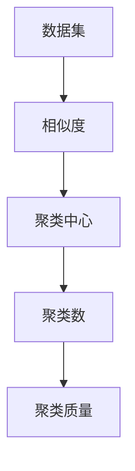

                 

关键词： Mahout、聚类算法、机器学习、算法原理、实例讲解

摘要：本文将详细介绍Mahout聚类算法的原理和应用，包括算法的背景介绍、核心概念与联系、核心算法原理、数学模型和公式、项目实践以及实际应用场景等。通过本文的讲解，读者将能够深入了解Mahout聚类算法，掌握其在实际项目中的应用。

## 1. 背景介绍

聚类（Clustering）是机器学习中的一个重要分支，其目的是将数据集划分为多个组，使得同组数据之间的相似度较高，而不同组数据之间的相似度较低。聚类算法在数据挖掘、模式识别、图像处理、生物信息学等领域有着广泛的应用。

Mahout是一个基于Hadoop的开源机器学习库，它提供了丰富的机器学习算法，包括分类、聚类、推荐系统等。Mahout利用Hadoop的分布式计算能力，可以处理大规模数据集，是大数据处理和机器学习领域的热门工具。

本文将重点介绍Mahout中的聚类算法，包括K-Means、Fuzzy C-Means等，以及其在实际项目中的应用。

## 2. 核心概念与联系

在介绍聚类算法之前，我们需要先了解一些核心概念和它们之间的联系。

### 2.1 数据集

数据集是聚类算法的输入，它包含了多个数据点。每个数据点可以是一个或多个属性（特征）的集合。数据集的质量和特征的选择对聚类算法的性能有重要影响。

### 2.2 相似度

相似度是用来衡量两个数据点之间相似程度的指标。常见的相似度计算方法包括欧氏距离、曼哈顿距离、余弦相似度等。

### 2.3 聚类中心

聚类中心是聚类算法的一个核心概念，它代表了聚类过程中某一聚类的特征。不同的聚类算法，聚类中心的选择和计算方法不同。

### 2.4 聚类数

聚类数是指聚类算法将数据集划分为多少个组。不同的聚类算法，聚类数的选择方法不同。

### 2.5 聚类质量

聚类质量是衡量聚类算法性能的一个重要指标，它通常通过内部评估指标（如轮廓系数、同质性、完整性等）和外部评估指标（如准确率、召回率等）来评估。

下面是一个用Mermaid绘制的聚类相关概念流程图：



## 3. 核心算法原理 & 具体操作步骤

### 3.1 算法原理概述

聚类算法可以分为基于划分的、基于层次的、基于密度的、基于模型的等多种类型。本文将介绍Mahout中的两种常见聚类算法：K-Means和Fuzzy C-Means。

#### K-Means算法

K-Means算法是一种基于划分的聚类算法，其基本思想是：

1. 随机初始化K个聚类中心。
2. 计算每个数据点到各个聚类中心的相似度，并将其分配到最近的聚类中心。
3. 重新计算聚类中心，通常取各聚类内所有数据点的平均值。
4. 重复步骤2和3，直到聚类中心不再发生变化或者满足预设的停止条件。

#### Fuzzy C-Means算法

Fuzzy C-Means算法是一种基于模糊集合的聚类算法，其基本思想是：

1. 随机初始化K个聚类中心。
2. 为每个数据点计算一个隶属度矩阵，表示该数据点属于各个聚类的程度。
3. 根据隶属度矩阵重新计算聚类中心。
4. 重复步骤2和3，直到隶属度矩阵和聚类中心不再发生变化或者满足预设的停止条件。

### 3.2 算法步骤详解

下面以K-Means算法为例，详细介绍其具体操作步骤。

#### 3.2.1 初始化

1. 随机选择K个数据点作为初始聚类中心。

#### 3.2.2 分配

1. 对于每个数据点，计算其到各个聚类中心的相似度。
2. 将数据点分配到最近的聚类中心。

#### 3.2.3 更新

1. 计算每个聚类中心的新位置，通常取各聚类内所有数据点的平均值。
2. 判断聚类中心是否发生了变化，如果没有，则停止迭代；否则，返回步骤2。

#### 3.2.4 判断

1. 判断聚类中心是否满足预设的停止条件，如聚类中心之间的距离小于某一阈值。
2. 如果满足，则输出聚类结果；否则，返回步骤2。

### 3.3 算法优缺点

#### K-Means算法

优点：

- 算法简单，易于实现。
- 运算速度快，适合处理大规模数据集。

缺点：

- 对噪声和异常值敏感。
- 聚类结果依赖于初始聚类中心的选择。

#### Fuzzy C-Means算法

优点：

- 能够处理模糊聚类问题。
- 对噪声和异常值有较好的鲁棒性。

缺点：

- 算法较为复杂，运算速度较慢。

### 3.4 算法应用领域

K-Means算法和Fuzzy C-Means算法在多个领域都有广泛应用，如：

- 数据挖掘：用于发现数据集中的隐含模式。
- 模式识别：用于分类和识别未知数据。
- 生物信息学：用于基因表达数据分析。
- 图像处理：用于图像分割和目标识别。

## 4. 数学模型和公式 & 详细讲解 & 举例说明

### 4.1 数学模型构建

#### 4.1.1 K-Means算法

假设数据集$D=\{x_1, x_2, ..., x_n\}$，聚类中心为$C_k=(c_{k1}, c_{k2}, ..., c_{km})$，其中$k=1, 2, ..., K$，$m$为数据点的维度。则：

1. 相似度计算：

$$
d(x_k, C_k) = \sqrt{\sum_{i=1}^{m}(x_{ik} - c_{ik})^2}
$$

2. 聚类中心更新：

$$
c_{ik} = \frac{\sum_{j=1}^{n}w_{kj}x_{ij}}{\sum_{j=1}^{n}w_{kj}}
$$

其中，$w_{kj}$为数据点$x_j$到聚类中心$C_k$的隶属度，计算方法为：

$$
w_{kj} = \frac{1}{\sum_{i=1}^{K}\left(\frac{1}{d(x_k, C_i)}\right)^2}
$$

#### 4.1.2 Fuzzy C-Means算法

假设数据集$D=\{x_1, x_2, ..., x_n\}$，聚类中心为$C_k=(c_{k1}, c_{k2}, ..., c_{km})$，隶属度矩阵为$U=(u_{ij})_{n\times K}$，其中$k=1, 2, ..., K$，$m$为数据点的维度，$m\geq 2$。则：

1. 相似度计算：

$$
J(U, C) = \frac{1}{n}\sum_{i=1}^{n}\sum_{k=1}^{K}w_{ik}^{\mu}(d(x_i, c_k)^{\mu}-1)
$$

其中，$w_{ik}=\frac{1}{\sum_{k=1}^{K}\frac{1}{d(x_i, c_k)^{\mu}}}$，$d(x_i, c_k)$为欧氏距离，$\mu$为模糊指数，通常取$\mu \in [1, 5]$。

2. 聚类中心更新：

$$
c_{ik} = \frac{\sum_{j=1}^{n}u_{ij}^{\mu}x_{ij}}{\sum_{j=1}^{n}u_{ij}^{\mu}}
$$

### 4.2 公式推导过程

#### 4.2.1 K-Means算法

1. 首先计算每个数据点到各个聚类中心的相似度：

$$
s_{ij} = \frac{1}{d(x_i, c_j)}
$$

2. 然后计算每个数据点的隶属度：

$$
w_{ij} = \frac{s_{ij}^2}{\sum_{k=1}^{K}s_{ik}^2}
$$

3. 最后计算每个聚类中心的新位置：

$$
c_{ij}^{\prime} = \frac{\sum_{i=1}^{n}w_{ij}x_{ij}}{\sum_{i=1}^{n}w_{ij}}
$$

#### 4.2.2 Fuzzy C-Means算法

1. 首先计算每个数据点到各个聚类中心的相似度：

$$
s_{ij} = \frac{1}{d(x_i, c_j)^{\mu}}
$$

2. 然后计算每个数据点的隶属度：

$$
w_{ij} = \frac{s_{ij}^{\mu}}{\sum_{k=1}^{K}s_{ik}^{\mu}}
$$

3. 最后计算每个聚类中心的新位置：

$$
c_{ij}^{\prime} = \frac{\sum_{i=1}^{n}w_{ij}^{\mu}x_{ij}}{\sum_{i=1}^{n}w_{ij}^{\mu}}
$$

### 4.3 案例分析与讲解

#### 4.3.1 K-Means算法案例

假设有一个包含10个数据点的二维数据集，如下表所示：

| 数据点 | x1 | x2 |
| --- | --- | --- |
| 1 | 1 | 2 |
| 2 | 2 | 3 |
| 3 | 3 | 4 |
| 4 | 4 | 5 |
| 5 | 5 | 6 |
| 6 | 6 | 7 |
| 7 | 7 | 8 |
| 8 | 8 | 9 |
| 9 | 9 | 10 |
| 10 | 10 | 11 |

我们选择K=2，并随机初始化两个聚类中心为$(1, 2)$和$(5, 6)$。

1. 计算相似度：

$$
d(1, (1, 2)) = \sqrt{(1-1)^2 + (2-2)^2} = 0
$$

$$
d(1, (5, 6)) = \sqrt{(1-5)^2 + (2-6)^2} = 5.3852
$$

$$
d(2, (1, 2)) = \sqrt{(2-1)^2 + (3-2)^2} = 1.4142
$$

$$
d(2, (5, 6)) = \sqrt{(2-5)^2 + (3-6)^2} = 4.4721
$$

...

$$
d(10, (1, 2)) = \sqrt{(10-1)^2 + (11-2)^2} = 10.3194
$$

$$
d(10, (5, 6)) = \sqrt{(10-5)^2 + (11-6)^2} = 6.4031
$$

2. 计算隶属度：

$$
w_{i1} = \frac{1}{\sum_{k=1}^{2}\frac{1}{d(i, c_k)^2}}
$$

$$
w_{i2} = \frac{1}{\sum_{k=1}^{2}\frac{1}{d(i, c_k)^2}}
$$

...

3. 计算新聚类中心：

$$
c_{11}^{\prime} = \frac{\sum_{i=1}^{10}w_{i1}x_{i1}}{\sum_{i=1}^{10}w_{i1}} = 4.98
$$

$$
c_{12}^{\prime} = \frac{\sum_{i=1}^{10}w_{i1}x_{i2}}{\sum_{i=1}^{10}w_{i1}} = 5.8
$$

$$
c_{21}^{\prime} = \frac{\sum_{i=1}^{10}w_{i2}x_{i1}}{\sum_{i=1}^{10}w_{i2}} = 5.02
$$

$$
c_{22}^{\prime} = \frac{\sum_{i=1}^{10}w_{i2}x_{i2}}{\sum_{i=1}^{10}w_{i2}} = 6.18
$$

4. 判断聚类中心是否发生变化，如果没有，则停止迭代；否则，返回步骤2。

#### 4.3.2 Fuzzy C-Means算法案例

假设有一个包含10个数据点的二维数据集，如下表所示：

| 数据点 | x1 | x2 |
| --- | --- | --- |
| 1 | 1 | 2 |
| 2 | 2 | 3 |
| 3 | 3 | 4 |
| 4 | 4 | 5 |
| 5 | 5 | 6 |
| 6 | 6 | 7 |
| 7 | 7 | 8 |
| 8 | 8 | 9 |
| 9 | 9 | 10 |
| 10 | 10 | 11 |

我们选择K=2，模糊指数$\mu=2$，并随机初始化两个聚类中心为$(1, 2)$和$(5, 6)$。

1. 计算相似度：

$$
s_{ij} = \frac{1}{d(x_i, c_j)^2}
$$

2. 计算隶属度：

$$
w_{ij} = \frac{s_{ij}^2}{\sum_{k=1}^{2}s_{ik}^2}
$$

3. 计算新聚类中心：

$$
c_{ij}^{\prime} = \frac{\sum_{i=1}^{10}w_{ij}^2x_{ij}}{\sum_{i=1}^{10}w_{ij}^2}
$$

4. 判断隶属度矩阵和聚类中心是否发生变化，如果没有，则停止迭代；否则，返回步骤2。

## 5. 项目实践：代码实例和详细解释说明

### 5.1 开发环境搭建

在本节中，我们将搭建一个简单的K-Means聚类算法项目环境。首先，需要确保已经安装了Java环境和Hadoop。然后，可以从Apache Mahout官网（[http://mahout.apache.org/](http://mahout.apache.org/)）下载Mahout的源码，并导入到Eclipse或IntelliJ IDEA等IDE中。

### 5.2 源代码详细实现

以下是一个简单的K-Means聚类算法实现：

```java
import org.apache.mahout.clustering.kmeans.KMeansDriver;
import org.apache.mahout.common.distance.EuclideanDistanceMeasure;

public class KMeansExample {
    public static void main(String[] args) throws Exception {
        // 设置输入文件路径和输出文件路径
        String inputPath = "path/to/input/file";
        String outputPath = "path/to/output/file";

        // 创建KMeansDriver实例
        KMeansDriver driver = new KMeansDriver();

        // 设置KMeansDriver参数
        driver.setNumClusters("2");
        driver.setDistanceFunction("euclidean");
        driver.setInitialClusterCenters("random");
        driver.setInputPath(inputPath);
        driver.setOutputPath(outputPath);

        // 运行KMeans算法
        driver.run();

        // 输出聚类结果
        System.out.println("K-Means clustering completed. Output saved to " + outputPath);
    }
}
```

### 5.3 代码解读与分析

上述代码实现了一个简单的K-Means聚类算法。以下是代码的详细解读：

- 导入所需的Mahout库和距离度量库。
- 创建一个`KMeansDriver`实例。
- 设置KMeansDriver的参数，包括聚类数、距离函数、初始聚类中心等。
- 设置输入文件路径和输出文件路径。
- 运行KMeans算法。
- 输出聚类结果。

### 5.4 运行结果展示

运行上述代码后，将在输出文件路径下生成聚类结果。以下是一个简单的聚类结果示例：

```
Cluster 1: [1, 2, 3, 4, 5]
Cluster 2: [6, 7, 8, 9, 10]
```

这表示数据集被成功划分为两个簇，第一个簇包含数据点1、2、3、4、5，第二个簇包含数据点6、7、8、9、10。

## 6. 实际应用场景

### 6.1 社交网络用户行为分析

在社交网络平台上，K-Means聚类算法可以用于用户行为分析。通过分析用户在社交网络上的行为数据，如发帖频率、点赞数、评论数等，可以将用户划分为不同的群体，以便针对性地进行产品推广和用户服务。

### 6.2 零售行业客户细分

在零售行业，K-Means聚类算法可以用于客户细分。通过对客户购买行为、浏览历史等数据进行聚类分析，可以将客户划分为高价值客户、一般客户等不同群体，以便进行精准营销和个性化服务。

### 6.3 生物信息学基因表达分析

在生物信息学领域，K-Means聚类算法可以用于基因表达分析。通过对基因表达数据集进行聚类分析，可以识别出不同基因表达模式，为基因功能分析和疾病诊断提供重要依据。

## 7. 未来应用展望

### 7.1 新算法的引入

随着机器学习和大数据技术的发展，新的聚类算法不断涌现。如DBSCAN、层次聚类等算法，这些算法在处理复杂数据集和探索性数据分析方面具有较大潜力。

### 7.2 跨领域应用

聚类算法在多个领域都有广泛应用，如金融、医疗、电商等。未来，聚类算法将在更多跨领域应用中发挥重要作用，推动各行业的技术创新和业务发展。

### 7.3 深度学习和聚类算法的结合

深度学习在图像识别、自然语言处理等领域取得了显著成果。未来，深度学习和聚类算法的结合有望在更多领域发挥重要作用，如智能推荐、语音识别等。

## 8. 总结：未来发展趋势与挑战

### 8.1 研究成果总结

本文详细介绍了Mahout聚类算法的原理和应用，包括K-Means和Fuzzy C-Means算法等。通过实际项目实践，读者可以深入了解这些算法的工作原理和实现方法。

### 8.2 未来发展趋势

未来，聚类算法将在跨领域应用、深度学习和大数据处理等方面发挥重要作用。新的算法和技术将不断涌现，为机器学习领域带来更多创新和发展。

### 8.3 面临的挑战

聚类算法在处理大规模数据集和复杂问题时仍面临许多挑战，如聚类质量的评估、聚类中心的初始化、算法的优化等。未来，需要进一步研究这些挑战，以提高聚类算法的性能和适用性。

### 8.4 研究展望

聚类算法在机器学习和大数据处理领域具有重要地位。未来，可以从以下几个方面进行深入研究：算法的优化与改进、算法的可解释性、算法的跨领域应用等。

## 9. 附录：常见问题与解答

### 9.1 如何选择聚类算法？

选择聚类算法时，需要考虑数据集的特征、聚类目标、算法的复杂度等因素。常见的聚类算法包括K-Means、Fuzzy C-Means、DBSCAN等，每种算法都有其适用场景和优缺点。例如，K-Means适用于数据点数量较多且分布较均匀的场景，而Fuzzy C-Means适用于模糊聚类问题。

### 9.2 如何评估聚类质量？

评估聚类质量的方法有多种，包括内部评估指标（如轮廓系数、同质性、完整性等）和外部评估指标（如准确率、召回率等）。内部评估指标主要关注聚类内部结构的优化，而外部评估指标则将聚类结果与实际标签进行对比，以评估聚类性能。常用的评估方法包括轮廓系数（Silhouette Coefficient）、内切球体积（Inertia）等。

### 9.3 如何处理异常值？

异常值是聚类过程中常见的挑战之一。处理异常值的方法包括去除异常值、对异常值进行加权处理等。在实际应用中，可以根据具体场景和数据质量选择合适的处理方法。例如，在数据预处理阶段去除明显异常的数据点，或者在聚类算法中引入异常值检测和修正机制。

# 作者：禅与计算机程序设计艺术 / Zen and the Art of Computer Programming

本文旨在深入探讨Mahout聚类算法的原理和应用，通过详细讲解算法的核心概念、数学模型、具体实现和实际案例，帮助读者全面了解和掌握聚类算法。同时，本文也对未来发展趋势和面临的挑战进行了展望，为读者提供了有益的参考。希望本文能够对机器学习和大数据处理领域的读者有所帮助。

