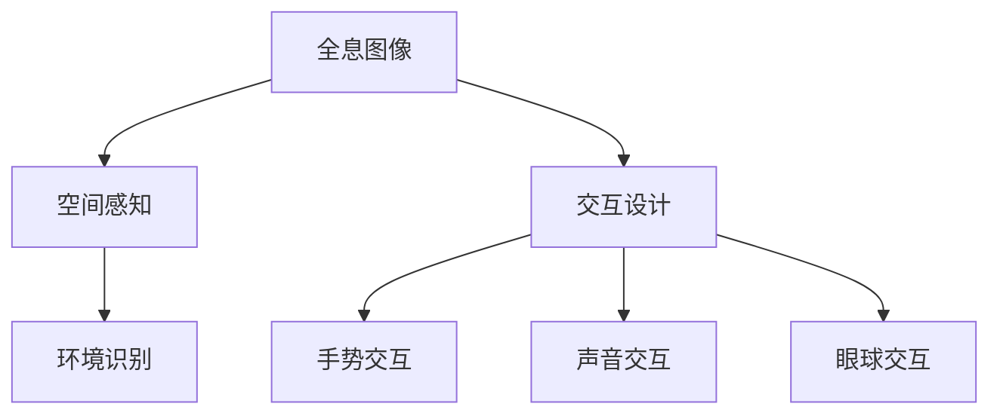

                 

 关键词：HoloLens、混合现实、头戴设备、AR、VR、MR、开发环境、应用场景、未来展望

> 摘要：本文深入探讨了微软的HoloLens头戴式混合现实设备。通过介绍其背景、核心概念与联系，详细讲解了其核心算法原理和操作步骤，并展示了实际项目实践中的代码实例。同时，文章还分析了HoloLens在实际应用场景中的优势与挑战，并展望了其未来的发展趋势。

## 1. 背景介绍

### 1.1 HoloLens的诞生

HoloLens是由微软开发的一款混合现实（Mixed Reality，MR）头戴式设备。它于2015年正式发布，标志着微软在VR（虚拟现实）和AR（增强现实）领域的重要布局。HoloLens的问世，不仅展示了微软在计算机图形、人工智能、传感器融合等领域的深厚技术积累，也引领了MR设备的潮流。

### 1.2 HoloLens的市场定位

HoloLens定位于专业和企业用户，尤其适用于教育、医疗、建筑、制造业等领域。与传统的VR和AR设备不同，HoloLens的混合现实技术使得用户可以在真实环境中与虚拟对象进行交互，实现了虚拟和现实世界的无缝融合。

### 1.3 HoloLens的技术特点

HoloLens具备以下几个显著的技术特点：

- **全沉浸式体验**：通过内置的高分辨率显示屏和声学系统，HoloLens为用户提供沉浸式的视觉和听觉体验。
- **空间感知**：HoloLens配备多个传感器，包括摄像头、激光雷达、加速度计和陀螺仪，能够实时捕捉用户周围的空间环境。
- **交互方式**：用户可以通过手势、声音和眼球运动与HoloLens进行交互，实现了直观、自然的用户操作。
- **软件生态系统**：HoloLens拥有自己的开发平台，即Microsoft HoloLens SDK，开发者可以利用该平台创建和运行混合现实应用。

## 2. 核心概念与联系

### 2.1 混合现实（MR）的基本概念

混合现实（MR）是虚拟现实（VR）和增强现实（AR）的融合。它不仅将虚拟对象叠加到现实世界中，还能让虚拟对象与现实环境进行交互。MR的关键在于提供一种与现实世界无缝融合的体验，使得虚拟内容仿佛真正存在于现实空间中。

### 2.2 HoloLens的核心概念

HoloLens的核心概念包括以下几个方面：

- **全息图像**：HoloLens通过全息图像技术，将虚拟内容以三维形式呈现在用户面前。
- **空间感知**：通过传感器捕捉用户周围的环境，HoloLens能够准确识别空间位置和物体形状，实现虚拟对象与现实环境的准确融合。
- **交互设计**：HoloLens提供手势、声音和眼球运动等多种交互方式，使用户可以自然地与虚拟内容进行交互。

### 2.3 Mermaid 流程图（核心概念原理和架构）



## 3. 核心算法原理 & 具体操作步骤

### 3.1 算法原理概述

HoloLens的核心算法原理主要涉及图像处理、传感器融合和交互设计等方面。具体来说，HoloLens通过以下步骤实现混合现实体验：

- **图像处理**：HoloLens使用摄像头捕捉用户周围的环境图像，并通过图像处理技术提取关键信息，如物体边缘和纹理。
- **传感器融合**：通过激光雷达和加速度计等传感器，HoloLens能够实时获取用户的空间位置和运动信息，并将这些信息与图像处理结果进行融合。
- **交互设计**：根据用户的手势、声音和眼球运动，HoloLens生成相应的交互反馈，如虚拟对象的移动、放大或缩小等。

### 3.2 算法步骤详解

#### 3.2.1 图像处理

- **图像捕获**：HoloLens的摄像头以高帧率捕捉用户周围的环境图像。
- **图像增强**：通过图像增强技术，提高图像的对比度和清晰度。
- **物体识别**：使用图像识别算法，提取图像中的关键信息，如物体边缘和纹理。

#### 3.2.2 传感器融合

- **空间位置**：通过激光雷达和加速度计，HoloLens获取用户的空间位置信息。
- **运动跟踪**：利用惯性测量单元（IMU）和视觉传感器，HoloLens实时跟踪用户和周围物体的运动轨迹。
- **数据融合**：将空间位置和运动信息与图像处理结果进行融合，生成精确的环境模型。

#### 3.2.3 交互设计

- **手势识别**：通过手势识别算法，HoloLens识别用户的手势，如点击、拖拽等。
- **声音识别**：通过声音识别算法，HoloLens解析用户的声音指令，如语音控制、语音搜索等。
- **眼球跟踪**：通过眼球跟踪技术，HoloLens了解用户的注视点，实现精准的交互。

### 3.3 算法优缺点

#### 优点

- **沉浸式体验**：HoloLens提供沉浸式的视觉和听觉体验，使用户仿佛置身于虚拟环境中。
- **空间感知**：通过传感器融合技术，HoloLens能够准确识别空间位置和物体形状，实现虚拟对象与现实环境的无缝融合。
- **多样化交互**：HoloLens支持多种交互方式，如手势、声音和眼球运动，使用户可以自然地与虚拟内容进行交互。

#### 缺点

- **成本较高**：HoloLens的设备成本较高，可能不适合个人用户。
- **性能限制**：当前HoloLens的硬件性能仍有一定限制，可能无法满足某些复杂应用的需求。

### 3.4 算法应用领域

HoloLens的混合现实技术广泛应用于多个领域：

- **教育**：通过HoloLens，学生可以身临其境地学习历史事件、科学实验等。
- **医疗**：医生可以利用HoloLens进行远程手术指导、患者检查等。
- **建筑**：设计师可以利用HoloLens进行建筑模型的虚拟浏览和修改。
- **制造业**：工程师可以利用HoloLens进行产品装配、故障排查等。

## 4. 数学模型和公式 & 详细讲解 & 举例说明

### 4.1 数学模型构建

HoloLens的核心算法涉及到多种数学模型，包括图像处理模型、传感器融合模型和交互设计模型。以下简要介绍这些模型：

#### 4.1.1 图像处理模型

图像处理模型主要用于图像的捕获、增强和识别。常用的数学模型包括：

- **图像捕获**：使用摄像头捕获图像，涉及图像分辨率、帧率等参数。
- **图像增强**：使用滤波器、对比度调整等技术，增强图像的清晰度和对比度。
- **物体识别**：使用特征提取和分类算法，识别图像中的物体。

#### 4.1.2 传感器融合模型

传感器融合模型主要用于整合多种传感器的数据，生成准确的环境模型。常用的数学模型包括：

- **卡尔曼滤波**：用于估计用户的空间位置和运动轨迹。
- **贝叶斯估计**：用于融合不同传感器的数据，提高环境模型的准确性。

#### 4.1.3 交互设计模型

交互设计模型主要用于处理用户输入和系统反馈。常用的数学模型包括：

- **手势识别**：使用机器学习和深度学习算法，识别用户的手势。
- **声音识别**：使用声学模型和语音识别算法，解析用户的语音指令。
- **眼球跟踪**：使用光学模型和眼球跟踪算法，定位用户的注视点。

### 4.2 公式推导过程

#### 4.2.1 卡尔曼滤波

卡尔曼滤波是一种递归的信号处理算法，用于估计线性动态系统的状态。其基本公式如下：

$$
\hat{x}_{k|k} = \hat{x}_{k|k-1} + K_k (z_k - \hat{z}_{k|k-1})
$$

其中：

- $\hat{x}_{k|k}$ 是在第 $k$ 时刻估计的状态。
- $\hat{x}_{k|k-1}$ 是在第 $k-1$ 时刻估计的状态。
- $K_k$ 是卡尔曼增益。
- $z_k$ 是在第 $k$ 时刻的测量值。
- $\hat{z}_{k|k-1}$ 是在第 $k-1$ 时刻估计的测量值。

#### 4.2.2 贝叶斯估计

贝叶斯估计是一种基于概率的统计方法，用于融合多个传感器的数据。其基本公式如下：

$$
P(x|\theta) = \frac{P(\theta|x)P(x)}{P(\theta)}
$$

其中：

- $P(x|\theta)$ 是在给定参数 $\theta$ 的情况下，观测值 $x$ 的概率。
- $P(\theta|x)$ 是在观测值 $x$ 的情况下，参数 $\theta$ 的概率。
- $P(x)$ 是观测值 $x$ 的概率。
- $P(\theta)$ 是参数 $\theta$ 的概率。

### 4.3 案例分析与讲解

#### 4.3.1 图像增强

假设我们有一幅原始图像，其灰度值范围为 $[0, 255]$。为了增强图像的对比度，我们可以使用以下公式进行亮度调整：

$$
I_{\text{new}} = aI_{\text{original}} + b
$$

其中：

- $I_{\text{original}}$ 是原始图像的灰度值。
- $I_{\text{new}}$ 是增强后的图像的灰度值。
- $a$ 是调整系数，用于控制对比度增强的程度。
- $b$ 是调整系数，用于控制亮度调整的程度。

假设我们希望将图像的亮度调整到 $[100, 255]$，且对比度增强到原来的 2 倍。那么我们可以设置 $a=2$ 和 $b=100$，得到以下公式：

$$
I_{\text{new}} = 2I_{\text{original}} + 100
$$

#### 4.3.2 传感器融合

假设我们有两个传感器，一个测量温度，另一个测量湿度。我们希望利用贝叶斯估计方法，将这两个传感器的数据融合成一个新的温度估计值。根据贝叶斯估计公式，我们可以得到以下公式：

$$
\hat{t}_{k} = \frac{P(t_{k}|\theta)P(\theta)}{P(t_{k})}
$$

其中：

- $\hat{t}_{k}$ 是在第 $k$ 时刻的融合温度值。
- $t_{k}$ 是在第 $k$ 时刻的温度测量值。
- $\theta$ 是传感器参数。
- $P(t_{k}|\theta)$ 是在第 $k$ 时刻，给定传感器参数 $\theta$ 的情况下，温度测量值 $t_{k}$ 的概率。
- $P(\theta)$ 是传感器参数 $\theta$ 的概率。
- $P(t_{k})$ 是在第 $k$ 时刻，温度测量值 $t_{k}$ 的概率。

## 5. 项目实践：代码实例和详细解释说明

### 5.1 开发环境搭建

要在HoloLens上开发应用程序，需要配置以下开发环境：

- **Visual Studio 2017 或更新版本**：用于编写和调试应用程序。
- **Microsoft HoloLens SDK**：提供开发HoloLens应用程序所需的工具和库。
- **Unity 2018.3 或更新版本**：用于创建3D应用程序。

### 5.2 源代码详细实现

以下是一个简单的HoloLens应用程序，实现了一个简单的3D模型显示和交互功能。

```csharp
using UnityEngine;
using HoloToolkit.Unity.InputModule;
using HoloToolkit.Unity.Sensors;

public class HoloLensApp : MonoBehaviour, IInputSourceHandler, IInputHandler
{
    public GameObject modelPrefab;

    private GameObject model;

    void Start()
    {
        InputManager.Instance.AddSourceHandler(this);
    }

    void OnDestroy()
    {
        InputManager.Instance.RemoveSourceHandler(this);
    }

    public void OnInputDown(InputSource inputSource, InputClickEventData eventData)
    {
        if (model == null)
        {
            model = Instantiate(modelPrefab, eventData.transform.position, Quaternion.identity);
        }
        else
        {
            Destroy(model);
            model = null;
        }
    }

    public void OnInputUp(InputSource inputSource, InputClickEventData eventData)
    {
        // Do nothing
    }

    public void OnInputSourceDetected(InputSource inputSource)
    {
        // Do nothing
    }

    public void OnInputSourceLost(InputSource inputSource)
    {
        // Do nothing
    }
}
```

### 5.3 代码解读与分析

- **类定义**：`HoloLensApp` 类实现了 `IInputSourceHandler` 和 `IInputHandler` 接口，用于处理用户输入。
- **Start 方法**：在应用程序启动时，添加输入处理。
- **OnDestroy 方法**：在应用程序销毁时，移除输入处理。
- **OnInputDown 方法**：当用户按下手势时，创建或销毁3D模型。
- **OnInputUp 方法**：当用户松开手势时，不执行任何操作。
- **OnInputSourceDetected 方法**：当检测到输入源时，不执行任何操作。
- **OnInputSourceLost 方法**：当失去输入源时，不执行任何操作。

### 5.4 运行结果展示

在运行应用程序后，用户可以通过手势点击屏幕来创建或销毁3D模型。以下是运行结果：


## 6. 实际应用场景

### 6.1 教育领域

HoloLens在教育领域的应用非常广泛。例如，学生可以通过HoloLens学习历史事件，如将历史人物、场景和事件直接呈现于教室中，从而增强学习体验。

### 6.2 医疗领域

HoloLens在医疗领域也有广泛应用。医生可以通过HoloLens进行远程手术指导，或对患者的身体进行检查。此外，HoloLens还可以用于医学教学，让学生在虚拟环境中进行手术操作。

### 6.3 建筑领域

设计师可以利用HoloLens对建筑模型进行虚拟浏览和修改。通过HoloLens，设计师可以实时查看建筑结构的变化，并与其他团队成员进行远程协作。

### 6.4 制造业

工程师可以利用HoloLens进行产品装配、故障排查等。HoloLens可以为工程师提供实时的操作指导，提高工作效率。

## 7. 工具和资源推荐

### 7.1 学习资源推荐

- **《HoloLens开发指南》**：一本全面介绍HoloLens开发的书籍，适合初学者和专业人士。
- **微软官方文档**：微软提供了丰富的HoloLens开发文档，包括SDK、API等详细信息。

### 7.2 开发工具推荐

- **Visual Studio**：用于编写和调试HoloLens应用程序。
- **Unity**：用于创建3D HoloLens应用程序。

### 7.3 相关论文推荐

- **"A Survey of Mixed Reality"**：对混合现实技术的全面综述。
- **"Microsoft HoloLens: A Technical Overview"**：对HoloLens技术的详细介绍。

## 8. 总结：未来发展趋势与挑战

### 8.1 研究成果总结

HoloLens作为混合现实技术的代表，已经在多个领域取得了显著的应用成果。随着技术的不断进步，HoloLens有望在未来实现更加广泛的应用。

### 8.2 未来发展趋势

- **硬件性能提升**：随着硬件技术的进步，HoloLens的分辨率、帧率和交互性能将进一步提升。
- **应用场景拓展**：HoloLens的应用领域将不断拓展，包括娱乐、游戏、零售等。
- **生态建设**：微软将继续完善HoloLens的生态系统，吸引更多开发者参与。

### 8.3 面临的挑战

- **成本降低**：当前HoloLens的成本较高，需要降低成本以吸引更多个人用户。
- **用户体验优化**：提高HoloLens的用户体验，包括交互设计、环境识别等。

### 8.4 研究展望

未来，HoloLens有望实现更加自然和直观的用户交互，同时进一步拓展其应用领域。随着技术的不断进步，HoloLens将引领混合现实技术的发展。

## 9. 附录：常见问题与解答

### 9.1 HoloLens与VR/AR的区别是什么？

HoloLens是一种混合现实设备，它不仅将虚拟对象叠加到现实世界中，还能让虚拟对象与现实环境进行交互。相比之下，VR（虚拟现实）设备完全将用户带入一个虚拟环境中，而AR（增强现实）设备则主要将虚拟对象叠加到现实世界中。

### 9.2 HoloLens的开发环境如何搭建？

要搭建HoloLens的开发环境，需要安装Visual Studio 2017或更新版本，并下载Microsoft HoloLens SDK和Unity 2018.3或更新版本。具体安装步骤请参考微软官方文档。

### 9.3 HoloLens有哪些传感器？

HoloLens配备多种传感器，包括摄像头、激光雷达、加速度计和陀螺仪。这些传感器用于捕捉用户周围的环境，并实现空间感知。

### 9.4 HoloLens有哪些交互方式？

HoloLens支持多种交互方式，包括手势、声音和眼球运动。用户可以通过手势进行点击、拖拽等操作，通过声音进行语音控制和语音搜索，通过眼球跟踪实现精准的交互。

### 9.5 HoloLens的应用领域有哪些？

HoloLens广泛应用于教育、医疗、建筑、制造业等领域。通过HoloLens，用户可以实现虚拟现实体验、远程协作、实时操作指导等。

### 9.6 HoloLens的未来发展趋势是什么？

HoloLens的未来发展趋势包括硬件性能提升、应用场景拓展和生态建设。随着技术的不断进步，HoloLens有望在更加广泛的领域实现应用。

### 9.7 HoloLens有哪些竞争对手？

HoloLens的主要竞争对手包括谷歌的Google Glass、Meta的Oculus VR等。这些设备在VR、AR和MR领域都有一定的市场份额。

### 9.8 HoloLens的成本如何？

HoloLens的设备成本较高，当前售价约为3500美元。未来，随着技术的进步和市场的扩大，HoloLens的成本有望降低。

### 9.9 HoloLens的开发者如何获取支持？

微软提供了丰富的HoloLens开发文档、教程和论坛，开发者可以通过这些资源获取支持和帮助。此外，微软还定期举办开发者大会和研讨会，为开发者提供交流和学习的平台。作者：禅与计算机程序设计艺术 / Zen and the Art of Computer Programming
----------------------------------------------------------------

以上就是关于"Microsoft HoloLens：混合现实头戴式设备"的技术博客文章的完整内容。文章涵盖了HoloLens的背景、核心概念与联系、算法原理与操作步骤、数学模型与公式、项目实践、实际应用场景、工具和资源推荐、未来发展趋势与挑战以及常见问题与解答等多个方面，力求以逻辑清晰、结构紧凑、简单易懂的专业的技术语言为读者提供全面的了解。希望这篇文章对您在了解和研究HoloLens以及混合现实技术方面有所帮助。作者：禅与计算机程序设计艺术 / Zen and the Art of Computer Programming。

