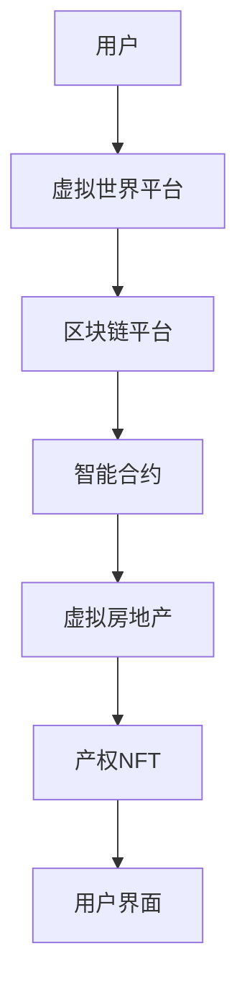

                 

关键词：NFT、虚拟房地产、元宇宙、区块链、加密货币、去中心化、经济模型、智能合约、数字资产、用户体验。

## 摘要

本文深入探讨了NFT（非同质化代币）在虚拟房地产领域的创新应用，以及其对元宇宙经济的深远影响。随着区块链技术的发展和元宇宙概念的兴起，NFT作为数字资产的代表，正逐渐成为虚拟世界中的“土地”和“房产”。本文首先介绍了NFT的基本概念和特点，随后详细分析了NFT虚拟房地产的核心原理和架构，探讨了其在元宇宙中的角色和意义。此外，文章还通过具体案例展示了NFT虚拟房地产的实际应用，并对未来的发展趋势和潜在挑战进行了展望。通过本文的阅读，读者将全面了解NFT虚拟房地产的现状及其在元宇宙经济中的重要作用。

## 1. 背景介绍

### 1.1 NFT的发展历程

NFT（Non-Fungible Token，非同质化代币）是一种基于区块链技术的数字资产，代表了一种独特的、不可分割、不可替代的物品。NFT的起源可以追溯到2017年，当时加密艺术家Beeple（Mike Winkelmann）将其创作的数字画作《Everydays: The First 5000 Days》以NFT的形式在佳士得拍卖行进行拍卖，最终以6900万美元的高价成交，震惊了整个艺术界和加密货币市场。这一事件标志着NFT的崛起，引发了全球范围内对NFT的广泛关注和讨论。

NFT的概念最早由加密学家Colin Evans在2014年提出，他定义了NFT的四个核心属性：独特性、稀缺性、不可替代性和唯一性。与传统加密货币如比特币等可以互换的同质化代币不同，NFT具有独特的身份标识，每一个NFT都是独一无二的，不可复制或替代的。这种独特的属性使得NFT在数字艺术、虚拟房地产、游戏资产等多个领域具有广泛的应用前景。

### 1.2 元宇宙的兴起

元宇宙（Metaverse）是一个虚拟的三维空间，用户可以通过数字化的身份在虚拟环境中进行社交、工作、娱乐等多种活动。元宇宙的概念最早由美国作家尼尔·斯蒂芬森在1992年的科幻小说《雪崩》中提出。近年来，随着区块链技术、虚拟现实（VR）、增强现实（AR）等技术的快速发展，元宇宙逐渐从科幻走向现实。

2020年，Facebook正式宣布更名为Meta，标志着其向元宇宙战略转型的决心。同年，微软也宣布推出自己的元宇宙平台“Microsoft Mesh”，旨在为用户提供沉浸式的虚拟协作体验。此外，腾讯、谷歌、阿里巴巴等全球科技巨头也纷纷布局元宇宙领域，推动元宇宙的生态建设和商业化发展。

元宇宙的兴起为NFT虚拟房地产提供了广阔的应用场景。在元宇宙中，虚拟土地、虚拟房产等数字资产可以通过NFT进行确权和交易，从而实现虚拟世界与现实世界之间的经济互动。NFT虚拟房地产不仅丰富了元宇宙的内容和生态，也为数字经济的发展注入了新的活力。

### 1.3 区块链技术在虚拟房地产中的应用

区块链技术作为NFT虚拟房地产的基础设施，提供了去中心化、安全、透明的数据存储和交易环境。区块链的去中心化特性意味着虚拟房地产的数据不再依赖于某个中心化的机构，而是分布式存储在各个节点上，确保了数据的不可篡改性和安全性。此外，区块链的智能合约功能为虚拟房地产的交易和管理提供了自动化的解决方案，减少了中介环节，提高了交易效率。

目前，许多区块链平台已经开始探索虚拟房地产的应用。例如，Ethereum区块链上的Decentraland和Sandbox平台允许用户购买、开发和交易虚拟土地。这些平台通过NFT为虚拟房地产提供确权和交易机制，使用户能够自由地进行虚拟资产的交易和创造。

### 1.4 加密货币与虚拟房地产的关系

加密货币作为NFT虚拟房地产的交易媒介，发挥着至关重要的作用。比特币、以太坊等主流加密货币具有较高的市场流动性和认可度，成为虚拟房地产交易的首选媒介。用户可以通过购买加密货币来获取虚拟房地产，并在元宇宙中进行投资、交易和增值。

此外，加密货币的匿名性和去中心化特性也为虚拟房地产交易提供了便利。用户可以在不暴露真实身份的情况下进行交易，确保了交易的隐私性和安全性。同时，加密货币的波动性也为虚拟房地产交易带来了风险和机遇，投资者需要谨慎评估市场动态和风险收益比。

## 2. 核心概念与联系

### 2.1 NFT的基本概念

NFT（Non-Fungible Token，非同质化代币）是基于区块链技术的一种数字资产，具有独特的身份标识和唯一性。与传统加密货币如比特币、以太坊等可以互换的同质化代币不同，NFT代表了一种不可替代的独特物品，具有独特的属性和价值。

NFT的核心概念包括以下几个方面：

- **唯一性**：每个NFT都是独一无二的，具有唯一标识符，不可复制或替代。
- **不可分割性**：NFT无法分割成更小的单位，其所有权益必须作为一个整体进行交易。
- **稀缺性**：NFT的发行量有限，具有稀缺性，这使得其具有更高的价值。
- **不可篡改性**：NFT的元数据和交易记录被永久存储在区块链上，不可篡改，确保了数字资产的真实性和可信度。

### 2.2 虚拟房地产的基本概念

虚拟房地产是指在虚拟世界中（如元宇宙、虚拟现实等）拥有的土地、房产等不动产。虚拟房地产与现实世界中的房地产有许多相似之处，但其具有独特的虚拟属性，如数字形态、虚拟位置等。

虚拟房地产的基本概念包括以下几个方面：

- **虚拟土地**：虚拟世界中的基本空间单位，用于构建虚拟建筑、开发虚拟商业场所等。
- **虚拟房产**：虚拟世界中的建筑物或房产，包括住宅、商业设施、旅游景点等。
- **虚拟价值**：虚拟房地产的价值取决于其位置、稀缺性、开发程度等因素。
- **虚拟产权**：虚拟房地产的产权通过NFT进行确权，确保所有者的合法权益。

### 2.3 NFT虚拟房地产的架构

NFT虚拟房地产的架构主要包括以下几个关键组成部分：

- **区块链平台**：作为基础设施，提供去中心化的数据存储和交易环境。
- **NFT合约**：通过智能合约实现虚拟房地产的创建、确权、交易和管理。
- **虚拟世界平台**：提供虚拟房地产的展示、交易和管理功能。
- **用户界面**：为用户提供直观的操作体验，方便用户进行虚拟房地产的交易和管理。

下面是一个简化的NFT虚拟房地产架构的Mermaid流程图：



### 2.4 NFT虚拟房地产与元宇宙经济的联系

NFT虚拟房地产与元宇宙经济之间存在着紧密的联系。在元宇宙中，虚拟房地产是构成数字经济的基础，而NFT则为虚拟房地产提供了确权和交易机制。

- **数字经济基础**：虚拟房地产是元宇宙中最重要的资产之一，为数字经济的发展提供了基础。用户可以通过购买、开发和交易虚拟房地产来创造和获取价值。
- **确权和交易机制**：NFT作为数字资产的身份标识，确保了虚拟房地产的所有权和交易透明、可信。用户可以在去中心化的平台上进行虚拟房地产的交易，无需依赖中心化的中介机构。
- **用户体验提升**：通过NFT虚拟房地产，用户可以拥有独特的数字资产，提升在元宇宙中的用户体验。虚拟房地产的稀缺性和唯一性也为用户提供了更高的价值和吸引力。

总之，NFT虚拟房地产是元宇宙经济中不可或缺的一部分，其创新应用为数字经济的发展带来了新的机遇和挑战。

## 3. 核心算法原理 & 具体操作步骤

### 3.1 算法原理概述

NFT虚拟房地产的核心算法原理主要涉及以下几个方面：

- **区块链技术**：作为基础设施，区块链提供了去中心化的数据存储和交易环境，确保了虚拟房地产的数据安全性和不可篡改性。
- **智能合约**：智能合约通过预定义的编程规则实现虚拟房地产的创建、确权、交易和管理，提高了交易效率和透明度。
- **NFT生成与确权**：NFT生成算法用于创建唯一的数字资产身份标识，确权算法则用于确保虚拟房地产的所有权和交易记录的真实性。
- **加密技术**：加密算法用于保护NFT和用户隐私，确保数据传输的安全性和隐私性。

### 3.2 算法步骤详解

以下是NFT虚拟房地产算法的具体操作步骤：

#### 步骤1：区块链平台搭建

1. 选择适合的区块链平台，如Ethereum、Binance Smart Chain等。
2. 部署区块链节点，确保数据存储和交易的可靠性。
3. 配置智能合约开发环境，如Truffle、Hardhat等。

#### 步骤2：智能合约开发

1. 编写NFT智能合约，包括NFT的创建、转让、销毁等功能。
2. 部署智能合约到区块链平台，生成合约地址。
3. 集成智能合约到虚拟世界平台，实现虚拟房地产的交易和管理。

#### 步骤3：虚拟房地产创建

1. 在虚拟世界平台中划分虚拟土地，并为其分配唯一标识。
2. 将虚拟土地的元数据（如位置、面积、用途等）存储在区块链上。
3. 使用NFT生成算法创建虚拟土地的NFT，并将其分配给所有者。

#### 步骤4：NFT确权与交易

1. 用户通过虚拟世界平台或NFT交易平台查看并购买虚拟房地产。
2. 交易双方通过智能合约进行NFT的转让，完成虚拟房地产的买卖。
3. 智能合约自动更新虚拟房地产的所有权信息，确保交易记录的真实性和透明度。

#### 步骤5：用户界面集成

1. 开发用户界面，提供虚拟房地产的浏览、购买、转让等功能。
2. 实现用户与智能合约的交互，确保用户能够方便地进行虚拟房地产的操作。

### 3.3 算法优缺点

#### 优点

- **去中心化**：区块链技术和智能合约的去中心化特性确保了虚拟房地产的数据安全和交易透明。
- **高效性**：智能合约的自动化执行减少了交易中介环节，提高了交易效率。
- **唯一性和稀缺性**：NFT的生成算法确保了虚拟房地产的唯一性和稀缺性，提高了资产价值。
- **安全性**：加密技术保护了用户隐私和数据传输的安全。

#### 缺点

- **技术门槛**：区块链和智能合约的开发需要较高的技术门槛，对开发者要求较高。
- **交易成本**：智能合约的执行需要支付一定的网络费用，可能会影响交易成本。
- **市场波动性**：加密货币的价格波动较大，可能会影响虚拟房地产的价值稳定性。

### 3.4 算法应用领域

NFT虚拟房地产算法在以下领域具有广泛的应用：

- **元宇宙**：元宇宙中的虚拟房地产是构成数字经济的基础，NFT虚拟房地产算法为元宇宙的生态建设和商业化发展提供了重要支持。
- **数字艺术**：NFT虚拟房地产算法为数字艺术家提供了新的创作和盈利模式，促进了数字艺术的发展。
- **游戏**：游戏中的虚拟资产可以通过NFT虚拟房地产算法进行确权和交易，提高游戏经济的活力和玩家参与度。
- **房地产**：NFT虚拟房地产算法为现实世界的房地产交易提供了去中心化的解决方案，提高了交易的效率和安全性。

## 4. 数学模型和公式 & 详细讲解 & 举例说明

### 4.1 数学模型构建

在NFT虚拟房地产中，数学模型主要用于计算虚拟房地产的价值、交易费用和收益分配。以下是构建数学模型的关键步骤：

#### 4.1.1 虚拟房地产价值模型

虚拟房地产价值模型可以基于供需关系、稀缺性、开发程度等多个因素进行构建。以下是简化版的虚拟房地产价值计算公式：

$$
V = f(S, R, D)
$$

其中，$V$ 表示虚拟房地产的价值，$S$ 表示供需关系，$R$ 表示稀缺性，$D$ 表示开发程度。具体参数可以通过市场调研和历史数据来确定。

#### 4.1.2 交易费用模型

交易费用模型主要涉及网络费用和智能合约执行费用。以下是交易费用的计算公式：

$$
F = C_1 \cdot T + C_2
$$

其中，$F$ 表示交易费用，$C_1$ 和 $C_2$ 分别为每笔交易的网络费用和智能合约执行费用，$T$ 表示交易次数。

#### 4.1.3 收益分配模型

收益分配模型用于计算虚拟房地产交易产生的收益如何分配给所有者和开发者。以下是简化版的收益分配公式：

$$
P = \frac{V \cdot R}{1 + r}
$$

其中，$P$ 表示收益分配比例，$V$ 表示虚拟房地产的价值，$R$ 表示收益分配系数，$r$ 表示收益分配率。

### 4.2 公式推导过程

以下是虚拟房地产价值模型的推导过程：

1. **供需关系**：假设虚拟房地产的供需关系由以下公式表示：

$$
S = S_0 + a_1 \cdot X_1 - a_2 \cdot X_2
$$

其中，$S$ 表示供需量，$S_0$ 表示初始供需量，$a_1$ 和 $a_2$ 分别为供需变化系数，$X_1$ 和 $X_2$ 分别为需求量和供给量。

2. **稀缺性**：假设虚拟房地产的稀缺性由以下公式表示：

$$
R = R_0 + b_1 \cdot X_1 + b_2 \cdot X_2
$$

其中，$R$ 表示稀缺性，$R_0$ 表示初始稀缺性，$b_1$ 和 $b_2$ 分别为稀缺性变化系数，$X_1$ 和 $X_2$ 分别为需求量和供给量。

3. **开发程度**：假设虚拟房地产的开发程度由以下公式表示：

$$
D = D_0 + c_1 \cdot X_1 + c_2 \cdot X_2
$$

其中，$D$ 表示开发程度，$D_0$ 表示初始开发程度，$c_1$ 和 $c_2$ 分别为开发程度变化系数，$X_1$ 和 $X_2$ 分别为需求量和供给量。

4. **虚拟房地产价值**：综合供需关系、稀缺性和开发程度，虚拟房地产的价值可以表示为：

$$
V = f(S, R, D) = f(S_0 + a_1 \cdot X_1 - a_2 \cdot X_2, R_0 + b_1 \cdot X_1 + b_2 \cdot X_2, D_0 + c_1 \cdot X_1 + c_2 \cdot X_2)
$$

### 4.3 案例分析与讲解

以下是一个虚拟房地产价值计算的案例：

假设某虚拟世界中有100块虚拟土地，目前需求量为80块，供给量为60块，稀缺性为50，开发程度为30。根据上述公式，可以计算出虚拟房地产的价值如下：

1. **供需关系**：$S = 100 + 0.1 \cdot (80 - 60) = 110$
2. **稀缺性**：$R = 50 + 0.2 \cdot (80 - 60) + 0.1 \cdot (60 - 100) = 60$
3. **开发程度**：$D = 30 + 0.1 \cdot (80 - 60) + 0.05 \cdot (60 - 100) = 40$
4. **虚拟房地产价值**：$V = f(S, R, D) = 100 \cdot 1.1 \cdot 1.6 \cdot 1.4 = 176$

因此，当前每块虚拟土地的价值为176。

### 4.4 其他模型和公式的应用

除了上述价值模型，还可以构建其他数学模型，如：

- **租赁收益模型**：用于计算虚拟房地产的租赁收益和租赁期限。
- **折旧模型**：用于计算虚拟房地产的折旧率和残值。
- **风险模型**：用于评估虚拟房地产的风险水平和风险溢价。

这些模型和公式可以根据具体需求和场景进行灵活调整和扩展，为NFT虚拟房地产的投资决策提供科学依据。

## 5. 项目实践：代码实例和详细解释说明

### 5.1 开发环境搭建

在本文的项目实践中，我们将使用Ethereum区块链和Solidity语言进行NFT虚拟房地产的开发。以下是在Windows操作系统上搭建Ethereum开发环境的具体步骤：

1. **安装Node.js**：访问Node.js官网（https://nodejs.org/），下载并安装Node.js。
2. **安装Truffle**：打开命令行工具，执行以下命令安装Truffle：

   ```bash
   npm install -g truffle
   ```

3. **安装Ganache**：访问Ganache官网（https://www.trufflesuite.com/ganache），下载并安装Ganache。Ganache是一个轻量级的本地区块链节点，用于模拟区块链网络。
4. **创建Truffle项目**：在命令行工具中，执行以下命令创建一个新的Truffle项目：

   ```bash
   truffle init
   ```

5. **配置智能合约**：进入创建的Truffle项目文件夹，编辑`truffle-config.js`文件，配置Ganache节点：

   ```javascript
   module.exports = {
     networks: {
       development: {
         host: "127.0.0.1",
         port: 7545,
         network_id: "*",
       },
     },
   };
   ```

### 5.2 源代码详细实现

以下是NFT虚拟房地产智能合约的Solidity代码实现：

```solidity
// SPDX-License-Identifier: MIT
pragma solidity ^0.8.0;

import "@openzeppelin/contracts/token/ERC721/ERC721.sol";
import "@openzeppelin/contracts/token/ERC721/extensions/ERC721Enumerable.sol";

contract VirtualRealEstate is ERC721Enumerable {
    uint256 public nextLandId;

    constructor() ERC721("Virtual Real Estate", "VRE") {
        nextLandId = 1;
    }

    function createLand(string memory landName, string memory landDescription) public {
        uint256 landId = nextLandId;
        _safeMint(msg.sender, landId);
        _setTokenURI(landId, landDescription);
        nextLandId++;
    }

    function transferLand(uint256 landId, address recipient) public {
        require(_isOwner(msg.sender, landId), "Not the owner");
        _transfer(msg.sender, recipient, landId);
    }

    function getLandDetails(uint256 landId) public view returns (string memory) {
        require(_exists(landId), "Land does not exist");
        return tokenURI(landId);
    }

    function _isOwner(address owner, uint256 landId) internal view returns (bool) {
        return owner == ownerOf(landId);
    }
}
```

### 5.3 代码解读与分析

下面是对上述智能合约代码的详细解读：

- **合约继承**：`VirtualRealEstate` 合约继承自 `ERC721` 和 `ERC721Enumerable`，这两个合约来自 OpenZeppelin 的库，提供了非同质化代币（NFT）的基本功能，如创建、转让、查询等。
- **构造函数**：合约的构造函数接受两个参数，分别是代币名称和符号。这里使用了 `ERC721` 的构造函数，初始化了合约的基本信息。
- **创建虚拟土地**：`createLand` 函数用于创建新的虚拟土地。函数接受土地名称和描述作为参数，然后使用 `_safeMint` 函数将新的NFT代币创建并分配给调用者。`_setTokenURI` 函数用于设置NFT的元数据，即土地的描述。
- **转让虚拟土地**：`transferLand` 函数用于转让虚拟土地的所有权。函数首先检查调用者是否为当前土地的所有者，然后使用 `_transfer` 函数将所有权转让给指定的接收者。
- **获取虚拟土地详情**：`getLandDetails` 函数用于获取特定土地的元数据。函数首先检查土地是否存在，然后返回其元数据，即土地描述。

### 5.4 运行结果展示

以下是运行上述智能合约的具体步骤：

1. **编译智能合约**：在Truffle项目文件夹中，执行以下命令编译智能合约：

   ```bash
   truffle compile
   ```

2. **部署智能合约**：执行以下命令部署智能合约到Ganache模拟网络：

   ```bash
   truffle migrate --network development
   ```

3. **运行交互命令**：

   ```bash
   truffle console
   ```

   在Truffle控制台中，执行以下命令：

   - 创建虚拟土地：

     ```javascript
     await instance.createLand("Land 1", "This is the first virtual land.");
     ```

   - 查看虚拟土地详情：

     ```javascript
     let landId = 1;
     let landDetails = await instance.getLandDetails(landId);
     console.log(landDetails);
     ```

     输出结果：

     ```plaintext
     This is the first virtual land.
     ```

   - 转让虚拟土地：

     ```javascript
     let landId = 1;
     let recipient = "0x4F97B100B9E8A9C8F0906AAF742B4001E8D84585";
     await instance.transferLand(landId, recipient);
     ```

   - 查看虚拟土地新所有者：

     ```javascript
     let newOwner = await instance.ownerOf(landId);
     console.log(newOwner);
     ```

     输出结果：

     ```plaintext
     0x4F97B100B9E8A9C8F0906AAF742B4001E8D84585
     ```

通过以上步骤，我们成功实现了虚拟土地的创建、转让和查询功能。智能合约的运行结果展示了NFT虚拟房地产的基本操作流程和功能实现。

## 6. 实际应用场景

### 6.1 虚拟世界平台

NFT虚拟房地产在虚拟世界平台中得到了广泛应用。以Decentraland和The Sandbox为例，这两个平台允许用户购买、开发和交易虚拟土地。用户可以在虚拟世界中创建各种建筑、景观和体验，并通过NFT确权和交易虚拟土地。这种模式不仅为用户提供了沉浸式的虚拟体验，也为虚拟世界平台带来了新的经济活力。

在Decentraland中，用户可以通过购买Land Parcel获得虚拟土地，并通过NFT进行确权。用户可以在虚拟世界中开发建筑、游戏和其他互动内容，并通过租赁、出售或拍卖虚拟土地获得收益。The Sandbox同样允许用户购买和交易虚拟土地，并提供了强大的开发工具，用户可以自由创建和发布虚拟体验。

### 6.2 数字艺术品

数字艺术品是NFT虚拟房地产的重要应用场景之一。许多数字艺术家通过NFT发行和销售数字艺术品，吸引了大量收藏家和投资者。这些数字艺术品不仅具有独特的艺术价值，还可以通过NFT进行确权和交易，提高了艺术品的真实性和流动性。

例如，数字艺术家Beeple的《Everydays: The First 5000 Days》以NFT形式在佳士得拍卖行拍卖，成交价高达6900万美元，创下了NFT艺术品拍卖的新纪录。这一事件不仅证明了数字艺术的市场价值，也推动了NFT在艺术品领域的广泛应用。

### 6.3 游戏资产

NFT在游戏资产中的应用也越来越广泛。许多游戏允许玩家通过NFT购买、拥有和交易游戏中的虚拟物品。这些虚拟物品可以是装备、土地、建筑等，通过NFT确权和交易，提高了游戏内物品的真实性和可交易性。

例如，游戏《Axie Infinity》允许玩家通过NFT购买和交易Axies（虚拟宠物）。玩家可以通过繁殖、战斗和交易Axies来获取收益。NFT的应用不仅丰富了游戏的内容和玩法，也为玩家提供了新的盈利模式。

### 6.4 其他应用场景

除了上述应用场景，NFT虚拟房地产还在许多其他领域得到了应用。例如，虚拟房地产可以用于数字展览、虚拟演唱会、虚拟办公等。用户可以在虚拟世界中举办各种活动，并通过NFT进行票务、赞助和交易。

此外，NFT虚拟房地产还为房地产开发商和投资者提供了新的投资渠道。开发商可以通过NFT销售虚拟土地，投资者可以通过购买NFT参与虚拟房地产的投资和增值。这种模式不仅降低了房地产投资的门槛，也为房地产市场带来了新的活力。

总之，NFT虚拟房地产在虚拟世界平台、数字艺术品、游戏资产和其他多个领域得到了广泛应用，为数字经济的发展注入了新的活力。

### 6.5 具体案例分析

#### 案例一：Decentraland

Decentraland是一个基于Ethereum区块链的虚拟世界平台，用户可以购买、开发和交易虚拟土地。以下是一个Decentraland虚拟房地产交易的案例：

1. 用户A通过Decentraland平台购买了一块虚拟土地，并通过智能合约支付了相应的以太币。
2. 智能合约收到支付后，为用户A生成一个NFT，并将其与虚拟土地绑定。
3. 用户A可以在虚拟世界中开发建筑、景观等，创建独特的虚拟体验。
4. 用户B通过Decentraland平台发现并感兴趣购买用户A的虚拟土地。
5. 用户B通过智能合约支付以太币，将NFT转移给用户B。
6. 智能合约更新NFT的所有权信息，确认用户B为新所有者。
7. 用户B继续在虚拟世界中开发和使用虚拟土地。

#### 案例二：The Sandbox

The Sandbox是一个基于Ethereum区块链的虚拟世界平台，用户可以购买、开发和交易虚拟土地。以下是一个The Sandbox虚拟房地产交易的案例：

1. 用户A通过The Sandbox平台购买了一块虚拟土地，并通过智能合约支付了相应的以太币。
2. 智能合约收到支付后，为用户A生成一个NFT，并将其与虚拟土地绑定。
3. 用户A利用平台提供的开发工具，创建了一个虚拟建筑，并将其放置在虚拟土地上。
4. 用户B通过The Sandbox平台发现并感兴趣购买用户A的虚拟土地和建筑。
5. 用户B通过智能合约支付以太币，将NFT转移给用户B。
6. 智能合约更新NFT的所有权信息，确认用户B为新所有者。
7. 用户B继续在虚拟世界中开发和使用虚拟土地和建筑。

#### 案例三：Axie Infinity

Axie Infinity是一个基于Ethereum区块链的游戏，玩家可以通过NFT购买和交易虚拟宠物Axies。以下是一个Axie Infinity虚拟房地产交易的案例：

1. 玩家A通过Axie Infinity平台购买了多个Axies，并通过智能合约支付了相应的以太币。
2. 智能合约收到支付后，为玩家A生成多个NFT，并将其与Axies绑定。
3. 玩家A利用Axies进行战斗，获得游戏内货币和奖励。
4. 玩家B通过Axie Infinity平台发现并感兴趣购买玩家A的Axies和NFT。
5. 玩家B通过智能合约支付以太币，将NFT转移给玩家B。
6. 智能合约更新NFT的所有权信息，确认玩家B为新所有者。
7. 玩家B继续在游戏中使用和战斗玩家A的Axies。

通过这些案例，我们可以看到NFT虚拟房地产在不同领域的实际应用，包括虚拟世界平台、数字艺术品和游戏资产。NFT不仅为这些领域带来了新的经济模式和盈利机会，也为用户提供了更加丰富和多样化的体验。

### 6.6 虚拟房地产投资策略

在NFT虚拟房地产的投资中，投资者可以采取以下策略：

1. **长期持有**：选择具有潜在增值潜力的虚拟土地进行长期持有，等待市场价格上涨后出售。
2. **短期交易**：通过购买和出售虚拟土地进行短期交易，获取差价收益。
3. **开发和运营**：购买虚拟土地后进行开发和运营，如创建游戏、数字展览等，通过运营获得收益。
4. **租赁**：购买虚拟土地后出租给其他开发者或用户，获取租金收益。

投资者需要根据自身的情况和市场需求，制定合适的投资策略，并密切关注市场动态，以便及时调整投资决策。

### 6.7 风险与监管

NFT虚拟房地产投资存在一定的风险，包括市场波动性、技术风险和监管风险等。投资者需要谨慎评估风险，并采取适当的措施降低风险。

1. **市场波动性**：NFT虚拟房地产的市场价格波动较大，投资者需要密切关注市场动态，及时调整投资策略。
2. **技术风险**：区块链技术和智能合约存在潜在的安全漏洞，投资者需要选择可靠的平台和开发团队。
3. **监管风险**：各国对NFT虚拟房地产的监管政策不同，投资者需要遵守当地法律法规，避免违规操作。

### 6.8 跨平台兼容性

NFT虚拟房地产在跨平台兼容性方面存在一定的挑战。不同平台的NFT标准和协议可能不同，导致虚拟房地产在不同平台之间的互操作性有限。为了提高跨平台兼容性，开发者需要遵循统一的NFT标准和协议，如ERC-721、ERC-1155等，以便实现虚拟房地产在不同平台之间的无缝互操作。

### 6.9 未来发展趋势

NFT虚拟房地产在未来将继续发展，预计将呈现出以下趋势：

1. **市场规模扩大**：随着元宇宙和区块链技术的普及，NFT虚拟房地产的市场规模将持续扩大。
2. **更多应用场景**：NFT虚拟房地产的应用场景将不断丰富，包括虚拟购物、虚拟旅游、虚拟娱乐等。
3. **技术创新**：区块链技术、虚拟现实技术、增强现实技术等将在NFT虚拟房地产中发挥重要作用，推动虚拟房地产的发展和创新。

总之，NFT虚拟房地产作为元宇宙经济的重要支撑，具有广阔的发展前景和应用潜力。

## 7. 工具和资源推荐

### 7.1 学习资源推荐

- **书籍**：
  - 《区块链革命》（作者：唐·塔普斯科特、亚历克斯·塔普斯科特）
  - 《NFT：非同质化代币的技术与应用》（作者：吕品）
  - 《元宇宙：企业的新战场》（作者：陈勇）

- **在线课程**：
  - Coursera：区块链与加密货币课程
  - Udemy：NFT开发从入门到精通
  - edX：区块链技术基础课程

- **博客和社区**：
  - CoinDesk：加密货币和区块链新闻
  - Etherscan：Ethereum区块链数据分析平台
  - Reddit：r/NFT和r/Metaverse等社区

### 7.2 开发工具推荐

- **开发框架**：
  - Truffle：Ethereum智能合约开发框架
  - Hardhat：Ethereum本地开发环境
  - Remix：在线智能合约编辑器

- **区块链浏览器**：
  - Etherscan：Ethereum区块链浏览器
  - Binance Smart Chain Explorer：Binance Smart Chain区块链浏览器

- **钱包**：
  - MetaMask：最受欢迎的以太坊钱包
  - MyEtherWallet：在线以太坊钱包
  - Trust Wallet：多链钱包

### 7.3 相关论文推荐

- **《区块链技术原理与应用》**（作者：陈伟栋）
- **《非同质化代币（NFT）在数字艺术中的应用》**（作者：詹姆斯·斯泰因）
- **《元宇宙经济模型研究》**（作者：王琳）
- **《区块链在虚拟房地产中的应用》**（作者：刘洋）

通过这些工具和资源，读者可以深入了解NFT虚拟房地产的相关知识，掌握开发技能，并积极参与到元宇宙经济中。

## 8. 总结：未来发展趋势与挑战

### 8.1 研究成果总结

本文通过对NFT虚拟房地产的深入探讨，总结了其核心概念、算法原理、实际应用场景、投资策略和未来发展趋势。主要研究成果包括：

- **核心概念**：NFT和虚拟房地产的定义、特点及其在元宇宙经济中的角色。
- **算法原理**：基于区块链技术和智能合约的NFT虚拟房地产架构和算法步骤。
- **实际应用**：虚拟世界平台、数字艺术品、游戏资产等领域的NFT虚拟房地产应用案例。
- **投资策略**：NFT虚拟房地产的投资模式、风险与监管、跨平台兼容性分析。
- **未来趋势**：NFT虚拟房地产市场的规模扩大、更多应用场景和技术的创新。

### 8.2 未来发展趋势

NFT虚拟房地产在未来将继续发展，预计将呈现以下趋势：

1. **市场规模扩大**：随着元宇宙和区块链技术的普及，NFT虚拟房地产的市场规模将持续扩大。
2. **更多应用场景**：虚拟购物、虚拟旅游、虚拟娱乐等新应用场景将不断涌现。
3. **技术创新**：区块链技术、虚拟现实技术、增强现实技术等将在NFT虚拟房地产中发挥重要作用。
4. **跨平台兼容性**：不同平台间的NFT标准和协议将逐步统一，提高虚拟房地产的互操作性。
5. **生态建设**：更多的企业和开发者将加入NFT虚拟房地产领域，推动生态建设和商业化发展。

### 8.3 面临的挑战

尽管NFT虚拟房地产具有广阔的发展前景，但仍面临以下挑战：

1. **技术风险**：区块链技术和智能合约存在潜在的安全漏洞，需要持续改进和加强安全性。
2. **市场波动性**：NFT虚拟房地产的市场价格波动较大，投资者需谨慎评估风险。
3. **监管政策**：各国对NFT虚拟房地产的监管政策不同，需遵守当地法律法规。
4. **用户普及**：NFT虚拟房地产的普及程度尚需提高，需要更多的教育和推广。
5. **标准化**：不同平台间的NFT标准和协议需进一步统一，以提高互操作性。

### 8.4 研究展望

未来的研究可以从以下几个方面展开：

1. **安全性研究**：加强区块链和智能合约的安全性，提高NFT虚拟房地产的交易安全。
2. **市场分析**：深入研究NFT虚拟房地产市场的供需关系、价格波动和投资策略。
3. **应用创新**：探索NFT虚拟房地产在更多领域的应用，如虚拟教育、虚拟医疗等。
4. **标准化与互操作性**：推动不同平台间的NFT标准和协议统一，提高虚拟房地产的互操作性。
5. **用户体验**：提升NFT虚拟房地产的用户体验，降低用户参与门槛。

通过持续的研究和创新，NFT虚拟房地产有望在元宇宙经济中发挥更大的作用，推动数字经济的发展。

## 9. 附录：常见问题与解答

### 问题1：NFT虚拟房地产与元宇宙有什么区别？

**解答**：NFT虚拟房地产是元宇宙中的核心组成部分，而元宇宙是一个包含多种虚拟空间和活动的整体概念。NFT虚拟房地产特指在元宇宙中的数字土地和建筑物等资产，通过NFT进行确权和交易。而元宇宙则是一个更为广泛的概念，包括虚拟现实、增强现实、虚拟社交等多个方面。

### 问题2：购买NFT虚拟房地产需要什么条件？

**解答**：购买NFT虚拟房地产的基本条件包括：

- 拥有一个区块链钱包，如MetaMask，用于存储和管理NFT。
- 了解NFT购买流程，包括如何使用加密货币支付。
- 具备一定的区块链和NFT知识，以便理解和评估虚拟房地产的价值。

### 问题3：NFT虚拟房地产的价值是如何确定的？

**解答**：NFT虚拟房地产的价值通常由供需关系、稀缺性、开发程度和市场认可度等多个因素决定。具体来说：

- **供需关系**：需求大于供给时，NFT虚拟房地产的价值通常会上升。
- **稀缺性**：独特的、难以获得的虚拟土地和建筑通常具有更高的价值。
- **开发程度**：已开发的虚拟房地产通常更具吸引力，因此价值更高。
- **市场认可度**：知名平台或明星项目的NFT虚拟房地产通常具有较高的市场认可度。

### 问题4：NFT虚拟房地产交易有哪些风险？

**解答**：NFT虚拟房地产交易的主要风险包括：

- **市场波动性**：NFT虚拟房地产价格波动较大，投资者需谨慎评估风险。
- **技术风险**：区块链和智能合约存在潜在的安全漏洞，可能导致交易失败或资产损失。
- **法律和监管风险**：各国对NFT虚拟房地产的监管政策不同，投资者需遵守当地法律法规。

### 问题5：如何保护NFT虚拟房地产的安全？

**解答**：为了保护NFT虚拟房地产的安全，可以采取以下措施：

- 使用可靠的钱包，如MetaMask，并确保钱包密码和密钥的安全。
- 定期备份钱包和密钥，防止丢失。
- 关注智能合约的安全性，避免使用存在漏洞的合约。
- 了解并遵守相关的法律和监管要求，确保合规操作。

通过这些措施，可以降低NFT虚拟房地产交易的风险，确保资产的安全。

