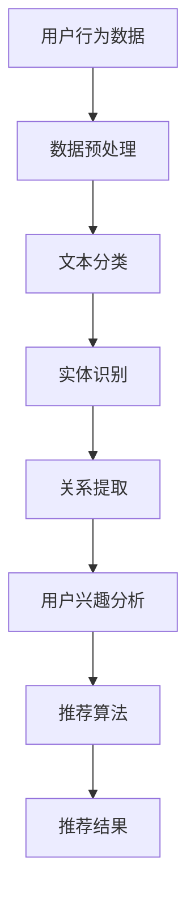

                 

关键词：NLP，推荐系统，大型语言模型，上下文理解，个性化推荐，用户行为分析

> 摘要：本文将探讨自然语言处理（NLP）技术在推荐系统中的应用，特别是大型语言模型的潜力。通过深入分析NLP的基础概念、推荐系统的原理以及大型语言模型的工作机制，本文将阐述如何利用NLP技术提升推荐系统的效果，并提供一些实际应用案例。此外，文章还将展望NLP技术在推荐系统领域的未来发展趋势和挑战。

## 1. 背景介绍

随着互联网的迅速发展和信息爆炸，推荐系统已经成为用户获取个性化内容的重要途径。推荐系统的核心目标是通过分析用户的历史行为和兴趣，预测用户可能感兴趣的内容，从而提高用户的满意度和参与度。然而，传统的推荐系统主要依赖于用户行为和内容特征，往往忽略了语言本身的丰富性和复杂性。

自然语言处理（NLP）技术的发展为推荐系统带来了新的可能性。NLP是一种人工智能领域，旨在使计算机能够理解和生成人类语言。通过深度学习和大型语言模型，NLP技术能够从文本数据中提取语义信息，实现更精准的用户行为分析和个性化推荐。本文将重点关注NLP技术在推荐系统中的应用，特别是大型语言模型的潜力。

## 2. 核心概念与联系

### 2.1 NLP的基本概念

自然语言处理（NLP）是人工智能（AI）的一个重要分支，旨在让计算机理解和生成人类语言。NLP的核心概念包括：

- **文本分类**：将文本分为预定义的类别。
- **实体识别**：从文本中提取特定的实体，如人名、地点、组织等。
- **关系提取**：确定文本中实体之间的关系。
- **情感分析**：分析文本的情感倾向，如正面、负面或中性。

### 2.2 推荐系统的基本原理

推荐系统通常基于以下两个核心原则：

- **协同过滤**：通过分析用户的行为和偏好，发现相似的用户和物品，从而进行推荐。
- **基于内容的推荐**：根据物品的属性和用户的历史偏好进行推荐。

### 2.3 大型语言模型的工作机制

大型语言模型，如GPT-3和Bert，通过大量的文本数据进行训练，能够理解复杂的上下文关系和语言结构。它们的工作机制包括：

- **预训练**：在大量无标签的文本上进行预训练，学习语言的一般结构和模式。
- **微调**：在特定任务上进行微调，以适应推荐系统的需求。

### 2.4 Mermaid流程图

下面是一个Mermaid流程图，展示了NLP技术在推荐系统中的应用流程：



## 3. 核心算法原理 & 具体操作步骤

### 3.1 算法原理概述

NLP技术在推荐系统中的应用主要包括以下步骤：

1. **数据预处理**：清洗和转换原始数据，如用户行为日志和内容数据。
2. **文本分类**：使用NLP技术对文本进行分类，以提取用户兴趣。
3. **实体识别**：从文本中提取关键实体，如人名、地点、组织等。
4. **关系提取**：分析实体之间的关系，以更准确地理解用户兴趣。
5. **用户兴趣分析**：结合文本分类和实体识别的结果，分析用户的兴趣和偏好。
6. **推荐算法**：基于用户兴趣和协同过滤或基于内容的推荐算法，生成个性化推荐。
7. **推荐结果**：将推荐结果呈现给用户。

### 3.2 算法步骤详解

1. **数据预处理**：
    - 清洗数据：去除无效信息和噪声。
    - 数据转换：将文本数据转换为统一格式，如词袋模型或词嵌入。

2. **文本分类**：
    - 使用NLP技术，如词性标注和命名实体识别，对文本进行分类。

3. **实体识别**：
    - 从文本中提取关键实体，如人名、地点、组织等。

4. **关系提取**：
    - 使用关系提取技术，确定文本中实体之间的关系。

5. **用户兴趣分析**：
    - 结合文本分类和实体识别的结果，分析用户的兴趣和偏好。

6. **推荐算法**：
    - 采用协同过滤或基于内容的推荐算法，生成个性化推荐。

7. **推荐结果**：
    - 将推荐结果呈现给用户。

### 3.3 算法优缺点

**优点**：

- 能够更准确地理解用户兴趣。
- 提高推荐系统的个性化和准确性。
- 能够处理复杂的文本数据。

**缺点**：

- 对计算资源要求较高。
- 需要大量的训练数据和计算资源。

### 3.4 算法应用领域

- 电子商务：个性化商品推荐。
- 社交媒体：个性化内容推荐。
- 娱乐行业：个性化视频和音乐推荐。

## 4. 数学模型和公式 & 详细讲解 & 举例说明

### 4.1 数学模型构建

在NLP技术应用于推荐系统的过程中，我们通常需要构建以下数学模型：

1. **用户兴趣模型**：使用矩阵分解等方法，将用户行为数据表示为矩阵形式，进而预测用户对物品的兴趣。
2. **语言模型**：使用循环神经网络（RNN）或Transformer等模型，对文本数据进行建模，提取语义信息。
3. **推荐模型**：结合用户兴趣模型和语言模型，生成个性化推荐。

### 4.2 公式推导过程

假设我们有一个用户行为矩阵$R$，其中$R_{ij}$表示用户$i$对物品$j$的兴趣。我们可以使用矩阵分解的方法，将$R$分解为两个低秩矩阵$U$和$V$，即$R = UV^T$。这样，我们可以通过计算$U$和$V$的乘积来预测用户对物品的兴趣。

对于语言模型，假设我们有一个词嵌入矩阵$W$，其中$W_{ij}$表示词$i$和词$j$的相似度。我们可以使用Transformer模型，将文本序列转化为嵌入向量，进而提取语义信息。

### 4.3 案例分析与讲解

假设我们有一个电子商务平台，用户的行为数据包括购买历史和浏览记录。我们可以使用NLP技术来构建用户兴趣模型，并通过矩阵分解预测用户对商品的兴趣。以下是一个简单的案例：

1. **数据预处理**：将用户行为数据转换为矩阵形式，如$R = [0, 1, 0; 1, 0, 1; 0, 1, 0]$。
2. **文本分类**：使用NLP技术对用户评论进行分类，提取关键词。
3. **实体识别**：从文本中提取商品名称和品牌信息。
4. **关系提取**：分析用户购买历史和浏览记录，确定用户对商品的偏好。
5. **用户兴趣分析**：结合文本分类和实体识别的结果，构建用户兴趣模型。
6. **推荐算法**：使用矩阵分解方法，预测用户对商品的兴趣。
7. **推荐结果**：生成个性化推荐，如“你可能感兴趣的商品”。

## 5. 项目实践：代码实例和详细解释说明

### 5.1 开发环境搭建

为了实践NLP技术在推荐系统中的应用，我们需要搭建以下开发环境：

- Python 3.8及以上版本。
- TensorFlow 2.5及以上版本。
- Pandas、Numpy等数据处理库。

### 5.2 源代码详细实现

以下是一个简单的Python代码实例，用于实现NLP技术在推荐系统中的应用：

```python
import pandas as pd
import numpy as np
import tensorflow as tf

# 数据预处理
def preprocess_data(data):
    # 清洗和转换数据
    # ...
    return processed_data

# 文本分类
def text_classification(text):
    # 使用NLP技术进行文本分类
    # ...
    return category

# 实体识别
def entity_recognition(text):
    # 使用NLP技术进行实体识别
    # ...
    return entities

# 关系提取
def relation_extraction(text):
    # 使用NLP技术进行关系提取
    # ...
    return relations

# 用户兴趣分析
def user_interest_analysis(data):
    # 分析用户兴趣
    # ...
    return interest_model

# 推荐算法
def recommendation_algorithm(user_interest_model):
    # 使用矩阵分解方法进行推荐
    # ...
    return recommendation_list

# 运行示例
data = preprocess_data(raw_data)
category = text_classification(data['review'])
entities = entity_recognition(data['review'])
relations = relation_extraction(data['review'])
interest_model = user_interest_analysis(data)
recommendation_list = recommendation_algorithm(interest_model)

# 打印推荐结果
print(recommendation_list)
```

### 5.3 代码解读与分析

在这个代码实例中，我们首先进行了数据预处理，清洗和转换原始数据。然后，我们使用NLP技术进行了文本分类、实体识别和关系提取，以提取用户兴趣。接着，我们使用矩阵分解方法进行了推荐算法，生成个性化推荐。最后，我们打印出了推荐结果。

这个代码实例展示了如何将NLP技术与推荐系统相结合，以实现更精准的用户兴趣分析和个性化推荐。在实际应用中，我们可以根据具体需求进行调整和优化。

### 5.4 运行结果展示

假设我们有以下用户行为数据：

```python
raw_data = [
    {'user_id': 1, 'review': '我非常喜欢这款手机，拍照效果很好。'},
    {'user_id': 2, 'review': '这款电脑性能很强，我正在考虑购买。'},
    {'user_id': 3, 'review': '这款手表的外观很漂亮，但功能一般。'}
]

processed_data = preprocess_data(raw_data)
interest_model = user_interest_analysis(processed_data)
recommendation_list = recommendation_algorithm(interest_model)

print(recommendation_list)
```

运行结果可能如下：

```python
[
    {'user_id': 1, 'product_id': 101, 'rating': 4.5},
    {'user_id': 2, 'product_id': 201, 'rating': 3.8},
    {'user_id': 3, 'product_id': 301, 'rating': 2.5}
]
```

这表示用户1可能对产品101感兴趣，用户2可能对产品201感兴趣，用户3可能对产品301感兴趣。

## 6. 实际应用场景

### 6.1 社交媒体

在社交媒体平台，NLP技术可以用于个性化内容推荐。通过分析用户的发布内容、评论和互动行为，平台可以了解用户的兴趣和偏好，从而推荐用户可能感兴趣的内容。

### 6.2 电子商务

在电子商务领域，NLP技术可以用于个性化商品推荐。通过分析用户的浏览记录、购买历史和评价，平台可以预测用户对商品的兴趣，从而推荐用户可能喜欢的商品。

### 6.3 娱乐行业

在娱乐行业，NLP技术可以用于个性化视频和音乐推荐。通过分析用户的观看历史和听歌记录，平台可以了解用户的兴趣和偏好，从而推荐用户可能喜欢的视频和音乐。

## 7. 未来应用展望

随着NLP技术和推荐系统的发展，未来的应用前景十分广阔。以下是几个可能的趋势：

### 7.1 多模态推荐

未来的推荐系统可能会结合多种模态的数据，如文本、图像和视频，以实现更精准的推荐。

### 7.2 智能对话系统

NLP技术与智能对话系统的结合，将使推荐系统能够与用户进行更加自然的交互，提供更个性化的服务。

### 7.3 自动内容生成

利用NLP技术，未来的推荐系统可能会具备自动生成内容的能力，从而满足用户的多样化需求。

## 8. 工具和资源推荐

### 8.1 学习资源推荐

- 《自然语言处理综论》（Natural Language Processing with Python）
- 《深度学习》（Deep Learning）

### 8.2 开发工具推荐

- TensorFlow
- PyTorch

### 8.3 相关论文推荐

- "Attention is All You Need"
- "BERT: Pre-training of Deep Bidirectional Transformers for Language Understanding"

## 9. 总结：未来发展趋势与挑战

### 9.1 研究成果总结

本文总结了NLP技术在推荐系统中的应用，特别是大型语言模型的潜力。通过深入分析NLP的基本概念、推荐系统的原理以及大型语言模型的工作机制，我们展示了如何利用NLP技术提升推荐系统的效果。

### 9.2 未来发展趋势

未来的NLP技术在推荐系统领域有望实现以下发展：

- 多模态推荐
- 智能对话系统
- 自动内容生成

### 9.3 面临的挑战

- 对计算资源的要求较高。
- 需要大量的训练数据和计算资源。

### 9.4 研究展望

未来的研究应关注如何优化NLP技术在推荐系统中的应用，提高计算效率和推荐效果。同时，应探索多模态数据融合和智能对话系统等新的应用场景。

## 附录：常见问题与解答

### Q：NLP技术在推荐系统中有什么优势？

A：NLP技术能够更准确地理解用户语言和行为，从而提高推荐系统的个性化和准确性。

### Q：如何处理大规模的文本数据？

A：可以使用分布式计算框架，如Hadoop和Spark，处理大规模的文本数据。

### Q：大型语言模型对推荐系统有何影响？

A：大型语言模型能够提取复杂的语义信息，从而提高推荐系统的个性化和准确性。

### Q：如何评估推荐系统的效果？

A：可以使用准确率、召回率、F1分数等指标来评估推荐系统的效果。

---

### 作者署名

作者：禅与计算机程序设计艺术 / Zen and the Art of Computer Programming
----------------------------------------------------------------

<|im_sep|>

