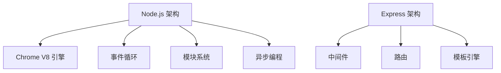

                 

关键词：Node.js、Express、服务器端开发、JavaScript、Web 应用程序、框架、性能优化

摘要：本文深入探讨了 Node.js 和 Express 框架在构建服务器端 JavaScript 应用程序方面的应用。我们将从背景介绍开始，逐步介绍核心概念、算法原理、数学模型、项目实践和实际应用场景，最后对未来发展趋势和挑战进行展望。希望通过本文，读者能够全面理解 Node.js 和 Express 在服务器端开发中的重要性，并掌握构建高效 Web 应用程序的方法。

## 1. 背景介绍

Node.js 是一个基于 Chrome V8 引擎的 JavaScript 运行环境，允许开发者使用 JavaScript 编写服务器端代码。它的出现颠覆了传统的服务器端开发模式，使得 JavaScript 能够在整个 Web 开发过程中发挥更大的作用。Node.js 的核心特点是无阻塞 I/O 操作，这意味着它可以同时处理大量并发请求，提高了应用的性能和可扩展性。

Express 是一个轻量级的 Web 应用程序框架，用于简化 Node.js 应用程序的创建和部署。它提供了丰富的中间件机制，允许开发者灵活地组织和管理应用程序的各个部分。Express 的易用性和灵活性使其成为 Node.js 开发中的首选框架。

随着互联网的快速发展，服务器端 JavaScript 已经成为 Web 开发的重要趋势。使用 Node.js 和 Express，开发者可以快速构建高性能、可扩展的 Web 应用程序，满足不断增长的用户需求。

## 2. 核心概念与联系

在深入探讨 Node.js 和 Express 的应用之前，我们需要了解它们的核心概念和架构。

### 2.1 Node.js 架构

Node.js 的核心架构包括以下几个部分：

- **V8 引擎**：Node.js 使用 Google 开发的 V8 引擎来执行 JavaScript 代码。
- **事件循环**：Node.js 使用事件循环来处理并发请求。当有请求到达时，Node.js 会将其放入事件队列中，然后按照顺序依次处理。
- **模块系统**：Node.js 的模块系统使得开发者可以方便地组织和重用代码。模块可以通过 `require()` 函数导入。
- **异步编程**：Node.js 的异步编程模型使得它可以高效地处理并发请求。通过回调函数和 Promise，开发者可以编写异步代码。

### 2.2 Express 架构

Express 框架的架构相对简单，主要包括以下几个部分：

- **中间件**：中间件是 Express 的核心组件，用于处理 HTTP 请求和响应。中间件可以用来进行路由、数据验证、权限检查等操作。
- **路由**：路由是 Express 的另一个重要组件，用于定义应用程序的 URL 路径和处理函数。
- **模板引擎**：Express 提供了内置的模板引擎，使得开发者可以方便地生成动态 HTML 页面。

### 2.3 Mermaid 流程图

为了更好地理解 Node.js 和 Express 的架构，我们可以使用 Mermaid 工具绘制一个流程图。



通过这个流程图，我们可以清晰地看到 Node.js 和 Express 的核心组件及其相互关系。

## 3. 核心算法原理 & 具体操作步骤

### 3.1 算法原理概述

在 Node.js 和 Express 的开发过程中，我们需要掌握一些核心算法原理。以下是几个常见的算法原理：

- **事件驱动模型**：Node.js 的事件驱动模型使得它能够高效地处理并发请求。事件驱动模型的核心是事件循环，它负责将事件添加到队列中，并按照顺序依次处理。
- **异步编程**：异步编程是 Node.js 的核心特性之一。通过使用回调函数和 Promise，开发者可以编写非阻塞的异步代码。
- **路由算法**：Express 使用路由算法来处理 HTTP 请求。路由算法的核心是匹配请求路径和处理函数，确保正确的处理函数被调用。

### 3.2 算法步骤详解

#### 3.2.1 事件驱动模型

1. **监听事件**：首先，Node.js 会监听特定的事件，例如 HTTP 请求。
2. **触发事件**：当有事件发生时，Node.js 会将其添加到事件队列中。
3. **执行事件处理函数**：Node.js 会按照事件队列的顺序依次执行事件处理函数。

#### 3.2.2 异步编程

1. **回调函数**：在 Node.js 中，异步操作通常通过回调函数实现。例如，读取文件的异步操作可以如下实现：
   ```javascript
   fs.readFile('example.txt', (err, data) => {
       if (err) {
           console.error(err);
       } else {
           console.log(data);
       }
   });
   ```

2. **Promise**：Promise 是另一种异步编程模型，它提供了一种更简洁的异步操作方式。例如：
   ```javascript
   const readFile = require('fs').promises;
   readFile('example.txt')
       .then(data => console.log(data))
       .catch(err => console.error(err));
   ```

#### 3.2.3 路由算法

1. **定义路由**：在 Express 中，我们可以使用 `app.get()`、`app.post()` 等方法定义路由。
2. **匹配路径**：当有 HTTP 请求到达时，Express 会根据请求方法和路径匹配相应的路由。
3. **执行处理函数**：匹配成功后，Express 会执行对应的处理函数，并返回响应。

### 3.3 算法优缺点

#### 3.3.1 事件驱动模型

**优点**：
- **高效处理并发请求**：事件驱动模型可以同时处理大量并发请求，提高了应用的性能和可扩展性。
- **非阻塞 I/O 操作**：事件驱动模型使得 Node.js 能够高效地处理 I/O 操作，避免了阻塞问题。

**缺点**：
- **复杂的事件处理流程**：事件驱动模型需要开发者熟练掌握异步编程技巧，编写复杂的事件处理逻辑。
- **性能瓶颈**：虽然事件驱动模型可以高效处理并发请求，但在高负载情况下，仍可能存在性能瓶颈。

#### 3.3.2 异步编程

**优点**：
- **非阻塞操作**：异步编程可以避免阻塞问题，提高应用程序的性能。
- **更好的用户体验**：异步编程可以避免长时间的用户等待，提供更好的用户体验。

**缺点**：
- **代码可读性差**：异步编程需要使用回调函数和 Promise，使得代码的可读性降低。
- **回调地狱**：在复杂的应用程序中，回调函数可能会导致回调地狱，使得代码难以维护。

#### 3.3.3 路由算法

**优点**：
- **灵活的路由定义**：Express 提供了丰富的路由定义方法，使得开发者可以方便地定义各种类型的路由。
- **高效的请求处理**：路由算法可以高效地匹配请求路径和处理函数，确保正确的处理函数被调用。

**缺点**：
- **路由冲突**：当多个路由匹配相同的路径时，可能会导致路由冲突问题。
- **性能开销**：路由算法需要进行路径匹配和处理函数的查找，可能会带来一定的性能开销。

### 3.4 算法应用领域

Node.js 和 Express 的事件驱动模型、异步编程和路由算法在以下领域具有广泛的应用：

- **Web 应用程序**：Node.js 和 Express 是构建 Web 应用程序的首选框架，可以用于构建高性能、可扩展的 Web 应用程序。
- **实时应用程序**：Node.js 的异步编程模型使得它可以高效地处理实时应用程序，如聊天应用、在线游戏等。
- **数据密集型应用**：Node.js 和 Express 可以用于处理大量数据的场景，如实时数据分析、大数据处理等。

## 4. 数学模型和公式 & 详细讲解 & 举例说明

### 4.1 数学模型构建

在 Node.js 和 Express 的开发过程中，我们需要掌握一些基本的数学模型和公式。以下是几个常见的数学模型和公式：

- **TCP 连接建立公式**：TCP 连接建立需要经过三次握手过程，其公式为：
  $$ TCP\_连接 = S + SA + SRA $$
  其中，S 表示初始握手，SA 表示确认握手，SRA 表示完成握手。

- **HTTP 请求处理公式**：HTTP 请求处理可以分为请求接收、请求处理和响应发送三个阶段，其公式为：
  $$ HTTP\_请求 = 请求接收 + 请求处理 + 响应发送 $$

- **并发连接处理公式**：Node.js 的并发连接处理可以分为连接接收、连接处理和连接释放三个阶段，其公式为：
  $$ 并发连接 = 连接接收 + 连接处理 + 连接释放 $$

### 4.2 公式推导过程

为了更好地理解这些数学模型和公式，我们可以进行简单的推导：

- **TCP 连接建立公式**：
  - 初始握手（S）：客户端发送一个 SYN 包到服务器，表示请求建立连接。
  - 确认握手（SA）：服务器接收 SYN 包后，发送一个 SYN-ACK 包到客户端，表示同意建立连接。
  - 完成握手（SRA）：客户端接收 SYN-ACK 包后，发送一个 ACK 包到服务器，表示连接建立完成。

- **HTTP 请求处理公式**：
  - 请求接收：服务器接收 HTTP 请求，并解析请求行、请求头和请求体。
  - 请求处理：服务器根据请求路径和处理函数，执行相应的业务逻辑。
  - 响应发送：服务器将处理结果返回给客户端，并生成 HTTP 响应。

- **并发连接处理公式**：
  - 连接接收：Node.js 接收客户端的连接请求，并创建一个新的连接。
  - 连接处理：Node.js 处理连接请求，并执行相应的业务逻辑。
  - 连接释放：当连接处理完成后，Node.js 会释放连接资源，以便其他连接可以使用。

### 4.3 案例分析与讲解

为了更好地理解这些数学模型和公式，我们可以通过一个实际案例进行讲解：

假设一个 Node.js 服务器需要处理 1000 个并发连接，每个连接需要处理一个简单的业务逻辑，如读取文件并返回文件内容。

1. **TCP 连接建立**：
   - 客户端发送 SYN 包到服务器，表示请求建立连接。
   - 服务器接收 SYN 包后，发送 SYN-ACK 包到客户端，表示同意建立连接。
   - 客户端接收 SYN-ACK 包后，发送 ACK 包到服务器，表示连接建立完成。

2. **HTTP 请求处理**：
   - 客户端发送 HTTP 请求到服务器，请求路径为 `/example.txt`。
   - 服务器接收 HTTP 请求，并解析请求行、请求头和请求体。
   - 服务器根据请求路径，调用相应的处理函数，读取文件并返回文件内容。

3. **并发连接处理**：
   - Node.js 接收 1000 个客户端连接请求，并为每个连接创建一个新的连接。
   - Node.js 处理每个连接请求，并执行读取文件的操作。
   - 当所有连接请求处理完成后，Node.js 释放连接资源。

通过这个案例，我们可以清晰地看到 Node.js 和 Express 在处理并发连接和 HTTP 请求方面的数学模型和公式应用。

## 5. 项目实践：代码实例和详细解释说明

### 5.1 开发环境搭建

在开始项目实践之前，我们需要搭建一个 Node.js 开发环境。以下是搭建开发环境的步骤：

1. **安装 Node.js**：访问 [Node.js 官网](https://nodejs.org/)，下载并安装适合自己操作系统的 Node.js 版本。

2. **安装 Express**：在命令行中执行以下命令，安装 Express：
   ```bash
   npm install express
   ```

3. **创建项目**：在命令行中执行以下命令，创建一个名为 `myapp` 的 Node.js 项目：
   ```bash
   mkdir myapp
   cd myapp
   npm init -y
   ```

4. **编写代码**：在项目目录中创建一个名为 `app.js` 的文件，并编写以下代码：

   ```javascript
   const express = require('express');
   const app = express();

   app.get('/', (req, res) => {
       res.send('Hello, World!');
   });

   app.listen(3000, () => {
       console.log('Server is running on port 3000');
   });
   ```

### 5.2 源代码详细实现

在上面的代码中，我们创建了一个简单的 Express 应用程序。以下是代码的详细解释：

1. **引入 Express**：首先，我们引入 Express 模块，并创建一个 Express 实例 `app`。
   
   ```javascript
   const express = require('express');
   const app = express();
   ```

2. **定义路由**：接下来，我们使用 `app.get()` 方法定义一个路由，处理根路径 `/` 的 GET 请求。当有请求到达该路由时，会调用指定的处理函数 `(req, res) => { ... }`。

   ```javascript
   app.get('/', (req, res) => {
       res.send('Hello, World!');
   });
   ```

   在这个处理函数中，`req` 表示请求对象，`res` 表示响应对象。我们使用 `res.send()` 方法将字符串 `'Hello, World!'` 返回给客户端。

3. **启动服务器**：最后，我们使用 `app.listen()` 方法启动服务器，并指定端口号 `3000`。当服务器启动成功后，会打印一条消息到控制台。

   ```javascript
   app.listen(3000, () => {
       console.log('Server is running on port 3000');
   });
   ```

### 5.3 代码解读与分析

通过上面的代码，我们可以看到 Express 的简单性和易用性。以下是代码的解读与分析：

1. **引入 Express**：使用 `require()` 函数引入 Express 模块，并创建一个 Express 实例 `app`。这是 Express 应用程序的入口点。

2. **定义路由**：使用 `app.get()` 方法定义一个路由，处理根路径 `/` 的 GET 请求。`app.get()` 方法接收两个参数：路径和对应的处理函数。

3. **处理函数**：处理函数是一个匿名函数，它接收两个参数：请求对象 `req` 和响应对象 `res`。在这个函数中，我们使用 `res.send()` 方法将字符串 `'Hello, World!'` 返回给客户端。

4. **启动服务器**：使用 `app.listen()` 方法启动服务器，并指定端口号 `3000`。当服务器启动成功后，会打印一条消息到控制台。

通过这个简单的例子，我们可以看到 Express 如何帮助开发者快速构建服务器端应用程序。

### 5.4 运行结果展示

在完成代码编写后，我们可以在命令行中运行以下命令，启动服务器：

```bash
node app.js
```

当服务器启动成功后，我们可以在浏览器中访问 `http://localhost:3000`，看到如下结果：

```text
Hello, World!
```

这表明我们的 Express 应用程序已经成功运行，并返回了预期的响应。

## 6. 实际应用场景

Node.js 和 Express 在实际应用场景中具有广泛的应用，以下是一些常见的应用场景：

### 6.1 实时聊天应用

实时聊天应用是 Node.js 和 Express 的一个重要应用场景。通过使用 WebSocket 技术，开发者可以实现实时消息传输，为用户带来更好的沟通体验。例如，使用 Node.js 和 Express 构建的即时通讯平台，如 Slack 和 Discord，都是基于 WebSocket 实现的。

### 6.2 RESTful API 服务

RESTful API 是现代 Web 开发中的重要组成部分。Node.js 和 Express 提供了丰富的路由和处理函数，使得开发者可以方便地构建 RESTful API 服务。这些服务可以用于各种应用场景，如移动应用后端、Web 应用后端、物联网设备通信等。

### 6.3 数据处理与可视化

Node.js 的异步编程模型和高效的 I/O 操作能力，使其在数据处理和可视化领域具有广泛的应用。开发者可以使用 Node.js 处理大量数据，并使用 Express 构建可视化应用程序，如数据仪表板、实时数据监控等。

### 6.4 游戏开发

Node.js 和 Express 在游戏开发中也具有广泛的应用。通过使用 WebSocket 技术，开发者可以实现实时多人游戏，如在线多人角色扮演游戏（MMORPG）、在线棋牌游戏等。

### 6.5 文件处理与传输

Node.js 的文件处理模块 `fs` 提供了丰富的文件操作方法，使得开发者可以方便地处理文件。结合 Express，开发者可以构建文件上传和下载服务器，如云存储服务、在线视频平台等。

### 6.6 实时数据分析

实时数据分析是大数据领域的一个重要应用场景。Node.js 的异步编程模型和高效的 I/O 操作能力，使得开发者可以方便地处理实时数据流，并使用 Express 构建实时数据分析平台。

## 7. 工具和资源推荐

在学习和使用 Node.js 和 Express 的过程中，开发者可以使用以下工具和资源：

### 7.1 学习资源推荐

1. **官方文档**：Node.js 和 Express 的官方文档是学习这两个框架的最佳资源。它们提供了详细的 API 说明和用法示例。

   - [Node.js 官方文档](https://nodejs.org/dist/latest-v16.x/docs/api/)
   - [Express 官方文档](https://expressjs.com/en/stable/)

2. **在线教程**：有许多在线教程可以帮助开发者快速入门 Node.js 和 Express。例如，[Node.js 实战教程](https://www.nodebeginner.org/) 和 [Express 官方教程](https://expressjs.com/en/stable/tutorial.html)。

3. **视频教程**：YouTube 和 Udemy 等平台上有很多关于 Node.js 和 Express 的视频教程。例如，[Node.js 入门教程](https://www.youtube.com/playlist?list=PL55RiYXOx0wy6QjHzCtHFVbqSyES5jElT) 和 [Express 入门教程](https://www.udemy.com/course/nodejs-for-beginners-creating-a-web-server/learn/)。

### 7.2 开发工具推荐

1. **Visual Studio Code**：Visual Studio Code 是一款免费的代码编辑器，支持 Node.js 和 Express 的插件，提供了丰富的开发工具和功能。

2. **Node.js Inspector**：Node.js Inspector 是一个调试工具，可以帮助开发者调试 Node.js 代码。

3. **Postman**：Postman 是一款 API 测试工具，可以帮助开发者测试和调试 RESTful API 服务。

### 7.3 相关论文推荐

1. **《Node.js：异步编程与事件驱动模型》**：这篇论文详细介绍了 Node.js 的异步编程模型和事件驱动模型，以及它们在实际应用中的优势。

2. **《Express.js：构建 Web 应用程序的最佳实践》**：这篇论文讨论了 Express 框架的设计原理和最佳实践，为开发者提供了构建高效 Web 应用程序的指导。

## 8. 总结：未来发展趋势与挑战

Node.js 和 Express 在服务器端 JavaScript 领域取得了显著的成就，但它们仍然面临着一些挑战和未来发展机遇。

### 8.1 研究成果总结

- **性能优化**：Node.js 和 Express 在性能优化方面取得了显著成果，通过事件驱动模型和异步编程，它们可以高效地处理并发请求，提高了应用的性能和可扩展性。
- **生态建设**：Node.js 和 Express 拥有庞大的开发者社区，为开发者提供了丰富的库和框架，促进了生态系统的建设。

### 8.2 未来发展趋势

- **跨平台支持**：随着云计算和移动设备的普及，Node.js 和 Express 将进一步扩展跨平台支持，使得开发者可以更轻松地构建跨平台应用程序。
- **安全性提升**：随着 Web 攻击手段的不断升级，Node.js 和 Express 将进一步加强安全性，提供更完善的防护措施。

### 8.3 面临的挑战

- **并发性能**：在高并发场景下，Node.js 和 Express 可能会面临性能瓶颈。需要进一步优化异步编程模型和 I/O 操作，提高并发处理能力。
- **开发者教育**：Node.js 和 Express 的学习曲线相对较陡峭，需要加强开发者教育，提高开发者的技能水平。

### 8.4 研究展望

- **服务化架构**：未来，Node.js 和 Express 可能会进一步走向服务化架构，使得开发者可以更方便地构建分布式系统。
- **云原生应用**：随着云原生技术的兴起，Node.js 和 Express 将在构建云原生应用程序方面发挥更大的作用。

## 9. 附录：常见问题与解答

### 9.1 问题 1：如何安装 Node.js？

解答：访问 [Node.js 官网](https://nodejs.org/)，下载并安装适合自己操作系统的 Node.js 版本。

### 9.2 问题 2：什么是 Express 框架？

解答：Express 是一个轻量级的 Web 应用程序框架，用于简化 Node.js 应用程序的创建和部署。它提供了丰富的中间件机制，使得开发者可以方便地组织和管理应用程序的各个部分。

### 9.3 问题 3：Node.js 和 Express 的区别是什么？

解答：Node.js 是一个 JavaScript 运行环境，用于执行服务器端代码。Express 是一个 Web 应用程序框架，用于简化 Node.js 应用程序的创建和部署。Express 建立在 Node.js 之上，提供了丰富的路由、中间件和模板引擎功能。

### 9.4 问题 4：如何处理 Node.js 的异步编程？

解答：Node.js 的异步编程可以通过回调函数和 Promise 实现。回调函数是一种传统的异步编程方式，通过将处理逻辑封装在回调函数中，可以实现异步操作。Promise 是一种更简洁的异步编程方式，通过返回一个 Promise 对象，可以更好地控制异步操作。

### 9.5 问题 5：如何优化 Node.js 和 Express 的性能？

解答：优化 Node.js 和 Express 的性能可以从以下几个方面入手：

- **减少同步操作**：尽量避免同步操作，使用异步操作代替同步操作。
- **优化 I/O 操作**：使用流和缓冲区优化 I/O 操作，减少 I/O 阻塞。
- **减少内存占用**：合理使用内存，避免内存泄漏。
- **使用缓存**：使用缓存减少重复操作，提高响应速度。

作者：禅与计算机程序设计艺术 / Zen and the Art of Computer Programming
----------------------------------------------------------------

以上就是本文的完整内容。希望本文能够帮助读者全面了解 Node.js 和 Express 的核心概念、算法原理、数学模型、项目实践和实际应用场景，并掌握构建高效服务器端 JavaScript 应用程序的方法。随着技术的不断发展，Node.js 和 Express 将继续在服务器端 JavaScript 领域发挥重要作用，为开发者带来更多创新和机遇。

