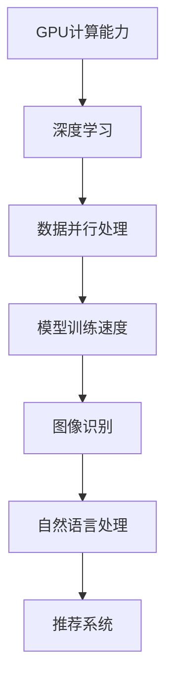

                 

关键词：NVIDIA、人工智能、深度学习、GPU、高性能计算、芯片设计、AI加速器、数据中心、云计算、计算机视觉、自动驾驶、游戏开发。

## 摘要

NVIDIA，作为全球领先的图形处理单元（GPU）制造商，在人工智能（AI）领域取得了显著的领先地位。本文将深入探讨NVIDIA在AI领域的发展历程、核心技术、产品线、市场表现及其对未来技术趋势的影响。通过本文的阅读，读者将了解NVIDIA如何利用其GPU技术推动AI的发展，以及在深度学习、自动驾驶、计算机视觉等领域的应用实例。

## 1. 背景介绍

NVIDIA成立于1993年，总部位于美国加利福尼亚州圣克拉拉。公司最初以开发高性能图形处理芯片而闻名，并在游戏和桌面图形市场占据主导地位。然而，随着深度学习和人工智能的兴起，NVIDIA迅速将业务扩展到AI领域，并成为该领域的领军企业。

在过去的几十年里，NVIDIA通过不断创新和投资，不断推动GPU技术的发展。GPU原本是为图形渲染而设计，但它们具有高度并行计算的能力，使其在处理复杂的数据计算任务时具有显著优势。这一特性使得GPU成为深度学习模型训练的理想选择。

NVIDIA的创始人兼CEO黄仁勋（Jen-Hsun Huang）对AI的愿景和远见卓识，使得NVIDIA在AI领域的发展步伐迅猛。公司不仅推出了专门为AI设计的高性能GPU，还开发了深度学习平台和工具，为研究人员和开发者提供了丰富的资源和支持。

## 2. 核心概念与联系

### 2.1. GPU与深度学习

GPU（图形处理单元）是一种高度并行的计算设备，与传统CPU（中央处理单元）相比，GPU具有更多的计算单元和更高的吞吐量。深度学习是一种基于人工神经网络的技术，其核心在于大量参数的矩阵运算。

GPU的并行计算能力使其在处理深度学习模型时具有巨大优势。通过并行处理大量数据，GPU可以显著缩短模型训练时间，提高计算效率。这使得深度学习在图像识别、自然语言处理、推荐系统等领域取得了突破性进展。

### 2.2. CUDA与深度学习

CUDA是NVIDIA推出的一种并行计算编程模型，专门用于开发GPU加速的应用程序。CUDA为开发者提供了丰富的工具和库，使他们能够利用GPU的并行计算能力来加速深度学习模型的训练。

通过CUDA，开发者可以编写并行代码，将计算任务分布在GPU的多个核心上。这使得深度学习模型的训练时间大大缩短，同时也降低了能耗。

### 2.3. Tensor Core与深度学习

NVIDIA的GPU芯片中集成了Tensor Core，这是一种专门为深度学习优化的小型计算单元。Tensor Core能够以极高的速度执行矩阵运算，从而显著提高深度学习模型的训练速度。

### 2.4. Mermaid流程图



## 3. 核心算法原理 & 具体操作步骤

### 3.1. 算法原理概述

NVIDIA的GPU技术通过并行计算来加速深度学习模型的训练。深度学习模型由大量参数组成，这些参数需要通过矩阵运算来更新。GPU具有多个计算核心，可以同时执行多个矩阵运算，从而大大提高模型训练速度。

### 3.2. 算法步骤详解

1. **数据预处理**：将原始数据转换为适合训练的数据格式。
2. **模型初始化**：初始化深度学习模型，包括权重和偏置。
3. **前向传播**：计算输入数据通过模型时的输出。
4. **损失函数计算**：计算模型输出与真实值之间的差异，以评估模型的准确性。
5. **反向传播**：根据损失函数计算模型参数的梯度。
6. **权重更新**：使用梯度下降或其他优化算法更新模型参数。

### 3.3. 算法优缺点

**优点**：
- 高度并行计算能力，显著提高模型训练速度。
- 可以为多种深度学习模型提供加速。
- CUDA和Tensor Core等工具和库为开发者提供了丰富的支持。

**缺点**：
- GPU资源相对昂贵，可能不适合预算有限的团队。
- GPU计算能力依赖于特定的硬件环境，迁移性较差。

### 3.4. 算法应用领域

NVIDIA的GPU技术广泛应用于多个领域，包括但不限于：
- **图像识别**：用于人脸识别、物体检测等。
- **自然语言处理**：用于语言翻译、情感分析等。
- **推荐系统**：用于个性化推荐、广告投放等。
- **自动驾驶**：用于环境感知、路径规划等。
- **游戏开发**：用于实时渲染、物理模拟等。

## 4. 数学模型和公式 & 详细讲解 & 举例说明

### 4.1. 数学模型构建

深度学习模型的数学模型主要包括神经网络、损失函数和优化算法。

**神经网络**：
神经网络由多层神经元组成，每个神经元接收多个输入，通过激活函数处理后产生输出。网络中的权重和偏置用于调整输入和输出的关系。

**损失函数**：
损失函数用于评估模型的准确性，常见的损失函数包括均方误差（MSE）和交叉熵（CE）。

**优化算法**：
优化算法用于更新模型参数，以最小化损失函数。常见的优化算法包括梯度下降、随机梯度下降（SGD）和Adam优化器。

### 4.2. 公式推导过程

**均方误差（MSE）**：
$$MSE = \frac{1}{m}\sum_{i=1}^{m}(y_i - \hat{y}_i)^2$$
其中，$y_i$为真实标签，$\hat{y}_i$为模型预测值。

**交叉熵（CE）**：
$$CE = -\frac{1}{m}\sum_{i=1}^{m}y_i\log(\hat{y}_i)$$
其中，$y_i$为真实标签，$\hat{y}_i$为模型预测概率。

**梯度下降**：
$$w_{t+1} = w_t - \alpha \cdot \nabla_w J(w)$$
其中，$w_t$为当前权重，$\alpha$为学习率，$\nabla_w J(w)$为损失函数关于权重的梯度。

### 4.3. 案例分析与讲解

假设我们使用深度学习模型进行图像分类任务，数据集包含1000张图像和相应的标签。

**数据预处理**：
将图像缩放到固定大小（例如224x224），并转换为灰度图像。

**模型初始化**：
初始化一个包含两个隐藏层的神经网络，每个隐藏层有128个神经元。

**模型训练**：
使用均方误差（MSE）作为损失函数，随机梯度下降（SGD）作为优化算法。

**模型评估**：
使用测试集评估模型准确性，调整学习率和网络结构以优化性能。

## 5. 项目实践：代码实例和详细解释说明

### 5.1. 开发环境搭建

1. 安装Python和NVIDIA CUDA Toolkit。
2. 安装TensorFlow和PyTorch等深度学习框架。
3. 配置GPU加速。

### 5.2. 源代码详细实现

```python
import tensorflow as tf
from tensorflow.keras.models import Sequential
from tensorflow.keras.layers import Dense, Flatten, Conv2D

# 定义模型
model = Sequential([
    Conv2D(32, (3, 3), activation='relu', input_shape=(224, 224, 3)),
    Flatten(),
    Dense(128, activation='relu'),
    Dense(10, activation='softmax')
])

# 编译模型
model.compile(optimizer='adam',
              loss='categorical_crossentropy',
              metrics=['accuracy'])

# 加载数据集
(train_images, train_labels), (test_images, test_labels) = tf.keras.datasets.cifar100.load_data()

# 预处理数据
train_images = train_images / 255.0
test_images = test_images / 255.0

# 训练模型
model.fit(train_images, train_labels, epochs=10, batch_size=64, validation_split=0.2)

# 评估模型
test_loss, test_accuracy = model.evaluate(test_images, test_labels)
print(f"Test accuracy: {test_accuracy}")
```

### 5.3. 代码解读与分析

1. **模型定义**：使用Keras API定义了一个简单的卷积神经网络（CNN）。
2. **模型编译**：设置优化器和损失函数。
3. **数据加载与预处理**：加载CIFAR-100数据集，并将图像归一化。
4. **模型训练**：使用训练集训练模型。
5. **模型评估**：使用测试集评估模型准确性。

## 6. 实际应用场景

NVIDIA的GPU技术已经在多个领域取得了显著的应用成果：

- **深度学习**：在图像识别、自然语言处理、推荐系统等领域，NVIDIA的GPU为研究人员和开发者提供了强大的计算能力。
- **自动驾驶**：NVIDIA的GPU加速技术被广泛应用于自动驾驶汽车中，用于实时环境感知和路径规划。
- **游戏开发**：NVIDIA的GPU技术为游戏开发者提供了实时渲染和物理模拟的能力。
- **科学计算**：NVIDIA的GPU在科学计算领域也被广泛应用，例如分子模拟、气候模拟等。

## 7. 工具和资源推荐

### 7.1. 学习资源推荐

- 《深度学习》（Goodfellow, Bengio, Courville著）：深度学习的经典教材，详细介绍了深度学习的基本原理和算法。
- 《NVIDIA CUDA编程指南》（Sakr, Tomlinson-Nardelli著）：CUDA编程的权威指南，适合希望深入了解GPU编程的开发者。

### 7.2. 开发工具推荐

- TensorFlow：由Google开发的开源深度学习框架，支持GPU加速。
- PyTorch：由Facebook开发的开源深度学习框架，具有灵活的动态计算图。

### 7.3. 相关论文推荐

- "An Accelerator Architecture for Deep Neural Networks"（2014）：NVIDIA关于深度学习GPU加速器设计的开创性论文。
- "Effective Deep Learning on Multicore"（2016）：探讨如何在多核CPU上高效地实现深度学习模型的训练。

## 8. 总结：未来发展趋势与挑战

NVIDIA在AI领域的领先地位得益于其在GPU技术和深度学习领域的持续创新。未来，NVIDIA有望继续在这一领域保持领先，并推动AI技术的进步。

### 8.1. 研究成果总结

- NVIDIA的GPU技术为深度学习提供了强大的计算能力，显著提高了模型训练速度。
- NVIDIA的CUDA和Tensor Core等工具为开发者提供了丰富的支持。
- NVIDIA在多个领域，如自动驾驶、游戏开发、科学计算等，取得了显著的应用成果。

### 8.2. 未来发展趋势

- GPU技术的进一步发展，如GPU光子计算、量子计算等。
- AI芯片的不断创新，如TPU、ASIC等。
- 跨领域合作，如AI与生物医学、AI与航空航天等。

### 8.3. 面临的挑战

- 随着AI技术的发展，对GPU计算性能的需求越来越高，NVIDIA需要不断创新以满足市场需求。
- AI芯片市场的竞争日益激烈，NVIDIA需要保持技术优势。
- 随着云计算的普及，如何提供高效、安全的AI服务成为重要挑战。

### 8.4. 研究展望

- 深入研究AI芯片的设计与优化，提高计算性能和能效比。
- 探索跨领域应用，推动AI技术的发展。
- 加强AI安全性与隐私保护，确保AI技术的可持续发展。

## 9. 附录：常见问题与解答

### 9.1. 问题1：NVIDIA的GPU如何加速深度学习？

**解答**：NVIDIA的GPU通过高度并行计算的能力，能够同时执行大量的矩阵运算，从而显著提高深度学习模型的训练速度。GPU的CUDA编程模型和Tensor Core等工具为开发者提供了丰富的支持，使得深度学习模型能够在GPU上高效地运行。

### 9.2. 问题2：NVIDIA的GPU在哪些领域应用广泛？

**解答**：NVIDIA的GPU在深度学习、自动驾驶、游戏开发、科学计算等多个领域应用广泛。在深度学习领域，GPU为图像识别、自然语言处理、推荐系统等提供了强大的计算能力；在自动驾驶领域，GPU用于环境感知和路径规划；在游戏开发领域，GPU为实时渲染和物理模拟提供了支持；在科学计算领域，GPU被广泛应用于分子模拟、气候模拟等。

### 9.3. 问题3：如何选择适合的NVIDIA GPU进行深度学习？

**解答**：选择适合的NVIDIA GPU进行深度学习需要考虑以下几个方面：
- **计算能力**：根据模型复杂度和训练数据量，选择具有足够计算能力的GPU。
- **内存容量**：根据模型大小和数据集大小，选择具有足够内存容量的GPU。
- **能耗**：考虑GPU的能耗，确保满足电力供应和散热需求。
- **兼容性**：考虑GPU与现有硬件和软件的兼容性。

### 9.4. 问题4：NVIDIA的GPU在云计算中的角色是什么？

**解答**：NVIDIA的GPU在云计算中扮演着重要的角色。云计算服务提供商使用NVIDIA的GPU加速器，为用户提供高性能的AI计算服务。这些服务包括深度学习训练、推理、图像处理和自然语言处理等。NVIDIA的GPU加速器使得云计算服务提供商能够为用户提供更快、更高效的AI服务。

### 9.5. 问题5：如何开始使用NVIDIA GPU进行深度学习？

**解答**：
1. **安装NVIDIA CUDA Toolkit**：在NVIDIA官方网站下载并安装CUDA Toolkit。
2. **安装深度学习框架**：根据需求安装TensorFlow、PyTorch或其他深度学习框架。
3. **配置环境**：设置CUDA和深度学习框架的环境变量。
4. **编写代码**：使用Python等编程语言编写深度学习代码。
5. **运行代码**：在GPU环境中运行深度学习代码，利用GPU进行计算。

通过以上步骤，您就可以开始使用NVIDIA GPU进行深度学习了。

## 结语

NVIDIA在AI领域的领先地位得益于其在GPU技术和深度学习领域的持续创新。未来，随着AI技术的不断发展，NVIDIA有望继续在这一领域保持领先，并推动AI技术的进步。本文对NVIDIA在AI领域的发展历程、核心技术、产品线、市场表现及其对未来技术趋势的影响进行了深入探讨，希望对读者有所启发。

### 作者署名

本文作者：禅与计算机程序设计艺术 / Zen and the Art of Computer Programming

感谢您阅读本文，期待与您共同探索AI领域的未来发展。|

