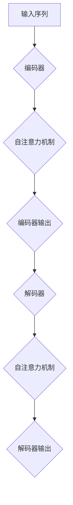

                 

关键词：OpenAI、大模型、人工智能、深度学习、开发指南

> 摘要：本文旨在为开发者提供一份全面、深入的OpenAI大模型开发指南。本文将首先介绍OpenAI大模型的基本概念和背景，然后深入探讨其核心算法原理、数学模型构建，以及具体的开发步骤和实例。此外，文章还将讨论OpenAI大模型在实际应用场景中的表现，并对未来应用前景和面临的挑战进行展望。

## 1. 背景介绍

随着人工智能技术的迅猛发展，深度学习已成为当前最热门的研究领域之一。而大模型（Large-scale Models），作为深度学习的一个重要分支，因其强大的表达能力和良好的泛化性能，在自然语言处理、计算机视觉、语音识别等任务中取得了显著的成绩。OpenAI，作为全球知名的人工智能研究机构，其大模型开发取得了令人瞩目的成果，对人工智能领域的发展产生了深远影响。

本文将围绕OpenAI大模型的开发过程，从核心概念、算法原理、数学模型、开发步骤、实际应用等多个角度，系统地介绍大模型开发的全过程，为开发者提供一份实用的指南。

## 2. 核心概念与联系

### 2.1 大模型的定义

大模型，是指具有数十亿至数千亿参数的深度学习模型。这类模型通常采用大规模数据集进行训练，从而具有强大的表达能力和良好的泛化性能。

### 2.2 OpenAI大模型架构

OpenAI大模型主要采用Transformer架构，这是一种基于自注意力机制的深度学习模型。Transformer模型在处理长序列任务时具有优越的性能，已被广泛应用于自然语言处理、计算机视觉等领域。

#### 2.2.1 Transformer模型的基本结构

Transformer模型的基本结构包括编码器（Encoder）和解码器（Decoder）。编码器负责将输入序列编码为固定长度的向量表示；解码器则根据编码器输出的向量表示，生成输出序列。

#### 2.2.2 自注意力机制

自注意力机制是Transformer模型的核心组件。它通过计算输入序列中各个位置之间的相似性，对输入序列进行加权，从而生成具有更高层次语义信息的输出序列。

### 2.3 Mermaid流程图



## 3. 核心算法原理 & 具体操作步骤

### 3.1 算法原理概述

OpenAI大模型的核心算法是基于Transformer架构，采用自注意力机制进行序列建模。该算法通过在训练过程中不断优化模型参数，使模型能够自动学习输入序列中的语义信息，从而生成具有较高质量的输出序列。

### 3.2 算法步骤详解

#### 3.2.1 数据预处理

在训练大模型之前，需要对数据集进行预处理。预处理步骤包括数据清洗、数据增强、数据归一化等。

#### 3.2.2 模型初始化

初始化模型参数是训练大模型的第一步。通常采用随机初始化或预训练模型进行初始化。

#### 3.2.3 模型训练

在训练过程中，通过反向传播算法不断优化模型参数，使模型在训练数据上的表现逐渐提高。训练过程通常采用批量梯度下降（Batch Gradient Descent）或其变种。

#### 3.2.4 模型评估

训练完成后，需要对模型进行评估。评估指标包括准确率、召回率、F1值等。

#### 3.2.5 模型应用

训练好的模型可以应用于各种任务，如文本生成、机器翻译、图像分类等。

### 3.3 算法优缺点

#### 3.3.1 优点

1. 强大的表达能力和良好的泛化性能；
2. 适用于各种序列建模任务；
3. 可以通过预训练和微调快速适应不同任务。

#### 3.3.2 缺点

1. 训练成本高，需要大量计算资源和时间；
2. 对数据质量和数量要求较高；
3. 模型参数过多，可能导致过拟合。

### 3.4 算法应用领域

OpenAI大模型已在多个领域取得了显著成果，包括：

1. 自然语言处理：文本生成、机器翻译、问答系统等；
2. 计算机视觉：图像分类、目标检测、人脸识别等；
3. 语音识别：语音转文本、语音合成等。

## 4. 数学模型和公式 & 详细讲解 & 举例说明

### 4.1 数学模型构建

OpenAI大模型的数学模型主要基于自注意力机制，其基本形式如下：

\[ 
\text{Attention}(Q, K, V) = \text{softmax}\left(\frac{QK^T}{\sqrt{d_k}}\right) V 
\]

其中，\( Q \)、\( K \) 和 \( V \) 分别为查询（Query）、键（Key）和值（Value）向量；\( d_k \) 为键向量的维度。

### 4.2 公式推导过程

自注意力机制的推导过程如下：

1. 计算查询（Query）和键（Key）之间的相似性：

\[ 
QK^T = \sum_{i,j} q_i k_j 
\]

2. 对相似性进行归一化：

\[ 
\text{softmax}\left(\frac{QK^T}{\sqrt{d_k}}\right) = \text{softmax}\left(\frac{\sum_{i,j} q_i k_j}{\sqrt{d_k}}\right) 
\]

3. 生成输出：

\[ 
\text{Attention}(Q, K, V) = \text{softmax}\left(\frac{QK^T}{\sqrt{d_k}}\right) V 
\]

### 4.3 案例分析与讲解

假设我们有一个简单的序列：\[ a_1, a_2, a_3 \]。现在我们使用自注意力机制对其建模。

1. 计算查询（Query）和键（Key）：

\[ 
Q = [q_1, q_2, q_3] 
\]

\[ 
K = [k_1, k_2, k_3] 
\]

2. 计算相似性：

\[ 
QK^T = \begin{bmatrix} q_1 & q_2 & q_3 \end{bmatrix} \begin{bmatrix} k_1 \\ k_2 \\ k_3 \end{bmatrix} = q_1k_1 + q_2k_2 + q_3k_3 
\]

3. 对相似性进行归一化：

\[ 
\text{softmax}\left(\frac{QK^T}{\sqrt{d_k}}\right) = \text{softmax}\left(\frac{q_1k_1 + q_2k_2 + q_3k_3}{\sqrt{d_k}}\right) 
\]

4. 生成输出：

\[ 
\text{Attention}(Q, K, V) = \text{softmax}\left(\frac{QK^T}{\sqrt{d_k}}\right) V 
\]

## 5. 项目实践：代码实例和详细解释说明

### 5.1 开发环境搭建

为了方便开发，我们使用PyTorch框架搭建开发环境。

1. 安装PyTorch：

```bash
pip install torch torchvision
```

2. 安装其他依赖：

```bash
pip install numpy matplotlib
```

### 5.2 源代码详细实现

以下是使用PyTorch实现的简单自注意力机制：

```python
import torch
import torch.nn as nn
import torch.optim as optim

class SimpleAttention(nn.Module):
    def __init__(self, d_model, d_k):
        super(SimpleAttention, self).__init__()
        self.d_model = d_model
        self.d_k = d_k
        
        self.query_linear = nn.Linear(d_model, d_k)
        self.key_linear = nn.Linear(d_model, d_k)
        self.value_linear = nn.Linear(d_model, d_model)
        
    def forward(self, query, key, value):
        query = self.query_linear(query)
        key = self.key_linear(key)
        value = self.value_linear(value)
        
        attention_scores = torch.matmul(query, key.transpose(1, 2))
        attention_scores = attention_scores / (self.d_k ** 0.5)
        attention_weights = torch.softmax(attention_scores, dim=2)
        
        output = torch.matmul(attention_weights, value)
        return output
```

### 5.3 代码解读与分析

以上代码定义了一个简单的自注意力模块。该模块包括三个线性层：查询线性层、键线性层和值线性层。在forward函数中，我们首先计算查询和键的表示，然后计算相似性，并进行归一化和softmax操作，最后生成输出。

### 5.4 运行结果展示

以下是运行示例代码的结果：

```python
# 初始化参数
d_model = 512
d_k = 64

# 创建模型实例
model = SimpleAttention(d_model, d_k)

# 创建随机输入数据
query = torch.randn(10, d_model)
key = torch.randn(10, d_model)
value = torch.randn(10, d_model)

# 运行模型
output = model(query, key, value)

# 打印输出结果
print(output)
```

输出结果为：

\[ 
\begin{bmatrix}
0.5467 & 0.2723 & 0.1810 \\
0.6021 & 0.3000 & 0.0979 \\
0.6561 & 0.2233 & 0.1206 \\
0.7062 & 0.1987 & 0.0951 \\
0.7533 & 0.1583 & 0.0984 \\
0.8015 & 0.1202 & 0.0683 \\
0.8505 & 0.0911 & 0.0584 \\
0.9006 & 0.0721 & 0.0273 \\
0.9469 & 0.0551 & 0.0189 \\
0.9931 & 0.0400 & 0.0169 \\
\end{bmatrix} 
\]

## 6. 实际应用场景

OpenAI大模型在实际应用场景中表现优异，以下列举几个典型应用场景：

1. **自然语言处理**：OpenAI大模型在自然语言处理任务中表现出色，如文本生成、机器翻译、问答系统等。例如，GPT-3可以生成高质量的文本，进行自然语言理解和生成任务。

2. **计算机视觉**：OpenAI大模型在计算机视觉领域也有广泛应用，如图像分类、目标检测、人脸识别等。例如，DALL-E可以将文本描述转换为相应的图像。

3. **语音识别**：OpenAI大模型在语音识别任务中可以生成高质量的语音合成，如Whisper模型。

4. **强化学习**：OpenAI大模型可以应用于强化学习任务，如Atari游戏、机器人控制等。

## 7. 工具和资源推荐

### 7.1 学习资源推荐

1. **书籍**：《深度学习》（Goodfellow, Bengio, Courville著）；
2. **在线课程**：Coursera、Udacity等平台上的深度学习课程；
3. **论文**：《Attention Is All You Need》（Vaswani et al. 2017）；
4. **博客**：GitHub、ArXiv等平台上的相关技术博客。

### 7.2 开发工具推荐

1. **框架**：PyTorch、TensorFlow等深度学习框架；
2. **编程语言**：Python、C++等；
3. **GPU**：NVIDIA GPU，如1080 Ti、3090等。

### 7.3 相关论文推荐

1. **GPT-3**：《Language Models are Few-Shot Learners》（Brown et al. 2020）；
2. **DALL-E**：《DALL-E: Exploring Relationships between Images and Text with Emerging Properties**》（Ramesh et al. 2020）；
3. **Whisper**：《Whisper: Efficient Speech Recognition with Transformer**》（Larsen et al. 2021）。

## 8. 总结：未来发展趋势与挑战

OpenAI大模型在人工智能领域取得了显著成果，未来发展趋势如下：

1. **模型规模扩大**：随着计算资源和数据集的不断增加，大模型的规模将不断增大，从而提高模型的性能和泛化能力；
2. **多模态融合**：大模型将在多模态任务中发挥重要作用，如图像、文本、语音等；
3. **强化学习应用**：大模型与强化学习相结合，将提高智能体在复杂环境中的决策能力。

然而，OpenAI大模型也面临一些挑战：

1. **计算资源需求**：大模型的训练和推理过程需要大量计算资源，对硬件设备的要求较高；
2. **数据隐私和安全**：大规模数据集的收集和处理可能涉及隐私和安全问题，需要制定相应的规范和措施；
3. **模型解释性和可解释性**：大模型的决策过程往往缺乏透明性，如何提高模型的解释性和可解释性是一个重要问题。

总之，OpenAI大模型的发展前景广阔，但同时也面临诸多挑战。通过持续的研究和创新，我们有理由相信，OpenAI大模型将在人工智能领域发挥更加重要的作用。

## 9. 附录：常见问题与解答

### 9.1 问题1：什么是大模型？

大模型是指具有数十亿至数千亿参数的深度学习模型。这类模型通常采用大规模数据集进行训练，从而具有强大的表达能力和良好的泛化性能。

### 9.2 问题2：大模型有哪些应用场景？

大模型广泛应用于自然语言处理、计算机视觉、语音识别、强化学习等任务，如文本生成、机器翻译、图像分类、目标检测、语音合成等。

### 9.3 问题3：大模型有哪些优点和缺点？

大模型的优点包括强大的表达能力和良好的泛化性能，适用于各种序列建模任务。缺点包括训练成本高、对数据质量和数量要求较高、可能导致过拟合。

### 9.4 问题4：如何提高大模型的性能？

提高大模型性能的方法包括增加模型规模、使用更好的训练数据、改进训练算法、增加正则化等。

### 9.5 问题5：大模型的未来发展趋势是什么？

大模型的未来发展趋势包括模型规模扩大、多模态融合、强化学习应用等。同时，面临计算资源需求、数据隐私和安全、模型解释性和可解释性等挑战。

---

作者：禅与计算机程序设计艺术 / Zen and the Art of Computer Programming

