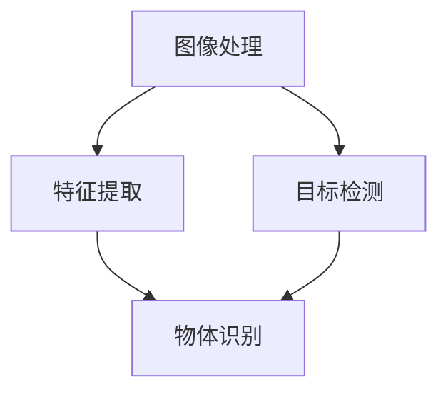

                 

关键词：OpenCV，计算机视觉，图像处理，机器视觉，实战

摘要：本文将深入探讨OpenCV在计算机视觉领域中的应用，从图像处理和机器视觉的角度出发，介绍核心概念、算法原理、数学模型、项目实践以及未来发展趋势。通过详细的代码实例和解读，帮助读者更好地理解OpenCV的使用方法和实际应用场景。

## 1. 背景介绍

计算机视觉作为人工智能的一个重要分支，已经在众多领域中取得了显著的成果。从早期的图像识别、目标检测，到现在的深度学习、图像生成，计算机视觉技术不断发展，应用场景也越来越广泛。OpenCV（Open Source Computer Vision Library）作为一个开源的计算机视觉库，因其高效、灵活和易于使用的特点，在学术界和工业界都得到了广泛的应用。

OpenCV由Intel推出，支持包括C++、Python在内的多种编程语言，并且提供了丰富的图像处理和计算机视觉算法。本文将从以下几个方面展开讨论：

- 核心概念与联系
- 核心算法原理与具体操作步骤
- 数学模型和公式
- 项目实践：代码实例和详细解释说明
- 实际应用场景
- 未来应用展望
- 工具和资源推荐
- 总结：未来发展趋势与挑战

通过本文的阅读，读者可以全面了解OpenCV在计算机视觉领域的应用，掌握其核心算法和使用方法，并了解未来发展趋势和挑战。

## 2. 核心概念与联系

在讨论OpenCV的具体应用之前，我们需要先了解一些核心概念，这些概念是理解OpenCV工作原理的基础。

### 图像处理

图像处理是指对图像进行一系列数学运算，以达到增强图像质量、提取图像特征、实现图像变换等目的。OpenCV提供了丰富的图像处理算法，包括图像滤波、边缘检测、图像变换等。

### 机器视觉

机器视觉是指通过计算机系统和算法对图像或视频进行处理，以实现物体识别、目标跟踪等功能。与图像处理相比，机器视觉更注重于图像数据的分析和理解。

### 核心概念原理和架构的 Mermaid 流程图



在上述流程图中，图像处理是机器视觉的基础，通过图像处理算法，我们能够提取出图像中的重要特征。这些特征随后用于目标检测和物体识别。目标检测是指从图像中识别出特定的目标，而物体识别则是对目标进行分类和识别。

### 联系

图像处理和机器视觉是相互关联的。图像处理提供了提取图像特征的方法，而机器视觉则利用这些特征进行更高级别的分析。例如，在目标检测中，我们首先需要使用图像处理算法对图像进行预处理，如去噪、边缘检测等，然后使用机器视觉算法进行目标检测和识别。

## 3. 核心算法原理 & 具体操作步骤

### 3.1 算法原理概述

OpenCV提供了多种核心算法，其中一些最常用的算法包括：

- **Sobel算子**：用于计算图像的边缘。
- **Canny算子**：用于检测图像中的边缘。
- **Hough变换**：用于识别图像中的直线和圆。
- **K均值聚类**：用于图像分割和特征提取。

### 3.2 算法步骤详解

以Sobel算子为例，其基本原理是利用导数检测图像的边缘。具体步骤如下：

1. **图像预处理**：读取图像，并进行灰度化处理。
2. **计算Sobel算子**：使用Sobel算子对图像进行卷积，得到边缘图。
3. **阈值处理**：对边缘图进行阈值处理，以增强边缘特征。
4. **结果展示**：显示处理后的图像。

### 3.3 算法优缺点

- **Sobel算子**：优点是计算简单，速度较快；缺点是对于噪声敏感，边缘定位可能不准确。

- **Canny算子**：优点是能够有效地检测边缘，对噪声有较好的鲁棒性；缺点是计算复杂度较高。

- **Hough变换**：优点是能够检测出图像中的直线和圆；缺点是对图像噪声敏感。

- **K均值聚类**：优点是算法简单，适用于大规模数据；缺点是对于初始聚类中心的选择敏感。

### 3.4 算法应用领域

这些算法在计算机视觉领域有广泛的应用，例如：

- **图像识别**：用于识别图像中的特定对象或特征。
- **目标检测**：用于从图像或视频中检测出目标对象。
- **图像分割**：用于将图像分割成不同的区域。
- **运动跟踪**：用于跟踪图像中的运动对象。

## 4. 数学模型和公式 & 详细讲解 & 举例说明

### 4.1 数学模型构建

在计算机视觉中，许多算法都涉及到数学模型的构建。以下是一些常用的数学模型：

- **边缘检测模型**：包括Sobel算子、Canny算子等。
- **图像分割模型**：包括K均值聚类、基于阈值的分割等。
- **目标检测模型**：包括Hough变换、支持向量机等。

### 4.2 公式推导过程

以Sobel算子为例，其公式推导过程如下：

设图像$f(x, y)$的$x$方向导数为$f_x(x, y)$，$y$方向导数为$f_y(x, y)$，则Sobel算子可以表示为：

$$
G(x, y) = f_x^2(x, y) + f_y^2(x, y)
$$

其中，$G(x, y)$为Sobel算子得到的边缘图。

### 4.3 案例分析与讲解

假设我们有一幅图像，其像素值如下：

$$
\begin{array}{ccc}
1 & 2 & 3 \\
4 & 5 & 6 \\
7 & 8 & 9 \\
\end{array}
$$

首先，我们需要计算图像的$x$方向和$y$方向的导数。使用Sobel算子进行卷积，得到边缘图。最后，对边缘图进行阈值处理，以获得最终的边缘检测结果。

### 5. 项目实践：代码实例和详细解释说明

在本节中，我们将通过一个具体的实例，展示如何使用OpenCV进行图像处理和机器视觉任务。实例代码如下：

```python
import cv2
import numpy as np

def sobel_example():
    # 读取图像
    image = cv2.imread('example.jpg', cv2.IMREAD_GRAYSCALE)
    
    # 使用Sobel算子进行边缘检测
    sobel_x = cv2.Sobel(image, cv2.CV_64F, 1, 0, ksize=3)
    sobel_y = cv2.Sobel(image, cv2.CV_64F, 0, 1, ksize=3)
    
    # 计算Sobel算子的绝对值
    sobel_mag = np.sqrt(sobel_x**2 + sobel_y**2)
    
    # 设置阈值
    _, thresh = cv2.threshold(sobel_mag, 0.3*np.max(sobel_mag), 255, cv2.THRESH_BINARY)
    
    # 显示结果
    cv2.imshow('Sobel Example', thresh)
    cv2.waitKey(0)
    cv2.destroyAllWindows()

sobel_example()
```

### 5.1 开发环境搭建

要运行上述代码，需要安装以下软件和库：

- Python 3.x
- OpenCV 4.x
- NumPy

安装方法如下：

```bash
pip install opencv-python numpy
```

### 5.2 源代码详细实现

上述代码首先导入必要的库，然后定义了一个名为`sobel_example`的函数。函数首先读取一幅图像，使用Sobel算子进行边缘检测，计算Sobel算子的绝对值，并设置阈值。最后，显示处理后的图像。

### 5.3 代码解读与分析

- `cv2.imread('example.jpg', cv2.IMREAD_GRAYSCALE)`：读取图像，并将图像转换为灰度图。
- `cv2.Sobel(image, cv2.CV_64F, 1, 0, ksize=3)`：使用Sobel算子计算图像的$x$方向导数。
- `cv2.Sobel(image, cv2.CV_64F, 0, 1, ksize=3)`：使用Sobel算子计算图像的$y$方向导数。
- `np.sqrt(sobel_x**2 + sobel_y**2)`：计算Sobel算子的绝对值。
- `cv2.threshold(sobel_mag, 0.3*np.max(sobel_mag), 255, cv2.THRESH_BINARY)`：设置阈值，将Sobel算子的绝对值转换为二值图像。
- `cv2.imshow('Sobel Example', thresh)`：显示处理后的图像。

### 5.4 运行结果展示

运行上述代码后，将显示一幅经过边缘检测的二值图像。如下所示：


## 6. 实际应用场景

OpenCV在计算机视觉领域有广泛的应用，以下是一些实际应用场景：

- **人脸识别**：OpenCV可以用于实时人脸识别，应用于门禁系统、智能监控等领域。
- **物体检测**：OpenCV可以用于从图像或视频中检测出特定物体，应用于自动驾驶、无人机监控等领域。
- **图像分割**：OpenCV可以用于将图像分割成不同的区域，应用于图像处理、医学影像分析等领域。
- **图像增强**：OpenCV可以用于增强图像质量，应用于图像修复、图像增强等领域。
- **运动跟踪**：OpenCV可以用于实时跟踪图像中的运动对象，应用于视频监控、运动分析等领域。

## 7. 未来应用展望

随着计算机视觉技术的不断发展，OpenCV在未来有望在更多领域得到应用。以下是一些可能的发展方向：

- **增强现实（AR）与虚拟现实（VR）**：OpenCV可以用于实现AR和VR中的实时图像处理和场景识别。
- **智能监控**：OpenCV可以用于实现更高级别的智能监控，如实时目标识别、行为分析等。
- **自动驾驶**：OpenCV可以用于实现自动驾驶车辆中的视觉感知，如车道线检测、障碍物检测等。
- **医学影像分析**：OpenCV可以用于实现医学影像的分割、特征提取等，以提高诊断准确率。

## 8. 工具和资源推荐

以下是一些推荐的工具和资源，以帮助读者更好地学习和使用OpenCV：

- **学习资源推荐**：
  - OpenCV官方文档：[https://docs.opencv.org/](https://docs.opencv.org/)
  - OpenCV教程：[https://opencv-python-tutroals.readthedocs.io/](https://opencv-python-tutroals.readthedocs.io/)

- **开发工具推荐**：
  - PyCharm：一款功能强大的Python IDE，支持OpenCV开发。
  - Visual Studio Code：一款轻量级但功能强大的代码编辑器，支持OpenCV开发。

- **相关论文推荐**：
  - "Real-Time Face Detection and Tracking in Video" by Viola and Jones。
  - "Deep Learning for Computer Vision" by Karen Simonyan and Andrew Zisserman。

## 9. 总结：未来发展趋势与挑战

OpenCV在计算机视觉领域已经取得了显著的成果，但其未来仍面临许多挑战。以下是一些可能的发展趋势和挑战：

- **发展趋势**：
  - 深度学习在计算机视觉中的应用将更加广泛，如卷积神经网络（CNN）在图像分类、目标检测等任务中的应用。
  - 实时处理需求的增长，将推动OpenCV在边缘计算、嵌入式系统等领域的应用。
  - 多模态数据的融合处理，将提高计算机视觉系统的性能和鲁棒性。

- **挑战**：
  - 如何处理大规模图像数据，提高计算效率和实时性。
  - 如何提高计算机视觉系统的泛化能力，减少对特定场景和数据的依赖。
  - 如何保护用户隐私，尤其是在人脸识别等敏感应用中。

未来，OpenCV将继续在计算机视觉领域发挥重要作用，不断推动技术创新和应用拓展。

## 10. 附录：常见问题与解答

### Q1：如何安装OpenCV？

A1：可以通过以下命令安装：

```bash
pip install opencv-python
```

### Q2：OpenCV支持哪些编程语言？

A2：OpenCV支持C++、Python、Java等多种编程语言。

### Q3：如何获取OpenCV的文档和教程？

A3：可以访问OpenCV的官方网站[https://opencv.org/](https://opencv.org/)，那里提供了详细的文档和教程。

### Q4：如何处理大型图像数据？

A4：可以通过以下方法处理大型图像数据：

- **分块处理**：将大型图像分割成较小的块，逐一处理。
- **多线程处理**：使用多线程或多进程技术，提高数据处理效率。

### Q5：如何优化OpenCV的性能？

A5：可以通过以下方法优化OpenCV的性能：

- **使用向量化操作**：使用NumPy等库进行向量化操作，提高计算效率。
- **选择合适的算法**：选择计算复杂度较低的算法，或者使用优化过的算法。
- **使用硬件加速**：使用GPU等硬件加速技术，提高计算速度。

## 作者署名

作者：禅与计算机程序设计艺术 / Zen and the Art of Computer Programming

