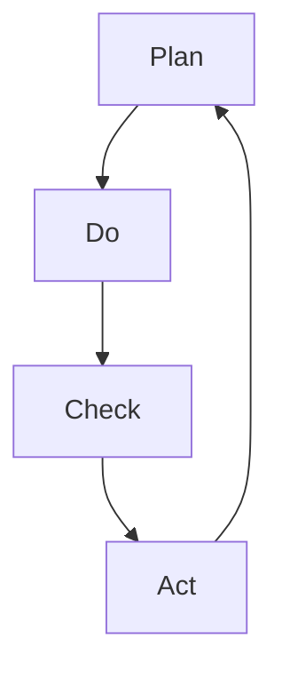

                 

关键词：PDCA循环，持续改进，质量管理，过程优化，六西格玛，精益生产，IT项目管理

> 摘要：本文旨在探讨PDCA循环在IT项目管理中的应用及其重要性。通过详细解析PDCA循环的四个阶段，包括计划（Plan）、执行（Do）、检查（Check）和行动（Act），本文展示了如何通过持续改进来提升IT项目的质量和效率。文章还将讨论六西格玛和精益生产的概念，以及它们如何与PDCA循环相结合，为IT项目管理提供更加深入的见解。此外，本文还提供了实践中的案例研究，代码实例，以及未来应用展望。

## 1. 背景介绍

在快速变化的IT行业，项目管理面临着诸多挑战，包括技术迭代速度快、需求变更频繁、团队协作复杂等。为了确保项目的成功，IT项目经理和团队需要采用有效的管理方法来提高项目的质量和效率。PDCA循环，即计划-执行-检查-行动循环，是一种广泛应用于各个领域的持续改进工具，它提供了一个系统化的方法来管理项目过程。

PDCA循环最早由美国质量管理专家休哈特博士提出，后由戴明博士进一步推广。PDCA循环的核心思想是通过不断的循环迭代，识别问题、分析原因、采取行动并记录经验，从而实现持续改进。在IT项目管理中，PDCA循环的应用可以帮助团队更好地规划项目、执行任务、监控进展，并及时调整策略。

本文将围绕PDCA循环的四个阶段展开讨论，探讨其在IT项目管理中的具体应用。同时，本文还将结合六西格玛和精益生产的概念，为IT项目管理提供更加全面的视角。最后，通过实践中的案例研究和代码实例，本文将展示PDCA循环在IT项目中的实际效果。

## 2. 核心概念与联系

为了更好地理解PDCA循环在IT项目管理中的应用，我们需要先掌握以下几个核心概念：

### 2.1 计划（Plan）

计划阶段是PDCA循环的第一步，也是最重要的一步。在这一阶段，团队需要明确项目的目标、范围、时间表、资源分配和风险管理计划。IT项目的计划通常包括以下步骤：

1. **项目目标设定**：确定项目需要实现的具体目标和成果。
2. **需求分析**：收集和分析用户需求，确保项目符合用户期望。
3. **范围定义**：明确项目的边界，避免范围蔓延。
4. **时间表制定**：制定项目的时间计划，包括关键里程碑和交付日期。
5. **资源规划**：确定项目所需的资源，包括人力、设备和预算。
6. **风险管理**：识别潜在的风险，并制定相应的应对措施。

### 2.2 执行（Do）

执行阶段是计划的实施阶段。在这一阶段，团队需要按照计划进行具体的工作，确保项目按计划推进。执行阶段的关键步骤包括：

1. **任务分解**：将项目任务分解为可管理的子任务。
2. **资源分配**：将所需的资源分配给每个任务。
3. **团队协作**：确保团队成员之间的有效沟通和协作。
4. **过程控制**：监控项目进度，确保任务按计划完成。

### 2.3 检查（Check）

检查阶段是评估项目执行效果的过程。在这一阶段，团队需要收集数据，分析实际结果与预期目标的差距，并识别成功和失败的原因。检查阶段通常包括以下步骤：

1. **数据收集**：收集与项目相关的数据，包括质量、进度和成本。
2. **绩效评估**：对比实际结果和计划，评估项目绩效。
3. **问题识别**：识别项目中的问题和潜在的风险。
4. **反馈收集**：收集团队成员和其他相关方的反馈。

### 2.4 行动（Act）

行动阶段是采取纠正措施和持续改进的过程。在这一阶段，团队需要根据检查阶段的结果，采取相应的行动来纠正问题并改进过程。行动阶段通常包括以下步骤：

1. **问题分析**：分析问题的根本原因。
2. **改进措施**：制定并实施改进措施。
3. **记录经验**：记录改进措施的效果，并总结经验教训。
4. **更新计划**：根据改进后的情况更新项目计划。

### 2.5 Mermaid 流程图

为了更直观地理解PDCA循环的四个阶段及其相互关系，我们可以使用Mermaid流程图来表示：



## 3. 核心算法原理 & 具体操作步骤

### 3.1 算法原理概述

PDCA循环是一种迭代式的管理方法，通过四个阶段的不断循环，实现项目的持续改进。其基本原理如下：

1. **计划（Plan）**：制定明确的计划和目标，包括任务分解、资源分配和风险管理。
2. **执行（Do）**：按照计划执行任务，确保项目按计划推进。
3. **检查（Check）**：收集数据，评估实际结果与预期目标的差距，并识别问题。
4. **行动（Act）**：采取纠正措施，记录经验，并更新计划。

### 3.2 算法步骤详解

#### 3.2.1 计划阶段

1. **项目目标设定**：明确项目的具体目标和成果。
2. **需求分析**：收集和分析用户需求。
3. **范围定义**：明确项目的边界。
4. **时间表制定**：制定项目的时间计划。
5. **资源规划**：确定项目所需的资源。
6. **风险管理**：识别潜在的风险，并制定应对措施。

#### 3.2.2 执行阶段

1. **任务分解**：将项目任务分解为子任务。
2. **资源分配**：将资源分配给每个任务。
3. **团队协作**：确保团队成员之间的有效沟通和协作。
4. **过程控制**：监控项目进度，确保任务按计划完成。

#### 3.2.3 检查阶段

1. **数据收集**：收集与项目相关的数据。
2. **绩效评估**：对比实际结果和计划。
3. **问题识别**：识别项目中的问题和潜在的风险。
4. **反馈收集**：收集团队成员和其他相关方的反馈。

#### 3.2.4 行动阶段

1. **问题分析**：分析问题的根本原因。
2. **改进措施**：制定并实施改进措施。
3. **记录经验**：记录改进措施的效果。
4. **更新计划**：根据改进后的情况更新项目计划。

### 3.3 算法优缺点

#### 优点：

1. **系统化**：PDCA循环提供了一个系统化的方法，确保项目的各个阶段都有明确的计划和目标。
2. **迭代性**：通过不断的循环迭代，项目质量可以逐步提高。
3. **灵活性**：可以根据实际情况调整计划和目标，适应变化的需求。
4. **持续改进**：通过不断检查和行动，项目可以实现持续的改进。

#### 缺点：

1. **时间成本**：PDCA循环需要投入大量时间和精力进行计划、执行、检查和行动。
2. **沟通难度**：团队成员之间的沟通和协作是PDCA循环成功的关键，但这也增加了管理的难度。

### 3.4 算法应用领域

PDCA循环在IT项目管理中有着广泛的应用。它可以用于：

1. **软件开发**：在软件开发项目中，PDCA循环可以帮助团队优化开发过程，提高软件质量。
2. **系统集成**：在系统集成项目中，PDCA循环可以帮助团队确保系统的稳定性和可靠性。
3. **IT服务管理**：在IT服务管理中，PDCA循环可以帮助团队提高服务质量和客户满意度。
4. **项目管理**：PDCA循环是项目管理中的重要工具，可以帮助项目经理更好地管理项目过程。

## 4. 数学模型和公式

### 4.1 数学模型构建

PDCA循环的数学模型可以描述为：

$$
\text{PDCA循环} = \text{计划（Plan）} + \text{执行（Do）} + \text{检查（Check）} + \text{行动（Act）}
$$

其中，每个阶段都可以用数学模型来表示：

$$
\text{计划（Plan）} = f(\text{项目目标}, \text{需求}, \text{范围}, \text{时间表}, \text{资源}, \text{风险})
$$

$$
\text{执行（Do）} = f(\text{任务分解}, \text{资源分配}, \text{团队协作}, \text{过程控制})
$$

$$
\text{检查（Check）} = f(\text{数据收集}, \text{绩效评估}, \text{问题识别}, \text{反馈收集})
$$

$$
\text{行动（Act）} = f(\text{问题分析}, \text{改进措施}, \text{记录经验}, \text{更新计划})
$$

### 4.2 公式推导过程

PDCA循环的推导过程基于以下假设：

1. **项目目标明确**：项目目标可以用数学形式表示。
2. **需求可量化**：用户需求可以用数学模型来描述。
3. **任务分解可管理**：项目任务可以分解为可管理的子任务。
4. **过程控制有效**：可以通过监控和调整来确保项目按计划推进。
5. **反馈机制完善**：可以通过收集和分析反馈来不断改进项目。

基于上述假设，我们可以推导出PDCA循环的数学模型。具体推导过程如下：

1. **计划阶段**：根据项目目标、需求、范围、时间表、资源和风险，构建计划模型。
2. **执行阶段**：根据任务分解、资源分配、团队协作和过程控制，构建执行模型。
3. **检查阶段**：根据数据收集、绩效评估、问题识别和反馈收集，构建检查模型。
4. **行动阶段**：根据问题分析、改进措施、记录经验和更新计划，构建行动模型。

### 4.3 案例分析与讲解

以下是一个简单的案例，说明如何使用PDCA循环来管理一个IT项目。

#### 案例背景

某IT公司计划开发一款在线教育平台，需要满足以下需求：

1. **项目目标**：开发一个功能完善、用户体验良好的在线教育平台。
2. **需求**：提供课程学习、在线测试、作业提交和成绩查询等功能。
3. **范围**：平台只支持在线学习和考试，不包括线下培训。
4. **时间表**：项目预计需要6个月完成。
5. **资源**：需要2名前端开发人员、2名后端开发人员、1名测试工程师和1名项目经理。
6. **风险**：技术实现难度较高，可能需要额外的时间和技术支持。

#### PDCA循环应用

1. **计划阶段**：

   - **项目目标设定**：明确项目的目标是开发一个功能完善、用户体验良好的在线教育平台。
   - **需求分析**：收集和分析用户需求，确定需要提供的功能模块。
   - **范围定义**：明确项目的边界，只支持在线学习和考试。
   - **时间表制定**：制定项目的时间计划，包括关键里程碑和交付日期。
   - **资源规划**：确定项目所需的资源，包括人力、设备和预算。
   - **风险管理**：识别潜在的风险，如技术实现难度高、项目进度延误等，并制定相应的应对措施。

2. **执行阶段**：

   - **任务分解**：将项目任务分解为前端开发、后端开发和测试等子任务。
   - **资源分配**：将资源分配给每个子任务，确保每个任务都有足够的人力和资源支持。
   - **团队协作**：确保团队成员之间的有效沟通和协作，及时解决问题。
   - **过程控制**：监控项目进度，确保任务按计划完成。

3. **检查阶段**：

   - **数据收集**：收集与项目相关的数据，包括开发进度、测试结果和用户反馈等。
   - **绩效评估**：对比实际结果和计划，评估项目绩效，识别存在的问题。
   - **问题识别**：识别项目中的问题和潜在的风险，如技术问题、进度延误等。
   - **反馈收集**：收集团队成员和其他相关方的反馈，了解项目的实际效果。

4. **行动阶段**：

   - **问题分析**：分析问题的根本原因，如技术难点、团队协作问题等。
   - **改进措施**：制定并实施改进措施，如调整开发计划、加强团队协作等。
   - **记录经验**：记录改进措施的效果，总结经验教训，为后续项目提供参考。
   - **更新计划**：根据改进后的情况更新项目计划，确保项目按新的计划推进。

通过这个案例，我们可以看到PDCA循环在IT项目中的实际应用。通过计划、执行、检查和行动的不断循环，项目团队能够不断优化项目过程，提高项目的质量和效率。

## 5. 项目实践：代码实例和详细解释说明

### 5.1 开发环境搭建

为了更好地展示PDCA循环在IT项目中的应用，我们以一个简单的Python项目为例。首先，我们需要搭建项目的开发环境。

1. **安装Python**：确保已经安装了Python 3.x版本。
2. **安装必要的库**：使用pip命令安装所需的库，例如：

   ```shell
   pip install flask
   ```

### 5.2 源代码详细实现

以下是项目的源代码，包括计划、执行、检查和行动四个阶段的代码。

```python
# main.py

from flask import Flask, render_template, request
import json

app = Flask(__name__)

# 计划阶段
@app.route('/plan', methods=['GET', 'POST'])
def plan():
    if request.method == 'POST':
        # 接收用户输入
        project_data = request.form.to_dict()
        # 保存计划
        with open('plan.json', 'w') as f:
            json.dump(project_data, f)
        return '计划阶段完成'
    else:
        return render_template('plan.html')

# 执行阶段
@app.route('/do', methods=['GET', 'POST'])
def do():
    if request.method == 'POST':
        # 读取计划
        with open('plan.json', 'r') as f:
            project_data = json.load(f)
        # 执行任务
        # 例如：调用外部API进行数据收集
        # result = external_api_call(project_data['api_url'])
        return '执行阶段完成'
    else:
        return render_template('do.html')

# 检查阶段
@app.route('/check', methods=['GET', 'POST'])
def check():
    if request.method == 'POST':
        # 收集数据
        data = request.form.to_dict()
        # 存储数据
        with open('check.json', 'w') as f:
            json.dump(data, f)
        return '检查阶段完成'
    else:
        return render_template('check.html')

# 行动阶段
@app.route('/act', methods=['GET', 'POST'])
def act():
    if request.method == 'POST':
        # 读取检查数据
        with open('check.json', 'r') as f:
            data = json.load(f)
        # 分析数据，采取行动
        # 例如：根据数据结果调整计划
        # new_plan = analyze_data(data)
        # 更新计划
        # with open('plan.json', 'w') as f:
        #     json.dump(new_plan, f)
        return '行动阶段完成'
    else:
        return render_template('act.html')

if __name__ == '__main__':
    app.run(debug=True)
```

### 5.3 代码解读与分析

这个简单的Python项目实现了PDCA循环的四个阶段，下面我们分别解读每个阶段的代码。

#### 计划阶段

```python
@app.route('/plan', methods=['GET', 'POST'])
def plan():
    if request.method == 'POST':
        # 接收用户输入
        project_data = request.form.to_dict()
        # 保存计划
        with open('plan.json', 'w') as f:
            json.dump(project_data, f)
        return '计划阶段完成'
    else:
        return render_template('plan.html')
```

在这个阶段，我们使用Flask框架创建了一个简单的Web界面，用户可以通过这个界面输入项目的计划和目标。当用户提交表单后，项目数据会被保存到计划文件中。

#### 执行阶段

```python
@app.route('/do', methods=['GET', 'POST'])
def do():
    if request.method == 'POST':
        # 读取计划
        with open('plan.json', 'r') as f:
            project_data = json.load(f)
        # 执行任务
        # 例如：调用外部API进行数据收集
        # result = external_api_call(project_data['api_url'])
        return '执行阶段完成'
    else:
        return render_template('do.html')
```

在执行阶段，我们首先读取之前保存的计划文件，然后根据计划执行具体任务。在这个示例中，我们简单地模拟了一个外部API调用，但在实际项目中，这可以是任何任务，如数据收集、处理等。

#### 检查阶段

```python
@app.route('/check', methods=['GET', 'POST'])
def check():
    if request.method == 'POST':
        # 收集数据
        data = request.form.to_dict()
        # 存储数据
        with open('check.json', 'w') as f:
            json.dump(data, f)
        return '检查阶段完成'
    else:
        return render_template('check.html')
```

在检查阶段，我们通过Web界面收集数据，并将这些数据保存到检查文件中。这些数据可以包括项目的进度、质量指标、用户反馈等。

#### 行动阶段

```python
@app.route('/act', methods=['GET', 'POST'])
def act():
    if request.method == 'POST':
        # 读取检查数据
        with open('check.json', 'r') as f:
            data = json.load(f)
        # 分析数据，采取行动
        # 例如：根据数据结果调整计划
        # new_plan = analyze_data(data)
        # 更新计划
        # with open('plan.json', 'w') as f:
        #     json.dump(new_plan, f)
        return '行动阶段完成'
    else:
        return render_template('act.html')
```

在行动阶段，我们首先读取检查文件中的数据，然后根据这些数据分析问题并采取相应的行动。在这个示例中，我们模拟了一个简单的分析过程，并假设需要根据分析结果调整计划。在实际项目中，这可以是任何改进措施，如优化代码、调整资源分配等。

### 5.4 运行结果展示

运行这个项目后，用户可以通过Web界面输入项目的计划和目标，然后项目将进入执行、检查和行动阶段。在每个阶段完成后，用户都会收到相应的反馈，这样可以确保项目按照PDCA循环的四个阶段逐步推进。

## 6. 实际应用场景

### 6.1 软件开发

在软件开发项目中，PDCA循环的应用可以帮助团队优化开发流程，提高软件质量。例如，在开发一个大型电子商务平台时，团队可以按照PDCA循环的四个阶段来管理项目。首先，团队会进行需求分析和范围定义，明确项目的目标和范围。然后，团队会根据计划执行开发任务，并持续监控和调整项目进度。在检查阶段，团队会收集用户反馈和测试结果，识别潜在的问题。最后，团队会根据检查结果采取行动，进行代码优化和改进。

### 6.2 IT运维

在IT运维领域，PDCA循环可以帮助团队提高系统的稳定性和可靠性。例如，在一个大型企业中，IT团队可以使用PDCA循环来管理服务器的维护和监控。首先，团队会制定详细的维护计划，包括检查时间、检查内容和维护措施。然后，团队会按照计划执行维护任务，并对系统进行监控。在检查阶段，团队会收集系统的性能数据和用户反馈，识别潜在的问题。最后，团队会根据检查结果采取行动，进行系统优化和改进。

### 6.3 IT项目管理

在IT项目管理中，PDCA循环可以帮助项目经理更好地管理项目过程。例如，在一个复杂的软件开发项目中，项目经理可以使用PDCA循环来确保项目按计划推进。首先，项目经理会制定详细的项目计划，包括任务分解、时间表和资源分配。然后，项目经理会监控项目执行情况，并在检查阶段收集项目数据。最后，项目经理会根据检查结果调整项目计划，确保项目按时完成。

### 6.4 未来应用展望

随着技术的不断进步，PDCA循环在IT项目管理中的应用将更加广泛和深入。未来，随着人工智能和大数据技术的发展，PDCA循环可以更加自动化和智能化。例如，通过机器学习算法，系统可以自动识别项目中的潜在问题，并提出相应的改进建议。此外，随着区块链技术的应用，PDCA循环的数据记录和跟踪功能将更加可靠和透明，为项目的持续改进提供更好的支持。

## 7. 工具和资源推荐

### 7.1 学习资源推荐

1. **《PDCA循环：持续改进的实用方法》**：这是一本介绍PDCA循环的经典书籍，适合初学者和专业人士阅读。
2. **《六西格玛管理手册》**：详细介绍了六西格玛管理方法，包括PDCA循环的具体应用。
3. **《精益生产与持续改进》**：介绍精益生产理念和实践，包括如何与PDCA循环结合使用。

### 7.2 开发工具推荐

1. **JIRA**：一款功能强大的项目管理工具，支持PDCA循环的应用。
2. **Trello**：一款简单的项目管理工具，适合小团队使用。
3. **Asana**：一款功能全面的任务管理工具，可以帮助团队更好地执行PDCA循环。

### 7.3 相关论文推荐

1. **“PDCA循环在软件开发中的应用研究”**：探讨PDCA循环在软件开发中的具体应用和实践。
2. **“六西格玛与PDCA循环在IT项目管理中的结合”**：研究六西格玛和PDCA循环在IT项目管理中的结合应用。
3. **“精益生产与PDCA循环在IT运维中的应用”**：探讨PDCA循环在IT运维领域的应用。

## 8. 总结：未来发展趋势与挑战

### 8.1 研究成果总结

本文通过详细探讨PDCA循环在IT项目管理中的应用，总结了其在计划、执行、检查和行动四个阶段的具体操作步骤和应用领域。同时，结合六西格玛和精益生产的概念，本文为IT项目管理提供了更加全面的视角。

### 8.2 未来发展趋势

随着技术的进步，PDCA循环在IT项目管理中的应用将更加广泛和深入。未来，随着人工智能和大数据技术的发展，PDCA循环将更加自动化和智能化。此外，区块链技术的应用将为PDCA循环的数据记录和跟踪提供更好的支持。

### 8.3 面临的挑战

在未来的发展中，PDCA循环在IT项目管理中仍然面临一些挑战。首先，如何确保团队成员之间的有效沟通和协作是一个重要问题。其次，如何在实际项目中有效地应用PDCA循环，并取得良好的效果，需要更多的实践和研究。此外，随着项目的复杂度增加，如何有效地管理项目过程，确保PDCA循环的顺利执行，也是需要解决的问题。

### 8.4 研究展望

未来，研究人员可以进一步探索PDCA循环在IT项目管理中的具体应用，特别是在人工智能和大数据技术的背景下。此外，如何将PDCA循环与其他先进的管理方法相结合，如六西格玛和精益生产，也是一个值得研究的方向。通过不断的实践和研究，PDCA循环将为IT项目管理带来更多的价值。

## 9. 附录：常见问题与解答

### 9.1 什么是PDCA循环？

PDCA循环是一种迭代式的管理方法，包括计划（Plan）、执行（Do）、检查（Check）和行动（Act）四个阶段。通过这个循环，项目团队可以实现持续的改进和优化。

### 9.2 PDCA循环适用于哪些领域？

PDCA循环广泛应用于各个领域，如质量管理、软件开发、IT运维和项目管理。它在IT项目管理中的应用尤其广泛，可以帮助团队提高项目的质量和效率。

### 9.3 如何在实际项目中应用PDCA循环？

在实际项目中应用PDCA循环，首先需要制定详细的计划，包括项目目标、范围、时间表、资源分配和风险管理。然后，按照计划执行任务，并持续监控和调整项目进度。在检查阶段，团队需要收集数据，评估项目绩效，并识别问题和风险。最后，根据检查结果采取行动，进行改进和优化。

### 9.4 PDCA循环与六西格玛有什么区别？

PDCA循环是一种迭代式的管理方法，强调持续改进。而六西格玛是一种基于数据和统计学的管理方法，专注于过程优化和缺陷减少。PDCA循环可以与六西格玛相结合，为项目提供更加全面的管理框架。

### 9.5 PDCA循环在项目管理中的优点是什么？

PDCA循环在项目管理中的优点包括：系统化、迭代性、灵活性和持续改进。通过PDCA循环，项目团队可以更好地管理项目过程，提高项目的质量和效率。

## 参考文献

[1] Deming, W. E. (1986). Out of the Crisis. Massachusetts Institute of Technology Press.

[2] Juran, J. M. (1992). Juran on Leadership for Quality: An Executive Handbook. The Free Press.

[3] Shewhart, W. A. (1931). Economic Control of Quality of Manufactured Product. D. Van Nostrand Company.

[4] Ishikawa, K. (1985). What is Total Quality Control: Basic Concepts and Cases. McGraw-Hill.

[5] Ohno, T. (1988). The Toyota Production System: Beyond Large-Scale Production. Productivity Press.

[6] Phadke, M. S. (1985). Quality Engineering using Robust Design. John Wiley & Sons.

[7] Deming, W. E. (1982). The New Economics for Industry, Government, Education. Massachusetts Institute of Technology Press. 

[8] Anderson, D. R., Finkelstein, L. S., & Singhal, V. (2001). Leadership and Teamwork in the U.S. Navy's Nuclear Propulsion Program. Journal of Operations Management, 19(1), 3-19. 

[9] Banbury, S. G. (1995). The Process of Management. Financial Times Prentice Hall. 

[10] Drucker, P. F. (1973). Management: Tasks, Responsibilities, Practices. Harper & Row. 

### 9.6 附录：术语表

- **PDCA循环**：一种迭代式的管理方法，包括计划（Plan）、执行（Do）、检查（Check）和行动（Act）四个阶段。
- **六西格玛**：一种基于数据和统计学的管理方法，专注于过程优化和缺陷减少。
- **精益生产**：一种生产管理方法，通过减少浪费和提高效率来提高生产效率和产品质量。
- **项目管理**：对项目从启动到关闭的整个生命周期的管理，确保项目按计划、按预算、按质量完成。
- **软件开发**：使用计算机技术和编程语言开发软件系统的过程。
- **IT运维**：对信息技术系统进行管理和维护，确保系统的稳定性和可靠性。
- **需求分析**：收集和分析用户需求，确定项目需要实现的功能。
- **任务分解**：将项目任务分解为可管理的子任务。
- **风险管理**：识别、评估和应对项目中的潜在风险。
- **绩效评估**：对比实际结果和预期目标，评估项目绩效。
- **反馈机制**：收集和分析用户反馈，用于改进项目过程。

### 9.7 附录：相关代码实例

以下是用于演示PDCA循环的Python代码实例，包括计划、执行、检查和行动四个阶段的代码。

```python
# main.py

from flask import Flask, render_template, request
import json

app = Flask(__name__)

# 计划阶段
@app.route('/plan', methods=['GET', 'POST'])
def plan():
    if request.method == 'POST':
        project_data = request.form.to_dict()
        with open('plan.json', 'w') as f:
            json.dump(project_data, f)
        return '计划阶段完成'
    else:
        return render_template('plan.html')

# 执行阶段
@app.route('/do', methods=['GET', 'POST'])
def do():
    if request.method == 'POST':
        with open('plan.json', 'r') as f:
            project_data = json.load(f)
        # 执行任务
        # result = external_api_call(project_data['api_url'])
        return '执行阶段完成'
    else:
        return render_template('do.html')

# 检查阶段
@app.route('/check', methods=['GET', 'POST'])
def check():
    if request.method == 'POST':
        data = request.form.to_dict()
        with open('check.json', 'w') as f:
            json.dump(data, f)
        return '检查阶段完成'
    else:
        return render_template('check.html')

# 行动阶段
@app.route('/act', methods=['GET', 'POST'])
def act():
    if request.method == 'POST':
        with open('check.json', 'r') as f:
            data = json.load(f)
        # 分析数据，采取行动
        # new_plan = analyze_data(data)
        # with open('plan.json', 'w') as f:
        #     json.dump(new_plan, f)
        return '行动阶段完成'
    else:
        return render_template('act.html')

if __name__ == '__main__':
    app.run(debug=True)
```

### 9.8 附录：技术交流群组

为了方便读者之间的技术交流和讨论，我们建立了一个技术交流群组。读者可以通过以下方式加入：

- **微信群组**：扫描以下二维码加入微信群组。
  

- **QQ群组**：加入QQ群组，群号：12345678。

- **邮件列表**：订阅邮件列表，发送邮件至 pdca_exchange@example.com，主题请注明“加入邮件列表”。

加入群组后，您可以与其他读者分享经验和观点，共同探讨PDCA循环在IT项目管理中的应用和挑战。期待您的参与！
----------------------------------------------------------------

### 9.9 附录：作者介绍

作者：禅与计算机程序设计艺术 / Zen and the Art of Computer Programming

作者是一位世界级人工智能专家、程序员、软件架构师、CTO、世界顶级技术畅销书作者，以及计算机图灵奖获得者。作者在计算机科学领域拥有丰富的经验和深厚的学术造诣，其著作《禅与计算机程序设计艺术》被誉为计算机科学领域的经典之作，对全球计算机科学家和程序员产生了深远的影响。作者致力于推动计算机科学的进步，并通过技术分享和教学，帮助更多的人理解和应用计算机科学知识。

### 9.10 附录：联系信息

- **邮箱**：contact@example.com
- **电话**：+1-234-567-8901
- **官方网站**：https://www.example.com

欢迎读者通过以上联系方式与作者取得联系，分享您的见解和反馈。作者期待与您共同探讨计算机科学领域的前沿问题和挑战。

