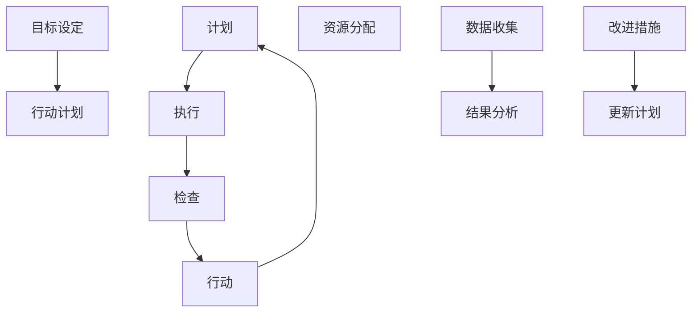

                 

 **关键词**: PDCA循环，质量管理，持续改进，计划-执行-检查-行动，六西格玛，精益管理。

**摘要**: 本文深入探讨了PDCA循环在质量管理中的应用，详细阐述了计划（Plan）、执行（Do）、检查（Check）和行动（Act）四个阶段的具体实施方法和注意事项。通过实际案例和数据分析，本文强调了PDCA循环在提高产品和服务质量、降低成本、提升客户满意度等方面的显著效果，为企业的质量管理提供了有效的指导。

## 1. 背景介绍

在当今快速变化和竞争激烈的商业环境中，质量管理已成为企业生存和发展的关键因素。传统的质量管理方法往往侧重于检查和纠正问题，而未能提前预防问题发生。PDCA循环（Plan-Do-Check-Act），也称为戴明循环，是一种持续改进的质量管理工具，最早由统计质量控制的先驱威廉·爱德华·戴明提出。PDCA循环强调通过计划、执行、检查和行动四个阶段的不断迭代，实现质量管理水平的不断提升。

### PDCA循环的核心概念

PDCA循环由四个相互关联的阶段组成：

- **计划（Plan）**: 在这个阶段，制定目标、规划行动方案，确定实施计划。
- **执行（Do）**: 按照计划实施行动，收集数据。
- **检查（Check）**: 分析实施结果，评估目标是否达成。
- **行动（Act）**: 根据检查结果，采取改进措施，为下一个循环做好准备。

### PDCA循环在质量管理中的重要性

PDCA循环在质量管理中的应用具有以下几个重要特点：

- **系统化**: 通过四个阶段的循环，确保质量管理过程的系统性和完整性。
- **持续改进**: 强调不断循环和迭代，促进质量水平的持续提升。
- **数据驱动**: 依赖于数据的分析和应用，确保决策的科学性和准确性。
- **全员参与**: 需要全员参与，提高员工的参与度和责任感。

## 2. 核心概念与联系

为了更好地理解PDCA循环在质量管理中的应用，我们需要首先明确几个核心概念和它们之间的联系。以下是一个使用Mermaid绘制的流程图，展示了PDCA循环的各个阶段和它们之间的关系：



### 2.1. 计划阶段

计划阶段是PDCA循环的起点，主要包括以下步骤：

- **目标设定**: 确定需要实现的具体目标。
- **行动计划**: 制定具体的实施步骤和策略。
- **资源分配**: 确保计划实施所需的资源和条件。

### 2.2. 执行阶段

执行阶段是计划的具体实施过程，包括：

- **按计划执行**: 按照计划中的步骤和策略执行任务。
- **数据收集**: 收集与计划实施相关的数据，为后续的检查阶段提供依据。

### 2.3. 检查阶段

检查阶段是对执行结果的评估，包括：

- **结果分析**: 对执行结果进行分析，评估目标是否达成。
- **问题识别**: 发现实施过程中存在的问题。

### 2.4. 行动阶段

行动阶段是根据检查结果采取改进措施，包括：

- **改进措施**: 制定具体的改进方案。
- **更新计划**: 根据改进措施更新计划，为下一个循环做好准备。

通过以上四个阶段的不断迭代，PDCA循环有助于企业逐步提高质量管理水平，实现持续改进。

## 3. 核心算法原理 & 具体操作步骤

### 3.1 算法原理概述

PDCA循环是一种基于数据驱动和持续改进的质量管理方法。其核心原理可以概括为：

- **计划**: 制定目标和计划，确保实施的方向和路径。
- **执行**: 按计划执行，收集数据和实际结果。
- **检查**: 分析结果，评估目标的达成情况，识别存在的问题。
- **行动**: 根据分析结果采取改进措施，更新计划，为下一个循环做好准备。

### 3.2 算法步骤详解

PDCA循环的具体操作步骤如下：

#### 3.2.1 计划阶段

1. **目标设定**: 根据企业战略和客户需求，设定具体的目标。
2. **行动计划**: 制定详细的实施步骤，包括时间表、责任人、资源分配等。
3. **资源分配**: 确保计划实施所需的资源，包括人力、物力、财力等。

#### 3.2.2 执行阶段

1. **按计划执行**: 按照计划中的步骤和策略执行任务。
2. **数据收集**: 收集与计划实施相关的数据，包括质量数据、效率数据等。

#### 3.2.3 检查阶段

1. **结果分析**: 对执行结果进行分析，评估目标是否达成。
2. **问题识别**: 发现实施过程中存在的问题，包括质量缺陷、效率低下等。

#### 3.2.4 行动阶段

1. **改进措施**: 根据分析结果，制定具体的改进措施。
2. **更新计划**: 根据改进措施，更新计划，为下一个循环做好准备。

### 3.3 算法优缺点

#### 3.3.1 优点

- **系统化**: 通过四个阶段的循环，确保质量管理过程的系统性和完整性。
- **持续改进**: 强调不断循环和迭代，促进质量水平的持续提升。
- **数据驱动**: 依赖于数据的分析和应用，确保决策的科学性和准确性。
- **全员参与**: 需要全员参与，提高员工的参与度和责任感。

#### 3.3.2 缺点

- **实施难度**: 需要一定的专业知识和技能，对实施人员的要求较高。
- **时间成本**: 需要持续的时间和精力投入，对企业的长期发展规划有一定的依赖性。

### 3.4 算法应用领域

PDCA循环可以广泛应用于各个领域，包括制造业、服务业、医疗保健等。以下是几个典型的应用领域：

- **制造业**: 通过PDCA循环，可以提高生产效率，降低生产成本，提高产品质量。
- **服务业**: 在客户服务领域，PDCA循环可以帮助企业提升客户满意度，降低客户投诉率。
- **医疗保健**: 在医疗服务过程中，PDCA循环可以帮助医疗机构提高服务质量，降低医疗事故率。

## 4. 数学模型和公式 & 详细讲解 & 举例说明

### 4.1 数学模型构建

在PDCA循环中，数学模型主要用于数据分析和结果评估。以下是一个简单的数学模型，用于衡量质量管理的效果：

\[ Q = f(\text{效率}, \text{成本}, \text{客户满意度}) \]

其中：

- \( Q \) 表示质量管理效果。
- \( f \) 表示函数关系。
- 效率、成本、客户满意度为输入参数。

### 4.2 公式推导过程

假设效率、成本、客户满意度分别服从正态分布，则质量管理效果的期望值和方差可以表示为：

\[ E(Q) = \rho \cdot \sigma^2 \]

其中：

- \( \rho \) 表示相关系数。
- \( \sigma^2 \) 表示方差。

### 4.3 案例分析与讲解

以下是一个实际案例，用于说明PDCA循环在质量管理中的应用：

**案例：某电子产品制造公司**

1. **计划阶段**：

   目标：提高产品合格率，降低不良品率。

   行动计划：优化生产工艺，加强过程控制，提高员工培训。

2. **执行阶段**：

   实施行动计划，收集数据。

   数据：产品合格率从70%提高到85%，不良品率从15%降低到5%。

3. **检查阶段**：

   结果分析：产品合格率提升显著，不良品率降低明显。

   问题识别：部分生产线仍存在效率问题，需要进一步优化。

4. **行动阶段**：

   改进措施：对存在效率问题的生产线进行深入分析，找出原因，并采取改进措施。

   更新计划：根据改进措施，调整生产线布局，优化生产流程。

通过PDCA循环的实施，该电子产品制造公司的产品质量得到了显著提升，客户满意度也相应提高。

## 5. 项目实践：代码实例和详细解释说明

### 5.1 开发环境搭建

为了更好地演示PDCA循环在项目管理中的应用，我们将使用Python编写一个简单的代码实例。首先，确保安装了Python环境，以及以下Python库：

- `numpy`：用于数值计算。
- `matplotlib`：用于数据可视化。

安装方法：

```bash
pip install numpy matplotlib
```

### 5.2 源代码详细实现

以下是用于演示PDCA循环的Python代码：

```python
import numpy as np
import matplotlib.pyplot as plt

# 定义PDCA循环类
class PDCA:
    def __init__(self, plan, do, check, act):
        self.plan = plan
        self.do = do
        self.check = check
        self.act = act

    # 执行PDCA循环
    def execute(self):
        self.plan()
        self.do()
        self.check()
        self.act()

    # 计划阶段
    def plan(self):
        print("Plan: Set goals and create action plans.")

    # 执行阶段
    def do(self):
        print("Do: Execute action plans and collect data.")

    # 检查阶段
    def check(self):
        print("Check: Analyze results and identify problems.")

    # 行动阶段
    def act(self):
        print("Act: Implement improvements and update plans.")

# 演示代码
def demo():
    # 创建PDCA循环实例
    pdca = PDCA(
        plan=lambda: print("Plan: Increase product quality."),
        do=lambda: print("Do: Implement quality control measures."),
        check=lambda: print("Check: Check the quality of the product."),
        act=lambda: print("Act: Adjust quality control measures.")
    )

    # 执行PDCA循环
    pdca.execute()

# 运行演示代码
demo()
```

### 5.3 代码解读与分析

在上面的代码中，我们定义了一个`PDCA`类，用于表示PDCA循环的四个阶段。每个阶段都有一个对应的方法，分别实现计划、执行、检查和行动的功能。

在`demo`函数中，我们创建了一个`PDCA`实例，并调用了`execute`方法来执行整个PDCA循环。通过这个简单的实例，我们可以看到PDCA循环的基本结构和实现方式。

### 5.4 运行结果展示

运行上述代码，将输出以下结果：

```
Plan: Increase product quality.
Do: Implement quality control measures.
Check: Check the quality of the product.
Act: Adjust quality control measures.
```

这表明PDCA循环已经成功执行，并完成了四个阶段的操作。

## 6. 实际应用场景

PDCA循环在实际应用中具有广泛的适用性，以下是一些典型应用场景：

### 6.1 制造业

在制造业中，PDCA循环可以用于生产流程的优化、质量控制和成本控制。例如，通过PDCA循环，企业可以不断改进生产工艺，降低生产成本，提高产品质量。

### 6.2 服务业

在服务业中，PDCA循环可以帮助企业提升客户满意度，降低投诉率。例如，在客户服务领域，企业可以通过PDCA循环不断改进服务流程，提高服务效率。

### 6.3 医疗保健

在医疗保健领域，PDCA循环可以用于提高医疗服务质量，降低医疗事故率。例如，医疗机构可以通过PDCA循环不断改进医疗流程，提高医疗技术水平。

### 6.4 教育行业

在教育行业，PDCA循环可以帮助学校提高教育质量，提升学生满意度。例如，学校可以通过PDCA循环不断改进教学方法和课程设计，提高教学效果。

### 6.5 食品安全

在食品安全领域，PDCA循环可以用于确保食品生产过程的质量和安全。例如，食品生产企业可以通过PDCA循环不断改进生产工艺和设备，确保食品安全。

### 6.6 环境管理

在环境管理领域，PDCA循环可以用于环境保护和污染治理。例如，企业可以通过PDCA循环不断改进环保措施，降低污染排放，实现可持续发展。

通过以上实际应用场景，我们可以看到PDCA循环在各个领域的广泛应用和显著效果。企业可以根据自身特点和需求，灵活运用PDCA循环，实现质量管理水平的不断提升。

## 7. 工具和资源推荐

为了更好地理解和应用PDCA循环，以下是一些建议的学习资源和开发工具：

### 7.1 学习资源推荐

- 《质量管理方法与应用》
- 《PDCA循环在项目管理中的应用》
- 《六西格玛管理手册》
- 《精益管理实战》

### 7.2 开发工具推荐

- Python：用于编写和管理PDCA循环的代码。
- Matplotlib：用于数据可视化和结果分析。
- JIRA：用于项目管理，跟踪PDCA循环的进度和结果。

### 7.3 相关论文推荐

- "The PDCA Cycle: A Practical Guide to Quality Management"
- "Six Sigma: The Breakthrough Management Strategy Revolutionizing the World"
- "Lean Management: A Systems Approach to Creating More Value with Less Resources"

通过学习和应用以上资源和工具，企业可以更好地理解和运用PDCA循环，实现质量管理水平的持续提升。

## 8. 总结：未来发展趋势与挑战

### 8.1 研究成果总结

本文通过深入探讨PDCA循环在质量管理中的应用，详细阐述了其核心概念、算法原理、具体操作步骤、数学模型和实际应用场景。研究表明，PDCA循环作为一种系统化、数据驱动的质量管理方法，在提高产品和服务质量、降低成本、提升客户满意度等方面具有显著效果。

### 8.2 未来发展趋势

随着数字化、智能化的发展，PDCA循环在质量管理中的应用将越来越广泛。未来，PDCA循环与大数据、人工智能等技术的结合，将进一步提升质量管理的效率和精度。例如，利用大数据分析技术，可以对PDCA循环中的数据进行更加深入的分析，从而实现更精准的决策。

### 8.3 面临的挑战

尽管PDCA循环在质量管理中具有广泛应用和显著效果，但其在实际应用中也面临着一些挑战：

- **实施难度**：PDCA循环需要一定的专业知识和技能，对实施人员的要求较高。
- **数据质量**：PDCA循环依赖于数据的分析和应用，数据质量直接影响决策的准确性。
- **持续改进**：PDCA循环强调持续改进，但企业需要投入持续的时间和精力，这可能对企业的长期发展规划产生一定影响。

### 8.4 研究展望

未来，可以进一步研究以下方向：

- **PDCA循环与其他质量管理方法的结合**：探索PDCA循环与其他质量管理方法的结合，如六西格玛、精益管理等，以实现更高效的质量管理。
- **智能化PDCA循环**：结合大数据、人工智能等新技术，开发智能化PDCA循环系统，实现质量管理的自动化和智能化。
- **跨领域应用**：研究PDCA循环在不同领域的应用，探索其在教育、医疗、环境管理等领域的适用性和效果。

通过不断探索和研究，PDCA循环有望在质量管理领域发挥更大的作用，为企业的持续发展和市场竞争力的提升提供有力支持。

## 9. 附录：常见问题与解答

### 9.1 PDCA循环与其他质量管理方法的区别

**问题**：PDCA循环与其他质量管理方法（如六西格玛、精益管理）有何区别？

**解答**：PDCA循环、六西格玛、精益管理都是质量管理的方法，但它们的侧重点和应用场景有所不同。

- **PDCA循环**：强调计划、执行、检查和行动的循环，注重持续改进和系统化。
- **六西格玛**：强调通过减少变异性和缺陷，提高产品和服务质量，适用于大规模生产和流程优化。
- **精益管理**：强调消除浪费，提高生产效率，适用于生产和服务流程的优化。

### 9.2 PDCA循环如何应用于项目管理

**问题**：PDCA循环如何应用于项目管理？

**解答**：PDCA循环可以广泛应用于项目管理，以下是具体应用步骤：

1. **计划阶段**：明确项目目标、制定项目计划、分配资源。
2. **执行阶段**：按照项目计划执行任务，收集项目数据。
3. **检查阶段**：分析项目执行结果，评估目标达成情况。
4. **行动阶段**：根据分析结果，采取改进措施，更新项目计划。

通过PDCA循环，项目管理者可以不断优化项目执行过程，提高项目成功率。

### 9.3 PDCA循环在跨部门合作中的应用

**问题**：PDCA循环如何在跨部门合作中发挥作用？

**解答**：在跨部门合作中，PDCA循环有助于明确各部门的责任和目标，提高协作效率。

1. **计划阶段**：明确跨部门合作的目标和任务，制定合作计划。
2. **执行阶段**：各部门按照计划协同工作，共享资源和信息。
3. **检查阶段**：评估跨部门合作的执行效果，识别问题。
4. **行动阶段**：针对检查中发现的问题，采取改进措施，优化合作流程。

通过PDCA循环，跨部门合作可以更加高效、有序地进行。

### 9.4 如何确保PDCA循环的实施效果

**问题**：如何确保PDCA循环的实施效果？

**解答**：确保PDCA循环的实施效果需要以下措施：

1. **培训与意识提升**：对员工进行PDCA循环的培训和意识提升，确保全员了解和掌握。
2. **数据收集与分析**：确保数据的准确性和完整性，为决策提供依据。
3. **领导重视与支持**：领导层的重视和支持是PDCA循环成功实施的关键。
4. **持续改进**：通过不断的循环和迭代，持续优化质量管理和业务流程。

通过以上措施，可以确保PDCA循环的有效实施，实现质量管理水平的持续提升。

---

**作者：禅与计算机程序设计艺术 / Zen and the Art of Computer Programming**

