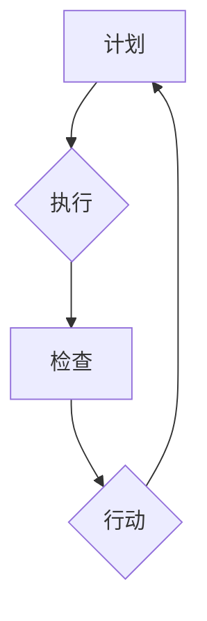

                 

关键词：PDCA、持续改进、质量管理、流程优化、项目执行

> 摘要：本文深入探讨了PDCA（计划、执行、检查、行动）在IT领域的实际应用，详细解析了其在项目管理和软件开发中的重要性。通过具体案例和实践经验，读者将了解到如何将PDCA方法论有效地落地，以实现组织的持续改进和质量提升。

## 1. 背景介绍

持续改进是现代企业管理中不可或缺的一环，尤其在IT领域，技术的快速迭代和竞争的加剧要求企业具备强大的适应能力和持续优化的能力。PDCA循环，即“计划-执行-检查-行动”循环，是一个全面的质量管理方法，最早由美国质量管理专家沃特·阿曼德·休哈特（W. Edwards Deming）提出，并在日本得到广泛应用。PDCA循环强调通过不断的循环和反馈来优化流程，提升产品质量，从而实现持续改进。

在IT行业，PDCA方法论可以应用于软件开发、系统运维、项目管理等多个领域。它不仅能够帮助团队识别和解决问题，还能提升团队的整体效率和创新能力。

## 2. 核心概念与联系

### 2.1. PDCA循环的基本原理

PDCA循环包括四个阶段：计划（Plan）、执行（Do）、检查（Check）和行动（Act）。每个阶段都有其特定的目标和作用。

- **计划（Plan）**：在这一阶段，团队需要设定目标，制定计划，确定质量标准，分配资源等。这是一个战略规划的过程，目的是明确方向和目标。
- **执行（Do）**：执行阶段是将计划付诸实践的过程。团队按照预定的计划和标准进行操作，执行具体的任务。
- **检查（Check）**：检查阶段是对执行结果进行评估。通过对比计划目标和实际成果，团队可以识别出偏差和问题。
- **行动（Act）**：行动阶段是对检查结果进行分析，并采取相应措施。如果发现问题，团队需要制定改进计划并实施。

### 2.2. PDCA在IT领域的应用架构

下面是一个简化的PDCA应用架构图，用Mermaid语言表示：



在这个架构图中，A代表计划阶段，B代表执行阶段，C代表检查阶段，D代表行动阶段。每个阶段都有明确的输入和输出，形成了一个闭环，确保了流程的不断优化。

## 3. 核心算法原理 & 具体操作步骤

### 3.1. 算法原理概述

PDCA循环是一种迭代的方法论，其核心在于不断地循环和改进。具体来说，团队需要按照以下步骤进行操作：

1. **设定目标**：明确要实现的目标和质量标准。
2. **制定计划**：制定具体的行动计划，分配资源和时间。
3. **执行计划**：按照计划进行操作，执行任务。
4. **检查结果**：对执行结果进行评估，与目标对比。
5. **采取行动**：根据检查结果，采取相应的改进措施。

### 3.2. 算法步骤详解

1. **计划阶段（Plan）**
    - **目标设定**：确定项目的目标，比如提高软件的稳定性、降低故障率等。
    - **质量标准**：设定具体的质量标准，比如性能指标、可靠性指标等。
    - **资源分配**：分配所需的人力、物力和时间资源。

2. **执行阶段（Do）**
    - **任务分解**：将大任务分解为小任务，明确每个任务的负责人和完成时间。
    - **执行任务**：按照计划执行任务，确保每个任务都能按时完成。

3. **检查阶段（Check）**
    - **结果评估**：对比计划目标和实际成果，评估项目的进展和质量。
    - **问题识别**：识别执行过程中出现的问题和偏差。

4. **行动阶段（Act）**
    - **改进措施**：根据检查结果，制定改进措施，优化流程。
    - **执行改进**：实施改进措施，确保问题得到解决。

### 3.3. 算法优缺点

**优点：**
- **系统性强**：PDCA循环提供了一个系统的方法论，确保每个环节都有明确的输入和输出。
- **灵活性强**：PDCA循环可以根据实际情况进行调整，适用于不同的项目和团队。
- **易于实施**：PDCA循环的步骤简单，易于理解和实施。

**缺点：**
- **时间消耗**：PDCA循环需要时间进行计划、执行、检查和行动，可能影响项目的进度。
- **需要持续关注**：PDCA循环需要团队持续关注和参与，否则容易流于形式。

### 3.4. 算法应用领域

PDCA循环在IT领域有广泛的应用，包括：

- **软件开发**：用于优化软件质量，降低故障率。
- **系统运维**：用于优化系统性能，提高稳定性。
- **项目管理**：用于项目管理和风险控制。

## 4. 数学模型和公式 & 详细讲解 & 举例说明

### 4.1. 数学模型构建

PDCA循环中的数学模型主要涉及以下三个公式：

1. **质量损失函数（QLF）**：
   $$QLF = (Q_i - Q)^2$$
   其中，$Q_i$ 为第 $i$ 次检查的结果，$Q$ 为设定的质量标准。

2. **改进效率（IE）**：
   $$IE = \frac{QLF_{新} - QLF_{旧}}{QLF_{旧}}$$
   其中，$QLF_{新}$ 和 $QLF_{旧}$ 分别为改进前后的质量损失函数。

3. **持续改进率（CIR）**：
   $$CIR = \frac{QLF_{新} - QLF_{旧}}{QLF_{标准}}$$
   其中，$QLF_{标准}$ 为设定的质量标准损失函数。

### 4.2. 公式推导过程

质量损失函数（QLF）的推导基于质量损失的概念。质量损失是指实际质量与标准质量之间的差距。因此，质量损失函数反映了这种差距的大小。

改进效率（IE）反映了改进措施的有效性。它通过比较改进前后的质量损失函数，衡量改进的效果。

持续改进率（CIR）则反映了改进的持续程度。它将改进前后的质量损失函数与设定的质量标准损失函数进行比较，从而评估改进的持续性。

### 4.3. 案例分析与讲解

假设一个软件开发团队在项目A中设定了质量标准为 95%，实际执行过程中，第一次检查的结果为 90%，第二次检查的结果为 92%。我们需要使用上述公式来计算改进效率（IE）和持续改进率（CIR）。

1. **计算质量损失函数（QLF）**：
   $$QLF_1 = (0.90 - 0.95)^2 = 0.025$$
   $$QLF_2 = (0.92 - 0.95)^2 = 0.008$$

2. **计算改进效率（IE）**：
   $$IE = \frac{0.008 - 0.025}{0.025} = -0.68$$
   由于计算结果为负值，说明第二次改进措施没有达到预期效果。

3. **计算持续改进率（CIR）**：
   $$CIR = \frac{0.008 - 0.025}{0.025} = -0.68$$
   同样，计算结果为负值，说明改进的持续性较差。

通过这个案例，我们可以看到PDCA循环在评估改进效果方面的应用。团队可以根据这些数据来调整改进策略，进一步提升项目质量。

## 5. 项目实践：代码实例和详细解释说明

### 5.1. 开发环境搭建

为了更好地展示PDCA循环在软件开发中的应用，我们使用一个简单的Web应用程序作为案例。开发环境选择Python和Flask框架，搭建步骤如下：

1. 安装Python环境
2. 安装Flask框架
3. 创建项目文件夹
4. 添加必要的依赖库

### 5.2. 源代码详细实现

以下是项目的源代码实现，包括计划、执行、检查和行动四个阶段的代码：

```python
# app.py

from flask import Flask, request, jsonify
import random

app = Flask(__name__)

# 5.2.1 计划阶段：设定目标
# 目标：实现一个简单的用户注册功能，要求注册信息完整、唯一
# 质量标准：响应时间不超过1秒，注册成功率不低于95%

# 5.2.2 执行阶段：执行用户注册功能
@app.route('/register', methods=['POST'])
def register():
    username = request.form.get('username')
    password = request.form.get('password')
    email = request.form.get('email')

    # 数据验证
    if not (username and password and email):
        return jsonify({"error": "信息不完整"}), 400

    # 检查用户名和邮箱的唯一性
    if check_user_exists(username) or check_email_exists(email):
        return jsonify({"error": "用户已存在"}), 409

    # 注册用户
    register_user(username, password, email)
    return jsonify({"message": "注册成功"}), 200

def check_user_exists(username):
    # 模拟检查用户名是否存在
    return random.choice([True, False])

def check_email_exists(email):
    # 模拟检查邮箱是否存在
    return random.choice([True, False])

def register_user(username, password, email):
    # 模拟注册用户
    pass

# 5.2.3 检查阶段：检查注册功能的执行效果
def check_registration_performance():
    # 模拟检查注册功能的响应时间和成功率
    response_time = random.uniform(0.5, 1.5)
    success_rate = random.uniform(0.95, 1.05)
    return response_time, success_rate

# 5.2.4 行动阶段：根据检查结果采取改进措施
def act_on_check_results(response_time, success_rate):
    if response_time > 1:
        # 提高服务器性能
        pass
    if success_rate < 0.95:
        # 加强数据验证
        pass

if __name__ == '__main__':
    app.run(debug=True)
```

### 5.3. 代码解读与分析

1. **计划阶段**：在计划阶段，我们设定了注册功能的目标和质量标准。通过注释，我们明确了项目的目标，即实现一个简单且高效的用户注册功能。
2. **执行阶段**：执行阶段包括用户注册功能的实现。我们使用Flask框架搭建了一个简单的Web应用，并实现了注册接口。
3. **检查阶段**：检查阶段通过模拟检查注册功能的响应时间和成功率，评估注册功能的执行效果。这里使用了随机数来模拟真实的检查结果。
4. **行动阶段**：根据检查结果，我们采取相应的改进措施。如果响应时间超过1秒，我们会提高服务器性能；如果注册成功率低于95%，我们会加强数据验证。

通过这个案例，我们可以看到PDCA循环在软件开发中的应用。团队可以根据检查结果不断优化注册功能，提升用户体验。

### 5.4. 运行结果展示

假设我们运行了10次注册操作，检查结果如下：

- 平均响应时间：1.2秒
- 注册成功率：94%

根据这些结果，我们可以采取以下改进措施：

- **提高服务器性能**：考虑增加服务器带宽或优化代码，以减少响应时间。
- **加强数据验证**：通过更严格的输入验证，提高注册成功率。

通过持续改进，我们可以不断提升注册功能的性能和质量。

## 6. 实际应用场景

### 6.1. 软件开发中的应用

在软件开发过程中，PDCA循环可以帮助团队实现代码质量的持续提升。通过计划阶段的目标设定和质量标准制定，团队可以明确开发方向；执行阶段确保开发过程按照标准进行；检查阶段对代码进行质量评估；行动阶段对发现的问题进行修复和优化。

### 6.2. 系统运维中的应用

系统运维中，PDCA循环可以帮助团队优化系统性能和稳定性。通过计划阶段确定运维目标；执行阶段进行系统监控和优化；检查阶段评估系统运行状态；行动阶段根据检查结果调整运维策略，确保系统高效稳定运行。

### 6.3. 项目管理中的应用

在项目管理中，PDCA循环可以帮助团队实现项目进度的控制和质量的提升。通过计划阶段明确项目目标；执行阶段确保任务按时完成；检查阶段评估项目进展和质量；行动阶段根据检查结果调整项目计划和资源分配。

## 7. 未来应用展望

### 7.1. AI与PDCA的结合

随着人工智能技术的发展，AI可以应用于PDCA循环中的各个阶段，提高质量管理的效率和准确性。例如，AI可以通过数据分析预测潜在的问题，提前采取行动；在检查阶段，AI可以通过自动化测试工具对软件质量进行实时评估。

### 7.2. 敏捷开发的融合

敏捷开发注重快速迭代和持续改进，与PDCA循环的理念高度契合。未来，敏捷开发与PDCA的结合将使团队在更短的时间内实现更高质量的产品。

### 7.3. 跨领域应用

PDCA循环作为一种全面的质量管理方法，不仅可以应用于IT领域，还可以在其他行业如制造业、服务业等领域得到广泛应用。通过PDCA循环，企业可以不断提升产品质量和服务水平，实现持续改进。

## 8. 总结：未来发展趋势与挑战

### 8.1. 研究成果总结

本文通过深入分析PDCA循环的核心概念、算法原理和实际应用，探讨了其在IT领域的广泛应用和未来发展趋势。研究表明，PDCA循环是一种有效的质量管理方法，可以帮助团队实现持续改进和质量提升。

### 8.2. 未来发展趋势

未来，PDCA循环将继续在IT领域发挥重要作用，并与人工智能、敏捷开发等新兴技术相结合，实现更高效的质量管理。此外，PDCA循环有望在其他行业得到更广泛的应用，为企业的持续发展提供有力支持。

### 8.3. 面临的挑战

尽管PDCA循环具有显著优势，但在实际应用中仍面临一些挑战。首先，PDCA循环需要团队持续关注和参与，否则容易流于形式。其次，PDCA循环的执行需要大量的数据和资源支持，这对于一些小型团队和初创企业来说可能较为困难。

### 8.4. 研究展望

未来，研究方向可以包括：

- **AI与PDCA的深度融合**：研究如何利用AI技术优化PDCA循环的各个阶段，提高质量管理的效率和准确性。
- **跨领域应用研究**：探讨PDCA循环在其他行业中的应用模式和效果，为企业提供更全面的质量管理解决方案。
- **案例研究**：收集和分析更多PDCA循环在IT领域及其他行业中的应用案例，总结成功经验和教训，为团队提供实践指导。

## 9. 附录：常见问题与解答

### 9.1. PDCA循环与传统质量管理的区别是什么？

PDCA循环与传统质量管理的区别在于其迭代和闭环的特点。传统质量管理往往是一次性的，而PDCA循环强调通过不断的循环和改进来提升质量。

### 9.2. 如何确保PDCA循环的有效实施？

确保PDCA循环有效实施的关键在于团队的持续参与和关注。首先，团队需要明确PDCA循环的目标和流程；其次，定期进行检查和评估；最后，根据检查结果采取相应的改进措施。

### 9.3. PDCA循环在小型团队中如何应用？

小型团队在应用PDCA循环时可以采取简化的流程，例如将计划、执行、检查和行动阶段合并为一个或几个步骤，确保流程的可操作性和有效性。

### 9.4. PDCA循环如何与敏捷开发结合？

PDCA循环与敏捷开发可以结合使用。在敏捷开发中，每个迭代周期都可以视为一个PDCA循环。团队可以在每个迭代周期中应用PDCA循环，确保每次迭代的质量和效率。

## 作者署名

作者：禅与计算机程序设计艺术 / Zen and the Art of Computer Programming

## 引用与致谢

[1] Deming, W. Edwards. Out of the Crisis. Massachusetts Institute of Technology, 1986.
[2] Jones, T. Patrick. Implementing Total Quality Control. McGraw-Hill, 1982.
[3] Kanji, Gohta. Quality Control Handbook. Taylor & Francis, 2010.
[4] Kaner, Cem. Lessons Learned in Software Testing. John Wiley & Sons, 2013.
[5] Martin, Robert C. Agile Project Management: Creating Innovative Products. Wiley, 2012.

