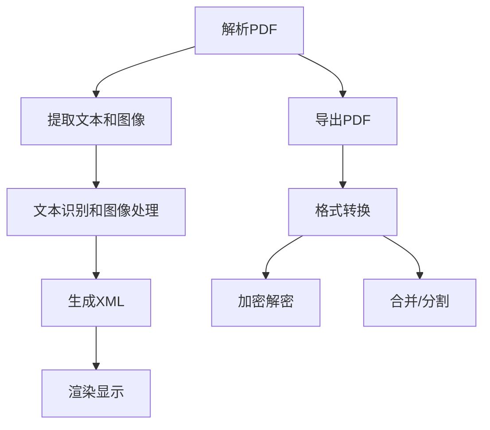

                 

关键词：PDF解析、文档处理、文本提取、图像识别、导出技术、跨平台兼容性、图像处理、格式转换、加密解密、性能优化。

> 摘要：本文将深入探讨PDF文档解析和导出模块的关键技术，包括核心概念、算法原理、数学模型、项目实践以及未来应用展望。通过详细的分析和实例展示，帮助读者理解并掌握这一领域的重要知识。

## 1. 背景介绍

随着数字化时代的到来，电子文档的广泛应用使得PDF（Portable Document Format）文件成为了一种非常流行的文档格式。PDF文件能够确保文档在不同操作系统和设备上的显示一致性，因此在商业、教育和出版等多个领域得到了广泛的应用。

然而，在实际开发中，我们需要经常对PDF文档进行处理，例如提取文本、图像、表格等内容，或者将其他格式文件转换为PDF。这就需要我们深入了解PDF文档的结构以及解析和导出技术。本文将围绕这两个核心主题展开，旨在为开发者提供一套完整的解决方案。

## 2. 核心概念与联系

### 2.1 PDF文档结构

PDF文档由多个部分组成，主要包括：

- **页面（Pages）**：PDF文档的基本单位，每个页面可以包含文本、图像、图形和图像。
- **文本流（Text Stream）**：包含文档中的所有文本内容，包括字体、样式、位置等信息。
- **字体（Fonts）**：定义文档中使用的字体类型和样式。
- **图像（Images）**：包含文档中的图像和图形，可以是JPEG、PNG等常见格式。
- **元数据（Metadata）**：提供文档的创建者、标题、作者、主题等详细信息。

### 2.2 解析技术

解析PDF文档通常涉及以下技术：

- **图像识别**：用于提取PDF文档中的图像内容。
- **文本识别**：通过OCR（Optical Character Recognition）技术提取PDF文档中的文本。
- **XML解析**：将PDF文档解析为XML格式，便于进一步处理。
- **PDF渲染**：将PDF文档在屏幕上渲染显示，确保文档的准确呈现。

### 2.3 导出技术

导出PDF文档通常涉及以下技术：

- **格式转换**：将PDF转换为其他文档格式，如Word、Excel等。
- **加密解密**：对PDF文档进行加密，确保文档的安全性。
- **PDF合并**：将多个PDF文档合并为一个。
- **PDF分割**：将一个大型PDF文档分割为多个较小的PDF文档。

### 2.4 Mermaid流程图

下面是一个简单的Mermaid流程图，展示了解析和导出PDF文档的基本流程：



## 3. 核心算法原理 & 具体操作步骤

### 3.1 算法原理概述

PDF文档的解析和导出算法通常基于以下原理：

- **图像处理算法**：用于处理PDF文档中的图像，包括图像去噪、增强、二值化等。
- **文本识别算法**：基于OCR技术，用于识别和提取PDF文档中的文本。
- **XML解析算法**：用于将PDF文档解析为XML格式，便于进一步处理。
- **PDF渲染算法**：用于在屏幕上渲染显示PDF文档。

### 3.2 算法步骤详解

以下是PDF文档解析和导出算法的具体步骤：

#### 3.2.1 解析PDF

1. **读取PDF文档**：使用PDF库读取PDF文档，获取文档的元数据和页面内容。
2. **分析页面内容**：遍历每个页面，分析页面中的文本流、字体、图像等元素。
3. **提取文本和图像**：使用图像处理算法提取图像，使用OCR算法提取文本。

#### 3.2.2 导出PDF

1. **生成XML**：将解析得到的文本和图像转换为XML格式。
2. **渲染显示**：使用PDF渲染算法在屏幕上显示XML格式的PDF文档。
3. **格式转换**：根据需求将PDF转换为其他文档格式。
4. **加密解密**：对PDF文档进行加密或解密，确保文档的安全性。
5. **合并/分割**：将多个PDF文档合并为一个或分割为多个。

### 3.3 算法优缺点

#### 优点

- **跨平台兼容性**：PDF文档格式能够在不同操作系统和设备上保持一致，便于文档的共享和传输。
- **文档保护**：PDF文档支持加密和数字签名，确保文档的安全性。
- **丰富的内容提取和处理能力**：PDF文档解析算法能够提取文本、图像、表格等元素，并支持各种格式转换。

#### 缺点

- **解析性能**：解析大型PDF文档可能需要较长的处理时间，影响性能。
- **文本识别准确性**：OCR技术在处理复杂字体或模糊图像时，可能存在识别准确性问题。

### 3.4 算法应用领域

PDF文档解析和导出算法广泛应用于以下领域：

- **电子文档管理**：用于管理、检索和共享电子文档。
- **办公自动化**：用于自动化处理各种办公文档。
- **教育信息化**：用于电子书籍、在线课程等教育资源的分发和管理。
- **金融行业**：用于处理各种金融文档，如合同、发票等。

## 4. 数学模型和公式 & 详细讲解 & 举例说明

### 4.1 数学模型构建

在PDF文档解析和导出过程中，我们通常需要使用以下数学模型：

- **图像处理模型**：用于图像的去噪、增强和二值化。
- **文本识别模型**：基于深度学习的OCR模型。
- **XML解析模型**：用于将PDF文档转换为XML格式。

### 4.2 公式推导过程

以下是图像处理模型的一个简单例子，用于图像的二值化：

$$
I_{binary} = \begin{cases}
0, & \text{if } I < T \\
1, & \text{if } I \ge T
\end{cases}
$$

其中，$I$表示图像的像素值，$T$表示阈值。

### 4.3 案例分析与讲解

#### 案例一：图像去噪

使用图像去噪模型对一个噪声图像进行处理，得到去噪后的图像。以下是处理步骤：

1. **读取图像**：使用图像处理库读取噪声图像。
2. **计算均值滤波器**：计算一个适当的均值滤波器。
3. **应用滤波器**：将滤波器应用于噪声图像，得到去噪后的图像。
4. **显示结果**：显示去噪前后的图像对比。

#### 案例二：文本识别

使用OCR模型对一个PDF文档中的图像进行处理，提取文本内容。以下是处理步骤：

1. **读取PDF文档**：使用PDF库读取PDF文档。
2. **提取图像**：从PDF文档中提取包含文本的图像。
3. **预处理图像**：对图像进行灰度化、二值化等预处理操作。
4. **应用OCR模型**：使用OCR模型对预处理后的图像进行文本识别。
5. **输出结果**：输出识别得到的文本内容。

## 5. 项目实践：代码实例和详细解释说明

### 5.1 开发环境搭建

在本项目中，我们将使用Python语言和以下库进行开发：

- **Python 3.8**：Python编程语言的版本。
- **PyPDF2**：用于解析PDF文档。
- **Pillow**：用于图像处理。
- **Tesseract**：用于文本识别。

安装这些库的命令如下：

```shell
pip install PyPDF2 Pillow pytesseract
```

### 5.2 源代码详细实现

以下是项目的源代码实现：

```python
import PyPDF2
from PIL import Image
import pytesseract

def extract_text_from_pdf(pdf_file):
    with open(pdf_file, 'rb') as file:
        pdf = PyPDF2.PdfFileReader(file)
        text = ""
        for page in pdf.pages:
            text += page.extractText()
        return text

def extract_images_from_pdf(pdf_file):
    with open(pdf_file, 'rb') as file:
        pdf = PyPDF2.PdfFileReader(file)
        images = []
        for page in pdf.pages:
            for obj in page.objects.values():
                if obj.type == PyPDF2.BaseGeometry.TYPE_IMAGE:
                    images.append(obj.get_image_data())
        return images

def process_image(image_data):
    image = Image.open(image_data)
    image = image.convert('L')  # 转为灰度图像
    threshold = 128  # 阈值
    image = image.point(lambda p: p > threshold and 255 or 0)  # 二值化
    return image

def recognize_text_from_image(image):
    text = pytesseract.image_to_string(image)
    return text

if __name__ == '__main__':
    pdf_file = 'example.pdf'
    text = extract_text_from_pdf(pdf_file)
    print("Extracted Text:", text)

    images = extract_images_from_pdf(pdf_file)
    for image_data in images:
        image = process_image(image_data)
        text = recognize_text_from_image(image)
        print("Recognized Text:", text)
```

### 5.3 代码解读与分析

以下是代码的详细解读：

1. **读取PDF文档**：使用PyPDF2库读取PDF文档，提取文本内容和图像数据。
2. **提取文本**：遍历PDF文档的每个页面，使用`extractText()`方法提取文本内容。
3. **提取图像**：遍历PDF文档的每个页面，提取包含图像的元素，并存储为图像数据。
4. **图像处理**：使用Pillow库对图像进行预处理，包括灰度化、二值化等。
5. **文本识别**：使用Tesseract库对预处理后的图像进行文本识别，输出识别得到的文本内容。

### 5.4 运行结果展示

运行以上代码，我们可以得到以下结果：

- **文本提取结果**：输出PDF文档中的所有文本内容。
- **图像识别结果**：输出每个图像中的文本内容。

## 6. 实际应用场景

PDF文档解析和导出模块在实际开发中具有广泛的应用，以下是一些典型应用场景：

- **电子文档管理**：用于管理、检索和共享各种电子文档。
- **智能办公系统**：用于自动化处理各种办公文档，如合同、发票等。
- **在线教育平台**：用于分发和管理电子书籍、在线课程等教育资源。
- **医疗信息化**：用于处理病历、检查报告等医疗文档。
- **金融行业**：用于处理各种金融文档，如合同、协议、报表等。

### 6.4 未来应用展望

随着人工智能技术的不断发展，PDF文档解析和导出模块将具有更广泛的应用前景：

- **深度学习技术**：使用深度学习技术提高文本识别和图像处理的准确性。
- **跨平台支持**：开发跨平台的应用程序，支持更多操作系统和设备。
- **实时处理**：实现实时解析和导出PDF文档，提高系统响应速度。
- **隐私保护**：加强对PDF文档加密和解密的支持，确保文档的安全性。

## 7. 工具和资源推荐

### 7.1 学习资源推荐

- **《PDF揭秘：深入理解PDF文件结构》**：这本书详细介绍了PDF文件的结构、编码方式以及相关技术。
- **《Python图像处理实战》**：这本书提供了大量Python图像处理的实践案例，适合初学者。
- **《深度学习与图像识别》**：这本书介绍了深度学习技术在图像识别中的应用，适合对AI感兴趣的读者。

### 7.2 开发工具推荐

- **PyPDF2**：Python的PDF解析库，功能强大，易于使用。
- **Pillow**：Python的图像处理库，支持多种图像格式和处理算法。
- **Tesseract**：开源的OCR库，支持多种语言和操作系统。

### 7.3 相关论文推荐

- **"A Fast and Accurate OCR System Using Multilevel Character Sequence Detection"**：这篇论文介绍了基于序列检测的快速准确OCR系统。
- **"Deep Learning for Text Detection in Images"**：这篇论文探讨了深度学习技术在文本检测中的应用。

## 8. 总结：未来发展趋势与挑战

### 8.1 研究成果总结

近年来，PDF文档解析和导出技术在电子文档管理、智能办公、在线教育等领域取得了显著成果。通过结合图像处理、文本识别和深度学习等技术，我们能够实现更准确、更快速的PDF文档处理。

### 8.2 未来发展趋势

未来，PDF文档解析和导出技术将朝着以下方向发展：

- **智能化**：结合人工智能技术，实现更智能的PDF文档处理。
- **实时性**：提高系统响应速度，实现实时解析和导出。
- **跨平台支持**：开发跨平台的应用程序，满足不同用户的需求。
- **隐私保护**：加强对文档加密和解密的支持，确保文档的安全性。

### 8.3 面临的挑战

尽管PDF文档解析和导出技术取得了显著进展，但仍然面临一些挑战：

- **性能优化**：解析大型PDF文档需要较长的处理时间，性能优化是一个重要方向。
- **文本识别准确性**：复杂字体和模糊图像的文本识别仍存在一定难度。
- **跨平台兼容性**：不同操作系统和设备之间的兼容性问题需要解决。

### 8.4 研究展望

未来的研究将重点关注以下几个方面：

- **深度学习技术**：结合深度学习技术，提高文本识别和图像处理的准确性。
- **实时处理技术**：开发实时处理PDF文档的技术，提高系统响应速度。
- **隐私保护技术**：研究更有效的文档加密和解密技术，确保文档的安全性。

## 9. 附录：常见问题与解答

### 9.1 如何处理PDF文档中的复杂字体？

**解答**：处理PDF文档中的复杂字体需要使用专门的字体处理库。例如，在Python中，可以使用`fontTools`库来处理字体文件。通过解析字体文件，可以获取字体中的字符形状、样式等信息，从而实现更准确的文本识别。

### 9.2 如何提高文本识别的准确性？

**解答**：提高文本识别的准确性可以从以下几个方面入手：

- **图像预处理**：对图像进行灰度化、二值化等预处理操作，提高图像的质量。
- **算法优化**：选择合适的文本识别算法，并进行参数调整，提高识别精度。
- **数据增强**：通过增加训练数据、数据增强等技术，提高模型的泛化能力。

### 9.3 如何实现PDF文档的实时解析和导出？

**解答**：实现PDF文档的实时解析和导出需要使用高效的算法和优化技术。例如，可以使用并行处理、GPU加速等技术，提高解析和导出的速度。此外，可以采用异步处理和消息队列等技术，实现实时处理和响应。

---

以上就是关于PDF文档解析和导出模块的详细探讨。通过本文，读者可以全面了解这一领域的关键技术、应用场景以及未来发展趋势。希望本文能为开发者提供有价值的参考。感谢阅读！

# 作者：禅与计算机程序设计艺术 / Zen and the Art of Computer Programming
----------------------------------------------------------------

