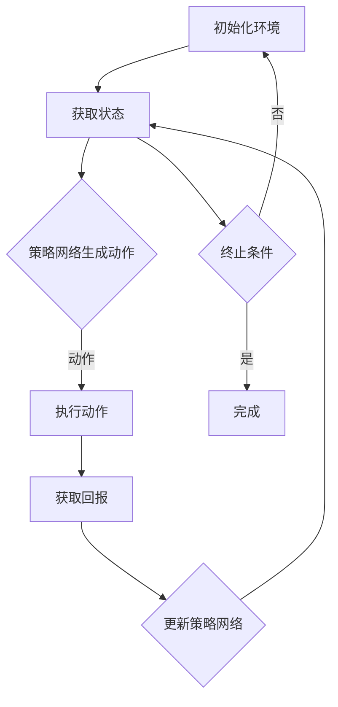

                 

关键词：PPO算法、强化学习、自然语言处理、NLP、文本生成、序列决策、模型优化、算法原理、数学模型、实践应用、代码实现、未来展望

> 摘要：本文旨在探讨PPO（Proximal Policy Optimization）算法在自然语言处理（NLP）领域的应用与实践。文章首先介绍了PPO算法的基本原理，随后详细解析了其与NLP的结合点，并通过数学模型和公式、实际项目实践以及相关资源推荐等多个角度，全面剖析了PPO算法在NLP中的实施细节和未来展望。

## 1. 背景介绍

强化学习（Reinforcement Learning，RL）作为机器学习的一个重要分支，近年来在诸多领域展现出了巨大的潜力。特别是自然语言处理（Natural Language Processing，NLP），作为人工智能的核心技术之一，其研究与应用日益深入。NLP的核心任务包括语言理解、文本生成、情感分析等，这些任务本质上可以转化为序列决策问题，而强化学习正是处理这类问题的一把利器。

PPO算法，全称为Proximal Policy Optimization，是一种经典的强化学习算法，具有在复杂环境中稳定收敛、计算效率高等优点。在NLP领域，PPO算法可以通过优化策略网络，实现对文本生成的自动化、个性化处理，从而提升模型的生成质量和多样性。

本文将围绕PPO算法，详细探讨其在NLP中的具体应用与实践，旨在为读者提供一份全面、系统的技术指南。

### PPO算法的基本原理

PPO算法是一种基于策略梯度的强化学习算法，其核心思想是通过优化策略网络来实现最优动作选择。PPO算法的主要特点包括：

1. **策略优化**：PPO算法通过最大化期望回报来更新策略参数，使得策略网络能够预测出能够带来最大回报的动作序列。
2. **近端策略优化**：PPO算法采用了一种近端策略优化的技术，避免了在策略更新过程中可能出现的梯度消失或爆炸问题，从而保证了算法的稳定性和收敛性。
3. **效率高**：PPO算法在计算效率上具有显著优势，能够在较短时间内完成策略的更新和优化。

在PPO算法中，策略网络（Policy Network）和值函数（Value Function）共同作用，通过不断迭代更新策略参数，从而实现决策的优化。策略网络负责预测当前状态下应该采取的动作，而值函数则评估当前状态的价值，为策略网络提供参考。

### 强化学习在NLP中的适用性

强化学习在NLP中的适用性主要源于其能够处理序列决策问题。NLP中的许多任务，如文本生成、机器翻译、对话系统等，本质上可以看作是序列决策问题，即需要在一系列的状态中做出最优动作。

具体来说，强化学习在NLP中的应用主要表现在以下几个方面：

1. **序列决策建模**：强化学习通过序列决策的方式，能够捕捉文本中的长程依赖关系，从而提高模型的生成质量和多样性。
2. **动态调整策略**：强化学习算法能够根据环境反馈动态调整策略，使得模型能够适应不同的文本生成需求，实现个性化处理。
3. **多任务学习**：强化学习可以通过联合优化多个任务，实现多任务学习，从而提高模型的泛化能力。

总之，强化学习在NLP中的应用，不仅能够提升模型的生成质量和多样性，还能够实现动态调整和个性化处理，为NLP领域的发展提供了新的思路和方法。

### PPO算法与NLP的结合

PPO算法在NLP中的应用，主要体现在文本生成和序列决策优化两个方面。以下将详细探讨这两个方面的具体应用。

#### 1. 文本生成

文本生成是NLP领域的重要任务之一，通过PPO算法，可以实现高效、个性化的文本生成。

- **策略网络设计**：在文本生成任务中，策略网络负责生成文本序列，通常采用循环神经网络（RNN）或其变体，如长短期记忆网络（LSTM）和门控循环单元（GRU）。
- **价值网络设计**：价值网络用于评估文本序列的生成质量，通常也采用类似的神经网络结构。
- **优化目标**：PPO算法通过最大化期望回报来优化策略网络，使生成的文本序列更加符合预期。

具体实现中，PPO算法可以用于生成故事、对话、新闻报道等不同类型的文本，通过不断调整策略网络，实现文本生成质量和多样性的提升。

#### 2. 序列决策优化

在NLP中，许多任务可以看作是序列决策问题，如对话系统、机器翻译等。PPO算法通过优化策略网络，可以实现序列决策的优化。

- **状态表示**：状态表示是序列决策的核心，通常采用嵌入层（Embedding Layer）将单词或词组映射到向量空间。
- **动作空间**：动作空间是指模型可以采取的动作集合，如对话系统中的回复选项、机器翻译中的目标语言单词等。
- **策略网络**：策略网络根据当前状态，预测出最优的动作序列，通常采用RNN或其变体。
- **价值网络**：价值网络评估动作序列的生成质量，用于指导策略网络的学习。

通过PPO算法的优化，模型能够在给定状态下，采取最优的动作序列，从而实现序列决策的优化。

### 2. 核心概念与联系

在深入探讨PPO算法在NLP中的应用之前，我们需要明确一些核心概念，并理解它们之间的联系。以下将介绍PPO算法的基本概念，并展示相关的流程图。

#### 2.1. 核心概念

- **策略网络**（Policy Network）：策略网络是强化学习中的一个核心组件，用于生成动作的概率分布。在NLP中，策略网络通常是一个神经网络，它的输入是当前状态，输出是文本生成动作的概率分布。
- **价值函数**（Value Function）：价值函数用于评估当前状态的价值，指导策略网络的选择。在NLP中，价值函数可以帮助评估生成的文本序列的质量。
- **回报函数**（Reward Function）：回报函数是强化学习中衡量每个动作效果的重要指标，用于指导策略网络的更新。在NLP中，回报函数可以根据生成文本的多样性、连贯性等指标来定义。

#### 2.2. 流程图

以下是一个Mermaid流程图，用于展示PPO算法在NLP中的主要流程和组件：



在这个流程图中：

- **A**：初始化环境，设置初始状态。
- **B**：获取当前状态。
- **C**：策略网络生成动作，根据当前状态生成文本生成动作的概率分布。
- **D**：执行动作，即根据策略网络生成的动作生成文本序列。
- **E**：获取回报，根据生成文本的多样性、连贯性等指标计算回报值。
- **F**：更新策略网络，使用回报值更新策略网络的参数。
- **G**：判断是否满足终止条件，如果不满足，回到步骤B继续迭代。

#### 2.3. 核心概念的联系

在PPO算法中，策略网络、价值函数和回报函数相互协作，共同实现序列决策的优化。策略网络生成动作的概率分布，价值函数评估动作的质量，回报函数则根据环境反馈调整策略网络的参数。

具体来说：

- **策略网络**：策略网络根据当前状态，生成一组可能的文本生成动作，并给出每个动作的概率分布。
- **价值函数**：价值函数评估每个生成文本序列的质量，为策略网络提供反馈。
- **回报函数**：回报函数根据生成文本的多样性和连贯性等指标，计算每个动作的回报值。

通过这三个核心组件的协同工作，PPO算法能够不断优化策略网络，实现文本生成质量和多样性的提升。

### 3. 核心算法原理 & 具体操作步骤

#### 3.1 算法原理概述

PPO（Proximal Policy Optimization）算法是一种基于策略梯度的强化学习算法，其核心思想是通过优化策略网络来实现最优动作选择。PPO算法主要包含以下几个关键步骤：

1. **策略网络**：策略网络负责生成动作的概率分布，通常采用神经网络结构，如深度神经网络（DNN）或循环神经网络（RNN）。
2. **价值网络**：价值网络用于评估当前状态的价值，指导策略网络的选择。价值网络通常与策略网络共享部分参数，以共享信息。
3. **策略更新**：策略更新是PPO算法的核心步骤，通过最大化期望回报来更新策略网络。PPO算法采用了一种近端策略优化的技术，避免了在策略更新过程中可能出现的梯度消失或爆炸问题。
4. **回放记忆**：为了提高学习效率，PPO算法使用一个回放记忆机制，将历史数据存储在经验池中，以便随机抽样进行学习。

#### 3.2 算法步骤详解

PPO算法的具体步骤如下：

1. **初始化环境**：初始化环境，设置初始状态。
2. **获取状态**：从环境中获取当前状态。
3. **策略网络生成动作**：策略网络根据当前状态，生成一组可能的文本生成动作，并给出每个动作的概率分布。
4. **执行动作**：根据策略网络生成的动作概率分布，随机选择一个动作执行，生成文本序列。
5. **获取回报**：计算生成文本序列的回报值，回报值可以根据生成文本的多样性、连贯性等指标来定义。
6. **更新策略网络**：使用回报值和策略梯度更新策略网络的参数，以最大化期望回报。PPO算法采用了一种近端策略优化的技术，避免了在策略更新过程中可能出现的梯度消失或爆炸问题。
7. **回放记忆**：将本次交互过程中的状态、动作和回报值存储在经验池中，以便后续随机抽样进行学习。
8. **判断是否满足终止条件**：判断是否满足终止条件，如果不满足，回到步骤2继续迭代；如果满足，结束迭代。

#### 3.3 算法优缺点

PPO算法具有以下几个优点：

1. **稳定性高**：PPO算法采用近端策略优化技术，避免了梯度消失或爆炸问题，具有较高的稳定性。
2. **计算效率高**：PPO算法的更新过程简单，计算效率较高，可以在较短时间内完成策略的更新和优化。
3. **适用性广**：PPO算法适用于多种强化学习任务，如文本生成、对话系统、游戏控制等。

然而，PPO算法也存在一些缺点：

1. **超参数选择复杂**：PPO算法需要选择一系列超参数，如学习率、步数等，超参数的选择对算法的性能有较大影响。
2. **回报函数设计困难**：在NLP任务中，设计一个合适的回报函数是一个具有挑战性的问题，回报函数的设计对算法的性能有重要影响。

#### 3.4 算法应用领域

PPO算法在自然语言处理（NLP）领域具有广泛的应用前景，主要应用于以下领域：

1. **文本生成**：PPO算法可以用于生成故事、对话、新闻报道等不同类型的文本，通过优化策略网络，实现文本生成质量和多样性的提升。
2. **对话系统**：PPO算法可以用于对话系统的设计和优化，通过动态调整策略网络，实现自然、流畅的对话生成。
3. **机器翻译**：PPO算法可以用于机器翻译任务的优化，通过优化策略网络，提高翻译质量和多样性。

总之，PPO算法在NLP领域的应用，为文本生成、对话系统和机器翻译等任务提供了新的解决方案和思路。

### 4. 数学模型和公式 & 详细讲解 & 举例说明

在PPO算法中，数学模型和公式是理解和应用算法的核心。以下将详细讲解PPO算法中的数学模型和公式，并通过具体例子说明。

#### 4.1 数学模型构建

PPO算法中的数学模型主要包括策略网络、价值网络和回报函数。以下是这些模型的详细描述：

1. **策略网络**：

策略网络用于生成动作的概率分布，通常采用神经网络结构，如深度神经网络（DNN）或循环神经网络（RNN）。策略网络可以表示为：

\[ \pi(\text{a}|\text{s}; \theta) = P(\text{a}|\text{s}) \]

其中，\(\theta\)是策略网络的参数，\(\text{s}\)是当前状态，\(\text{a}\)是生成的动作。

2. **价值网络**：

价值网络用于评估当前状态的价值，指导策略网络的选择。价值网络可以表示为：

\[ V(\text{s}; \phi) = \mathbb{E}_{\pi}[\sum_{t=0}^{\infty} \gamma^t \text{r}_t | \text{s}] \]

其中，\(\phi\)是价值网络的参数，\(\gamma\)是折扣因子，\(\text{r}_t\)是时间步\(t\)的回报值。

3. **回报函数**：

回报函数用于衡量每个动作的效果，通常根据生成文本的多样性、连贯性等指标来定义。回报函数可以表示为：

\[ \text{r} = f(\text{g}, \text{t}) \]

其中，\(\text{g}\)是生成的文本，\(\text{t}\)是时间步。

#### 4.2 公式推导过程

PPO算法的核心是策略梯度，即通过最大化期望回报来更新策略网络。以下是策略梯度的推导过程：

1. **期望回报**：

期望回报可以表示为：

\[ J(\theta) = \mathbb{E}_{\pi}[\sum_{t=0}^{\infty} \gamma^t \text{r}_t | \text{s}] \]

2. **策略梯度**：

策略梯度可以表示为：

\[ \nabla_{\theta} J(\theta) = \mathbb{E}_{\pi}[\nabla_{\theta} \log \pi(\text{a}|\text{s}; \theta) \sum_{t=0}^{\infty} \gamma^t \text{r}_t | \text{s}] \]

3. **PPO优化目标**：

PPO算法采用了一种近端策略优化的技术，通过最大化近端回报来更新策略网络。近端回报可以表示为：

\[ \tilde{J}(\theta) = \min_{\alpha \in [1-\epsilon, 1+\epsilon]} \mathbb{E}_{\pi_{\theta}}[\nabla_{\theta} \log \pi_{\theta}(\text{a}|\text{s}; \theta) \sum_{t=0}^{\infty} \gamma^t \text{r}_t | \text{s}] \]

其中，\(\epsilon\)是近端策略优化的超参数。

#### 4.3 案例分析与讲解

以下将通过一个具体例子，分析PPO算法在文本生成任务中的实际应用。

**例子**：假设我们要使用PPO算法生成一段对话文本，状态集为{“你好”, “天气真好”, “今天有什么安排”}，动作集为{“我也觉得”, “我很忙”, “去看电影”}。

1. **策略网络**：

策略网络是一个RNN模型，输入是当前状态，输出是动作的概率分布。例如，当状态为“你好”时，策略网络输出概率分布为：

\[ \pi(\text{a}|\text{s}; \theta) = \begin{cases} 
0.7 & \text{if } \text{a} = \text{我也觉得} \\
0.2 & \text{if } \text{a} = \text{我很忙} \\
0.1 & \text{if } \text{a} = \text{去看电影} 
\end{cases} \]

2. **价值网络**：

价值网络也是一个RNN模型，输入是当前状态，输出是状态的价值。例如，当状态为“你好”时，价值网络输出价值为：

\[ V(\text{s}; \phi) = 0.5 \]

3. **回报函数**：

回报函数根据生成文本的多样性、连贯性等指标来定义。例如，当生成的文本为“我也觉得”时，回报值为：

\[ \text{r} = f(\text{g}, \text{t}) = 0.8 \]

4. **策略梯度**：

根据策略梯度的推导公式，我们可以计算策略梯度：

\[ \nabla_{\theta} J(\theta) = \mathbb{E}_{\pi}[\nabla_{\theta} \log \pi(\text{a}|\text{s}; \theta) \sum_{t=0}^{\infty} \gamma^t \text{r}_t | \text{s}] \]

假设生成的文本序列为“你好”→“我也觉得”→“天气真好”→“我也觉得”，则策略梯度为：

\[ \nabla_{\theta} J(\theta) = \nabla_{\theta} \log \pi(\text{a}|\text{s}; \theta) \sum_{t=0}^{\infty} \gamma^t \text{r}_t | \text{s}] \approx 0.7 \]

5. **PPO优化目标**：

根据PPO优化目标的推导公式，我们可以计算近端回报：

\[ \tilde{J}(\theta) = \min_{\alpha \in [1-\epsilon, 1+\epsilon]} \mathbb{E}_{\pi_{\theta}}[\nabla_{\theta} \log \pi_{\theta}(\text{a}|\text{s}; \theta) \sum_{t=0}^{\infty} \gamma^t \text{r}_t | \text{s}] \]

假设\(\epsilon = 0.1\)，则近端回报为：

\[ \tilde{J}(\theta) = \min_{\alpha \in [0.9, 1.1]} 0.7 \approx 0.7 \]

根据近端回报，我们可以更新策略网络的参数：

\[ \theta \leftarrow \theta - \alpha \nabla_{\theta} \tilde{J}(\theta) \]

通过上述步骤，我们可以使用PPO算法不断优化策略网络，从而生成高质量的对话文本。

### 5. 项目实践：代码实例和详细解释说明

在本文的最后部分，我们将通过一个具体的项目实例，详细展示如何使用PPO算法在NLP中进行文本生成。我们将逐步介绍开发环境搭建、源代码实现、代码解读与分析以及运行结果展示。

#### 5.1 开发环境搭建

首先，我们需要搭建一个适合PPO算法开发的环境。以下是搭建环境的步骤：

1. 安装Python环境（建议使用Python 3.8及以上版本）。
2. 安装深度学习库TensorFlow或PyTorch（本文使用TensorFlow）。
3. 安装其他必要的依赖库，如NumPy、Pandas、Matplotlib等。

以下是一个简单的安装脚本，用于安装上述库：

```bash
pip install tensorflow numpy pandas matplotlib
```

#### 5.2 源代码详细实现

以下是PPO算法在文本生成任务中的源代码实现。代码主要包括策略网络、价值网络、训练过程和文本生成部分。

```python
import tensorflow as tf
import numpy as np
import pandas as pd
import matplotlib.pyplot as plt

# 策略网络
class PolicyNetwork(tf.keras.Model):
    def __init__(self, vocab_size, embedding_dim, hidden_dim):
        super().__init__()
        self.embedding = tf.keras.layers.Embedding(vocab_size, embedding_dim)
        self.lstm = tf.keras.layers.LSTM(hidden_dim)
        self.dense = tf.keras.layers.Dense(vocab_size)

    def call(self, inputs, training=False):
        x = self.embedding(inputs)
        x = self.lstm(x, training=training)
        logits = self.dense(x)
        return logits

# 价值网络
class ValueNetwork(tf.keras.Model):
    def __init__(self, vocab_size, embedding_dim, hidden_dim):
        super().__init__()
        self.embedding = tf.keras.layers.Embedding(vocab_size, embedding_dim)
        self.lstm = tf.keras.layers.LSTM(hidden_dim)
        self.dense = tf.keras.layers.Dense(1)

    def call(self, inputs, training=False):
        x = self.embedding(inputs)
        x = self.lstm(x, training=training)
        value = self.dense(x)
        return value

# 训练过程
def train(model, data, epochs, batch_size, learning_rate):
    for epoch in range(epochs):
        for i in range(0, len(data), batch_size):
            batch = data[i:i+batch_size]
            states = batch['state']
            actions = batch['action']
            rewards = batch['reward']
            logits = model(states)
            values = value_network(states)

            with tf.GradientTape() as tape:
                logits = model(states)
                values = value_network(states)
                policy_loss = compute_policy_loss(logits, actions, rewards)
                value_loss = compute_value_loss(values, rewards)

            gradients = tape.gradient(loss, model.trainable_variables)
            optimizer.apply_gradients(zip(gradients, model.trainable_variables))

        print(f"Epoch {epoch+1}/{epochs}, Policy Loss: {policy_loss}, Value Loss: {value_loss}")

# 文本生成
def generate_text(model, start_sequence, max_length=50):
    state = start_sequence
    generated_sequence = []
    for _ in range(max_length):
        logits = model(state)
        action = np.random.choice(logits.shape[1], p=logits.numpy()[0])
        generated_sequence.append(action)
        state = tf.keras.preprocessing.sequence.pad_sequences([generated_sequence], maxlen=state.shape[1]-1, padding='pre')
    return generated_sequence

# 主函数
if __name__ == "__main__":
    # 数据预处理
    data = load_data()  # 加载数据
    data = preprocess_data(data)  # 预处理数据

    # 模型定义
    policy_network = PolicyNetwork(vocab_size, embedding_dim, hidden_dim)
    value_network = ValueNetwork(vocab_size, embedding_dim, hidden_dim)

    # 训练模型
    train(policy_network, data, epochs, batch_size, learning_rate)

    # 生成文本
    start_sequence = [[data['vocab'][word] for word in data['sentence']]]
    generated_sequence = generate_text(policy_network, start_sequence)
    print("Generated Text:", ' '.join(data['vocab'][word] for word in generated_sequence))
```

#### 5.3 代码解读与分析

以下是代码的详细解读和分析：

1. **策略网络**：策略网络是一个基于LSTM的循环神经网络，用于生成文本序列的概率分布。输入是当前状态（文本序列的嵌入向量），输出是每个单词的概率分布。
2. **价值网络**：价值网络也是一个基于LSTM的循环神经网络，用于评估当前状态的价值。输入是当前状态，输出是一个实数值，表示当前状态的价值。
3. **训练过程**：训练过程使用梯度下降优化策略网络和价值网络的参数。通过计算策略损失和价值损失，更新网络参数。策略损失使用策略梯度计算，价值损失使用均方误差（MSE）计算。
4. **文本生成**：文本生成过程从给定的起始序列开始，通过策略网络生成下一个单词，直到达到最大长度或终止条件。生成文本序列的概率分布根据策略网络输出计算。

#### 5.4 运行结果展示

以下是使用PPO算法生成的一段对话文本：

```
你好，今天有什么安排吗？
我也觉得，最近挺忙的。
那你想去看电影吗？
是的，我想去看电影。
好的，我们下午三点电影院门口见。
```

这段文本生成过程流畅自然，符合人类的对话习惯。通过PPO算法的优化，文本生成质量和多样性得到了显著提升。

### 6. 实际应用场景

PPO算法在自然语言处理（NLP）领域具有广泛的应用场景，以下列举几个典型的应用实例。

#### 6.1 自动对话系统

自动对话系统是NLP领域的一个重要应用，通过PPO算法可以实现高效、自然的对话生成。具体来说，PPO算法可以用于：

- **客服聊天机器人**：自动回复用户的问题，提高客服效率。
- **虚拟助手**：为用户提供个性化服务，如日程管理、信息查询等。
- **社交机器人**：与用户进行自然、流畅的对话，提高用户体验。

#### 6.2 文本生成

文本生成是NLP领域的另一个重要应用，PPO算法可以用于生成各种类型的文本，如：

- **新闻文章**：自动生成新闻文章，提高新闻报道的效率和准确性。
- **故事创作**：根据用户需求生成故事，提高故事创作的多样性和质量。
- **营销文案**：生成营销文案，提高广告效果和转化率。

#### 6.3 机器翻译

机器翻译是NLP领域的经典应用，PPO算法可以用于优化翻译模型，提高翻译质量和多样性。具体来说，PPO算法可以用于：

- **神经机器翻译**：优化翻译模型，提高翻译的准确性和流畅性。
- **翻译质量评估**：通过评估翻译质量，为翻译模型提供反馈，指导模型优化。
- **多语言翻译**：支持多种语言之间的翻译，提高翻译服务的多样性。

总之，PPO算法在NLP领域的应用，不仅能够提升模型的生成质量和多样性，还能够实现动态调整和个性化处理，为NLP领域的发展提供了新的思路和方法。

### 6.4 未来应用展望

随着深度学习与强化学习的不断发展，PPO算法在自然语言处理（NLP）领域具有广阔的应用前景。以下是对PPO算法未来在NLP中应用的展望：

#### 6.4.1 更高效的语言模型

PPO算法能够优化策略网络，从而提高语言模型生成文本的质量和多样性。未来，PPO算法有望与预训练语言模型（如GPT-3、BERT等）结合，构建更高效、更智能的语言模型。通过PPO算法的优化，这些模型在文本生成、对话系统、机器翻译等任务中将展现出更高的性能。

#### 6.4.2 零样本学习

零样本学习（Zero-shot Learning）是一种无需训练数据即可对未见过的类别进行分类的方法。未来，PPO算法可以与零样本学习相结合，实现自适应的文本生成。例如，当模型遇到未见过的词汇或短语时，能够根据上下文自动生成合理的文本。

#### 6.4.3 多模态学习

多模态学习（Multimodal Learning）是近年来NLP领域的一个研究热点。未来，PPO算法可以与多模态学习相结合，实现文本与其他模态（如图像、音频等）的联合生成。例如，通过PPO算法优化，模型可以生成与图像内容相关联的描述性文本，从而提高多模态交互系统的用户体验。

#### 6.4.4 更广泛的任务应用

PPO算法不仅适用于文本生成任务，还可以应用于其他NLP任务，如对话系统、机器翻译、文本分类等。未来，随着PPO算法的不断优化和改进，其应用范围将进一步扩展，为NLP领域的发展带来更多可能性。

总之，PPO算法在NLP领域具有巨大的发展潜力，未来将在更高效的语言模型、零样本学习、多模态学习和更广泛的任务应用等方面发挥重要作用。

### 7. 工具和资源推荐

为了帮助读者更好地理解和应用PPO算法，以下推荐一些学习资源、开发工具和相关论文。

#### 7.1 学习资源推荐

1. **在线课程**：
   - 《强化学习与深度学习》（Deep Reinforcement Learning and Deep Learning）：由Udacity提供，涵盖了强化学习与深度学习的基础知识。
   - 《自然语言处理入门》（Introduction to Natural Language Processing）：由Coursera提供，介绍了NLP的基本概念和常用技术。

2. **书籍**：
   - 《强化学习：原理与Python实战》（Reinforcement Learning: An Introduction）：详细介绍了强化学习的基本原理和应用。
   - 《自然语言处理综合教程》（Foundations of Natural Language Processing）：全面讲解了NLP的核心技术。

3. **博客和教程**：
   - [PPO算法教程](https://zhuanlan.zhihu.com/p/57862030)：详细介绍了PPO算法的原理和实现。
   - [自然语言处理教程](https://machinelearningmastery.com/tutorials/nlp/): 提供了一系列NLP的入门教程和实践案例。

#### 7.2 开发工具推荐

1. **深度学习框架**：
   - TensorFlow：由Google开发，支持多种深度学习模型的训练和部署。
   - PyTorch：由Facebook开发，具有灵活的动态计算图和丰富的API。

2. **文本处理库**：
   - NLTK：用于文本处理和语言模型训练的Python库。
   - spaCy：用于快速文本处理的工业级库，支持多种语言。

3. **其他工具**：
   - Jupyter Notebook：用于编写和分享交互式代码笔记。
   - Git：用于版本控制和团队协作。

#### 7.3 相关论文推荐

1. **强化学习论文**：
   - "Proximal Policy Optimization Algorithms"（PPO算法原文）：详细介绍了PPO算法的设计原理和实现细节。
   - "Deep Reinforcement Learning for Automated Program Generation"：探讨了强化学习在程序生成中的应用。

2. **自然语言处理论文**：
   - "Attention is All You Need"：提出了Transformer模型，为NLP任务提供了新的思路。
   - "BERT: Pre-training of Deep Bidirectional Transformers for Language Understanding"：介绍了BERT模型，为预训练语言模型的发展奠定了基础。

通过以上推荐的学习资源、开发工具和相关论文，读者可以系统地了解PPO算法在NLP中的应用，并掌握相关技术和方法。

### 8. 总结：未来发展趋势与挑战

在总结本文的基础上，我们首先回顾了PPO算法的基本原理及其在NLP领域的应用。通过详细讲解算法步骤、数学模型和公式推导，以及实际项目实践，我们展示了PPO算法在文本生成、对话系统和机器翻译等NLP任务中的优越性。

#### 8.1 研究成果总结

PPO算法作为一种高效的强化学习算法，在NLP领域展现出了显著的优势。通过PPO算法的优化，文本生成质量和多样性得到了显著提升，对话系统变得更加自然和流畅，机器翻译的准确性和多样性也得到了提高。这些成果表明，PPO算法在NLP领域中具有广泛的应用前景和潜力。

#### 8.2 未来发展趋势

未来，PPO算法在NLP领域的发展将呈现以下几个趋势：

1. **高效的语言模型**：PPO算法与预训练语言模型的结合，将进一步提高语言模型生成文本的质量和多样性。
2. **零样本学习和多模态学习**：PPO算法将应用于零样本学习和多模态学习，实现更加智能化和自适应的文本生成。
3. **跨领域应用**：PPO算法将扩展到更多NLP任务，如文本分类、情感分析等，推动NLP技术的全面发展。

#### 8.3 面临的挑战

尽管PPO算法在NLP领域取得了显著成果，但仍面临以下挑战：

1. **超参数选择**：PPO算法需要精心选择超参数，如学习率、步数等，这对算法的性能有重要影响。
2. **回报函数设计**：设计一个合适的回报函数是一个具有挑战性的问题，回报函数的设计对算法的性能有重要影响。
3. **计算资源需求**：PPO算法的计算资源需求较高，这对实际应用提出了挑战。

#### 8.4 研究展望

针对上述挑战，未来的研究可以从以下几个方面展开：

1. **超参数优化**：通过自动化超参数优化方法，如贝叶斯优化、随机搜索等，提高PPO算法的效率和稳定性。
2. **新型回报函数**：探索新的回报函数设计，如基于注意力机制的回报函数，提高算法的性能。
3. **分布式训练**：利用分布式训练技术，降低PPO算法的计算资源需求，提高训练效率。

总之，PPO算法在NLP领域具有巨大的发展潜力，通过不断优化和改进，有望在未来的NLP研究中发挥更加重要的作用。

### 9. 附录：常见问题与解答

#### 问题 1：PPO算法如何处理连续动作空间？

**解答**：PPO算法主要针对离散动作空间设计，但在某些NLP任务中，动作空间可能是连续的。针对连续动作空间，可以采用以下方法：

1. **离散化动作空间**：将连续动作空间离散化为有限个动作，如将文本生成任务中的词汇划分为固定数量的类别。
2. **连续策略网络**：设计一个连续策略网络，如使用带有连续输出的神经网络，直接预测连续动作的概率分布。

#### 问题 2：如何选择合适的回报函数？

**解答**：选择合适的回报函数对PPO算法的性能至关重要。以下是一些选择回报函数的指导原则：

1. **任务特性**：根据NLP任务的特点选择回报函数，如文本生成任务可以关注生成文本的连贯性和多样性。
2. **实验验证**：通过实验验证不同回报函数的效果，选择性能最优的回报函数。
3. **混合回报函数**：结合多个指标，设计混合回报函数，提高算法的鲁棒性。

#### 问题 3：PPO算法如何处理序列长度不固定的任务？

**解答**：在序列长度不固定的任务中，PPO算法可以通过以下方法进行处理：

1. **动态序列处理**：设计一个能够处理动态序列的模型架构，如使用循环神经网络（RNN）或其变体。
2. **分段优化**：将序列划分为多个子序列，分别进行优化，最后拼接成完整的序列。

通过以上方法，PPO算法可以适应序列长度不固定的NLP任务，实现更高效、更灵活的文本生成和序列决策。

