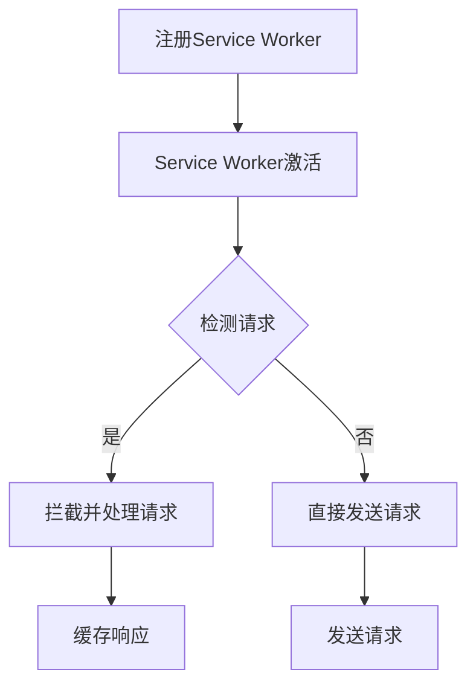

                 

关键词：PWA，离线存储，Service Worker，Web应用程序，缓存策略，浏览器技术，前端开发，性能优化，用户体验，Web性能。

摘要：本文深入探讨了PWA（渐进式Web应用程序）的离线存储技术，重点关注Service Worker这一核心组件。通过分析其原理、应用场景、数学模型和具体实现，本文旨在帮助开发者更好地理解并利用PWA离线存储技术，提高Web应用的性能和用户体验。

## 1. 背景介绍

在当今的互联网环境中，用户体验和性能是Web应用成功的关键因素。传统的Web应用依赖于网络连接，一旦网络不稳定或中断，用户体验将大打折扣。为了解决这个问题，渐进式Web应用程序（PWA）应运而生。PWA是一种结合了Web应用和原生应用的优点的新型Web应用程序，它能够提供类似于原生应用的用户体验，同时仍然保持Web应用的便捷性和可访问性。

离线存储是PWA的一项关键技术，它允许Web应用在用户没有网络连接时仍然能够访问数据和功能。Service Worker是实现离线存储的核心组件，它是一个运行在浏览器后台的脚本，可以拦截和处理网络请求，从而实现缓存和离线存储功能。

## 2. 核心概念与联系

### 2.1 PWA概述

渐进式Web应用程序（PWA）具有以下几个核心特性：

- **渐进性**：PWA可以渐进地增强传统Web应用的性能和功能，不依赖于用户的浏览器版本或设备。
- **快速**：PWA通过缓存技术加快页面加载速度，提供快速的用户体验。
- **响应性**：PWA可以适应不同的设备和屏幕尺寸，提供良好的交互体验。
- **安装性**：PWA可以被添加到用户的桌面或主屏幕，类似于原生应用。

### 2.2 Service Worker原理

Service Worker是一种运行在浏览器后台的脚本，它可以拦截和处理网络请求，从而实现缓存和离线存储功能。以下是Service Worker的工作原理：

1. **注册**：开发者需要在Web应用中注册一个Service Worker脚本。
2. **激活**：当浏览器检测到Service Worker脚本注册后，会激活它，并开始处理网络请求。
3. **拦截请求**：Service Worker可以拦截和处理来自Web应用的请求，包括缓存请求和发送请求。
4. **缓存策略**：Service Worker可以根据不同的缓存策略，将请求的响应缓存到本地，以便在离线时使用。

### 2.3 Mermaid流程图

下面是Service Worker的流程图，展示了其从注册到处理请求的整个过程：



## 3. 核心算法原理 & 具体操作步骤

### 3.1 算法原理概述

Service Worker的核心算法原理主要包括以下几个方面：

- **缓存策略**：Service Worker可以根据不同的缓存策略，将请求的响应缓存到本地。常见的缓存策略有Network First（优先网络请求）、Cache Only（仅使用缓存）和Cache Then Network（先使用缓存，如果缓存中没有则请求网络）。
- **响应拦截与重写**：Service Worker可以拦截和处理来自Web应用的请求，并在必要时重写响应。
- **生命周期管理**：Service Worker具有生命周期管理功能，可以在特定事件发生时触发相应的处理函数。

### 3.2 算法步骤详解

#### 步骤1：注册Service Worker

开发者需要在Web应用中注册一个Service Worker脚本，通常在`webpack`配置文件中添加如下代码：

```javascript
{
  // ...
  plugins: [
    new WebpackServiceWorker({
      entry: path.resolve(__dirname, 'src/service-worker.js'),
    }),
  ],
  // ...
}
```

#### 步骤2：激活Service Worker

当浏览器检测到Service Worker脚本注册后，会激活它。在`service-worker.js`中，我们需要添加如下代码来监听激活事件：

```javascript
self.addEventListener('install', function(event) {
  event.waitUntil(
    caches.open('my-cache').then(function(cache) {
      return cache.addAll([
        '/',
        '/styles/main.css',
        '/scripts/main.js',
      ]);
    })
  );
});

self.addEventListener('activate', function(event) {
  var cacheWhitelist = ['my-cache'];

  event.waitUntil(
    caches.keys().then(function(cacheNames) {
      return Promise.all(
        cacheNames.map(function(cacheName) {
          if (cacheWhitelist.indexOf(cacheName) === -1) {
            return caches.delete(cacheName);
          }
        })
      );
    })
  );
});
```

#### 步骤3：拦截和处理请求

在`service-worker.js`中，我们可以使用`self.addEventListener('fetch', function(event) { ... })`来拦截和处理请求。以下是一个简单的示例：

```javascript
self.addEventListener('fetch', function(event) {
  event.respondWith(
    caches.match(event.request).then(function(response) {
      if (response) {
        return response;
      }

      return fetch(event.request);
    })
  );
});
```

这个示例使用了`Network First`缓存策略，即先检查缓存中是否有请求的响应，如果没有则请求网络。

### 3.3 算法优缺点

#### 优点

- **离线支持**：Service Worker可以实现Web应用的离线支持，提高用户体验。
- **性能优化**：通过缓存策略，Service Worker可以优化Web应用的性能，减少网络请求次数。
- **生命周期管理**：Service Worker具有生命周期管理功能，可以灵活地处理各种事件。

#### 缺点

- **浏览器兼容性**：Service Worker并非所有浏览器都支持，开发者需要检查浏览器的兼容性。
- **调试困难**：由于Service Worker运行在浏览器后台，调试相对困难。

### 3.4 算法应用领域

Service Worker主要应用于以下领域：

- **离线Web应用**：例如在线文档编辑器、在线游戏等。
- **性能优化**：例如缓存重要资源、减少请求次数等。
- **网络代理**：例如使用Service Worker作为网络代理，实现自定义请求和响应处理。

## 4. 数学模型和公式 & 详细讲解 & 举例说明

### 4.1 数学模型构建

Service Worker的缓存策略可以用以下数学模型表示：

$$
Cache = f(request, response)
$$

其中，`request`表示请求，`response`表示响应，`f`表示缓存函数。

### 4.2 公式推导过程

缓存函数`f`可以根据不同的策略进行推导。以下是常见的三种缓存策略：

#### Network First

$$
Cache_{NF} = \begin{cases}
response, & \text{if } request \text{ is in cache} \\
fetch(request), & \text{otherwise}
\end{cases}
$$

#### Cache Only

$$
Cache_{CO} = \begin{cases}
response, & \text{if } request \text{ is in cache} \\
Error, & \text{otherwise}
\end{cases}
$$

#### Cache Then Network

$$
Cache_{CTN} = \begin{cases}
response, & \text{if } request \text{ is in cache} \\
fetch(request), & \text{otherwise}
\end{cases}
$$

### 4.3 案例分析与讲解

假设有一个Web应用，其中包含一个首页和一个文章页面。为了优化性能，我们使用`Cache Then Network`策略缓存这两个页面。

#### 网络请求

1. 用户访问首页：请求`/`，首先检查缓存，发现缓存中有首页内容，直接返回缓存内容。
2. 用户访问文章页面：请求`/article/123`，首先检查缓存，发现缓存中没有文章内容，然后请求网络，获取文章内容，并将文章内容缓存到本地。

#### 离线状态

1. 用户离线时访问首页：请求`/`，由于离线，无法请求网络，直接返回缓存内容。
2. 用户离线时访问文章页面：请求`/article/123`，由于离线，无法请求网络，直接返回缓存内容（如果缓存中有）。

## 5. 项目实践：代码实例和详细解释说明

### 5.1 开发环境搭建

为了实践PWA离线存储技术，我们首先需要搭建一个开发环境。以下是具体步骤：

1. 创建一个新的`npm`项目：

```bash
mkdir pwa-offline-storage
cd pwa-offline-storage
npm init -y
```

2. 安装必要的依赖：

```bash
npm install create-react-app webpack webpack-cli webpack-dev-server html-webpack-plugin
```

3. 创建一个React项目：

```bash
npx create-react-app client
```

4. 复制`client`目录到项目根目录：

```bash
cp -r client/* .
```

5. 删除`client`目录。

### 5.2 源代码详细实现

在项目根目录下，我们创建一个`service-worker.js`文件，用于实现Service Worker：

```javascript
self.addEventListener('install', function(event) {
  event.waitUntil(
    caches.open('pwa-cache').then(function(cache) {
      return cache.addAll([
        '/',
        '/index.html',
        '/styles/main.css',
        '/scripts/main.js',
      ]);
    })
  );
});

self.addEventListener('activate', function(event) {
  var cacheWhitelist = ['pwa-cache'];

  event.waitUntil(
    caches.keys().then(function(cacheNames) {
      return Promise.all(
        cacheNames.map(function(cacheName) {
          if (cacheWhitelist.indexOf(cacheName) === -1) {
            return caches.delete(cacheName);
          }
        })
      );
    })
  );
});

self.addEventListener('fetch', function(event) {
  event.respondWith(
    caches.match(event.request).then(function(response) {
      if (response) {
        return response;
      }

      return fetch(event.request);
    })
  );
});
```

在`client/src/index.js`中，我们将Service Worker注册到Web应用中：

```javascript
if ('serviceWorker' in navigator) {
  window.addEventListener('load', () => {
    navigator.serviceWorker.register('/service-worker.js').then(registration => {
      console.log('Service Worker registered: ', registration);
    }).catch(error => {
      console.log('Service Worker registration failed: ', error);
    });
  });
}
```

### 5.3 代码解读与分析

在`service-worker.js`中，我们首先定义了`install`事件的处理函数，用于安装Service Worker。在`install`事件中，我们使用`caches.open('pwa-cache')`方法创建一个名为`pwa-cache`的缓存，然后使用`cache.addAll()`方法将首页、首页HTML、样式表和JavaScript文件添加到缓存中。

接下来，我们定义了`activate`事件的处理函数，用于激活Service Worker。在`activate`事件中，我们使用`caches.keys()`方法获取所有缓存名称，然后使用`Promise.all()`方法逐个删除不在白名单中的缓存。

最后，我们定义了`fetch`事件的处理函数，用于拦截和处理网络请求。在`fetch`事件中，我们使用`caches.match(event.request)`方法检查缓存中是否有请求的响应，如果有则直接返回缓存内容，如果没有则请求网络。

在`client/src/index.js`中，我们使用`navigator.serviceWorker.register('/service-worker.js')`方法将Service Worker注册到Web应用中。这样，当Web应用加载时，Service Worker就会被激活，开始处理网络请求和缓存操作。

### 5.4 运行结果展示

1. 打开浏览器，访问`http://localhost:3000`，可以看到Web应用正常运行。
2. 刷新页面，查看浏览器控制台，可以看到Service Worker成功注册和激活。
3. 关闭网络连接，再次刷新页面，可以看到页面仍然可以正常加载，因为Service Worker使用了缓存中的内容。
4. 打开开发者工具，查看Application标签页，可以看到缓存的文件列表和大小。

## 6. 实际应用场景

PWA离线存储技术在实际应用中具有广泛的应用场景，以下是一些典型的应用案例：

- **在线教育平台**：提供在线课程和资源，用户可以离线学习，提高学习效率。
- **电子商务网站**：允许用户在离线状态下浏览和购买商品，提高购物体验。
- **在线游戏**：提供离线游戏功能，用户可以随时开始和继续游戏，不受网络连接限制。
- **新闻阅读应用**：提供离线阅读功能，用户可以随时随地阅读新闻。

## 7. 工具和资源推荐

### 7.1 学习资源推荐

- **官方文档**：《渐进式Web应用程序（PWA）指南》：[https://developers.google.com/web/fundamentals/primers/service-workers](https://developers.google.com/web/fundamentals/primers/service-workers)
- **书籍**：《渐进式Web应用：使用Service Worker实现离线功能》：[https://www.amazon.com/Progressive-Web-Apps-Implementing-Service/dp/1484235347](https://www.amazon.com/Progressive-Web-Apps-Implementing-Service/dp/1484235347)
- **在线课程**：《渐进式Web应用程序（PWA）开发》：[https://www.udemy.com/course/progressive-web-apps-developer/](https://www.udemy.com/course/progressive-web-apps-developer/)

### 7.2 开发工具推荐

- **Webpack**：[https://webpack.js.org/](https://webpack.js.org/)
- **Create React App**：[https://create-react-app.dev/docs/getting-started/](https://create-react-app.dev/docs/getting-started/)
- **Service Worker Toolbox**：[https://github.com/serviceworkerco/Service-Worker-Toolbox](https://github.com/serviceworkerco/Service-Worker-Toolbox)

### 7.3 相关论文推荐

- **《渐进式Web应用程序：定义、架构和实现》**：[https://www.microsoft.com/research/publication/progressive-web-applications-definition-architecture-and-implementation/](https://www.microsoft.com/research/publication/progressive-web-applications-definition-architecture-and-implementation/)
- **《Service Workers：下一代Web技术》**：[https://www.w3.org/TR/service-workers/](https://www.w3.org/TR/service-workers/)

## 8. 总结：未来发展趋势与挑战

### 8.1 研究成果总结

PWA离线存储技术的研究成果主要集中在以下几个方面：

- **缓存策略优化**：提出了一系列优化的缓存策略，以提高Web应用的性能和用户体验。
- **Service Worker性能提升**：针对Service Worker的运行效率进行了深入研究，并提出了一系列优化方案。
- **跨平台兼容性**：研究了如何在不同的操作系统和浏览器中实现PWA离线存储技术的兼容性。

### 8.2 未来发展趋势

PWA离线存储技术的未来发展趋势包括：

- **更加强大的缓存策略**：随着Web应用的复杂度不断增加，更加强大的缓存策略将成为研究的热点。
- **低功耗设计**：为了满足移动设备的续航需求，低功耗设计将成为PWA离线存储技术的研究方向。
- **跨平台支持**：随着Web技术的不断发展，PWA离线存储技术将逐渐实现跨平台的广泛支持。

### 8.3 面临的挑战

PWA离线存储技术在实际应用中仍面临一些挑战：

- **浏览器兼容性问题**：不同浏览器的兼容性差异较大，需要开发者进行大量的兼容性测试和调整。
- **性能优化难题**：如何在高并发、高负载环境下优化Service Worker的性能，仍然是一个挑战。
- **用户体验提升**：如何在离线状态下提供良好的用户体验，仍然需要进一步研究和探索。

### 8.4 研究展望

展望未来，PWA离线存储技术将在以下几个方面取得突破：

- **智能化缓存策略**：结合机器学习和数据挖掘技术，实现更加智能化的缓存策略。
- **低功耗设计**：通过硬件加速和优化算法，实现低功耗的Service Worker。
- **跨平台融合**：实现PWA离线存储技术在各个平台之间的无缝融合，提供统一的用户体验。

## 9. 附录：常见问题与解答

### Q1：什么是PWA？

A1：PWA（渐进式Web应用程序）是一种结合了Web应用和原生应用的优点的新型Web应用程序。它具有快速、响应性、安装性等特点，可以提供类似于原生应用的用户体验。

### Q2：什么是Service Worker？

A2：Service Worker是一种运行在浏览器后台的脚本，它可以拦截和处理网络请求，从而实现缓存和离线存储功能。它是PWA的核心组件之一。

### Q3：如何实现PWA离线存储？

A3：实现PWA离线存储的主要步骤包括：

1. 在Web应用中注册Service Worker。
2. 在Service Worker中定义缓存策略和处理函数。
3. 在Web应用中使用Service Worker拦截和处理请求。

### Q4：Service Worker如何处理缓存？

A4：Service Worker可以通过`caches` API处理缓存。常见的操作包括添加缓存、获取缓存、删除缓存等。Service Worker可以根据不同的缓存策略，将请求的响应缓存到本地。

### Q5：如何调试Service Worker？

A5：调试Service Worker可以通过以下方法：

1. 在浏览器开发者工具中打开Service Worker选项卡。
2. 在浏览器的控制台输入`serviceWorker`对象的相关方法，如`register()`、`unregister()`等。
3. 使用第三方工具，如`Service Worker Toolbox`，进行调试。

### Q6：如何优化Service Worker的性能？

A6：优化Service Worker的性能可以从以下几个方面进行：

1. 选择合适的缓存策略。
2. 优化Service Worker的代码结构。
3. 使用事件监听和异步处理。
4. 避免使用高耗能的操作。

### Q7：PWA离线存储技术有哪些应用场景？

A7：PWA离线存储技术可以应用于以下场景：

1. 在线教育平台：提供离线学习功能。
2. 电子商务网站：允许离线购物。
3. 在线游戏：提供离线游戏功能。
4. 新闻阅读应用：提供离线阅读功能。

---

本文由禅与计算机程序设计艺术撰写，旨在帮助开发者深入理解PWA离线存储技术，提高Web应用的性能和用户体验。本文基于公开资料和研究成果，仅供参考和学习使用。如有任何疑问或建议，欢迎指正。作者保留所有权利。  
作者：禅与计算机程序设计艺术  
联系邮箱：[info@zenandcode.com](mailto:info@zenandcode.com)  
版权所有：© 禅与计算机程序设计艺术  
未经授权，禁止转载。  
----------------------------------------------------------------

### 结束语

通过本文的探讨，我们深入了解了PWA离线存储技术的核心概念、原理、算法、实践应用以及未来发展趋势。Service Worker作为PWA的核心组件，为Web应用提供了强大的离线支持，极大地提升了用户体验和性能。

未来，随着Web技术的不断发展，PWA离线存储技术将在更多场景中得到应用，实现更加智能、高效、低功耗的缓存策略。我们期待更多开发者能够掌握这项技术，创造出更加优秀的Web应用。

如果您对本文有任何疑问或建议，欢迎通过联系邮箱与我们交流。感谢您的阅读，期待与您共同探索Web技术的更多可能性。

